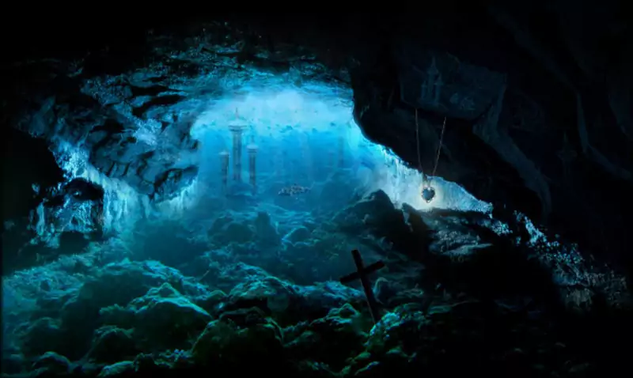

# El Caribe de los Mitos

## Bienvenidos al Caribe de 1722

Estás en 1722 en el Caribe. La conocida como Edad de Oro de la piratería está acabando. Los grandes piratas han muerto o se han retirado y los grandes tesoros se han enterrado para que los busquen durante generaciones. Las potencias europeas han "civilizado y apaciguado" el Caribe y expolian sus recursos. El azúcar, el tabaco y el café fluyen desde las plantaciones de las grandes islas del Caribe, llenando las arcas de los gobiernos europeos, mientras las gentes del Caribe sobrevive como puede.

Mientras, entre las sombras, una antigua y diabólica sociedad secreta lleva décadas moviendo los hilos de la política y la economía para conseguir su objetivo: El surgimiento de entre las aguas de R'lyeh, la ciudad sumergida donde yace el gran Cthulhu.

Esta sociedad, autodenominada como la Orden del Gran Cthulhu, y su brazo público y legal, la Real Compañía Privilegiada del Caribe (RCPC), no tiene ningún tipo de escrúpulo en asesinar, torturar, robar, chantajear e incluso hacer pactos con demoníacas entidades extraplanares para lograr sus objetivos.

Gracias a sus casi infinitos recursos económicos, los conocimientos mágicos de sus adeptos y la tecnología conseguida de razas extraterrestres han conseguido imponerse en todo el Caribe, haciendo caer ciudades, destruyendo armadas enemigas sin plantar batalla y poniendo a sus títeres en los principales puestos políticos de los diferentes gobiernos del Caribe.

Solo el anárquico mundo de la piratería ha logrado evadir sus tentáculos y es por ello que son los únicos que han empezado a ver lo que realmente está pasando en el Caribe y empiezan a vislumbrar que busca el Culto.

Unas pocas personas, casi todas piratas o con pasado pirata, conocen el terrible secreto que se esconde detrás de la Orden del Gran Cthulhu. Estos valientes han creado la Hermandad del Sargazo que busca desbaratar los planes del culto y hacer que paguen por sus múltiples crímenes.

## La Orden del Gran Cthulhu

La Orden del Gran Cthulhu es tan vieja como la propia civilización humana, siempre escondida en las sombras con planes para liberar a su señor. La Orden ha tenido sus momentos de gracia o, como en el siglo XVII, ha sufrido grandes crisis, de las cuales siempre se ha levantado más fuerte, como en la actualidad.

Se cree que el culto nació en algún lugar del interior de la India durante del periodo Védico (entre el 3000 y el 2000 a.C). Un gurú sensible a las ondas mentales de Cthulhu empezó a tener visiones del que sería su señor. Esas visiones las convirtió en enseñanzas que ofreció a sus estudiantes.

La extraña disciplina se fue extendiendo durante décadas, calando en los que como el gurú eran más sensibles y los parias expulsados de la sociedad, creando un culto de adoradores de Cthulhu. Para sus primeros ídolos representando a Cthulhu usaron versiones distorsionadas de Ganesha (el dios con cabeza de elefante) representándolo con alas de águila y con múltiples trompas de elefante simulando su cabeza de octópodo.

El comercio hizo que la secta extendiera a Europa durante la época de la Roma Imperial. El culto se extendió rápidamente por el Mediterráneo, ya que sus adeptos eran apoyados por tribus profundas que les ayudaban a prosperar con oro y otros materiales valiosos del fondo del mar.

Durante siglos la Orden fue expandiéndose poco a poco, según los europeos extendían su poder por todo el globo. Con cada nuevo territorio el mundo era más grande y se hacía más complicado para la secta encontrar la ciudad sumergida de su señor.

A su vez fue institucionalizándose, creando conclaves, jerarquías, mandamientos, ceremonias y rituales y fue consiguiendo más y más poder, pero siempre en las sombras.

### La familia Villalba

La familia Villalba tiene una larga tradición como adoradores de Cthulhu. Lo han sido desde que en 1323 un antepasado de Hernando, que era pescador en Peñíscola, recibiera de un líder profundo una gran pepita de oro. A esa pepita le siguieron otras. Rápidamente, la familia se emparentó con los profundos y empezó a adorar al gran Cthulhu.

Con los años la familia prosperó económica y socialmente hasta obtener de los reyes de Aragón un título nobiliario. En un par de generaciones las creencias de la numerosa familia y sus siervos llamaron la atención de la Orden del Gran Cthulhu que los incluyo como un poderoso recurso en el Mediterráneo Occidental.

Pronto el cabeza de la familia Villalba paso a tener un puesto en el círculo interior de la Orden y durante 300 años los Villalba aumentaron su poder tratando con entidades de los Mitos y decidieron el destino de Europa y sus territorios colonizados.

Los Villalba hicieron y deshicieron a su gusto con la ayuda del dinero y la magia que les proporcionaba de la Orden, hasta que en 1629 fueron apresados, juzgados y ejecutados por la Santa Inquisición Romana. Se les acusó de brujería, mezclar su sangre con demonios y rezar a dioses paganos. Los Villalba intentaron pedir ayuda a la Orden, pero esta prefiero amputar la extremidad gangrenada para evitar problemas.

A pesar de esto, muchos de los socios de la Orden cayeron poco a poco como fichas de dominó y la Orden casi desaparece.

### Hernando de Villalba

Solo sobrevivió un adolescente, Hernando de Villalba, que huyo a la costa sur de Cuba para ponerse fuera del alcance de la Inquisición. En su huida logro poner a salvo varios libros y reliquias prohibidas de su familia.

Con el poco dinero que se pudo llevar montó una pequeña explotación pesquera siguiendo la tradición de la familia. Y como era tradición familiar, un líder profundo de la tribu N'gha syha'h terminó acercándosele seguramente por la sangre profunda que corre por sus venas.

Primero lleno sus redes de peces haciéndole ganar mucho dinero y poco a poco ofreciendo resto de tesoros hundidos o metales preciosos. En unos 10 años el poder de un Hernando ya adulto fue creciendo tanto económicamente como en poder mágico.

Llegado el momento volvió a España y luego viajó por toda Europa reuniendo a los adeptos desperdigados de la Orden. Se consagró como sumo sacerdote de la nueva Orden y les ofreció un nuevo credo basado en que R'lyeh estaba sepultado bajo las aguas del Caribe y que cuando su señor se despierte les otorgará la inmortalidad, parte de su poder y la Tierra como su dominio. Muchos se unieron a él y a algunos les ordeno quedarse en Europa como espías y otros volvieron con él al Caribe.

La empresa de pesca empezó a expandirse por todas las islas controladas por el Reino de España y a tener delegaciones comerciales en las islas controladas por las otras potencias europeas. Y con ella, los sectarios de la Orden se fueron expandiendo por todo el Caribe como directores de casas comerciales, capitanes de barco, incluso políticos y militares. Y así es como la Orden fue extendiendo sus tentáculos.

En 1689 se funda la Compañía de Comercio del Caribe. La pequeña empresa pesquera ahora era una potencia comercial que manejaba más del 30% del comercio del Caribe. En pocos años con la aprobación del rey de España se convierte en la Real Compañía Privilegiada del Caribe, con Hernando como la persona más rica y poderosa del Caribe.

Desde hace unos 15 años, Hernando se ha retirado de la vida pública y de la empresarial. Solo se dedica, desde su mansión a las afueras de La Habana, a dirigir la Orden y a llevar a cabo sus planes para levantar R'lyeh de las aguas y despertar a Cthulhu.

### La Real Compañía Privilegiada del Caribe

La Real Compañía Privilegiada del Caribe (RCPC) tiene, como bien dice su nombre, privilegios en todos los territorios del Caribe controlados por España. Esta empresa tiene el control de todo el comercio entre España y el Caribe español. Nada entra o sale del Caribe sin pasar por sus barcos tras haber pagado diferentes impuestos y tasas.

Debido al apoyo del gobierno de España y a que controla la mayoría del comercio del Caribe tiene gran poder en la zona pudiéndose considerar que el director de cada casa comercial que hay en cada isla del Caribe es casi más poderoso que los propios gobernadores de las islas.

Es tanto su poder que tiene su propia armada de barcos, su propio ejército y sus propias instalaciones militares y si eso no fuera poco, cuenta con el apoyo y la protección de la Armada Española.

#### La verdad detrás de la RCPC

Bajo una capa de legalidad y otra de prosperidad económica se esconde la auténtica realidad de la RCPC, la secta de la Orden del Gran Cthulhu. Toda la cúpula de la compañía son cultistas de gran poder de la Orden. Según se bajan escalafones de la RCPC dejan de ser sectarios para ser adeptos al culto y en lo más bajo son simples trabajadores alineados que hacen su trabajo sin tratar de ver si sus actos y los actos de sus superiores son buenos o malos.

La RCPC se encarga de proporcionar dinero y poder político a la Orden. Pero también le suministra tecnología, por ejemplo, hay varios departamentos de la RCPC desarrollando ingenios para encontrar la hundida ciudad de R'lyeh. Otra de sus tareas más importante es preparar el terreno para todas las actividades de la Orden. No será la primera vez que la RCPC tiene que sobornar a agentes de ley o compra un islote y desalojar a sus habitantes para montar un punto de invocación en él.

La RCPC también se encarga de conseguir gente para la secta, los de "recursos humanos" buscan a las personas perfectas de dentro y fuera de la organización y los seducen con sus cantos de sirenas. Les ofrecen dinero, poder o cumplen sus deseos más perversos, lo que sea con tal de acercarlos a la Orden.

El trabajo más costoso de todos es la ocultación de las actividades y el silenciamiento de testigos. La RCPC se encarga de deshacerse de cadáveres de humanos y de no humanos, de intimidar a familiares que hacen muchas preguntas, de limpiar los destrozos de seres descontrolados y de explosiones desafortunadas o, por último, de sobornar a jueces que podrían desvelar los asuntos de la Orden.

En resumen, la RCPC es una gran máquina de hacer dinero y controlar a la gente para que la Orden pueda hacer lo que tenga que hacer para despertar a Cthulhu y este le otorgue a Villalba la inmortalidad que tanto anhela.

#### Los tentáculos de la RCPC

La RCPC tiene cuatro ramas o más correctamente cuatro tentáculos que se extienden por todo el Caribe. Cada una tiene unos recursos y unos métodos propios, pero un único objetivo, la supremacía en la sombra de la Orden en todo el Caribe y la consecución de sus objetivos.

No todos los tentáculos tienen el mismo poder, según las zonas puede tener uno u otro más importancia o menos o incluso no existir.

##### El tentáculo comercial

El tentáculo comercial es la base sobre la que se asienta toda la RCPC. Su principal misión es generar los recursos necesarios para el resto de actividades de la RCPC y de la Orden. Sin su trabajo, todo el resto de la organización sería imposible.

La rama comercial es la cara más visible de la organización, son sus barcos, sus almacenes, sus oficinas, sus jefes de sucursal y sus miles de empleados. Sin embargo, es la que menos conexión tiene con la Orden. La mayoría de sus empleados son trabajadores que realmente no saben para quién trabajan realmente. Solo los altos directivos de la rama saben de la Orden y sus planes.

Sus ingresos vienen principalmente de que son intermediarios en casi todas las transacciones comerciales del Caribe español. Cualquier producto del Caribe que llega a España seguramente ha sido guardado en los almacenes de la RCPC o transportado por un barco de carga de la RCPC.

Como compañía privilegiada, Además, puede imponer un canon en los puertos que controla a los productos que no usan sus servicios. Es por ello que el contrabando de productos caros como el ron se ha convertido en algo común en el Caribe.

El contrabando y los ataques de piratas a sus barcos es lo que permitió a la RCPC solicitar y conseguir de la corona de España poder tener su propia de flota de barcos de combate. Esta flota está compuesta de buques de guerra que protegen sus convoyes y sus puertos y de barcos guardacostas que controlan el contrabando.

A pesar de que la rama comercial genera cantidades ingentes de dinero, nunca hay suficiente para llevar a cabo los locos planes de Hernando Villalba y ha tenido muchas veces que empezar a trabajar en operaciones ilegales.

##### El tentáculo científico y mágico

El tentáculo científico mágico es el tercero en tamaño, pero todas las demás se nutren de él y sus descubrimientos. La rama militar usa muchos de sus desarrollos para combatir a los enemigos de la RCPC y la propia Orden les hace pedidos exclusivos para ellos. Empezó como una forma de aumentar los beneficios de la empresa, mejorando sus productos y sus métodos de fabricación, y terminó siendo lo que es hoy, un grupo de científicos locos y fanáticos que no tienen ningún escrúpulo en hacer realidad los deseos de la Orden.

La mayoría de las actividades de esta rama relacionadas con la magia o los Mitos suelen hacerse en pequeños laboratorios secretos que no llamen mucho la atención o estén alejados de los centros urbanos. Su principal problema es que muchas veces no tienen ningún tipo de cuidado con sus proyectos y esto suele afectar a su entorno y a la gente que vive cerca.

Puede que se escapen algunos de sus experimentos biológicos o que extrañas energías extradimensionales corrompan la flora y la fauna cercana. Los experimentos más científicos y seguros suelen dejarlos en sitios como el castillo del Morro o el Real Astillero de La Habana, donde se diseñan, crean e instalan las modificaciones monstruosas a los barcos.

Uno de los mayores activos de la rama científica es Onofre de las Torres, que ha desarrollado varios ingenios muy útiles para la RCPC. Lo tienen controlado y protegido sin que él lo sepa para no perturbarlo en su trabajo y en su día a día.

##### El tentáculo militar y de espionaje

La RCPC es una potencia militar en sí misma, tan importante como el reino de España o Gran Bretaña. Tiene una gran cantidad de combatientes, armas y barcos. Su crecimiento ha sido muy sutil y si las potencias europeas hicieran cuentas de su tamaño actual se asustarían. Empezó siendo pequeños grupos de guardias para proteger almacenes y barcos de escolta para los convoyes comerciales. Cuando consiguió el control de todo el comercio del Caribe español, pidió permiso para tener más medios (personas y barcos) para controlar la piratería y el contrabando. Estableció oficinas y cuarteles en los grandes puertos y barcos que patrullaban los puertos menores.

Su gran avance fue cuando consiguió el control del Castillo del Morro en la entrada del puerto de La Habana. Esto les daba el control del puerto más importante del Caribe y una fortificación casi inexpugnable en la que proteger los elementos más importantes de la Orden.

El tentáculo militar se encarga de las tareas de defensa de instalaciones, barcos y personas importantes de la RCPC. Muy pocas veces se lanza al ataque contra alguna persona o grupo, aunque ha habido algunos casos como matanzas de taínos o colonos para quedarse con sus tierras.

La mayoría de las personas que integran esta rama son simples asalariados o mercenarios que cumplen con su trabajo y obedecen órdenes. Solo los cargos superiores, capitanes de barcos y de la guardia, son parte de la Orden. Hay un par de unidades completamente integradas con fanáticos de la Orden que se usan para esas tareas de ataque y exterminio.

También se encargan de la protección de las instalaciones más importantes de la Orden y los sectarios de más alto rango. De hecho, los más diestros y fanáticos de este tentáculo están como guardias de la Mansión Villalba y del castillo del Morro.

A la cabeza de esas unidades fanáticas está Edward Teach y la tripulación de su barco, el «Desgracia», que se encarga de los más sucios y horribles trabajos.

Una pequeña sección se encarga del espionaje y si fuera necesario asesinato. LA RCPC tiene una red de espías y asesinos que se encarga de tener controlada la competencia.

##### El tentáculo propagandístico

El tentáculo propagandístico se encarga de controlar la opinión pública para que las verdaderas actividades de la RCPC y la Orden no salgan a la luz. También trabaja hundiendo la reputación de los enemigos de la Orden y prepara el terreno a futuras sublevaciones y linchamientos, calentando los ánimos de la gente.

Son relativamente pocos, habiendo 3 o 4 en cada ciudad y llegando a 10 o 12 en grandes ciudades como La Habana. Suelen ser personas con don de gentes y a diferencia de otros tentáculos, no suelen pertenecer a la RCPC, para mantener sus tapaderas. Tienen profesiones y oficios ficticios y cobran bajo cuerda.

Otra diferencia con otras ramas es que todas las personas que lo integran son integrantes de la Orden de más o menos nivel que conocen y acepta su credo. También son mucho más fanáticos y seguramente morirían por la causa o se suicidarían antes de dejarse atrapar.

Un importante recurso que han estado usando los últimos años es Edward Teach. La simple mención de su nombre llena de terror el corazón y ver su bandera es casi una sentencia de muerte. Aunque este infame pirata forma parte de la rama militar, ha sido usado por esta rama de muchas maneras, por ejemplo, para asustar a campesinos y hacerlos huir de sus casas, cuando necesitaban hacer trabajos sin testigos.

De hecho, la fama y la imagen de Barbanegra ha sido trabajada desde que se "unió" a la Orden para infundir miedo y justificar muchas de sus actividades. Muchos de los ataques menores de Teach son en realidad falsa propaganda para aumentar la mala fama del pirata.

Actualmente, están centrando sus recursos en dos puntos del Caribe; las islas del Caribe danés, donde preparan una revolución de esclavos por si fuera necesario. El otro punto es la costa frente Tortuga, llenándola de granjeros muy religiosos. Tienen a predicadores difundiendo entre sus feligreses que esa zona es rica y fértil y que es labor de un buen católico el cristianizar a sus indígenas y combatir a los piratas demoníacos de Tortuga. La idea es hacer que los piratas de Tortuga disfruten cada vez de las ventajas de la civilización y el capitalismo, primero saqueando cerca de casa y luego comerciando y que abandonen poco a poco las costumbres piratas.

### Organigrama de la empresa

La RCPC sigue la estructura piramidal de la secta que la creo. Eso supone que, salvo escasas excepciones, las personas más arriba en el culto están más arriba en la compañía. También hay que tener en cuenta que no toda la gente que trabaja en la RCPC son cultistas, muchos trabajadores de bajo nivel son simplemente eso, trabajadores mal pagados y casi esclavizados.

En la cima de la compañía y de la secta está, indiscutiblemente, Hernando de Villalba. Sus decisiones no son discutidas, solo ejecutadas. Por suerte, para la RCPC y desgracia de resto del Caribe, Villalba ha aprendido a delegar de forma eficiente en sus subalternos. Estos llevan a cabo sus órdenes de forma eficaz y precisa y, normalmente, con excelentes resultados. Aun así, Villalba no acepta muy bien el fallo o el fracaso y es muy dado a segar de raíz a los individuos que le fallan.

Por debajo de Villalba están los 8 directores de oficina. Cada gran ciudad de Cuba, Santo Domingo y Puerto Rico tiene una oficina de la RCPC que gestiona la actividad de la RCPC y de la Orden en la zona de influencia de cada ciudad. Son poderosos cultistas que tienen bajo su mando sectarios menores que ejecutan sus órdenes. Son discípulos de Villalba, del que han aprendido a usar la fuerza primaria de la magia y tienen grandes conocimientos del mundo de los Mitos.

Bajando un escalafón tenemos capitanes de navíos y a jefes de fábricas. No todos los adeptos de la secta, solo los relacionados con las secciones más oscuras de la RCPC, es decir, el capitán de un barco carguero o el jefe de una fábrica de secado de tabaco, no son parte de la secta, pero el investigador jefe de un laboratorio o el capitán de un barco de guerra de la RCPC si están dentro de la Orden. En general están bien pagados y viven cómodamente. Sus conocimientos mágicos no son muchos, pero lo suplen con conocimientos de los Mitos y buenas habilidades.

El anteúltimo escalón son los ejecutores especializados, espías de la rama militar, gente entrenada en venenos y asesinato o científicos locos. Pueden formar parte de la cadena de mando o ser agentes solitarios de los que el resto de la secta no tienen ni idea.

En la base de la pirámide tenemos a los cultistas de más bajo nivel y los híbridos de profundos. Son la mano de obra que hace todo el trabajo sucio y la carne de cañón que se encarga de defender los intereses de la orden. Normalmente, son fanáticos que no tienen mucha idea de porque luchan, pero lo hacen sin cuestionárselo.

### Edward Teach alias Barbanegra

Barbanegra quizás es el más conocido pirata de la historia. Es el estereotipo clásico de pirata. Sanguinario, pendenciero, atrevido, amoral y carismático. Es una de esas leyendas que ha llenado las historias de marinos desde hace más de 3 siglos.

Poco se sabe de la vida de Edward Teach antes de convertirse en un famoso pirata. Se cree que nació en Brístol hacia 1680 y se enroló como corsario inglés en la Guerra de la Reina Ana, escenario norteamericano de la Guerra de sucesión española. De ahí viene el nombre de su famoso barco.

Cuando la guerra acabó, estuvo bajo el mando del pirata Benjamin Hornigold en Nueva Providencia. Por esas fechas Nueva Providencia era una República Pirata, donde los piratas tenían un refugio y se autogobernaban. En noviembre de 1717 apresó un gran buque francés, el cual renombró como La Venganza de la Reina Ana.

Fue creando una flotilla con diferentes alianzas con piratas como Stede Bonnet. En 1718 intentó hacerse respetable pidiendo un indulto al gobernador de Carolina del Norte. En realidad seguía con sus actividades piratas y daba una mordida al gobernador de los botines que conseguía. En esta época dio su mayor golpe, el asedio de Charleston en Carolina del Sur.

Las cosas no le fueron del todo bien intentando ser "legal". Traicionó y engañó a sus aliados, abandono el «Venganza» y terminó volviendo a la piratería estableciéndose en Nueva Providencia con 4 barcos y unos 400 hombres. En Nueva Providencia siguió con sus costumbres disolutas y con su vida pirata, atacando barcos con el «Aventura» en la costa este de Norteamérica y las Bermudas.

#### La caída de Barbanegra

En noviembre de 1718 una flota cazapiratas capitaneada por Robert Maynard y pagada por el gobernador de Virginia zarpó para cazar a Teach que lo encontró en la ensenada de Ocracoke, Carolina del Norte. Empezó una lucha encarnizada de varios días hasta que Maynard consiguió hacer encallar al Aventura.

La historia cuenta que Barbanegra y su gente consiguieron acabar con toda las fuerzas de Maynard, que tenían una ventaja de 3 a 1. Tras masacrarlos y rematar a los heridos, el barco desencalló y continuó su viaje.

Lo que realmente paso, es totalmente distinto. Mientras Maynard y Barbanegra se preparaban para la lucha final, un barco de velas negras y el casco de extraña forma se acercó por detrás a la flotilla de Maynard y empezó a dispararles con una especie de rayos eléctricos. Mientras, de las aguas, surgieron cientos de profundos que subieron a los barcos de Maynard y masacraron a sus tripulaciones.

El navío negro se acercó al «Aventura» y un viejo caballero español paso al barco de Barbanegra para ofrecerle un trato. Era Hernando Villalba en persona, después de varios años encerrado en su casa, ofreciéndole un trato: Saldría vivo de allí si le servía fielmente o sus hombres y sus monstruos acabarían con todos ellos. Firmaron un acuerdo por el cual debía servirle 10 años y obedecer todas sus órdenes, a cambio le daría el barco negro, recursos ilimitados y grandes riquezas para retirarse cuando pasaran los 10 años. En inferioridad, Barbanegra tuvo que aceptar el trato.

Para asegurarse de que cumple el pacto, Villalba le arrebató el corazón y se lo guardó, advirtiéndole de que, si le desobedecía, podría matarlo cuando quisiera por muy lejos que estuviera. Villalba le entregó su barco, al que Barbanegra bautizó como Desgracia, y reemplazo sus bajas con sus propios marineros, casi todos híbridos o fanáticos cultistas.

#### Barbanegra hoy en día

Barbanegra lleva 4 años como sirviente de Villalba, cumpliendo sus órdenes a rajatabla y siendo su perro faldero. El hombre que enarboló la bandera de la libertad haciendo lo que quería en el Caribe, ahora se ha visto rebajado a obedecer las órdenes de una persona a la que odia a muerte.

Su principal directriz es cazar a Mary Read algo en lo que no ha tenido mucho éxito y entre medias ha atacado todos los objetivos que la Orden le ha marcado. Sin embargo, todo esto no llena el corazón de Teach que por más dinero que atesora sigue sintiéndose desdichado.

Lleva todos estos 4 años buscando la forma de romper el pacto con Villalba y recuperar su corazón, pero no ha conseguido nada, solo ha perdido tiempo que no tiene y dinero que por suerte si dispone. Está tan desesperado que escuchará a cualquiera que le ofrezca un buen plan para librarse de su trato.

### El plan final

A día de hoy el objetivo de la Orden es, como ya hemos dicho antes, despertar a su venerado dios y que este otorgue poder e inmortalidad a sus adeptos, especialmente a Hernando Villalba, su máximo líder. Villalba y su gente están convencidos de que R'lyeh está hundido en el Caribe y que sacar la ciudad de entre las aguas es lo que hará despertar a su señor primigenio.

El principal problema al que se enfrenta es que no tiene ni una mínima pista de donde está hundida la ciudad sumergida, al que denominan internamente su tesoro hundido. Villalba lleva años consultando tomos proscritos en busca de pistas y haciendo que los profundos busquen la ciudad en los fondos oceánicos, pero no ha tenido ni el mínimo éxito. Se hace mayor y su tiempo se acaba poco a poco.

Pero ahí no acaban sus problemas, una vez descubierta esta Atlántida primigenia, debe buscar la forma de sacarla de las aguas. Está investigando todo tipo de rituales y hechizos, incluso tecnología extraterrestre, pero nada le da una solución.

La desesperación le está devorando y cada día es más arriesgado y salvaje en sus actos y has de saber que la locura y la desesperación llevan a consumar terribles e ignominiosos actos que van contra natura.

## La Hermandad del Sargazo

Si existe un Orden del Gran Cthulhu, tiene que existir su opuesto y esa es la Hermandad del Sargazo. Este pequeño grupo de personas de lo más dispares es la piedra en el zapato de la Orden. Su misión es destruir a la Orden frustrando sus planes y sacando a la luz todos sus deleznables actos.

Si bien les queda mucho camino que recorrer, ya han tenido algunas victorias y tienen gente infiltrada en los altos estamentos de su enemigo. Los recursos económicos y personales de los que adolecen los compensan con ingenio, pasión y una gran camaradería, ya que la hermandad nunca deja atrás a nadie.

### Antecedentes

La hermandad del Sargazo tiene su origen en una organización anterior, la Cofradía de los Hermanos de la Costa. Esta asociación de capitanes rigió las vidas de muchos piratas del Atlántico, el Caribe y del golfo de México desde 1620 hasta el 1700, en que estaba casi disuelta. Su sede estaba en la Isla de la Tortuga y desde ella lanzaban principalmente ataques a los intereses españoles.

Era una especie de sindicato de capitanes piratas en el que sus socios decidían y votaban como serían sus empresas y aventuras. Tenían su propio tribunal de ancianos piratas para juzgar los crímenes más importantes.

Durante muchos años fue una fuerza muy poderosa en el Caribe, pero a medida que sus creadores y principales valedores fueron desapareciendo, muriendo o jubilándose, la asociación fue perdiendo fuerza hasta 1700, en que prácticamente no existía.

### La creación de la Hermandad

Si bien la Cofradía había desaparecido, personas que formaron parte de ella y que habían creado fuertes lazos de amistad siguieron en contacto. Se contaban sus historias y sus desgracias y empezaron a ver que algo estaba cambiando en el Caribe y siempre para mal. Detrás de esos cambios siempre estaba la RCPC y donde aparecía la RCPC siempre pasaban cosas extrañas y terribles.

Empezaron a circular entre ellos historias de demonios acuáticos, de terribles tormentas que aparecían de la nada, de muertes misteriosas y de un extraño culto que manejaba desde las sombras a la RCPC. Poco a poco vieron como la RCPC se convertía en su mayor enemigo y en el principal causante de los males que asolaban a los habitantes de las islas del Caribe.

En 1708, en la playa de las 7 millas de la isla de Gran Caimán, se reunieron 10 capitanes, antiguos y nuevos asociados de la Cofradía, junto a sus tripulaciones y crearon la Hermandad del Sargazo. El principal objetivo sería destruir a la RCPC y la Orden del Gran Cthulhu y frustrar sus apocalípticos planes.

### Hasta el día de hoy

Hasta la creación de la Hermandad, la Orden no tenía un enemigo directo que fuera contra sus intereses más importantes. Las potencias europeas buscaban acabar con los negocios de la RCPC para quedarse con sus recursos y sus barcos eran buenos objetivos para los piratas. Pero con la aparición de la Hermandad, había una entidad que buscaba frustrar los planes principales de la Orden.

Los primeros golpes fueron bastante importantes porque pillaron a la Orden sin preparar, pero enseguida puso a sus espías a investigar y descubrió al nuevo jugador en la mesa de las Antillas que le había ganado las primeras manos.

La RCPC declaró abiertamente la guerra a la piratería y reforzó su rama militar, dedicándose a cazar pirata "donde moren y críen". Poco a poco fue capturando a integrantes de la Hermandad, gastando auténticos dinerales en armar sus barcos y en recompensas. De hecho, un par de capitanes fueron vendidos por su tripulación.

La RCPC tiene órdenes de no capturar prisioneros cuando se enfrenta a piratas. Aunque los informes y las declaraciones a las autoridades digan lo contrario, pasa a todos los tripulantes por la quilla y hunde el barco.

Su mayor éxito fue acabar con la pareja de piratas de Bonny/Rackham, pero a la vez es su mayor fracaso, ya que puso al frente de la casi extinta Hermandad a Mary Read que ha jurado mantenerla viva como sea y acabar con la Orden. Por ahora su principal misión está siendo en conseguir sangre nueva para la Hermandad. Gracias a sus talentos puede que encuentre a las personas que necesita para llevar su misión a buen puerto.

### Quiénes están dentro de la hermandad

La Hermandad nunca ha sido muy numerosa, ya en su creación solo había 10 integrantes de pleno derecho y hoy solo quedan 5. El resto han sido cazados por la RCPC o las potencias extranjeras.

La Hermandad es muy cuidadosa al buscar aspirantes, de hecho, Mary Read es su principal reclutadora, pero cada vez le es más difícil conseguir nuevos reclutas.

* **Mary Read.** Actual líder de la Hermandad.
* **Antoine Delapore:** Editor en jefe y propietario de la Verdad de La Habana.
* **Cesar:** Cesar está infiltrado como el lugarteniente de Barbanegra. Oficialmente, no es un enemigo de la Hermandad debido a que debe mantener su tapadera, pero, extraoficialmente, para Mary Read es un hermano de pleno derecho.
* **Fray Tomás Linares del Castillo:** Fray Tomás es el rector de la Universidad de La Habana. Antes de tomar los hábitos fue un noble menor español que emigró a las Indias Occidentales en busca de fortuna. La vida lo llevo a acabar de corsario para la corona de España. Fue uno de los 10 capitanes piratas que creo la Hermandad. En mitad de un huracán tuvo una visión y tomo los hábitos, pero no abandono la Hermandad y mantiene su promesa. Es el principal contacto de la Hermandad con el estamento intelectual y educativo.
* **Quien tú quieras:** Puede hacer hermano o hermana a quien tú quieras. No tienen ni que ser buenas personas, solo odiar a la RCPC o tener deudas pendientes con la Orden. También puedes ordenar a quien quieras durante tus sesiones.

Como ya hablaremos más adelante, la Hermandad tiene una red pisos francos y cada piso está cuidado por alguien de la Hermandad. Aunque se les puede pedir favores como a cualquiera de la Hermandad, se considera que con cuidar del piso franco cumplen con sus obligaciones.

### Derechos y ventajas

Ser de la Hermandad es una obligación más que un privilegio, pero para llevar a cabo las directrices de la Orden ofrece una serie de ventajas.

#### Derecho de ayuda

Esto es muy simple, cualquier persona que esté en la Hermandad tiene derecho a pedir ayuda a otros integrantes y estos deben hacer lo que sea para ayudarle, incluso pudiendo perder su vida. Aunque no pueda pedir ayuda, se presupone que se debe dársela.

Solo una cosa evitará que la Hermandad te preste ayuda y es que suponga un impedimento grave en su actividad contra la RCPC y la Orden. Si tienen que evitar que la Hermandad abra un agujero al centro del universo donde Azathoth se encuentra o librarte del cadalso, ten por seguro que pasas a un segundo plano.

No prestar ayuda supone la expulsión de la Hermandad, aunque esto nunca se ha dado, ya que los que ingresan en ella lo hacen porque creen en la causa de la Hermandad.

Si eres apresado deberán hacer lo que sea para liberarte. Si tienes deudas deberán ayudarte a saldarlas. Y así con todo. Pero siempre puedes renunciar a la ayuda.

#### Red de pisos francos

Ser de la hermandad te permite hacer uso de una red de pisos francos. En toda ciudad de más de 2.000 habitantes, la Hermandad tiene un piso secreto donde puedes esconderte. Por toda la ciudad hay una serie de señales secretas que indican su ubicación. Son desde carteles con fallos ortográficos a pintadas con tizas o muescas en las puertas. Así que con una tirada de Notar mientras te mueves por sus calles puedes llegar al piso franco.

Cada piso franco tiene una persona encargada de velar por su seguridad. Diciéndole la contraseña correcta te dará acceso al piso y se encargará de proporcionarte lo que necesites durante tu estancia, que no deberá superar las dos noches. Si tienes heridos graves podrás quedarte hasta que se curen.

El portero puede conseguirte sin problemas comida, medicinas, incluso armas. Para productos especiales como productos químicos o para servicios profesionales como matasanos deberás darle tiempo y dinero. Lo que tienes que tener en cuenta es que lo que te consiga será de total confianza. Si trae un galeno será discreto y totalmente profesional.

Las instalaciones del piso suelen venir marcadas por la riqueza de la ciudad. Siendo en las más pobres, simples cuchitriles y en las ricas, pisos grandes y cómodos, pero lo que siempre tienen todos es una salida secundaría por la que huir en caso de problemas.

La tradición dicta que puedes coger todo lo que necesites del piso franco, pero es costumbre dejar a cambio objetos útiles que no vayas a usar. Si te llevas munición igual puedes dejar unos textos de los Mitos.

También puedes usarlos como almacén mientras estés por la ciudad, Siempre que no ocupes mucho espacio y avisando a la persona encargada de que vas a usarlo para dejar a buen recaudo cosas tuyas.

#### Contactos y favores

La hermandad ha salvado a mucha gente y ha hecho muchos favores a muchas personas y como integrante de la Hermandad puedes cobrarte esos favores. Si necesitas algún servicio profesional de carpintería, herrería, etc. seguro que alguien de esos gremios debe un favor a la Hermandad. Puedes cobrarte el favor y pedir cosas que no impliquen saltarse la ley. Solamente a los que se les salvó la vida se les podrá pedir favores mayores e ilegales.

#### Bandas de pillastres

En todas las ciudades, Mary Read ayuda a las bandas de pillastres de las calles, dándoles dinero y comida, incluso consiguiéndoles trabajos de aprendiz en los talleres locales. Estos se lo agradecen siendo sus ojos y oídos en las calles. Podrán contarte los rumores de las calles y podrán hacerte pequeños trabajos de seguimiento, vigilancia y recados que no sean mortales. Con conocer el nombre del jefe de la banda podrán usar sus servicios, pero deberían pagarles con dinero, comida o dulces.

### Deberes y obligaciones

Las obligaciones para con la Hermandad son pocas, pero muy exigentes. La primera es muy sencilla, combatir la Orden del Gran Cthulhu y frustrar todos sus planes. Esto se extiende muchas veces a toda serie de intrigas de razas como yuggothianos o serpigente.

La otra obligación es el Deber de ayuda. Debes prestar ayuda a otros integrantes de la Hermandad siguiendo las directrices del Derecho de Ayuda.

Por último, en la medida de lo posible se debe ayudar a mantener la red de pisos francos y a conseguir gente que pueda ayudar a la Hermandad.

### Mary Read

Mary Read nació alrededor de 1690 en Londres, Inglaterra. Su madre estaba casada con un marinero, con quien tuvo un hijo. Su padre murió en alta mar y su madre recibía una ayuda de su abuela paterna para cuidar a su nieto. Ella nació fruto de una aventura amorosa posterior. Cuando su hermanastro murió, su madre, para seguir cobrando la ayuda de la abuela paterna, la hizo vestir de chico y la llamaba Mark.

Se alistó en un barco como marinero y lo abandonó al poco tiempo para alistarse en el ejército inglés, destacando en la batalla por sus habilidades en combate y su coraje. Tras esta etapa como soldado, volvió a enrolarse en un barco.

Su vida pirata empezó cuando el barco en el que viajaba Mary fue atacado y capturado por el pirata Jack Rackham y su compañera sentimental y de correrías, la pirata Anne Bonny. Mary fue reclutada por los piratas pensando que era un hombre y vestido como tal. Anne Bonny descubrió su identidad real, se hicieron amigas y trataron de mantener el secreto. Rackham, celoso de la relación de su pareja con el nuevo marinero, estuvo a punto de matarlo y Mary confesó que era una mujer. Rackham la dejó quedarse y ser parte de la tripulación. Mary Read ascendió rápidamente por su coraje y habilidad en las filas de Rackham/Bonny. Fue en este tiempo cuando la instruyeron en los secretos de la Hermandad del Sargazo y Bonny y Rackham la ordenaron como hermana de pleno derecho.

Durante varios años la formaron en los secretos de la Hermandad y los conocimientos de los Mitos y la entrenaron en lucha con espada y el combate naval. Ella por su cuenta trato de cultivarse en historia, literatura, etc. De hecho, esto le llevo a escribir para la VLH.

En 1722 la Orden del Gran Cthulhu consiguió que el gobernador de Jamaica contratara a John Barnet, un famoso cazapiratas, para que atrapara a Rackham/Bonny. Cosa que consiguió en Nigril en la punta oeste de Jamaica mientras estaban borrachos como cubas. Mary Read consiguió escapar con algunos tripulantes y robo un navío de combate en el puerto de Kingston, lanzándose en solitario a la piratería hasta el día de hoy.

Tras la muerte de Anne Bonny y Jack Rackham, que lideraron la Hermandad hasta su muerte, Mary Read ocupó su lugar y se le convirtió en la persona más buscada del Caribe. La RCPC ha puesto precio a su cabeza de manera no oficial. Los mercenarios y asesinos a sueldo de todas las Antillas saben que la RCPC paga una fortuna por su cabeza.

#### El don de Casandra

Algunos descendientes de la familia materna de Mary Read tienen el poder de ver el futuro. No es algo que controle, son flashes que vienen de vez en cuando. Se activan, por ejemplo, tocando algo o alguien, pero a veces las visiones saltan solas.

Las primeras veces contaba lo que veía, pero después de decirle a su capitán en el ejército como iba a morir y cumplirse empezó a guardarse sus visiones. El resto de su compañía empezó a evitarla y a no hablarla por una mezcla de miedo a la brujería o que diera mal fario.

Puedes usar estas visiones como un Deus Ex Machina que te permita encaminar a tu mesa cuando no sepan qué hacer. Siempre podrás sacar a Read y sus visiones para encaminarlos hacia donde tú quieras. También puede ser la forma de que Read aparezca para salvarlos en el último momento tras ver en sus visiones que tu mesa estaba en grave peligro.

### ¿Cuáles son sus planes?

La situación actual de la hermandad es bastante crítica, sin casi integrantes y con sus recursos muy mermados. Para más inri, su enemigo es más poderoso que nunca con el apoyo de gobiernos y con la ayuda de toda la fuerza de los seres de los Mitos.

Mary Read es el único activo importante de la Hermandad y, sin aliados poderosos o valientes, un día se le acabará la suerte y terminará siendo cazada y asesinada por los cazapiratas de la RCPC. Read está desesperada por encontrar nuevos integrantes para la hermandad, pero nadie quiere embarcarse en su loca cruzada.

El problema es que si la Hermandad no lo evita el mundo está avocado al desastre. Puede que tu mesa sean esas personas valientes y buenas que Read busca desesperadamente para evitar el Apocalipsis.

## Quisqueya, Boriquén, Jamaica y Cuba

Quisqueya (La Española, 'cosa grande') Boriquén (Puerto Rico, 'tierra nativa'), Jamaica ('espíritu de la tierra') y Cuba ('gran tierra fértil') son los nombres con los que los pobladores originales del Caribe, los taínos, llaman a las principales islas.

En un tiempo todo el Caribe era territorio taíno. Sin embargo, el mundo taíno está en decadencia en 1722 debido a la acción de las potencias invasoras y colonizadoras. Estos han traído su tecnología, sus creencias, sus formas de producción y los han impuesto en el Caribe, arrinconando y diezmando a las poblaciones taínas.

### Orígenes

Procedentes de la desembocadura del Orinoco en Venezuela, los taínos colonizaron todo Caribe. Fueron pasando de isla en isla, asimilando a sus pobladores hasta convertirse en la principal y más poderosa etnia del Caribe.

Con la llegada de los conquistadores españoles y sobre todo su tecnología militar superior, los cacicazgos fueron diezmados tanto aprovechando sus rencillas para enfrentarlos entre sí como en actos de guerra total, siendo responsables de terribles matanzas, como la de Jaragua o la de Caonao perpetradas por militares españoles.

### Estructura social

Antes de las llegadas de las potencias europeas, los taínos se dividían en cuatro clases sociales distintas, de corte muy feudal:

* **cacique o guare:** El jefe de la tribu
* **nitaínos:** Los nobles de la tribu. Eran familiares del cacique y actuaban como guerreros.
* **behikes:** Los sacerdotes que guardaban las creencias religiosas y mágicas.
* **naborias:** Los aldeanos trabajadores de la tierra.

El poder del cacique era absoluto y se heredaba. Cada cacique tenía su cacicazgo, su reino, que se dividía en nitaínos, controlado por un noble nitaínos. Cuando llego Colón había 5 grandes cacicazgos en Cuba y 2 en Puerto Rico.

Sin embargo, el poder de los caciques ha desaparecido en 1722, de forma que los grandes cacicazgos han desaparecido y un cacique solo controla una o dos comunidades en el interior de la selva, lejos de la influencia de los colonizadores.

### Vida diaria

Los taínos se dedican principalmente a la agricultura en campos que llamaban conucos. Tienen conocimientos de abonos y sistemas de riego. El cultivo principal es la mandioca o yuca. También cultivan maíz, cacahuete, pimienta, piña, cacao, patata, tabaco y algodón que usan para crear prendas.

La base de gastronomía es la yuca que usan para hacer una especie de pan llamado basabe. Se usa en sopas, guisos, masas, ... Fermentan la yuca para obtener una bebida embriagadora llamada uicú o cusubí. Completan su dieta cazando pequeños roedores y reptiles, pájaros y serpientes y pescando con anzuelos y redes.

Como parte de los ritos funerarios, entierran a sus muertos con sus objetos personales, ya que creen que en un más allá donde pueden llevar sus objetos personales.

Los caciques contraían matrimonio con varias esposas por razones políticas, militares y económicas. Entre el pueblo llano se practica la monogamia "por amor".

### Asentamientos taínos

Los poblados taínos se establecen en los claros de la selva, tierra adentro, muy pocas veces cerca del mar. Tienen dos clases de casa: los bohíos, que eran circulares, y el caney, más grande y rectangular, donde habitaba el cacique con su familia.

Estas viviendas se construyen con hojas de gran tamaño, maderas y corteza de árbol, principalmente corteza de canela, con lo que se dice que se puede encontrar un poblado por su característico olor. Para dormir usan hamacas tejidas de algodón.

La tecnología de los colonizadores ha ido poco a poco entrando en las vidas de los taínos, de forma que podemos ver productos como el hierro forjado o el vidrio soplado. No debemos olvidarnos que en muchos de asentamientos se están creando misiones cristianas construidas con nuevos materiales donde los misioneros enseñan su fe y muchas veces atienden a los enfermos con los avances médicos que han traído de ultramar.

### Contacto e interacciones con los colonos europeos

Como hemos dicho anteriormente, los colonizadores europeos fueron a lo largo de los siglos diezmando la población de taínos y arrebatándoles poder. Los pocos taínos que sobreviven son esclavizados menos en el Reino de España que se les considera súbditos del rey.

Si bien durante los primeros años de la colonización española fueron vendidos como esclavos, luego se establecieron las encomiendas que obligaban a los indígenas a trabajar obligatoriamente en las tierras de los españoles, pero debían ser tratando con dignidad y de evangelizarlos. En 1542 las encomiendas son abolidas y se considerará los taínos en territorio conquistado por los españoles son siervos del rey y tienen los derechos y deberes de estos.

La tecnología europea ha ido permeando a lo largo de los años, si bien tampoco ha sido necesaria, ya que los taínos estaban plenamente integrados en su entorno y los adelantos delos europeos no eran necesarios para su supervivencia. Con los años la metalurgia y la medicina moderna han entrado a formar parte de las comunidades, pero más para poder defenderse de la potencia militar de los colonizadores y de las enfermedades que introdujeron los colonos.

En el tema económico, las comunidades tienen un sistema mixto de trueque y monetario. De forma que las pequeñas transacciones entre taínos siguen con trueques, mientras que los caciques empiezan a acumular moneda de curso legal cuando negocian con los colonos europeos. Los vendedores ambulantes van introduciendo poco a poco el dinero entre las comunidades más aisladas.

Otro punto de contacto entre taínos y los colonizadores son las misiones. Los franciscanos se han dedicado desde hace años a montar misiones en las comunidades taínas que todavía hay en el interior. Estas misiones sirven como iglesias y como hospitales para las comunidades donde se construyen.

No debemos olvidar que los colonos europeos y el tráfico de esclavos introdujo graves enfermedades como la viruela que ayudaron a exterminar la población taína. Y estas epidemias no siempre fueron sucesos desafortunados. La Orden ha jugado a la guerra bacteriológica en el Caribe y la población taína ha sido tanto objetivo como banco de pruebas.

### Cultura taína

Aquí podemos ver elementos bastante interesantes de la cultura taína que pueden dar mucho juego en vuestras partidas. Desde ceremonias religiosas y mágicas hasta deportes con toques religiosos o arte natural.

#### Cohoba

El ritual de la cohoba era la ceremonia taína más importante. Los caciques y behikes (chamanes) participan en ella para consultar a los dioses o cemíes acerca de eventos relevantes para la comunidad. Se suele hacer en la casa del cacique y antes del ritual los participantes se purifican vomitando. Consiste en la inhalación de sustancias alucinógenas que provocan un estado de éxtasis que permite la comunicación con los cemíes. Se usa una especie de canuto en forma de "Y" cuyos extremos superiores se meten en las fosas nasales y por el otro extremo se introducen las sustancias alucinógenas. Normalmente, los alucinógenos se ponen en estatuillas con un recipiente encima que representan al cemí que se desea invocar.

#### Máscaras de concha de caracol

Los behikes de los taínos tallan máscaras usando las conchas de los caracoles pala (Lobatus gigas), unos caracoles marinos de gran tamaño. Estas máscaras representan a los cemíes, las diferentes deidades de su panteón, como Yúcahu (el dios principal del panteón) o Atabey (su madre y representación de la fertilidad y la Luna). Se utilizaban en diferentes rituales y ceremonias y como toda máscara era una forma de invocar a la deidad representada.

Otras representaciones de los cemíes son los llamados trigonolitos. Pequeñas figurillas de forma triangular o con 3 puntas de diversos materiales como hueso, madera, barro o piedra que también representaban a los dioses y eran usados como amuletos de protección o de suerte.

#### Tatuajes y piercings

Para los taínos, los tatuajes y los piercings son una expresión de su fe. Cuanto mayor sea el tatuaje en el cuerpo y más piercings se tengan, más cerca se podría estar de los cemí. Es por ello que todos los procesos de tatuaje y de creación de joyas para perforar la piel tiene un halo sagrado. Los joyeros y los artistas del tatuaje son tienen un estatus socialmente superior al resto sin llegar a niveles de behikes o caciques, pero desde luego superior al taíno normal.

#### El batú

Los taínos tienen un deporte de pelota llamado batú o batey. Cada equipo tiene 12 jugadores o múltiplos de 12 y son mixtos. Se juega con una pelota de goma maciza llamada batú. La cancha es circular o rectangular delimitada por grandes piedras. Cada equipo controla media cancha. El juego consiste en rebotar la pelota con cualquier parte del cuerpo menos las manos y llevarla la pelota al extremo del campo contrario. Si dejas que la pelota toque el suelo, pierdes un punto. También se puede rebotar contra las piedras que marcan los límites del campo. Si la pelota se sale del campo también se pierde un punto.

Es un importante evento social y puede tener un carácter religioso, ya que en determinadas situaciones los resultados de los partidos se consideran designios de los cemís. Los espectadores se sientan alrededor de la cancha y los invitados especiales, el cacique y sus ayudantes ocupan unos asientos especiales llamados duhos. Es utilizado también para la resolución de conflictos entre las comunidades enemistadas, decidiendo conflictos mediante partidos de batey. Las apuestas también son muy normales en este tipo de encuentros.

#### Influencia de los taínos en otras cultura

La influencia de los taínos en otras culturas es muy palpable y se ve fácilmente en toda una serie de palabras que usamos en el día a día: canoa, maraca, guano, hamaca, caimán, macuto o maíz.

Sin querer invalidar toda una cultura y reducirla a un único detalle, diremos que hay algo que disfrutamos hoy en día en todo el mundo y que tiene su origen en una actividad del día a día de los taínos: la barbacoa.

Barbakoa es un vocablo taíno que describe un hoyo en el suelo con brasas dentro que se cubría con una estructura de cañas parecidas a una parrilla donde se asaba o ahumaba la carne y el pescado.

No es de extrañar que alguna persona juntará la barbakoa, con el ron y una playa paradisíaca y se creará una de las actividades de ocio más famosa del mundo.

### Los taínos y los Mitos

Los taínos llevan siglos en contacto con los Mitos a través de razas que poblaron el Caribe desde hace miles o millones de años.

Por un lado, tenemos a la serpigente. La serpigente se estableció hace miles de años en el continente, mezclándose con aztecas y mayas. Usaron las islas del Caribe como laboratorios donde hacer sus experimentos con humanos. Lo bueno de las islas es que permiten de una forma muy sencilla controlar que sus experimentos no escapen y si hay brotes de enfermedades no se extiendan hacia el continente.

Entre las leyendas y cuentos de los taínos hay historias de serpientes y caimanes que caminan sobre dos patas y engañaban y capturaban a la gente durante semanas (experimentos) y les lanzaban terribles maldiciones (enfermedades generadas en laboratorios). De hecho, todavía hay alguna comunidad que evita ciertos lugares de la selva donde pueden encontrarse restos muy muy antiguos de edificios serpigente.

La mala fama que tienen las madres de aguas (boas gigantescas cornudas) está asociada a estas leyendas, ya que se consideraba que eran algún tipo de sirvientes o guardianes.

El otro punto de contacto con los mitos son los profundos. Como pueblo que se ha movido de isla en isla por todo el Caribe, han tenido encuentros y encontronazos con los profundos. Los demonios acuáticos también aparecen en los cuentos taínos ofreciendo pescado en abundancia y objetos mágicos, pero siempre hay la advertencia de no aceptar nada.

La hibridación ha ocurrido varias veces, sobre todo en comunidades a punto de desaparecer que vieron a los profundos como una forma de poder resistir a sus enemigos. Pero casi siempre han sido exterminados por las comunidades cercanas que veían como sus vecinos caían en la degradación y el mal.

## El Caribe español

España es la principal potencia en 1722 en el Caribe. Controla la mayoría de los territorios más importantes y ricos, Cuba, Santo Domingo y Puerto Rico. Por sus rutas comerciales y sus puertos pasan millones de doblones en materias primas, desde cacao, tabaco o azúcar, hasta plata y oro.

Paradójicamente, también es el más débil al tener mucho más que perder que el resto. Todo el Caribe español es un jugoso tesoro del que todos quieren sacar tajada. Sus ciudades son atacadas por otras potencias. Tienen más costa y rutas comerciales que vigilar y proteger para evitar el contrabando y la piratería. Sus flotas con oro y plata son un botín muy deseado que deben defender a toda costa.

Todo esto obligo a la corona de España a cederle el monopolio del comercio del Caribe a la RCPC. Necesitaba un aliado que le quitará trabajo y le ahorrase recursos. Ya no tiene que proteger tantas rutas comerciales porque el RCPC se protege solo y solo tiene que poner la mano para cobrar las comisiones que firmo al dar el monopolio al RCPC.

### La Española y Santo Domingo

La Española fue la primera isla importante que los españoles tomaron y colonizaron. Pero en 1697, con el tratado de Ryswick perdió toda la parte este de la isla.

Solo la parte sur de Santo Domingo está poblada. Se intentó poblar el norte, pero los colonos prefirieron migrar e instalarse a Cuba. Es mucho más montañosa que Cuba, lo que dificulta tanto el cultivo como el transporte de los productos agrícolas. Las infraestructuras tampoco son buenas, lo que dificulta el comercio en general.

Las pequeñas comunidades marginales de la costa norte viven más del contrabando que de la agricultura, pesca y comercio. Así pues, en caso de necesidad, un barco de dudosa reputación podría anclar en sus puertos con más mordida que preguntas.

Con los años casi toda la población se ha concentrado en la zona de Sureste, alrededor de la capital Santo Domingo de Guzmán. Las poblaciones taínas supervivientes se han concentrado en el interior en zonas montañosas no interesantes económicamente lejos de los colonos.

#### Santo Domingo

Santo Domingo fue la primera ciudad europea en América y durante muchas décadas fue la joya de la corona del Caribe Español, hasta ser desbancada por La Habana y caer en decadencia junto con el resto de La Española.

Posee la más antigua universidad de las Antillas y la única hasta hace unos años que se fundó la Universidad de La Habana. Esto le daba cierto elitismo y poder al controlar única entidad educativa superior. Todas las familias poderosas y ricas debían mandar a Santo Domingo y allí podían influenciar sus jóvenes.

La RCPC ha aprovechado a comprar a precios de saldo todas las empresas que entraban en banca rota de la ciudad y las ha convertido en plantas de procesamiento de materias primas. Eso ha supuesto nuevos puestos de trabajo especializados (los más duros siguen siendo para los esclavos) e ingresos para la ciudad, con lo que todos están contentos. En algunas de las instalaciones tiene laboratorios donde busca nuevos métodos de producción más baratos.

El problema es que todas esas industrias están al lado de río Ozama y descargan todos sus desperdicios en él. Ahora mismo, los 15 km navegables del río están tan contaminados que casi no hay vida en ellos. Ni los profundos intentan meterse en sus aguas. Los pescadores se están arruinando, ya que no hay pesca, pero encuentran trabajo en las fábricas con lo que a nadie le importa.

El olor que empieza a salir del río es insoportable y la contaminación es el caldo de cultivo para futuras enfermedades. En cualquier momento podrían aparecer una plaga que obligue a poner en cuarentena la ciudad.

### La isla de Cuba

Cuba es el centro de las Antillas Occidentales, todo pasa por algún puerto de Cuba dejando grandes riquezas. Las familias más ricas y poderosas están en sus grandes ciudades. La marina española tiene que defenderla a toda costa contra piratas, ingleses y franceses.

Los recursos naturales de Cuba son importantes y para poder explotarlos la isla se está llenando de infraestructuras, carreteras, silos, puertos, defensas, etc. Las últimas novedades y avances llevan primero a Cuba y luego al resto del Caribe.

La Habana, Santiago, Matanzas son ciudades modernas con alcantarillado, calles empedradas, canalización de sus ríos, etc. Los edificios siguen las modas arquitectónicas venidas de Europa adaptadas al clima tropical.

La RCPC controla la gran parte de la economía de la isla y tiene infiltrados en todos los niveles de su gobierno. Controla sus costas y según avanza la colonización, también empieza a controlar las tierras del interior. Nada pasa sin que lo sepan, pero hay cosas que se le escapan y que puede que se conviertan en su talón de Aquiles, como el periódico libre La Verdad de La Habana.

Por último, solo 80 kilómetros separan la isla de Cuba de La Española, llamado el paso de los Vientos. Tiene una gran importancia estratégica y económica, ya que tiene el tráfico más importante entre el mar Caribe y el océano Atlántico.

En definitiva, Cuba es la joya del Caribe, una joya que todos quieren poseer.

#### La Habana

Si Cuba es la joya de las Antillas, La Habana es el diamante que lo corona. Es la ciudad entre las ciudades del Caribe. Es la más rica y la más poblada y todo el mundo tarde o temprano acaba pasando por ella y muchos se quedan en busca de fama y fortuna.

Es una ciudad rica, moderna y culta. Sus grandes avenidas limpias y empedradas, su alcantarillado, sus grandes edificios municipales son un intento de parecerse a las grandes ciudades europeas. Tenemos cafés de intelectuales y teatros donde artistas nacionales e internacionales muestran su talento. La Universidad de La Habana es la institución más moderna del Caribe, con facultades de Artes y Filosofía, Teología, Cánones (Derecho religioso), Leyes y Medicina.

Las casas señoriales de las familias burguesas empiezan a llenar las calles y con ellos, tejedores, carpinteros, sopladores de vidrios, etc. todos ofreciendo productos de máxima calidad y de gran precio. De Europa llegan todo tipo de profesionales liberales, que enseñan música o buenos modales, hacen caros retratos o ayudan a sus contratadores en negocios.

La RCPC está en todas partes, no solo en la famosa mansión Villalba o las mansiones menores de sus socios, sino también en sus oficinas en la Plaza Mayor, sus almacenes en la zona portuaria, su astillero y sus barcos fondeados en el puerto.

#### Santiago de Cuba

La antigua capital de Cuba perdió su capitalidad frente a La Habana porque las rutas comerciales eran más seguras por el norte de la isla que por el sur. Santiago, a pesar de sus defensas, era atacada por piratas desde las islas Caimán, desde Tortuga y desde Port Royal. Aun así, sigue siendo un puerto seguro importante, sobre todo por su bien guarecida bahía.

Lo que hace singular a Santiago de Cuba es el mestizaje. La ciudad está en el centro geográfico del Caribe. Eso hizo que durante siglos por ella pasarán y pasen gentes de todas las partes de la Antillas. En sus calles viven y trabajan taínos, españoles, ingleses, franceses y esclavos libertos provenientes de África Occidental. Gentes de diferentes orígenes y condiciones conviven más o menos pacíficamente y se mezclan entre sí, dando lugar a una cultura diferente al resto de las Antillas.

Mientras que en el resto de ciudades las diferencias entre ricos y pobres, entre amos y esclavos y entre europeos, taínos y africanos son muy palpables, en Santiago de Cuba son más difusas. Sigue habiéndolas, pero en ciertos momentos y sitios esas diferencias no existen.

### La isla de Puerto Rico

Puerto Rico fue durante décadas abandonada poco a poco por los españoles en favor de otras islas o el propio continente. Los barcos que trasportaban las materias primas preferían otras rutas más productivas y fueron olvidándose de Puerto Rico. Esto obligo a mucha gente a tener que recurrir al contrabando y vender ilegalmente sus productos a potencias enemigas para poder subsistir. Las instituciones y la ley fueron perdiendo toda su fuerza y la isla estuvo a punto de entrar en crisis a principios de siglo XVIII.

Hacia 1700 la RCPC se dio cuenta de que si no actuaba, Puerto Rico podía convertirse en refugio de piratas. La mayoría de la población se dedica a actividades ilegales y las mayores fortunas eran fruto de esas actividades. La lógica decía que todo esto atraería rápidamente a piratas a sus costas y todos los problemas que ello conlleva para la RCPC.

Debido a esto, decidió atajarlo invirtiendo gran cantidad de dinero y barcos en reconstruir las rutas comerciales de Puerto Rico. Los productos puertorriqueños volvían a inundar los mercados de España y volvían de nuevo a la isla convertidos en doblones de oro. Además, lanzó una campaña de propaganda para atraer a inmigración y repoblar la isla.

Esto tuvo dos consecuencias directas. La primera es que la riqueza volvió a la isla y con ella la ley. La gente de Puerto Rico no tenían que delinquir para subsistir y podían prosperar. Además, la RCPC se convirtió en un poderoso agente político, ya que podía hacer prosperar a quebrar una ciudad creando o eliminando rutas comerciales. Los alcaldes y gobernadores debían plegarse a las peticiones de la RCPC y terminaron transformándose en sus títeres.

La otra consecuencia es que la población de Puerto Rico está creciendo de forma exponencial no solo debido a la inmigración, sino también a la alta natalidad. Las familias que llevan generaciones en la isla están prosperando y eso les permite crecer y las recién llegadas se ven con posibilidades de prosperar y también buscan crecer.

A día de hoy se puede decir que la isla está completamente controlada por la RCPC. Controla la economía y con ella la política y como todos ganan dinero tienen a la gente contenta y sumisa. La RCPC hace y deshace lo que quiera en la isla y nadie pregunta nunca nada. Esto ha convertido a la isla en uno de los sitios preferidos para montar instalaciones de dudosa legalidad y cuestionable reputación.

Lo curioso de todo esto, es que contra todo pronóstico (principalmente de la RCPC), en el Puerto Rico de 1722 está apareciendo un sentimiento de identidad nacional. Los habitantes han dejado de sentirse taínos, españoles o africanos para sentirse puertorriqueño. Todo esto está siendo el germen de un movimiento de independencia del que se habla en los salones y las mansiones, pero también en las tabernas y las calles.

#### San Juan de Puerto Rico

San Juan es la principal ciudad de Puerto Rico y el principal puerto de la isla. Está recuperando su antiguo esplendor gracias a que la RCPC ha vuelto a usar las rutas comerciales que pasaban por su puerto, incluso perdiendo dinero y tiempo.

En San Juan es donde mejor se ve la actuación de la RCPC para evitar que Puerto Rico caiga en crisis y desaparezca la ley y el orden. El dinero corriendo de mano en mano se nota en el ambiente y la omnipotencia de la RCPC es clara para el que conozca sus oscuros secretos.

Cada día se establecen en sus viejas casas nuevas familias de colonos a los que los mensajes propagandísticos de la RCPC han convencido para instalarse en San Juan. Aun así, hay barrios en la ciudad en la que los nuevos no se atreven a entrar. Su instinto les dice que esas gentes de piel escamificada, ojos saltones y cuellos cortos no son de fiar.

#### Ponce

Ponce es conocida como la Perla del Sur. Es la principal ciudad de Puerto Rico que da al Caribe, ya que, como hemos visto, la principal ciudad es San Juan. No es una gran ciudad comercial, sino que es una ciudad productora de melaza de azúcar. De sus puertos salen barcos cargados de azúcar hacia Europa.

Como ya hemos dicho, no es una ciudad comercial con un gran tráfico de barcos, con lo que no está muy fortificada. Tampoco es que haya sufrido grandes ataques de piratas o de ejércitos extranjeros.

Ponce es una ciudad extraña, ya que los sucesos extraños y paranormales son normales en sus calles. Algunos dicen que los espíritus se sienten a gusto en Ponce, que las cosas extrañas que suceden en ella les atraen. Estamos hablando de cosas como su carnaval lleno de tradiciones raras y paganas, del legendario árbol Ceiba de más de cuatro siglos de edad al que le atribuyen poderes mágicos o los cercanos campos de batú de Tibes que algunas personas sabias de la ciudad comparan con círculos de magia y hechicería.

Puede que esto sea cierto o no, pero desde luego los avistamientos de la Llorona son más numerosas de lo normal y los habitantes de las plantaciones de los alrededores de Ponce hablan de gárgolas en los cielos nocturnos.

## El Caribe inglés

Gran Bretaña es la segunda potencia en discordia en el Caribe, solo controla Jamaica, las islas Caimán y las Bahamas y parte de las Antillas Menores. Pero realmente las Caimán y las Bahamas son territorios muy pequeños y poco interesantes económicamente. De hecho, están tan poco controlados por su metrópolis que son casi autónomos y en ambos casos se han convertido en sitios seguros para corsarios ingleses y puertos medianamente seguros para piratas que no ataquen a intereses ingleses.

Gran Bretaña lleva décadas intentando robar territorios a los españoles, pero sin mucha suerte. Consigue tomar una plaza, pero rápidamente la armada española, ahora con la ayuda de la RCPC, la recupera. La verdad es que las colonias norteamericanas son mucho más interesantes para el gobierno inglés que los conflictivos territorios del Caribe.

La esclavitud y el tráfico de esclavos es legal y la población de esclavos es cada vez mayor y es reprimida con dureza para tenerla controlada. Esto supone que la conflictividad social es muy alta, con gritos de libertad en las plantaciones y levantamientos de esclavos en diferentes partes de los territorios caribeños ingleses. Por ahora los colonos tienen el control, pero su número es muy inferior y tarde o temprano una de las sublevaciones de esclavo tendrá éxito.

Todo esto también ha hecho que en los territorios semiautónomos o autónomos aparezcan con mucha frecuencia los cimarrones, esclavos y presos huidos que viven en territorios de frontera lejos de la mano de la ley.

### La isla de Jamaica

Como tantas otras islas de las Antillas Occidentales, Jamaica es una vaca que hay ordeñar como sea. Los ingleses desde su colonización han convertido a Jamaica en el principal productor de azúcar del mundo gracias al trabajo de los esclavos. Las condiciones de las plantaciones son tan brutales que muchos escapan a las montañas y crean comunidades de cimarrones.

Estas comunidades subsisten en la cordillera central de la isla, combatiendo al ejército inglés en guerrillas y atacando a las plantaciones para liberar a sus iguales, hacer justicias con sus antiguos años y conseguir recursos para sobrevivir.

Cuando una patrulla militar entra en territorio cimarrón, una red de exploradores y vigías avisa a las comunidades cercanas para que se defiendan o para que escapen. Esto está haciendo muy complicado al ejército inglés sofocar el problema de los cimarrones.

Mientras que la costa y las faldas de las montañas son territorio inglés, las montañas son territorio cimarrón.

La Orden ha logrado un gran éxito al conseguir poner como gobernador a uno de los pocos adeptos activos que le quedaban en Europa, Henry Bentinck, Primer Duque de Portland. La RCPC lleva años inyectando dinero a sus negocios mediante empresas fantasmas para que parezca un hábil gestor y que pudiera conseguir el cargo de Gobernador de Jamaica debido a sus éxitos financieros.

El plan ahora es, con el permiso del gobernador, crear una empresa subsidiaria encubierta de la RCPC que les permita hacer sus tejemanejes en Jamaica.

Por otro lado, Jamaica fue y sigue siendo un refugio de piratas y sobre todo de corsarios ingleses y franceses. No tendrás problemas en entrar en su puerto siempre que solo ataquen a los intereses de España en las Indias Occidentales.

#### Kingston y Port Royal

Kingston y Port Royal son dos caras de una misma moneda, donde la desgracia y caída de una fue el inicio y la ascensión de la otra. El terremoto que destruyo Port Royal y las siguientes desgracias que cayeron sobre la ciudad, hizo que los ingleses abandonaran Port Royal y tuvieran que establecerse en tierra firme, fundando Kingston y convirtiéndola en su nueva capital.

Lo que nadie sabe es que todo esto ha sido uno de los mayores planes llevado a cabo por la Orden. Port Royal era un puerto seguro para piratas ingleses y franceses que la RCPC debía destruir. No era una simple cala abandonada donde hacer reparaciones y llenar los toneles de agua potable. Era un puerto donde vender sus botines a buen precio, donde reparar y mejorar sus barcos, donde organizarse y planificar golpes y donde reclutar a nuevos marinos que quisieran prosperar como piratas.

El terremoto y la decadencia posterior de la ciudad fue un plan magistral ejecutado con precisión quirúrgica por la Orden en la que participaron chthonianos, lloigors y cultistas de gran poder de la Orden durante varios años.

Hoy en día, mientras que Kingston es una moderna y vibrante ciudad, Port Royal solo es una sombra de lo que fue, una ciudad sucia, rota y triste donde vagan personas sucias, rotas y tristes.

## El Caribe francés

Es la tercera fuerza extranjera en el Caribe. Posee menos territorio que los ingleses; Saint-Domingue, la parte oeste de la Española, y parte de las Antillas menores. Lleva mucho menos tiempo en el Caribe que el resto y el control de sus territorios es todavía escaso. En los territorios de las Antillas porque no son importantes y en Saint-Domingue porque solo lo controla desde 1697 con el tratado de Ryswick, por el cual España le cedía esos territorios.

Como con Gran Bretaña, la esclavitud está permitida y el trato que se da los esclavos para hacer que las plantaciones sean rentables es tremendamente brutal, con lo que las insurrecciones están a la orden del día. La población de esclavos es grandísima, así que un 5% tiene esclavizada a un 95% de la población y controla casi todas las tierras cultivables y las industrias de transformación de las materias primas.

La piratería es permitida en tierras francesas, debido a que principalmente atacan a intereses españoles e ingleses y no hay suficientes fuerzas militares para controlarlos. De hecho, la famosa Isla de la Tortuga, la isla pirata por excelencia, es parte de las colonias caribeñas de la corona francesa.

La RCPC todavía no tiene interés en los territorios franceses. Las islas pequeñas no tienen ningún valor y Saint-Domingue todavía es demasiado salvaje para que valga la pena perder tiempo y recursos. Como mucho podría interesarle comprar alguna isla, pero ahora mismo tiene más interés en las islas controladas por Dinamarca que ofrecen un carácter más neutral dentro de los conflictos políticos del Caribe.

## El Caribe danés

La Compañía danesa de las Indias Occidentales y Guinea tiene el control de 2 pequeñas islas de las Antillas Menores, San Juan y Santo Tomás. Su economía está totalmente basada en la esclavitud. La compañía danesa intercambia armas y otros productos industriales en África a cambio de esclavos, que son trasladados al Caribe para trabajar en las plantaciones danesas o ser vendidos en las islas vecinas.

Lo más interesante es que la RCPC está negociando la compra con la compañía danesa y por extensión de las islas. Si lo consigue, las islas y las gentes que en ellas viven serán de su "propiedad". La idea es mover toda su flota y todos sus instalaciones secretas a las colonias danesas para evitar los problemas que genera tener que ocultar sus actividades constantemente. En la colonia danesa podrían hacer lo que quisieran, ya que serían los gobernantes de las islas.

La compañía danesa no quiere ser comprada, puesto que el tráfico de esclavos supone un buen negocio y grandes beneficios y, por otro lado, la corona danesa obtiene cierto prestigio (y buenos impuestos) dentro de las monarquías noreuropeas. La oferta de Hernando de Villalba es muy suculenta y los propietarios de la compañía danesa llevan meses pensándosela. Aunque no quieren vender, han oído cosas terribles de Hernando de Villalba y la RCPC y tampoco quieren enfrentarse a él.

Si la compañía danesa al final se niega a vender, tiene decidido liderar una revuelta de esclavos y poner a algún títere en el gobierno. Es más barato, pero mucho menos inestable. De hecho, cultistas de la Orden del gran Cthulhu ya están infiltrándose en los diferentes estratos sociales de Santo Tomás y San Juan. En cuanto la RCPC quiera una revolución estallará en la colonia danesa.

Si habéis jugado grandes campañas de juegos basados en Cthulhu tipo Las Máscaras de Nyarlathotep habréis podido comprobar que los malos son siempre como males de Bond, teniendo sus propias islas secretas donde hacer sus terribles experimentos y sus oscuros rituales lejos de los ojos indiscretos. Hernando de Villalba no va a ser menos y no quiere una isla, quiere dos.

## Relaciones entre las potencias colonizadoras

Las relaciones entre las potencias colonizadoras en el Caribe son un reflejo de su situación en el viejo continente. Los aliados en Europa son aliados en el Caribe y los enemigos en Europa son enemigos en el Caribe.

En 1722, Francia es la potencia más fuerte que, sin embargo, tiene bastante poca influencia en el Caribe. España, que está en franca decadencia en Europa, aún es la principal fuerza en el Caribe, controlando la mayor parte del territorio, Además, del continente americano. Gran Bretaña es la fuerza en ascenso en viejo continente, no es la potencia militar que es Francia, pero su industria y su comercio la convertirán en los siglos venideros en el poderoso imperio británico.

Francia y Gran Bretaña viven en un pacto de no agresión en Europa que se extiende a sus colonias y los esfuerzos que no malgastan en combatir entre ellos los dedican en quitarle tierras y recursos a España.

Lo que ninguna de estas potencias ha tenido en cuenta es el poder que puede desplegar la RCPC, que cuenta con una poderosa flota de barcos, un ejército de guardias y mercenarios y formidables recursos económicos. La RCPC podría enfrentarse y expulsar a cualquier potencia colonizadora del Caribe. Y solo las tres 3 juntas podrían derrotar a la RCPC y los recursos mágicos y monstruosos que puede aportarle la Orden del Cthulhu.

## Islas Piratas

Durante la Edad de Oro de la Piratería, aparecieron y desaparecieron muchos refugios piratas. Eran regiones del Caribe, casi siempre islas, lejos de la civilización europea, donde sus leyes no tenían vigencia. Estos lugares tenían su propia filosofía de vida y sus propias leyes, muchas veces más libres y avanzadas que las civilizadas.

Actualmente, hay 4 sitios en el Caribe que podemos definir como islas piratas, Tortuga, Bahamas, Caimán y los cayos de Florida. Port Royal también sigue siendo un refugio pirata mientras no hayas atacado barcos ingleses, pero está en franca decadencia y Kingston no es tan permisiva con los criminales.

### La isla de la Tortuga

La isla de la Tortuga, en la costa de noroeste de la Española, es la máxima expresión de isla pirata. Hacia 1620 los piratas que tenían su base en Tortuga crean la Cofradía de los Hermanos de la Costa. La Hermandad es una organización formada por piratas. Era una especie de sindicato de piratas que regulaba sus relaciones y sus interacciones comerciales. Tenía un toque bastante anárquico, haz lo que quieras mientras no le causes problemas a los demás.

Si bien la cofradía por su propia esencia terminó desapareciendo para 1670. Por así decirlo, era tan libre que sus asociados terminaron por dejarla. Sus pocas normas siguen aún vigentes y guían la vida de las gentes de Tortuga.

Es hoy en día un refugio pirata que ha resistido a las incursiones inglesas, francesas y principalmente españolas. El norte de la isla es inaccesible con grandes acantilados y fuerte oleaje y el sur ha sido fortificado con los años. Además, una flota pirata descoordinada, pero muy feroz y combativa defiende sus aguas.

Ante la imposibilidad de acabar con este refugio de pirata, las potencias europeas y la RCPC detrás han probado otras estrategias para acabar los piratas de Tortuga. La RCPC lleva meses mandando a establecerse a agricultores en la costa enfrente de Tortuga. Quieren que poco a poco la civilización les rodee, que empiecen a comerciar y conseguir dinero fácilmente y que se relacionen con los hortelanos, que son especialmente religiosos.

La RCPC está gastando un montón de recursos en materiales, dinero y personal para que estas poblaciones campesinas prosperen. Ya empiezan a ver signos de civilización entre las gentes de Tortuga y saben que no en mucho tiempo la isla caerá.

### Las Bahamas

Las Bahamas es un archipiélago técnicamente bajo el dominio inglés, pero debido a su baja población y a su escaso interés económico y militar, ha gozado de bastante autonomía frente los designios de Londres. Es por ello que sus miles de islas e islotes con sus calas deshabitadas y paradisíacas se han convertido en un puerto seguro para piratas.

Nueva Providencia y su capital Nasáu se convirtieron en un refugio de piratas desde 1706 a 1718 conocido como la República Pirata. A pesar de que no fue un estado o república en un sentido formal, era autogobernado mediante un Código de Conducta propio e informal.

Las actividades de los piratas causaron el caos en el comercio y navegación de las Indias Occidentales y españoles e ingleses intentaron tomar el control por la fuerza de Nueva Providencia. Sería el gobernador Woodes Rogers quien tomo en 1718 la isla de Nueva Providencia y se estableció en ella. Como medida de pacificación y una forma de acabar con la piratería, ofreció el perdón real del rey Jorge I a los piratas que tenían la isla como guarida.

Si alguien o toda tu mesa ha sido acusado de piratería por los ingleses, podría ir Nasáu y pedir perdón al gobernador, amparándose en la Proclamación para la Supresión de Piratas (también conocida simplemente como Acta de Gracia​). En realidad el indulto acababa en julio de 1719, pero ha habido varias ampliaciones hasta el día de hoy.

A pesar de los esfuerzos del gobernador, las pequeñas islas deshabitadas que rodean Nueva Providencia siguen siendo un buen refugio pirata. Esconden sus barcos en las pequeñas calas de las islas colindantes y van a conseguir provisiones a las poblaciones costeras de Nueva Providencia. También se disfrazan y disfrutan de las diversiones que Nasáu ofrece a los que tengan oro y ganas de gastarlo. En general, es un buen cobijo pirata, sobre todo para aquellos que no hayan atacado a barcos ingleses o a intereses ingleses con los que el gobernador tiene bastante manga ancha.

El autogobierno que ha vivido los habitantes de las Bahamas durante años han hecho que corran por las calles de las poblaciones de las Bahamas los vientos de la independencia y empieza a haber grupos organizados que buscan que las Bahamas se libren de la "tiranía opresora" de Gran Bretaña. En las tabernas y en las tertulias de las mansiones se habla acaloradamente sobre este tema. De hecho, George Phenney, aspirante a gobernador, predica las bondades de unas Bahamas libres de la opresión inglesa.

### Los cayos de la Florida

Aunque los cayos de la Florida pertenecen al reino de España, como otras partes del Caribe, son bastante autónomos debido a su poco interés económico y militar. Pocas islas tienen agua potable y un tamaño suficiente para poder montar plantaciones de caña, algodón, maíz, etc. Hay pequeñas comunidades de tribus calusas y tequestas, cimarrones y raqueros, rescatadores de barcos hundidos, en las islas principales.

Al estar casi deshabitados y a la vez estar bajo el control de España y cerca de grandes colonias como Cuba, lo hace perfecto para que la RCPC lo use como laboratorios. Puede montar un pequeño pueblo de cabañas en un cayo desierto en el que testar durante meses algún invento nuevo o un realizar un ritual de invocación o abrir un portal a las tierras del sueño. Sin embargo, nadie de La Habana lo sabría, aunque solo estén a 100 km de distancia.

Como las Bahamas y otras islas piratas, los cayos son perfectos para esconderse entre sus miles de islas. Sus calas deshabitadas son perfectas para fondear en ellas, sus arrecifes son la mejor protección y sus pequeñas comunidades semi-independientes son perfectas para abastecerse y vender el botín. También son perfectas para enterrar tesoros y corren por todo el Caribe muchas historias de las riquezas que puedes encontrar en los cayos.

### Las islas Caimán

Las islas Caimán son otro refugio pirata importante. Oficialmente, estaban integrados con Jamaica y, por tanto, pertenecen a Gran Bretaña, pero siempre fueron muy independientes. De hecho, se han considerado hasta hace pocas décadas una zona con cultura de frontera, zonas que estaban en la frontera entre la civilización y la naturaleza salvaje, donde iban gentes que no encajaban con la sociedad imperante, como cimarrones (esclavos huidos), criminales como piratas, refugiados, etc.

A diferencia de Tortuga y como Bahamas y los cayos, las islas Caimán son unas islas muy pocas pobladas, con nulas infraestructuras y solo una minúscula, George Town. Como Bahamas y los cayos, también tienen calas resguardadas y ocultas y agua dulce, fruta y carne de tortuga en abundancia. Todo esto las convierte en un sitio perfecto para fondear y aprovisionarse. Además, su ubicación (al sur de Cuba y al Oeste de Jamaica) está cerca de las rutas comerciales españolas y las hace perfectas para atacar a los barcos mercantes españoles.

Por último, como los cayos de Florida y Bahamas y por su pasado y presente pirata, es uno de los lugares del Caribe con más historias de tesoros enterrados. Si todas las historias de tesoros piratas fueran ciertas, no habría una sola parcela de tierra seca en todas las islas donde no se hubiera escondido un cofre del tesoro.

## Cthulhu y R'lyeh

La trama principal de esta ambientación gira en torno al surgimiento de R'lyeh de entre las aguas y al despertar del gran Cthulhu. El gran enemigo a batir es la Orden del Gran Cthulhu y su mano pública, la RCPC, cuyo objetivo es despertar a su señor Cthulhu. El objetivo de tu mesa es evitar que Cthulhu despierte de su sueño de eones y traiga el apocalipsis al mundo del siglo XVIII.

### El gran y poderoso Cthulhu

No creo que hayas llegado hasta esta ambientación rolera sin saber quién es Cthulhu. Pero por si se da el caso, aquí tienes una pequeña descripción del gran y poderoso Cthulhu.

Cthulhu es un primigenio del universo de ficción de H. P. Lovecraft (y sus seguidores), una entidad equiparable a dioses de inmenso poder y generalmente de un tamaño colosal. Cthulhu no es el más poderoso de los primigenios, pero sí el más conocido y adorado por diferentes cultos y sectas, en parte por encontrarse en la Tierra. Tiene aspecto mezcla de dragón y de humanoide con cabeza de pulpo.

Cthulhu reposa dormido/encerrado en la ciudad sumergida de R'lyeh (en alguna parte del Caribe). Espera escapar el día en que "Las estrellas estén de nuevo en posición" con la ayuda de cultos y sectas como la Orden del Gran Cthulhu y así poder volver a extender su poder sobre la Tierra y muy posiblemente desatar la destrucción y el apocalipsis en nuestro planeta.

Debido a su apariencia y a estar sumergido en el mar, siempre se le ha asociado con el agua y monstruos como los profundos que le sirven.

A él recitan «Ph'nglui mglw'nafh Cthulhu R'lyeh wgah'nagl fhtagn» que significa «En la Ciudad de R'lyeh, el difunto Cthulhu, espera soñando».

### R'lyeh

R'lyeh es la ciudad sumergida donde yace el primigenio conocido como Cthulhu y su progenie. Cuando las estrellas sean propicias, la ciudad se alzarán de entre las aguas y Cthulhu despertará y acabará con la vida en la tierra tal y como la conocemos.

Una de las características de esta mítica ciudad son sus prodigiosas dimensiones con construcciones dignas del propio Cthulhu. Otra es su geometría no-euclidiana. Nada de la ciudad cumple al 100% con la geometría euclidiana, que rige nuestro mundo físico. Puede ser que dobles una esquina y vuelvas a donde estabas o que un cuadrado, tengo 3 o 5 aristas.

Si bien en los libros de Lovecraft, R'lyeh se encuentra en Pacífico Sur (en la latitud 47° 9’ S, longitud 126° 43’ O). Esa es su ubicación a principios del siglo XX. En nuestra ambientación, R'lyeh está al norte de Puerto Rico, en el centro de la Fosa de Puerto Rico. La Fosa de Puerto Rico es una fosa mariana de más 8 kilómetros de profundidad y 1.500 de longitud provocada la colisión de la placa tectónica del Caribe con la de Norteamérica. Dicha fosa es el punto más profundo de todo el océano Atlántico. Que R'lyeh esté sobre una falla tendrá gran importancia para la Orden del Gran Cthulhu.

La fosa de Puerto Rico es un lugar tan inhóspito que ni los profundos lo han explorado. No hay luz y ni hay pesca y aunque soporten la presión supone mucho esfuerzo bucear por sus aguas.

### Otros primigenios y seres de los Mitos

En esta ambientación Cthulhu es el principal antagonista, sobre todo por su conexión con el mar y sus siervos, los profundos. Aparecen también otros primigenios en forma de avatares como Nyarlathotep o Shub-Niggurath. Sin embargo, puedes meter tus propias sectas adoradoras de otros primigenios con sus propios planes apocalípticos.

No sería extraño que hubiera sectas adoradoras de poderosos dioses exteriores o primigenios como Hastur, Yog-Sothoth o Azathoth, o de Ghatanothoa, encerrado en un volcán, sería perfecto en el Caribe como zona volcánica con mucha actividad.

Si deseas más deidades marinas a tono con la ambientación pirata, puedes usar a Coinchenn, un primigenio gigante hecho de peces, cetáceos y cefalópodos, o Janai'ngo, un gigantesco crustáceo siervo de Cthulhu. Sin olvidarnos de K'nar'st, un humanoide anfibio con cuatro brazos de siete garras y tentáculos en vez de piernas, o Psuchawrl, un gigante larguirucho con cabeza de anémona.

Los clásicos de casas encantadas, seres aullantes en los bosques y pueblos perdidos en las montañas llenos de agresivos y extraños pueblerinos son fácilmente transformables a barcos fantasma, extrañas leyendas de críptidos en la selva o colonias de degenerados colonos que han empezado a adorar a un ser que vive en un cenote cercano.

Por último, estando en un ambiente cercano a tierras de mayas y aztecas, puedes meter cultos afines a la serpigente que adoren a Yig y Tsathoggua que busquen restaurar el continente perdido de Mu.

## Los profundos del Caribe

No te vamos a mentir, esta es una ambientación acuática y como es normal hay profundos, muchos profundos. Los fondos oceánicos y los arrecifes del Caribe están llenos de asentamientos acuáticos de profundos y los héroes deberán enfrentarse a ellos muchas veces.

En ¡Arrr! Cthulhu los profundos son más complejos que en otros juegos basados en Cthulhu. No son simple carne de cañón. Están organizados socialmente y políticamente, tienen una cultura compleja y una sociedad estratificada con múltiples sistemas de relaciones.

### Las tribus

Los profundos del Caribe se dividen en 3 grandes tribus que tienen diferentes zonas de influencia. Cada tribu controla los territorios dominados por una de las 3 principales corrientes marítimas del Caribe.

* **Throd s'uhn (Corriente del Golfo).** Esta tribu se localiza en la parte norte del Caribe, en las aguas bañadas por la corriente cálida del Golfo. Sería el golfo de México, costa Norte de Cuba y La Española, Florida y sus cayos.
* **N'gha syha'h (Corriente del Caribe).** Esta tribu se encuentra en las aguas que recorre la corriente del Caribe, que baña la costa sur de Cuba y La Española hasta el llegar al continente sudamericano.
* **Uh'e kn'a (Corriente de las Antillas).** La tribu de la corriente de las Antillas controlaría las costas de las Bahamas y las Antillas Menores.

Las relaciones entre las 3 grandes tribus son constantes y puede ser de muchas índoles. Desde comerciales hasta disputas por territorios, aunque estás últimas son menos comunes. Todo el comercio se basa en un sistema de trueques. Digamos que su economía es muy básica entre ellos.

### Los tres grandes caciques

Cada tribu es dirigida por un gran cacique profundo. Estos caciques son profundos de inmenso tamaño y cientos de años de vida. Sin llegar a ser como Dagón e Hydra (en tamaño y edad) son bastante poderosos tanto por la cantidad de profundos que están bajo sus órdenes como por ellos mismos solos. Estamos hablando de seres que llevan siglos sobreviviendo a toda clase de peligros y enemigos. Pueden ser increíbles hechiceros, hábiles guerreros y/o sabios líderes.

Si bien estos caciques no tienen mucha influencia en la vida diaria de un profundo, tienen el poder suficiente para movilizar a los profundos de su territorio. Pueden hacer que ataquen un asentamiento humano en la superficie o entrar en guerra con otra tribu de profundos.

#### El tridente de Dagón

Tener el beneplácito de los 3 caciques es conocido con el título del "tridente de Dagón". Supone un increíble poder para su poseedor, ya que pone a tu disposición miles y miles de profundos dispuestos a hacer lo que se les ordene sin ningún tipo de duda o remordimiento y sin ninguna señal de rebeldía o insurrección. Tú ordenas y ellos obedecen hasta la muerte.

Sería muy fácil, poseyendo el tridente, hacer que las 3 tribus profundas te ayuden a alzar de las aguas la ciudad sumergida de R'lyeh. Solo necesitarías una buena idea para sacarla de las aguas. Luego sería aplicarla con tiempo y usando mano de obra profunda.

### Sociedad y cultura

La sociedad y cultura de los profundos podríamos igualarla al neolítico inicial de los humanos. Con una importante salvedad debida principalmente a su contacto mediante híbridos con los humanos, saben trabajar los metales. Sin embargo, su vida submarina hace que la metalurgia no sea especialmente útil. Aunque saben trabajar los metales preciosos y usarlos para hacer joyas.

#### Vida cotidiana

Los profundos viven en asentamientos subacuáticos por todo el Caribe. Normalmente, aprovechan zonas de arrecifes y de cuevas submarinas para construir sus refugios. Cada asentamiento es dirigido por el profundo más anciano y sabio, aunque en tiempos de guerra suele dejar el poder entre los guerreros más fuertes, quedando como un consejero.

Son principalmente pescadores/recolectores, aunque empiezan a desarrollar una acuicultura. La verdad es que no necesitan preocuparse mucho de la comida, ya que el mar les proporciona todo lo que necesitan. No hay malas cosechas y la pesca no escasea porque no está sobreexplotada. Aun así, tener zonas preparadas donde recoger las algas que usan para hacer redes y alimentar a bancos de peces para que no se vayan de determinadas zonas ha sido acogido como una buena idea.

Los asentamientos pueden ir desde pequeños grupos de 3 o 4 familias (unos 20 o 30 individuos) hasta miles de individuos. En el momento en que un grupo de profundos consume más de lo que el territorio circundante produce, suele haber disturbios internos que acaban con grandes grupos abandonando la comunidad para establecerse en otras zonas del mar.

Los asentamientos profundos suelen tener animales de "compañía" como tortugas marinas o tiburones a los que han domesticado y cuidan cuando enferman. No es extraño que los adornen con piezas de joyería de oro.

#### Artesanía

Los profundos tienen nociones básicas de artesanía disponiendo de herramientas que estarían, como ya hemos dicho, a nivel del neolítico. Pueden crear armas simples como tridentes o cuchillos y son capaces de tejer tanto redes de pesca como otros tejidos bastos a partir de algas.

Si bien la artesanía es bastante básica, van mejorando poco a poco gracias a las técnicas que los híbridos de profundos aprenden de los artesanos humanos antes de ser llamados por el mar. Estos híbridos también aportan conocimientos como la construcción de barcos, que si bien no los aplican para construirlos, sí los aplican para hundirlos.

Los artesanos de los Uh'e kn'a son considerados de los mejores del Caribe, ya que conocen formas de trabajo usando las chimeneas de lava que hay a lo largo de todas las Antillas Menores.

### Relaciones con los humanos

En general, la relación de los profundos con los humanos se basa en la simple regla de matar a todo el que se acerque. Cualquier comunidad de profundos tratará de acabar con cualquier humano que se acerque. Solo si creen que pueden sacar algún tipo de provecho de ti o tengas algo que les interesa, tratarán de relacionarse contigo.

La forma más normal de relación con los humanos es mediante la hibridación, siempre violenta contra las mujeres, aunque pueda estar aceptada socialmente por la comunidad donde se produzca. Los híbridos pueden pasar como humanos, por lo menos durante sus años jóvenes. Si bien son extraños y poco sociables, tampoco quedan tan raros en la mezcolanza de culturas y etnias que hay en el Caribe.

Como ya hemos dicho antes, las relaciones económicas entre profundos son muy básicas. Sin embargo, han aprendido a comerciar con los humanos y saben que el oro es algo muy importante para los habitantes de la superficie. Para ellos no es más que otro material con el que hacer cosas, pero siempre que han querido conseguir algo rápido de los humanos saben que el oro facilita las cosas. También saben que es un buen tributo para los humanos que de alguna manera tienen control sobre ellos.

Otra forma que tienen de relacionarse con los humanos es a través de la pesca. Suelen seducir a las comunidades costeras favoreciendo su pesca. Hacen que sean prósperas y estas comunidades empiezan a ver a los profundos con mejores ojos, no solo como monstruos marinos sino como fuentes de riqueza. Empiezan entonces a hibridarse con las mujeres de dichas comunidades, prometiendo que sus descendientes serán poderosos e inmortales y que podrán combatir a los poblados vecinos que envidian su prosperidad. Finalmente, con el paso del tiempo, acaban convirtiendo a toda la comunidad en híbridos que poco a poco deja de relacionarse con el mundo exterior.

### Cómo usarlos

Como ya hemos dicho antes, los profundos son los orcos de los juegos de rol ambientados en Lovecraft y te van a servir como secuaces, sirvientes, guardias, carne de cañón, … Pero puedes usarlos de otras formas creativas.

Un uso interesante que puedes darle es como fuerza de la naturaleza debido a su gran número, algo contra lo que no se puede luchar, solo se puede ver como pasa ante tus ojos. Por poner unos ejemplos, puedes usarlos para hundir flotas de barcos o arrasar ciudades como si de tornados y terremotos se tratarán.

Puedes hacer que tus villanos tengan faraónicas fortalezas construidas en pocas semanas y vigiladas por profundos. Y quien dice fortalezas, dice flotas de barcos, caminos, puentes, etc. Si tu mesa destruyó algo que no querías que lo destruyeran, puedes usar un ejército de profundos que lo reconstruya en semanas.

Puedes hacer que los personajes tengan que huir de una localización y no volver en un tiempo ante la abrumadora cantidad de profundos que hay en la zona. Tampoco es bueno abusar de este recurso porque perdería coherencia si todo el Caribe está infestado de profundos.

Por último, como se pueden hibridar con humanos, también podrás usarlos como marineros de barcos de la RCPC al servicio de sus oscuros objetivos, como espías en las tabernas de los puertos, etc. Las opciones son muchas.

## Esclavitud y trabajos forzados

En 1722 la esclavitud y los trabajos forzados son algo real en el Caribe. Normalmente, no es un tema que se tenga en cuenta en las ambientaciones piratas, sobre todo si son muy fantásticas. En ¡Arrr! Cthulhu la esclavitud y los trabajos forzados son una realidad y pueden ser el leitmotiv de alguna aventura o campaña.

Los trabajos forzados y sobre todo la esclavitud son temas muy sensibles que van en contra de los derechos humanos y que no deberías tomarte a la ligera en tus partidas. Sé respetuoso con la memoria de toda las personas que sufrieron bajo el yugo de la esclavitud.

### Esclavitud

La esclavitud es legal en las islas controladas por ingleses, franceses y daneses. En las colonias españolas, aunque en su momento fueron esclavizados u obligados a trabajar forzosamente, hoy en día los indígenas taínos son considerados súbditos de la corona con los mismos derechos que sus antiguos amos. Sin embargo, los esclavos traídos desde África no tienen esa protección al no ser considerados súbditos del rey.

Una importantísima parte de la población del Caribe sufre bajo el yugo de la esclavitud. En lugares como Saint-Domingue la proporción son de 20 personas esclavas por cada persona libre. En estos lugares los más crueles castigos como amputar extremidades o las ejecuciones son las formas que usan los dueños de plantaciones para tener controlados y atemorizados a sus esclavos.

En su mayoría son usados en las grandes plantaciones de azúcar, tabaco, algodón, etc. y en industrias que transforman esas materias primas. Proceden principalmente del oeste de África occidental, pero también puede haber indígenas taínos, aunque son una minoría debido a que su población ha sido masacrada en la mayoría de las islas del Caribe.

Pero las cosas están cambiando y ni los más crueles castigos, ni las matanzas indiscriminadas pueden parar las palabras de esperanza que recorren sus cabañas hablando de un futuro mejor donde serán libres. Las insurrecciones están a la orden del día en todas partes y cuando se sofoca una duramente aparecen otras dos.

Oficialmente, la RCPC ha hecho uso de esclavos, ya que en su ámbito de actuación la esclavitud es legal, pero no se dedica al tráfico de esclavos, de hecho, es de las pocas actividades comerciales en las que no participa. Para la RCPC es importante controlar a sus trabajadores y que sean en cierta medida adeptos a la compañía. Además, la esclavitud está asociada a formas muy concretas de economía como son las plantaciones y las fábricas de transformación de materias primas y la RCPC no se mueve en esos ámbitos. Solo ha comprado vidas humanas para montar y mantener cultivos de extrañas plantas extraplanares en plantaciones ocultas en mitad de pantanos, para extraer metales raros en peligrosas minas o canteras o excavando ruinas malditas perdidas en lo más profundo de la jungla.

Al contrario de con los presos, en los sacrificios con humanos de la Orden no se suelen usar esclavos. Tristemente, para la Orden los esclavos son un recurso que ha costado dinero, que ha de recuperarse y que después hay que sacarle provecho y beneficio. Además, sus descendientes también son de su propiedad, con lo que son un recurso que genera más recurso. Usarlos en sacrificios solo es algo reservado a los esclavos huidos o más rebeldes.

La esclavitud es una lacra social que solo deberían practicar tus villanos que por algo son malvados. No permitas que tu mesa trafique con personas y se lucre con ello. Tu mesa debería tratar de acabar con el tráfico de esclavos, no fomentarlo. Y sinceramente, si lo fomentan, como DJ, te diré que ahí no es.

Si alguien de tu mesa quiere jugar con un esclavo, un cimarrón o una persona racializada, hablad antes de los límites que queréis establecer y fijad que ventajas y desventajas va a tener esa parte trasfondo del personaje.

### Trabajos forzados

Durante el siglo XVIII los trabajos forzados son una pena bastante normal en el Caribe. A diferencia de siglos anteriores, ya no es una condena a muerte encubierta como las minas de azufre. De hecho, remar en las galeras como trabajo forzado, que también eran una sentencia de muerte, desaparece poco a poco según entran en desuso las galeras.

En 1722 el trabajo forzado se centra principalmente en realizar obras públicas en lugares peligrosos como el interior de la selva o en manglares y los peores y más peligrosos trabajos en astilleros militares y arsenales.

Aun así, se seguirá usando como forma de librarse de individuos y minorías étnicas "indeseables" de la sociedad (indeseables en su época y totalmente aceptables en la actualidad).

Paralelamente a los trabajos forzados se llevan siglos, casi desde la colonización del Caribe, obligando a la migración y establecimiento forzoso para poblar los nuevos territorios.

No sería extraño que si tu mesa es acusada de piratería y capturada terminen o en el cadalso o haciendo trabajos forzados. A nivel de juego, los trabajos forzados es una forma de crear aventuras interesantes con tramas carcelarias y planes de fugas, donde tendrán que enfrentarse a carceleros despiadados, presidiarios sanguinarios, las fiebres tropicales y los peligros de la selva.

Claramente, el principal agente que hace uso de trabajo forzado es la RCPC. Las ventajas que obtiene del trabajo forzado son muy claras.

* **Mano de obra obligada a trabajar en cualquier condición.** Si la RCPC necesita crear una carretera por una zona pantanosa, ningún trabajador libre querrá trabajar en un sitio en que fácilmente puede morir de fiebres. Los presos son los trabajadores perfectos para este tipo de trabajo.
* **Nadie les va a creer.** Si cuentan historias extrañas de sus carceleros o de las obras que realizan, nadie les va a creer. Si hay que excavar un templo perdido mi-go o construir una gran capilla de adoración a Cthulhu, nadie creara lo que cuente.
* **Son fácilmente sustituibles.** La RCPC tiene capacidad de legal de detener a personas libres, sobre todo acusándolas de contrabando y piratería. Eso le da capacidad si soborna a jueces o están dentro de la Orden para conseguir presos fácilmente. Si fuera necesario, también puede deshacerse de ellos fácilmente, simulando un ataque de piratas o ejércitos enemigos.

Callado está dicho que muchos de los sacrificios humanos que necesita la Orden en sus rituales pueden provenir de los presos condenados a trabajos forzados.

### Cimarrones

Cimarrón es un término que se usa en el Caribe para definir al esclavo huido que lleva una vida de libertad en rincones apartados de la selva, en islas desiertas o poco pobladas, de forma que evitaba ser descubierto y vuelto a esclavizar. Su uso se ha extendido también a los presos huidos de la cárcel y en general a todo tipo de eremita que vive aislado (normalmente personas con delitos buscadas por la ley).

Es curioso que con el paso del tiempo se han ido creando comunidades de cimarrones llamadas palenques. Estas comunidades más o menos organizadas tienen servicios mínimos como pozos de agua o cuevas donde guarecerse. Algunas, incluso, llegan a tener alcaldes elegidos entre la comunidad. Estos palenques nacen de la necesidad de los cimarrones de protegerse y cuidarse entre sí frente a enemigos externos o los peligros de la selva.

## Religiones

Hay 3 grandes grupos de creencias religiosas actualmente en la zona del caribe, una de los habitantes originarios del caribe, los taínos, otras dos de origen exterior, África y Europa. Lo más curioso es que todas estas creencias en muchos casos lucharon por imponerse unas a otras. Por ejemplo, las misiones religiosas de los católicos españoles que buscaban convertir a los "paganos" taínos. Sin embargo, en otros sitios se fusionaron (por necesidad en muchos casos) creando, por ejemplo, la santería que fusionaba las creencias de los espíritus animistas de los esclavos africanos con los santos católicos.

### Religión taína

Los taínos que no han sido convertidos al cristianismo son politeístas. Tienen un panteón de dioses, llamados cemís, que representan diferentes fuerzas de la naturaleza y aspectos de la vida y que representaban con trigonolitos, figuras de piedra, madera o barro. También adoran a los antepasados, a los que piden protección y buenas cosechas.

Como hemos visto en el apartado de la cultura taína muchos aspectos de la vida cotidiana tienen un carácter religioso, desde los deportes o los tatuajes o piercings.

Como en tantas religiones, el poder político del dirigente se sustenta en el poder religiosos y es por eso que el cacique es a la vez un parte de los rituales religiosos realizados por el behike. Es por ello que muchas de las liturgias necesitan la presencia del cacique. Además, en el caney, la casa-templo rectangular del cacique, se custodian los trigonolitos, de forma que el cacique controlaba la vida religiosa de la comunidad y con ello reforzaba su poder político.

### Cultos de origen africano

El tráfico de esclavos desde el África occidental supuso la expansión de sus tradiciones religiosas por el Caribe. Muchas de estas tradiciones se mezclaron entre sí generando nuevas creencias religiosas. Todas estas nuevas creencias se mezclaron, muchas veces obligados, con el cristianismo.

Así es como se crearon creencias religiosas como el Vudú con sus loas o la Santería cubana con sus orishas a partir de creencias como la religión de los Yorubas o los Kongo.

Su carácter, muchas veces prohibido, hace que no tengan una estructura formal fuerte como el cristianismo o la religión taína con sus templos, sus ceremonias y sus clérigos. Sus celebrantes deben poder ocultarse dentro de su comunidad para evitar la ira de sus amos o de los clérigos cristianos que los consideran herejes. Sus ceremonias deben poder ocultarse como otras actividades como bailes y cantos. Por último, sus ofrendas deben de ser con productos accesibles a sus posibilidades como ron, tabaco o animales de granja.

### Cristianismo

El cristianismo que puedes encontrar en el Caribe tiene dos principales ramas, católica y protestante inglesa. Los católicos se encuentran en las zonas controladas por españoles y franceses y los protestantes en las islas inglesas.

Lo más importante del cristianismo en el Caribe es que, como casi todo aquí, se ha mezclado con las creencias locales y las venidas de África. Al estar lejos del férreo control del Papa de Roma y del arzobispo de Canterbury las costumbres de siglos se están perdiendo y son sustituidas por otras y las normas se han relajado. No sería raro encontrarnos con congregaciones católicas que han añadido cantos y bailes a sus liturgias.

También cabe destacar que el Caribe se ha convertido en el lugar a donde mandar a los clérigos problemáticos, tanto por sus ideas avanzadas como por sus deleznables y delictivas costumbres. Los casos de pederastia cuya pena era la ejecución pública eran escondidos en el Caribe. La Orden ha conseguido gran cantidad de adeptos entre estos clérigos degenerados.

## Archivos, bibliotecas y universidades

Aunque estemos en el Caribe en 1722 rodeados de salvajes piratas, oscuras junglas llenas de misterios y terribles monstruos acechando desde las profundidades marinas, este juego también tiene una importante parte de investigación y que sería de la investigación sin sus archivos y bibliotecas, sin sus registros de entradas y salidas del puerto o sin sus actas de nacimientos y defunciones de las pequeñas parroquias en perdidos pueblos del interior.

### Universidades

Las historias de los Mitos y el profesorado de las universidades es algo muy típico en los relatos de Lovecraft, es por ello que aquí tienes un listado de Universidades que ya existen en 1722 en el Caribe, por si quieres que tu personaje tenga relación con alguna de ellas.

* La **Universidad Santo Tomás de Aquino** en Santo Domingo lleva ya 200 años siendo una importante institución educativa superior.
* La **Universidad de La Habana** ha sido inaugurada hace unos años (1719) por frailes Dominicos.
* Como nota interesante diremos que la **Universidad de Miskatonic** se fundó en 1690, es decir, hace unos 32 años. Así que perfectamente puede haber profesores de la Universidad de Miskatonic corriendo aventuras por el Caribe o una expedición científica del departamento de arqueología buscando una ciudad perdida. Incluso se podría mandar una carta al bibliotecario de Miskatonic para consultar algún pasaje de su copia del Necronomicón.

### Archivos y bibliotecas

En temas de bibliotecas, sin tener acceso a colecciones privadas, las mejores opciones son las bibliotecas de las universidades. Por otro lado, el comercio desde el Caribe a toda Europa y América es fluido y constante y con el dinero y los contactos adecuados puedes ponerte en contacto con las mejores bibliotecas del mundo y pedir información específica sobre pasajes y páginas de tomos de gran valor que guardan en sus estanterías.

Pero desde luego, en temas de Mitos, la biblioteca más extensa y completa sería la colección privada de Isadora de la Guía y Arango. Si le caes bien y pareces de fiar te la permitirá ver y consultar. Podrás comprarle y venderle libros relacionados con los Mitos y saber su experta opinión sobre los tomos que buscas o necesitas consultar.

Hasta la creación del Archivo de Indias en 1765 en Sevilla, no existirá una institución en todo el Caribe que reúna y catalogue documentación de asuntos diversos de las Antillas. Podrás encontrar archivos de diferentes entidades gubernamentales, registros parroquiales, libros de cuentas de grandes empresas, pero nada centralizado y medianamente organizado. Así que buscar, por ejemplo, la ruta que siguió un barco hace 10 años podría suponer varias semanas de investigación en diferentes archivos de diferentes islas del Caribe. Eso sin contar con el coste en sobornos para agilizar la lenta mano de la burocracia.