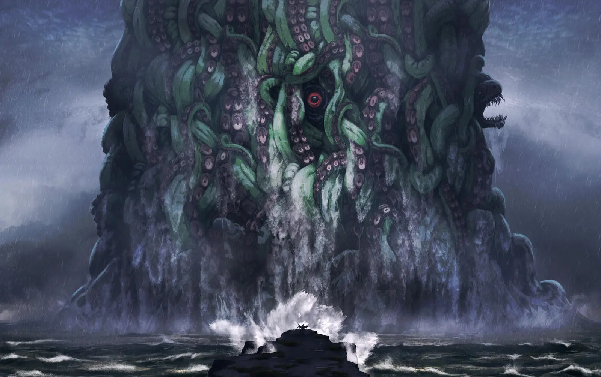
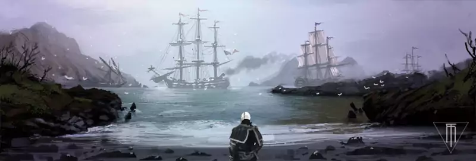
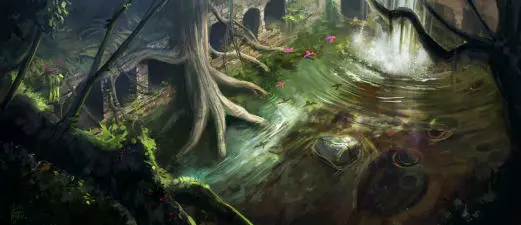

## Viajes y encuentros

En esta sección encontrarás todo lo necesario para darle un poco de vida a los viajes por mar y por tierra y que no sea un simple "llegas a Cuba tres días más tarde" sino que haya situaciones, personas y lugares que lo hagan diferente e incluso sirvan de introducción a otros relatos salvajes.

**Duración de los viajes:** Como ya hemos visto en otras partes, vamos a usar la semana con forma de contar el tiempo cuando se viaje. Todos los viajes que supongan viajar de una isla a otra duran una semana. Los viajes por barco dentro de una misma isla duran media semana y por tierra una semana. Si crees que el viaje es extremadamente corto, podría hacerse en un día, con lo que no podrá usarse para, por ejemplo, estudiar libros de los Mitos. Un viaje extremadamente largo podría durar dos semanas. Moverse de un extremo a otro del Caribe no debería durar más de 2 semanas con buen tiempo.

Te proponemos primero un clima aleatorio acorde con el Caribe y luego encuentros aleatorios por mar y por tierra.

### Tiempo atmosférico durante los viajes

El tiempo atmosférico es un elemento muy interesante que le puede dar mucho ambiente a tus partidas. Es por ello que cada vez que los personajes inicien un viaje tanto por mar como por tierra, saca una carta de acción, consulta la siguiente tabla y aplica el resultado (si quieres). Solo hay que hacer una tirada por viaje, no por día. La tabla representa el clima durante todo el viaje. No supone que haya tormenta o niebla todos los días, sino que gran parte del viaje sí hay niebla o tormenta.

Se puede contrarrestar los efectos del clima (a discreción del director). La calma chicha igual se puede contrarrestar controlando mágicamente a una ballena para que tire del barco o el calor abrasador viajando de noche con algún artilugio que dé luz del día.

Los viajes en barco son peligrosos, sobre todo si se avecina una tormenta, pero en esta ambientación nunca van a ser mortales. Es por ello que hasta el más tremendo huracán les podrá las cosas difíciles, pero nunca va a suponer un riesgo real. Un héroe nunca debería morir ahogado en el mar porque un huracán hundió su barco. Si quieres hundir el barco de los personajes que sea para avanzar en la historia y que aparezcan medio muertos en la playa de una isla desierta.

También puedes recurrir a esta tabla para saber el clima en momentos clave de tu historia. Seguro que el asalto a la fortaleza del malo entre niebla o con un huracán de fondo es el aderezo perfecto a tu partida.

Tabla de Tiempo atmosférico durante los viajes

Carta

Tiempo

En mar

En tierra

2-8

Tiempo perfecto

Soleado, despejado y con buen viento a favor.

Soleado, pero sin excesivo calor, perfecto para caminar.

9

Calma chicha

El tiempo es bueno, pero no hay nada de viento y el viaje tarde el triple. Además, la moral está baja y durante toda la travesía las tiradas sociales tendrán un -1.

10

Viento en contra

El viento en contra dificulta todas las tiradas de navegación (-1) y hace que el viaje dure el doble.

J

Sol abrasador

Hace un sol abrasador y el calor no da tregua ni de noche ni de día. El calor es tan agobiante que no permite estudiar ningún libro.

Hace un sol abrasador y el calor no da tregua ni de noche ni de día. El viaje se hace el doble de largo porque no se puede avanzar en las horas de más calor y durante las noches no se descansa bien. Además, el calor es tan agobiante que no permite estudiar ningún libro.

Q

Lluvia

Llueve durante varios días. No tiene efectos directos, pero ciertas cosas serán más difíciles (-1 a la tirada) cómo encender fuegos, seguir rastros, avistar tierra u otros barcos. El agua dificulta bastante la visión, empapa todo y borra huellas.

K

Niebla

Una niebla espesa como un puré de guisantes os rodeo durante todo el viaje. Es imposible ver qué hay más allá de los 10 metros y es difícil orientarse y seguir la ruta. Debido a que no se ve a lo que hay en el camino/ruta, el viaje dura el doble e incluso puede que se pierdan y no lleguen a su destino.

A

Gran tormenta

La maniobra y el combate naval tiene una penalización de -2 y el resto de actividades de -1 por la baja visibilidad, la molestia de la lluvia, los bandazos del barco o qué todo está mojado y resbaladizo.  
Además, cuando termine la tormenta, todos los personajes tendrán un nivel de fatiga por el esfuerzo extra, dormir mal y mojados y ese tipo de cosas. La duración del viaje será el doble debido a reparaciones del barco, lo que estuvieron parados bajo la lluvia y el tiempo que hace perder la propia tormenta mientras azota.

Joker

Huracán

Especial, ver a continuación.

#### Huracanes

Con un huracán en el mar puede pasar cualquier cosa. El director de juego puede hacer lo que quiera. Ejemplos:

* Hundir el barco y hacerles perder todo lo que tengan. Puede que les rescate otro barco de amigos o enemigos o que acaben en una playa en una isla desierta.
* El barco tiene que volverse al puerto de salida, perdiendo tiempo y dinero, tanto en provisiones como en reparaciones. Puede darse el caso, incluso, que fracasen en su misión por no llegar a tiempo a su destino.
* El barco se pierde en el huracán y pueden acabar Más allá del tiempo y del espacio.

El huracán en tierra no es menos terrible, puede arrasar una isla, destruyendo todos los edificios e inundando los campos y los caminos. El director de juego puede hacer lo que quiera. Ejemplos:

* El lugar de destino de tu mesa ha sido destruido por el huracán. No hay provisiones ni agua potable (y menos para el viaje de vuelta), está lleno de muertos y heridos, hay enfermedades, saqueos, ... Puede ser sin problemas el inicio de una interesante aventura por salvar a los supervivientes o una oportunidad de establecerse en ese lugar.
* El grupo tiene que volverse al punto de salida, perdiendo tiempo y dinero. Puede darse el caso, incluso, que fracasen en su misión por no llegar a tiempo.
* El huracán y las inundaciones desentierran unas antiguas ruinas que explorar o de las que sale un antiguo mal. Puede ser que se encuentren las ruinas en su camino o que al llegar a su destino sus habitantes les hablen del lugar.

### Encuentros en el mar

Cada vez que se realiza un viaje largo por mar puedes tirar en la siguiente tabla. Si algún resultado no puede ser aplicado, como el comienzo de algún relato salvaje, puede volver a tirar otro encuentro o simplemente es un viaje tranquilo.

Tabla de Encuentros en el mar

1d20

Nombre

Descripción

1

La bandera pirata

A lo lejos vuestro vigía del barco observa un barco con la bandera pirata más temida del Caribe. Es el momento de decidir si huir o luchar, pero solo los mejores pueden plantearse enfrentarse a Barbanegra, el azote del mar.

2

Sargazos

El barco se encuentra con una gigantesca masa de sargazos. No va a pasar nada en especial, si atraviesan los sargazos. Simplemente es para darle color al viaje. Puedes jugar con la paranoia, sobre todo si ya han tenido encuentros con profundos, diciéndoles que no se ve a través de los sargazos y que podrían tener una emboscada profunda.

3

Grupo de cetáceos

Vuestra nave se encuentra con un grupo de cetáceos (delfines, orcas, rorcuales o ballenas jorobadas) que acompañaran al barco jugando y saltando delante de la proa. Pueden ser una buena provisión de carne fresca si cazan algunos ejemplares. Si atacan a los cetáceos, estos tratarán de huir. Si muere o es herido algún integrante de la manada, el resto tratará de llevárselo. Esta afrenta no será olvidada y si vuelve a salir este resultado en un viaje, volverá a aparecer este grupo, pero esta vez se defenderán activamente golpeando primero. Según como vayan los encuentros con el grupo de cetáceos, pueden convertirse en Aliados o Enemigos.

4

Cambia el tiempo

Vuelve a tirar en la Tabla de Tiempo atmosférico durante los viajes si había Tiempo perfecto y quédate con el nuevo resultado.

5

Registro aleatorio de contrabando

El grupo se encuentra un barco patrulla en busca de contrabandistas. Deberán decidir si huir, luchar o dejar que hagan su trabajo.

6

Ejemplar de La verdad de La Habana

Uno de los marineros saca un ejemplar de la VLH y empieza a comentar alguna noticia extraña. Tu mesa podrá tirar en la Tabla de Noticias de La verdad de La Habana

7

La tortuga

Empieza el relato salvaje "La tortuga".

8

Cambia el tiempo

Vuelve a tirar en la Tabla de Tiempo atmosférico durante los viajes si había Tiempo perfecto y quédate con el nuevo resultado.

9

Mensaje en una botella

Encontráis una botella flotando en el agua. Dentro lleva un mensaje de un náufrago (tira un idioma al azar Tabla de Idioma para libros). Con una tirada de Navegar o Supervivencia para interpretar las indicaciones del mensaje podrá encontrar un islote donde hay restos de un naufragio de una pequeña embarcación y un cadáver reseco hace años. Pueden tirar un botín de d6.

10

Saboteadores profundos

Un pequeño grupo de profundos provoca daños en la embarcación, como robar el ancla, abrir una vía de agua o atorar el timón. Los tripulantes deberán arreglar los desperfectos antes poder continuar.

11

Grupo de cetáceos

Vuestra nave se encuentra con un grupo de cetáceos (delfines, orcas, rorcuales o ballenas jorobadas) que acompañaran al barco jugando y saltando delante de la proa. Pueden ser una buena provisión de carne fresca si cazan algunos ejemplares. Si atacan a los cetáceos, estos tratarán de huir. Si muere o es herido algún integrante de la manada, el resto tratará de llevárselo. Esta afrenta no será olvidada y si vuelve a salir este resultado en un viaje, volverá a aparecer este grupo, pero esta vez se defenderán activamente golpeando primero. Según como vayan los encuentros con el grupo de cetáceos, pueden convertirse en Aliados o Enemigos.

12

Cambia el tiempo

Vuelve a tirar en la Tabla de Tiempo atmosférico durante los viajes si había Tiempo perfecto y quédate con el nuevo resultado.

13

Avistamiento de cetáceos

El vigía del barco avista un grupo de cetáceos, delfines, orcas, ballenas, ... En ese momento pueden decidir qué hacen. Pueden cazarlos y vender sus cuerpos por un buen precio. Por ejemplo, el ámbar gris, usado en perfumería y que valía más que el oro, era una secreción de los cachalotes para proteger su sistema digestivo. Si algunos de los cetáceos tiene problemas y los personajes le ayudan, puedes usarlo más tarde para salvar a los jugadores si se caen al mar, su barco es hundido o si les abandonan en una balsa en mitad del mar.

14

Emboscada de profundos

En la oscuridad de la noche, un grupo de profundos ataca el barco. El grupo es de 3 profundos por cada comodín y 1 profundo por cada tripulante secuaz. Si el vigía pasa una tirada de Notar podrá avisar a campanadas al resto del barco. Si fallan, los profundos cogerán al grupo por sorpresa y tendrán ventaja.

15

Abandonado a su suerte

Empieza el relato salvaje "Abandonado a su suerte".

16

Cambia el tiempo

Vuelve a tirar en la Tabla de Tiempo atmosférico durante los viajes si había Tiempo perfecto y quédate con el nuevo resultado.

17

Bandera pirata

El grupo se encuentra un barco pirata en busca de presas. Deberán decidir si huir, luchar o rendirse, pero recuerda los piratas no suelen hacer prisioneros.

18

Expedición de guerra de los profundos

Un inmenso grupo de profundos se acerca al barco. El grupo es de 6 profundos por cada comodín y 2 profundos por cada tripulante secuaz. Tu mesa puede enfrentarse al grupo de profundos o tratar de huir.

19

El cementerio de barcos

Encuentran el alta mar un islote que tiene gran cantidad de restos de barcos. Empieza el relato salvaje "La isla de Tekeli-li".

20

Perdidos en el tiempo y el espacio

Tu mesa se adentra sin saberlo en una fisura de la realidad que lleva a alguno de los lugares de los Mitos. Puede ser que atraviesen un portal temporal abandonado de los yithianos, una zona de teletransporte de la serpigente o entren en la Tierra de los sueños. Tira en la Tabla de Perdidos en el tiempo y el espacio.

### Encuentros en la jungla

Cada vez que se realiza un viaje largo por tierra, normalmente atravesando junglas y pantanos, puedes tirar en la siguiente tabla. Si algún resultado no puede ser aplicado, como el comienzo de algún relato salvaje, puede volver a tirar otro encuentro o simplemente es un viaje tranquilo.

Tabla de Encuentros en la jungla

1d20

Nombre

Descripción

1

La senda de piedra

Encuentran un trozo de calzada, un hito o un mojón. No se puede seguir porque se lo ha comido la jungla. Es muy antiguo y lleva oculto durante años,  incluso siglos. Con una tirada de Supervivencia podrán cartografiar el punto y cuando tengan 3 podrán triangular algún tipo de templo, un cenote u otro elemento de esta tabla. Puedes también aprovechar esto para introducir una aventura propia como un templo tipo dungeon que explorar, ...

2

Restos de una caravana

Se encuentran los restos de una caravana comercial perdida, hay restos humanos que deberían dar santa sepultura. Pueden que les atacaran bandidos, animales salvajes o cosas peores. Quizás los mataron, los esclavizaron o algo les hizo huir abandonándolo todo. Tira tesoro con TPC 1d4 y solo podrán escoger tirar en la tabla de Riquezas.

3

La ceiba sagrada

En mitad de un claro de la selva encuentran una gigantesca ceiba. Este árbol que los mayas consideraban mágico tiene un aura de poder alrededor suyo que podrá detectarse con una tirada de Mitos o lanzando un hechizo de Detección arcana. Todo hechizo o ritual hecho a la sombra de la ceiba sagrada (por eso solo funciona de día o durante la luna llena) gasta la mitad de puntos de poder y tiene un +2. Con una tirada de Supervivencia podrán trazar un mapa de su localización y volver a encontrarlo si lo desean.

4

Cambia el tiempo

Vuelve a tirar en la Tabla de Tiempo atmosférico durante los viajes si había Tiempo perfecto, Calma chicha o Viento en contra y quédate con el nuevo resultado.

5

Frutales

Se encuentran una zona de frutales, papayas, mangos, bananas, etc. con las ramas cargadas de frutas. Si gastan un par de horas forrajeando tendrá raciones para todo el viaje.

6

Ejemplar de La verdad de La Habana

Uno de los viajeros saca un viejo y usado ejemplar de la VLH y empieza a comentar alguna noticia extraña. Podrán tirar en la Tabla de Noticias de La verdad de La Habana

7

Pantanos

La ruta que han de tomar obliga al grupo a atravesar una zona pantanosa. Si no pasan una tirada de supervivencia, tienen problemas para moverse por la zona pantanosa y el tiempo de viaje se duplica.

8

Cambia el tiempo

Vuelve a tirar en la Tabla de Tiempo atmosférico durante los viajes si había Tiempo perfecto, Calma chicha o Viento en contra y quédate con el nuevo resultado.

9

El yeho

El grupo se encuentra una expedición de caza en la jungla que busca al misterioso Yeho. Empieza el relato salvaje "El yeho".

10

Restos de expedición de guerra

Encuentran los restos de una expedición militar. Hay restos humanos a los que deberían dar una digna sepultura. Seguramente les atacaron soldados enemigos o cosas peores. Tira un botín con 1d6 y solo podrán escoger tirar en la tabla de Riquezas y la tabla de Objetos extraordinarios.

11

El templo perdido

Empieza el relato salvaje "El templo perdido".

12

Cambia el tiempo

Vuelve a tirar en la Tabla de Tiempo atmosférico durante los viajes si había Tiempo perfecto, Calma chicha o Viento en contra y quédate con el nuevo resultado.

13

Cenote

Encuentras un cenote oculto en la maleza y parece que hace siglos que nadie pasa cerca de él. Puedes explorarlo buceando en sus cristalinas aguas. Si pasas una tirada Atletismo para nadar y bucear y consigues un avance en una tirada de Notar podrán obtener hacer una tirada de tesoro de 1d6. Podrás tirar en la tabla que quieras (incluso en la tabla de Más allá del tiempo y el espacio). Si tienes algún método para moverte sin problemas debajo del agua no hace falta tirar Atletismo y no necesitas un avance en la tirada de Notar.

14

Madre de aguas

Encuentran restos de ropajes taínos con manchas de barro y sangre y una tosca muñeca de madera en la jungla. Cerca encontrarán un poblado de taínos que parece conmocionado por algún suceso extraño. Empieza el relato salvaje "Madre de aguas".

15

Cultivos salvajes

En mitad de la jungla encontráis un campo de algún tipo de vegetal en estado salvaje. Según en que relatos salvajes estén metidos podría ser achiote, tabaco o cohoba (el alucinógeno más potente del caribe y parte fundamental del ritual de la cohoba). Si alargáis vuestro viaje un par de días, podréis dedicarlos a recolectar y preparar para transportar la cosecha. Si tenéis prisa por llegar a vuestro destino llegaréis un día tarde, si no, no importará llegar unos días más tarde.

16

Cambia el tiempo

Vuelve a tirar en la Tabla de Tiempo atmosférico durante los viajes, si había Tiempo perfecto, Calma chicha o Viento en contra. Quédate con el nuevo resultado.

17

Cenote profundo

Encuentras un cenote oculto en la maleza y parece que hace siglos que nadie pasa cerca de él. Con una tirada de Supervivencia encontrarás huellas de pies palmeados de profundos. Puedes explorarlo buceando en sus cristalinas aguas, pero no encontrarás mas que un grupo de profundos (2 por cada comodín). El cenote se conecta a una red de cuevas sub-acuáticas que llega hasta el mar y que los profundos suelen usar en sus incursiones tierra adentro.

18

Restos fosilizados

En una zona rocosa encuentran gran cantidad de restos fosilizados de dinosaurios. Si disponen de equipo adecuado (picos, palas, cubos, ...) en 1 semana completa de trabajo pueden sacar 1d4 esqueletos completos de dinosaurios de tamaño medio (tamaño 5-6). Si sacan 4 sacarán uno de tamaño gigantesco (10-12). Con el hechizo de Control elemental tierra podrán hacerlo en 1 día. Empieza, si quiere tu mesa, el relato salvaje "Cazadores de huesos".

19

Restos de expedición perdida

Encuentran los restos de una mítica expedición perdida que buscaba alguna ciudad perdida de oro o la fuente de la juventud. Es tan antigua que no quedan restos humanos y estaba todo cubierto de maleza. Seguramente les atacaron los defensores de los lugares que saquearon. Tira un tesoro de 1d8 y podrán tirar en la tabla que quieran hasta en la tabla de Más allá del tiempo y el espacio.

20

Perdidos en el tiempo y el espacio

Tu mesa se adentra sin saberlo en una fisura de la realidad que lleva a alguno de los lugares de los Mitos. Puede ser que atraviesen un portal temporal abandonado de los yithianos, una zona de teletransporte de la serpigente o entren en la Tierra de los sueños. Tira en la Tabla de Perdidos en el tiempo y el espacio.

### Perdidos en el tiempo y el espacio

Puede ser que en algún momento los héroes sean absorbidos por un agujero dimensional, sean desterrados a otros planos por un hechicero, abducidos por alguna raza extraterrestre o simplemente al usar una llave de plata la puerta se abra a un nuevo plano. Con esta tabla podrás elegir donde acaba tu mesa. Cada opción viene con ideas de aventuras y de cómo volver.

Tabla de Perdidos en el tiempo y el espacio

1d12

Nombre

Descripción

1

Carcosa

Carcosa es una ciudad de uno de los planetas de las Híades, cerca de Aldebarán. Está situada junto al lago Hiade. Frecuentemente confunde dimensiones con la Tierra, arrastrando a aventureros que se hablan adentrado en la ciudad. Se cree que esto se produce, ya que es la morada/prisión de Hastur.

2

Carcosa en ruinas

No se sabe muy como, pero la ciudad de Carcosa cayó en desgracia en algún momento de su historia y ahora solo quedan ruinas de sus edificios y fantasma de sus antiguos habitantes. Además, múltiples byakhee anidaron en la ciudad.

3

Ulthar

Ulthar es una vieja población de casas de madera situada más allá del río Skai, junto al Bosque encantado, en las Tierras del Sueño. Por ley los gatos no pueden ser dados a muerte por nadie.

4

Meseta de Leng

La tradición dice que la Meseta de Leng está ubicada en Asia Central, pero debido a lo difícil que es localizarla seguramente sea una paradoja espacial que puede estar en muchas partes y en ninguna al mismo tiempo. Es una amplia región fría y desértica en cuyo centro se encuentra el Monasterio de Leng, donde vive el terrible Tcho-tcho Lama, posiblemente un avatar de Nyarlathotep o de Hastur.

5

K'n-yan

Es un reino subterráneo que se encuentra debajo de Oklahoma (EUA). Es una inmensa caverna iluminada por una fosforescencia azul. Sus ramificaciones ocupan casi toda Norteamérica y además de permitirte volver a la superficie, dan acceso a otros mundos como las Tierras de los Sueños o Yoth. Está habitada por unos humanoides inmortales llamados Vieja Raza de K'n-yan y su capital se Tsath en honor a su deidad principal, Tsathoggua. Se puede acceder a K'n-yan desde cuevas y cenotes. La ciencia de la Vieja Raza es muy avanzada y puede que necesiten conseguirla para alguno de sus descabellados planes.

6

Yoth

Yoth es un reino en ruinas situado debajo de K'n-yan. Fue creado por serpigente, pero atrajeron la ira Yig al empezar a adorar a Tsathoggua y este los maldijo haciendo que degeneraran y perdieran su inteligencia.

7

Jungla de Kled

La Jungla de Kled es una inmensa jungla que se encuentra en las Tierras de los Sueños. Por toda la jungla hay palacios y templos perfectamente conservados en los que la jungla no ha podido entrar. Si tu mesa se pierde en la jungla, pueden que aparezca aquí. Quizás tengan que explorar alguno de los palacios para encontrar la forma de volver.

8

Hiperbórea

No voy a decir más: conoce a Conan y combate a su lado.

9

Corona Mundi

Corona Mundi es una inmensa ciudad abandonada en la Antártida creada por los Antiguos. Ya solo está habitada por pingüinos gigantes y los sirvientes de los Antiguos, los shoggoth. Esta ciudad se ha conservado perfectamente gracias al hielo a las montañas que lo rodean y lo protegen. Está lleno de edificios que son maravillas de la arquitectura, llenos de bajorrelieves y estatuas contando la historia de los Antiguos.

10

Pnakotus

Pnakotus fue construida hace millones de años por la Gran Raza de Yith en el Gran Desierto de Australia. Es conocida por su gran biblioteca, donde está recopilado todo lo que ha pasado y mucho de lo que pasará. Recordemos su capacidad para lanzar sus mentes atrás y adelante en el tiempo. Igual necesitan visitar su biblioteca para conseguir algún dato importante para sus misiones. El viaje de regreso al Caribe desde Australia puede ser una aventura en sí misma.

11

R'lyeh

Ya hemos hablado de R'lyeh mucho en esta ambientación, así que ya sabes qué van a encontrar.

12

El vacío

Este gran espacio vació, es la nada, el fin del tiempo y el espacio sin origen y sin final. Igual es el centro de un agujero negro o lo que queda de una dimensión devorada por dholes. Pero desde luego mejor no tener que entrar nunca.