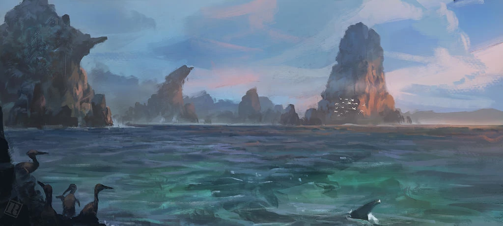
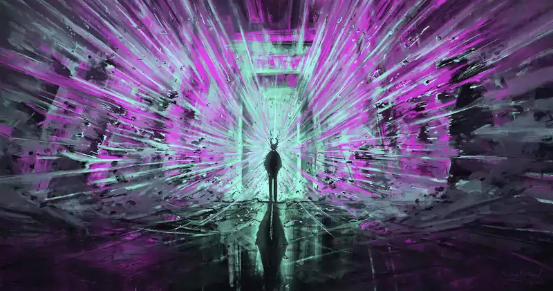
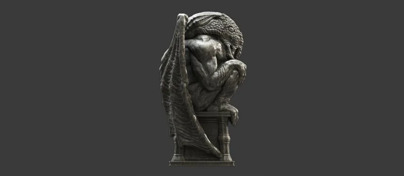

# Reglas de ambientación

\sinc

## Creación de personajes

\conc

Hay una serie de reglas en esta ambientación que modifican las normas generales de creación de personajes. No son muchas ni muy complicadas, pero tienen su sentido. Veámoslas:

* Tu PJ empieza con la ventaja Trasfondo arcano (Hechicería primigenia).
* Las ventajas de Nuevos poderes y Puntos de poder no pueden cogerse en la creación de personaje, a no ser que se tenga la ventaja Experiencia con los Mitos.
* Tu PJ empieza con un d4 gratis en Criollo. Esto le permite comunicarse mínimamente con cualquier persona en el Caribe. Puedes adquirir a d6 Taíno, Arahuaco, Castellano, Francés o Inglés en vez del Criollo, pero solo será útil en las áreas de influencia de los respectivos idiomas.
* Ocultismo desaparece como habilidad. Los conocimientos sobre magia están recogidos por la nueva habilidad de Mitos de Cthulhu. Los conocimientos básicos de Ocultismo, como formas de matar a un zombi o cómo quitar un mal de ojo, puedes integrarlos dentro de Conocimientos Generales. La mitología, las religiones, etc. puedes integrarlos en Humanidades.
* La desventaja Analfabeto pasa a ser mayor. Aunque la mayoría de la gente no sabe ni leer ni escribir, para una persona que va a estar rodeado de libros y que los necesita para enfrentarse a seres muy poderosos, ser analfabeto es un problema serio.

### Ideas de personajes

No es estrictamente necesario, pero te recomendamos que tu personaje tenga como uno de sus objetivos vitales ser pirata o por lo menos que tenga conocimientos y pericias relacionadas con los barcos y el mar. Las aventuras que van a correr van a suponer muchas veces viajar en barco, batirse en duelo sobre la cubierta de un buque y luchar contra demonios subacuáticos en simas marinas.

\sp

Si quieres hacerte un ratón de biblioteca que sepa de todo, trata de que su biblioteca tenga velas y si quieres que tu personaje sea duelista, que lo sea, pero que sepa lanzar estocadas mientras hace equilibrios en los aparejos de un barco.

Aquí tienes algunos conceptos sobre los que construir tu PJ.

* **Adalid:** Tu misión en la vida es proteger y ayudar a los que no pueden hacerlo solos. Allá donde haya alguien en problemas, allí irás. El Caribe es a veces un sitio duro y cruel, así que aquí es donde debes estar.
* **Alien:** No eres de aquí, no decidiste estar aquí, no pudiste evitar que te trajeran aquí y no quieres estar aquí y, a pesar de que no entiendes este mundo, no te queda otra que aguantar y seguir adelante jugando con sus reglas. Quizás salga una oportunidad que te permita abandonar el Caribe y volver a tu tierra con tu gente.
* **Buscavidas:** Tu boca, tu cara y tu encanto te meten y te sacan de muchos problemas y ahora necesitas huir de tus enemigos y/o acreedores. El Caribe es un buen lugar para desaparecer y empezar una nueva vida. Quizás esta vez sea diferente y salga bien.
* **Criminal:** El crimen es toda tu vida, es con lo que has crecido y los valores que te han inculcado. El Caribe puede ser un sitio perfecto para salir de esa vida o para medrar en ella. Es tu elección, así que elige bien.
* **Demente:** La senda de la locura ya la has recorrido antes, así que nada que veas emerger de las aguas del Caribe te va a acercar más a la demencia de la lo que ya estás.
* **Divulgante:** La verdad debe ser conocida y la mentira debe ser combatida. Ese es tu objetivo en el Caribe, que la verdad llegue a todos, ya que sin verdad no somos libres.
* **Hedonista:** La vida es una fiesta eterna y tú has venido a vivirla. No hay placer que no hayas experimentado o que no quieras experimentar. En el Caribe y en la vida pirata puedes encontrar nuevos placeres que hasta ahora no habías experimentado. ¿Te lo vas a perder?
* **Intelectual:** El conocimiento y el saber es lo más importante para ti y el Caribe es un mundo que explorar y del que aprender. Todos esos misterios escondidos en sus fondos oceánicos y en sus junglas esperan que los saques a la luz.

\sp

* **Paria:** Hay algo en ti que no encaja con los demás y estás cansado de esconder tus diferencias o de pelearte por ellas. Quizás el Caribe es el lugar donde esas diferencias no importen o donde puedas conseguir que no importen.
* **Triunfal:** El éxito y la fortuna han sido tus compañeros desde que naciste, pero nunca es suficiente, siempre necesitas más. El Caribe es ese lugar donde puedes explotar tu potencial al máximo y conseguir el triunfo definitivo.

\sp

\sinc

## Nuevas habilidades

\conc

En ¡Arrr! Cthulhu puedes hacer uso de todas las habilidades básicas de SWEA a excepción de habilidades temporalmente ilógicas como Conducir, Electrónica y Ordenadores, ya que no hay vehículos autopropulsados, equipos eléctricos u ordenadores.

Como ya hemos explicado en la creación de personajes. Ocultismo también desaparece como habilidad integrándose dentro de Conocimientos generales.

Por otro lado, hay una serie de nuevas habilidades:

### Mitos de Cthulhu

Mitos de Cthulhu representa los conocimientos que tiene tu personaje sobre los Mitos de Cthulhu, los monstruos, los hechizos, ritos, objetos, etc. y la historia que hay detrás de ellos. También puede servirte para identificar maldiciones y quitarlas o para identificar puntos débiles de seres de los Mitos.

Esta habilidad no se puede escoger en la creación del personaje. Solo mediante el estudio de libros prohibidos y enfrentándote a los horrores de los mitos podrás subir esta habilidad. Reglas especiales:

* No está basada en ningún atributo. Así que su coste es como si quisiéramos subir una habilidad por encima de un atributo. Es decir, que cuesta un avance subir un nivel de la habilidad.
* Solo puede subirse una vez por rango, como un atributo.
* Para poder subir esta habilidad, tu personaje ha debido enfrentarse a, al menos, una TPC o haber leído un libro prohibido durante las sesiones de juego de ese rango.
* No tiene límites, cuando se llega a d12 continuamos con +1, +2, +3, …

### Idioma criollo (Astucia)

El Criollo es la lengua más común del Caribe, casi todas las personas lo entienden y lo hablan. Empezó como una lengua muy básica creada con la mezcolanza de lenguas indígenas, africanas y europeas con la que comunicarse y comerciar y se fue haciendo más rica y compleja según se extendía su uso y se necesitaban transmitir conceptos más complejos. 

\sp

Aun así, es vista por muchas personas de origen europeo como una lengua de gente de bajo nivel cultural. Reserva estas conductas a tus personajes malvados.

### Idioma cthulhunés (Astucia)

El cthulhunés (o R’lyehiano) es la lengua hablada por Cthulhu, los habitantes R’lyeh y sus servidores, por ejemplo, los profundos. Los que lo han oído lo describen como extraño y gutural (seguramente para usarse bajo el agua) y muy difícil de pronunciar para las gargantas humanas.

La Orden del Gran Cthulhu ha conseguido transcribir el idioma a caracteres latinos, ya que los caracteres escritos del Cthulhunés no han podido ser descifrados. Eso ha llevado a que parezca formado por grupos de consonantes que suenan relativamente extraños para el oído, como «mglw'naph» o «fhtagn».

_ph'nglui mglw'nafh Cthulhu  
R’lyeh wgah'nagl fhtagn_  
_En la Ciudad de R’lyeh, el difunto  
Cthulhu, espera soñando_

> Durante la creación de personaje no puedes ponerle puntos a Idioma Cthulhunés a no ser que tengas la ventaja Experiencia con los Mitos.

\sc

> El Cthulhunés puede ser entendido y leído (si está escrito en caracteres latinos) pero el usuario tiene dos niveles menos a la hora de hablarlo. Si no llega a d4 no podrá pronunciarlo. Es decir, con Cthulhunés d8, podrá hablarlo a d4. Con un d6 no podrá hablarlo, pero si leerlo y entenderlo.

> El Cthulhunés es una lengua creada para pronunciar cosas impronunciables y es por ello que afecta a la cordura del hablante. Así pues, cada vez que se suba este idioma, deberá hacerse una TPC (tirada de perdida de cordura) igual al nivel que se quiere conseguir.

### Idioma Naacal (Astucia)

El naacal es el idioma que habla la serpigente. Era el idioma que se hablaba en el continente perdido de Mu hace más de 173.000 años.

Las letras son ligeramente similares en apariencia a lenguajes mesoamericanos como el maya. Su pronunciación es complicada para los humanos debido a que está pensada para la lengua y las cuerdas vocales de la serpigente.

\sp

\sinc

## Nuevas desventajas

\conc

La mayoría de las desventajas que hay en esta ambientación están relacionadas con la locura y el horror. Pueden ser bastante limitantes, así que ve con cuidado a la hora de escogerlas y trata consensuarlas con tu director de juego. Con una sola persona sentada a la mesa con «La llamada de Cthulhu» es más que suficiente.

### Débil de mente (mayor)

Hay personas que no están preparadas para enfrentarse al horror y esta desventaja lo refleja. No estás preparado para todas las terribles visiones que vas a presenciar y las horribles situaciones que vas a experimentar. Pero por todo eso, enfrentarte al horror como vas a hacerlo es una señal de tu valor.

> Todas las TPC tiene un nivel más. Es decir, una TPC de d8 será de d10 para alguien con una mente débil. Este nivel extra se aplica al final, después de hacer todas las cuentas. Si sale que no hay tirar TPC, en realidad, tira una TPC de d4. Si hay un mínimo de d4, para esta persona sería de d6.

### Más cerca de la locura (mayor)

Te encuentras más cerca de la locura que el resto del mundo. Tu equilibrio mental es más frágil que el común de los mortales.

\sp

Puede ser por muchas razones: genética, infancia traumática, etc. Sea como sea, tu psique es más débil de lo normal y estás más cerca de la locura que el resto de tu equipo.

> Empiezas con 3 puntos de cordura en vez de 4 como es normalmente. Nunca podrás tener más de 3 puntos de cordura, aunque termines una campaña con éxito y el DJ diga que recuperáis todos los puntos de cordura.

### La llamada de Cthulhu (menor)

Tu mente artística e imaginativa es muy susceptible a las ondas mentales del Gran Cthulhu, teniendo terribles pesadillas sobre Cthulhu y su tumba acuática de R’lyeh.

> Siempre que te duermas sin tener benis, tendrás unas horribles pesadillas que no te dejarán dormir y tendrás un nivel de fatiga al día siguiente hasta que descanses una noche entera teniendo un beni y, por tanto, sin pesadillas. Durante las pesadillas podrás hacer uso de tu habilidad de Mitos de Cthulhu para tratar de sacar información, sobre Cthulhu, R’lyeh, sus adoradores y sus planes.

### Camaradería pirata (mayor)

Eres extremadamente leal a otros piratas, para ti son tu verdadera familia de una forma casi fanática. Eres incapaz de ver que estén haciendo cosas mal y les defenderás a capa y espada. Los planes de otros piratas no tienen fallos, los apoyas incondicionalmente y participas activamente. Esto seguramente te va a meter en muchos problemas porque los piratas no son famosos por sus grandes ideas, si no no serían piratas. Además, el resto de la piratería lo sabe y siempre te presentan sus locas ideas porque saben que siempre aceptas.

### Trastornos mentales

Todo el sistema de horror/cordura típica de los juegos basados en la obra de Lovecraft se basa en trastornos mentales que vayan lastrando a tu personaje hasta acabar locos en un callejón del puerto de Tortuga gritando a los viandantes sobre que su fin está cerca cuando el gran Cthulhu despierte de su tumba acuática.

Todos estos trastornos mentales debemos tratarlos como desventajas y se les aplican todas las reglas de las desventajas.

\sp

Además, de las desventajas listadas a continuación puedes usar como trastornos mentales Avaricioso, Arrogante, Envidioso, Exceso de Confianza, Delirio, Fobia, Hábito, Manía y Sanguinario.

### Amnesia y flashbacks (menor/mayor)

El cerebro de tu personaje, muy sabiamente, ha bloqueado parcialmente el recuerdo concreto de una situación traumática (cómo le torturaron, cómo presenció como un vampiro de fuego quemaba a toda su familia, …). No quiere decir que no recuerde ese hecho concreto, pero solo generalmente. Los detalles son lo que ha reprimido y todos sabemos que el demonio está en los detalles. Esos detalles vuelven a su mente como flashbacks mostrándoles los momentos más traumáticos del evento que produjo la amnesia, los gritos espeluznantes, el olor a sangre podrida, los brillantes ojos del asesino, …

> En juego, supone que una vez por sesión en momentos de estrés puede sufrir esos flashbacks fallando la tirada que vaya a hacer sin posibilidad de gastar un Beni para repetirla. Por estrés entendemos cualquier tirada enfrentada, desde jugar al póquer a discutir con un oponente político o tratar de entrar sigilosamente en la casa del gobernador. Si se coge como mayor, el DJ podrá hacerle fallar cualquier tirada de combate y dejarle aturdido como si le hubieran hecho una finta o un truco sucio.

### Depresión (mayor/menor)

Tu PJ sufre depresión y todo se le hace cuesta arriba, tiene siempre un bajo estado de ánimo y sentimientos de tristeza.

> Si es menor al principio de cada sesión deberá tirar un d6. Si consigue un éxito, sobrelleva la depresión hasta la próxima sesión. Si falla, pierde uno de sus benis hasta la próxima sesión. Si es mayor directamente cuenta con un beni menos.

### Trastorno de ansiedad generalizada (mayor/menor)

Este complejo trastorno mental consiste en una ansiedad general y continua por todos los aspectos de la vida. Se siente una ansiedad tremenda por asuntos que no son tan importantes, se siente ansiedad por tomar decisiones y elegir la peor, se sienten situaciones normales como más amenazantes de lo que son e incluso se siente ansiedad por tener ansiedad.

\sp

> En juego, el personaje con este trastorno recibe un -2 a todas las tiradas que necesite para tomar decisiones. Por ejemplo, hará una tirada de Tácticas con -2 para decidir que puerta es mejor para atacar la cárcel local y liberar a tus compañeros.

Como mayor directamente no podrá hacer la tirada, la ansiedad le atenazará dejándole en blanco.

### Ataques de pánico (mayor/menor)

Están muy asociados con el trastorno anterior. Tu personaje sufre un miedo terrible de repente y sin sentido ante una situación o evento normal (normal para el personaje).

> Como desventaja menor, una vez por sesión el DJ podrá obligar a tu PJ a hacer una tirada de Espíritu o sufrirá un terrible ataque de pánico que le imposibilitará llevar a cabo la acción que quería hacer.

> En caso de que sea mayor, no hará falta tirada, el DJ podrá hacer que el miedo atenace al personaje directamente imposibilitándole seguir con la acción que deseaba hacer.

Como DJ te aconsejo que uses sabiamente esta desventaja, sobre todo en mayor. Puede ser muy frustrante para cualquier persona no tener control de su personaje. Mi consejo es que lo uses como una forma de encauzar a quien se salgan de madre.

### TOC - Trastorno obsesivo-compulsivo (mayor)

El trastorno obsesivo-compulsivo (TOC) se caracteriza por un miedo no deseado (obsesiones) que provocan comportamientos repetitivos (compulsiones). Por ejemplo, un miedo a las enfermedades puede llevar a un paciente de TOC a lavarse compulsivamente las manos.

> Deberás elegir una fobia menor y un hábito menor relacionado para formar el TOC de tu personaje.

### Paranoia (mayor/menor)

Tu personaje está convencido de que los enemigos están en todas partes, y cree que todos están contra él. Siempre está mirando a su espalda esperando una traición de sus compañeros o tratando de escuchar cómo conspiran a sus espaldas.

\sp

> Como desventaja menor, tienes un -1 en todas las tiradas de habilidad que exijan concentración (como abrir cerraduras, jugar a las cartas, descifrar un código, …) cuando otros están a tu alrededor.

> Si se toma como mayor, además, el -1 se aplicará a todas las tiradas de percepción, ya que estará más preocupado desvelando conspiraciones y enemigos ocultos que en vigilar o buscar.

### Megalomanía (mayor/menor)

La megalomanía se caracteriza porque la persona tiene ideas de grandeza, de manera que puede mentir, manipular o exagerar algunas situaciones o a las personas, a fin de conseguir sus objetivos.

> A nivel menor deberá elegir algo en el que quiere el mejor (el más fuerte, el más rápido, el más rico, …), esto hará que actúe de forma desafiante y agresiva contra las personas que es mejor que él y obtendrá un -1 a todas las tiradas de interacción social con esas personas. A nivel mayor será a nivel general contra toda persona que pueda ser mejor que él en algún campo en el que esté cualificado, es decir, que tenga atributo/habilidad d8 o más.

\sp

\sinc

## Nuevas ventajas

\conc

Como en el caso anterior de nuevas desventajas, todas las nuevas ventajas de ¡Arrr! Cthulhu están muy relacionadas con el horror y la cordura y como en el caso anterior, pueden tener mucha influencia en el juego, así que trata de consensuar la elección de estas desventajas con tu DJ y el resto de la mesa.

### Acostumbrado al horror (tipo de monstruo)

_Prerrequisitos: Novato_

A base de enfrentarte a un horror específico te has acostumbrado y tu cordura no sufre al estar en su presencia.

> A efectos de juego baja 4 niveles el TPC de un monstruo. Si el TPC modificado baja por debajo de d4 no necesitas hacer tirada de TPC. Por ejemplo, si estás «acostumbrado a los profundos» al ver un profundo (TPC d4) no tendrás que tirar, pero si ves una horda de 1000 profundos (TCP d12+1) solo tendrás que enfrentarse a un TPC (d6, 4 niveles menos).

### Experiencia con los Mitos

_Prerrequisitos: Novato_

Has tenido experiencias con los Mitos, quizás en tu niñez o adolescencia. Puede ser que vengas de un linaje de adoradores de Primigenios o que la sangre de profundo corra por sus venas. Puede ser que te enfrentaras a un monstruo de los Mitos y consiguieras sobrevivir o que tu abuela te transmitiera parte de los conocimientos prohibidos de su akelarre de brujas.

> A nivel de juego, podrás empezar con las ventajas «Nuevos poderes» y «Puntos de poder». Es decir, podrás empezar tus aventuras con la capacidad de hacer hechizos. Además, podrás adquirir con puntos de creación la habilidad Mitos de Cthulhu a d4 y dispondrás de un libro de los Mitos generado aleatoriamente. También podrás gastar puntos hasta d4 para la habilidad idioma Cthulhunés.

\sp

### Imán de lo extraño

_Prerrequisitos: Novato_

Todo lo extraño se siente atraído hacia ti para bien y para mal. Abres y lees el libro maldito, te pierdes en el bosque y acabas encontrando la casa de la bruja o se te cae una probeta del laboratorio del científico loco.

> Todas las tiradas de botín en las que te veas involucrado podrás repetirlas gastando un beni y el grupo podrá quedarse con el mejor resultado. En caso de no conseguir ningún éxito en ninguna de las tiradas, el imán de lo extraño deberá hacer una tirada en la tabla de maldiciones, pero la duración solo será en horas y recuperarás el beni gastado.

En caso de que haya varias personas con esta ventaja, cada uno tendrá que gastarse un beni y añadirá una tirada extra. En caso de maldición, todos los jugadores con la ventaja serán maldecidos.

### Sensibilidad celta

_Prerrequisitos: Novato_

Tienes una sensibilidad especial a las energías extrañas que nos rodean, desde los diferentes planos, pasando por otras dimensiones, hasta la magia y en general todo lo relacionado con los Mitos. Como la desventaja «Llamada de Cthulhu» está muy relacionado con la sensibilidad y la creatividad.

> TU PJ obtiene un +2 a todas las tiradas de Mitos de Cthulhu, pero también un -1 a todas las tiradas de TPC.

### Ritualista

_Prerrequisitos: Novato_

No has llegado a desarrollar tus dotes de hechicería, pero si controlas una serie de rituales que son de uso común en tu comunidad o en tu familia.

> Empiezas con 4 rituales, puedes elegirlos tú mismo, pero debe tener cierta coherencia con tu historia. Si tienes «Brindar al mar» porque vienes de un pueblo de pescadores, no tiene mucho sentido que sepas «Protección de la cosecha» que sería más de campesinos de interior. Además, tienes un +2 a las tiradas de Conocimientos generales relacionados con magia y hechicería.

\sp

### Integrante de la Hermandad del sargazo

_Prerrequisitos: Especial_

Eres integrante de pleno derecho de esta sociedad secreta que lucha contra los seres de los Mitos y sus terribles planes para la humanidad.

> Todas las personas que forman parte de la hermandad podrán ser considerados como aliados. Por contrapartida deberás seguir a rajatabla las decisiones que la hermandad tome. Además, deberás ayudar al resto de cofrades.

> Te da acceso también a la red de pisos francos de la Hermandad. Diciendo la contraseña correcta a su cuidador, este te dará acceso al piso y podrás hacer uso de sus instalaciones. Toda ciudad de más de 2.000 habitantes tiene un piso franco que puede ser desde un habitáculo a un lujoso apartamento.

> Esta ventaja no puede ponerse en la creación del personaje y solo el DJ puede dártela. No se pueden gastar avances para conseguir esta ventaja.

\sc

### Jerga Pirata

_Prerrequisitos: Novato, Especial_

La jerga pirata no es un idioma en sí, no tiene una gramática, una pronunciación ni una grafía. Es un batiburrillo de palabras y expresiones mal pronunciadas con un montón de gestos con las manos que solo con práctica y oído puedes aprender de otros piratas. Un pirata puede estar hablando inglés y no entenderle una sola palabra de lo que dice. Nada tiene mucho sentido y solo si estás familiarizado puedes pillar.

> Puedes hablar con otra persona que sepan jerga pirata y vuestra conservación no podrá ser entendida por nadie más que no tenga jerga pirata. Esto se aplica a todo tipo de razas no-humanas, incluso deidades menores. Si alguien consigue una transcripción de la conversación y consigue un avance en una tirada de Investigar, podrá entender la conversación.

> La jerga pirata no puede escogerse en la creación del personaje, a no ser que tu historia este relacionado con la piratería, por ejemplo, siendo grumete en un barco pirata o trabajando en una taberna del puerto.

\sp

### Barco propio

_Prerrequisitos: Novato, Navegar d6_

Esta ventaja solo puede comprarse en la creación de personaje. Una vez empezadas las aventuras, los barcos solo podrán comprarse con dinero.

Esta ventaja supone que empiezas con un barco de tu propiedad. Puede ser una nave rápida o una nave de carga. Normalmente, debería ir acompañado de ventajas como Alcurnia o Rico que justifiquen poseer el barco. En caso contrario, debería haber una buena historia que explique como consiguió la nave.

\sp

\sinc

## Benis

\conc

Hay nuevos usos para los benis en tres apartados muy importantes de este juego, la magia, la cordura y la navegación. Debes hacer comprender a tu mesa que estos usos normalmente deben ser reservados para momentos épicos, cuando la situación es a vida o muerte y sobre todo «queda bien» en la historia.

* Puedes gastar todos tus benis (mínimo 1) para lanzar un hechizo sin necesidad de gastar puntos de poder. Esto supone que se pueden lanzar hechizos sin tener puntos de poder o lanzar hechizos que piden más puntos de poder de los que tienes.
* Gastando todos tus benis (mínimo 1) puedes hacer un golpe de timón en tus viajes por mar y negar un resultado en la tirada de encuentros en el mar. Se acerca una tormenta y antes de verse rodeada por ella, el piloto del barco hace girar el timón 180º y busca una ruta alternativa.
* Como se ve más adelante, se pueden gastar benis para que los trastornos mentales no sean permanentes.

\sp

\sinc

## Equipo

\conc

Durante la creación de tu personaje solo tendrás acceso al equipo normal de una persona del siglo XVIII. Eso quiere decir que no tendrá acceso a material con componentes electrónicos, motores de combustión, óptica de precisión, … La máquina de vapor se está estudiando y los telares mecánicos no se inventarán hasta dentro de unos 10 años.

Todo producto manufacturado es de origen artesanal, herreros, carpinteros, tejedores, etc. trabajan en sus talleres y producen a mano todo tipo de productos. Eso quiere decir que muchos productos exigirán un tiempo de fabricación. Lo normal es que el herrero tenga unas pocas armas en su taller para que veas su arte y destreza y te haga en una semana el arma que estás buscando.

Si tu mesa tiene dudas sobre si tienen acceso a un tipo concreto de invento, es tan fácil como mirar su año de invención en internet y por lo menos añadirle unos 15 años hasta que se haga popular y llegue al Caribe. Quizás en Londres podrías conocer al inventor en persona y comprarle su invento, pero estamos en el Caribe y las nuevas ideas tardan años en llegar.

### Armas

Puedes hacer uso de todas las armas antiguas y medievales que vienen en el manual SWEA, pero aquí te presentamos las más icónicas para una ambientación de piratas.

\sinc

#### Listado de Armas cuerpo a cuerpo

|Nombre|Descripción|Estadísticas&ast;|
|---|---|---|
|Sable de abordaje|Los sables de abordaje es una hoja curva con un solo filo, pero tiene menos curva que el de caballería.|Espada corta|
|Alfanje|Es una espada a una mano de hoja ancha y curva, con filo en un solo lado.|Espada larga|

\conc

\sp

\sinc

|Nombre|Descripción|Estadísticas&ast;|
|---|---|---|
|Hacha de abordaje|Esta hacha de tamaño pequeño a una mano tiene una hoja curva en un lado para cortar cuerdas y un pico en la otra para romper puertas y para poder clavarla en la madera y usarla como ayuda al escalar.|Hacha de mano|
|Machete|Se trata de un cuchillo largo (menos de 60 cm y tiene un solo filo), pero más corto que una espada. Se utiliza para cortar la caña de azúcar, abrir camino en la jungla o como arma blanca.|Espada corta|
|Espada ropera|Es una espada de hoja recta y larga, esgrimida a una mano y con una empuñadura de diferentes estilos que protegía toda la mano. Es la típica arma que vemos en las películas de mosqueteros.|Espada larga|
|Daga|Estas armas de filo de pequeño tamaño podían usarse también en la mano izquierda como defensa o para lanzar golpes cuando entraban en combate muy cerrado, algo normal cuando se combatía bajo cubierta.|Cuchillo/daga|
|Tridente de profundo|Esta lanza acabada en dos o tres puntas es el arma típica de los profundos y seguramente tendrás que usarlo alguna vez cuando estés rodeado de ellos y hayas perdido todo tu equipo.|Lanza|

&ast; Esta columna marca las estadísticas de que arma del Manual Básico de SWEA debes usar para cada arma de la tabla.

\conc

Dentro del combate a distancia puedes hacer uso de las armas a distancias primitivas y armas de pólvora negra, es decir pistolas de chispa, mosquetes y trabucos.

\sinc

\sp

\sinc

#### Listado de Armas de fuego

|Nombre&ast;|Descripción|
|---|---|
|Pistola de chispa|Una pistola de chispa es una arma corta de fuego que utiliza un mecanismo de ignición de golpe de pedernal,|
|Mosquete|Es una arma larga de chispa que tenía más capacidad de daño, mayor distancia y mayor precisión que la pistola.|
|Trabuco|Un trabuco es una arma de fuego de gran calibre que como las anteriores se cargaba por el cañón. Los cañones son cortos y se le considera el predecesor de la escopeta.|
|Granadas|La granada es un proyectil explosivo que se lanza con la mano. Eran bolas de metal llenas de pólvora y a veces metralla con una mecha. Se encendían la mecha y se lanzaba la granada.|

&ast; Las estadísticas de estas armas puedes encontrarlas en el manual básico de SWEA.

\conc

#### Arma lanzarrayos yithiana

Esta arma de rayos, parecida a una cámara de fotos de gran tamaño, posee un gran poder destructivo. Tiene dos grandes asas y al pulsarse los gatillos que hay en cada asa lanza unos rayos que calcinan a su objetivo. Es por ello que se necesitan dos manos para poder usarla. Al dispararse los rayos de eléctricos generan un gran zumbido del mismo nivel que disparando un arma de pólvora, es por ello que no son armas de infiltración si no de guerra.

\sinc

|Distancia|Daño|PA|CDF|Munición|FUE Min.|Peso|Coste|
|---|---|---|---|---|---|---|---|
|50/100/150|2d8|2|1|35| — |2| — |

**Notas:** Exige usar las dos manos para disparar. Cauterizante (+2 a sus tiradas de Vigor para evitar el desangramiento). Recarga 1 de munición por minuto, de forma que en unos 35 minutos tendrías el arma plenamente cargada.

\conc

\sp

El rayo de energía que lanza es plenamente visible, mucho más de noche, y usarla en público podría suponer ser acusado de brujería.

#### Cañón lanzarrayos yithiano

Los laboratorios de RCPC han podido aprender mucho de la tecnología yith y, como no, lo han usado para crear armas más destructivas. Han desarrollado un arma lanzarrayos de gran tamaño, un cañón lanzarrayos de gran poder destructivo muy precisos y con a larga distancia. A diferencia de sus predecesores, los lanzarrayos yithianos, estos cañones están pensados para ser usados por humanos.

\sinc

|Distancia|Daño|PA|CDF|Munición|Coste|
|---|---|---|---|---|
|150/300/600|4d10|3|1|35| — |

**Notas:** Necesita una dotación de 1 persona al no tener que recargar. Puede hacer que se sobrecaliente y termine explotando. Haría un daño de 3d10 en una plantilla mediana. Recarga 1 de munición por cada media hora, forma que en menos de 1 día tendrías el cañón plenamente cargado.

&nbsp;

\conc

### Protecciones

En el 1722 las armaduras y los escudos están ya en franco desuso con la aparición de la pólvora. Además, son pesadas, muy caras y quitan maniobrabilidad, por no hablar de que no son nada frescas. En unas pocas rondas de combate, un defensor con armadura puede caer inconsciente por el calor y el esfuerzo que supone combatir con armadura pesada. Sin olvidar que si te caes el agua date por muerto.

\sc

Lo normal es que el cuero de diferentes animales, desde cuero de vaca hasta piel de cocodrilo, y la ropa de tela resistente sean las únicas protecciones que se vean normalmente.

Puedes encontrarte guardas con partes de armadura como peto o casco, pero seguramente estén sudando la gota gorda.

\sp

\sinc

## Embarcaciones

\conc

Qué sería de una ambientación pirata sin barcos, que muchas veces casi son personajes propios con su propia personalidad y forma de ser. El tema de las embarcaciones vamos a tratarlo de forma genérica creando 5 tipos de naves:

* **Pequeñas:** perfectas para pescadores y pequeños comerciantes
* **Rápidas:** algo más grandes que las anteriores y las más rápidas, perfectas para contrabandistas.
* **De transporte de carga:** grandes y lentas para llevar mucha carga.
* **De combate:** una media de las anteriores, rápidas, con capacidad de carga y con defensas.
* **De guerra:** como las anteriores, pero preparadas no solo para la defensa sino también para el ataque.

Los barcos tienen dos campos especiales Además, de los normales de vehículos. La carga es el número de barriles llenos de carga para comerciar que puede llevar el barco sin sufrir penalizaciones. 

\sp

Provisiones son el coste de las provisiones necesarias para navegar una semana en doblones.

### Naves pequeñas

Son naves pequeñas de un mástil y poca tripulación, perfectas para la pesca o el transporte de carga o pasajeros entre islas. Su pequeño tamaño y calado les permite meterse donde otros barcos más grandes no pueden. No están preparadas para grandes travesías.

\sinc

#### Balandro, cúter, … (10.000 doblones)

|Tamaño|Maniobra.|Velocidad máxima|Dureza|Tripulación|Carga|Provisiones|
|---|---|---|---|---|---|---|
|8|-1|15 km/h|15 (3)|3 - 10|20|150|

**Notas:** +2 heridas.

**Armas:** Sin armas.

\conc

### Naves rápidas

Las más rápidas y maniobrables del Caribe, estas naves son perfectas para los contrabandistas que quieren dar esquinazo a las naves que vigilan el comercio entre islas del Caribe. Tienen más capacidad de carga que las pequeñas, pero menos que las de carga, pero normalmente su carga es más valiosa (e ilegal).

\sinc

#### Goleta, clíper, … (40.000 doblones)

|Tamaño|Maniobra.|Velocidad máxima|Dureza|Tripulación|Carga|Provisiones|
|---|---|---|---|---|---|---|
|9|0|25 km/h|16 (3)|8-20|40|350|

**Notas:** +2 heridas.

**Armas:** Sin armas. Se puede instalar cañones quitando espacio de carga y a razón de 4 toneles por cada cañón hasta un máximo de 8 cañones (4 por lado del barco).

\conc

\sp

### Naves de carga

Es el más grande de los navíos con una gran capacidad de carga, pero es tremendamente lento y muy poco maniobrable. Está preparado para largas travesías por mar. No suelen estar armadas, lo normal es que varias de estas naves lleven una escolta de buques de combate o de guerra.

\sinc

#### Carraca, naos, …(60.000 doblones)

|Tamaño|Maniobra.|Velocidad máxima|Dureza|Tripulación|Carga|Provisiones|
|---|---|---|---|---|---|---|
|15|-2|10 km/h|23 (4)|40-150|300|600|

**Notas:** +3 heridas. Puede quitarse espacio de carga para meter más gente y viceversa a razón de 1 personas por cada 6 toneles.

**Armas:** Sin armas. Se puede instalar cañones quitando espacio de carga y a razón de 4 toneles por cada cañón hasta un máximo de 20 cañones (10 por lado del barco).

\conc

### Naves de combate

Las naves perfectas para los piratas y las fuerzas del orden. Su buena velocidad, maniobrabilidad y capacidad de carga les permite atacar a barcos de carga y plantarle cara a otras naves de guerra.

\sinc

#### Fragata, navío de escolta, galeón, … (80.000 doblones)

|Tamaño|Maniobra.|Velocidad máxima|Dureza|Tripulación|Carga|Provisiones|
|---|---|---|---|---|---|---|
|14 (Colosal)|-1|15 km/h|20 (4)|20+80|80|600|

**Notas:** Blindaje pesado.

**Armas:** Cañones (entre 16 y 46, fijos en las bordas).

\conc

\sp

### Naves de guerra

Auténticas fortalezas flotantes. Ellas solo pueden tener controlada una ruta comercial y varias de ellas sincronizadas podrían atacar y tomar cualquier ciudad portuaria del caribe. Solo grupos muy fuertes y muy bien organizados de piratas pensarían en plantarle cara a esta bestia de los mares.

\sinc

#### Navío de línea, galeón, bergantín … (120.000 doblones)

|Tamaño|Maniobra.|Velocidad máxima|Dureza|Tripulación|Carga|Provisiones|
|---|---|---|---|---|---|---|
|18|-2|15 km/h|20 (4)|40+120|160|1.000|

**Notas:** Blindaje pesado.

**Armas:** Cañones (entre 30 y 60, fijos en las bordas).

\conc

### Modificando los barcos

Las historias de Lovecraft tienen en muchas de ellas unos tintes de ciencia extraña, de inventos imposibles que explotan singulares conceptos científicos y queremos introducir todo eso a través de las modificaciones de los navíos. Es por ello que tenemos modificaciones medianamente realistas, pero a la vez locas y futuristas que explotan todo ese concepto de ciencia extraña y luego tenemos modificaciones más propias de los Mitos fruto de experimentar con las criaturas monstruosas para mejorar los barcos.

Si tu mesa captura un barco modificado sin más de dos heridas y pueden llevarlo a tierra, podrán desmotar las mejoras e instalarlas en su barco. Por cada modificación tendrán que hacer una tirada de Reparar (o de Mitos si es una modificación extraña) para entender como hicieron la modificación y una segunda tirada de Reparar para estudiar como quitarla e instalarla en su barco.

Cada avance en la tirada de Reparar le quitará media semana a los trabajos de modificación de su nave. La modificación tiene un coste en materiales y también se pueden usar avances para abaratarlo, a un coste de un quinto del coste por avance. Si una modificación cuesta 500 doblones y gasto 2 avances tendré que pagar solo 300 doblones.

\sp

Si las modificaciones se hacen en un astillero, el maestro carpintero podrá hacer la tirada de Reparar y duran la mitad de tiempo, pero el coste se dobla. Lo divertido puede ser como le explicas a los artesanos que trabajan en el dique seco los olores raros que provienen de los barcos o porque se oyen chillidos de dolor cuando clavan un clavo en la madera del casco.

Recordad que no se pueden poner modificaciones que ocupen espacios que ya se han modificado, por ejemplo, no puedes poner velas de profundo si ya tenías velas de noctivago. Deberás quitar la modificación anterior (con un coste en tiempo de la mitad de ponerla, mínimo media semana).

\sc

> No vamos a ponernos exquisitos y las modificaciones podrán traspasarse de un barco a otro sin importar el tamaño o la forma del barco de origen y de destino. Pero si quieres eres libre de poner las limitaciones que quieras.

#### Modificaciones normales para barcos

Gran parte de las aventuras que pasen tus héroes van a ser en navíos de todo tipo, es por ello que queremos darles la oportunidad a los jugadores de poder jugar con ellos personalizándolos y mejorándolos. Es por ello que te mostramos una serie de modificaciones divertidas que podrán instalarles a sus naves para darles personalidad. Si van de contrabandistas que le pongan una esclusa para poder meter y sacar contrabando ilegal. Si van de exploradores que tengan ojos de buey en el fondo para poder investigar el fondo, …

\sp

\sinc

##### Tabla de Modificaciones normales para barcos

|Nombre/Descripción|Semanas|Coste|Parte del barco|
|---|---|---|---|---|
|**Ariete:** Toda la proa es reforzada para sostener una gran pieza de metal en forma de ariete que permite al barco embestir otros barcos o monstruos marinos de gran tamaño. El barco queda enganchado por el ariete y no pueden separarse. En ese momento aprovecha para hacer un abordaje. Esta modificación permite que todas las tiradas de embestir exitosas se conviertan. Además, en una maniobra de abordaje exitosa. Además, la forma del ariete y su gran tamaño hace muy difícil desengancharse, el -4 normal a la tirada de soltarse se convierte en un -6.|1|300|Proa|
|**Exclusa de aire en el fondo:** Esta modificación es un desarrollo de los maestres de la RCPC que permite a los profundos entrar y salir de un barco por el fondo sin ser vistos. Puede ser una forma muy simple de sacar o meter contrabando en el barco. En un combate naval, los profundos podrían salir del barco por la esclusa y abordar el barco enemigo por sorpresa.|2|300|Quilla|
|**Ojos de buey en fondo del barco:** A lo largo del casco se han colocado una serie de ojos de buey por debajo de la línea de flotación que permiten observar el fondo marino. Puede que así descubran barcos hundidos, ciudades sumergidas o detecten el ataque de un grupo de profundos. Si se ponen vigías en estos ventanucos, cualquier ataque por sorpresa de seres acuáticos no obtendrá ningún beneficio.|1|400|Casco|

\conc

\sp

\sinc

|Nombre/Descripción|Semanas|Coste|Parte del barco|
|---|---|---|---|---|
|**Velas reforzadas:** Una combinación de fibras naturales descubiertas en el nuevo mundo y mejores sistemas de tejido y entrelazado de esas fibras dan como resultado unas velas muy resistentes que pueden aguantar en las peores tormentas. La embarcación obtiene un 20% de velocidad extra debido a que puede largarse más vela sin temer que se rajen.|1/2|200|Aparejos|
|**Cortacadenas:** Muchos puertos desplegaban en su entrada unas gigantescas cadenas para evitar que los piratas pudieran entrar al puerto y atacarlo. También lo usaban para evitar que escaparan barcos del puerto. El cortacadenas es una gigantesca horquilla afilada que se puede desplegar en la proa del barco en la línea de flotación y que ayuda a cortar las cadenas cuando se embiste contra ellas. Al realizar la maniobra de embestida contra la cadena con el cortacadenas se obtiene un +4 a Navegar y +4 al daño para cortarla.|1/2|400|Proa|
|**Cometa de vigía:** Esta cometa de gran tamaño se ata al barco y se hace volar cuando hay viento. Tiene un arnés de cuerdas que permite a una persona elevarse por los aires y vigilar desde alturas mayores que la cofa del barco. Otorga +2 a Notar a los vigías y es especialmente útil en alta mar, ya que permite ver los barcos que se acercan incluso antes de que ellos puedan verte, permitiendo montar o escapar de emboscadas. Si se corta la cuerda, el vigía puede intentar planear y aterrizar con una tirada exitosa de Atletismo. El tiempo de instalación realmente es de entrenamiento para hacer volar y aterrizar la cometa.|1/2|600|Popa|

\conc

\sp

#### Modificaciones extrañas para barcos

A lo largo de sus aventuras contra la RCPC y la Orden del Gran Cthulhu tu mesa va a encontrarse con muchos barcos con extrañas modificaciones fruto de experimentos de la RCPC con los seres de los mitos.

Estate seguro de que un carguero de línea de la RCPC no tendrá ninguna extraña modificación, pero el «Desgracia» será más un ser de los Mitos que un barco tal y como lo conocemos.

Qué decir que las modificaciones extrañas pueden generar horror, sobre todo en los barcos enemigos, y viene en la descripción de la modificación si generan o no horror y su TPC. Si varias modificaciones tiene TPC, se coge la más alta y se suma un nivel más por cada modificación adicional con TPC.

\sinc

##### Tabla de Modificaciones extrañas para barcos

|Nombre/Descripción|Semanas|Coste|Parte del barco|
|---|---|---|---|---|
|**Camuflaje de pólipo volante**|2|400|Cubierta, mástiles, velas|
|**Cañones Yithianos**|1|200 por cañón|Armamento|
|**Casco de shoggoth**|3|800|Casco|
|**Generador de oscuridad de Mi-Go**|1/2|300|Popa o Proa|
|**Mascarón de anulación de magia Lloigor**|1/2|300|Proa|
|**Tecnología mi-Go (comunicación)**|1/2|200|Popa|
|**Tecnología mi-Go (navegación)**|1/2|200|Proa|
|**Tentáculos de retoño oscuro**|3|800|Casco|
|**Tentáculos de shoggoths**|1|800|Casco|
|**Velas de alas de noctivago**|1/2|100|Aparejos|
|**Velas de piel de profundo**|1/2|100|Aparejos|

\conc

\sp

> **Notas:** esta parte de la ambientación referente a las modificaciones extrañas puede ser muy exagerada y romper el juego. Siéntete libre de olvidarte de ella si crees que no encaja con tu juego. También puedes reservarla para momentos muy especiales y dejar estas modificaciones, por ejemplo, solo en el barco de Barbanegra.

**Cañones Yithianos:** Basándose en la tecnología yith de lanzarrayos, parte o todos los cañones han sido reemplazados por armas lanzarrayos de gran tamaño. Son más destructivos que un cañón normal, tremendamente precisos, pudiéndose apuntar fácilmente a la Santa Bárbara del enemigo y hacerla estallar. Otra gran ventaja es que no necesitan munición solo un tiempo de recarga después de usarlo, con lo que no necesitas volver a puerto para abastecerte de munición.

**Cañones Yithianos:** Basándose en la tecnología yith de lanzarrayos, parte o todos los cañones han sido reemplazados por armas lanzarrayos de gran tamaño. Son más destructivos que un cañón normal, tremendamente precisos, pudiéndose apuntar fácilmente a la Santa Bárbara del enemigo y hacerla estallar. Otra gran ventaja es que no necesitan munición solo un tiempo de recarga después de usarlo, con lo que no necesitas volver a puerto para abastecerte de munición. **TPC: 1d4. Después de dispararlos la primera vez.**

**Casco de shoggoth:** El casco de la nave está cubierto por un shoggoth que le otorga mucha dureza y que sella el casco en caso de fugas. Desafortunadamente, el caso también se llena de pseudópodos, proto-globos oculares y tiene cierta fosforescencia de noche. +10 dureza y a todo intento de provocar fugas en el barco fallan. **TPC: 1d6**

**Generador de oscuridad de Mi-Go:** La RCPC ha conseguido crear unos hongos basados en la genética de los Mi-go que reproducen su capacidad de crear oscuridad. Los hongos crecen en un gran cajón (2 metros cúbicos) cerrado casi herméticamente que se coloca en la proa o popa del barco. 

Si se abre el cajón y se proyecta una fuente de luz, estos reaccionan y se defienden de la luz generando una zona oscura que sustrae toda la luz cercana. Si bien de día no sirve para nada, de noche hace al navío totalmente invisible. El barco solo puede ser detectado por el ruido que haga o entrando en contacto con él, pudiendo por ejemplo colarse dentro de un puerto sin ser visto. 

\sp

El único problema es que la oscuridad también afecta al interior del barco y la tripulación no ve nada. Este problema se puede solucionar haciendo uso de hechizos de visión nocturna, vista lejana o luz. Desde fuera, un hechizo de luz podría contrarrestar el efecto de los hongos.

**Mascarón de anulación de magia Lloigor:** Usando la capacidad de drenar la magia de los lloigors, el mascarón de proa de la nave absorbe toda la magia de la zona, evitando que se puedan lanzar en el barco y 500 metros a su alrededor. El barco drena 1d6 puntos por turno si estás alrededor y 1d8 por turno si estás subido al barco.

**Tecnología mi-Go (comunicación):** En el puente del capitán se coloca un gran tubo (2 metros de altura por 1 metro de diámetro) metálico con llaves, tubos e indicadores que produce un extraño zumbido. El tubo cuyo contenido se desconoce es un metal extraterrestre parecido al bronce. Este artilugio es tecnología Mi-Go que permite comunicación telepática.

El capitán o el contramaestre se colocan una banda metálica en la frente y pueden enviar órdenes a todos los sujetos que haya en el barco. Esto permite dar órdenes claras y precisas y recibir respuesta a la velocidad del pensamiento. Esta eficiencia en el trabajo en equipo de los marineros otorga un +1 a la maniobrabilidad de la nave. No debe usarse muy de seguido, ya que genera jaquecas y cansancio en los receptores de la telepatía.

**Tecnología mi-Go (navegación)** Este aparato de tecnología mi-Go parece una estación meteorológica muy avanzada con todo tipo de funciones. La estación tiene diferentes funciones como dar la posición del barco, su dirección, la previsión del tiempo, etc. A efectos de juego, aporta un +1 a las tiradas de navegación para llegar a determinado punto en el mapa. También permite saber el tiempo antes de partir y decidir si partir o esperar una semana a ver si hay buen tiempo.

**Tentáculos de Retoño oscuro:** Se ha fusionado la quilla del barco con un retoño oscuro, dotando al navío de tentáculos que permiten durante periodos cortos de tiempo pasar por zonas de poco calado, incluso moverse por tierra. Los tentáculos se despliegan por toda la quilla y el barco puede literalmente andar usando los pseudópodos como piernas hasta 500 metros. **TPC: 1d6**

**Tentáculos de shoggoths:** Se han cortado e injertado una serie de tentáculos en el casco del barco a la altura de la línea de flotación.

\sp

Estos tentáculos han sido transformados hipnóticamente (como hacían los Antiguos con sus siervos shoggoths) para que se transformen en remos y obedezcan las órdenes del capitán del barco. Estos tentáculos proporcionan máxima velocidad durante una hora, aunque no haya viento y permiten que el barco tenga plena maniobrabilidad excepcional en situaciones complicadas.

Podrían meterse en un campo de arrecifes sin problemas, moverse de lado, de forma que no ofreces el largo de navío enemigo al girar, pasar por angostos pasos… Como problema es que solo son funcionales si el capitán está en el barco y está consciente. Un capitán dormido, malherido o inconsciente no puede hacer uso de los tentáculos. Al mover los tentáculos a un nuevo barco, su control deberá ser dado por el antiguo capitán al nuevo mediante una palabra de control que solo conoce el anterior capitán. **TPC: 1d6**

**Velas de alas de noctivago:** Las velas negras del barco tienen una forma extraña, ya que se han hecho cosiendo la piel curtida de las alas noctivagos demacrados. La embarcación obtiene un 40% de velocidad extra debido a que puede largarse más vela sin temer que se rajen y están preparadas para interactuar correctamente con el viento. **TPC: 1d4**

**Velas de piel de profundo:** Estas velas de textura gomosa y color verdoso están literalmente hechas con piel de profundo. Son muy resistentes y casi imposibles de rasgar, pudiendo incluso aguantar la fuerza de un huracán. Son ignífugas y muy elásticas, hinchándose más de lo normal con buen viento. En general ofrecen un 20% más de velocidad máxima al barco que las lleve. Los profundos que vean estas velas atacarán rabiosos a la nave que las use.

\sp

\sinc

## Embarcaciones avanzadas

\conc

Ya hemos hablado antes de que por comodidad hay 5 tipos de barcos, pero está claro que habiendo modificaciones extrañas e incluso monstruosas, Barbanegra no iba a navegar en un simple navío de guerra. El «Desgracia» es una nave con una terrible cabeza de demonio como mascarón de proa y un casco bulboso lleno de burbujas parecidas a ojos y tentáculos por toda su estructura. Aquí tienes algunos navíos ya preconfigurados para diferentes tareas. Como en el punto anterior, tómalos como base para los barcos de las némesis en tus aventuras.

### Patrullera de aduanas/Guardacostas

Estas naves de combate son de las más pequeñas de su tipo, pero tienen la ventaja de su número. Nunca van solas, sino que van en parejas o dobles parejas escoltando convoyes de barcos de carga o de patrulla por las rutas más comunes que siguen los contrabandistas.

* **Tipo base:** Naves de combate
* **Tripulación:** 30
* **Armamento:** 12 cañones
* **Capacidades especiales:**
    * **Por parejas:** Es muy raro verlas solas, siempre van varias patrulleras juntas.

### Barco pirata

La mayoría de los barcos piratas que surcan el Caribe no son naves de combate como tal, sino barcos de cargas reformados y armados con cañones. Muchos de ellos son demasiado viejos y han sido reparados demasiadas veces y casi siempre en pésimas condiciones con pésimos materiales.

Sin embargo, todos estos problemas los compensan con mucho ingenio y mucha experiencia de sus tripulantes. A lo largo de los años han aprendido de sus aciertos y fracasos y todas esas lecciones las han aplicado en sus viejos cascarones.

* **Tipo base:** Naves de combate
* **Tripulación:** 40
* **Armamento:** 24 cañones, 2 apuntando a popa y otros 2 a proa.
* **Capacidades especiales:**
    * **Modificaciones:** El barco puede tener 1 o 2 modificaciones normales.

\sp

### Barco cazapirata

Los barcos cazapiratas suelen ser barcos de combate muy parecidos a los barcos piratas, con la ventaja de que suelen ser más nuevos y modernos y no llevan una vida de tormentas y cañonazos. Las reparaciones han sido hechas por profesionales bien pagados en astilleros. Lo que pasa es que les falta la chispa y el ingenio que las tripulaciones piratas ponen en sus queridos navíos.

* **Tipo base:** Nave de combate
* **Tripulación:** 50
* **Armamento:** 28 cañones, 2 apuntando a popa y otros 2 a proa.
* **Capacidades especiales:**
    * **Modificaciones:** El barco puede tener 1 modificación normal.

### Barco de leyenda pirata

El Caribe está lleno de leyendas piratas, capitanes que su simple nombre hiela la sangre, y lo mismo pasa con sus navíos. Su forma es característica y las gentes de mar los reconocen solo con verlos. Los hay rápidos y ágiles, los hay lentos y poderosos. Los hay llenos de trucos y los hay que se caen a trozos y que nadie sabe como flotan.

Es importante que les pongas nombre, ya que seguramente puedan aparecer más veces en tus aventuras.

* **Tipo base:** Nave de combate
* **Tripulación:** 60
* **Armamento:** 32 cañones dispuestos como ellos quieran.
* **Capacidades especiales:**
    * **Fama:** Solo con ver su silueta y su pabellón podrás a saber a quién pertenece este navío. Su fama le precede y le otorga un +2 una tirada específica según su fama. Por ejemplo, si tiene fama de buen marino tendrá +2 a Navegar. Si es famoso por sus emboscadas, tendrá un +2 al Sigilo. O un +2 al ataque si es conocido por ser un asesino sanguinario.
    * **Modificaciones:** El barco puede tener 2 modificaciones normales.
    * **Aliados:** Las leyendas son leyendas por algo y tienen naves aliadas que van con ellos. Suelen ser menos poderosas y grandes. Puedes usar barcos piratas y patrulleras como plantillas para los aliados.

\sp

### Desgracia

Barbanegra tuvo que abandonar el Aventura para capitanear el extraño barco negro que le ofreció Villalba. Lo llamó Desgracia, un juego de palabras entre Adventure y Misadventure. Desde entonces ha navegado con él a las órdenes de su amo, haciendo cosas terribles por todo el mar Caribe.

Si la reina Ana y su bandera negra producía miedo en el corazón de sus enemigos, el «Desgracia» hiela la sangre. De hecho, las gentes de mar evitan mentar su nombre y solo lo llaman «El navío».

* **Tipo base:** Nave de combate
* **Tripulación:** 60 tripulantes, siendo todos o híbridos de profundo o cultistas de la Orden.
* **Armamento:** 32 cañones y 2 cañones yithianos en la proa y otros 2 en la popa.
* **Capacidades especiales:**
    * **TPC:** 1d10. La mera presencia de este navío de velas negras produce horror.
    * **Modificaciones:** Ariete, Exclusa de aire en el fondo, Velas de alas de noctivago, Casco de shoggoth y Cañones Yithianos (4)

### El golpe de suerte

Así rebautizo Mary Read al barco que robo del puerto de Kingston tras escapar de la emboscada de John Barnet. Le ha añadido una serie de modificaciones acordes a su personalidad.

* **Tipo base:** Nave de combate
* **Tripulación:** 52 tripulantes
* **Armamento:** 28 cañones
* **Capacidades especiales:**
    * **Modificaciones:** Ojos de buey en fondo del barco, Velas reforzadas, Mascarón de anulación de magia Lloigor y Tecnología Mi-Go (navegación)

\sp

\sinc

## Horror y cordura

\conc

El horror y la cordura sustituyen a las reglas de miedo de SWEA. Las ventajas y desventajas que afectan al miedo (como Osado o Cobarde) no son válidas en esta ambientación y no pueden ser adquiridas por los héroes. Todo personaje tiene 4 puntos de cordura y si pierde todos caerá en la locura y pasará a ser un PNJ al servicio del DJ.

Cada vez que un personaje se enfrente a un ser de los Mitos deberá hacer una tirada de enfrentada de Astucia contra la tirada de pérdida de cordura (TPC) del monstruo. Si pasa la tirada no ocurre nada, el personaje ha racionalizado correctamente lo que ha ocurrido y puede actuar con normalidad.

Si falla la tirada, deberá hacer una segunda tirada de Espíritu, si saca más éxitos que la tirada TPC simplemente quedará aturdido. Si falla, perderá un punto de cordura. Como ya hemos explicado, si pierde toda su cordura, cederá ante el horror y la locura y pasará a ser un PNJ.

\sp

Puede evitarse la pérdida de puntos de cordura, adquiriendo un trastorno mental permanente con un máximo de 3 trastornos permanentes o gastando todos tus benis (mínimo 1) y adquiriendo un trastorno mental de forma temporal.

Los trastornos mentales son un tipo de desventaja y siguen sus mismas reglas. Para decidir el trastorno deberá sacar una carta y revisar la tabla de Trastornos. Si es temporal deberá consultar la tabla de Duración del trastorno. Los trastornos permanentes repetidos pueden apilarse si son menores, convirtiéndose en un trastorno mayor. Si no tendrá que volver a coger una carta nueva. Los temporales simplemente ampliarán el tiempo.

Si se saca un Joker en cualquier carta relacionada con trastornos, no solo no adquieres el trastorno, sino que recuperas un punto de cordura.

\sinc

### Tabla de Trastornos

|&nbsp;|♥|♣|♠|♦|
|---|---|---|---|---|
|2-3|Paranoia (menor)|Delirio (menor)|Fobia (menor)|Manía (menor)|
|4-5|Envidioso (menor)|Hábito (menor)|Fobia (menor)|Trastorno de ansiedad generalizada (menor)|
|6-7|Fobia (menor)|Manía (menor)|Delirio (menor)|Fobia (menor)|
|8-9|Amnesia y flashbacks (menor)|Ataques de pánico (menor)|Fobia (menor)|Arrogante (mayor)|
|10|Avaricioso (menor)|Megalomanía (menor)|Envidioso (mayor)|Arrogante (mayor)|
|J|Ataques de pánico (menor)|Megalomanía (mayor)|Avaricioso (menor)|Fobia (mayor)|

\conc

\sp

\sinc

|&nbsp;|♥|♣|♠|♦|
|---|---|---|---|---|
|Q|Trastorno de ansiedad generalizada (mayor)|Avaricioso (mayor)|Exceso de Confianza (mayor)|Sanguinario|
|K|Trastorno obsesivo-compulsivo (mayor)|Amnesia y flashbacks (mayor)|Ataques de pánico (mayor)|Delirio (mayor)|
|A|Fobia (mayor)|Paranoia (Mayor)|Hábito (mayor)|Depresión (mayor)|

\conc

\sinc

### Tabla de Duración del trastorno

|&nbsp;|♥|♣|♠|♦|
|---|---|---|---|---|
|2 - 10|8 turnos|8 minutos|8 horas|8 días|
|J|10 turnos|10 minutos|10 horas|10 días|
|Q|12 turnos|12 minutos|12 horas|12 días|
|K|14 turnos|14 minutos|14 horas|14 días|
|As|20 turnos|20 minutos|20 horas|20 días|

\conc

La TPC del monstruo es específica para cada PJ, pero solo debe hacerse una tirada con cada tipo de monstruo, aunque la cantidad sí puede modificar la TPC. Es decir, que si nos encontramos con 4 profundos y una docena de gules. Cada jugador deberá hacer una tirada enfrentada contra los profundos y otra contra los gules.

### Modificaciones de las TPC

Las TPCs pueden ser modificadas en determinadas situaciones.

**Grandes grupos:** Normalmente, los monstruos de los Mitos son seres solitarios o como mucho viven en grupos muy pequeños, Sin embargo, hay monstruos que viven en grandes grupos y producen más o menos locura según su número. 

\sp

No es lo mismo encontrarse un profundo solitario en una cueva (TPC d4) que ver como cientos de ellos salen del agua y devoran a toda la tripulación y hunden el barco. (TPC d12). Para los monstruos que tengan manada en su TPC deberás consultar la tabla de Grandes grupos.

**Acostumbrarse:** Cada vez que pasas la tirada enfrentada de Astucia contra TPC te vas acostumbrando a ese horror en específico. Deberás apuntar las veces que ha pasado el TPC de determinado monstruo y hasta obtener 4 marcas, con lo que estará acostumbrado a ese horror y obtendrá la ventaja Acostumbrado al horror. Si falla la TPC y pierde puntos de cordura o adquiere un trastorno mental permanente o temporal, perderá una marca.

**Pásame la jarra de ron:** Si el personaje puede prepararse para el horror al que se va a enfrentar, por ejemplo, trincándose un buen lingotazo de ron de su petaca antes de abrir la puerta del laboratorio donde los Mi-Go experimentan con humanos, obtendrá un +1 a su tirada de TPC y durará toda la escena. Para poder prepararse, deberá ser consciente de alguna manera de que va a enfrentarse al horror (por ejemplo, sabiendo que hay algo raro al otro lado de la puerta), no tendrá que estar en una situación de estrés, por ejemplo, un combate, persecución, … y deberá poder pasar unas 3 rondas preparándose para el horror que se le viene encima.

**Frenesí del combate:** Una vez empezado el combate, los jugadores no tendrán necesidad de hacer TPC. La adrenalina se encargará de todo, pero tampoco se acostumbrarán al horror. Aunque si puede pasar que el monstruo aparezca por sorpresa, les deje aturdidos y los ataque a continuación.

\sinc

#### Tabla de Modificación del TPC por grandes grupos

|Tamaño de la manada|d4|d6|d8|d10|d12|
|---|---|---|---|---|---|
|hasta tamaño del grupo (0)|d4|d6|d8|d10|d12|
|hasta tamaño del grupo x 2 (+1)|d6|d8|d10|d12|d12+1|
|hasta tamaño del grupo x 5 (+2)|d8|d10|d12|d12+1|d12+2|
|hasta tamaño del grupo x 10 (+3)|d10|d12|d12+1|d12+2|d12+3|

\conc

\sp

\sinc

|Tamaño de la manada|d4|d6|d8|d10|d12|
|---|---|---|---|---|---|
|hasta tamaño del grupo x 20 (+5)|d12|d12+1|12+2|d12+3|d12+4|
|hasta tamaño del grupo x 50 (+6)|d12+1|d12+2|d12+3|d12+4|d12+5|

\conc

### Recuperar cordura

La cordura solo se recupera entre campañas o en situaciones especiales de heroísmo excepcional. No hay psicólogos ni psiquiatras que puedan reparar tu quebrada psique, solo enfrentarse al horror y vencerlo puede ayudar a sanar tu mente.

Estas situaciones vendrán marcadas en la campaña. Por ejemplo, puede establecerse que salvar a un pueblo de pescadores de ser masacrado por una horda de profundos puede recuperar 1 punto de cordura. Hacer que Cthulhu vuelva a yacer eternamente en R’lyeh podría devolver toda la cordura.

\sc

### Horror y secuaces

Todos los secuaces tienen un único punto de cordura y si lo pierden caerán inmediatamente incapacitados entre gritos de horror o saldrán corriendo presas del miedo. Como los personajes jugadores podrán coger un trastorno en vez de perder su punto de cordura, pero no podrás hacerlo más que una vez.

Queda a discreción del DJ que le pasa al secuaz/aliado después de perder su punto de cordura. Puede que se recupere tras el encuentro con graves trastornos mentales o no sea recuperable para el resto de la campaña. Puede ser una buena historia secundaria tratar de recuperar la cordura de un aliado enloquecido.

\sp

\sinc

## Hechicería primigenia

\conc

La magia es una parte fundamental de ¡Arrr! Cthulhu, tan fundamental como en los relatos de los Mitos y como en estos, tiene una mezcla de magia ritual y de ciencia extraterrestre y futurista. Pero no se nos debe olvidar que tiene que ser oscura y maligna. Es por ello que es una magia que tira más de perversiones, acechadores en las sombras, velas y cálices y rituales con sacrificios que de auras de luz, bolas de fuego, rayos eléctricos y bendiciones. Si revisitas los relatos de Lovecraft verás que no hay magos con cayados en mano lanzando rayos fuego, sino de siniestros hechiceros que lanzan maldiciones y sombras asesinas a sus enemigos desde sus círculos de invocación.

Es por ello que la santería o vudú (o por lo menos el vudú de las películas y series de miedo) casa tan bien con la magia de ¡Arrr! Cthulhu. Es tenebroso, impuro, con sacrificios y muertos que se levantan. Como podrás ver más adelante, muchos de los poderes de SWEA, toman forma en hechizos de inspiración vudú. Además, como bien nos ha enseñado Monkey Island el vudú y los piratas combinan muy bien.

\sp

En los relatos de Lovecraft todas las personas pueden llevar a cabo rituales y hechizos. No necesitas tener sangre de demonio o ser descendiente de magos o ser un elegido de un dios. Solo necesita estudiar el hechizo y hacerlo correctamente usando las fórmulas mágicas y los ingredientes adecuados.

Es por ello que todo comodín en esta ambientación tiene capacidades mágicas, pero debe saber las fórmulas, los rituales y las recetas para poder activar las fuerzas oscuras y enfocarlas de la manera que le interesa. Y la única forma de conocer nuevos hechizos es estudiar tomos de los mitos Cthulhu. A nivel de juego, podríamos decir que todo personaje tiene la ventaja Trasfondo arcano (Hechicería primigenia).

### Ventajas de Hechicería primigenia

#### Trasfondo arcano (Hechicería primigenia)

* **Habilidad arcana:** Mitos de Cthulhu
* **Poderes iniciales:** 0
* **Puntos de poder (PP):** Igual al nivel de Espíritu

Todo personaje dispone de tantos puntos de poder diarios como su nivel de Espíritu que recupera tras una noche de descanso (8 horas de descanso sin interrupciones).

Hay objetos y pociones mágicas que pueden dar puntos temporales de poder.

#### Puntos de poder

La ventaja Puntos de poder otorga tantos puntos de poder nuevos como el Espíritu del personaje. Si aumenta el espíritu (temporal o permanentemente) aumentan los puntos de poder.

#### Nuevos poderes

La ventaja de Nuevos poderes solo podrá adquirirse tras leer un libro de los mitos. Los libros a veces dejan que el jugador elija los hechizos para su personaje, pero a veces forzaran uno o dos hechizos específicos y leer ese libro solo permitirá aprender esos hechizos.

#### Recuperación rápida

Recuperación rápida supondrá que necesitará la mitad de tiempo de descanso para recuperar todos sus puntos de poder. Como ejemplo:

\sp

* Un personaje con Espíritu d6 y Puntos de poder, recuperará 12 puntos de poder tras dormir 8 horas.
* Un personaje con Espíritu d6, Puntos de poder x3 y Recuperación rápida, recuperará 24 puntos de poder tras descansar 4 horas.

#### Otras ventajas mágicas

Otras ventajas asociadas a la ventaja Trasfondo Arcano, como Canalización, funcionarán normalmente, pero puede que haya ventajas de otras ambientaciones que quieras usar y que tengas que adaptar teniendo en cuenta estas reglas.

* Los puntos de poder se basan en Espíritu. Si una ventaja da o quita puntos de poder, no será un valor fijo, sino basado en el nivel de Espíritu del personaje.
* Todos los comodines tienen la ventaja Trasfondo Arcano (Hechicería primigenia) con lo que cumplirán siempre ese requisito.
* La adquisición de ventajas que den (como Nuevos poderes) o mejoren poderes debe estar asociadas al estudio de libros de los Mitos.
* Los ornamentos siempre deberían tener un toque nigromántico, oscuro, extradimensional y elemental.

### Ornamentos

Los ornamentos de todos los hechizos deben tratar de seguir la ambientación lovecraftiana, deberán tener un toque oscuro, nigromántico muchas veces y rozando la locura y el horror.

* Un objeto maldito que provoque ceguera, debería dejar los ojos del objetivo como cuencas vacías o hacer que los párpados parezcan cosidos.
* Protección recubrirá al hechicero de grandes escamas reptilianas o de una estructura quitinosa que le haga parecer un insecto.
* Invocar aliados debería traer aliados de entre los muertos o de otras dimensiones.

### Poderes permitidos

No todos los poderes de SWEA son posibles en esta ambientación. Aquí tienes un listado de los poderes y sus versiones en hechizos que son posibles en ¡Arrr! Cthulhu.

\sp

\sinc

#### Tabla de Poderes y Hechizos

|Poder|d100|Hechizo|Ornamento|
|---|---|---|---|
|Adivinación|1|Augurios del soñador|El hechicero recita los diferentes ensalmos antes de dormir y recibe los augurios en sueños.|
|Adivinación|2|Ritual vudú de adivinación|Tras el sacrificio de un animal pequeño como una gallina o un conejo, el hechicero puede leer sus entrañas.
|Alivio|3|Café especiado|El curandero ofrece una pócima a base de concentrado de café, ron y especies secretas.|
|Alivio|4|Ensalmo de Babalú Ayé|El chamán yoruba recita el ensalmo secreto de Babalú Aye, orisha de la salud y las enfermedades, que ayuda a restaurar el vigor y quitar el cansancio.|
|Amistad animal|5|Dominar a las bestias|El brujo empieza a hablar el idioma primitivo de las bestias.|
|Amistad animal|6|El don de Ossaín|El orisha Ossaín concede a sus fieles yoruba el don de hablar y ordenar a los animales.|
|Aura dañina|7|Sombras lacerantes|Las sombras que rodean al taumaturgo se convierten en sólidas y cortan y laceran a los que se le acercan.|
|Aura dañina|8|Llamas verdes de Tulzscha|El taumaturgo invoca el poder Tulzscha y este le concede parte de su poder rodeándolo de voraces llamas verdes.|

\conc

\sp

\sinc

|Poder|d100|Hechizo|Ornamento|
|---|---|---|---|
|Barrera|9|Muro de Yog-Sapha|Mediante una fórmula mágica el conjurador levanta una barrera gelatinosa de gran fuerza a su alrededor, sacada directamente del propio Yog-Sapha, el Habitante de las Profundidades. El muro es casi invisible, pero distorsiona un poco la luz.|
|Barrera|10|Invocar los apéndices de Dygra|El invocador lanza unas piedras cristalinas (cuarzos, peridotos, amatistas, …) para invocar a la Piedra-Cosa Dygra. Sus tentáculos minerales de Dygra salen de suelo formando una barrera cristalina.|
|Cambio de forma|No permitido|&nbsp;|&nbsp;|
|Captura|11|Aferrar|El taumaturgo dirige su mano hacia su objetivo y hace como que lo agarra.|

12

Invocar avatar de Atlach-Nacha

El hechicero invoca al Dios-araña Atlach-Nacha que captura a su objetivo con su tela de araña.

Castigo

13

Bendecir arma

El brujo toca el arma y la bendice en nombre de una divinidad tomando un brillo especial.

14

Emponzoñar arma

El hechicero escupe sobre el arma emponzoñándola y esta se cubre de óxido, moho y suciedad.

|Cavar|No permitido|&nbsp;|&nbsp;|

Ceguera

15

Nublar la vista

El mago sopla un polvo especial a su objetivo que nubla su vista.

16

Ajar ojos

El hechicero señala a los ojos del objetivo y estos se secan y marchitan hasta que se caen de sus cuencas.

|Chorro|No permitido|&nbsp;|&nbsp;|

Confusión

17

Verdadero nombre de Hastur

El brujo pronuncia parte el auténtico nombre de Hastur y la víctima es aturdida al enfrentarse a lo incognoscible.

18

Náuseas

El mago empieza a girar sobre sí mismo e induce náuseas y vómitos a su objetivo.

Conmoción

19

Luces hipnóticas

El lanzador del hechizo proyecta una serie de luces con un patrón hipnótico que deja conmocionada a la víctima.

20

Estruendo

El grito de taumaturgo crea tal estruendo que conmociona a su objetivo.

21

Rotura temporal

El hechicero lanza a su objetivo fuera de la línea de tiempo durante una fracción de segundo. El shock de producido por la rotura temporal puede dejar conmocionado al objetivo.

Curación

22

Canto de Babalú Ayé

El brujo yoruba entona la canción de Babalú Aye, orisha de la salud y las enfermedades, para acelerar la curación del herido.

23

Poder de Imhotep, Imposición de manos de Imhotep

Haciendo una imposición de manos al herido, el sanador invoca a Imhotep, el dios egipcio de la medicina.

Destierro

24

Expulsar ente

El practicante de magia invoca el auténtico nombre de la criatura de más allá del tiempo y el espacio para expulsarla de este mundo.

25

Exorcizar

Invocando el poder de una entidad poderosa de los Mitos, el exorcista puede devolver al demonio/fantasma/entidad a su dimensión de origen.

Desvío

26

Vibración dimensional

El hechicero empieza a mover rápidamente manos y cabeza y empieza a vibrar entre dimensiones. Esto hace más difícil que sea golpeado al no estar total o parcialmente en la dimensión del atacante.

27

Vibración temporal

El hechicero se queda totalmente inmóvil y empieza a vibrar atrás y adelante en el tiempo. Esto hace más difícil que sea golpeado al no estar total o parcialmente en la misma corriente temporal del atacante.

Detección  
Ocultamiento  
arcano

28

Varita de zahorí, Radiestesia

Usando una ramita de árbol, el zahorí puede detectar objetos mágicos, portales, seres sobrenaturales, …

29

Péndulo de cuarzo

El buscador saca un péndulo con una piedra de cuarzo o cristal. El movimiento del péndulo indica la dirección y la distancia de lo que se busca.

30

Círculo de ocultación

El conjurador crea un círculo alrededor de lo que desea ocultar con sal, arena, agua, etc. en general elementos o productos muy básicos.

31

Perdido en el tiempo

El mago crea una zona de disrupción temporal en la zona donde está lo que quiere ocultar. El objetivo a ocultar está en el lugar donde debe estar, pero temporalmente no está allí.

Disfraz

32

Robar la piel

El brujo (normalmente serpigente) roba literalmente la piel de aquel del que quiere disfrazarse.

33

Moldear apariencia

El mago moldea su carne y huesos como si fueran barro hasta ser exactamente igual que su objetivo.

Disipación

34

Poder de Nodens

El brujo invoca el poder de Nodens levantando sus brazos y gritando uno de sus muchos nombres para disipar un efecto mágico. A veces el invocador puede ver al propio Nodens en su carro volador por el rabillo del ojo.

35

Anti magia

El mago usa su poder para negar la magia de su objetivo, repitiendo los pases y las palabras mágicas al revés.

Drenaje de  
puntos de poder

36

Rayo vampírico, Rayo nigromántico

El hechicero lanza un rayo escarlata que drena la esencia vital del objetivo.

37

Invocar vampiro estelar

El hechicero invoca este ser extradimensional que drena la vida al objetivo y se lo entrega a su amo invocador.

|Empatía|No permitido|&nbsp;|&nbsp;|
|Empujón|No permitido|&nbsp;|&nbsp;|
|Explosión|No permitido|&nbsp;|&nbsp;|
|Gigantismo Enanismo|No permitido|&nbsp;|&nbsp;|

Ilusión

38

Sombras ilusorias

El brujo empieza a manipular la forma de las sombras hasta que parecen objetos reales.

39

Espejismos de Xirdneth

Xirdneth, el hacedor de ilusiones, enseña a sus fieles a crear ilusiones, trampantojos y espejismos mediante pases mágicos con sus manos.

Intangibilidad

40

Forma astral, Viaje astral

El objetivo pasa a su forma astral.

41

Forma de sombras

El objetivo se convierte en una sombra. La sombra es mucho más grande y con elementos extras que la real del objetivo.

|Invisibilidad|No permitido|&nbsp;|&nbsp;|

Invocación  
de aliados

42

Animar tatuaje

El lanzador se arranca un tatuaje de un monstruo de los Mitos de su cuerpo y este anima y va tomando tamaño y volumen hasta transformarse en ese ser.

43

Animar figurita vudú

El sacerdote vudú crea unas figurillas de arcilla que representan al ser que quiere invocar y las destruye con sus manos para poder convocarlo.

44

Círculo de invocación

El hechicero crea un círculo de invocación en el suelo con sal, cal, arena, tiza, … e invoca a un ser de otro tiempo o de otra dimensión.

45

Doppelgänger

En vez de invocar un monstruo, el mago se divide en dos y crea un clon de aspecto horrible de sí mismo con la apariencia del monstruo. Puede hacer un clon suyo con aspecto de profundo, serpigente o un shoggoth con tu cara entre su limo.

Lectura  
de mentes

46

Percepción extrasensorial

El telépata cierra los ojos y se concentra en su objetivo. Mediante una mezcla de lectura de alma, percepción extrasensorial e intuición, puede averiguar cosas de su objetivo.

47

Espejo de Alétheia

Reflejando en un espejo a su objetivo, el taumaturgo obtendrá la respuesta verdadera en el reflejo.

Lectura  
de objetos

48

Hablar con las cosas

Al tocar un objeto, el mago puede hablar con él y este pueden contarle cosas que han pasado.

49

Lectura de aura

Tocando y concentrándose en el objeto, este revela el aura psíquica que ha ido acumulando a lo largo de su historia.

|Lenguas|No permitido|&nbsp;|&nbsp;|
|Lentitud Rapidez|No permitido|&nbsp;|&nbsp;|

Luz  
Oscuridad

50

Invocar avatar de Thanaroa

Se invoca a un avatar de Thanaroa, el dios malvado con forma de pilar de luz deslumbrante.

51

Invocar avatar de Mordiggian

Al invocar a un Avatar de Mordiggian, la gran sombra, toda la zona queda a oscuras.

52

Luz del día

El lanzador de conjuros invoca una zona de luz solar alrededor suyo.

53

Abismo de sombras

Las sombras empiezan a crecer hasta sumir la zona en una total oscuridad.

Manipulación  
de recuerdos

54

Toque del olvido

El brujo toca las sienes del objetivo con las manos y se concentra en el recuerdo que quiere manipular.

55

Poción del recuerdo perdido

Se prepara una pócima para el objetivo que le hará olvidar el recuerdo que se desee.

Manipulación  
elemental

56

Dominio del agua, Hidromancia

El mago elemental entrega como ofrenda su propia agua en forma de alguno de sus fluidos (sangre, saliva, …).

57

Dominio de la tierra, Geomancia

Esparce un puñado de tierra que no sea del lugar donde se encuentra el elementalista.

58

Dominio del fuego, Pirokinesia, Piromancia

Calienta sus manos frotándolas y luego sopla sobre sus palmas como avivando el fuego que quiere crear y manejar.

59

Dominio del aire, Eolomancia

El invocador usa algún tipo de artilugio para soplar aire como un abanico o un fuelle.

60

Dominio de la madera, Xilomancia

El invocador golpea el suelo con algún tipo de bastón, cayado o báculo de madera.

Marioneta

61

Hipnosis, Mirada hipnótica

Los ojos del hechicero empiezan a brillar mientras mira fijamente a su víctima y le da órdenes con una voz grave.

62

Muñeca vudú

El hechicero crea una muñeca vudú que representa el objetivo que quiere controlar.

|Mejora/Reducción de rasgo|No permitido|&nbsp;|&nbsp;|
|Miedo|No permitido|&nbsp;|&nbsp;|

Protección

63

Bendición de Yig, Protección de Yig

El dios-serpiente Yig bendice al hechicero con una piel dura y llena de escamas que le protege del daño.

64

Protección de Dagón, Armadura de Hydra

Dagón otorga su protección haciendo que la piel del hechicero sea gomosa y resistente para bloquear muchos ataques.

Protección  
arcana

65

Signo de Nodens

El brujo dibuja el símbolo del dios Nodens en el aire y su cuerpo empieza a brillar.

66

Muñeco vudú de protección

El brujo saca un muñeco vudú réplica de él mismo al que se desviará casi todos los ataques mágicos que se le lancen.

Protección  
ambiental

67

Hidromiel espacial

El mago elabora una hidromiel que permite resistir las inclemencias del vacío estelar. Pero también vale para el fondo marino, por ejemplo.

68

Adaptación

Entre gritos de dolor, el cuerpo del conjurador empieza a modificarse grotescamente para desarrollar órganos que le den posibilidad de sobrevivir y moverse en el ambiente que desee. Por ejemplo, agallas y extremidades palmeadas para poder respirar y moverse debajo del agua y capas de grasa para aguantar las bajas temperaturas del agua.

Proyectil

69

Pudrir carne

De las manos del brujo salen unos rayos negros que al impactar sobre su objetivo lo pudre, corrompe u oxida produciéndole mucho daño.

70

Impacto sónico

El grito desgarrador del mago toma forma sólida golpeando brutalmente a su objetivo.

71

Maldición de escarabajos

De los pies del invocador sale una informe masa de escarabajos (alados si es necesario) de grandes pinzas que atacan a su objetivo.

72

Incineración de Cthugha

Una bola de fuego, parte de Cthugha la llama viviente, cae sobre el objetivo incinerándolo.

Resurrección

73

Líquido restaurador del ciclo de la vida

Mediante una serie de destilados de plantas y elementos químicos se crea un líquido que devuelve un cuerpo muerto a la vida si se sumerge en él.

74

Convocar al Barón Samedí

Se hace una ritual de invocación para llamar el barón Samedí, el loa de la muerte, y se le ofrece un sacrificio animal. Si le parece un pago justo, el barón Samedí sacará el alma del difunto del Guinee (inframundo haitiano) y este volverá a la vida.

Silencio  
Sonido

75

Campanilla muda

El hechicero agita una pequeña campanilla de plata sin badajo y todo el sonido es absorbido por la campanilla.

76

Invocar a Alala

Al invocar mediante una plegaria a Alala, heraldo de S'glhuo, este ser hecho de sonido vivo muestra su poder absorbiendo todo el ruido de la zona.

77

Resonancias de Xirdneth

Xirdneth, el hacedor de ilusiones, enseña a sus fieles a crear sonidos e imitar voces cuando ponen sus manos sobre su boca en forma de altavoz.

78

Ecos pervertidos de Xa'ligha

Xa'ligha, el demonio del sonido retorcido, permite a sus creyentes dar forma al ruido producido por carracas, maracas, baquetas y demás instrumentos de percusión simples y crear sonidos, ruidos y voces.

Sueño

79

Don de Hypnos

El hechicero lanza arena sobre su objetivo.

80

Pesadillas de R’lyeh

El conjurador canta una nana en cthulhunés (el idioma de R’lyeh) que hace que sus objetivos caigan dormidos y sufran terribles pesadillas con los horrores que se esconden en la ciudad sumergida.

Telekinesis

81

Poder mental

El mentalista se concentra en un objeto, pudiendo moverlo con el poder bruto de su mente.

82

Siervo invisible

El taumaturgo invoca a unos seres extradimensionales, casi invisibles e intangibles que obedecen sus órdenes moviendo objeto. Las formas de estos seres pueden vislumbrarse al distorsionar la luz a través de ellos, como hace el calor en los espejismos en el desierto.

Teleportación

83

Viaje angular

El hechicero usa los ángulos y las líneas rectas en los objetos y estancias para conectar con la estructura interna del espacio y poder así teleportarse.

84

Geometría no-euclidiana

Dibujando en el aire una figura que no cumple las leyes matemáticas de Euclides y atravesándola, el mago puede teleportarse.

Trepamuros

85

Garras reptilianas

Las uñas de manos y pies crecen, de forma que posibilitan andar por las paredes como un reptil.

86

Ventosas pulpoides

Las manos se llenan de ventosas que secretan una sustancia pegajosa que permiten pegarse a las paredes.

|Ventaja de combate|No permitido|&nbsp;|&nbsp;|

Vínculo  
mental

87

Red neural Mi-go

El hechicero entrega a los integrantes de la red neural unos colgantes con símbolos extraños (lengua Mi-go) para poder crear la red telepática.

88

Mente colmena de la gran raza de Yith

El hechicero sabe como extender su mente formando una mente colmena como puede hacer los yithianos.

Visión oscura

89

Ojo nocturno de Bast, Nictalopía

Los ojos de mago cambian de forma y se asemejan a los de un felino.

90

Ungüento ocular para ver de noche

El hechicero unta en sus parpados un ungüento pastoso a base de hierbas y tinta de cefalópodos.

Vista lejana

91

Ojo de Rhogog

Rhogog, el roble negro, presta su ojo al invocador para que pueda ver más allá del horizonte.

92

Bálsamo ocular para ver lejos, Columbrar

El hechicero unge en sus parpados un bálsamo lechoso a base de brea y plumón de rapaz.

Vuelo

93

Invocar noctivago demacrado

Un noctivago demacrado sirve al mago permitiéndole volar.

94

Levitación

El mago se coloca en una posición de meditación para elevarse a continuación.

95

Don de Ithaqua, Nubes de Ithaqua

Ithaqua, el que camina con el viento, concede a su invocador la capacidad andar sobre el aire. Unos pequeños cúmulos aparecen donde el hechicero quiere pisar, lo que le permite moverse por los aires.

Zombi

96

Danza de los muertos

El hechicero vudú baila de forma descontrolada haciendo que los muertos se levanten para seguir su danza.

97

Ritmo macabro

El taumaturgo empieza a tocar un ritmo con algún instrumento musical percusivo tipo tambor, pandereta, baquetas, etc. que hace que los muertos se levanten y lo sigan.

Ritual menor

98-100

Tira en la tabla de rituales menores

En vez de un hechizo hay 2 rituales menores. Elígelos al azar tirando en la tabla Rituales menores

\conc

Por cada poder tenemos varias opciones de hechizos y rituales que no son más que ornamentos para ese poder. La idea es que el jugador tenga diferentes opciones al adquirir un nuevo poder, todos ellos con tintes cthulhulianos. Al leer un libro no encontrará, como tal, poderes, sino hechizos con ornamentos prefijados. Es decir, leyendo el «Extraño relato de Elizabeth en la isla de Jamaica» no encontrará el poder Protección, sino la Bendición de Yig que le dará protección contra el daño, haciendo que su piel se vuelva escamosa y dura.

### Modificadores de poder

#### Horror (gasto de poder/2):

Esta modificación es genérica para la mayoría de poderes. Gastando la mitad de los puntos poder normales que pide el poder se puede hacer que el hechizo infunda terror en los objetivos y los que los presencien. Por ejemplo, Ceguera puede hacerse tan horripilante (ojos derretidos, sangrantes, …) que los que lo presencien tengan que hacer una TPC de d4, si se gasta la misma cantidad de puntos de poder la TPC es un d6.

Recuerda que este es más un recurso más para que lo usen tus PNJ, especialmente los malos que realmente para los jugadores y deberías dejarles claro que ir sumiendo en la locura a la gente no es cosa de héroes.

Esta modificación solo se puede usar con: Aura dañina, Barrera, Ceguera, Drenaje de puntos de poder, Ilusión, Lectura de mentes, Invocación de aliados, Manipulación de recuerdos, Marioneta, Protección, Oscuridad, Proyectil, Sonido, Sueño y Trepamuros

#### Permanente (gasto de poder especial):

Esta modificación permite hacer permanente cierto hechizo. En principio no debería poder aplicarse a cualquier hechizo, sobre todo si son hechizos de mejora personal como Desvío o Protección. Deberían ser hechizos que afecten a objetos o zonas. Pero todo esto queda a discreción del DJ. Por regla general solo los poderes con duración mayor de Instantáneo debería poder hacer permanente. Mi recomendación es que solo los siguientes hechizos se deben poder hacer permanentes: Barrera, Castigo, Destierro, Ocultamiento arcano, Ilusión, Luz/Oscuridad, Silencio. Las manipulaciones elementales podrían usarse, por ejemplo, para crear unas llamas eternas que nuca se apaguen o una fuente de la que mane agua potable. Usar Castigo en un arma y hacerlo permanente podría crear un arma mágica.

Hacer un hechizo permanente exige el sacrificio del 20% del coste de lanzar el hechizo en PM permanentes redondeando hacia arriba (mínimo 1 PP). Si lanzar un ocultación arcana, nos cuesta 8 puntos de magia, para hacerlo permanente deberá sacrificar 2 PM (20% de 8 es 1,6 redondeando hacia arriba 2 PM). Además, el tiempo de preparación y de realización del hechizo, de forma que se necesita un día por PP que se vaya a gastar. No se podrán sacrificar más puntos de PP que tu Espíritu.

**Deshacer hechizos permanentes:** El taumaturgo que lanzo el hechizo de forma permanente podrá siempre que quiera deshacer el hechizo permanente con las siguientes reglas. Debe estar en contacto con el objeto o en el lugar si es una área; deberá gastar en deshacerlo un minuto por PP sacrificado; deberá gastar la mitad de los PM que gasto al lanzarlo. El hechizo permanente desaparecerá y la persona que lanzo de hechizo recuperará un PP sacrificado por semana.

**Disipar hechizos permanentes:** Para disipar un hechizo permanente primero deberá pasarse una tirada de Mitos para identificar exactamente el hechizo exacto usado. Una vez pasada la tirada debemos estar en contacto con el objeto hechizado o en el área sobre la que se lanzó; deberá pasarse una hora por PP sacrificado para hacerlo permanente; y gastar tantos PP como sacrificó el lanzador del hechizo permanente. Si no puede gastar tantos puntos, recuerda que pueden usarse benis para lanzar hechizos sin tener PP los necesarios. No hace falta ninguna tirada, se consigue directamente. Pueden hacer tiradas de Mitos para acortar el tiempo necesitando una hora menos por cada avance. Si se falla se perderá el tiempo y los PP. El lanzador del hechizo recuperará sus PM sacrificados normalmente, un PP a la semana.

### Aliados que pueden ser invocados

Los aliados que pueden invocarse son monstruos de los Mitos, normalmente razas servidoras como los profundos o los gules. Las razas independientes y poderosas como los lloigor son más complejas de invocar. Según el rango del lanzador podrá invocar los aliados de rango igual o inferior. Para poder invocar a un ser de los Mitos ha debido conocerse y haber sobrevivido a su visión, es decir, haber hecho una TPC y haberla pasado.

Los monstruos invocados generan una TPC igual a la del monstruo menos dos niveles con un mínimo de d4 a todos los que lo vean, excepto el invocador. Si queremos que generen el horror, completo el hechizo debe lanzarse usando el modificador de Horror anterior.

\sinc

#### Tabla de Aliados que pueden ser invocados

|Coste PP|Rango del lanzador|Monstruo|
|---|---|---|
|2|Novato|Profundos, gules|
|4|Experimentado|Serpigente, Yithiano científico, Vampiro de fuego
|6|Veterano|Noctivagos, Yithiano soldado, Byakhee|
|8|Heroico|Retoños oscuros, Perros de Tíndalos|
|15|Legendario|Shoggoths, Chthonianos|

\conc

### Ejemplos de uso de Manipulación elemental

En un mundo como este tan dependiente de los elementos la Manipulación elemental es un poder muy útil y versátil que puede ser utilizado de muchas formas interesantes, lo que pasa es en SWEA no se explica muy bien. Aquí te damos ejemplos válidos de sus usos en ¡Arrr! Cthulhu.

#### Viento

Con manipulación elemental, podemos cambiar un resultado en la tabla de tiempo de «Calma chicha» y «Viento en contra» por un «Tiempo perfecto». También puedes cambiar una «Tormenta» en simple «Lluvia». Deberá lanzarse el hechizo cada día que dure el viaje y no fallarse ninguna vez.

Puede reducir el daño de las caídas invocando vientos ascendentes. El éxito en el hechizo quita 4 metros en el cálculo del daño y cada avance otros 4 metros.

Invocar vientos para cegar a los enemigos. Sería como usar un truco sucio, pero afectando a un cono.

#### Agua

Puedes disipar la humedad del aire con lo que deshacer la «Niebla» y obtener un «Tiempo perfecto». Deberá lanzarse el hechizo cada día que dure el viaje y no fallarse ninguna vez.

Podrá purificar un barril de agua al día, incluso salada.

Puede caminar sobre el agua durante 5 turnos.

#### Fuego

Puedes incendiar una sección de las velas de un barco, una choza o la parte del tamaño de una choza de un edificio de mayor tamaño (a discreción del DJ cuantas veces tendrá que lanzar el hechizo para quemar todo el edificio). Incendiar supondrá que empezará un fuego, no que lo destruya directamente calcinándolo.

Podrías usarlo también para hacer trucos de tragafuegos, caminar sobre brasas sin quemarte o para cocinar o ahumar grandes piezas de carne de forma rápida, con lo que pueden conseguir raciones de viaje más baratas.

Una interesante opción sería incendiar la bolsa de la pólvora de los enemigos o hacer que las armas cargadas se disparen solas.

#### Tierra

Una utilidad muy básica y muy útil de manipulación elemental de tierra es identificar metales y minerales en general, saber si algo es de oro, plata, bronce, …

Notar los bancos de arenas y arrecifes peligrosos y detectar metales y otros materiales enterrados en la tierra. Podría, por ejemplo, encontrar un cofre del tesoro enterrado o un ataúd con un cadáver dentro.

También se puede usar para encontrar puertas y habitaciones secretas en estructuras de piedra, rutas de salida en cavernas y laberintos de piedra,

Puede cavar un agujero perfecto para enterrar un tesoro o puede usar el hechizo para desenterrarlo.

#### Madera

El dominio elemental de madera es algo nuevo y especial para esta ambientación. Puede parecer bastante inútil, pero piensa que este es un mundo de barcos de madera, casas de madera y ruedas de madera.

En el mar solo doblando o combando madera podrías abrir vías de agua en los barcos enemigos, torcer su timón o trabar su rueda del timón, pasando con la tirada la resistencia de esos elementos. También podrías romper las ruedas de los cañones e inutilizarlos.

En tierra podrías romper las ruedas de un carromato, abrir alguna puerta atrancada o incluso hacer una sección de un puente de madera.

Puedes tallar con las manos desnudas diferentes piezas de madera de tamaño pequeño como cuñas o incluso fundir madera, de forma que puedas reparar vías de agua. En general, todos los temas de carpintería pueden hacerse más fácilmente con este hechizo. Un náufrago con este dominio podría montarse en muy poco tiempo una buena choza donde vivir o una barca sólida con la que salir de una isla.

Por último, podría hacer brotar raíces y crecer las plantas para dificultar el movimiento en una pequeña zona.

### Rituales menores

Los rituales menores son hechizos muy sencillos de magia que son de conocimiento común. Son sencillos conjuros basados en supersticiones y supercherías, pero que si el ejecutor de tales rituales tiene el suficiente poder, se pueden hacer realidad. Estos rituales pasan de generación en generación como canciones, cuentos y fábulas. Es magia muy débil y enfocada y muchas veces falla, pero eso no impide que sus practicantes no dejen de intentarlo. Muchas veces son casi tradiciones como sacrificar incienso para pedir amor o buenas cosechas.

Los rituales menores normalmente se enseñan oralmente y no suelen estar escritos. No se necesita gastar avances, simplemente cuando se escuchan de viva voz por otro practicante se aprenden para siempre. También pueden estudiarse en algún tipo de publicación, desde notas de sesudos antropólogos hasta de piedras talladas. Para ejecutarlos hay que seguir los pasos del ritual y al final gastar 1 PP y tirar Espíritu. Si se consigue un avance, el ritual funciona y su efecto se produce. No siempre es inmediato, pero acaba ocurriendo y es por eso por lo que muchas veces no se creen que sea magia, sino simple casualidad.

#### Tabla de Rituales menores

|1d20|Nombre|
|---|---|
|1|Atraer a los peces|
|2|Bendecir un arma|
|3|Bendecir la cosecha|
|4|Brindar por el mar|
|5|Cegar al mascarón del barco|
|6|Ritual de buena suerte|
|7|Silbar al viento|
|8|Protección del hogar|
|9|Clavo en la calavera|
|10|Cornucopia|
|11|Soltar al gallo|
|12|Consagrar persona|
|13|Canción pirata|
|14|Máscaras de Caracol de Yúcahu|
|15|Adivinación con mandiocas|
|16|Máscaras de Caracol de Opiyelguobirán|
|17|Trigonolito de Atabey|
|18|Astillas en la planta de los pies|
|19|Queimada|
|20|Sanación Obeah|

**Adivinación con mandiocas:** Antes de acostarse debemos meter en un saco 3 mandiocas (también conocidas como yucas), una pelada, una medio pelada y otra con piel. A la mañana siguiente debemos pensar una pregunta de sí o no y meter la mano en el saco y coger la primera yuca que se toque. Si sacamos la pelada es sí, si se saca la yuca sin pelar será no y si se saca la medio pelada es un «quizás». La pregunta debe ser bastante genérica y sobre cosas del futuro como si tendré buena pesca o cosecha o si llegaré a mi destino.  
Si se falla la tirada del ritual siempre saldrá la yuca medio pelada. Si se pasa la tirada, el DJ deberá responderle a la pregunta lo más acertadamente posible. El DJ debería hacer lo posible porque se cumpla la profecía, por ejemplo, falseando la tirada de encuentros en el Mar. Has de tener en cuenta que si le dices que sí tendrá una buena cosecha y no planta las semillas, pues terminará siendo un no por mucho que la mandioca pelada diga que sí.  
Según la comunidad en que te encuentres, la mandioca puede ser otras frutas y hortalizas que sean la principal fuente de alimento.

**Atraer a los peces:** Este sencillo ritual puede hacer que las redes de los pescadores se llenen de peces. Consiste en lanzar una herradura (o una teja según zonas) al mar cuando se sale a faenar.

**Astillas en la planta de los pies:** Este sencillo ritual evitar que el cadáver de un ser querido se levante por un nigromante. Simplemente consiste en clavar astillas de madera en la planta de los pies de cadáver. Otras versiones hablan de tijeras abiertas en el pecho debajo de la ropa o la clásica estaca en el corazón. Puedes adaptarlo fácilmente a comunidad que desees. Aunque se retiren las astillas, su magia ya está hecha y el cuerpo seguirá sin poder animarse.

**Bendecir un arma:** Un clérigo consagrado de cualquier religión puede bendecir un arma de filo o hasta que vaya a portar un creyente de dicha religión. El método de bendición va en función de la religión y puede ser desde salpicar agua bendita en la hoja a escupir ron. En juego, el arma bendita se considera un arma mágica, pero sin ningún tipo de bonus extra y el efecto dura hasta media noche.

**Bendecir la cosecha:** Este ritual en el que se entrega ron, tabaco y miel a los espíritus de la cosecha para que la protejan de los insectos, gusanos, larvas y otras plagas y alimañas. También puede usarse en la bodega del barco para evitar que las ratas se coman el cargamento. Este ritual puede usarse como una forma de crear una zona que repela hasta cierto punto monstruos insectoides como los shans o de gusanos y larvas como los chthonianos.

**Brindar por el mar:** Brindar por los dioses del mar supone lanzar un tonelete de licor por la borda para asegurarse buen tiempo en el viaje. Si se hace el ritual bien, se puede repetir la tirada del tiempo durante viaje y quedarse con lo que más te convenga.

**Canción pirata:** El jugador con mayor carisma del barco puede empezar a cantar, a poder ser, una canción contra el patrón, la Iglesia o la Corona con toques obscenos y picantes. Si tiene suerte, poco a poco toda la tripulación terminará cantándola a viva voz. La canción les recordará a todos porque luchan y esto infundirá valor en los corazones de los tripulantes, obteniendo +1 en las tiradas de TPC en la siguiente escena.

**Cegar al mascarón del barco:** Cuando hay tormenta, se colocaba una venda a la cabeza del mascarón de proa, de forma que no podía ver la tormenta y temerla. A nivel de juego, eso supone que todas las penalizaciones que impongan la tormenta a la maniobrabilidad o el combate de la nave se reducen en 1.

**Clavo en la calavera:** Para realizar este ritual debemos clavar un clavo de plata en una calavera humana o animal. Si no se rompe el cráneo y el clavo queda sujeto, allá donde se entierre la calavera ni entrarán no-muertos ni se levantarán.

**Consagrar persona:** Un clérigo de cualquier religión puede consagrar una persona a una deidad de la religión. El método de consagración va en función de la religión y puede ser desde ungir con aceites a la persona consagrada hasta ponerle unas vestiduras rituales. En juego, el héroe consagrado obtiene un +1 a todas las tiradas que impliquen estrictamente ayudar o defender a la deidad y sus adoradores. El efecto dura hasta media noche.

**Cornucopia:** La cornucopia o cuerno de la abundancia es un cuerno de cabra del que salen frutas, cereales, pan, vino, dulces, … Si el ritualista consigue hacer sonar un cuerno soplándolo, conseguirá riquezas. En juego, en el próximo negocio que hagan recibirán un 20% más de beneficios, pero si fallan, perderán un 20%.

**Máscaras de Caracol de Opiyelguobirán:** Esta máscara tallada de caracol marino gigante tiene forma de perro y representa al cemí (divinidad taína) que se encarga de guiar a los muertos. Portando esta mascará debemos adentrarnos en la jungla que es a donde lleva Opiyel a los muertos y podremos hacer una pregunta de sí/no al espíritu de un muerto que haya fallecido cerca. La respuesta puede ser muy variada, desde el gruñido de un animal salvaje o una rama que se parte hasta luces fantasmagóricas o incluso aparición de algún espíritu.  
La máscara solo puede usarse para hacer una pregunta y luego debe destruirse. Fabricarla lleva todo un día de trabajo entre buscar la concha adecuada, darle forma y pulirla. Tampoco debe molestarse mucho a Opiyel y a almas errantes de los muertos porque podemos enfadarlos y nadie quiere que nos maldigan.

**Máscaras de Caracol de Yúcahu:** Esta máscara de concha de caracol representa al cemí Yúcahu y permite a su portador obtener +1 a cualquier tirada relacionada con sus dominios, la agricultura y el mar. Puede que obtenga una +1 a nadar o un +1 a forrajear.

**Protección del hogar:** Quemando diferentes hierbas aromáticas en el lar de la casa y esparciendo sal en el umbral, se protege la casa de muchos tipos de males. Los monstruos no podrán atravesar el umbral ni amenazar físicamente a las gentes de su interior. Si podrán usar poderes mentales para, por ejemplo, hacer que los habitantes de la casa rompan el umbral. Es importante que sea un hogar, un sitio donde gente haga vida hogareña. Se podría hacer en una casa o un barco, pero no en una tienda o una biblioteca.

**Queimada:** La queimada es una popular bebida alcohólica gallega de origen medieval que llevaron al caribe los conquistadores españoles. Principalmente es aguardiente con azúcar, cáscara de limón o naranja y a veces granos de café, que se flambea. Cuando se extingue la llama puede beberse, así que normalmente se toma caliente.  
Es un ritual para expulsar a las meigas (brujas gallegas) y proteger a los participantes de sus maldiciones. En partida, cada ritual de queimada protege a 5 personas y hace que cualquier practicante de magia deba pasar una tirada de Espíritu para poder lanzar un conjuro con el objetivo protegido. Esto también afecta a hechizos con efectos beneficiosos o de área. El efecto dura hasta la próxima luna nueva (1 semana). Si el brujo pasa la tirada, no tendrá que hacerla nunca más, pudiendo lanzar hechizos a ese objetivo sin problemas, pero si falla, podrá intentarlo el siguiente turno y no pierde los puntos de poder del hechizo perdido.  
El aguardiente puede ser cualquier alcohol destilado, por ejemplo el ron.

**Ritual de buena suerte:** Hay montones de rituales de buena, desde meter un trébol de cuatro hojas en tu zapato hasta dejar una copa de bebida para los espíritus, pasando por llevar ropa de color rojo o comer uvas con las campanadas. Cuando se aprende el ritual se debe especificar el ritual que se va a seguir.  
Una vez por sesión solo una persona de tu mesa podrá intentar este ritual de buena suerte y si se consigue se crea un beni comunitario que podrá ser usado por los jugadores como quieran, incluso en tiradas de PNJ. El beni dura hasta el final de la sesión.

**Sanación Obeah:** El obeah es toda una mezcla de religiones de África Occidental que se caracteriza por tener muchos y variados rituales de sanación, desde cuidados de las parturientas hasta tratamiento de heridas graves y epidemias. El practicante de esta fe sabe realizar una serie de prácticas que pueden parecer mágicas, pero en la mayoría de los casos son buenas prácticas médicas como limpiar y desinfectar heridas o bebedizos de plantas para provocar abortos.  
Este ritual puede cogerse varias veces tratando diferentes tipos de prácticas médicas (traumatismos, epidemias, obstetricia, neumología, …) Pasando la tirada de Espíritu podrás otorgar un +1 extra a las tiradas de recuperación de tu paciente si sufre alguna dolencia relacionada con tus conocimientos de sanación obeah.

**Silbar al viento:** En momentos de calma chica en el mar, el más joven del barco debe silbar (cosa prohibida en los barcos) para atraer el viento. Otra opción es que toda la tripulación, incluso capitanes y oficiales, cuelguen su ropa interior en las velas. Con este ritual podemos cambiar una «Calma chicha» por un «Tiempo perfecto».

**Soltar al gallo:** Se suelta un gallo y otra ave de corral antes de partir a pie por la jungla y se le hace que se interne en la espesura. Este ritual se entiende de dos maneras, como un sacrificio para no tener problemas en el viaje por la jungla o como que el gallo se lleva los problemas y los peligros que tendría el grupo en su viaje. A nivel de juego, no se hace tirada de encuentro en este viaje, para bien o para mal.

**Trigonolito de Atabey:** Tallando un trigonolito representando a Atabey en una noche de luna llena (que ya es la diosa de la Luna) obtendrás las bendiciones de la diosa.  
A nivel de juego, obtienes un +2 a una única tirada. Debes sacrificar primero el trigonolito antes de poder hacer la acción bonificada. El sacrificio puede ser destruir el trigonolito, lanzarlo a un pozo o al mar, etc. cualquier acción que haga que no puedas recuperarlo. Es por ello que, por ejemplo, no será muy útil en combate para por ejemplo esquivar un ataque, ya que exige perder tiempo deshaciéndose del trigonolito.  
Su efecto se podrá usar hasta la próxima luna nueva. Digamos 1 semana, así que si la talla al partir en un viaje le durará hasta el final de una travesía en barco normal.

### El ritual de la Cohoba

El ritual de la Cohoba no es un ritual menor, es quizás el ritual más importante de las creencias religiosas taínas. Es usado como una forma de consultar a los dioses sobre un problema de la comunidad y tomar una decisión. Implica al cacique, al behike y a las personas prominentes de la tribu.

Se van a necesitar muchos elementos para llevar a cabo este ritual, los agentes psicotrópicos, las vasijas de los cemíes, el tambor mayohabao que tocaba el behike y los duhos o bancos de 3 patas donde se sentaban los asistentes. Además, este ritual solo van a poder realizarlo los personajes con ayuda de un behike que dirija el ritual y que sepa la fórmula secreta de los alucinógenos.

En partida, este ritual permite comunicarse con cualquier entidad primigenia, pero para ello el behike debe conocerla para poder invocarla adecuadamente con las fórmulas mágicas adecuadas y debe haber tallado la vasija que lo representa.

> Todos los asistentes deberán drenar toda su reserva de puntos de magia y hacer una tirada primero de Vigor y fallarla para verse afectado por las drogas y a continuación pasar una de Espíritu para que su consciencia trascienda a un plano superior. En este plano los participantes entrarán en contacto con la deidad/primigenia (con una tirada de TPC a la mitad si son seres de los Mitos, mínimo 1d4) y estás les ofrecerán visiones que les ayudarán a tomar una decisión.

> Los seres más inescrutables como Azathoth no suelen ser de gran ayuda con visiones locas y sin sentido, mientras que seres más cercanos a la humanidad como Nyarlathotep pueden incluso ofrecer una conversación coherente con información medianamente clara (que no verdadera) o incluso tratos y pactos casi siempre con un fondo engañoso y lleno de peligros.

### Libros de los Mitos

Hay muchos ejemplos de tomos de conocimiento oscuros en los libros H. P. Lovecraft y sus seguidores, como el Necronomicón o el Libro de Eibon. Sin embargo, para esta ambientación hemos decidido usar libros con un toque diferente.

La idea es que los libros no sean los clásicos de los mitos de Cthulhu sino bitácoras de navegación, diarios de marineros, recopilaciones de cartas de colonos, guías de exploradores del Caribe, manuscritos de misioneros, …

Son libros más mundanos donde el autor cuenta sus experiencias con el horror y la locura de los mitos de Cthulhu. Además, elementos como el formato, edición o estado de conversación puede hacerlos todavía más únicos.

También hay que tener en cuenta que muchas veces puede que sean únicos y no haya más copias, ya que, como hemos dicho, no sean libros en sí, sino que sean correspondencia entre dos personas, un diario personal o las notas de campo con las que luego se hizo un libro completo. Esto hará que se tengan que conservar adecuadamente porque no hay más copias y si se pierden se acabó la información que contenían. También son buenos regalos que pueden conseguirte favores y contactos si los entregas a las personas adecuadas.

En cuanto a su valor monetario, los personajes no deberían poder venderlos fácilmente porque los no-iniciados en el mundo de los Mitos no los encontrarán interesantes y con los iniciados es más interesante usarlos como moneda de cambio para conseguir otros libros u objetos extraños. En caso de que necesitarán urgentemente dinero para situaciones extremas, como pagar un rescate o sacar a un compañero de la cárcel, hazles unas tiradas de botín usando el TPC del libro, pero solo pudiendo tirar luego en la tabla de riquezas.

#### Leer libros

Para poder leer un libro de los Mitos lo primero es que el personaje sea capaz de leer ese idioma. Si no sabe el idioma deberá pedir una traducción, lo que llevará tanto tiempo como leerla.

Los libros de normal necesitan 1 semana en leerse. Realmente no tienen que ser 7 días exactos, sino que representa una unidad de tiempo un poco larga que puede ser de 3 a 10 días. Una semana puede ser:

* El tiempo que tardan en carenar el barco.
* El tiempo de navegar de una isla a otra. Si el clima dobla o triplica el tiempo del viaje dará para leer más libros si se tiene acceso a ellos.
* El tiempo que tarda un juicio.

Serían periodos de varios días de relativa tranquilidad en la que poder centrarte a leer y estudiar.

Si necesitan leer el libro para continuar y paran expresamente para leerlo, necesitarán 7 días para leerlo y estudiarlo.

Durante esa semana podrá llevar una vida normal e incluso hacer pequeñas acciones, como visitar al gobernador, batirse en duelo, etc. cosas rápidas y sencillas. No podrá hacer, por ejemplo, vigilancias, adentrarse en la jungla, construir algún artilugio o ayudar activamente en el barco (dando bonus a pilotaje o a combate).

Una vez leído el libro se marcará como leído y hará la TPC. Cuando pueda gastar avances podrá adquirir las ventajas, habilidades y demás elementos que exigen leer libros de los Mitos.

Los libros solo pueden ser leídos por una persona a la vez. Los libros que tardan medía semana podrán ser leídos por dos personajes en una misma semana. Y el personaje, si su cordura se lo permite, podrá leer dos libros cortos en esa semana.

Hay libros largos que necesitan más de una semana para leerlos. Necesitan varios periodos seguidos, por ejemplo la ida y vuelta a los Cayos de Florida. Si se intercala el estudio de un libro largo con la lectura de otro libro, se pierde el avance hecho en ese libro largo.

La lectura de un libro como requisito solo va a poder usarse en un único avance. Si en un mismo rango queremos subir Mitos y escoger la ventaja Nuevos Poderes. Deberemos leer dos libros diferentes. Leer un libro más de una vez puede ser divertido, pero a nivel de juego no aporta ninguna ventaja ni desventaja.

De normal, un libro permite aprender dos hechizos (los que se pueden aprender con la ventaja Nuevos poderes). Si el libro no especifica qué hechizos contiene, los que aprenda la primera persona que lo lea serán los que el resto de personales podrán aprender. Usa la Hoja de biblioteca para llevar un registro de los hechizos.

#### Bibliotecas de libros

Los personajes irán acumulando libros a lo largo de sus aventuras. Estas pequeñas bibliotecas pueden ayudar a sus tiradas de Mitos siempre que las tengan cerca y puedan dedicarles un día de estudio. Cada 5 libros darán un +1 a la tirada de Mitos.

#### Generación de libros

Cada libro tiene una serie de características que se definen haciendo tiradas en un sistema de tablas:

* Título. Tira solo si no se te ocurre un nombre.
* Idioma.
* TPC.
* Tamaño.
* Estado de conservación.

\sinc

##### Tabla de Título para libro

|1d20|Inicio del título|1d20|Final de título|
|---|---|---|---|
|1|El libro prohibido|1|&#91;y/sobre/de&#93; la magia negra|
|2||Las memorias de &#91;Nombre&#93;|2|&#91;y/sobre/de&#93; los grandes monstruos marinos|
|3|Informe &#91;del/de la&#93; &#91;Rango&#93; &#91;Nombre&#93;|3|para todos|
|4|Relatos de terror|4|&#91;y/sobre/de&#93; fantasmas y aparecidos|
|5|Las confesiones de &#91;Nombre&#93;|5|antes de morir|
|6|Historia apócrifa|6|en el Infierno|
|7|Diario de abordo del &#91;Nombre barco&#93;|7|&#91;y/sobre/de&#93; los que acechan en las sombras|
|8|Mis viajes|8|desde su lecho de muerte|
|9|Historia natural|9|&#91;y/sobre/de&#93; los demonios del mar|
|10|Aventuras fantásticas|10|&#91;en/de/para&#93; la jungla|
|11|El descenso a la locura de &#91;Nombre&#93;|11|&#91;en/desde/hasta&#93; el fondo del mar|
|12|Recetas de cocina|12|de siempre|
|13|Cartas de &#91;Nombre&#93;|13|&#91;y/sobre/de&#93; los dioses paganos|
|14|Cuentos de miedo|14|&#91;en/por&#93; el viejo continente|
|15|Oscuros secretos|15|sin censura|
|16|Historias inconfesables|16|&#91;en/por&#93; el Caribe|
|17|Extraños relatos eróticos|17|&#91;en/por&#93; &#91;Isla del Caribe&#93;|
|18|El manuscrito perdido|18|en el fondo del mar|
|19|El diario perdido de &#91;Nombre&#93;|19|más allá del tiempo|
|20|El viejo cantar|20|más allá de la muerte|

\conc

Cuando un libro saca el mismo número en las partes de su título o saca un 1 o un 20 en alguna de las partes del título … ¡Bingo! Tiene algo especial. Tira en la siguiente tabla. Esta característica se aplicará a todo el que lo lea.

\sinc

##### Tabla de Características especiales de libro

|1D6|Característica especial|
|---|---|
|1|Los hechos que narra el libro son tan espeluznantes y terribles que obligan a hacer una segunda tirada de TPC en caso de pasar una primera TPC.|
|2|Es un excelente texto educativo. El lector consigue un +1 a Conocimientos Generales, Ciencias, Humanidades, Medicina o Tácticas.|
|3|Está publicado en una edición de lujo, tapas de cuero, letras de oro, … Su valor monetario, de intercambio o como regalo se dobla. Podría intercambiarse por dos libros y cualquier coleccionista de libros estaría muy agradecido si se lo regalaran.|
|4|El libro tiene un apéndice mágico que le permite aprender dos hechizos extras en vez de los 2 normales.|
|5|Está traducido a varios idiomas. El libro está en varios idiomas (vuelve a tirar en la tabla de idiomas para establecer el segundo idioma). Si lo llevas a un buen encuadernador podría sacar dos libros, uno en cada idioma.|
|6|La historia tiene un buen final y se narra de una forma tan reconfortante que el lector recupera 1 punto de cordura.|

\conc

##### Tabla de Idioma para libros

|1d20|Idioma|
|---|---|
|1-8|Castellano|
|9-12|Inglés|
|13-15|Francés|
|16-17|Criollo|
|18|Holandés|
|19|Latín|
|20|Cthulhunés en caracteres latinos|

##### Tabla de TPC para libros

|1d12|TPC|
|---|---|
|1-4|d4|
|5-6|d6|
|7-8|d8|
|9-10|d10|
|11|d12|
|12|d12 + 1|

\sinc

##### Tabla de Tamaño para libros

|1d10|Tamaño|
|---|---|
|1|**Conjunto de notas.** Son un conjunto de notas tan inconexas que el horror que tratan de explicar no se puede percibir bajando un nivel el TPC (valor mínimo d4).|
|2|**Relato corto.** Exige media semana leerlo en vez de 1 semana.|
|3|**Libro por entregas.** Faltan algunas entregas y está incompleto, por lo que le falta uno de los dos hechizos que normalmente se puede aprender, Además, se decidirá cuál es el hechizo al azar.|
|4-8|**Libro.** Un libro de tamaño normal escrito a mano o impreso.|
|9|**Tomo de gran tamaño con diagramas y/o grabados.** Sus grabados y/o diagramas son tan precisos y descriptivos que suben un nivel al TPC.|
|10|**Varios tomos.** Exige 2 semanas para estudiarlo en vez de 1.|

\conc

\sinc

##### Tabla de Estado de conservación para libros

|1d10|Estado de conservación|
|---|---|
|1|**Se cae a pedazos.** Solo podrá usarse una vez.|
|2|**Mojado e ilegible.** Solo pueden extraerse 1 hechizo, el resto son ilegibles. Se debe escoger al azar al encontrar el libro. Al leer este libro y coger la ventaja Nuevos poderes solo se pueden aprender ese hechizo y hasta que no estudie otro libro no podrá aprender el segundo hechizo.|
|3|**Muy usado y leído.** Está lleno de notas y apuntes de anteriores lectores que ayudan a racionalizar lo que hay escrito bajando un nivel el TPC (valor mínimo d4).|
|4-8|**Usado y leído.** Ha pasado seguramente por algunas manos antes que tú, pero no tiene ningún problema de conversación.|
|9|**Bien conservado.** Está en muy buen estado y seguro de que puede ser un buen regalo para la persona adecuada.|
|10|**Recién impreso/escrito.** El autor/editor están vivos y se les podrá mandar cartas o entrevistar en persona para resolver dudas sobre los Mitos. Pueden convertirse en Contactos.|

\conc

#### Ojear libros

Si un lector destina medio día a ojear un libro y pasa una tirada del Idioma en que está escrito el libro, puede hacerse una idea de sus características (los hechizos que puede contener, su TPC y sus características especiales).

\sp

\sinc

## Combate naval

\conc

Si bien las reglas de persecuciones en vehículos de SWEA cubren los combates navales, estas son algunas reglas extras que puedes aplicar a tus combates navales para darles un toque lovecraftiano.

### Horror

Puede darse el caso de que una nave quiera luchar contra un gigantesco ser los Mitos u barcos con TPC (con modificaciones horrorosas). Para poder hacerlo, la tripulación deberá pasar una tirada TPC usando el Espíritu medio de la tripulación (coge la ficha del tripulante normal y usa su Espíritu). Si se falla la nave huirá y será decisión del DJ si el monstruo se aprovecha de la situación y es el que persigue a la nave. En ese caso, la nave tratará como sea de evitar entrar en combate.  
Como en las TPC normales, puede darse el caso de que el DJ decida que los tripulantes están acostumbrados al horror (regla de «Acostumbrarse») o que el capitán intente dar una arenga antes de hacer la TPC (regla de «Pásame la jarra de ron»).  
Si consiguen huir los marineros quedarán trastornados mentalmente (-1 a todas las tiradas) hasta que consigan darse una buena juerga.

### Hechicería

Se pueden usar diferentes hechizos en combate naval, principalmente la manipulación elemental para conseguir diferentes efectos. Veamos algunos ejemplos.

* **Manipulación elemental de agua:** Se puede mover el agua de mar para apagar fuegos en el barco.
* **Manipulación elemental de aire:** Se puede invocar vientos durante un corto tiempo(una ronda de persecución) que hinchen las velas y mejoren la velocidad de la nave en 20%.
* **Manipulación elemental de fuego:** Se puede invocar fuego en las velas y el aparejo del barco enemigo. El barco incendiado tendrá 10 turnos para apagarlo o recibirá una herida. Una vez incendiadas las velas perderá toda la capacidad de moverse.
* **Manipulación elemental de madera:** Combando la madera se pueden abrir vías de agua en el casco del enemigo. Tendrá 10 turnos para repararlo o el barco recibirá 1 herida. También puede durante un turno atascar el timón del barco imponiéndole un -2 a la maniobrabilidad. Por último, puede tratar de inutilizar un cañón enemigo rompiendo sus ruedas de madera. En todos esos casos deben pasar con su tirada hechicería primigenia la resistencia del objetivo.
* **Vínculo mental:** Si el mago consigue conectar con un vínculo mental a un 25% de la tripulación necesaria, se puede obtener un +1 a la maniobrabilidad debido a la buena comunicación de todos los marineros. Deberá lanzarse este hechizo por cada turno de persecución.

### Abordaje de monstruos

Los grandes monstruos acuáticos pueden ser abordados como si fueran un barco, siempre que tengan un tamaño mínimo de 8 (como una nave rápida). Pero desde luego, a diferencia de los barcos, estos pueden gastar un turno en sacudírselos de encima en una tirada enfrentada de FUE/2 del monstruo (ya que está flotando y no puede sacudirse) contra la FUE del héroe. Puedes dar positivos si el monstruo tiene espinas a las que agarrarse, se han atado, … Si fallan la tirada serán movidos 5 casillas + 1 por avance que consiga el monstruo en la dirección que elija el monstruo, pero todos los afectados deberán seguir la misma dirección.

\sp

\sinc

## Comercio

\conc

Durante sus viajes por las Antillas, tu mesa puede dedicarse a comerciar productos por todo el Caribe, comprando en un puerto barato y vendiendo en otro caro o queriendo deshacerse de su botín pirata.

### Capacidad de carga de los barcos

La capacidad de carga de los barcos ha sido marcada en barriles y esa es la cantidad de productos que puedes llevar sin tener problemas. Se puede intentar llevar más carga de la recomendada hasta un máximo del doble de lo normal. Por cada 25% extra impone un -1 a la maniobrabilidad y quita un 10% a la velocidad del barco. Es decir, un barco con capacidad de carga de 100 barriles, puede llevar 200 barriles de máximo. Si lleva 150 barriles, tendrá un -2 a la maniobrabilidad y será un 20% más lento.

En condiciones normales, como viajes de hasta dos semanas, las raciones de agua y comida de la tripulación y los pasajeros no ocupan espacio de carga y no influyen en las características del barco. En viajes más largos queda a tu discreción como DJ.

Como habrás visto ya en las fichas de las naves, algunos tipos permiten intercambiar la capacidad de carga por armamento o tripulación. Los cálculos de penalizaciones se hacen sobre la ficha tipo, no la real del barco. Los barriles extras en ningún caso podrán convertirse en armamento o tripulación.

Durante los viajes se puede perder carga. Si se sufren tormentas se perderá un 1d10 barriles debido a que se han roto el barril o se ha mojado y estropeado el contenido. En caso de lluvia serán 1d6 barriles.

### Comprando y vendiendo carga

Si vas a usar tu barco para comerciar entre las islas, deberás llenar tus bodegas de carga que vender en otra isla con un beneficio. Puedes comprar dos tipos de carga: materias primas y productos manufacturados. Hay un tercer tipo de carga, el botín, que no puede ser comprada, solo puede obtenerse asaltando barcos, buscando tesoro y en general corriendo aventuras. El precio de compra/venta del barril de cada tipo de carga depende de donde se compra y vende. La siguiente tabla te dice el precio de compra y venta de cada tipo de carga según donde se haga la transacción. Puede haber ciudades en la Guía de viajes que tengan reglas especiales.

\sinc

#### Tabla de compra/venta de carga

Materias primas

Productos manufacturados

Compra

Venta

Compra

Venta

Puerto

Precio

Cap.

Precio

Cap.

Precio

Cap.

Precio

Cap.

&lt; 5.000 habitantes

50

20

40

15

100

25

65

30

de 5.000 a 25.000 habitantes

60

40

50

45

80

100

70

60

de 25.001 a 50.000 habitantes

70

60

60

75

60

200

75

110

&gt; 50.000 habitantes

80

80

70

100

40

300

80

200

\conc

Para comprar la carga y cargarla o para descargarla y venderla necesitarás que el barco esté en un puerto mínimo de media semana. Si se tienen que irse del puerto antes de ese tiempo, no podrán haber vendido o comprado carga y tendrán que hacerlo en otro puerto.

Los puertos tienen una capacidad de compra y venta de materias primas. Son el número de barriles que pueden comprar y vender a la semana. Si el barco lleva en sus bodegas más barriles de los que puede comprar un puerto, tendrán que quedarse en la bodega y venderse en otro puerto. Si intentan comprar barriles solo podrán comprar hasta la capacidad de venta del puerto.

La compra/venta de carga es automática, no se necesita ninguna tirada. Puedes como DJ darles beneficios extras, si en determinadas ocasiones, comercian con productos de especial interés. Por ejemplo, van a buscar material de minería par venderlo en una zona donde se ha encontrado oro. También pueden conseguir beneficios extras (aunque deberías avisarles de las implicaciones éticas) especulando con ciertos productos. Por ejemplo, comprando específicamente alimentos y medicinas y vendiéndolos más caros en zonas que están sufriendo hambrunas o guerras. Por último, pueden rebajar el precio de sus productos todo lo que quieran incluso regalarlos. En ese caso, cóbrales unas pequeñas tasas de amarre en el puerto.

> _**Sugerencia de beni:** Premia a tu mesa con benis siempre que comercien pensando en la gente y no en el beneficio. Cosas como comprar comida, llevarla a una zona asolada por un huracán y venderla a precio de coste o incluso regalarla debe tener algún beni de premio._

### La muerte y los impuestos

Hasta los piratas más piratas tienen que pagar impuestos o mordida si quiere vender sus productos en un puerto del Caribe. Lo normal es que el gobierno se quede con un 10% del total obtenido de venta de la carga. Esto incluye el precio del amarre, protección del puerto y otros gastos burocráticos. Puede haber ciudades como algunos enclaves piratas que tengan impuestos más baratos o incluso no los haya o ciudades como La Habana donde el gobierno te cobre el 10% y la RCPC te cobra otro 10% extra debido a su monopolio comercial del Caribe.

### Botín y contrabando

El botín no son ni materias primas ni productos manufacturados, son objetos de gran valor, oro, plata, joyas, sedas, marfil, … Hemos visto que es una carga que podemos vender, pero no comprar para comerciar con ella. Lo vamos a conseguir de atacar a otros barcos, asaltar ciudades o como parte de nuestras aventuras.

Al abordar un barco solo podemos llevarnos un 60% de su carga normal, el resto se ha destruido en el combate. Esta carga puede ser materias primas, productos manufacturados y con mucha suerte un buen botín. Esto queda a discreción del DJ

El botín no puede venderse en cualquier sitio, solo en puertos piratas que son los únicos que aceptan barcos piratas y material robado y no tienen comisión o en puertos donde tengas los suficientes contactos para venderlo bajo cuerda y donde no seas conocido como pirata. Deberías rolear un poco esas primeras ventas hasta que dejéis un porcentaje de mordida para los corruptos de aduanas y el porcentaje del perista más o menos estable. Esa mordida debería ser entre un 20 y 30%. La cuestión es que los puertos piratas no tienen casi gastos, tienen muy poca capacidad de compra con que tendrías que visitar varios para vender toda tu carga (con sus consiguientes gastos). Mientras que meterlo de contrabando en puertos más grandes permite venderlo de un solo viaje, pero no ganado tanto dinero.

El precio del barril de botín será 3 veces el precio de venta más alto que se dé en el puerto por carga y un tercio de la capacidad menor. Es decir, que si puedes vender materias primas por 15 barriles a 100 doblones por barril y 30 barriles de productos manufacturados por 120, el precio del barril será de 360 doblones (120 doblones x 3) y la capacidad de carga será de 5 barriles (15 barriles / 3).

NOTA: Si a tu mesa le encanta todo este mini juego de comercio, disfrutadlo. Si no es vuestro rollo, simplemente hazles una tirada de tesoro d6 (solo tiradas en la tabla de Riquezas) y ese es el dinero que han sacado de beneficio con el comercio entre islas del Caribe. Para poder hacer la tirada han tenido que poder comprar y cargar mercancía en el puerto de origen, es decir que si el puerto era pequeño o la ciudad estaba saqueada solo podrán tirar un d4. Si han tenido que salir pitando no podrán hacer la tirada porque tienen la bodega vacía.

\sp

\sinc

## Botín y tesoro

\conc

Todos sabemos que lo que mueve a los piratas es saquear barcos, conseguir un buen botín para gastarlo en una taberna del puerto o enterrarlo en una isla desierta. Y estaba claro que en este juego íbamos a tener una buena tabla de tesoro con tintes lovecraftianos.

Todos los seres que hacen perder cordura tienen botín si son derrotados. Después de vencer al monstruo, uno de los jugadores deberá lanzar la TPC básica del monstruo. Según los éxitos que consigan podrán tirar en diferentes tablas:

* Tabla de riquezas (1 éxito).
* Tabla de objetos extraordinarios (2 éxitos). Solo puede cogerse una vez por TPC.
* Tabla más allá del tiempo y el espacio (3 éxitos). Solo puede cogerse una vez por TPC.

Si se consigue:

* 1 éxito puede tirar 1 vez en la tabla de riquezas.
* 2 éxitos puede tirar 2 veces en la tabla de riquezas o 1 en la tabla de objetos extraordinarios.
* 3 éxitos suponen, 3 tiradas en la tabla de riquezas, 1 en la de riqueza más 1 en la de objetos extraordinarios o solo 1 en la tabla más allá del tiempo y el espacio.

Puede haber situaciones, decisiones, trampas, misterios, PNJ, etc. que tengan tirada de botín que deberemos usar como si fuera la tirada de pérdida de cordura, salvo que en esos casos no se podrán usar éxitos en la tabla de más allá del tiempo y el espacio.

\sp

### Riquezas

#### Tabla de Riquezas

|1d12|Descripción|Valor en doblones|
|---|---|---|
|1-4|Algunos doblones y un poco de calderilla|1d10 x 10|
|5-6|Pequeños objetos de oro|2d10 x 20|
|7-8|Piedras preciosas de bajo valor|1d10 x 50|
|9-10|Buena cantidad de doblones y calderilla|1d10 x 100|
|11|Joyas de oro con piedras preciosas|1d10 x 200|
|12|Piedras preciosas de gran valor y un barril de buen ron. Con buen ron y el bolsillo lleno de oro es obligatorio correrse una buena juerga. Tu mesa, su tripulación y sus aliados pierden un día entero entre fiesta y resaca.|1d10 x 500|

### Objetos extraordinarios

#### Tabla de Objetos extraordinarios

|1d12|Tipo|
|---|---|
|1-3|**Arma cuerpo a cuerpo:** Tira en la tabla de armas cuerpo a cuerpo y luego en la de capacidades.|
|4-6|**Arma de fuego:** Tira en la tabla de armas de fuego y luego en la de capacidades.|
|7|Ejemplar de La Verdad de La Habana|
|8|**Ritual menor:** Un conjunto de apuntes, un telar con extraños símbolos, una piedra tallada, etc. que explica como realizar el ritual. Saca al azar un hechizo de la tabla de Rituales menores.|
|9-10|**Libro prohibido:** Vete a la sección de Generación de libros de los Mitos para crearlo.|
|11|**Objetos pequeños y útiles:** Tira en la tabla de objetos pequeños y útiles.|
|12|**Objetos de gran tamaño:** Tira en la tabla de objetos de gran tamaño.|

#### Tabla de Armas cuerpo a cuerpo

|1d6|Nombre|
|---|---|
|1|Sable de abordaje|
|2|Alfanje|
|3|Hacha de abordaje|
|4|Machete|
|5|Espada ropera|
|6|Daga|

#### Tabla de capacidades de Armas cuerpo a cuerpo

|1d10|Capacidad|
|---|---|
|1-4|De buena calidad, +1 a pelea +1 a daño|
|5-6|Afilada, +2 a daño|
|7|Ornamentada, x10 su precio normal|
|8|De duelo, +1 a pelea y +2 a daño|
|9|De parada, +2 a parada|
|10|Legendaria, +2 a pelea y +2 a daño. Tiene nombre propio y perteneció a alguien famoso.|

#### Tabla de Armas de fuego

|1d4|Nombre|
|---|---|
|1|Pistola de chispa|
|2|Mosquete|
|3|Trabuco|
|4|Granadas|

#### Tabla de capacidades de Armas de fuego

|1d10|Capacidad|
|---|---|
|1-4|De buena calidad, +1 a disparo +1 a daño|
|5-6|Precisa, +2 a disparo|
|7|Ornamentada, x10 su precio normal|
|8|De duelo, +2 a disparo y +1 a daño|
|9|De tirador, dobla las distancias|
|10|Legendaria, +2 a disparo y +2 a daño. Tiene nombre propio y perteneció a alguien famoso.|

#### Tabla de Objetos pequeños y útiles

|1d20|Nombre|
|---|---|
|1|Anestésico natural de la jungla|
|2|Tinta invisible|
|3|Brea pegalotodo|
|4|Canicas magnetizadas|
|5|Pollo de goma con polea dentro|
|6|Capa de salamandra de fuego|
|7|Prototipo de cronómetro marino|
|8|Microscopio compuesto|
|9|Cajas de botellas de Champaña|
|10|Capucha de buceo|
|11|Prototipo de extintor de incendios|
|12|Caja de pirotecnia|
|13|Tabletas de purificación|
|14|Instrumento musical de calidad|
|15|Caja de música|
|16|Dados trucados|
|17|Traje de protección|
|18|Mapa falso de un tesoro|
|19|Mapa de un tesoro|
|20|Mapa real de un tesoro|

**Anestésico natural de la jungla:** Este bebedizo hecho con extractos de misteriosas plantas de la jungla quita un nivel de penalización por daño durante una escena. El recipiente tiene 1d6 usos.

**Brea pegalotodo:** Este ungüento maloliente es un potente pegamento de secado muy rápido que permite reparar un objeto roto de tamaño normal (algo que se pueda llevar en una mano) en un solo turno con una tirada exitosa de Reparar. La duración de la reparación no suele ser muy larga, utiliza la Tabla de Duración del trastorno para determinar la duración de la reparación. También puede usarse para reparar como pequeñas fugas del casco.  
Si se quiere reparar algo de mayor tamaño, el director de juego podrá establecer las dosis y turnos que se necesitan para hacer las reparaciones. El bote tiene 1d12 usos.

**Cajas de botellas de Champaña:** En unas cajas de madera muy bien embaladas y protegidas hay un cargamento de 2d10 botellas de una nueva bebida espumosa de origen francés llamada Champaña. Estas botellas tienen un gran valor y son un gran regalo para congraciarse con los ricos y poderosos.

**Caja de música:** Esta caja de música de gran calidad está hecha de maderas nobles, madreperla y metales preciosos. Reproduce varias canciones, ya que viene con diferentes cilindros grabados que se pueden poner y quitar (viene con 1d6 + 1 cilindro). Tiene un precio en mercado de un 1d10 x 500 doblones. También puede ser un excelente regalo para granjearse la amistad de algún personaje. Pasando una tirada de Reparar y de Interpretar (no tiene que hacerlas el mismo personaje) pueden crear cilindros nuevos.

**Caja de pirotecnia:** Dentro de una caja de madera puedes encontrar diferentes tipos artefactos pirotécnicos. Puede usarse para señalizar una posición, como entretenimiento o espectáculo o como arma (cada cohete haría el daño de una granada y tendría la distancia de un mosquete). Siempre harán un montón de luz y de ruido. Hay 1d12 + 10 cohetes.

**Canicas magnetizadas:** Estas bolas de metal ennegrecidas del tamaño de canicas se magnetizaron cuando las toco un rayo de tormenta. Ahora se atraen entre sí, aunque haya mucha distancia entre ellas. Son perfectas para meter una de las canicas en un cofre o ponérsela en un bolsillo a una persona y así poder seguirle el rastro a distancia. Mientras el personaje que lleva la canica este a menos de un kilómetro, podrá saber dónde está la otra canica, dejando la suya rodar por el suelo y siguiendo la dirección que indique.

**Capa de salamandra de fuego:** Esta capa, que permite tapar a una persona y un acompañante, está hecha de una tela tratada químicamente para no quemarse y proteger del fuego y calor, que no del humo. Solo protege de fuegos de tamaño y temperatura normal, pudiendo meterse en una casa en llamas y salvar a un bebé. Para fuegos y temperaturas extremas como lava se quema en 1d6 turnos, pudiéndose, por ejemplo, colocar sobre lava y ponerse encima mientras se consume.

**Capucha de buceo:** Este gorro/capucha de cuero cubre media cara y tiene agujeros de cristal para los ojos. Se ata de forma que no entra agua en los ojos y así se puede ver debajo del agua. El cuero está tratado para no estropearse con el agua salada.

**Dados trucados:** Estos preciosos dados de marfil y ébano están trucados y según como se lancen obtienen unas tiradas u otras. Al usarlos en juegos de azar se obtiene un +2 a las tiradas. Una tirada de Latrocinio con dos avances permitirá al resto de jugadores darse cuenta de la trampa.

**Instrumento musical de calidad:** Es un instrumento de muy buena calidad con partes enjoyadas o de metales preciosos. Es un instrumento del tamaño de un violín, una guitarra, … Otorga un +2 cuando se utiliza en actuaciones. Tiene un precio en mercado de un 1d10 x 500 doblones. También puede ser un excelente regalo para granjearse la amistad de algún personaje.

**Mapa falso de un tesoro:** Es un mapa del tesoro totalmente falso. Está muy elaborado con muchos detalles fantásticos y visualmente es muy bonito. Puede que un cartógrafo lo hiciera como decoración para gente rica y después alguien le añadió algún tipo de elemento para que pareciera un mapa del tesoro. Puede venderse como un mapa por 1d20 doblones o tratar de timar a alguien vendiéndolo como auténtico. Pueden tratar de colárselo a un enemigo que desaparecerá de la partida durante 2d4 sesiones de juego mientras busca el tesoro, pero cuando vuelva seguramente vendrá con ganas de venganza, más de las normales.

**Mapa de un tesoro:** Es un mapa auténtico, pero ya ha sido saqueado. Puede ser un mapa como tal, un diario del capitán, unas coordenadas, etc. el problema es que ya ha sido total o parcialmente saqueado. Lo que queda del tesoro está relativamente cerca de la civilización (media semana ir y media volver) y podría ir a buscarlo mientras arreglan el barco, les traducen algún texto importante, esperan juicio, … No siempre se gana y se llevarán una decepción cuando encuentren un cofre abierto y vacío. Si quieres déjales alguna nota manuscrita de algún odiado enemigo riéndose de ellos por haberles dejado sin tesoro.

**Mapa real de un tesoro:** Es un mapa auténtico y conduce a un gran tesoro de alguna leyenda pirata, de los cruzados, de los masones, etc. o que mejor te cuadre. No tiene que ser ni un mapa, pueden ser unos jeroglíficos en una piedra, un cuadro o una caja de música y hacer que se den cuenta de que es un mapa cuando más te interese. La consecución de este tesoro debería por sí solo generar una mini-campaña de varias sesiones. Es una buena oportunidad para hacer una partida de solo piratas o intentar algún tipo de cross-over divertido como que acaben recorriendo China, escapando de la Reina en Londres o tengan que dar la vuelta al cabo de Hornos para llegar a la Isla de Pascua. Sé creativo, el tesoro lo vale.

**Microscopio compuesto:** Con este microscopio de gran precisión el personaje obtiene un +2 a las tiradas de ciencias y medicina a la hora de realizar investigaciones.

**Pollo de goma con polea dentro:** No sirve para nada, solo ocupa espacio en tu inventario. Mira detrás de ti, ¡un mono de tres cabezas!

**Prototipo de cronómetro marino:** Este cronómetro de gran precisión, preparado para funcionar en un barco, permite conocer la longitud en que se encuentra el barco. La latitud se puede saber por el sol y las estrellas. Otorga un +2 a las tiradas de navegación y pilotaje de un barco que no tengan que ver con maniobras en combate. También otorga el +2 a la hora de trazar mapas y cartas marinas.

**Prototipo de extintor de incendios:** Este artilugio es muy valioso en sitios como los barcos donde el fuego es una gran amenaza. Con este invento puede apagarse un fuego del tamaño de un grupo de velas de barco o una cabaña pequeña en 5 turnos. Está formado por 4 cilindros, 1 de sosa y otros 3 de agua. Al darse al pulsador se junta la sosa con el agua que sale a presión. Tras usarse debe recargarse la sosa y el agua.

**Tabletas de purificación:** Estas tabletas de cloro permiten potabilizar agua dulce. Permiten limpiar agua para 1d6 semanas para una persona. Aunque su sabor es horrible, está totalmente limpia de peligros.

**Tinta invisible:** Está compuesto por un juego de tintero y pluma y un saquito de polvos. El mensaje que se escribe con esta tinta se hace invisible en segundos y solo se revela cuando echan encima los polvos del saquito. Hay tinta y polvos para 1d8 usos.

**Traje de protección:** Este traje tiene una túnica de piel gruesa que se engrasaba o enceraba para que resbalasen los fluidos corporales de los enfermos. Iba acompañada de un gorro negro, una máscara con lentes de vidrios, guantes de cuero, botas altas y un palo con un gancho para poder mover objetos sin tocarlos. Permite moverse en lugares donde haya peligro de sustancias tóxicas o venenosas. También evita el contagio de enfermedades mientras se mantenga las distancias con los enfermos. Mientras se tenga el traje y se mantenga su integridad (si agujeros ni rotos) se es inmune a venenos, sustancias tóxicas y enfermedades contagiosas.

#### Tabla de Objetos de gran tamaño

|1d20|Nombre|
|---|---|
|1|Campana de buceo de cristal|
|2|Cometa de vigía|
|3|Faro del diablo|
|4|Globo aerostático|
|5|Tabla para deslizarse sobre las olas|
|6|Cepo para horrores|
|7|Jaula reforzada desmontable|
|8|Restos fosilizados de un reptil terrible|
|9|Redes de hilo de seda|
|10|Gran recipiente lleno de formol|
|11|Estatua romana de mármol|
|12|Balas de cañón trucadas|
|13|Armadura de caballero ornamentada|
|14|Enciclopedia|
|15|Dunun|
|16|Gran bloque de mármol|
|17|Tonel lleno de especias exóticas|
|18|Lanzaplatos|
|19|Tonel de brea noruega|
|20|Cabeza gigante olmeca|

**Armadura de caballero ornamentada:** Esta antigüedad de otros tiempos se ha conservado estupendamente y seguramente que algún noble europeo lo trajo al Caribe como una reliquia familiar. Pero es plenamente funcional y si bien en un barco es una sentencia de muerte, si se cae al agua, puede ser útil en tierra firme para luchar cuerpo a cuerpo contra criaturas de los Mitos. Usar las características de la Coraza completa de SWEA (pectoral, brazales, grebas y yelmo). Está muy ornamentada y tiene incrustaciones por lo que su valor es x4. Puede ser también un regalo perfecto para las clases altas europeas que quieran aparentar tener un origen medieval importante.

**Balas de cañón trucadas:** Dentro de una caja de munición entre paja hay 10 + 1d20 balas de cañón trucadas. Parecen balas totalmente reales, tienen el mismo peso, color, tacto, … Solo una tirada de Reparar con dos avances podría detectarlas. Al dispararse desde un cañón hacen estallar el propio cañón, inhabilitándolo y haciendo 3d6 de daño a los artilleros cercanos al cañón. Unos héroes listos usarían las balas de cañón trucadas para engañar a sus enemigos. Podrían sustituir las balas verdaderas por las trucadas en la batería de cañones que defiende el puerto para poder atacarlo o escapar de él sin recibir daño.

**Cabeza gigante olmeca:** La cultura olmeca se desarrolló en el sur de México entre el 3000 y el 400 a. C. De este pueblo nos han quedado unas enigmáticas cabezas colosales de piedra, exactamente alabastro. No se sabe ciertamente si representan a deidades o a personas importantes e influyentes. Cómo ha llegado a donde ha llegado (recuerda que es del continente) y para qué lo querían debería ser un misterio y cómo se lo van a llevar tus jugadores también debería serlo, ya que miden entre 2 y 3 metros de altura y pueden pesar entre 5 y 20 toneladas. Disfruta de cómo se las ingenian para llevársela a la civilización y cómo, después del esfuerzo, se dan cuenta de que nadie da un doblón de oro por ella y de qué no sirve de nada en rituales y otros temas mágicos.

**Campana de buceo de cristal:** Esta campana de metal y cristal permite que hasta dos personas bajen al fondo marino, mientras otra opera una bomba de aire. La campana tiene unos brazos mecánicos que permiten operar en el fondo marino. La campana se puede desplazar muy lentamente y debido a su tamaño (+2) no podrá entrar en sitios pequeños.

**Cepo para horrores:** Este cepo es una versión gigantesca de los cepos de caza. Mide un metro y medio de radio y pesa unos 200 kilos. Está preparado para atrapar animales de inmenso tamaño e incluso de horrores de los Mitos, siempre que sean tangibles.  
Tiene 4 anclajes al suelo y un potente muelle que cierra el cepo. Para poder escapar hay que superar una tirada enfrentada de Fue contra 1d12 + 3. Debido a su tamaño es difícil de esconder. La dificultad para detectarlo es la tirada de Supervivencia -2 que hizo el trampero.  
Al saltar hace daño con una FUE 1d12 + 3 y corta directamente por la mitad a cualquier secuaz que caiga en ella.

**Cometa de vigía:** Esta cometa de gran tamaño se ata al barco y se hace volar cuando hay viento. Tiene un arnés de cuerdas que permite a una persona elevarse por los aires y vigilar desde alturas mayores que la cofa del barco. Otorga +2 a Notar a los vigías y es especialmente útil en alta mar, ya que permite ver los barcos que se acercan incluso antes de que ellos puedan verte, permitiendo montar o escapar de emboscadas. Si se corta la cuerda, el vigía puede intentar planear y aterrizar con una tirada exitosa de Atletismo.

**Dunun:** Este grupo tambores de origen africano está compuesto por 3 piezas: kenkeni (el más pequeño), sangban (el medio) y doundounba (el más grande). Seguramente fueron hechos por los esclavos africanos traídos al Caribe para trabajar en plantaciones de caña y tabaco. Puede ser usado en rituales que exijan percusión y por su alto valor cultural serán un regalo estupendo para granjearse la amistad y la ayuda de las comunidades de origen africano del caribe.

**Enciclopedia:** Un innovador impresor ha recopilado varios tratados de ciencias, historia, arte, etc. en unos 10 tomos de gran tamaño. Casi todo el conocimiento general del mundo actual está entre sus hojas. A nivel de juego, si se puede dedicar una 1 hora a revisar sus tomos, se obtendrá un +1 a la siguiente tirada de Conocimientos generales.

**Estatua romana de mármol:** Es una estatua de mármol de algún personaje de la antigua Roma de cintura para arriba (busto más torso). Pero es tan raro y están tan fuera de lugar que los jugadores se tirarán horas intentando averiguar para qué sirve o cómo funciona. Si quieres divertirte puedes sugerir que se parece a algún personaje que odien mucho que se hayan encontrado en sus aventuras y que empiecen a elaborar teorías locas como que es inmortal o viene de un antiguo linaje. Al final harán como en las aventuras gráficas clásicas, probarán la estatua con todo lo que se encuentren. Por otro lado, como elemento decorativo en la cabina del capitán es muy bonito y es perfecto para colgar el sombrero.

**Faro del diablo:** Este aparato de gran peso y un tamaño de 1m3 es la evolución mecánica y moderna de los fuegos que encendían los piratas, fingiendo ser faros para atraer a los barcos a los arrecifes para hundirlos y saquearlos.  
Contiene un intrincado mecanismo que mueve una serie de lentes y espejos. Poniéndolo sobre una fuente de luz y configurándolo mediante palancas, permite fingir la cadencia e intensidad de los destellos de cualquier faro. Un marino experimentado deberá superar una tirada enfrentada de Navegar contra 1d10 del faro del diablo o será engañado, pudiendo acabar perdido en la noche y chocando contra arrecifes y rocas.

**Globo aerostático:** Dentro de una gran caja de madera hay un prototipo de globo aerostático muy ornamentado. Montarlo e hincharlo lleva como una hora y permite elevarse como unos 200 metros, pero no se puede controlar la dirección del vuelo. Se necesita una tirada de Ciencias para llevar a buen fin todo el proceso. Es perfecto para vigilar, ya que permite ver a grandes distancias y también como una forma rápida de huida siempre que el enemigo no tenga voladores.

**Gran bloque de mármol:** Este gran bloque de mármol tiene un muy buen precio si consiguen transportarlo y encontrar el artesano adecuado que lo convierta en losas, encimeras, baldosas o incluso un buen busto de un personaje famoso. Como en otros de los objetos de esta tabla, tratado adecuadamente puede ser un gran regalo para congraciarse con los ricos y poderosos.

**Gran recipiente lleno de formol:** Este recipiente de metal y cristal de gran tamaño está lleno de formol. Seguramente perteneció a algún naturalista que lo usaba para conservar grandes mamíferos. Permite conservar un cadáver de un animal o monstruo de hasta tamaño 3 indefinidamente y con mínima degradación. El monstruo tiene que tener forma física y desde luego debe quedar un cadáver, por ejemplo, no se podría conservar un vampiro de fuego, ya que realmente al morir no queda nada.

**Jaula reforzada desmontable:** Esta jaula que permite transportar a un ser del tamaño de oso (tamaño 2) es muy ligera (40 kilos) pero terriblemente resistente (consistencia 12). Se puede desmontar y montar en unos minutos. Si fuera necesario se puede montar en 6 turnos (1 turno por cada lado) si se pasa una tirada de Reparar.

**Lanzaplatos:** Este objeto del tamaño de un barril, consiste en una maquinaria de relojería con una catapulta que va lanzando platos normales aleatoriamente para que un tirador prueba su destreza con una arma de fuego. El lanzaplatos tiene un soporte donde se cargan los platos, se le da cuerda y empieza a lanzar platos. Parece un encargo de algún fanático del tiro a algún ingeniero/inventor que le permitiera entrenar tiro sin necesidad de un asistente.  
Puedes entrenar con él tus habilidades con armas de fuego de pólvora negra. Por unos 500 doblones en platos y munición y una semana de entrenamiento intensivo, mejorará el valor de Disparo del personaje en un nivel de dado cuando combata con el tipo de arma con el que ha estado entrenando. Su valor de habilidad no sufre cambios, por ejemplo, al gastar avance. Puede entrenarse varias veces para diferentes tipos de armas, pistolas, mosquetes y trabucos.

**Redes de hilo de seda:** Estas redes hechas de hilo de seda son tremendamente resistentes (consistencia 10) y muy ligeras (5 kilos). Parecen ser de origen chino y permiten atrapar peces de gran tamaño sin romperse (+1 a toda actividad de pesca). Un manitas podría adaptarlas fácilmente para crear una trampa para atrapar animales (y monstruos) de gran tamaño (tamaño 3).

**Restos fosilizados de un reptil terrible:** Envueltos en lona de vela hay un conjunto de huesos fosilizados de algún tipo de caimán o tortuga de gran tamaño. A priori no parecen de gran valor, pero vendidos a la persona indicada puede sacarse 1d10 x 200 doblones. Si quieren traspasar líneas que no debieran, igual podrían intentar usar hechizos de resurrección o de creación de zombis con los restos … Total, ¿qué puede salir mal por devolver a la vida reptiles gigantes? _(Gracias a Jim Butcher por esta maravillosa idea)_  
Estos huesos pueden ser usados en el relato salvaje «Cazadores de huesos».

**Tabla para deslizarse sobre las olas:** Estas tablas de madera de origen peruano permiten a una persona moverse rápidamente en el mar haciendo uso de la fuerza de las olas. En caso de no haber olas pueden tumbarse y remar con los brazos. Están pulidas para conseguir la menor resistencia al agua y tiene un extremo redondeado y otro plano. Suelen medir 1 vez y media o 2 veces un humano normal.  
Para moverse con ellas remando no se necesita hacer tiradas. Si se quiere aprovechar las olas para moverse más rápido se necesita pasar una tirada de Atletismo, se pueden tratar de conseguir avances para hacer piruetas con las tablas sobre las olas, pero no tiene mucho sentido.

**Tonel de brea noruega:** Este tonel está lleno de brea noruega de la máxima calidad. Calafateando un barco con esta brea otorga al barco un -1 a las tiradas para intentar abrir agujeros en el casco del barco, por ejemplo, con xilomancia (Control Elemental Madera).

**Tonel lleno de especias exóticas:** En un tonel de buena calidad hay varias bolsas y cajas con especias exóticas de todo el mundo. Serían una auténtica delicia para un gourmet. Pueden venderlas a muy buen precio (1d6 x300 doblones) o dárselo al cocinero para que haga la comida. Si se lo quedan, quien esté encargado de la cocina al principio de cada viaje hará una tirada de Conocimiento Cocina y si lo pasa dará un +1 a la tripulación a la TPC. Es más difícil perder cordura con la barriga llena. El barril les permitirá sazonar la comida de 2d10 viajes.

### Objetos más allá del tiempo y el espacio

Todos los objetos de la siguiente tabla son objetos extraños y misteriosos, muchas veces malditos, que los personajes deben identificar y aprender a usar. Para ello deberán pasar una tirada de Mitos, o que alguien que los reconozca les explique qué son y cómo funcionan. No les digan nunca que son y como funcionan hasta que no los identifiquen. Cuando los encuentres solo descríbeselos.

#### Tabla de Objetos más allá del tiempo y el espacio

|1d20|Nombre|
|---|---|
|1|Amuleto con símbolo arcano|
|2|Polvo de Ibn-Ghazi|
|3|Arma lanzarrayos de la gran raza de Yith|
|4|Carta náutica de los profundos|
|5|Flauta de hueso de byakhee|
|6|Llave de plata|
|7|Ventana de Leng|
|8|Ánfora de viaje por las Tierras del sueño|
|9|Cilindro cerebral de los Mi-Go|
|10|Objeto perdido en el tiempo|
|11|Gafas del Doctor Corvus Labranza|
|12|Hamaca de sanación|
|13|Extraña moneda antigua|
|14|Espora de Ubbo-Sathla|
|15|Cuerda de la horca de Anacaona|
|16|Vasos canopos del Faraón negro|
|17|Tonel portal|
|18|Mascarón de Cthulhu|
|19-20|Maldición|

**Maldición:** Alguien abre un cofre con raros símbolos, quita una joya de un esqueleto polvoriento o rompe unos sellos sagrados y queda maldito. Tira en la tabla de maldiciones, la maldición durará 1d10 días. La maldición debería caer al azar a una persona de tu mesa que haya participado en la búsqueda del botín. Si alguna persona se quedó curando heridos, por ejemplo, no debería entrar en el sorteo de maldiciones.

**Amuleto con símbolo arcano:** Este amuleto, que puede tener muchas formas, desde pentáculos de plata a saquitos de polvos, tiene un símbolo en forma de una línea diagonal con otros cinco trazos emergiendo a los lados. Ofrece a su portador un +1 a todas las tiradas enfrentadas de hechizos y habilidades especiales de los monstruos de los Mitos.

**Ánfora de viaje por las Tierras del sueño:** Esta pequeña ánfora griega con infinidad de nombres grabados en su superficie contiene un icor de color verde. Si se graba el nombre de un lugar y todos los tripulantes de un barco toman el bebedizo del ánfora, caerán en un profundo sueño. La nave entrará en las Tierras de los Sueños, viajará por sus mares para volver al mundo normal y aparecerá en el lugar escrito en el ánfora.  
La nave puede tirarse días y semanas en las Tierras de los Sueños, pero cuando vuelva a nuestro mundo solo habrán pasado unas horas. De hecho, los tripulantes verán que su pelo y sus uñas han crecido, sus ropas están sucias y malolientes como si no se hubieran bañado en semanas y tendrán una sed y un hambre atroz al despertarse.  

El ánfora se quedará en la Tierra de los sueños, para volver a aparecer años más tarde en el mundo de la Vigilia.

Si algún tripulante se despierta mientras están en la Tierra de los Sueños, el barco y su tripulación se quedarán allí atrapados hasta que encuentren la forma de volver.

**Arma lanzarrayos de la gran raza de Yith:** Esta arma de rayos parecida a una cámara de fotos de gran tamaño, posee un gran poder destructivo. Ver características en la sección de Equipo. Hay un 50% de posibilidades de que venga con un cargador extra.

**Carta náutica de los profundos:** Estos mapas hechos por los profundos en piel curtida de tiburones y grandes cetáceos son muy detallados en temas de corrientes, costas, arrecifes, etc. y otorgan +2 a las tiradas de Navegar dentro de la zona representada por el mapa.

**Cilindro cerebral de los Mi-Go:** Dentro de estos cilindros de metal verdusco hay un cerebro humano vivo. Los Mi-Go se dedican a meter cerebros de humano sobresalientes en estos cilindros para llevárselos a su planeta y poder estudiarlos y aprender de ellos. Estos cilindros tiene un sensor que le permite al cerebro escuchar que pasa a su alrededor y otro dispositivo que le permite comunicarse con una voz metálica.  
Estos cilindros están pensados para transportar cerebros y por eso los mantienen medio desactivados. El cerebro puede contestar preguntas y elaborar teorías a partir de sus conocimientos, pero sus funciones sociales/sentimentales están desactivadas, ni se aburre, ni se emociona, ni siente miedo, … Tampoco tiene muy claro qué es ahora, quién fue o cómo acabo en un cilindro.

A nivel de juego, cada cerebro permite a su propietario hacer una tirada de d10 (sin dado salvaje) de Conocimientos Generales, Ciencias, Humanidades, Medicina o Tácticas. El DJ puede decidir la habilidad al azar o escoger una según el contexto donde se encontró.  
Si alguna persona abre el cilindro o se rompe y deja ver su contenido, todos los presentes tendrán que hacer una TPC de d6.

**Cuerda de la horca de Anacaona:** Anacaona fue una cacique taína que fue ahorcada por los españoles 1506 a pesar de haber ayudado a Colón y el resto de españoles de su expedición. Escapo a la masacre de los 80 caciques y fue apresada y juzgada por insurrección y finalmente condenada a la horca. [_Más información en la Wikipedia_](https://es.wikipedia.org/wiki/Anacaona)  

Este trozo cuerda maldita permite a portador que la lleve al cuello hablar y entender taíno. También entender los petroglifos que usaban para escribir, cosa que solo hacían muy esporádicamente para grandes ocasiones.  

Pero también está maldita, imbuida por todo el odio de Anacaona hacia los españoles que la mataron a pesar de haberlos ayudado en sus peores momentos. La persona que porte la soga irá volviéndose más y más furioso y vengativo, a medida que parte de la fuerza de espiritual de Anacaona y los 80 caciques masacrados le vaya poseyendo. Ponle en situaciones que le saquen de sus casillas y que le hagan actuar violentamente. En su siguiente avance asígnale las desventajas Vengativo (mayor) y Sanguinario (mayor).  

Podrá deshacerse de esas desventajas cuando se haga sobre él un hechizo de Destierro si no han acabado con él sus ansias de sangre y venganza. Solo una tirada de Mitos con 2 avances permitirá detectar la maldición que porta este objeto.

**Espora de Ubbo-Sathla:** Ubbo-Sathla es un dios primigenio que vino nuestro planeta desde el espacio. Se cree que es el origen de la vida en la tierra. Es una masa informe con un color y textura parecida al légamo sin cabeza ni extremidades reconocibles. Lo que tienes entre las manos es una de sus esporas. Si se planta en la tierra, a mañana siguiente en el lugar donde se plantó saldrán todo tipo de plantas cubriendo toda la zona de vegetación (un círculo de 100 metros de radio).

Las plantas no son naturales de la zona, sino que son versiones prehistóricas de las plantas que había en esa zona. Puede, por ejemplo, usarse para volver a esconder en la jungla unas ruinas perdidas u obstaculizar el paso del enemigo. Si se tira al mar puede crear grandes zonas de sargazos que dificulte el paso de las embarcaciones. Podría usarse, por ejemplo, en un puerto para dificultar y retrasar la salida de barcos de un puerto durante unos días.

Presenciar en vivo este proceso de crecimiento descontrolado de plantas y árboles no va a provocar horror, pero desde luego las insinuaciones, rumores y acusaciones de brujería se dispararán en las comunidades cercanas.

**Extraña moneda antigua:** Esta extraña moneda de oro parece muy antigua y es una mezcla entre maya y azteca. De hecho, no tiene una forma clara y cada vez que se examina parece tener detalles nuevos. Está maldita y su portador deberá tirar en la tabla de Maldiciones (apunta la maldición que tiene por si se la pasan a otra persona). Mientras tenga la moneda, la maldición seguirá con él. La ventaja es que no podrá morir por la maldición en caso de tener efectos mortales. Por ejemplo, tendrá una sed insaciable, pero no podrá morir de deshidratación. La única forma de librarse de la maldición es devolverla al tesoro donde fue robada o lanzarla a algún lugar especial como otras realidades, pozos insondables o incluso, si eres muy valiente, la boca del gran Cthulhu. Si intentan deshacerse de ella por medios normales, volverá a su bolsillo mágicamente.

**Flauta de hueso de byakhee:** Al tocar esta flauta hecha con hueso de byakhee, se puede convocar en minutos una gran tormenta, cuyo centro será donde se encuentre el flautista. Con una tirada de Interpretar exitosa se convoca la tormenta (Ver Tabla de Tiempo atmosférico durante los viajes para ver sus efectos). Por cada éxito adicional, la tormenta impondrá un -1 a todas las tiradas de maniobra y combate naval. Es una táctica perfecta para escaparse de combates navales, pero el gran problema de este objeto es que te encontrarás en el centro de la tormenta y tu barco también tendrá que luchar por salir de la tormenta.

**Gafas del Doctor Corvus Labranza:** Estas gafas de cristales octagonales y rosados permiten a su usuario ver en la oscuridad (espectro ultravioleta e infrarrojo), incluso en total oscuridad (visión calorífica). Son una versión portátil y adaptada a la vista de su máquina de amplificadora de la glándula pineal que según se dice permitía ver otras dimensiones y a través del tiempo. También permiten ver directamente a seres invisibles de los Mitos.
 
Pero estas gafas van mucho más allá y funcionan también en el otro sentido, las radiaciones que emiten para hacer funcionar sus fabulosas capacidades son como un faro en la oscuridad para los seres de los Mitos y estos podrán ver perfectamente a la persona que las esté usando. Para este será imposible ocultarse de los seres de los Mitos hasta una hora después de haber usado las gafas. Lo verán, lo olerán, sentirán sus vibraciones, o el sentido especial que use el monstruo.

**Hamaca de sanación:** Esta hamaca tejida por un chamán taíno tiene propiedades curativas. Si un enfermo grave descansa en ella, necesitará la mitad de tiempo para curarse. El único problema es que está ligada a una poderosa magia de tierra y lunar y solo funciona en tierra firme las noches con luna, es decir, menos cuando hay luna nueva.

**Llave de plata:** Esta llave de gran tamaño, de un material desconocido parecido a la plata y con extraños jeroglíficos, abre cualquier cerradura automáticamente, incluso aquellas cerradas mágicamente. Cada vez que la usen saca una carta de acción. Si sale el comodín, tira en la tabla de Encuentros con lugares más allá del tiempo y el espacio. La puerta se habrá abierto al lugar que diga la tabla en vez de al otro lado de la puerta.

**Mascarón de Cthulhu:** Este mascarón es en realidad una figura de piedra verdusca montada sobre una estructura de madera y hierro para poder acoplarla a la proa del barco. La figura representa a Cthulhu como un humanoide escamoso con alas de dragón y cabeza de pulpo y parece que era usada como algún tipo de ídolo religioso por cultos de adoradores de Cthulhu. La figura tiene unas inscripciones en la base en un idioma perdido.

Con este mascarón en tu barco ningún profundo ni otras criaturas sirvientes de Cthulhu se atreverá a asaltarlo y atacarlo. Por el contrario, muchos adeptos de la Orden del Gran Cthulhu tratarán de atacar al barco para recuperar el ídolo o los seguirán para poder robarlo. Las noticias sobre el barco correrá entre las células cultistas.

**Objeto perdido en el tiempo:** El objeto que han encontrado es algo venido del futuro por alguna extraña razón. Puede ser cualquier cosa, desde una bandeja de plástico con dibujos de bicicletas hasta una botella de refresco de cola o un reproductor MP3. Descríbelo de la forma más críptica que puedas. Todas las tiradas de Mitos para identificarlo fallarán siempre y nadie podrá decirles qué es. Puedes usarlo como gancho para alguna loca aventura o haz que alguien descubra por casualidad su función. Igual algún genio loco se lo compra para patentar la idea.

**Polvo de Ibn-Ghazi:** El polvo tiene la capacidad de volver visible por un momento a criaturas invisibles e inmateriales cuando este se dispersa soplándolo hacia ellos. 1D6 usos.

**Tonel portal:** Este tonel de tamaño medio es en realidad una caja portal que permite teleportarse hasta otra caja portal en algún lugar del Caribe. Seguramente iba en un barco de la RCPC para que los cultistas del Cthulhu de nivel superior pudieran escapar en caso de ataques piratas o naufragio. El tonel puede moverse, pero no es fácil de transportar, pero la caja portal del otro lado está anclada dimensionamiento a su actual ubicación. Lo normal es que el tonel esté en la bodega del barco de los héroes o en su fortaleza guarida. Deberías evitar que lo llevasen a todas partes.

**Vasos canopos del Faraón negro:** Nadie sabe como estos vasos canopos (recipientes de piedra con tapa de cabeza de animal/dios egipcio que contienen restos extraídos a un cuerpo que se va a momificar como cerebro, entrañas, …) han acabado en el Caribe, pero ahí están.  
Contienen los restos del Faraón Negro, un avatar de Nyarlathotep, y son tan poderosos que pueden sustituir cualquier ingrediente que se necesite en un ritual. Da igual lo raro que sea el componente mágico se puede sustituir con un poco de los restos putrefactos que hay en los vasos canopos. El recipiente tiene 1d4 usos.

**Ventana de Leng:** A este cristal traslúcido se le ha añadido un marco de madera con unas contraventanas para cerrarlo. Cuando se coloca sobre una superficie y se abren las contraventanas, el cristal se vuelve transparente y permite ver a través del cristal como si fuera una ventana abierta en la superficie colocada. El principal problema es que la ventana se abre hacia los dos lados y también pueden verte desde el otro lado.  

Para activar el cristal de Leng el personaje debe estar en contacto con el cristal y este con la superficie y gastar la mitad de los puntos de armadura del material de la superficie. El efecto durará mientras el cristal esté en contacto con el hechicero y la superficie. El personaje puede mover el cristal a través de la superficie mientras no cambie el material. Por ejemplo, si quiere verse a través de una pared de piedra (armadura 10) deberá gastar 5 puntos de poder.  

El cristal tiende a distorsionar de alguna manera lo que se ve y hacerlo más perturbado y caótico. Por ello, si se tiene que hacer una TPC por algo visto a través del cristal, la TPC tiene un nivel más.

#### Tabla de Maldiciones

|1d12|Nombre|
|---|---|
|1|Pestilencia de shoggoth|
|2|Mal de ojo|
|3|Percepción no euclidiana|
|4|Sed insaciable|
|5|Extraña hambre de gul|
|6|Campanas del Infierno|
|7|Mal de San Guido|
|8|Apagafaroles|
|9|Decrepitud|
|10|Castigo de Nodens|
|11|Maldición de Jasy Jateré|
|12|Venganza de Montezuma|

**Apagafaroles:** Toda forma de luz artificial se apaga si entra en el rango de visión del maldito y no se volverá a encender hasta que deje de verla. Da lo mismo una antorcha cercana que un faro a kilómetros de distancia, si el portador de la maldición ve el brillo de artilugio luminoso este se apagará. Para más inri, si cierra los ojos y, por tanto, se queda a oscuras, las luces podrán volver a encenderse.

Parece muy simple, pero puede dar mucho juego, por ejemplo, si quieren hacer misiones de robo o infiltración. Además, puedes jugarlo como la maldición de las campanas. Los gentiles verán algo oscuro y diabólico en aquel que acaba con sus antorchas, lámparas y linternas y los sume en la oscuridad. Esas son cosas del demonio y la gente de bien no debería acercarse al maldito.

**Campanas del Infierno:** Esta maldición es muy sutil y bastante inofensiva, pero, bien llevada por el DJ, puede ser tremendamente inquietante e interesante. Todas las campanas, campanillas, cencerros y similares cercanas a la persona maldita solo emiten un muy débil tañido, independientemente de la fuerza con que se golpee y del tamaño de la campana. De hecho, si las golpea el maldito ni sonarán y en general producirá mucho menos ruido de normal (obtendrá +1 a sigilo mientras dure la maldición). 

Lo importante es que la paranoia se extienda entre la gente, temiendo que lo de las campanas solo es una señal del mal que vendrá después. Los marineros murmurarán quién puede ser el gafe que hace que no suene la campana del barco, los campesinos sacarán sus horcas y antorchas buscando al culpable de que sus campanas y su protector sonido no suenen y los clérigos hablarán de como esto es una señal de que el demonio anda entre ellos.  

Si alguien consigue averiguar quién es el maldito, seguramente se formará una gran turba para lincharle.

**Castigo de Nodens:** El propio Nodens corta la conexión entre el maldito y sus puntos de poder. El sujeto maldecido no podrá hacer uso de sus puntos de poder de ninguna manera.

**Decrepitud:** La vida se le escapa rápidamente de su cuerpo y envejece un montón de años en unos minutos. La piel se llena de arrugas y se vuelve flácida, el pelo se vuelve ralo y blanco y empieza a caerse, te mueves más lento y tus reflejos ya no son como eran. El cuerpo en general pierde fuerza y resistencia, AGI, FUE y VIG y las habilidades asociadas caen un rango con un máximo de d8.

**Extraña hambre de gul:** Los alimentos se niegan a entrar en la boca del maldito, desde carne, pan o pescado hasta los más caros platos de gourmet. Según pasen los días, el personaje se irá quedando más débil y puede que termine muriendo de inanición. Esta maldición no tiene tiempo de duración. Durará hasta que el maldito muera o coma carne humana cruda, teniendo que hacer una TPC de 1d6. Para saber como acabar con la maldición vale con pasar una tirada de Mitos o puedes darles pistas como que se siente atraído por el olor a sangre o se relame al ver heridas abiertas.

**Mal de ojo:** Mientras el personaje esté maldito, el usuario no podrá usar sus benis para repetir tiradas.

**Mal de San Guido:** El personaje sufre terribles convulsiones y espasmos involuntarios que afectan a todos los aspectos de su vida, como comer y beber, pero, sobre todo, a la precisión. Sufre un -1 a todas las tiradas que supongan precisión con las manos, como abrir cerraduras, falsificar documentos o disparar.

**Maldición de Jasy Jateré:** Jasy Jateré es el cuarto hijo monstruoso de Tau y Keraná de la mitología guaraní. Jasy rapta niños y cuando se cansa de ellos o los entrega a sus hermanos para que los devoren o les lame la cara o los besa y les deja atontados y mudos para terminar abandonándolos. La persona maldecida pierde totalmente el habla, no pudiendo emitir ningún sonido vocal, solamente cuando este completamente solo podrá hablar, pero no lo servirá de nada porque nadie podrá escucharle.

**Percepción no euclidiana:** El personaje maldecido está parcialmente fuera de las leyes de la geometría euclidiana. Las distancias, los ángulos y las direcciones funcionan diferente para él. Todo lo relacionado con la percepción de la profundidad, el equilibrio, las distancias y la orientación tienen un penalizador de -2 (disparar, golpear, pilotar, orientarse, …). Como ventaja, tiene un +1 a la dificultad de ser golpeado o disparado, ya que no siempre está donde parece que está.

**Pestilencia de shoggoth:** Esta repugnante maldición infesta a sus víctimas de terribles pústulas supurantes y malolientes. Mientras dure el olor, toda interacción con otros personajes tendrá un -2. Los animales huyen del maldito y en caso de no poder huir atacarán.

**Sed insaciable:** Los líquidos se niegan a deslizarse por la garganta del maldito, desde agua y alcohol hasta bebedizos mágicos. Según pasen los días, el personaje se irá deshidratando y puede que termine muriendo.

**Venganza de Montezuma:** La venganza de Montezuma no deja de ser una simple diarrea del viajero, pero en este caso será muy grave. El héroe saldrá corriendo al váter (si es que lo hay) cada dos por tres y se pasará horas en él. A nivel de juego será incapaz llevar cualquier tarea que exija tiempo realizarla. Por ejemplo, no podrá hacer guardias o vigilancias, tampoco ponerse a estudiar un libro o buscar en los archivos de una biblioteca.

\sp

\sinc

## Viajes y encuentros

\conc

En esta sección encontrarás todo lo necesario para darle un poco de vida a los viajes por mar y por tierra y que no sea un simple «llegas a Cuba tres días más tarde» sino que haya situaciones, personas y lugares que lo hagan diferente e incluso sirvan de introducción a otros relatos salvajes.

**Duración de los viajes:** Como ya hemos visto en otras partes, vamos a usar la semana con forma de contar el tiempo cuando se viaje. Todos los viajes que supongan viajar de una isla a otra duran una semana. Los viajes por barco dentro de una misma isla duran media semana y por tierra una semana. Si crees que el viaje es extremadamente corto, podría hacerse en un día, con lo que no podrá usarse para, por ejemplo, estudiar libros de los Mitos. Un viaje extremadamente largo podría durar dos semanas. Moverse de un extremo a otro del Caribe no debería durar más de 2 semanas con buen tiempo.

Te proponemos primero un clima aleatorio acorde con el Caribe y luego encuentros aleatorios por mar y por tierra.

### Tiempo atmosférico durante los viajes

El tiempo atmosférico es un elemento muy interesante que le puede dar mucho ambiente a tus partidas. Es por ello que cada vez que los personajes inicien un viaje tanto por mar como por tierra, saca una carta de acción, consulta la siguiente tabla y aplica el resultado (si quieres). Solo hay que hacer una tirada por viaje, no por día. La tabla representa el clima durante todo el viaje. No supone que haya tormenta o niebla todos los días, sino que gran parte del viaje sí hay niebla o tormenta.

Se puede contrarrestar los efectos del clima (a discreción del director). La calma chicha igual se puede contrarrestar controlando mágicamente a una ballena para que tire del barco o el calor abrasador viajando de noche con algún artilugio que dé luz del día.

Los viajes en barco son peligrosos, sobre todo si se avecina una tormenta, pero en esta ambientación nunca van a ser mortales. Es por ello que hasta el más tremendo huracán les podrá las cosas difíciles, pero nunca va a suponer un riesgo real. Un héroe nunca debería morir ahogado en el mar porque un huracán hundió su barco. Si quieres hundir el barco de los personajes que sea para avanzar en la historia y que aparezcan medio muertos en la playa de una isla desierta.

También puedes recurrir a esta tabla para saber el clima en momentos clave de tu historia. Seguro que el asalto a la fortaleza del malo entre niebla o con un huracán de fondo es el aderezo perfecto a tu partida.

#### Tabla de Tiempo atmosférico durante los viajes

Carta

Tiempo

En mar

En tierra

2-8

Tiempo perfecto

Soleado, despejado y con buen viento a favor.

Soleado, pero sin excesivo calor, perfecto para caminar.

9

Calma chicha

El tiempo es bueno, pero no hay nada de viento y el viaje tarde el triple. Además, la moral está baja y durante toda la travesía las tiradas sociales tendrán un -1.

10

Viento en contra

El viento en contra dificulta todas las tiradas de navegación (-1) y hace que el viaje dure el doble.

J

Sol abrasador

Hace un sol abrasador y el calor no da tregua ni de noche ni de día. El calor es tan agobiante que no permite estudiar ningún libro.

Hace un sol abrasador y el calor no da tregua ni de noche ni de día. El viaje se hace el doble de largo porque no se puede avanzar en las horas de más calor y durante las noches no se descansa bien. Además, el calor es tan agobiante que no permite estudiar ningún libro.

Q

Lluvia

Llueve durante varios días. No tiene efectos directos, pero ciertas cosas serán más difíciles (-1 a la tirada) cómo encender fuegos, seguir rastros, avistar tierra u otros barcos. El agua dificulta bastante la visión, empapa todo y borra huellas.

K

Niebla

Una niebla espesa como un puré de guisantes os rodeo durante todo el viaje. Es imposible ver qué hay más allá de los 10 metros y es difícil orientarse y seguir la ruta. Debido a que no se ve a lo que hay en el camino/ruta, el viaje dura el doble e incluso puede que se pierdan y no lleguen a su destino.

A

Gran tormenta

La maniobra y el combate naval tiene una penalización de -2 y el resto de actividades de -1 por la baja visibilidad, la molestia de la lluvia, los bandazos del barco o qué todo está mojado y resbaladizo.  
Además, cuando termine la tormenta, todos los personajes tendrán un nivel de fatiga por el esfuerzo extra, dormir mal y mojados y ese tipo de cosas. La duración del viaje será el doble debido a reparaciones del barco, lo que estuvieron parados bajo la lluvia y el tiempo que hace perder la propia tormenta mientras azota.

Joker

Huracán

Especial, ver a continuación.

#### Huracanes

Con un huracán en el mar puede pasar cualquier cosa. El director de juego puede hacer lo que quiera. Ejemplos:

* Hundir el barco y hacerles perder todo lo que tengan. Puede que les rescate otro barco de amigos o enemigos o que acaben en una playa en una isla desierta.
* El barco tiene que volverse al puerto de salida, perdiendo tiempo y dinero, tanto en provisiones como en reparaciones. Puede darse el caso, incluso, que fracasen en su misión por no llegar a tiempo a su destino.
* El barco se pierde en el huracán y pueden acabar Más allá del tiempo y del espacio.

El huracán en tierra no es menos terrible, puede arrasar una isla, destruyendo todos los edificios e inundando los campos y los caminos. El director de juego puede hacer lo que quiera. Ejemplos:

* El lugar de destino de tu mesa ha sido destruido por el huracán. No hay provisiones ni agua potable (y menos para el viaje de vuelta), está lleno de muertos y heridos, hay enfermedades, saqueos, … Puede ser sin problemas el inicio de una interesante aventura por salvar a los supervivientes o una oportunidad de establecerse en ese lugar.
* El grupo tiene que volverse al punto de salida, perdiendo tiempo y dinero. Puede darse el caso, incluso, que fracasen en su misión por no llegar a tiempo.
* El huracán y las inundaciones desentierran unas antiguas ruinas que explorar o de las que sale un antiguo mal. Puede ser que se encuentren las ruinas en su camino o que al llegar a su destino sus habitantes les hablen del lugar.

### Encuentros en el mar

Cada vez que se realiza un viaje largo por mar puedes tirar en la siguiente tabla. Si algún resultado no puede ser aplicado, como el comienzo de algún relato salvaje, puede volver a tirar otro encuentro o simplemente es un viaje tranquilo.

\sinc

#### Tabla de Encuentros en el mar

|1d20|Nombre|Descripción|
|---|---|---|
|1|La bandera pirata|A lo lejos vuestro vigía del barco observa un barco con la bandera pirata más temida del Caribe. Es el momento de decidir si huir o luchar, pero solo los mejores pueden plantearse enfrentarse a Barbanegra, el azote del mar.|
|2|Sargazos|El barco se encuentra con una gigantesca masa de sargazos. No va a pasar nada en especial, si atraviesan los sargazos. Simplemente es para darle color al viaje. Puedes jugar con la paranoia, sobre todo si ya han tenido encuentros con profundos, diciéndoles que no se ve a través de los sargazos y que podrían tener una emboscada profunda.|
|3|Grupo de cetáceos|Vuestra nave se encuentra con un grupo de cetáceos (delfines, orcas, rorcuales o ballenas jorobadas) que acompañaran al barco jugando y saltando delante de la proa. Pueden ser una buena provisión de carne fresca si cazan algunos ejemplares. Si atacan a los cetáceos, estos tratarán de huir. Si muere o es herido algún integrante de la manada, el resto tratará de llevárselo. Esta afrenta no será olvidada y si vuelve a salir este resultado en un viaje, volverá a aparecer este grupo, pero esta vez se defenderán activamente golpeando primero. Según como vayan los encuentros con el grupo de cetáceos, pueden convertirse en Aliados o Enemigos.|
|4|Cambia el tiempo|Vuelve a tirar en la Tabla de Tiempo atmosférico durante los viajes si había Tiempo perfecto y quédate con el nuevo resultado.|
|5|Registro aleatorio de contrabando|El grupo se encuentra un barco patrulla en busca de contrabandistas. Deberán decidir si huir, luchar o dejar que hagan su trabajo.|
|6|Ejemplar de La verdad de La Habana|Uno de los marineros saca un ejemplar de la VLH y empieza a comentar alguna noticia extraña. Tu mesa podrá tirar en la Tabla de Noticias de La verdad de La Habana.|
|7|La tortuga|Empieza el relato salvaje «La tortuga».|
|8|Cambia el tiempo|Vuelve a tirar en la Tabla de Tiempo atmosférico durante los viajes si había Tiempo perfecto y quédate con el nuevo resultado.|
|9|Mensaje en una botella|Encontráis una botella flotando en el agua. Dentro lleva un mensaje de un náufrago (tira un idioma al azar Tabla de Idioma para libros). Con una tirada de Navegar o Supervivencia para interpretar las indicaciones del mensaje podrá encontrar un islote donde hay restos de un naufragio de una pequeña embarcación y un cadáver reseco hace años. Pueden tirar un botín de d6.|
|10|Saboteadores profundos|Un pequeño grupo de profundos provoca daños en la embarcación, como robar el ancla, abrir una vía de agua o atorar el timón. Los tripulantes deberán arreglar los desperfectos antes poder continuar.|
|11|Grupo de cetáceos|Vuestra nave se encuentra con un grupo de cetáceos (delfines, orcas, rorcuales o ballenas jorobadas) que acompañaran al barco jugando y saltando delante de la proa. Pueden ser una buena provisión de carne fresca si cazan algunos ejemplares. Si atacan a los cetáceos, estos tratarán de huir. Si muere o es herido algún integrante de la manada, el resto tratará de llevárselo. Esta afrenta no será olvidada y si vuelve a salir este resultado en un viaje, volverá a aparecer este grupo, pero esta vez se defenderán activamente golpeando primero. Según como vayan los encuentros con el grupo de cetáceos, pueden convertirse en Aliados o Enemigos.|
|12|Cambia el tiempo|Vuelve a tirar en la Tabla de Tiempo atmosférico durante los viajes si había Tiempo perfecto y quédate con el nuevo resultado.|
|13|Avistamiento de cetáceos|El vigía del barco avista un grupo de cetáceos, delfines, orcas, ballenas, … En ese momento pueden decidir qué hacen. Pueden cazarlos y vender sus cuerpos por un buen precio. Por ejemplo, el ámbar gris, usado en perfumería y que valía más que el oro, era una secreción de los cachalotes para proteger su sistema digestivo. Si algunos de los cetáceos tiene problemas y los personajes le ayudan, puedes usarlo más tarde para salvar a los jugadores si se caen al mar, su barco es hundido o si les abandonan en una balsa en mitad del mar.|
|14|Emboscada de profundos|En la oscuridad de la noche, un grupo de profundos ataca el barco. El grupo es de 3 profundos por cada comodín y 1 profundo por cada tripulante secuaz. Si el vigía pasa una tirada de Notar podrá avisar a campanadas al resto del barco. Si fallan, los profundos cogerán al grupo por sorpresa y tendrán ventaja.|
|15|Abandonado a su suerte|Empieza el relato salvaje «Abandonado a su suerte».|
|16|Cambia el tiempo|Vuelve a tirar en la Tabla de Tiempo atmosférico durante los viajes si había Tiempo perfecto y quédate con el nuevo resultado.|
|17|Bandera pirata|El grupo se encuentra un barco pirata en busca de presas. Deberán decidir si huir, luchar o rendirse, pero recuerda los piratas no suelen hacer prisioneros.|
|18|Expedición de guerra de los profundos|Un inmenso grupo de profundos se acerca al barco. El grupo es de 6 profundos por cada comodín y 2 profundos por cada tripulante secuaz. Tu mesa puede enfrentarse al grupo de profundos o tratar de huir.|
|19|El cementerio de barcos|Encuentran el alta mar un islote que tiene gran cantidad de restos de barcos. Empieza el relato salvaje «La isla de Tekeli-li».|
|20|Perdidos en el tiempo y el espacio|Tu mesa se adentra sin saberlo en una fisura de la realidad que lleva a alguno de los lugares de los Mitos. Puede ser que atraviesen un portal temporal abandonado de los yithianos, una zona de teletransporte de la serpigente o entren en la Tierra de los sueños. Tira en la Tabla de Perdidos en el tiempo y el espacio.|

\conc

### Encuentros en la jungla

Cada vez que se realiza un viaje largo por tierra, normalmente atravesando junglas y pantanos, puedes tirar en la siguiente tabla. Si algún resultado no puede ser aplicado, como el comienzo de algún relato salvaje, puede volver a tirar otro encuentro o simplemente es un viaje tranquilo.

\sinc

#### Tabla de Encuentros en la jungla

|1d20|Nombre|Descripción|
|---|---|---|
|1|La senda de piedra|Encuentran un trozo de calzada, un hito o un mojón. No se puede seguir porque se lo ha comido la jungla. Es muy antiguo y lleva oculto durante años, incluso siglos. Con una tirada de Supervivencia podrán cartografiar el punto y cuando tengan 3 podrán triangular algún tipo de templo, un cenote u otro elemento de esta tabla. Puedes también aprovechar esto para introducir una aventura propia como un templo tipo dungeon que explorar, …|
|2|Restos de una caravana|Se encuentran los restos de una caravana comercial perdida, hay restos humanos que deberían dar santa sepultura. Pueden que les atacaran bandidos, animales salvajes o cosas peores. Quizás los mataron, los esclavizaron o algo les hizo huir abandonándolo todo. Tira tesoro con TPC 1d4 y solo podrán escoger tirar en la tabla de Riquezas.|
|3|La ceiba sagrada|En mitad de un claro de la selva encuentran una gigantesca ceiba. Este árbol que los mayas consideraban mágico tiene un aura de poder alrededor suyo que podrá detectarse con una tirada de Mitos o lanzando un hechizo de Detección arcana. Todo hechizo o ritual hecho a la sombra de la ceiba sagrada (por eso solo funciona de día o durante la luna llena) gasta la mitad de puntos de poder y tiene un +2. Con una tirada de Supervivencia podrán trazar un mapa de su localización y volver a encontrarlo si lo desean.|
|4|Cambia el tiempo|Vuelve a tirar en la Tabla de Tiempo atmosférico durante los viajes si había Tiempo perfecto, Calma chicha o Viento en contra y quédate con el nuevo resultado.|
|5|Frutales|Se encuentran una zona de frutales, papayas, mangos, bananas, etc. con las ramas cargadas de frutas. Si gastan un par de horas forrajeando tendrá raciones para todo el viaje.|
|6|Ejemplar de La verdad de La Habana|Uno de los viajeros saca un viejo y usado ejemplar de la VLH y empieza a comentar alguna noticia extraña. Podrán tirar en la Tabla de Noticias de La verdad de La Habana.|
|7|Pantanos|La ruta que han de tomar obliga al grupo a atravesar una zona pantanosa. Si no pasan una tirada de supervivencia, tienen problemas para moverse por la zona pantanosa y el tiempo de viaje se duplica.|
|8|Cambia el tiempo|Vuelve a tirar en la Tabla de Tiempo atmosférico durante los viajes si había Tiempo perfecto, Calma chicha o Viento en contra y quédate con el nuevo resultado.|
|9|El yeho|El grupo se encuentra una expedición de caza en la jungla que busca al misterioso Yeho. Empieza el relato salvaje «El yeho».|
|10|Restos de expedición de guerra|Encuentran los restos de una expedición militar. Hay restos humanos a los que deberían dar una digna sepultura. Seguramente les atacaron soldados enemigos o cosas peores. Tira un botín con 1d6 y solo podrán escoger tirar en la tabla de Riquezas y la tabla de Objetos extraordinarios.|
|11|El templo perdido|Empieza el relato salvaje «El templo perdido».|
|12|Cambia el tiempo|Vuelve a tirar en la Tabla de Tiempo atmosférico durante los viajes si había Tiempo perfecto, Calma chicha o Viento en contra y quédate con el nuevo resultado.|
|13|Cenote|Encuentras un cenote oculto en la maleza y parece que hace siglos que nadie pasa cerca de él. Puedes explorarlo buceando en sus cristalinas aguas. Si pasas una tirada Atletismo para nadar y bucear y consigues un avance en una tirada de Notar podrán obtener hacer una tirada de tesoro de 1d6. Podrás tirar en la tabla que quieras (incluso en la tabla de Más allá del tiempo y el espacio). Si tienes algún método para moverte sin problemas debajo del agua no hace falta tirar Atletismo y no necesitas un avance en la tirada de Notar.|
|14|Madre de aguas|Encuentran restos de ropajes taínos con manchas de barro y sangre y una tosca muñeca de madera en la jungla. Cerca encontrarán un poblado de taínos que parece conmocionado por algún suceso extraño. Empieza el relato salvaje «Madre de aguas».|
|15|Cultivos salvajes|En mitad de la jungla encontráis un campo de algún tipo de vegetal en estado salvaje. Según en que relatos salvajes estén metidos podría ser achiote, tabaco o cohoba (el alucinógeno más potente del caribe y parte fundamental del ritual de la cohoba). Si alargáis vuestro viaje un par de días, podréis dedicarlos a recolectar y preparar para transportar la cosecha. Si tenéis prisa por llegar a vuestro destino llegaréis un día tarde, si no, no importará llegar unos días más tarde.|
|16|Cambia el tiempo|Vuelve a tirar en la Tabla de Tiempo atmosférico durante los viajes, si había Tiempo perfecto, Calma chicha o Viento en contra. Quédate con el nuevo resultado.|
|17|Cenote profundo|Encuentras un cenote oculto en la maleza y parece que hace siglos que nadie pasa cerca de él. Con una tirada de Supervivencia encontrarás huellas de pies palmeados de profundos. Puedes explorarlo buceando en sus cristalinas aguas, pero no encontrarás más que un grupo de profundos (2 por cada comodín). El cenote se conecta a una red de cuevas subacuáticas que llega hasta el mar y que los profundos suelen usar en sus incursiones tierra adentro.|
|18|Restos fosilizados|En una zona rocosa encuentran gran cantidad de restos fosilizados de dinosaurios. Si disponen de equipo adecuado (picos, palas, cubos, …) en 1 semana completa de trabajo pueden sacar 1d4 esqueletos completos de dinosaurios de tamaño medio (tamaño 5-6). Si sacan 4 sacarán uno de tamaño gigantesco (10-12). Con el hechizo de Control elemental tierra podrán hacerlo en 1 día. Empieza, si quiere tu mesa, el relato salvaje «Cazadores de huesos».|
|19|Restos de expedición perdida|Encuentran los restos de una mítica expedición perdida que buscaba alguna ciudad perdida de oro o la fuente de la juventud. Es tan antigua que no quedan restos humanos y estaba todo cubierto de maleza. Seguramente les atacaron los defensores de los lugares que saquearon. Tira un tesoro de 1d8 y podrán tirar en la tabla que quieran hasta en la tabla de Más allá del tiempo y el espacio.|
|20|Perdidos en el tiempo y el espacio|Tu mesa se adentra sin saberlo en una fisura de la realidad que lleva a alguno de los lugares de los Mitos. Puede ser que atraviesen un portal temporal abandonado de los yithianos, una zona de teletransporte de la serpigente o entren en la Tierra de los sueños. Tira en la Tabla de Perdidos en el tiempo y el espacio.|

\conc

### Perdidos en el tiempo y el espacio

Puede ser que en algún momento los héroes sean absorbidos por un agujero dimensional, sean desterrados a otros planos por un hechicero, abducidos por alguna raza extraterrestre o simplemente al usar una llave de plata la puerta se abra a un nuevo plano. Con esta tabla podrás elegir donde acaba tu mesa. Cada opción viene con ideas de aventuras y de cómo volver.

\sinc

#### Tabla de Perdidos en el tiempo y el espacio

|1d12|Nombre|Descripción|
|---|---|---|
|1|Carcosa|Carcosa es una ciudad de uno de los planetas de las Híades, cerca de Aldebarán. Está situada junto al lago Hiade. Frecuentemente confunde dimensiones con la Tierra, arrastrando a aventureros que se hablan adentrado en la ciudad. Se cree que esto se produce, ya que es la morada/prisión de Hastur.|
|2|Carcosa en ruinas|No se sabe muy como, pero la ciudad de Carcosa cayó en desgracia en algún momento de su historia y ahora solo quedan ruinas de sus edificios y fantasma de sus antiguos habitantes. Además, múltiples byakhee anidaron en la ciudad.|
|3|Ulthar|Ulthar es una vieja población de casas de madera situada más allá del río Skai, junto al Bosque encantado, en las Tierras del Sueño. Por ley los gatos no pueden ser dados a muerte por nadie.|
|4|Meseta de Leng|La tradición dice que la Meseta de Leng está ubicada en Asia Central, pero debido a lo difícil que es localizarla seguramente sea una paradoja espacial que puede estar en muchas partes y en ninguna al mismo tiempo. Es una amplia región fría y desértica en cuyo centro se encuentra el Monasterio de Leng, donde vive el terrible Tcho-tcho Lama, posiblemente un avatar de Nyarlathotep o de Hastur.|
|5|K'n-yan|Es un reino subterráneo que se encuentra debajo de Oklahoma (EUA). Es una inmensa caverna iluminada por una fosforescencia azul. Sus ramificaciones ocupan casi toda Norteamérica y además de permitirte volver a la superficie, dan acceso a otros mundos como las Tierras de los Sueños o Yoth. Está habitada por unos humanoides inmortales llamados Vieja Raza de K'n-yan y su capital se Tsath en honor a su deidad principal, Tsathoggua. Se puede acceder a K'n-yan desde cuevas y cenotes. La ciencia de la Vieja Raza es muy avanzada y puede que necesiten conseguirla para alguno de sus descabellados planes.|
|6|Yoth|Yoth es un reino en ruinas situado debajo de K'n-yan. Fue creado por serpigente, pero atrajeron la ira Yig al empezar a adorar a Tsathoggua y este los maldijo haciendo que degeneraran y perdieran su inteligencia.|
|7|Jungla de Kled|La Jungla de Kled es una inmensa jungla que se encuentra en las Tierras de los Sueños. Por toda la jungla hay palacios y templos perfectamente conservados en los que la jungla no ha podido entrar. Si tu mesa se pierde en la jungla, pueden que aparezca aquí. Quizás tengan que explorar alguno de los palacios para encontrar la forma de volver.|
|8|Hiperbórea|No voy a decir más: conoce a Conan y combate a su lado.|
|9|Corona Mundi|Corona Mundi es una inmensa ciudad abandonada en la Antártida creada por los Antiguos. Ya solo está habitada por pingüinos gigantes y los sirvientes de los Antiguos, los shoggoth. Esta ciudad se ha conservado perfectamente gracias al hielo a las montañas que lo rodean y lo protegen. Está lleno de edificios que son maravillas de la arquitectura, llenos de bajorrelieves y estatuas contando la historia de los Antiguos.|
|10|Pnakotus|Pnakotus fue construida hace millones de años por la Gran Raza de Yith en el Gran Desierto de Australia. Es conocida por su gran biblioteca, donde está recopilado todo lo que ha pasado y mucho de lo que pasará. Recordemos su capacidad para lanzar sus mentes atrás y adelante en el tiempo. Igual necesitan visitar su biblioteca para conseguir algún dato importante para sus misiones. El viaje de regreso al Caribe desde Australia puede ser una aventura en sí misma.|
|11|R’lyeh|Ya hemos hablado de R’lyeh mucho en esta ambientación, así que ya sabes qué van a encontrar.|
|12|El vacío|Este gran espacio vació, es la nada, el fin del tiempo y el espacio sin origen y sin final. Igual es el centro de un agujero negro o lo que queda de una dimensión devorada por dholes. Pero desde luego mejor no tener que entrar nunca.|

\conc