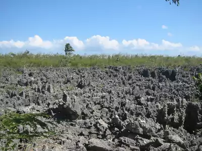
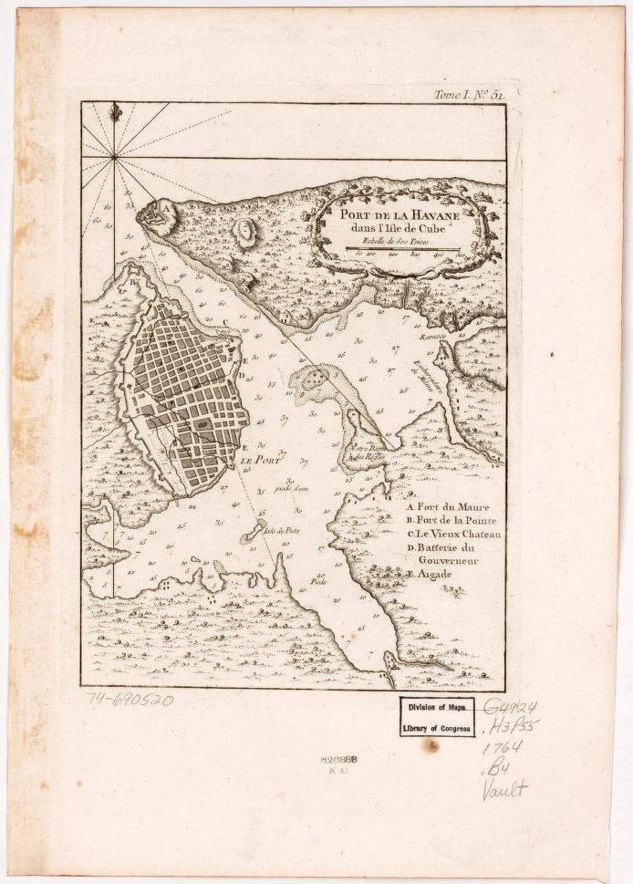
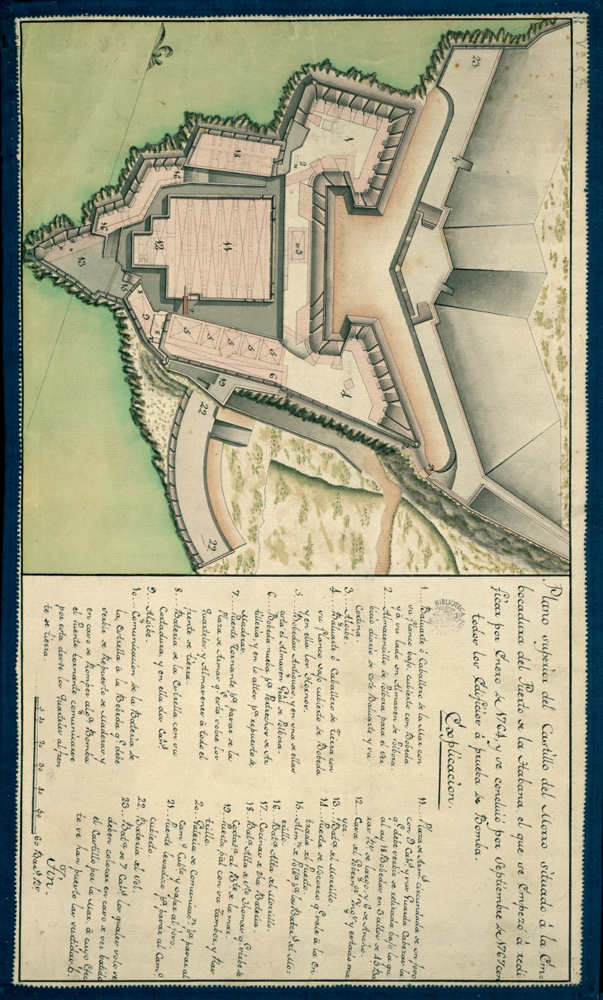
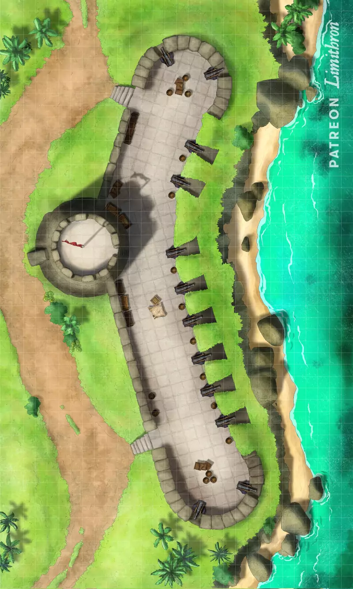
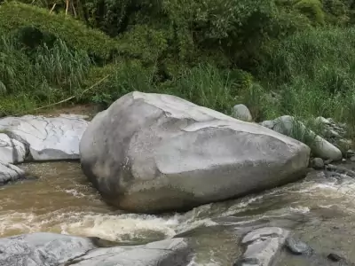
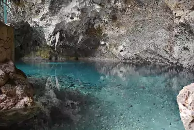
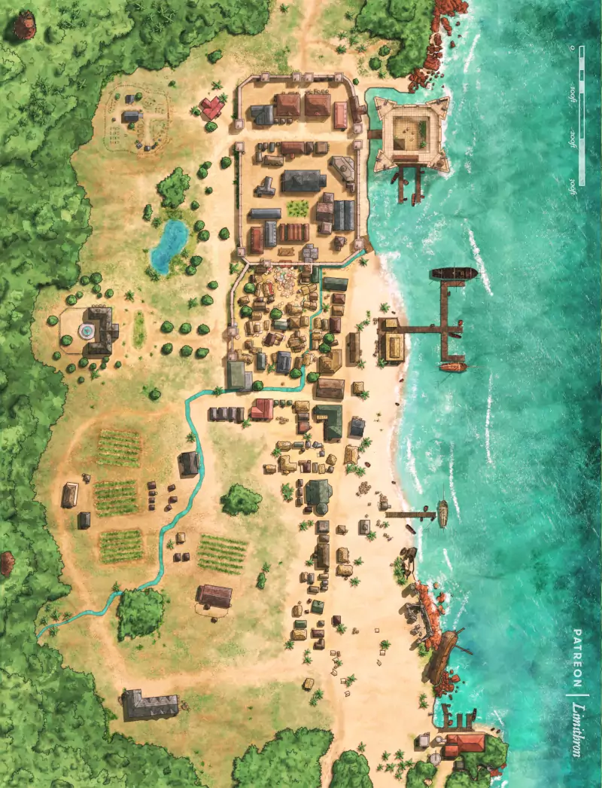
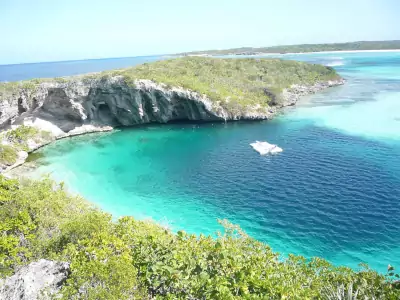

# Guía de viajes

En nuestra guía de viajes te vamos a mostrar los sitios más interesantes, más divertidos, salvajes o terroríficos del Caribe de 1722. Lugares dominados por los seres de los Mitos donde la aventura se puede respirar. Muchos de ellos puedes usarlos para ambientar tus sesiones y otras muchas son semillas de rol para tus propias aventuras. Mi recomendación es que añadas las tuyas y hagas este mundo mucho más rico.

La estructura es muy sencilla. El Caribe está dividido en diferentes zonas. Cada zona en las principales ciudades y cada ciudad en los lugares más interesantes. Podrás encontrar, tiendas, tabernas, monumentos, cuevas, lagos, … Muchas zonas tienen lugares de interés que no pertenecen a ninguna comunidad, pero que son lo suficientemente interesantes como para ser destacados en los apartados de "Otros lugares de …".

\sinc

## Islas piratas

\conc

En 1722 podemos encontrar diferentes enclaves piratas, puertos seguros donde refugiarse en caso de problemas con ingleses o españoles, donde poder vender su botín y donde divertirse y beber hasta caer inconsciente.

Algunos de estos enclaves son lugares independientes fuera del control de las potencias europeas y otras veces son territorios controlados, donde sus gobernadores son altamente corruptos o les interesa dar cobijo a piratas para que causen problemas a sus enemigos.

### Isla de la Tortuga

_Población:_ 6.000 habitantes

_Controlada por:_ Oficialmente Reino de Francia, pero es una zona libre para los piratas.

La Isla de la Tortuga se encuentra en la costa noroeste de La Española, la zona controlada por Francia. Hoy en día es un refugio pirata cuyo nombre es sinónimo de aventuras, riquezas y ron.

El norte de la isla es inaccesible (de ahí su nombre de Costa de Hierro) con grandes acantilados y fuerte oleaje y el sur ha sido fortificado con los años por los diferentes conquistadores, de forma que sus puertos y fondeaderos son muy difíciles de tomar.

Los taínos nunca llegaron a establecerse definitivamente en Tortuga, que llamaban Baynei, así que su presencia en la isla es muy escasa. Sin embargo, puedes encontrar colonos ingleses, franceses y españoles, muchos de ellos piratas retirados, que se han establecido con los años y que han vivido gracias a la agricultura y al comercio y abastecimiento de los barcos piratas. Les proporcionaban provisiones y diversión y a cambio conseguían parte del botín robado.

Hay desde hace unos pocos años varias poblaciones de agricultores muy creyentes y beatos llevados aquí por la rama propagandística de la RCPC para ir poco a poco civilizando a los violentos piratas de la isla.

#### Hôtel de ville

Se conoce como «Hôtel de ville» o ayuntamiento a un viejo edificio de gran tamaño y de estilo francés situado en el centro de Tortuga. Es el único órgano de gobierno de Tortuga. En él se reúnen los capitanes piratas y toman decisiones sobre el gobierno de la isla y su defensa. También resuelven sus disputas siguiendo el antiguo código de la hermandad de la Costa. Las deudas de honor se resuelven en el patio interior del ayuntamiento con duelos a muerte. El patio también se usa de cadalso en casos muy graves de traición.

A la entrada del ayuntamiento hay un tablón de anuncios con montones de ofertas. Si no sabes leer, siempre hay alguien que te pueda ayudar por unas monedas con los anuncios de compra y venta de objetos y de propuestas de trabajo.

Cada semana se puede consultar el tablón para buscar anuncios de venta o intercambio de objetos extraordinarios. Puedes generar siempre que vayan a verlo un tesoro de tirada de botín 1d8 en el que solo se puedan tirar en la Tabla de Objetos extraordinarios.

El precio o por lo que quieran intercambiar queda a tu elección. También es una buena forma de darles el objeto que necesiten para empezar o afrontar una aventura.

Puedes usar el tablón para introducir tus propias aventuras. Un anuncio buscando aventureros valientes que hagan una gesta por una nueva suma es un clásico de los juegos de rol.

#### La Flor de Lis

La taberna más popular de Tortuga es la Flor de Lis. Es el bar más sucio y depravado de todo el Caribe. Tras semanas o meses de navegar sin tocar tierra, la gente de mar viene a la Flor de Lis con ganas de emborracharse, divertirse y en muchos casos de cumplir sus oscuras fantasías. No hay nada prohibido en la Flor de Lis. Juego, alcohol, drogas, sexo, etc. Tú propón y la Flor de Lis lo puede hacer realidad, por muy raro que sea tu fetiche o tu pulsión sexual. Si tienes dinero se buscan la manera de cumplirla.

La Flor de Lis es propiedad de Dupont, un personaje de turbio y oscuro pasado que se sospecha fue pirata o corsario. Se cuenta que construyo la Flor con el botín pirata que consiguió en su carrera delictiva.

En realidad, Dupont es un lengnita llamado [Theros](https://legadodetheros.com/ "El legado de Theros") que escapo a la Tierra y se busca la vida construyendo la Flor de Lis. Nadie sabe que no es humano, ya que lo oculta muy bien. Además, ayuda mucho que la mayoría de la gente a su alrededor esté borracha o más interesada en las cartas o en los cuerpos que se mueven seductoramente en el escenario. Parte del éxito de la Flor de Lis se deben a la fortuna en rubís lunares que se trajo de su mundo y que le han permitido hacer de todo.

El local tiene 2 plantas y un sótano. En la primera planta están las barras de bar, las salas de juego y un par de escenarios donde bailan sensualmente todo tipo de personas en cualquier tipo de combinación, solos, parejas, tríos, etc. En el piso superior, hay diferentes espacios privados para todo tipo de prácticas sexuales y no sexuales.

Contrariamente a lo que hemos dicho antes, si hay límites en la Flor de Lis, los que tú quieras y con los que tú y tu mesa estéis contentos. Puede ser desde que sea una simple taberna muy animada con broncas diarias, a que sea un lugar de vicio, lujuria y perversión desenfrenada con mazmorras BDSM, peleas a cuchillo. Tú eliges, es tu juego.

#### Lucha con machete

En los sucios callejones de Tortuga y en sus tabernas son muy comunes los combates a machete, de forma que se han ido desarrollando una serie de técnicas de combate con machete que acabarán creando el _Tire machèt_ durante la Revolución haitiana. Puedes tratar de buscarte un experto en este tipo de lucha que te enseñe los trucos de la pelea con machetes.

Por unos 200 doblones (entre sobornos y rondas de alcohol) y una semana y media de entrenamiento intensivo (aprender técnicas, duelos, curarse heridas y demás), mejorará el valor de Pelear del personaje en un nivel de dado y un +1 al daño cuando combata con machetes o estoque. Su valor de habilidad no sufre cambios, por ejemplo, al gastar avance.

### Cayos de Florida

_Población:_ 1500 habitantes repartidos por todos los cayos, entre tribus calusas y tequestas, cimarrones y raqueros, rescatadores de barcos hundidos.

_Controlada por:_ Reino de España

Los cayos de Florida son un conjunto de más de 800 pequeñas islas colocadas unas detrás de otras en curva desde el extremo inferior de Florida hasta casi llegar a Cuba. Estas islas estaban principalmente desiertas, con algunas poblaciones en las más grandes como Cayo Hueso.

Los cayos de Florida es uno de esos territorios de frontera donde las gentes que no encajan en la sociedad se establecían para vivir a su manera. Aunque oficialmente son parte de los territorios de ultramar del Reino de España, sus habitantes son bastante independientes viviendo bajo sus reglas.

Debido a que esta muy cerca de La Habana y en la ruta entre las poblaciones de la costa este de la Florida como San Agustín y las ciudades de Cuba, tiene un importante tráfico de cargueros comerciales. Lo que hace que sus aguas estén llenas de barcos piratas.

#### Cayo Hueso

Cayo Hueso, la principal isla de los cayos, es un refugio en 1722 para piratas y raqueros (ver más adelante). Es un lugar seguro donde vender tu botín y comprar provisiones y hacer reparaciones básicas. No es extraño encontrarse a toda la tripulación de un barco pirata dándose una fiesta en la playa con carne asada y ron para celebrar su buena suerte.

Cayo Hueso recibe por su nombre de Ponce de León, que la llamó así por la gran cantidad de huesos humanos que encontraron al llegar. Se supone que son restos de calusas, la tribu indígena que vivía en los cayos. Se cree que la isla era terreno sagrado y se usaba como cementerio. Si alguien decidiera levantar un ejército de no-muertos podrían levantar de las arenas de sus playas suficientes esqueletos para crear un pequeño ejército de los muertos.

Desde cayo Hueso también hay un importante comercio de limas de los cayos, más ácidas y aromáticas y con más vitamina C que las limas normales y esponjas de mar que son usadas en la higiene personal y en la limpieza del hogar.

**Entrenamiento para pescar esponjas de mar:** Las gentes que se dedican a la pesca de esponjas de los Cayos nadan casi como peces y pueden aguantar la respiración mucho más que una persona normal. Las técnicas que te pueden enseñar los pescadores de esponja hacen que nades mejor y que aguantes la respiración mucho más.

Por 300 doblones y una semana de entrenamiento pueden entrenarte para mejorar tus dotes de nadador o para practicar tu apnea. A nivel de juego, puedes conseguir un +2 a Atletismo a la hora de nadar o que las rondas que puedes aguantar bajo el agua sean 2 + (2 veces dado de Vigor). Alguien con vigor 8 podría aguantar 18 rondas en vez de 10. Con dos semanas y 500 doblones puedes conseguir las dos ventajas.

Si tienes la desventaja Mal Nadador y pagas 400 doblones y entrenas 1 semana podrás quitarte la desventaja.

#### El tesoro de Cesar

Se dice que en alguna de las islas desiertas de los cayos está escondido el tesoro que el pirata Cesar ha acumulado como pirata independiente y luego como lugarteniente de Barbanegra.

El tesoro de Cesar se encuentra en el actual cayo Big Pine. Escogió ese lugar debido a que tenía una gran zona rocosa en el interior del cayo que no filtraba el agua del mar. En 1720, con la ayuda de dos tripulantes de su confianza, excavó en la roca viva y deposito su cofre del tesoro dentro, lo tapó con una losa y lo sello.

El tesoro de Cesar tiene una tirada de TPC 12+2 para determinar su contenido y puede tener de todo menos objetos de gran tamaño. Lo más interesante es que cesar dejo dentro su diario personal narrado en una mezcla de memorias hasta aprender a escribir y diario a partir de ese momento. Si lo descubriera la Orden o Barbanegra comprometería su tapadera y pondría en peligro su vida. También se le podría chantajear con entregarlo para conseguir dinero o favores. Se puede considerar como un libro de los Mitos.

**Título:**  
Diario personal de Cesar

**Autor:**  
Cesar

**Idioma:**  
Castellano

**TPC:**  
d4

**Tamaño:**  
Libro

**Estado de conservación:**  
Usado y leído

**Rituales:**  
Silbar al viento, Cegar el mascarón de proa, Brindar por el mar, Cornucopia

**Tiempo de lectura:**  
1 semana

**Características especiales:** Si la Orden o Barbanegra descubriera este diario comprometería su tapadera y pondría en peligro la vida de Cesar. También se le podría chantajear con entregarlo para conseguir dinero o favores.

#### Raqueros

Un tipo muy especial de piratería se da en los Cayos de Florida, los "wreckers" o raqueros. Las gentes de los cayos dedican a engañar a los barcos que van por sus aguas con faros falsos y los hacen encallar o hundirse y luego a saquear los restos. No es exactamente una actividad ilegal, por lo que no son tan perseguidos como los piratas de alta mar.

Es muy difícil demostrar que alguien ha usado luces falsas para engañar a los barcos y este método de vida está tan integrado en la vida de los cayos que nadie quiere matar a la gallina de los huevos de oro. Además, el derecho de salvamento les da a los raqueros la propiedad de los restos de los barcos.

### Islas Caimán

_Población:_ 300 habitantes

_Controlada por:_ Gran Bretaña

Las Caimán se encuentran al sur de Cuba, al noroeste de Jamaica y al este del Yucatán. Este archipiélago está formado por 3 islas y solo Gran Caimán, la mayor isla tiene una localidad estable, George Town. Las islas están bajo el control del Gobernador de Jamaica desde 1670, aunque son bastante autosuficientes y auto-gobernadas.

Las dos islas menores han sido refugio de piratas y de cimarrones durante décadas. En sus calas han fondeado barcos para carenarlos y en sus selvas se han conseguido carne, fruta y agua potable. También ha sido lugar de reunión y parlamento en épocas de grandes crisis para los piratas.

#### George Town

George es una pequeña comunidad en el suroeste de Gran Caimán. Se dedican principalmente a la pesca y la venta de pescado ahumado. Las playas están llenos de ahumaderos y secaderos de pescado que luego es vendido en Jamaica. Tiene un pequeño puerto pesquero donde fondear y servicios básicos como tiendas de provisiones, carpinteros navales, hospital y una pequeña guarnición de soldados ingleses.

Los profundos han empezado a hibridarse con los habitantes de la zona, especialmente con los pescadores. Una tirada de Mitos podría detectar algunos caos de híbridos entre la gente joven que está en el puerto. Por ahora solo son una minoría y parecen todos de la misma familia.

Si se pregunta o investiga, todos los híbridos son parte de una familia de pescadores de origen español que viven fuera de la población, los Santos. Son muy reservados y huraños, pero no son agresivos.

Los Santos y la tribu profunda con la que se hibridaron están desterrados por alguna actividad ignominiosa que realizaron hace más de un siglo. Ningún profundo se acercará a ellos ni tendrá tratos con ellos y si los encuentran fuera de su territorio serán ejecutados.

Los Santos eran una familia muy creyente que cuando entraron en contacto con los profundos vieron su divinidad y que eran hijos de Dios en vez de demonios. Trataron de evangelizarlos en su fe cristiana y lo lograron. Dejaron de adorar al dios pulpo y la tribu terminó adoptando los preceptos cristianos e hibridándose con los Santos.

Los Santos saben todo lo que se puede saber sobre los profundos del Caribe. Aunque huraños son muy religiosos y una persona que muestre su fe cristiana podría acercárseles y sacarles información útil sobre los profundos.

**El ostracismo o "Ymg' yog ah"** es una antigua ley de los profundos reservada a las tribus que hayan hecho actos terribles contra otros profundos o hayan ofendido al Gran Cthulhu. Cualquier profundo que sea excluido no podrá salir de un pequeño territorio que se les asignará. Ningún profundo tendrá tratos con ellos y si se los encuentran fuera de su territorio los deben matar. Solo un gran cacique puede declarar la exclusión, pero nadie puede quitarla, es para siempre. Teniendo en cuenta que los profundos son inmortales es una pena muy dura.

#### El infierno

En el extremo noroeste de la isla Gran Caimán hay una zona con extrañas formaciones rocosas negras y puntiagudas llamada el Infierno. Aunque parezca un paisaje extraterrestre o del inframundo, es totalmente natural. Hay muchos bulos y cuentos sobre que el sitio es usado por practicantes de artes mágicas para sus hechizos y rituales. No supone ninguna ventaja hacer magia aquí, aparte de que está bastante lejos de miradas indiscretas.

Todos estos bulos los ha hecho correr la rama propagandística de la RCPC para identificar a practicantes de magia. Tienen un agente cerca que registra quién llega y qué hace y manda informes sobre sus actividades. La rama decide, según esos informes, si los seduce para su casa, si los deja en paz por ahora o si manda acabar con ellos a la rama militar.

Cuando necesiten hacer algún tipo de ritual o ceremonia mágica puedes hacerles llegar las historias de este lugar. Como poco perderán el tiempo y como mucho tendrán una emboscada de agentes de la Orden.

#### La playa de 7 millas

La playa de 7 millas es una playa larguísima en forma de media luna de arena blanca situada en el extremo occidental de la isla de Gran Caimán.

Esta playa ha sido usada desde hace décadas por los piratas para hacer sus concilios. Cuando un gran peligro amenazaba a las tripulaciones piratas de todo el Caribe, se organizaba un gran conclave pirata en esta playa en las noches de luna llena. Los barcos fondeaban en sus aguas y los representantes de los diferentes barcos desembarcaban en la playa para parlamentar y llegar a acuerdos y planes para acabar con la amenaza. No ha vuelto a usarse desde que se disolvió la Hermandad de la Costa.

## Cuba

Cuba es la principal isla del Caribe. Con más de 1000 km de punta a punta y prácticamente llana, excepto por 3 cordilleras en el centro, en el extremo oeste y la más alta en el extremo este. Mientras que la costa está altamente poblada por los colonos españoles, el interior todavía es territorio taíno.

Sin embargo, debido a que sus tierras son fértiles y llanas y están regadas por gran cantidad de ríos, poco a poco el interior de la isla está siendo colonizado y su selva destruida y sustituida por plantaciones de tabaco, café y otros productos de gran valor comercial. Desplazando, además, a las poblaciones taínas aún más al interior.

Lo que antes eran simples sendas, ahora son caminos de piedra muy transitados. Lo que hace siglos eran bahías naturales, ahora son grandes puertos comerciales. Y lo que antaño eran pequeños poblados, ahora son grandes ciudades de miles de habitantes.

Aun así, el interior todavía es un lugar de misterios donde una riada puede destapar las ruinas de un templo perdido o un extraño cenote de origen desconocido. Igual en la oscura jungla puedes encontrarte un árbol ceiba sagrado.

Y los miles de islotes que abundan en sus costas también pueden ser fruto de misterios. Quizás encuentras una cala pirata, una bestia mutada de la RCPC o un tesoro enterrado.

### La Habana

_Población:_ 62.000 habitantes

_Controlada por:_ Reino de España

La Habana en 1722 es la mayor ciudad de todo el Caribe. Es la ciudad con más población y el epicentro comercial del Caribe. Todas las novedades de resto del mundo llegan primero a La Habana y luego al resto del Caribe.

El puerto de La Habana es el mayor puerto del Caribe y todo el comercio entre las colonias españolas del Caribe y su metrópolis pasan por La Habana. El puerto está protegido contra invasiones de piratas y potencias extranjeras por dos fortalezas armadas con cañones de gran calibre, una de ellas controlada por la RCPC. Cada fortaleza está a un lado de la entrada a la bahía de La Habana y sin tomar ambas fortalezas es casi imposible tomar la ciudad.

Todo el dinero que el comercio trae a La Habana se ha transformado en todo tipo de lujos comparables a ciudades como Madrid, Londres o París. Hay mansiones de todo tipo de estilos arquitectónicos, grandes edificios gubernamentales, teatros e incluso su propio periódico. Hay artistas que pintan sus calles y a sus habitantes bajo el cobijo de mecenas de las artes.

Su prosperidad está atrayendo a gentes del campo y a emigrantes de España buscando trabajo y una mejor vida. Pero también a buscavidas atraídos por el dinero fácil que no tienen escrúpulos en cometer actos delictivos para prosperar.

La persona más importante de Cuba es Gregorio Guazo y Calderón, Gobernador de Cuba y Capitán General. En él reside todo el poder político y militar de la isla. La segunda persona más poderosa es Hernando de Villalba, propietario de la RCPC y, por tanto, la persona más rica de Cuba y posiblemente del Caribe.

Mapa de La Habana

#### Plaza de Armas

La plaza de Armas es el centro de la vida comercial y social de La Habana. Varios edificios gubernamentales y militares están a su alrededor, así como la sede central de la RCPC. En las tabernas de las calles aledañas se pueden disfrutar de las delicias culinarias de la cocina criolla y en sus tabernas probar el mejor ron de la isla. Hay mucha agitación día y noche y es un lugar de encuentro de los locales y los foráneos.

En plena plaza hay varios postes y tablones donde se colocan los diferentes bandos municipales, nuevas leyes y tratados comerciales, sentencias de juicios y condenas, … Por unas monedas el ayuntamiento te deja poner mensajes personales como anuncios de bodas, defunciones o nacimientos u textos más empresariales como ofertas de trabajo, propuestas comerciales o compraventas de productos y bienes inmuebles por poner unos ejemplos.

En momentos especiales y con piratas violentos y famosos y criminales muy buscados que han creado gran conmoción social, el gobernador monta un cadalso donde colgar a los sentenciados a muerte. Esto atraen a mucha gente, con lo que no sería imposible montar una huida espectacular a la desesperada de PJ o PNJ que hayan sido condenados a morir en la horca.

#### Castillo de los Tres Reyes Magos del Morro

El castillo de los Tres Reyes, también conocido como castillo del Morro, se terminó de construir hacia 1610. Con unos 12 cañones y una guarnición de unos 500 defensores. Protege la ribera norte de la entrada a la bahía de la Habana.

A diferencia del Castillo de San Salvador de la Punta, que está enfrente en la ribera sur, el Morro, como lo conoces los locales, está controlado por el RCPC. La guarnición está controlada por el director general de la RCPC en La Habana, de forma que la RCPC controla todos los barcos que entran y salen de La Habana.

Todo el personal del Morro son empleados de la RCPC y son adeptos de la Orden del Gran Cthulhu en mayor o menor grado. En sus sótanos se practican ritos de adoración a Cthulhu, se retiene y tortura a individuos que son peligrosos para el culto y se guarda una buena biblioteca de libros y objetos de los mitos. Es la sede del culto más importante y mejor defendida en todo el Caribe. Es donde Hernando de Villalba hace sus ritos más importante y donde una vez al año se monta un importante conclave de directores generales de la RCPC.

Si tu mesa es atrapado por la RCPC o la Orden, seguramente acabarán aquí. Tienes un relato titulado "Escapando del Morro" que puedes llevarles para que se fuguen de esta prisión de "máxima seguridad".

Dentro del Morro hay siempre una media de 200 militares entre oficialía y soldadesca. Usa Infantes de Marina para los soldados y añádeles Idioma Cthulhunés d6 y Mitos d4 a los oficiales, además de una arma emponzoñada +1.

Solos los cargos más altos viven fuera del castillo, el resto viven y trabajan dentro de la fortaleza. Hay turnos de 8 horas, con que un tercio trabaja y vigila, otro tercio se entretiene en los barracones o está de permiso y el último tercio duerme. Eso supone que siempre hay unas 70 personas vigilando y unas 140 despiertas.

Parte de la fortaleza da a unos acantilados contra el mar. Estos acantilados son muy complicados de escalar y caerse al agua supone acabar aplastado contra las rocas que hay debajo. La parte que da a tierra tiene unos sólidos muros de entre 15 y 30 metros según la zona. Ambas partes están vigiladas, pero, sobre todo, la del muro que da a la península. Solo se puede entrar al Morro desde tierra, a través de una puerta levadiza reforzada que hay en el muro terrestre. El muro terrestre es escalable, pero está bastante vigilado.

Dentro de la fortaleza hay una serie de edificios que sirven de barracones, oficinas, comedores, cocinas, etc. El más grande de todos, que está en medio de la plaza, lo usan los oficiales para temas importantes, como guardar objetos valiosos o retener a prisioneros importantes en un gran sótano con celdas que tiene debajo. Para acceder al sótano, hay una trampilla de madera reforzaba con hierro con un candado de seguridad (-2 a Latrocinio), cuya llave lleva el oficial de servicio en ese turno.

Mapa del Castillo de los Tres Reyes Magos del Morro

#### La mansión Villalba

La mansión Villalba, en la que Hernando de Villalba lleva enclaustrado los últimos 10 años, se encuentra en las afueras de La Habana. A pesar de su aspecto plácido y opulento, es una fortaleza inexpugnable, protegida física y mágicamente.

Antiguamente, Hernando solía dar grandes fiestas con las personas más ricas e importantes de La habana, pero ha dejado de perder tiempo con la vida social para centrar todos sus esfuerzos en sus planes apocalípticos. La rama propagandística de la RCPC se ha encargado de desviar todos los actos sociales que se hacían en la mansión Villalba a los casoplones de cultistas de rango superior en al Orden y clase alta y con recursos. Se ha demostrado el valor de estos actos sociales para detectar y extender rumores y contactar con personas importantes a las que atraer a la Orden, seducir, amenazar o tentar.

Físicamente, hay un pequeño ejército de guardas adeptos a la Orden que darían su vida por Hernando. Hay unos 42 guardas, 14 por turno. Los que no están de guardia están descansando en unos barracones detrás de la mansión. Podrían estar activos en un par de minutos.

Los guardias solo vigilan los jardines y el perímetro de la casa. Por orden expresa de Villalba, los vigilantes no entran en la casa. En el interior solo hay personal de servicio de total confianza de Villalba y el propio Villalba. En sus tiempos podría tener prisioneros en su sótano, pero hace mucho que nadie los usa. Esos tiempos de torturas y asesinatos rituales acabaron hace unos años para este viejo líder sectario.

Por las noches, además, se sueltan perros mutados (8) que no dudan en matar y devorar a los que entren en los jardines de la mansión. Estos perros fueron de los primeros experimentos de la RCPC y los mejores ejemplares de cada camada se destinan a la protección de Villalba.

**Perro mutado:**

Estos perros han sufrido peligrosos experimentos que les han dado mayor tamaño y fuerza, visión nocturna, garras y dientes más peligrosos y los han hecho terriblemente peligrosos. Esos mismos experimentos les han dado un aspecto cadavérico, ojos negros y sin pupilas y un verdor fosforescente cuando se excitan y van a entrar en combate y que se ve a distancia en la oscuridad.

* **Atributos:** Agilidad d8, Astucia d4 (A), Espíritu d6, Fuerza d10, Vigor d8
* **Habilidades:** Atletismo d8, Intimidar d8, Notar d6, Pelear d8, Sigilo d8
* **Paso:** 10; **Parada:** 6; **Dureza:** 7(1)
* **Ventajas:** Alerta
* **Capacidades especiales:**
    * **Pelaje duro:** Su pelo y su piel le confieren armadura +1
    * **Mordisco brutal:** FUE+d6+2
    * **Garras brutales:** FUE+d6+2
    * **Visión nocturna:** Ignora las penalizaciones a la visibilidad por penumbra y oscuridad, lo que le permite ver con normalidad excepto en condiciones de oscuridad completa.
* **TPC:** 1d4 (manada)

**Guardia de la mansión:**

Los guardias son adeptos de la orden y tiene conocimientos básicos de Mitos, de magia y de cthulhunés. Son muy meticulosos en sus registros y no sobornables, con lo que es muy difícil meter armas escondidas entre la ropa u objetos de mayor tamaño en carros y carretas. Tampoco se retrasan en sus rondas, ni paran para fumar o beber. Cumple estrictamente sus horarios con lo que es muy difícil encontrar agujeros en su seguridad.

* **Atributos:** Agilidad d6, Astucia d6, Espíritu d6, Fuerza d8, Vigor d8
* **Habilidades:** Atletismo d6, Disparar d8, Idioma materno d6, Idioma cthulhunés d4, Mitos d4, Intimidar d6, Notar d6, Pelear d8, Sigilo d6
* **Paso:** 6; **Parada:** 6; **Dureza:** 6
* **Ventajas:** Trasfondo Arcano (Hechicería primigenia), Alerta
* **Equipo:** Sable de abordaje (FUE+d6) y mosquete (10/20/40, 2d8, Recarga 3)

Por lo menos 1 de cada 4 guardas, presumiblemente el jefe del grupo, debería tener una arma bendecida o ponzoñosa que hará +2 al daño y se considerará mágica.

Mágicamente, es imposible lanzar un hechizo que penetre dentro de la mansión. Solo poderosos taumaturgos con grandes rituales pueden intentar algo. Y desde dentro tampoco es muy viable, ya que la Orden con la ayuda de la rama tecnológico-mágica de la RCPC ha podido copiar el poder de los lloigors de drenar magia. En unos pocos minutos en la mansión, un brujo se queda sin el poder suficiente ni para poder hacer un simple ritual.

El campo de drenaje de magia de la mansión drena todos 1d6 PP por turno a 500 metros alrededor de la mansión. Absorbe 1d8 por turno si entras dentro de la mansión.

Es la vivienda particular más grande de La Habana, incluso que la del gobernador. La casa tiene 2 pisos y un sótano/mazmorra. Desde el 2 piso se puede acceder a un pequeño observatorio astronómico que Hernando usa como biblioteca de los Mitos y lugar donde hacer sus invocaciones.

El palacio tiene su propio pozo en caso de necesitarlo y una pequeña granja con animales de corral y un pequeño huerto donde cultivar frutas y verduras. Hay un pequeño invernadero al que no accede nadie, excepto Hernando donde hace sus experimentos.

Si tu mesa necesita infiltrarse en la mansión, tienes un relato titulado "Infiltración" que puedes dirigirles para entrar y salir de la mansión sin ser detectados.

#### Calle Empedrado

La Hermandad del Sargazo tiene en esta calle un piso franco. Si te acercas al portero y le dices la contraseña adecuada, él, tras comprobar que nadie te sigue, te dará una llave que te abrirá la puerta del segundo piso.

Este piso franco está muy completo con camas para 5 personas, comida, bebida, cocina. Lo más importante es una pequeña mesa de operaciones con material médico para todo tipo de situaciones, desde extracciones de balas y piernas rotas, hasta medicamentos para fiebres y diferentes males del Caribe. También puedes encontrar munición y suele ser costumbre aprovisionar el piso con cosas que te sobren, de forma que se pueden encontrar cosas muy curiosas entre los objetos que han dejado antiguos huéspedes de la Hermandad, desde ejemplares de la VLH hasta extrañas plantas de la selva o muestras de seres de los Mitos.

La norma es que no puedes estar más de dos noches o en caso de heridos hasta que sane el herido. El propio portero se hará cargo de cumplir la norma si te la saltas. Él se encargará de traer todo tipo de matasanos, menestrales, etc. en caso de necesitarlos.

El piso tiene salida al tejado, de forma que si descubren a sus inquilinos puedan huir por los tejados de la ciudad.

#### Real Astillero de La Habana

A principios del siglo XVIII la marina española ha empezado a renovarse y el Real Astillero, construido en 1716, será unos de los lugares donde se monten los nuevos barcos de la marina real española. Además, siendo La Habana el centro del comercio marítimo del Caribe, la construcción de barcos civiles también es un importante negocio y fuente de poder. Una compañía naviera no puede crecer ni funcionar sino se construyen o arreglan los barcos a la velocidad que exige el flujo comercial.

Es por ello que una de las jugadas más interesantes de la RCPC en Cuba fue conseguir adelantar varios años el proyecto del Astillero y conseguir que parte del astillero y del arsenal estén controlados por ella. De esta forma, la competencia queda en desventaja en cuanto a su capacidad naval y tienen unas instalaciones lejos de ojos curiosos donde poner en práctica toda su ciencia y magia naval.

El actual astillero tiene 2 partes bien diferenciadas, la pública y la privada de la RCPC. Cada una con sus talleres, sus diques, sus almacenes y sus propios trabajadores. De hecho, los diques de la RCPC están cubiertos por grandes toldos a los lados que no permiten ver en que se está trabajando.

Guardias propios de la RCPC vigilan las entradas y las salidas de esta zona y solo las personas recomendadas por los propios trabajadores del astillero pueden entrar a trabajar. La verdad es que todo lo que pasa en esta sección del astillero es alto secreto y o es extraño ver extraños barcos entrar en el astillero amparados por la oscuridad de la noche. Tampoco son infrecuentes los fuegos y las explosiones.

Todos los que trabajan en el astillero están bajo la rama militar de la RCPC y realizan todo tipo de modificaciones a los barcos. Pero solo un grupo muy reducido de menestreles adeptos a la Orden se encargan en un dique especial y secreto de las modificaciones más terribles y profanas.

Los almacenes están tan protegidos como bancos, ya que hay en ellos materiales muy valiosos y raros que la RCPC ha ido acumulando con los años.

Debido a la naturaleza, digamos, demoníaca de muchas de las cosas que hay en el astillero, hay un sistema de autodestrucción que detonaría varios explosivos en diferentes partes. Las explosiones y el fuego harían desaparecer la sección de la RCPC y su contenido. Puede parecer una idea exagerada, pero si personas de alta alcurnia y de poder político o religiosos descubrieran todas las cosas herejes que guarda en el astillero, la RCPC podría ser destruida en el futuro.

El sistema de autodestrucción se basa en tecnología serpigente y desde su despacho el gerente del astillero, siempre un cultista de la Orden de nivel medio, puede activar una gran cantidad de explosivos por todo el astillero de la RCPC.

Activar la autodestrucción significa tener un minuto para huir del astillero o el fuego y las explosiones acabarán con tu vida. La salida mejor es tirarse al agua, pero para llegar al mar habrá que pasar un infierno de fuego.

#### Local ilegal de juego de Alfredo Usía

Alfredo Usía es un criminal de La Habana y controla el juego ilegal. Es Además, un prestamista usurero al que no le tiembla la mano en cortar pulgares y romper piernas a la gente que le debe dinero y no le paga a tiempo. Y como no tiene un casino ilegal "secreto". Es secreto para las autoridades, pero conocido para el resto de habitantes de los bajos fondos.

Un viejo almacén del puerto sirve de tapadera del casino al que solo se puede acceder sabiendo el santo y seña. Hay mesas para jugar a la ruleta, los juegos con dados y los naipes. También hay combates de gallos con importantes apuestas.

**La casa siempre gana:** Es muy difícil ganar en las mesas de este casino ilegal. Los dados, las cartas, los crupieres, etc. todo está trucado. Si quieres apostar y jugar tendrás un -2 a todas tus tiradas. Si haces trampas, estas solo contrarrestarán las del casino, con lo que tirarás sin negativos.

Sin embargo, la estrella son las apuestas es una modalidad de pelea nueva creada por Alfredo, la pelea de caimanes. En un foso de agua con gradas a su alrededor hay combates entre caimanes seleccionados por su sed de sangre y su fuerza por sus entrenadores.

Alfredo tiene para días importantes una modalidad de pelea especial, caimán contra humano. Un deudor que deba muchos doblones puede pedir combatir contra un caimán en el foso y si gana Alfredo le perdona la deuda. Es un negocio redondo, ya que tanto si pierde y muere como o si gana, las apuestas de esa noche le van a dar más dinero del que le debe el moroso.

El foso de caimanes también ha sido usado para interrogar a personas que no querían hablar y en última instancia para deshacerse de cadáveres.

_**Recompensa extra de cordura (+1):** Desbaratar el local ilegal de Alfredo es librar al Caribe de una gran maldad. Supone sacar de las calles a un criminal peligroso con delitos de sangre, ayudar a sus deudores a salir a flote y evitar maltrato animal._

**Recuerda:** El juego patológico es un problema grave y no debe tomarse a la ligera.

#### Universidad de La Habana

La Universidad de La Habana está siendo construida por frailes Dominicos, que acaban de conseguir el permiso real y del Papa para crear la universidad. El campus se está construyendo en el convento de San Juan de Letrán.

Los dominicos necesitan de todo, materiales de construcción, objetos educativos o científicos, libros para su biblioteca, … Seguramente una persona de cualquier condición social que aporte algo de lo que los dominicos necesitan en su proyecto, puede conseguir que acepten dar una educación de calidad a quien fuese necesario. Si alguien que de normal no podría entrar a estudiar en la universidad puede conseguirlo si tiene un mecenas que le ayude.

#### Colegio San José

El colegio San José es un plantel (establecimiento público de instrucción primaria), creado por los Jesuitas entre 1722 y 1723, es el primer colegio público de La Habana. La única forma de financiación que tiene este colegio son los donativos de los ricos potentados de La Habana, ya que el voto de pobreza de los Jesuitas les impide tener propiedades y riquezas.

La situación económica del colegio no es buena y los jesuitas que lo administran andan siempre buscando donantes generosos. Donar parte de las ganancias robadas a gente malvada como la RCPC a un colegio público en graves problemas económicos suele ser un acto de bondad que deberías recordar a tu mesa.

Los jesuitas han ido recopilando a lo largo de los años un enorme archivo documental que guardan en el sótano del colegio. Contiene información de las grandes familias nobles y comerciantes de La Habana. Gracias a sus trabajos como confesores, tutores e incluso administradores han accedido a mucha información reservada que no recogen los archivos públicos de La Habana. Si eres generoso con el colegio, puede que te den acceso a su archivo.

El archivo del colegio San José otorga un +1 las tiradas de Investigar cuando se busca información relacionada con las altas esferas de Cuba. También es una sencilla biblioteca de los Mitos que otorga un +1 a las tiradas de Mitos.

#### La librería de La Habana

En uno de los callejones aledaños a la plaza de Armas, Isadora de la Guía y Arango tiene una pequeña librería, Librería Guía. Su padre la abrió hace 40 años cuando llego a Cuba desde España. Al morir este, Isadora continuo con el negocio de compraventa de libros.

La librería es pequeña, oscura y destartalada, con estanterías hasta el techo abarrotadas de libros. Y siempre encontrarás a Isadora en alguna esquina fresca a resguardo del sol y el calor enfrascada en la lectura de alguno de los nuevos tomos que han caído en sus manos. Levantará la vista de su libro, te mirará de arriba abajo y si ve que llevas algún libro te lo quitará de las manos y empezará a ojearlo.

Solo Isadora conoce el sistema de clasificación que usaba su padre y solo ella puede encontrar algo en ese laberinto de estantes llenos de libros. Lo que a Isadora le lleva minutos, si no segundos, a cualquier otra persona no entrenada podría llevarle días revisando libros y más libros.

Isadora sabe apreciar los libros de los Mitos, reconoce su valor y suele intercambiar este tipo de libros e incluso comprarlos. Si apareces por allí con algún libro que hable de los Mitos, estará encantada de ojearlo y darte su opinión.

Isadora es una de las personas que más sabe sobre los Mitos de todo el Caribe, pero solo a nivel teórico, porque nunca ha hecho trabajo de campo. Tu mesa, si se gana su confianza, podrá consultarle sobre objetos de los Mitos, maldiciones, hechizos, rituales, …

#### La verdad de La Habana

El periódico más leído del Caribe (sobre todo por ser el único) tiene su sede en La Habana, en un caserón de dos plantas de piedra muy deteriorado que es lo único que Delapore puede permitirse. En la planta baja está la redacción y la imprenta. La redacción está en una esquina, es un par de mesas largas donde Antoine y dos viejos escribanos retirados se dedican a recabar historias reales y chismes y darles formas e imprimirlos en papel.

La imprenta, sin embargo, es un modelo nuevo que Mary Read le ha proporcionado del botín de un mercante español y que imprime ejemplares muy rápidamente. La imprenta es manejada por Ernesto, oficio que le enseño de pequeño su padre, el hermano de Antoine y su socio en la imprenta que tenían en París.

En la segunda planta está la vivienda de Antoine y Ernesto. En este piso Antoine tiene su biblioteca personal y el archivo con todas las ediciones de la VLH. Este archivo es una estupenda biblioteca de los Mitos (con un bono de +3) que Antoine te permitirá usar si le caes bien. La VLH lleva unos 10 años recabando cada mes todos los sucesos raros que han pasado en el Caribe con más o menos "rigor" y Antoine siempre puede confirmarte si la historia que buscas es real o una exageración para vender ejemplares.

Antoine ofrece dinero contante y sonante al que venga con una historia lo suficientemente buena, sobre todo si trae algún tipo de prueba. Puedes venderle tu historia, pero no trates de mentirle, Antoine es un viejo zorro y sabe cuando le cuentan la verdad y cuando no. Además, ya se encargará él de meterle las exageraciones y el sensacionalismo que la historia necesite para vender su periódico. Puedes empezar si quieres el relato salvaje "Primera plana".

La otra opción de trabajo es vender ejemplares de su periódico. Te los vende a mitad del precio normal, a unos 2 doblones, con lo que puedes venderlo a 4 doblones. Piensa que unos 100 periódicos ocuparían en tu barco un barril de espacio, así que si llevas 100 periódicos podrías sacar unos 200 doblones de beneficios. Puedes empezar, si quieres, el relato salvaje "Repartidores".

### Matanzas

_Población:_ 12.000 habitantes

_Controlada por:_ Reino de España

Matanzas se encuentra en una plácida bahía en la costa norte de Cuba. Es conocida como "La ciudad de los puentes", pues tienes bastantes que se han ido construyendo sobre los 3 ríos que la atraviesan. Está rodeada de grandes planicies muy fértiles debido a los regadíos que permiten los 3 ríos.

Como curiosidad de la ciudad fue fundada por entre unas 20 o 30 familias procedentes de las Islas Canarias que se establecieron como agricultores en esas tierras. En 1722 las familias más ricas e importantes de Matanzas son de origen canario.

#### El castillo de San Severino y El Morrillo

Estas dos fortificaciones son las principales defensas del puerto de Matanzas, cada una a un lado de la Bahía de Matanzas. El castillo es una gran obra de ingeniería que se empezó a construir en 1653, pero se paró en 1697 debido a su elevado coste. Es por ello que se tuvo que construir el Morillo para tener por lo menos una defensa activa en la ciudad.

El Morrillo es un proyecto mucho más pequeño que se ha terminado hace poco (1720). Tiene la última tecnología militar y aunque es mucho más pequeño que San Severino tiene una batería de cañones mucho más precisos, más destructivos y con mayor alcance.

Como plan para pagar su mantenimiento, la administración local ha cedido/alquilado San Severino a la RCPC. El dinero que pagan como alquiler les sirve para en un futuro poder terminar la obra y sufragar su mantenimiento actual.

La RCPC la usa como sede central en Matanzas, pero también como almacén. Los sótanos son territorio de la Orden que usa para sus oscuros planes y sus diabólicos rituales.

Fortaleza de El Morrillo

#### Escuela de la Destreza de Diego Rodríguez de Guzmán

La Destreza es una escuela de esgrima (y casi una filosofía de vida) de origen español que cuando llego al Caribe desemboco en una nueva escuela llamada la Destreza Indiana. La Destreza Indiana es una adaptación de la Destreza a las singularidades del Caribe.

Diego Rodriguez de Guzman es un maestro navarro de la Destreza que junto a otros esgrimistas de Cuba están desarrollando un nuevo arte marcial, la llamada Destreza Indiana. Tiene una escuela de esgrima en Matanzas, donde los ricos y poderosos de La Habana y Matanzas llevan a sus hijos a estudiar ese estilo de lucha y muchas a que Guzmán les meta en vereda.

Guzmán es un fiel seguidor del recto código ético y moral de la Destreza y no enseñará su nuevo estilo a personajes de dudosa reputación. Se han dado casos en que el propio Guzmán se ha batido en duelo con estudiantes que han deshonrado su estilo.

Por unos 500 doblones y dos semanas de entrenamiento intensivo, mejorará el valor de Pelear del personaje en un nivel de dado cuando combata con espadas ligeras, como la ropera, machete o estoque. Su valor de habilidad no sufre cambios, por ejemplo, al gastar avance.

### Santiago de Cuba

_Población:_ 24.000 habitantes

_Controlada por:_ Reino de España

Santiago de Cuba se encuentra entre el mar y la montaña, entre la costa sur de Cuba, en su propia bahía, y la Sierra Maestra, la cordillera más alta de la isla. Es por ello que se caracteriza por sus cuestas. Como dicen los lugareños, todo está arriba o abajo de una cuesta.

Debido a la orografía del terreno y al ser de las primeras ciudades del Caribe, sus calles no están bien planificadas en grandes calles rectas como La Habana, sino que son todo callejuelas y plazoletas, cuesta arriba o cuesta abajo.

#### Castillo de San Pedro de La Roca

Esta fortaleza, también conocida como Castillo del Morro, está situada a las afueras de Santiago de Cuba. Es importante diferenciarlo del Morro de La Habana, por lo que la llamaremos La Roca. Fue diseñado por un genio de la arquitectura militar, Bautista Antonelli (que diseño también el Morro), y construida en 1638 a la entrada de la bahía de Santiago para proteger la ciudad de ataques navales. Se le considera inexpugnable y no solo cuenta con poder defensivo, sino también ofensivo, pudiendo resistir los ataques y contraatacando y destruyendo a las flotas que intenten tomarlo.

También se usa de prisión militar, ya que se considera que es imposible entrar, pero también es imposible salir. Escapar de la Roca es una proeza que se contarán durante siglos y de la que libros hablarán siempre.

Debido a la forma de la bahía de Santiago de Cuba con una entrada muy estrecha, el gobernador ha decidido establecer un sistema de cadenas de puerto. Desde la Roca se puede levantar unas gruesas cadenas de hierro que cierran la entrada y la salida de la bahía.

El jefe de puerto de Santiago de Cuba posee un cañonete de pólvora negra que hace mucho ruido y humo para avisar al castillo de que cierre la bahía, evitando que se escape o de que entre un barco.

### Otros lugares de Cuba

#### Archipiélago de los Jardines de la Reina

Este archipiélago casi deshabitado de hasta 600 islas en la costa sur de Cuba es uno de los lugares preferidos por los barcos piratas para evadir a sus perseguidores. Si se conoce esas aguas es muy fácil esconderse entre sus cayos o perder a tus perseguidores que deberán andar con cuidado de no encallar en sus aguas bajas y sus bancos de arena.

No es el mejor lugar para fondear por su falta de agua potable y posibilidad de conseguir provisiones en muchos de sus islotes y cayos, pero puede ser una opción viable y segura para hacer reparaciones básicas. Tampoco es mal lugar para abandonar a los traidores, para enterrar tesoros o para dejar a rehenes mientras esperas a cobrar la recompensa.

La Orden de Cthulhu suele usar algunas de las islas más pequeñas como zoos improvisados donde dejar (o abandonar) a sus experimentos y engendros y poder estudiarlos en libertad. Explorando el interior de las islas podrías encontrarte con seres como gugos o retoños oscuros.

#### Pirámides sumergidas de granito

En el extremo oeste de la isla de Cuba, en la costa de la península de Guanahacabibes, se encuentra una serie de [estructuras de granito sumergidas en el mar](https://es.wikipedia.org/wiki/Formaci%C3%B3n_sumergida_de_Cuba). Están a unos 650/700 metros de profundidad y ocupan una extensión de unos 2 km². Tienen formas variadas, circulares y piramidales, y la más grande es una especie de pirámide escalonada de unos 100 metros de altura.

Las únicas personas que conoce su existencia es Hernando Villalba y los adeptos de mayor nivel de la Orden. Se quedó impresionado la primera vez que se sumergió y vio las estructuras, pensando que había encontrado la ciudad de su señor. Sin embargo, lo que encontró fue un puesto avanzado submarino de los Antiguos (una extraña raza extraterrestre que habito la Tierra hace miles de años).

Paso un año estudiando los grabados que había en las paredes de las estructuras y nadie sabe qué descubrió en ellos, pero desde su visita cambió su forma de pensar sobre como encontrar R’lyeh.

Junto al Camino de Bimini en las Bahamas, los grabados de los antiguos son una de las razones que le han llevado a elaborar la teoría de que R’lyeh está sumergida en algún lugar del Caribe.

## Puerto Rico

La isla de Puerto Rico mide unos 170 kilómetros de largo (de este a oeste) y 60 kilómetros de ancho (de norte a sur). Tiene una gran cordillera central que hace que sea más fácil seguir la costa que atravesar las montañas que ocupan un 40% de la superficie de la isla. El pico más alto es Cerro Punta, con una altura de 1.339 metros en el centro de la isla. Las montañas crean gran cantidad de ríos que corren rápidos hacia el mar.

Mientras que la costa norte (océano Atlántico) es bastante húmeda y verde, perfecta para la agricultura, la costa sur (mar Caribe) es mucho más seca.

Están empezando a crearse pequeñas comunidades por toda la isla, fruto del comercio, del crecimiento de la natalidad y de la seguridad que la RCPC ofrece a los colonos. Puedes pasar por una cala deshabitada a la ida de un viaje y a la vuelta está llena de chozas y casas y lo más frecuente es que te encuentres en sus costas patrulleras de la RCPC protegiendo esas comunidades y controlando el contrabando y los ataques piratas.

### San Juan

_Población:_ 14.300 habitantes

_Controlada por:_ Reino de España

La ciudad de San Juan se fundó en una isla que tapa la entrada a la bahía, conocida como la isleta de San Juan. Al ser una isla, su defensa era más fácil y por su disposición solo tenían que proteger la costa norte de la isla y las entradas a la bahía. La ciudad, que está amurallada, fue creciendo y extendiéndose por la isla y cuenta con un castillo de defensa marítima, Castillo San Felipe del Morro, y una red de fuertes de vigilancia por toda la costa.

#### Los profundos de San Juan

Juan Ponce de León es conocido por explorar/conquistar la Florida y por buscar la fuente de la eterna juventud. Pero de 1508 a 1513 fue gobernado gobernador de San Juan que entonces se conocía como Caparras.

Fue aquí donde escuchó a los taínos de la zona las historias de los cemíes diabólicos del mar. De como te daban regalos de oro, perlas y buena pesca y de como se cruzaban con los humanos y tenían una descendencia híbrida. Y de como esas tribus terminaban convirtiéndose en comunidades corruptas y abyectas, repudiadas por el resto de la nación taína.

Sabiendo todo esto, hizo tratos herejes con tribus profundas donde entregaba sacrificios humanos a cambio de conocimientos prohibidos. Así es como supo de las ciudades de oro como Cíbola o la fuente de la eterna juventud.

Para sus expediciones, recluto a los híbridos que descubrió en esas comunidades corruptas para su expedición a la Florida. Sabía que eran más fuertes, más resistentes y no se caerían en las tentaciones y las debilidades de los humanos.

Ponce murió, pero para los profundos sus pactos siguieron vigentes hasta hoy en día. Estos siguieron procurando buena pesca y dejando oro y riquezas a cambio de víctimas para sus terribles ceremonias. Y cada cierto tiempo un bebé híbrido era abandonado en la costa y era recogido en el hospicio de las Torres en San Juan que el propio Ponce de León fundó mientras fue gobernador.

De esta forma, durante dos siglos los profundos se han ido mezclando con las gentes de San Juan y si no hubiera sido por la inmigración al nuevo mundo, hoy en día San Juan sería una ciudad maldita donde gran parte de la población tendría sangre profunda.

Aun así, la población de extraños y deformes seres malhumorados y medio idos muchas veces es bastante grande y los reciente llegados se dan cuenta y rehúyen por instinto ciertos barrios de la ciudad.

Cuando la Orden supo de estos antiguos pactos, los volvió a refrendar. San Juan es ahora el lugar de donde saca a la mayoría de sus híbridos. Como ya sabemos los usa en sus barcos más poderosos y terribles como marineros o como fuerza de choque por su lealtad (o fanatismo según se vea), su fuerza y su resistencia.

La RCPC ha pasado a ser el mayor benefactor del hospicio local para asegurarse que los híbridos sean cuidados y controlados. De hecho, la rema propagandística ha vendido esto como parte de las buenas acciones de la compañía por los más necesitados.

#### Garita del Diablo

Se conoce como la Garita del Diablo a un fuerte en la costa norte de la isleta de San Juan que forma parte de las defensas de la ciudad. La leyenda cuenta que una noche de temporal hace muchos años, uno de los soldados llamado Sánchez que vigilaba la costa desapareció, encontrándose solo su uniforme y su arma descargada.

La historia corrió como la pólvora y la gente empezó a murmurar que el diablo se lo había llevado para cobrar algún pacto que habían firmado.

Durante los años las desapariciones se han repetido, pero han sido silenciadas por el ejército, ocultándolas como deserciones y dejando la primera desaparición como una leyenda urbana que los veteranos cuentan a los novatos en los barracones.

La realidad es mucho más simple, pero bastante terrible, las desapariciones son siempre a causa de los profundos que cogen sus víctimas de sitios solitarios como los fuertes de vigilancias. En su lugar dejan pepitas de oro que los oficiales se reparten como pago a su silencio. Es algo que llevan haciendo años y que los oficiales veteranos cuentan a los novatos cuando ascienden. Durante casi 200 años ha habido más de 150 desapariciones con el beneplácito tenientes y sargentos que se han enriquecido con el oro de los profundos.

Los oficiales de San Juan buscan siempre a soldados huérfanos y sin amigos para mandarlos solos a los fuertes de vigilancia en días de temporal para que sean secuestrados. De esa forma, luego pueden justificar su desaparición más fácilmente. La Orden conoce esta práctica y la permite, ya que ayuda a cumplir los pactos con los profundos.

_**Semilla de partida:** Podría aparecer una familiar o una pareja buscando respuestas a dónde está su ser querido desaparecido._

### Ponce

_Población:_ 8.500 habitantes

_Controlada por:_ Reino de España

Ponce, conocida como la Perla del Sur, se localiza en la desembocadura del río Portugués en la costa meridional de Puerto Rico. Es la segunda ciudad en población y en importancia de la isla. Las plantaciones de caña de azúcar que la rodean son su principal producción. A diferencia de otras ciudades españolas, no está tan fortificada y son frecuentes los ataques piratas y de potencias enemigas.

#### Ceiba legendaria

En mitad de la parte más vieja de Ponce, en una explanada de hierba, se encuentra una gigantesca ceiba. Esta ceiba milenaria tiene un gran tamaño y ofrece una buena sombra a personas y animales de Ponce. La historia cuenta que alrededor de este árbol fue donde los colonizadores españoles construyeron sus primeras cabañas. Lo curioso es que por alguna extraña razón nadie toco la ceiba para conseguir madera o leña.

Este árbol, que es considerado mágico, tiene un aura de poder alrededor suyo que podrá detectarse con una tirada de Mitos o lanzando un hechizo de Detección arcana. Todo hechizo o ritual hecho a la sombra de la ceiba sagrada (por eso solo funciona de día o durante la luna llena) gasta la mitad de puntos de poder y tiene un +2.

#### Carnaval de Ponce

Desde 1700 la ciudad de Ponce es famosa por su Carnaval. En durante una semana de febrero se celebra este gran festival mezcla de las tradiciones pre-cristianas europeas y las pre-colombinas. Cuenta con el Desfile de Carnaval, Coronación de sus Reinas y El Entierro de la Sardina. Incluye desfiles, bailes, presentaciones y otras sorpresas.

En el carnaval de Ponce, los vejigantes son monstruos que representan el mal. Ellos buscan secuestrar a los niños, pero las fuerzas del bien, representadas por el rey Momo (el dios de la burla) y sus seguidores, los vencen. Los vegigantes usan máscaras grotescas de vivos colores hechas con vejigas de animales. Son fruto de las tradiciones, taínas, europeas y africanas.

Ser el rey Momo es un gran honor y no se descubre quién es hasta el final del carnaval. De hecho, se apuesta por quién es cada año.

Un experto en Mitos puede detectar que las máscaras vegigantes representan muchos de los peores seres de pesadilla de los Mitos, desde simples profundos al propio Cthulhu. Como todo lo relacionado con los Mitos detrás de los bailes y los cantos, hay cultos que aprovechan estos días para llevar extraños rituales. No es tan salvaje como el Fèt Gede, pero puede pasar muchas cosas extrañas. De hecho, que los vegigantes secuestren niños se debe a varios casos de secuestros reales de niños por parte de sectas "demoníacas".

**Cánticos del carnaval:** Los cantos que los participantes del carnaval usan funcionan como un ritual de protección contra los monstruos y los brujos. Al recitar en pareja los llamados y las respuestas, los 2 participantes obtienen un solo beni para los dos que solo dura hasta el final de la escena para luchar contra la magia y los seres de los Mitos.

Los cánticos que tu mesa debe recitar son:

"Vegigante a la bolla / Pan y Cebolla"  
"Toco toco toco / Vegigante come coco"  
"Prucuta prucuta / Y bueno que'tá"  
"Esa vieja e' bruja / Y Tiene los ojos Color café"  
"Vegigante comió mango / Y hasta las unas se las lambio"  
"El vegigante está pintado De amarillo y colorado"

#### Campos de batú de Tibes

En las afueras de la ciudad de Ponce existe un antiguo complejo religioso/deportivo abandonado por los taínos y los irenis (etnia que provenía de las tierras recorridas por el Orinoco) hace siglos sin conocerse la razón. Se pueden encontrar 4 campos de batú de diferentes tamaños que aún se suelen usar en encuentros importantes entre las comunidades cercanas.

Hay, además, un importante cementerio de 8 o 9 años de antigüedad. Teniendo los poderes necrománticos adecuados se podría conseguir importante información de tiempos pasados. Debido a que los taínos y los ireni creían en una vida después de la muerte, eran enterrados con sus objetos personales, joyas, armas, utensilios de cocina, … Es por ello que se podría saquear las tumbas para obtener objetos de valor.

El saqueo de tumbas es algo horrible, ya que no solo estropea el yacimiento para su estudio y poder así conocer a las gentes que vivieron allí. También es robar una riqueza a las gentes del lugar, al saquear su historia y su cultura y estropear la oportunidad de saber quiénes son y de dónde vienen. No seas como el British Museum, no robes reliquias. Dentro de una ambientación basada en los Mitos de Cthulhu saquear una tumba para robar un cadáver podría ser considerado "aceptable", pero desde luego no deberías permiten que tu mesa coja pico y pala y se dedique a saquear tumbas para robar sus objetos valiosos.

### Otros lugares de Puerto Rico

#### La Piedra Escrita

En el centro de Puerto Rico, en la región de Jayuya, en las orillas del Río Saliente se encuentra La Piedra Escrita. En el cauce del río se pueden encontrar una gran roca erosionada por el río. Este monolito de piedra gris, de diez metros de largo y cuatro de ancho, exhibe una impresionante muestra de figuras talladas por los taínos con los que representaban a sus dioses, animales y elementos de la naturaleza.

Este es un lugar sagrado para los taínos y cualquier promesa o trato que se haga en este lugar se vuelve sagrado y no se puede romper. Según sus creencias, los cemíes de los antepasados que habitan aquí te perseguirán si rompes tu palabra.

En juego, cualquier pacto hecho aquí con un taíno deberá cumplirse y de no hacerlo, el que falto a su palabra será tildado de indigno por la nación taína y tendrá un -2 en las tiradas de Persuadir al interactuar con taínos. Se negarán a venderte provisiones, no querrán comprar tus productos, te expulsarán de sus poblados, etc.

## Santo Domingo

La isla de La española en 1722 está divida en dos, Santo Domingo, la parte española, y Saint-Domingue, la parte francesa. Santo Domingo ocupa la parte este de la isla. La próspera La Española se encuentra ahora en horas bajas con menos de 10000 almas. La parte norte está despoblándose, quedando pequeñas comunidades marginales en la costa que viven más del contrabando que de la agricultura, pesca y comercio. El mayor núcleo será la ciudad de Santo Domingo, con más de la mitad de población.

### Santo Domingo de Guzmán

_Población:_ 6.000 habitantes

_Controlada por:_ Reino de España

Santo Domingo, originalmente conocida como Santo Domingo de Guzmán, se encuentra en la costa sur de La Española en la ribera del río Ozama. El Ozama es navegable hasta 15 kilómetros en su interior para barcos. Esto convirtió el lugar en una de las mejores opciones que tenían los españoles para establecer su primera ciudad.

Santo Domingo, como casi todas las ciudades del Caribe, ha sufrido catástrofes y varios ataques e invasiones, algunas más destructivas que otras. De hecho, la ciudad fue reconstruida en la ribera oeste tras destruirse por un huracán la vieja ciudad que estaba en la ribera este.

Posee una fortaleza defensiva, Fortaleza Ozama, y muchos edificios que nos recuerdan los buenos viejos tiempos que vivió la ciudad, como sus lujosas casas palaciegas, la Catedral de Santa María La Menor y diferentes palacios (del Gobernador, de la Real Audiencia, etc.).

#### Vieja ciudad

Todavía se pueden visitar los restos de la primera ciudad. Las ruinas han sido tomadas por las clases más bajas de Santo Domingo y las bandas de criminales campan a sus anchas. En los tenderetes de su antigua plaza mayor pueden comprarse toda suerte de productos ilegales y contratar los servicios de matones a sueldo.

Debido a que la Iglesia ha prohibido los duelos de espada a muerte y el rey ha establecido una serie de leyes que los hacen menos peligrosos, los jóvenes y no tan jóvenes dirimen sus deudas de honor en la vieja ciudad lejos de los ojos de la guardia. No es extraño encontrar duelistas batiéndose en los solares de los antiguos edificios.

#### La Taberna del Alción

La Taberna del Alción es uno de los locales mejores y con más ambiente del puerto de Santo Domingo. Bebida y comida abundante a precios asequibles. Su nombre completo paso a ser La Taberna del Martín Pescador y con el tiempo se la conoce solo como La Taberna del Pescador.

Cada viernes hay timbas de cartas sin límite que empiezan cuando las campanadas de la iglesia cercana marca las 12 del mediodía y se acaban cuando suenan las campanadas de las 12 de la noche. Se mueve mucho dinero y vienen jugadores de todo el Caribe a probar suerte.

La clientela es muy variada, desde la gente de mar típica de las tabernas del puerto, hasta nobles y mercaderes atraídos por las historias de capitanes piratas que vienen a jugarse sus botines a los naipes. Estas historias son difundidas por Bartolo y Antonia Megías, dueños del bar. Es cierto que alguna ocasión algún pirata famoso ha pasado la mona en el suelo del bar, pero no es algo muy común.

Detrás de la barra, Bartolo y Antonia han ido acumulando "objetos piratas" como garfios, machetes, bandanas, etc. con placas con los nombres de los supuestos piratas a los que pertenecieron. La mayoría de los objetos son falsos o por lo menos no pertenecen a quien dicen, pero un pequeño porcentaje son auténticos.

**Colección de objetos piratas:** Si alguien necesita algún objeto que haya pertenecido a un pirata famoso para realizar, por ejemplo, algún tipo de hechizo, hay un 20% de posibilidades de que haya algo entre la colección de Antonia y Bartolo. El precio y disponibilidad queda a tu elección. Puedes decirles que no les venden el objeto y montar una pequeña aventura en la que tengan que robar el objeto.

#### Universidad Santo Tomás de Aquino

Su nombre completo es la regia y Pontifica Universidad Santo tomas de Aquino, ya que obtuvo el permiso papal y del rey de España para crearse. La Universidad Santo Tomás de Aquino es considerada una de las primeras universidades de América y desde luego es la más antigua del Caribe. Lleva ya 200 años siendo una importantísima institución educativa superior. Fue creada por los dominicos y sigue bajo su control a día de hoy. Los dominicos están extendiendo su control sobre la educación a Cuba, intentando que la Universidad de La habana triunfe.

LA RCPC tiene a sueldo personal de la universidad para que detecten a personas con altas capacidades científicas. Estos pasan informes a la RCPC que a su vez llegan a la Orden del Gran Cthulhu. Estos estudian los perfiles y escogen los más fácilmente corruptibles para intentar que integren sus filas.

Si alguien de tu mesa con Ciencias d8 o superior pasa un par de semanas en la universidad, será detectado y en poco tiempo recibirá la visita de la RCPC, ofreciéndoles trabajo, equipo y dinero para sus investigaciones. Si en algún momento hay necesidad de infiltrarse en la RCPC, esta puede ser una vía muy fiable.

#### Alcantarillas de Ovando y de las Atarazanas (Astilleros)

Por debajo de ciudad de Santo Domingo hay dos sistemas de alcantarillas que recorren la ciudad, las de Ovando y las de Atarazanas o astilleros. No solo se utilizaron para deshacerse de residuos en el río, sino también humanos, animales y mercancías sin ser vistos de una parte a otra de la ciudad.

Puede pagarse una pequeña suma a un niño de la calle para que te enseñe una entrada y te dé las indicaciones de como llegar al sitio que deseas.

La peste es horrible y solo hay la luz que entra por los desagües. Puedes encontrar desde ratas y caimanes (sí, caimanes, pero no albinos) que entrar a cazar desde el río, hasta contrabandistas o partidas de guerra de profundos.

Si santo Domingo es atacado o los guardias lo cierran, el mejor método de huida son las alcantarillas. Los guardias saben de las existencias de estos túneles, pero son reacios a entrar en ellos.

#### Los Tres Ojos

Al este de la ciudad de Santo Domingo se encuentran Los Tres Ojos, es una caverna con 3 lagos de agua dulce, Lago Azufre, El Lago de las Damas y La Nevera. No es muy conocido y en general solo los taínos y las clases más pobres saben de su existencia y lo usan para asearse.

Lago Azufre debe su nombre a su fondo blanco que se pensaba que era azufre. El lago de las Damas era usado por las mujeres para bañarse debido a que no se veía desde el exterior. Por último, la Nevera se llama así porque sus aguas están entre 15 y 21 grados.

Hay un cuarto lago a cielo abierto llamado Los Zaramagullones, pero no se le considera uno de los ojos.

La nevera tiene una pequeña cavidad en el fondo que accede a un río subterráneo que llega hasta el mar. Lo cual lo convierte en una forma de acceder al mar o al interior sin ser visto. Es perfecto como ruta para contrabandista, o para que los profundos lancen un ataque sorpresa a la ciudad de Santo Domingo.

### Otros lugares de Santo Domingo

#### Plaza Ceremonial de Maguana

En el centro de La Española, en la región de Maguana, se encuentra un gran círculo de piedras de unos 300 metros de radio. Este círculo de piedra, en forma de calzada, contiene en su centro otro círculo de piedras y dentro hay un monolito tumbado de dos metros de largo. Es un bloque pulimentado que parece representar una figura humana.

Este círculo, conocido actualmente como Corral de Los Indios, fue antes de la llegada de los españoles a la isla el mayor centro religioso de Santo Domingo. Dentro de sus piedras se reunían cada año delegaciones de todos los cacicazgos de la isla, para hacer ceremonias lúdico-religiosas y para hacer negociaciones y pactos entre los caciques. Se hacían cantos, bailes, se jugaba al batú, etc.

También se aprovechaba para realizar la cohoba, que como ya sabemos es la ceremonia religiosa más importante de la religión taína. La realizaban todos los caciques juntos. Lo que los dioses les dijeran durante las visiones de esa cohoba tenía gran importancia para todas las gentes de la isla.

Se estima que el círculo de piedras era usado como calendario, que establecía las estaciones y las épocas de siembra y recolección de los cultivos.

Con la colonización de los españoles y la caída de los caciques, todas estas prácticas desaparecieron, pero el lugar sigue siendo importante para los taínos de la Española. En caso de necesitar reunir a los pocos caciques que aún existen, este sería el lugar perfecto. También sería perfecto para dirimir rencillas entre caciques con una conferencia de paz o con un partido de batú.

Los constructores de este lugar no solo lo eligieron por su emplazamiento en el centro de la isla, quedando cerca a todos los cacicazgos, también porque es un lugar con un gran poder mágico. Toda cohoba celebrada aquí otorga un +2 a las tiradas de Espíritu. Deberías permitir a tu mesa que pueda acceder a visiones de más valor y de seres más poderosos al realizarla aquí. Tampoco debes dejarles que se dediquen a hacer cohobas cada vez que no sepan qué hacer.

#### Isla Catalina

Isla Catalina se encuentra en la costa sureste de Santo Domingo, es una isla de unos 10 km² que la RCPC compro, con la bendición de la Iglesia y el obispo, para crear una leprosería.

Se montaron una serie de cabañas donde viven los enfermos de lepra, un pozo, un embarcadero y campos de cultivos para que pudieran cultivar su comida. Disponen de herramientas para reparar sus cabañas y construir otras nuevas.

Una vez a la semana llega un barco que lleva provisiones y personal sanitario que tratan a los enfermos más graves. Un clérigo aprovecha también para celebrar misa y toma confesión. Las banderas avisando de lepra están por toda la costa, así que ningún barco más se acerca a sus costas.

Los enfermos están completamente incomunicados con el resto del mundo. No reciben visitas de familiares y no tienen contacto con nadie de fuera, excepto los médicos que les visitan semanalmente. Las corrientes hacen casi imposible salir de la isla con una embarcación improvisada.

La realidad es que bajo la fachada de una leprosería, la isla es una cárcel donde se envía a la gente que la RCPC necesita que desaparezca, pero quiere mantener con vida. No hay leprosos en la isla, solo reclusos y una pequeña cantidad de guardias que vigilan a los reclusos y los mantienen a raya. Los médicos están encargados de controlar a algunos reclusos en los que se han probado algún tipo de experimento. El clérigo es un interrogador de la Orden que se dedica a sacar información a los presos.

En la isla hay una población de 120 personas, 30 guardias y 90 convictos y convictas.

## Saint-Domingue

La parte francesa de La Española es denominada Saint-Domingue. Está bastante despoblada, solo hay pequeñas comunidades de agricultores y grandes plantaciones trabajadas por mano de obra esclava.

Estas tierras fueron desechadas por los españoles y nunca las colonizaron, pero hoy en día son tierras muy ricas y llanas y regadas por caudalosos ríos. Cuando se expulsa a sus habitantes indígenas (o se les esclaviza o mata) y se tala el bosque, los terrenos que quedan son muy buenos para plantar algodón, tabaco, etc. Cada día llegan nuevos colonos dispuestos a buscarse la vida aquí y cada día también llegan barcos con mano de obra esclava que será obligada a trabajar en las nuevas plantaciones que se están construyendo.

La costa norte que tiene enfrente la isla de la Tortuga está siendo colonizado por agricultores puritanos convencidos por sus fanáticos pastores de que civilizar esas tierras es el deseo de su señor.

### Hôpital

_Población:_ 8.000 habitantes

_Controlada por:_ Reino de Francia

Hôpital es una zona en el centro de Saint-Domingue, conocida por el hospital que se fundó allí. Esta zona está llena de pequeñas comunidades de inmigrantes ingleses y sobre todo franceses y de grandes terratenientes. No hay ninguna urbe, no será hasta dentro de unos años que se funde Puerto Principe.

#### El gumbo eterno

Hace 15 años, durante una gran hambruna en un campamento de chabolas de Hôpital, Mamá Larisa sacó su olla de gumbo a la calle y empezó a repartir platos de comida a sus vecinos. Cada uno trajo lo que pudo y Mamá siguió cocinando gumbo. El fuego de su cocina lleva sin apagarse desde entonces y nunca le ha negado un plato de comida. La gente trae lo poco que les sobra para el llamado gumbo eterno de Mamá Larisa y ella lo reparte entre los más desfavorecidos.

Mucha gente ha intentado conseguir la receta del gumbo, pero Mamá se ha negado a darla. También le han hecho ofertas de trabajo como cocinera para ricos comerciantes de La Habana o Kingston y las ha declinado todas. Ella es feliz con su gente.

La terrible verdad del gumbo es que el primer gumbo lo hizo con carne humana. Mamá Larisa mató al marido maltratador de unas de sus hijas mientras dormía la mona y se deshizo del cadáver en el gumbo (como en Tomates verdes fritos). Lo que empezó como una estratagema para evadir la cárcel, se convirtió en algo que lleva salvando vidas desde hace 15 años.

_**Sugerencia de beni:** Recompensa con un par de benis a cualquiera que deje comestibles para el gumbo eterno como carne ahumada, limones, pescado seco, especias, sal, etc._

### Fèt Gede

El Fét Ged es el Día de los muertos para los practicantes del vudú. A pesar de estar prohibido todos los rituales religiosos que no sean católicos, a primeros de noviembre los creyentes celebran el Fèt Gede escondido dentro de las celebraciones católicas de "Todos los santos". Salen a la calle vestidos de blanco, negro y morado y con las caras pintadas con polvo blanco. Fuman, comen y beben en los cementerios y algunos son poseídos por los gede, los espíritus de los ancestros muertos.

Es una celebración muy popular entre los piratas por sus excesos y se sabe que es visitada por muchos piratas que se mezclan entre los celebrantes para disfrutar de la fiesta. Puede ser un buen momento en el que tu mesa se encuentre con alguna de sus némesis piratas. Fácilmente, todo puede pasar de la dialéctica a las peleas de taberna o los duelos a espada.

Durante el Fèt Gede, Nyarlathotep como el Barón Samedí visita a sus adoradores y se divierte como un mortal bebiendo, fumando, bailando y comiendo. Si alguien quiere buscarlo para interactuar con él deberá participar en el Fèt Gede activamente bailando, comiendo, … Tendrá que pasar una tirada de Vigor o tendrá un -2 por el alcohol, el picante y la hierba de fumar. Una vez integrado en la celebración podrá empezar a buscarlo y deberá conseguir 1 avance en la tirada de Notar.

## Jamaica

Jamaica, a diferencia de otras islas del Caribe, es una isla principalmente montañosa con una franja de costa muy estrecha. Hay zonas en que las montañas cae directamente sobre el mar. Eso ha hecho que las principales poblaciones y las plantaciones estén cerca la costa. El resto de la isla es jungla y montañas y es territorio de los esclavos huidos.

El punto más alto de la isla es el Pico de la Montaña Azul, de 2256 metros. De hecho, es uno de los pocos sitios del Caribe donde puede verse nieve. No hay muchos caminos que crucen la cordillera central y con los ataques de los cimarrones es más fácil moverse por la costa que atravesar las montañas.

Toda la isla está lleno de ríos que bajan rápidos y de pequeños lagos y que riegan plantaciones de caña de azúcar, tabaco y café. Debido al suelo calizo y blando, muchos cauces cambian de curso inesperadamente y se crean ríos subterráneos y cuevas donde se esconden comunidades de esclavos huidos.

La proximidad a una placa tectónica explica su carácter montañoso y los frecuentes terremotos, como el que produjo un tsunami que destrozo Port Royal.

### Kingston

_Población:_ 28.000

_Controlada por:_ Gran Bretaña

La ciudad de Kingston se funda en tierra en firme como un campamento de refugiados tras el desastre del terremoto de Port Royal. Albergará durante muchos años a la gente de Port Royal que había perdido su hogar. No será hasta 1703 cuando Catania Nick ataca y destruye la ciudad de Port Royal que Kingston empiece a despuntar.

A diferencia de Port Royal los británicos aprovecharon este cambio para limpiar sus puertos de piratas, especialmente los de la Cofradía de la Hermandad de la Costa que durante muchos años usaron Port Royal y Tortuga como puertos seguros.

Para 1716 era la ciudad más importante de Jamaica a nivel económico, político y social. De hecho, casi todo el comercio de Jamaica pasará por Kingston camino de Gran Bretaña. Su gran ventaja es que al estar en tierra firme y no en una península, podía crecer en extensión sin problemas.

La parte vieja de la ciudad es conocida como Spanish Town que corresponde la Villa de la Vega (una pequeña villa fundada por los españoles) sobre la que se creó Kingston.

#### Teatro Real

Cerca del puerto de Kingston se erige el Teatro Real, donado por varios ricos comerciantes de la ciudad que querían escalar socialmente en la ciudad. Compañías itinerantes y de aficionados interpretan clásicas obras de Shakespeare y libretos nuevos e innovadores.

Actualmente, se está preparando una obra de una dramaturga principiante, Johanna Ribeiro, cuya familia ha puesto fondos para arreglar las terribles goteras y humedades que sufre el teatro. Si se pasan por aquí podrán conocerla y comenzar el relato "El capitán de amarillo".

#### The captain's portrait

The captain's portrait (Retrato del Capitán) es la más concurrida taberna del puerto de Kingston. Comida abundante y económica, bebida no aguada en exceso, música en directo por las noches y partidas de naipes y apuestas no del todo legales. Las peleas no son frecuentes y suelen acabar con los dos contrincantes recibiendo una tunda de personal y siendo expulsados de la taberna.

Está regentado por el viejo Capitán Lawrence, que con el dinero de su retiro de la armada inglesa compro la taberna. El capitán Lawrence puso el nombre de su barco (Assistance) a la taberna y en el letrero de la taberna pinto también su cara con su traje de gala de la armada. Así que los parroquianos que no sabían leer terminaron llamándola el Retrato del capitán.

Este viejo edificio de madera cuenta con dos plantas, un sótano de almacén y un jardín interior con mesas para estar al fresco en las noches de verano. En la planta baja está la barra, la cocina y las mesas, mientras que en la superior están los reservados y unas oficinas. El sótano suele usarse de almacén, no siempre de productos legales.

Es bastante frecuente encontrarse a grupos de marineros de fortuna que están gastando su sueldo antes de volver a su barco. Y pagando unos 500 doblones, el capitán Lawrence organiza fiestas privadas en el jardín interior con música, una barbacoa y barra libre de bebidas.

Michelle LeCourt, la dama vudú de Kingston, posee el 51% del local, pero no es algo de dominio público. Para todo el mundo el bar es del capitán y el toma todas las decisiones. LeCourt usa el bar para sus reuniones de negocios y de vez en cuando guarda en su sótano algunos barriles de dudosa procedencia.

#### The Mystery Shack

Muirhead Trading & Pawn Shop (aunque la gente lo llama The Mystery Shack o La Cabaña del Misterio) es una extraña tienda de empeños que se encuentra en el barrio Portview. Puedes encontrar entre sus expositores, baldas, repisas, mesas y mostradores de cosas realmente extrañas, algunas falsa, otras auténticas, pero casi siempre con una buena historia.

La tienda está "regentada" por el Stan Muirhead, un viejo comerciante de origen irlandés que fue de los primeros en establecerse en Kingston. Stan es un borracho que está beodo desde que se levanta hasta que se duerme. Es por ello que en realidad el negocio lo lleva su ayudante Ifá de etnia yoruba (en la actual Nigeria).

Si tiene un objeto extraño con montones de engranajes, palancas y botones, es el sitio perfecto para que te digan qué hace y cómo hacerlo funcionar. Si es necesario, pueden arreglártelo. Ifá tomará nota de todo y te dirá que vengas al día siguiente para recogerlo, ya que ahora mismo el viejo Stan está indispuesto.

En realidad, Ifá es la que repara todos estos cachivaches de ciencia extraña. Los mete en la trastienda y pone a funcionar sus dones tecnológicos otorgados por Oggun, el orisha de la herrería.

Por unos 200 doblones, Ifá puede decirte qué es y cómo funciona cualquier objeto tecnológico. Por 500 doblones puede repararlo siempre que sea materialmente posible. Si está quemado, hecho trozos o le faltan piezas, Ifá no podrá hacer nada. Tampoco puede hacerles mejoras, ni cambiar aspectos de su funcionalidad.

### Port Royal

_Población:_ 1.500 personas (antes del terremoto 6.000)

_Controlada por:_ Gran Bretaña

Hoy en día Port Royal es una ciudad en decadencia, una sombra del importante puerto que fue en su día. Toda aquella persona que ha podido, ha huido de la ciudad a la nueva ciudad de Kingston en tierra firme. Sus avenidas están llenos de desvencijados edificios que en su día fueron ricas y suntuosas mansiones, iglesias, y oficinas comerciales. Sus habitantes son extraños y huraños o directamente locos que murmuran maldiciones en voz baja. En cuanto se va el sol, sus oscuras calles se quedan vacías y pueden oírse gritos desgarradores de gentes desesperadas.

En sus buenos tiempos, Port Royal, junto a la isla de la Tortuga, era un enclave pirata muy importante. Ambas fueron un puerto donde recalaban los piratas de la Hermandad de la Costa. El dinero, la fiesta y el ron recorrían sus calles y sus habitantes estaban llenos de vida y alegría.

La decadencia empezó en 1692 cuando un maremoto hundió en el mar 2/3 partes de la ciudad y debido a este devastador desastre natural (que puede que fuera provocado) perdió su poder como principal ciudad de Jamaica en favor de Kingston ya en tierra firme.

La puntilla final la recibió en 1703 con la destrucción de la mayoría de la ciudad por la flota del pirata Catania Nick. Es todavía recordada la masacre de la capilla de la Contemplación, en la que piratas de Catania Jack reunieron a una serie de ciudadanos de Port Royal en la capilla de la Contemplación y los quemaron vivos.

Lo único que mantiene con algo de vida a Port Royal es que todavía es puerto seguro para piratas, mientras no hayas cometido actos de piratería contra Gran Bretaña. Aunque la piratería es delito, la pasividad y la corrupción de las autoridades es lo que todavía permite que sea un puerto pirata seguro. Pero eso no durará mucho.

#### El queso Chester

El Queso Chester es una taberna creada en 1684 que sobrevivió al maremoto de 1692. Se dice que las aguas se pararon en su puerta. Lo monto un comerciante de quesos que quería establecerse en Port Royal. Los propietarios y sus descendientes fueron brutalmente asesinados en el asalto de Nick Catania y su flota pirata en 1703. Es por ello que fue subastado y comprado por su actual propietario que lo tiene subarrendado.

Todos los que han trabajado o arrendado el local dicen que hay una presencia maligna que va minando tu mente hasta tener pensamientos depresivos y suicidas. La realidad es que fue la morada de un lloigor durante varios años y su esencia todavía impregna el lugar.

Actualmente, está de capa caída, ya que los únicos que se atreven a arrendarlo son personajes de la más baja estofa que realmente no lo quieren como taberna sino para propósitos principalmente ilegales.

Su actual propietario está deseoso de venderlo y deshacerse de una malísima inversión. De hecho, hay carteles en la puerta que avisan de que se vende por 8.000 doblones. Es una ganga, si consigues un exorcista con el hechizo Exorcizar (Destierro) que elimine los restos psíquicos del lloigor. Con una inversión de 4.000 doblones se podría arreglar totalmente.

La taberna arreglada y con una gerencia adecuada puede producir 1d4 x 100 doblones cada semana. Para poder acceder a ese dinero deberán pasar por Port Royal para recogerlo.

#### La ciudad hundida

Con los años, las ruinas sumergidas por el maremoto han sido tomadas por profundos que han aprovechado para hibridarse con humanos de la ciudad no sumergida. Esta hibridación con los humanos ha ayudado mucho a que la decadencia de la ciudad se haya acelerado mucho más de lo normal.

Todas las ruinas hundidas de la ciudad son un gran lugar donde buscar riquezas que se hundieron con el tsunami de 1692 si se tienen los métodos adecuados.

Si se tienen métodos para moverse por debajo del agua (tanto mágicos como científicos) podrán buscar tesoros que quedaron cubiertos por las aguas. Gastando medía semana en buscar tesoros se podrá hacer una tirada en la siguiente tabla.

Si por alguna razón se posee una caracola de los profundos, se podría usar con los profundos de la zona para que hagan una búsqueda por ti. En vez de media semana tardarán unas horas y en vez de un d20 podrás tirar dos d20 y elegir el resultado que más os interese.

Tabla de Tesoros en las ruinas sumergidas de Port Royal

1d20

Nombre

Descripción

1

Tenemos un problema

Se encuentran con un asentamiento profundo. Tú decides su tamaño, su agresividad y si han detectado o no al equipo submarino.

2-3

Bisutería

Una vulgar caja de madera con algunas joyas de bisutería y algo de plata. Consiguen 1d4 monedas de oro.

4-5

Cubertería de plata

Los restos de una cubertería de plata que se puede fundir y conseguir 1d4 x5 doblones.

6-7

Joyero de sirviente

Un joyero de madera que contiene algunas joyas de plata y algo de oro. Consiguen 1d6 x10 monedas de oro.

8-9

Marfil

Guardado en alguna lona hay un buen pedazo de marfil o hueso de ballena tallado valorado en 1d8 x20 doblones de oro.

10-11

Botellas de vino o licor

En un armario o en un estante encuentras botellas bien conservadas de vinos o licores de buena calidad.

12-13

Joyero de noble

En un joyero con incrustaciones de oro y plata hay varias joyas de gran valor de oro con gemas preciosas. Un perista podría comprarlo por 1d8 x 100 doblones.

14-15

Caja fuerte

Si bien todos los pagarés, letras de cambio y demás papel moneda se ha estropeado por el agua, hay bastantes doblones de oro. Consiguen 2d6 x 100 monedas de oro. El único problema será como abrirla o llevársela.

16

Gemas preciosas

En una bolsa de cuero tratado que se está pudriendo hay un buen conjunto de gemas preciosas. Seguro que era de algún viajero que así llevaba mucho dinero en poco peso. Pueden valer 2d8 x 100 doblones.

17

Lingotes de oro

En una caja metálica hay varios lingotes de oro, seguramente estaban preparados para hacer una compra importante o un gran negocio. 2d8 x 200 doblones de oro. Hay que festejar este hallazgo con una fiesta digna de un pirata, perdiendo un día de trabajo.

18

¡Bingo!

Un objeto extraño ha aguantado bien debajo del agua dentro de algún contenedor estanco. Haz una tirada en la Tabla de Objetos pequeños y útiles

19

¡Yujuuu!

Un objeto extraño de gran tamaño ha aguantado bien debajo del agua dentro de algún contenedor estanco. Haz una tirada en la Tabla de Objetos de gran tamaño

20

¡Eureka!

Un objeto extraño ha aguantado bien debajo del agua dentro de algún contenedor estanco. Haz una tirada en la Tabla de Objetos más allá del tiempo y el espacio

### Otros lugares de Jamaica

#### Pantano de Río Negro

La desembocadura del Río Negro, en el suroeste de la isla, es un inmenso pantano lleno de vegetación y fauna. Es el mayor pantano del Caribe, con unos casi 60 km² de ciénagas y manglares. Es famoso por ser el hábitat principal de los caimanes más grandes del Caribe.

Troncos de árboles de palo de tinte se bajan por el río Negro hasta la ciudad de Black River en la desembocadura del río, para ser procesados y enviados a Inglaterra para hacer tinte negro, rojo y azul.

La ciudad de Black River es también famoso por uno de los principales puntos de tráfico de esclavos de Jamaica. Este intenso tráfico de esclavos ha hecho que haya varias comunidades de cimarrones en las zonas elevadas y secas del pantano.

Por entre las gentes de Black River corre el rumor que una poderosa hechicera Vudú tiene su guarida en lo más profundo del pantano. Se cuenta que tiene un jardín lleno de estatuas de piedras de aquellos que han osado entrar en sus dominios. La realidad es que es un rumor que los cimarrones han hecho correr para que los esclavistas y los soldados ingleses no se adentren en la ciénaga.

Si tu mesa se adentra en el pantano buscando la sabiduría o el poder de la bruja vudú, no encontrarán a la hechicera ni señales de ellas. Pero quizás encuentren un templo medio sumergido en las aguas, los restos de una expedición perdida o la guarida de una madre de aguas.

## Bahamas

Unas 700 islas, islotes y cayos forman este archipiélago. Los bancos de arenas y los arrecifes plagan sus aguas y los pecios de barcos ingleses, franceses y españoles llenan sus fondos marinos, algunos con grandes tesoros de oro, plata y piedras preciosas. Solo unas 20 o 30 están habitadas por lucayos, una rama de los taínos, y por colonos de origen español o inglés.

Alguna de las islas de mayor tamaño de las Bahamas fue donde desembarcó Colón el 12 de octubre de 1492 en su primer viaje a lo que él llamo "Nuevo mundo" y fueron los lucayos los primeros habitantes del Caribe que vieron a un europeo.

La población lucaya está muy mermada debido a las nuevas enfermedades y las migraciones forzosas que impusieron los españoles durante su dominio de las Bahamas. La mayoría de la población es inglesa, descendiente de puritanos que buscaron libertad religiosa en las colonias, o esclavos que trabajan forzados en las plantaciones de las grandes islas.

### Nueva Providencia

_Población:_ 2.000 habitantes, más de la mitad son piratas acogidos al perdón real.

_Controlada por:_ Oficialmente Gran Bretaña

Nueva Providencia es la mayor y más poblada de las islas de las Bahamas, unos 34 km de largo y 11 km de ancho. Es totalmente plana, lo cual hace que la agricultura sea uno de sus principales sectores económicos junto a la pesca.

Aunque sus platas y puertos son tranquilos, la navegación por sus aguas y en general por las de todas las Bahamas es muy complicada por sus arrecifes y sus bancos de arena. Solo marinos locales saben bien moverse en sus aguas.

#### Nasáu

En 1722 Nasáu es la capital y la principal ciudad de Nueva Providencia. Ha sufrido varios ataques de españoles, de piratas y de los propios ingleses desde su fundación en 1670. De forma que la mayoría de las construcciones son nuevas o reformadas.

Nasáu es el típico puerto del Caribe de tamaño mediano. Un puerto comercial y de pescadores con sus zonas de almacenaje, un centro histórico rico y amurallado y unos extramuros de cabañas y chabolas donde viven las clases más pobres.

Posee una fortaleza defensiva que ha reconstruido el propio gobernador con su propio dinero para evitar futuros ataques de los españoles. No hará ni 2 años que la ciudad fue asediada por mar por la marina española ayudada por navíos de combate de la RCPC. Buscaban acabar con el refugio pirata que supone el archipiélago de las Bahamas.

Nasáu

#### Guthrie's premises

Robert Guthrie es un mercader que se conoce por tener tratos con piratas y comprar todo el material que le traigan sin hacer preguntas. Botines que han rechazado en otros puertos por ser muy peligrosos Guthrie los compra llevándose una buena comisión del 60% (20% o 30% es lo normal) pero nunca hace preguntas.

También es un buen lugar donde buscar materiales y productos peligrosos e ilegales. Tiene sucursales por toda las Bahamas, pero la más grande está en Nasáu, donde tiene su residencia Robert. En sus almacenes tiene de todo lo que han vendido otros piratas y Guthrie puede vendértelo por un buen precio.

#### El viejo pirata de Nasáu

Si visitas las tabernas de Nueva Providencia, tarde o temprano te encontrarás con un viejo pirata que responde al nombre de Henry. Tiene la cara surcada de cicatrices y parece que por su forma de andar tiene alguna herida de guerra que afecta a sus piernas. Va bien vestido, habla con acento inglés y tiene buenos modales mientras no se achispe. En ese momento las más pícaras y sucias canciones de marinero salen de su boca.

Si pregunta a la gente local les dirán que apareció hace unos años con su barco, lo hizo sacar del agua, lo planto en una colina con vistas al puerto de su propiedad y ahora lo usa de casa. Siempre paga generosamente en relucientes monedas de oro y no parece tener problemas de dinero.

Hay muchas historias sobre quién es, pero solo una es correcta. Es un viejo pirata retirado que disfruta de su botín. De hecho, es Henry Avery, uno de los piratas de mayor éxito de la historia. Desapareció en 1699 tras un gran golpe en el Índico a la flota de Aurangzeb, un emperador mogol de la India.

Si alguien registra su barco no encontrará su tesoro, ya que lo ha enterrado bajo una palmera cercana. Pero puede que encuentre objetos de su vieja vida como su bandera pirata (una calavera de lado con pendientes y con un pañuelo con dos tibias cruzadas sobre fondo rojo), cartas navales del Índico, viejos diarios de capitán, …

Le encantan las historias de piratas e invita a bebida a cualquiera que quiera contarlas las últimas novedades piratescas del Caribe. También le gusta leer la VLH y acepta ejemplares, sobre todo si tienen noticias de piratas.

Avery es un fantástico estratega, lo cual explica su gran éxito como pirata. Si te ganas tu amistad contándole alguna historia buena de su gusto, puede estudiar un plan de ataque, ver sus fallos y dar posibles soluciones. También responderá a tus cartas, pero este método es mucho más lento.

En juego, tiene Tácticas d12+2 y si le presentas un plan puede tirar sus Tácticas. Por cada avance que consiga tu mesa puede hacerte una pregunta sobre su plan y deberás contestarles con la verdad, pero sin ofrecer más información de la que tengan. Serían preguntas como: ¿Cuál es el principal fallo de mi plan? ¿Debo hacerlo de noche o de día? …

_**Sugerencia de beni:** Recompensa con un par de benis al que averigüe quién es el viejo pirata de Nasáu. Y con alguno más si no se lo cuenta a nadie._

### Otros lugares de las Bahamas

#### Agujero azul de Dean

El agujero azul de Dean (Dean's blue hole) es un [agujero azul](https://es.wikipedia.org/wiki/Agujero_azul) ubicado en una bahía en la costa oeste de la isla Larga en las Bahamas. Tiene una profundidad de 202 metros. Se encuentra en territorio Uh'e kn'a y es usado por los profundos como lugar donde dejar ofrendas a sus dioses. En el fondo podemos encontrar una gran variedad de esculturas de piedra, plata y oro de Cthulhu que los profundos dejan caer en forma de ofrenda.

La fortuna en oro y plata que hay en el fondo del agujero azul es comparable al tesoro de un pirata, pero el que se lleve algo del agujero azul quedara maldito. Tira al azar una maldición que sufrirán todos los implicados en el saqueo. La maldición empezará a revelarse al de una semana. En principio solo devolver lo robado hará desaparecer la maldición, pero puedes montarte una buena historia tipo Piratas del Caribe.

Alternativamente, puedes hacer que el agujero azul sea una especie de cementerio de profundos. Donde depositan los cuerpos de los profundos muertos con sus pertenencias más valiosas. Podrías entonces quitar el tema de la maldición y hacer que los espíritus de los profundos persigan a los saqueadores.

El agujero azul puede ser un buen lugar de reunión con líderes profundos. El entorno es inmejorable, apartado de todo el mundo y con mucha importancia para los profundos. Podrías incluso montar duelos a muerte en sus aguas.

#### Camino de Bimini

El camino de Bimini son unas extrañas formaciones rocosas que existen cerca de la isla de Bimini, en las Bahamas, a una profundidad de 10 metros. Parecen calzadas de piedra y hay varios tramos de unos 800 metros de largo por 2 de ancho.

Las historias hablan de una calzada que iba a la Atlántida, Lemuria o Mú o que son de origen natural. Pero verdad es que era una calzada que llevaba a R’lyeh, localizando más estructuras como esta se podría triangular la posición de la ciudad tumba de Cthulhu.

Solos los pocos taínos que habitan la isla saben de esta calzada que puede verse sin problemas gracias a sus cristalinas aguas.

## La verdad de La Habana

Algo muy común en las historias de Lovecraft son que muchas empiezan con noticias en periódicos locales sobre hechos extraños y chocantes, pero históricamente estamos en 1722 y no hay periódicos en el Caribe. No debería, pero lo hay y se llama La verdad de La Habana (VLH). La VLH es un panfleto de unas 8 páginas que se publica mensualmente en La Habana, suele tener noticias en castellano e inglés y la mayoría de ellas son una mezcla de escándalos, crímenes y misterios.

Frente a los periódicos de ultramar que traen los barcos mercantes con noticias importantes para los ricos y poderosos del Caribe, la VLH es todo lo que no debería ser un periódico serio e imparcial. Es un entretenimiento para el pueblo con noticias de matanzas perpetradas por Barbanegra o monstruos que devoran a campesinos, todo ello con descripciones sangrientas, truculentas y exageradas. Y, sin embargo, es la fuente de información más precisa sobre los movimientos de los Mitos en el Caribe.

Escondidos entre sus escándalos y sus crónicas de crímenes, hay pequeñas noticias de luces y ruidos extraños en casas abandonadas, de monstruos en la jungla y de extraños símbolos en lugares insospechados. Un lector conocedor de los Mitos puede encontrar pistas para sus investigaciones entre sus mal impresas hojas.

La VLH fue creado por Antoine Delapore en 1708. Delapore es un editor francés que huyo de sus rivales políticos y sus acreedores, y se instaló como pudo en La Habana. Allí, con mucho esfuerzo y todas sus dotes de embaucador logro sacar el primer número de la VLH.

La VLH se distribuye por todo el Caribe, los marineros y comerciantes los compran en La Habana y los venden allá donde van. También los intercambian, los prestan, los apuestan, etc. Y lo más importante, nadie los tira. Puedes encontrar ediciones de la VLH con años de antigüedad que la gente sigue releyendo una y otra vez, a pesar de estar doblados, arrugados y descoloridos.

A nivel de juego, es una forma perfecta de meter a tu mesa en diferentes aventuras. Pueden encontrar alguna extraña oferta de trabajo o enterarse de algún extraño suceso que investigar. De hecho, siempre que encuentren una edición de la VLH, podrán tirar en la tabla de Sucesos extraños de La verdad de La Habana en la sección de "Viajes y encuentros".

### Mary Read y La verdad de La Habana

La VLH es un gran problema para la RCPC, ya que no puede controlarlo y cada cierto tiempo destapa algún turbio asunto en el que está metido la Orden del Gran Cthulhu. Han intentado de todo para controlar la VLH, pero nada ha funcionado, desde intentar comprarlo hasta prohibirlo o dejarlo sin materias primas (papel y tinta).

Todos los esfuerzos de la RCPC han fracasado debido a Mary Read, la mecenas en la sombra que protege al VLH. Mary Read, como líder de la Hermandad del Sargazo, pone muchos recursos (personales y económicos) en mantener este periódico abierto, ya que se ha dado cuenta de que la luz que proyecta la VLH es una arma muy poderosa contra las actividades de la Orden del Gran Cthulhu.

Mary Read consigue papel y tinta de los barcos que asalta y suele ser ella la que firma la mayoría de los artículos que afectan a la actividad de la Orden del Gran Cthulhu, de hecho, firma como "La lectora".

### Noticias de La verdad de La Habana

Los ejemplares de la VLH pueden encontrarse en cualquier parte del Caribe y cuando alguien se encuentra con un ejemplar si gasta una hora en leerlo podrá descubrir alguna noticia que le llame la atención.

Tabla de Noticias de La verdad de La Habana

1d20

Titular

Descripción

1

Se buscan escritores

Un anuncio busca redactores para VLH y se ofrece dinero por buenas historias. Empieza el relato salvaje "Primera plana".

2

Aparece una coliflor de 500 kilos en una plantación de \[isla\]

Una espora de Ubbo-Sathla, dios primigenio que vino a la tierra desde el espacio que se que cree que es el origen de la vida en la tierra, ha caído en el huerto de un campesino y ha hecho que sus vegetales crezcan en tamaño descomunal. La espora ha llegado de río arriba de un almacén de la RCPC. El almacén es una tapadera donde la Orden del Gran Cthulhu está haciendo experimentos. Si los personajes investigan podrán dar con el laboratorio secreto. Es una construcción muy simple de madera de dos pisos, primera planta almacén y laboratorio en una sola gran estancia; segunda planta, oficinas del capitán, dormitorio con 8 camastros y cocina/despensa. Hay un 1 capitán, 10 guardas y 2 cultistas/científicos y 3 peones.  
Si desmantelan el almacén pueden hacer una tirada de tesoro con un TPC 1d8.

3

Aparecen pepitas de oro en las playas de \[isla\]

Las mareas vivas y un reciente huracán han arrastrado hasta la playa una gran cantidad de pepitas de oro. Se desconoce su origen, pero no pueden ser de un barco hundido porque se transformaban en lingotes. Los pescadores y campesinos locales han dejado sus trabajos para ir a la playa buscar pepitas. Se han montado campamentos improvisados en las playas donde estos buscadores de oro esperan nuevas mareas para tratar de conseguir oro.  
Las pepitas, si encuentran una o pueden ver alguna de las que han recogido los buscadores, tienen formas extrañas y desde luego no naturales. Con una tirada de Mitos verán que son joyas de los profundos y seguramente querrán recuperarlas. Si ya habían visto este tipo de joyas lo verán sin necesidad de tirada.  
Las pepitas proceden de un asentamiento profundo en los arrecifes cercanos. El huracán junto a las mareas vivas casi han destruido su poblado submarino. La mayoría de las pepitas de oro son en realidad joyas de los profundos que han perdido durante la destrucción de su aldea.  
La misma noche que lleguen los PJ los profundos harán un ataque salvaje al asentamiento de la playa para recuperar su oro. Si los jugadores no hacen algo los profundos masacrarán a la gente de la playa. Pueden convencerles de que devuelvan el oro o serán perseguidos por los demonios del mar, pueden defenderse o pueden huir.

4

Entre las redes de unos pescadores de \[puerto\] ha aparecido el cuerpo de una sirena

En realidad es el cuerpo hinchado y putrefacto de un profundo que murió a causa del ataque de un tiburón. Si tu mesa busca a los pescadores, estos lo tendrán conservado en sal. Podrán comprarlo por 150 doblones, algo menos si regatean. Si un personaje gasta una semana estudiando estas bacaladas saladas gigantes, obtiene un +1 a todas las tiradas relacionadas con los profundos.

5

Extrañas frutas aparecen en los árboles de \[ciudad\] ante el asombro de la gente de ciencia

Los campesinos locales han recogido extrañas frutas de sus árboles frutales que al ser consumidas tienen efectos alucinógenos. Podrán comprar algunas piezas por 10 doblones cada una. Si se consumen, las ondas cerebrales del gran Cthulhu se infiltran en el cerebro de los comensales, dándoles visiones terribles de la ciudad sumergida de R’lyeh. Durante las visiones podrán hacer uso de su habilidad de Mitos de Cthulhu para tratar de sacar información sobre Cthulhu, R’lyeh, sus adoradores y sus planes.

6

La joven diletante Johanna Ribeiro presentará su primera obra en el teatro de Kingston.

Johanna Ribeiro está preparando su primera obra de teatro "El capitán de amarillo" que espera que sea un éxito. La noticia narra las dificultades que está teniendo la dramaturga para sacar su obra. Empieza el relato salvaje "El capitán de amarillo".

7

La actividad sísmica se dispara en los Cayos de Florida

En los últimos meses, ha aumentado drásticamente la actividad sísmica en los Cayos de Florida. Los locales se lo achacan desde demonios tratando de escapar del infierno a locas teorías sobre placas de corteza terrestre que chocan entre sí. La verdad es que los temblores han crecido desde que se instalaron en Cayo Hueso un grupo de religiosos ascetas.

8

Desde Galicia hasta el Caribe

La noticia recoge la migración de gallegos desde España hasta el caribe en busca de fortuna. Permite aprender el ritual de La Queimada, cuya receta se recoge en el artículo.

9

Se buscan modelos

Un anuncio busca modelos. Empieza el relato salvaje "Se buscan modelos".

10

Las curiosas tradiciones de los habitantes de \[lugar\]

El artículo cuenta las extrañas tradiciones de las gentes de algún pueblo/ciudad/isla del Caribe. Puede ser que hablen de procesiones, recetas de platos típicos, ceremonias religiosas, … la cuestión es que de esas tradiciones se pueden sacar un ritual al azar de la tabla de Rituales.

11

Entrevista a la Gobernadora Marley

En una entrevista a la Gobernadora Marley de isla Melee sobre sus últimas leyes en materia de impuestos a parques de atracciones habla del ritual de belleza que hace cada día para estar tan guapa. Puedes aprender un ritual de belleza que consiste en pedirle a tu reflejo (espejos, superficie pulida o incluso agua) que te haga más bello mediante una fórmula mágica rimada. Te otorga la ventaja Atractivo hasta la mañana siguiente.

12

Nuevo avistamiento de una madre de aguas en \[zona\]

Campesinos de la zona aseguran que algunos de sus animales de granja han sido víctimas de estas boas gigantescas. Se buscan aventureros que les libren de estas alimañas. Empieza el relato salvaje "Madre de aguas".

13

Se buscan repartidores

Un anuncio busca repartidores para VLH. Empieza el relato salvaje "Repartidores".

14

El famoso cazador de monstruos Fabio Castelli llega a Ponce para comenzar una nueva aventura

Un famoso cazador italiano ha llegado a la ciudad para cazar a "El yeho", una especie de eslabón perdido entre los humanos y los primates que vive en los bosques de la zona. Empieza el relato salvaje "El yeho".

15

Extrañas luces iluminan la costa de \[puerto\]

Las luces se pueden ver en una zona de cuevas y acantilados. Si se investiga la zona por la noche, un grupo de delincuentes (unos 6 piratas) está intentando saber como funciona un faro del diablo que han adquirido. Lo que buscan es aprender a simular las luces de los faros cercanos y engañar a los barcos para llevarlos los arrecifes y quedarse con su carga.

16

Compramos libros antiguos

Librería Guía, en La Habana, compra libros antiguos. Si tu mesa visita a Isadora y se gana su confianza, obtendrá una valiosa aliada con los mayores conocimientos de los Mitos de todo el Caribe.

17

La Destreza Indiana

Este reportaje habla sobre el maestro de esgrima Don Diego Rodríguez de Guzmán que enseña a sus alumnos la Destreza Indiana, su estilo de lucha. La Destreza Indiana es una evolución de la Destreza de origen español con adaptaciones a las peculiaridades del Caribe y de los navíos.

18

¿Te atreves a pasar una noche en una casa encantada?

Anya Corbitt ofrece 200 doblones a quien averigüe qué pasa en la casa familiar, la mansión. Empieza el relato salvaje "El tesoro de la mansión Corbitt".

19

Tú eres el protagonista

El artículo narrará de forma muy heroica alguna de vuestras aventuras. El relato os pondrá de paladines del bien. Si los que lo lean fallan su tirada de Astucia, se tragarán todas las exageraciones del periodista y podrán recuperar un punto de cordura. Sienta bien para el ego y la salud mental que hablen bien de ti y alaben tus acciones. En caso de no tener puntos de cordura que recuperar, obtendrá un beni.

20

Anuncio de The Mystery Shack

Hay un anuncio que ofrece 20% de descuento a quien presente este periódico al comprar algún producto en la tienda de curiosidades de The Mystery Shack.

## Viajes en el tiempo

Si tu mesa ha cometido un grave error y quieren remediarlo, quizás haya una solución, los viajes en el tiempo. Pero si algo no ha enseñado la literatura y el cine es que tiene consecuencias y cualquier error puede ser fatal.

### Métodos de viaje

Las opciones para viajar en el tiempo son variadas, pero no son sencillas. Veamos algunas opciones:

* Pueden tratar de que un yithiano mande su mente al pasado y ocupe el cuerpo de un PJ con lo que su mente ocupará la mente del yithiano y podrá hablar con los otros PJ y estos avisarle de lo que va a pasar.
* Otra opción sería sustancias que podrían lanzar tu mente al pasado y así puedes avisar a tu yo del pasado.
* Hay hechizos basados en el tiempo como Perdido en el tiempo. Quizás pueden modificarlos para conseguir viajar en el tiempo.

### Reglas

**1\. Conocer los viajes en el tiempo:** En 1722 no existe el concepto de viaje en el tiempo como lo entendemos ahora. De hecho, faltan 100 años para que Mary Shelley cree la ciencia ficción moderna con su Frankenstein.

Es por ello que para plantearse arreglar los errores viajando en el tiempo, deben saber qué se puede hacer. Es decir, de alguna manera han debido viajar en el tiempo y saber que es posible. Veamos forma de descubrir los viajes en el tiempo.

* **Hechizos basados en viajes temporales:** Rotura temporal, Vibración temporal, Perdido en el tiempo y Droga Plutónica. Cuando aprendan esos hechizos se darán cuenta de las posibilidades y las implicaciones de los viajes temporales.
* **Relatos salvajes:** Hay varios relatos salvajes que implican viajes en el tiempo, muchas veces involuntarios. Entre ellos tenemos: Mar antigua o Cazadores de huesos.
* **Objetos:** Hay también objetos de los Mitos que pueden estar relacionados con los viajes en el tiempo: Ánfora de viaje por las Tierras del sueño u Objeto perdido en el tiempo.

**2\. Solo para arreglar grandes errores:** No pueden hacerlo todo el rato, solo en momentos dramáticos: muertes de personajes importantes, grandes masacres, …

**3\. No abusar de los viajes en el tiempo:** Los viajes en el tiempo atraen a los sabuesos de Tíndalos. Si abusan de los viajes en el tiempo, podrían acabar muertos entre sus colmillos extratemporales.

**4\. Solo errores recientes:** Solo pueden tratar de arreglar errores recientes (de la sesión anterior de juego). Cualquier otro error no será posible corregirlo, porque el tiempo ya se ha solidificado y no se puede modificar (o cualquier otra excusa que se te ocurra). Si se embarcan en otra aventura que no sea arreglar su error también perderán la oportunidad de arreglar el error viajando en el tiempo.

## Volcanes en el Caribe

Los volcanes son una referencia recurrente en los relatos de Lovecraft seguramente por ser fuerzas primordiales de la naturaleza tan poderosas y destructivos como los propios primigenios. Normalmente, son moradas donde duermen o están encerrados todo tipo de monstruos de los Mitos. Veamos algunos ejemplos:

* El primigenio Ghatanothoa "el señor del volcán" está encerrado en el monte Yaddith-Gho, un volcán del continente hundido de Mu.
* Los montes Erebus y el monte Terror, ambos volcanes antárticos, se citan en "En las montañas de la locura".
* Se atribuyen a actividad volcánica subacuática la aparición de monstruos indescriptibles y tierras extrañas, como puede leerse en relatos como "Dagón" y "Más allá de los eones".

Los volcanes también puede encajar en tus aventuras piratas. Son una fuerza de la naturaleza que puede permitirte cambiar el mapa: crear o destruir islas, sepultar ciudades bajo las aguas con potentes maremotos, … Te permiten crear aventuras con obstáculos formidables como ríos de lava, donde la presión del tiempo sea muy importante y son un recurso contra el que tu mesa no puede enfrentarse, solo pueden huir cuanto más lejos mejor.

### El área volcánica de las Antillas Menores

Las Antillas Menores es una zona del Caribe plagada de pequeñas islas de origen volcánico y de volcanes más o menos activos. De hecho, a lo largo de los años se han llegado a catalogar unos 70. Los principales volcanes de la zona son:

* Montagne Pelée (Martinica). El más poderoso y peligroso de todos.
* La Soufrière (Guadalupe).
* Soufrière Hills (Montserrat).
* Soufrière St. Vincent (San Vicente).

### Volcanes sub-acuáticos

El único volcán submarino registrado en el Caribe es el Diamond Islet ("Islote del Diamante") en alusión a unas rocas emergidas cercanas. Se encuentra a unos kilómetros al norte de la isla de Granada. Su cráter está a unos 160 metros de profundidad y está activo. Aunque hasta 1939 no se registrará ninguna actividad. Así que siente libre de hacerlo estallar cuando quieras. Las aguas del cráter tienen una media de 150/200 grados, lo que dificulta su exploración. Igual a alguien de tu mesa se le ocurre una forma de cocer a algún ser acuático gigantesco en sus aguas o de freírlo haciéndole expulsar lava.

## Rumores, chismes y pueblerinos supersticiosos

Practicar magia no solo afecta a tu cordura, también a tu reputación y si no tienes cuidado puedes acabar quemado en la plaza del pueblo por brujería. Quien más quien menos en nuestro Caribe ha presenciado prodigios mágicos, pero no es lo mismo que la vieja ermitaña sane las fiebres de un niño con sus bebedizos a que los héroes entren volando en la casa del Gobernador de Jamaica lanzando rayos verdes.

Queda a discreción del director de juego cuando los jugadores pueden ser buscados y perseguidos por brujos o que los pueblerinos atranquen las puertas y las ventanas ante su paso, pero te damos unas sencillas normas que puedes tener en cuenta a la hora de gestionar la reputación de los PJs.

1.  **Si no hay testigos (o no se dejan testigos) no hay problema.** Por mucho destrozo que se produzca por métodos mágicos, casi nunca vendrá representantes de la ley a buscar pistas y a culpar a los jugadores, se quedarán en el cuartel bebiendo y comiendo y culparán de todo a los enemigos más cercanos, a los más raros y odiados del pueblo o a las minorías.
2.  **Recuerda que las comunicaciones son lentas.** Pueden pasar semanas hasta que las noticias de los actos de los personajes en una isla lleguen a otra. Además, los rumores viajan más rápido que la información exacta, así que puedes jugar con todo tipo de equívocos y malinterpretaciones cuando llegan a un nuevo pueblo. Puede que un cultista menor les entregue una estatuilla maldita pensando que son los cultistas que buscaba.
3.  **Por último, recuerda que a veces pagan los justos por pecadores** y puede ser un buen gancho de aventura que tu mesa sea acusada falsamente de brujería y tengan que huir y limpiar su nombre.

## Línea de tiempo

línea de tiempo

Año

Evento

1629

Hernando de Villalba, con 16 años, escapa de España y se establece en la costa sur de Cuba.

1610

Se termina de construir el castillo de los Tres Reyes en La Habana.

1659

La mitad occidental de la isla de La Española y la isla de la Tortuga pasan a ser controladas oficialmente por Francia con el nombre de Saint-Domingue.

1689

Hernando de Villalba funda la Compañía de Comercio del Caribe.

1690

Se funda Universidad de Miskatonic.

1692

Un maremoto hunde bajo el mar 2/3 partes de la ciudad de Port Royal.

Se funda la ciudad de Kingston.

1691

La Compañía de Comercio del Caribe obtiene la exclusiva comercial del rey de España y pasa a llamarse la Real Compañía Privilegiada del Caribe.

1697

España cede a Francia por el tratado de Ryswick la parte oeste de La Española pasándose a llamar Saint-Domingue.

1703

La ciudad de Port Royal sufre grandes destrozos por parte de la flota del pirata Catania Nick.

1706

Se funda la República de Piratas en la isla de Nueva Providencia convirtiéndose en el mayor refugio pirata de las Antillas Menores.

1708

Se publica el primer número de La verdad de La Habana.

1711

Hernando Villalba descubre unas ruinas sumergidas al oeste de Cuba que puede que le indiquen dónde está sumergida la ciudad de R’lyeh. Desde ese momento Villalba lleva enclaustrado en su mansión buscando su tesoro hundido.

1715

Una flota de la plata capitaneada por Juan Esteban de Ubilla es hundida por un huracán frente a las costas de Florida.

1716

Tras años moviendo hilos, la RCPC consigue que se construya el Real Astillero de La Habana.

1718

El gobernador Woodes Rogers toma Nasáu y acaba con la República de Piratas, el refugio pirata de Bahamas.

Barbanegra consigue escapar de la flotilla cazapirata de Robert Maynard gracias a la ayuda del culto de Cthulhu con los que contrae una deuda de sangre que deberá pagar trabajando para ellos durante 10 años.

1719

Se inaugura la Universidad de La Habana.

1720

El capitán Barnet captura Anne Bonny y Jack Rackham, Mary Read escapa iniciando sus andaduras en solitario como pirata.

1722

Los jesuitas fundan el colegio público San José en La Habana.

El presente