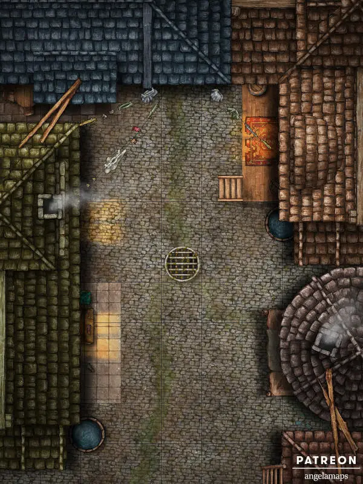
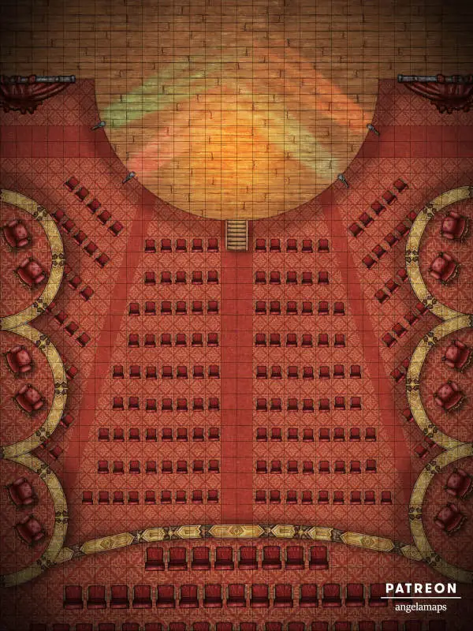
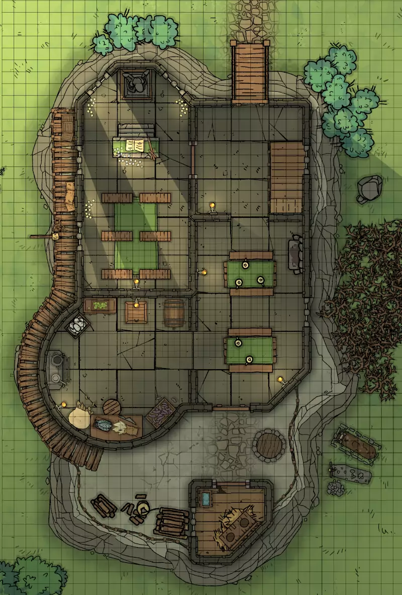
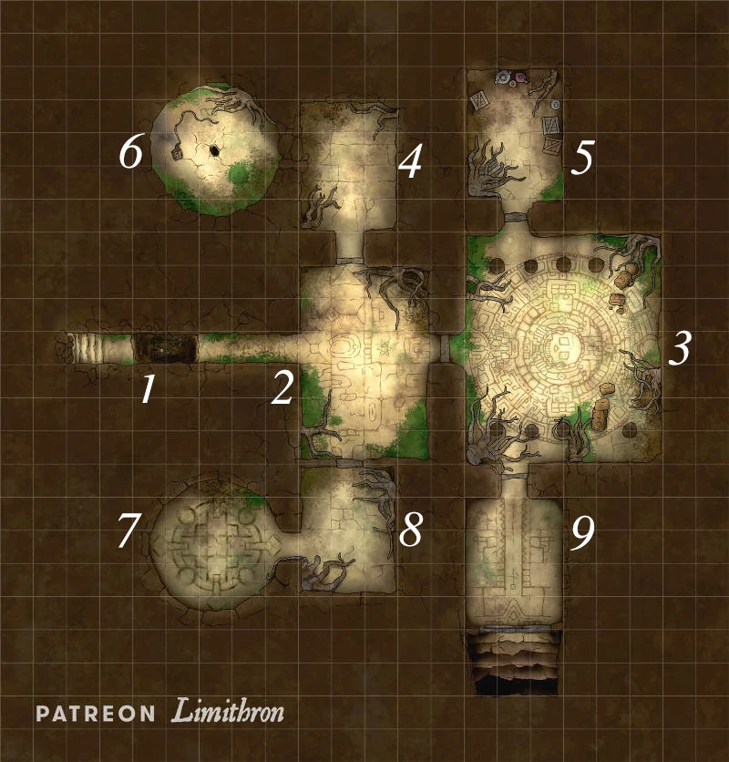

# Historias salvajes

\sinc

## El tesoro hundido

\conc

El tesoro hundido es una campaña en la que tu mesa deberá evitar la ascensión de R’lyeh de los oscuros fondos oceánicos del mar Caribe, enfrentándose a un poderoso culto de adoradores de Cthulhu.

El tesoro hundido es cómo llama Hernando de Villalba, dueño de la RCPC, a la ciudad sumergida de R’lyeh, donde duerme Cthulhu desde hace eones. Villalba, líder de la Orden del Gran Cthulhu quiere sacar a la ciudad de las aguas y despertar al gran Cthulhu. Este en agradecimiento le colmará de poder y riquezas dignas de un rey y lo que más ansia, la inmortalidad.

Para llevar a cabo su plan necesita primero encontrar la ciudad, que sospecha que se encuentra en algún lugar del Caribe. Lleva años estudiando viejos tomos malditos, apócrifas cartas náuticas y mandando a sus espías a tabernas portuarias a escuchar los locos relatos de los marineros. Está muy cerca de encontrarla, pero hay algo que todavía se le escapa para encontrar su «tesoro hundido».

Y si eso no fuera poco, debe encontrar la manera de sacar a la ciudad de las profundidades marinas para poder despertar al gran Cthulhu.

Gracias a su descendencia profunda ha obtenido el Tridente de Dagón que le permite tener bajo su mando cualquier profundo del Caribe. El tridente le ha convertido en la persona más poderosa del Caribe. Con su ejército de profundos puede destruir flotas enteras o hacer desaparecer ciudades portuarias solo con desearlo.

Lo que tampoco sabe Villalba es que hay un grupo de descastados y parias que van a tratar de estropear sus planes. Puede que ahora sean solo una molestia menor, pero si no los vigila y los controla, se convertirán en la gran piedra en el zapato de sus planes.

«En el Carcosa» y «Devil came to me» puedes usarlas como una aventura introductoria y después puedes dejarles libres en el Caribe para explorarlo o para que sigan la trama de «El tesoro hundido».

\sp

\sinc

### En el «Carcosa»

\conc

**Comienzo:** En el Paso de los Vientos

Como todas las grandes aventuras de piratas, esta tiene un simple inicio. Con un barco mercante en ruta por el mar y un grupo de desconocidos que no saben que sus vidas van a cambiar para siempre.

El «Carcosa» es un buque mercante de la RCPC en ruta entre La Habana (Cuba) y Santo Domingo (La Española). El «Carcosa» transporta principalmente pasajeros y un cargamento de tela, ron y melaza de caña. Su ruta de navegación les está llevando por el Paso de los Vientos (el estrecho entre Cuba y La Española). Es una zona infestada de piratas, ya que van a pasar cerca de Tortuga y Port Royal en Jamaica. Las islas Caimán tampoco quedan lejos.

Los marineros están nerviosos, porque no hay ni escolta y los guardacostas no parecen estar cerca. En cualquier momento podría aparecer una bandera negra en el horizonte y eso significaría serios problemas.

Tu mesa está embarcada como tripulantes o pasajeros. Quizás algunos se conozcan porque son familia, socios comerciales o compañeros de aventuras. Lo importante es que están bajo cubierta en la misma mesa de bancos corridos cenando su ración de alubias con tocino y tostones fritos, mientras fuera la oscuridad lo cubre todo.

\sp

#### Una bandera que significa muerte

De repente, algo impacta en el lado de estribor del casco y una lluvia de astillas cubre su mesa. Reciben 2d6 heridas y mientras se sacuden el aturdimiento, oyen campanas de alarma y gritos de — ¡Piratas! ¡Piratas!

Dales a entender que en unos 3 turnos vendrá otra andanada de cañones. Pueden buscar protección detrás de una mesa o un tonel. Pueden subir a cubierta, pero si los cañonazos van a barrer la cubierta puede ser muy peligroso. Por último, pueden ayudar a otros heridos y buscar armas y munición para defenderse.

Habrá dos rondas más de cañonazos, la primera al casco y la segunda para barrer la cubierta antes del abordaje. Si están en la cubierta durante el barrido podrán buscar cobertura con una tirada de Atletismo. Si fallan, se llevarán 4d6 de daño de astillas y fuego, si pasan la tirada 2d6 y por cada avance quitan un dado de daño. Bajo cubierta es parecido, 2d6 si fallan y nada si pasan la tirada de Atletismo.

Cada ronda de cañonazos se oirán gritos de dolor y cuerpos inertes caerán al suelo entre charcos de sangre. Puede que incluso alguien de tu mesa caiga. No pasa nada, el objetivo es que todos caigan incapacitados.

Los que estén arriba verán como un barco con bandera pirata lleno de humeantes cañones se ha puesto en paralelo con vuestro barco. En la cubierta se van agrupando fieros piratas con pistolas cargadas en sus cinturones, sables y machetes sujetos entre sus dientes. Están preparando ganchos de abordaje o están sujetos a maromas dispuestos a saltar a vuestro barco.

Cada uno se tendrá que enfrentar a dos piratas. Primero lleva el combate de los de sobrecubierta y luego por las cubiertas inferiores. Si alguno no cae incapacitado, le lanzarán una granada cerca para dejarle incapacitado. También pueden rendirse, en ese caso, alguien les dejará KO golpeándoles en la nuca con una cabilla.

#### Brusco despertar

Un cubo de fría agua de mar despierta a tu mesa. Ya es de día y el sol les ciega. Están atados a la borda del barco pirata y rodeados de piratas con caras de pocos amigos. Una mujer está de cuclillas muy cerca de sus caras apoyándose sobre su sable. 

\sp

Con sarcasmo dice — Vaya, vaya. ¿Qué tenemos aquí? — Acto seguido se ríe y de repente sus ojos se quedan en blanco, balbucea algo y se levanta y grita — ¡¡¡Soltadlos!!!

Irá mirando a cada uno y les irá preguntando quiénes son y a qué se dedican. Aprovecha para que se describan y así se conoce tu mesa. Les pondrá apodos divertidos y les dirá que vuelvan a su barco y que si no obedecen a su capitán serán pasto de tiburones. Prepárate los motes de antes, basándote en su ficha. Con lo cabronas que suelen ser las mesas seguro que se quedan con el mote el resto de la campaña.

Al cruzar al «Carcosa» verán el nombre del barco pirata, «El golpe de suerte» así que la capitán será la temida Mary Read. Haz que tiren un dado y al que menos saque le golpearán la plancha y deberá tirar Atletismo para no caer al mar.

Déjales tirar Conocimientos generales y cuéntales que el índice de su supervivencia es muy variado o se carga a toda la tripulación o los deja a todos vivos.

Los piratas y unos pocos supervivientes están limpiando la cubierta del «Carcosa» de sangre y tirando un par de cadáveres al mar. Los supervivientes están desarmados y son menos, así que no hay oportunidad de rebelarse.

Un pirata sale gritando de los camarotes de los oficiales gritando y enseñando una caja de madera — ¡Mi señora! ¡Mi señora! Lo he encontrado.

Si se paran a mirar un pirata les pinchará con el sable para que sigan limpiando. El marinero lanza la caja desde el «Carcosa» a Mary que la recoge con elegancia. Abre la caja y sonríe con satisfacción — ¡Tenemos lo que queríamos! Esta misión ha sido un éxito. Habrá doble ración de ron cuando lleguemos a casa.

#### El interrogatorio

Tras limpiar la cubierta, hacer unas reparaciones básicas y cargar el ron de la bodega en el Golpe de Suerte, son encerrados en la bodega del «Carcosa». El «Carcosa» y el Golpe de suerte empiezan a navegar en rumbo Suroeste. Una tirada de Navegar o Supervivencia les dirá que se dirigen seguramente a Jamaica.

Al anochecer les abren para darles agua y comida. Un par de guardias van haciendo salir y entrar uno a uno los prisioneros. Un par de veces oirán un grito de dolor, un golpe seco contra el suelo, gente arrastrando algo por la cubierta y algo que cae el mar. Curiosamente, cuando eso pasa no vuelve a entrar el último prisionero que salió.

\sp

Arriba Mary Read y sus suboficiales están entrevistando a cada prisionero. Buscan a cultistas de la Orden a los que interrogar. En las escaleras, mientras les apuntan con varias pistolas de chispa, les hacen ponerse en paños menores para ver que no tienen marcas de la Orden o extrañas malformaciones fruto del contacto con los Mitos, por ejemplos agallas como los híbridos de profundo. Si están limpios les devuelven la ropa y les dejan subir a cubierta.

Mary, desde de un estrado improvisado con unas tablas y unos toneles, empezará a interrogar a cada personaje. Pregunta cosas como lugar de nacimiento, profesión o edad. Es un buen momento para rellenar estas partes de la ficha que nunca nadie completa. Después pasará a preguntas como:

* ¿Qué hacías en el «Carcosa»? ¿A dónde ibas?
* ¿A qué te dedicas?
* ¿De dónde es tu familia?
* ¿Has trabajado para la Real Compañía Privilegiada del Caribe? ¿Qué hacías?
* Más preguntas de este tipo que se te ocurran.

No les dejes mucho tiempo para contestar, es preferible que sean espontáneos. Cuando acabe con cada personaje, no lo devuelve a la bodega, sino que los aparta a un lado suyo. Cuando haya interrogado a toda la mesa, se acercará a ellos dispuesta a dar un discurso, carraspeará, resoplará y cuando vaya a empezar se oirá un grito.

#### ¡¡¡Profundos!!!

Saca la baraja y reparte cartas de iniciativa, un grupo de profundos salta a cubierta con sus tridentes y entre gorgojeos ininteligibles atacan a la gente que hay en la cubierta. Antes de poder actuar deberán tirar la TPC de una manada de 15 profundos.

A cada personaje se le acercará un profundo con intenciones funestas y el resto se repartirá entre el resto de tripulantes del «Carcosa». Recuerda que están desarmados y son novatos. Tras 5 turnos o antes de caer incapacitados, algún tripulante pirata o la propia Mary Read decapitará al profundo mientras un chorro de sangre verde salpica al personaje.

Tras deshacerse de los cadáveres de los profundos, Mary ordenará largar trapo y salir de allí pitando. Desde el castillo de popa del «Carcosa» les soltará el discurso que tenía preparado.

\sp

> Sabed que si he llegado viva hasta hoy es porque siempre me he fiado de mi intuición. Y esta vez mis entrañas me dicen que en vez de pasaros por la quilla os ofrezca la oportunidad de vuestra vida. Ya habéis visto a que nos enfrentamos, horrores del infierno invocados por la más oscura brujería. Detrás de esos monstruos está la corrupta Real Compañía Privilegiada del Caribe que trata de apoderarse de todo el Caribe para poder traer el Apocalipsis a nuestro mundo.

Hace una pequeña pausa dramática y mira sus reacciones

> Necesitamos un barco legal y leal que pueda entrar y salir de los puertos, ser nuestros ojos y nuestras manos donde nuestra bandera no nos deja acercarnos. Os entregaremos el «Carcosa» y podréis moveros libremente por estos mares haciendo de vez en cuando misiones para nosotros. A cambio podréis evitar el fin del mundo y quizás, solo quizás, haceros ricos. La hermandad del sargazo paga a sus fieles ayudantes y paga bien.

Se gira dando la espalda y pone un tono de voz más grave.

> Si rechazáis mi oferta podréis regresar con este barco, pero la próxima vez nos crucemos, no seremos tan magnánimos y no os volveré a hacer esta oferta. Y tened en cuenta que no seréis ni los primeros ni los últimos a los que la Real Compañía hace desaparecer. Cuando lleguéis a puerto, no creo que les convenza de que la capitán Mary Read os dejo libres con su barco para volver a puerto. Seguramente os torturarán, os sacarán la verdad y, si tenéis suerte, acabarán con vuestras vidas. Si no, puede que acabéis como comida para esos monstruos o todavía peor, convertidos en esos monstruos.

Mira a unos de sus tripulantes y este se levanta una de las mangas de su camisa y muestra un monstruoso brazo cubierto de escamas de reptil que acaban en unas terribles garras también reptilianas.

> ¿Qué contestáis?

En caso de que diga que aceptan, Mary Read elegirá al jugador con más experiencia como capitán y le pondrá al mando del «Carcosa». El resto de su mesa será sus ayudantes y dejará algunos de sus tripulantes para ayudar en el barco.

\sp

El título de capitán es algo burocrático, deberán votar entre todos los asuntos que afecten al barco, su tripulación y su carga.

En caso de que se nieguen, les dirá que cuando lleguen a tierra firme segura les dejará irse con el «Carcosa». Pueden pensárselo hasta ese momento.

#### ¿Qué ha estado pasando?

Cuando se vieron por primera vez, Mary tuvo una visión de que tu mesa sería muy importante en la futura gran batalla con la Orden del Gran Cthulhu. No sabe ni cómo, ni cuándo, ni por qué, pero su don de Casandra nunca le ha fallado.

El objeto que encontraron en el «Carcosa» es un descifrador de códigos. Es un disco con letras grabadas sobre el que se pone otro disco con perforaciones, según se mueven los discos las perforaciones permiten ver unos caracteres u otros. El artilugio está lleno de grabados de seres horribles y es de algún tipo de piedra verde. Mary recibió un chivatazo de que en el «Carcosa» iba un decodificador nuevo para los cultistas de la Orden del Gran Cthulhu de Santo Domingo y asaltó el navío para conseguir uno.

#### Islas piratas

Tras un par de días de viaje, los barcos llegarán a las Islas Caimán. Fondean en una paradisíaca y secreta cala de la isla Caimán Brac (la más oriental de las islas Caimán). Hay agua potable, fruta y tortugas con las que alimentarse. Podrán sanar sus heridas y disfrutar de lo que los taínos llaman barbacoa, una comida hecha a la brasa en la playa, acompañada de algo del ron que llevaba el «Carcosa».

### Devil came to me

**Comienzo:** En Caimán Brac (Islas Caimán)

Tras los sucesos del «Carcosa» tu mesa empieza a ver que hay fuerzas actuando en el Caribe que escapan a su cordura. La RCPC parece ser algo más una gran empresa comercial. Es el momento tener una conversación con Mary Read.

Durante una semana estarán haciendo modificaciones al «Carcosa», entre ellas cambiarle el nombre para evitar la mala suerte del nombre anterior si van a seguir a Mary. También hay que modificarlo de forma que no se pueda detectar que es un barco capturado.

\sp

Si no han aceptado el trato, el equipo de Mary hará reparaciones básicas, pero las alargarán todo lo que se pueda. Mary quiere tenerlos unos días bajo su influencia para hacerles cambiar de opinión.

* El marino del brazo de reptil les contará que era un agricultor al que la RCPC secuestro y lo tuvo encerrado durante semanas probando ungüentos y pócimas en su cuerpo. Fue el único que sobrevivió de su poblado. Mary y su gente lo liberaron y desde entonces le es fiel.
* Unas de las noches, un vecino de hamaca empezará a hablar en sueños en un extraño y gutural idioma. Vendrán a sus cabezas imágenes de una ciudad submarina donde yace ni vivo ni muerto un gigantesco ser del que solo se dibuja su descomunal silueta y se ven sus brillantes ojos verdes. Si pregunta a la mañana siguiente, les dirán que ese es el dios al que adora los que dirigen la RCPC.
* Dos tripulantes cogen instrumentos y empiezan a contar las aventuras de la capitán Read y los golpes más duros que ha asestado a la RCPC y la Orden.
* Mary Read coqueteará e intentará seducir a alguien de tu mesa.

Al final de la semana les volverá reunir y les volverá a preguntar. Si después de todo esto no aceptan déjales irse con el «Carcosa», pero la predicción de Mary se cumplirá a la perfección.

De hecho les seguirá de cerca y cuando sean detenidos, encerrados y torturados por la RCPC, ella les liberará y les ofrecerá por última vez su propuesta. Esta vez solo les podrá darles el Buenaventura, una pequeña goleta. Negarle a Read tiene sus desventajas.

Cuando tengan el barco arreglado y terminado, podrán partir al puerto que deseen que casualmente es el mismo al que Read quiere llevar el descifrador de códigos. Les dirá que lo dejen en una plaza del pueblo en una esquina apartada, alguien lo cogerá.

### La enseña pirata del perro

**Comienzo:** En alta mar

De todas las banderas que podrían encontrarse debían avistar una enseña negra y eso todos saben que significa una sola cosa: ¡¡¡Piratas!!!

En mitad de su viaje al puerto del Caribe que deseen, el vigía ve un barco de velas negras con una enseña negra y grita: ¡¡¡Piratas!!!

El resto de la tripulación corre a la borda a ver el barco. Con una tirada de Notar, con positivos si tienen catalejos, podrán ver qué el barco es más grande y mejor armado que el suyo. Con avances puedes darles más detalles como tripulación estimada o cañones. Una tirada de Navegar les dirá que la única solución es huir.

Empezará una persecución con dos cartas de ventaja para el barco de tu mesa. Durante esta fase no podrán atacarse con la artillería porque están fuera de rango. Si les alcanzan, antes de hacer zoom y hacer la persecución con combate naval, podrán ver que el barco es El Sabueso, un barco menor de la flotilla de Barbanegra. Su bandera es una cabeza de perro mordiendo un gran fémur.

El Sabueso atacará al barco con los cañones solo si le atacan. No quiere destruir su carga o hundirlo, no es rentable.

Si no consiguen huir y están a punto de ser abordados y seguramente derrotados, puedes hacer aparecer un extraño banco de niebla dónde refugiarse o unos arrecifes donde encalle El Sabueso.

Si tu mesa está muy gallita con que pueden con El Sabueso, en mitad del abordaje, tras unos turnos de combate, haz aparecer el Golpe de Suerte que hará huir a los piratas. Read los debería humillar un poco, rollo «tenía más esperanzas en ellos» o «en menos de un día he tenido que salvaros el culo».

El Sabueso y su tripulación son una buena némesis pirata de tu mesa. Puedes hacerlo aparecer disparando salvas de cañones cuando quieras, complicándoles más las cosas en sus fugas, haciendo que compitan por quién tiene la nave más rápida o peleándose las dos tripulaciones en una taberna de Nasáu o en un charco de barro.

Él, la o elle capitán de El Sabueso debería ser un PNJ creado por ti. Debería ser un pirata que tú como jugador te harías y debes subirlo según avance de nivel tu mesa. También su barco y su tripulación.

Si alguien te dice que has metido tu propio personaje en la historia, léele esto: Los PJ de DJ están permitidos en esta ambientación.

### Haciéndose un nombre

**Comienzo:** El puerto del Caribe que quieran

Mary Read les dejará unas semanas libres para que se hagan con su barco, empiecen a establecer relaciones con las peculiares gentes del Caribe y, quizás, enfrentarse de nuevo con los Mitos.

Tras llegar al puerto y dejar el paquete en la plaza del pueblo son libres para hacer lo que quieran. Lo primero sería buscar una tripulación, ya que la tripulación que Mary Read les presto les han dejado según han llegado a puerto. Pueden poner algún anuncio, recorrer las tabernas del puerto, pagarle al maestre del puerto o vaciar las celdas de la cárcel de marinos borrachos.

Tras haber terminado con sus obligaciones es el momento perfecto para que empiecen hacer cosas de marinos y piratas. Déjales unas semanas para conocer el Caribe, comprar y vender su carga, pillarse una borrachera de ron, participar en una pelea de taberna, leer su primera VLH, etc. Puedes incluso meterles algún relato salvaje.

### Trabajando para la hermandad

Mary Read tiene confianza en el grupo de parias que saco del «Carcosa», pero necesita saber que si son lo suficientemente hábiles y valientes para luchar contra la Orden del Gran Cthulhu, así que los pondrá a hacer misiones para probar su valía.

Mary Read tiene que probar la valía de tu mesa y par eso les va a pasar ciertos trabajos que tenía que hacer ella y su tripulación. Si los hacen sin problemas, podrá aceptarlos en la Hermandad. Si prefieres, puedes meter otros relatos salvajes como parte de estos trabajos y dejar estas aventuras para otro momento.

#### El primer trabajo: Suministros de oficina

**Comienzo:** Una ciudad con puerto

Read les hace llegar un encargo, necesita suministros de papel y tinta para la VLH. Andan escaso y la RCPC les ha bloqueado y no les vende nadie.

Al llegar a su barco, uno de los marineros les pasará un sobre lacrado. Es de Mary Read. Les da un nombre de barco, una fecha estimada de llegada a su puerto y una ruta. El barco lleva los suministros que necesitan para la VLH. Puede intentar interceptarlo o robar la carga mientras los suministros están en el puerto de San Juan. Luego deberán entregarlo en una cala cercana a La Habana.

##### Asalto en alta mar

Pueden intentar perseguir el barco en alta mar y cuando estén cerca, abordarlo y robarles su carga de 10 toneles de tinta y 10 de papel. Su objetivo es una goleta (nave rápida con 2+2 cañones y 24 toneles de capacidad de carga) llamada Bastión del Rey que hace la ruta de San Juan de Puerto Rico a Matanzas en Cuba.

Pueden seguirlo desde el puerto y atacarlo en alta mar o interceptarlo en mitad de su ruta. Cuando saquen la bandera pirata, habrá una persecución en la que su barco y el Bastión estarán a dos cartas de distancia. Si se trabajan la trampa o buscan un sitio mejor para su ataque (como el archipiélago de los Jardines del Rey) podrían estar a una sola carta.

Durante esta parte de la persecución no podrán atacarse, los cañones no tienen tanto alcance. Siguiendo las reglas de persecuciones navales, cuando tu mesa alcance al Bastión, se hará zoom y empezará una nueva persecución a dos cartas de distancia, pero ahora podrán atacarse y abordarse. Recuerda las opciones de combate naval que te da la hechicería y las posibles modificaciones de tu barco.

Una vez abordado podrán enfrentarse a unos 15 marinos y 1 capitán (menos un marino por cada herida que tenga el barco). Si los derroten a todos, podrán hacerse con el barco y robar la carga (20 barriles de tinta y papel, -1 por cada herida del barco).

Contando con que no sean ya piratas, si dejan supervivientes, serán declarados oficialmente piratas y no solo serán cazados por la RCPC sino también por los guardacostas españoles. Si no dejan supervivientes, seguirán siendo «legales». Ahora solo tienen que dejar la carga en una cala cercana a La Habana, donde les espera Antoine Delapore con un par de carros.

##### Asalto en tierra

Si tu mesa elige esta opción, vamos a tener una misión de infiltración. Tendrán que conseguir un carro, meterse en un almacén del puerto de San Juan y llevarse un mínimo de 10 barriles (en el almacén hay 10 barriles de papel y 10 tinta), lo que no será fácil.

El almacén es un edificio de madera de unos 6 metros de alto y de unos 60x60 metros. Tiene una entrada pequeña que da a la calle y otra mucho más grande (3 m de alto y 2 de ancho) para mercancías que da al agua. El interior está lleno de carga apilada una encima de otra, formando pasillos estrechos y rincones donde esconderse. Al lado de la entrada grande hay un despacho donde se registra la entrada y salida de carga.

Tiene unos 12 estibadores/guardas (usar ficha Mercader) que trabajan en turnos de 8 horas, 4 guardas por turno. Por el día hay burócratas (usar fichas Burócrata) gestionando la entrada y salida de carga.

Pueden intentar engañar a la gente del almacén y llevarse los barriles a plena luz del día. Tendrán que hacerse pasar por personal de la RCPC, falsificar papeleo y buscar una excusa para llevarse el papel y la tinta.

La otra opción es infiltrarse de noche, deshacerse de los guardas y robar las cajas de papel y tinta. El problema no son los guardias, aunque tienen una campana para llamar a la guardia de la ciudad, sino sacar la carga rápidamente sin que les vean. Piensa que cada persona tarda 4 minutos en sacar un barril y ponerlo en un carro. 4 personas necesitarían unos 10 minutos en sacar el mínimo material posible, tiempo más que suficiente para que pase la guardia de la ciudad.

En ambas situaciones, si algo falla, puede ser divertido una carrera por las calles del puerto entre el carro de tu mesa lleno de tinta y papel que se cae con cada bote y la guardia a caballo de la ciudad. En el manual básico tienes las características de los caballos y el carro para hacer la persecución.

#### El segundo trabajo: Rescatadores

**Comienzo:** Las Bahamas

Read tiene otro trabajo, un grupo de piratas tiene un campamento de rehenes en una isla deshabitada de Las Bahamas. Deberán acabar con los piratas y liberar a los rehenes. Read sabe que todos esos rehenes tienen dinero y contactos y que te deban favores es muy útil.

Como la anterior vez, Read les hará llevar un nuevo trabajo cuando lleguen a algún puerto. En un islote mediano en el extremo sur de las Bahamas, unos piratas han montado un campamento de rehenes. Son personas de cierta alcurnia que iban en barcos abordados por estos piratas y que dejan en campamentos en islas aisladas y fuera de las rutas de navegación mientras piden un rescate a su familia.

No es la primera vez que la Hermandad rescata a rehenes, ya que la gente de cierto poder que les debe favores les es bastante útil a veces.

La isla medirá 1 km de largo por 1 de ancho, está cubierta de jungla y no tiene agua potable. La única fuente de agua es la lluvia y los barriles que traen los piratas cada cierto tiempo. Así se aseguran de que no podrán ir muy lejos. Aunque construyeran una barca, no tendrían agua para llegar a ningún sitio habitado. Además, los arrecifes que rodean la isla son muy peligrosos y las aguas están infestadas de tiburones.

Adentrarse mucho en la jungla también es un problema, ya que nadie ha vuelto de su interior. Por las noches se oyen ruidos extraños y gritos de animales salvajes.

En una playa del extremo sur se encuentra el asentamiento pirata que consiste en varias chozas donde rehenes (8 personas) y captores (6 piratas) viven. Allí recogen frutas, pescan y trenzan bolsas, sombreros y sandalias con hojas de palmera.

##### Al rescate

Acabar con 6 piratas aun sin la ventaja de la sorpresa debería ser fácil. Si buscan hacerlo con sigilo, deberán fondear al otro lado de la isla y atravesar la jungla para pillarlos desprevenidos.

Cuando acaben con los enemigos piratas, los rehenes saldrán de sus chozas a agradecérselo. El problema es que dos cautivos se han adentrado en la jungla.

Deberán adentrarse en la jungla y tratar de seguir su rastro que es bastante fácil de seguir (tirada de Supervivencia). Sus huellas apresuradas llevan al centro de la isla, a unos 200 metros encontrarán a un rehén que se ha torcido un tobillo y que no puede moverse. Pueden socorrerle ahora o dejar a alguien que lo cuide.

##### Lo que habita en la cueva

Si siguen adelante, llegarán a una cueva en una curiosa formación rocosa de basalto. Al adentrarse notarán un viento que sale de la cueva y que lleva los gritos de terror de un ser humano.

La cueva no tiene casi luz y baja rápidamente por un pasillo escalonado que no parece natural hasta una gran estancia rectangular. Ahora si ya necesitarán luz para entrar, ya que no se ve nada.

En la esquina contraría de la entrada está gritando el rehén que faltaba. Está atrapado en una maraña de tentáculos que pertenece a un pólipo volante. El pólipo lleva eones en esa cueva de basalto y se le ha fosilizado la piel exterior. Debido a eso no se puede hacer invisible, pero tiene un punto extra de armadura. Tampoco puede volar, pero sí controlar los vientos.

Es muy difícil intentar liberar al rehén, ya que cuando cortan un tentáculo otro ocupa su sitio. Pero si le hacen dos heridas, soltará a su víctima y dejará de atacar esperando que sus enemigos recojan a su compañero y se vayan. Si le siguen atacando combatirá hasta el final, sabiendo que caerá, pero que se llevará a alguien con él. Por eso, se centrará en un atacante al azar y le golpeará con todo.

Si acaban con el pólipo podrán registrar su cubil y hacer la tirada de botín. Si lo dejan vivo claramente no podrán obtener botín.

En principio en la isla no hace daño a nadie, así que puede ser interesante dejarlo vivo para poder buscarlo en el futuro, si fuera necesario.

##### Volver a casa

El rehén está medio ido tras el encuentro con el pólipo, pero cuando vuelvan a la playa y se sienta seguro volverá poco a poco a la normalidad.

Una vez hayan sacado a todos los rehenes de la isla y los hayan subido al barco, podrán volver empezar a repartirlos por todo el Caribe. Aprovecha a llevarlos para dejar al rehén a sitios donde no hayan estado antes y puedes meterles entre medio algún relato o encuentro. Seguramente en algún sitio les harán una fiesta con comida y bebida a mansalva para festejar el regreso del ser querido.

#### El último trabajo: En los Jardines de la Reina

**Comienzo:** Costa sur de Cuba

Mary Read tiene un último trabajo. Deben patrullar El Jardín de la Reina, un archipiélago de 600 islas e islotes en la costa meridional de Cuba. Deberán vigilar los barcos de la RCPC que se meten entren las islas y que es lo que buscan.

Cómo siempre alguien les entregará un sobre con un mensaje de Read. Necesita que alguien vigile las actividades de la RCPC en los Jardines de la Reina, un archipiélago de islotes en la costa sur de Cuba.

Han detectado que cada cierto tiempo, pero sin ser algo fijo, una goleta de la RCPC se mete en los jardines, se pierde entre sus islas y vuelve a salir, por otro lado, con menos carga por lo que indica su línea de flotación. Lo que lleva y lo que hace con la carga es todo un misterio.

La goleta nunca hace la misma ruta, ya que cada vez cada vez viene desde un destino diferente. Eso hace que Read no haya podido tenderle una emboscada. Seguirla dentro de los jardines es casi imposible por los frecuentes bancos de arenas de la zona. Por donde ella pasa sin problemas, una nave más grande se encalla.

En este caso, Read les propone que creen 3 o 4 atalayas de vigilancia en diferentes islotes para saber qué hace la goleta y dónde deja su carga. Cuando alguno averigüe algo que haga señales de humo para llamar el resto e investigar qué pasa.

##### Qué hace la goleta

La goleta de la RCPC se dedica simple y llanamente a la recogida y depósito de «basura biológica». Está especializada en transportar todo tipo de seres usados en experimentos que ya no valen y abandonarlos en los islotes de los Jardines de la Reina. Los recoge de todas partes del Caribe y los lleva allí lo más disimuladamente posible.

Lo normal sería matar a los monstruos y destruir sus restos, pero son sujetos de experimentación difíciles de conseguir y prefieren abandonarlos en unas islas desiertas a quedarse sin ellos. Si los necesitan, siempre pueden volver a cazarlos.

Hay de todo, desde noctivagos sin membranas aladas, gugos a los que han cortado los brazos extras, gules sin dientes y sin garras, etc. Por no hablar de monstruos hechos de partes de otros.

Hazte tus propias combinaciones. El TPC de estos seres de los Mitos será el TPC del monstruo principal con un nivel más por cada trozo de otro ente. Un gul con agallas de profundo y tentáculos de yithianos tendría un TPC de d8 en vez del d4 normal.

Tendrán que bajar a la isla en barca porque la playa no tiene calado para su barco. Si luego tienen que huir, puede ser divertido verles empujar la barca mientras esquivan zarpazos de monstruos.

Al bajar a la playa podrán ver enseguida las huellas de los bichos que la habitan y si se internan en la jungla pronto tendrán un encuentro con algún monstruo. Cómo hemos dicho antes, sé creativo y saca lo que quieras. Lo importante es que vean (con unas tiradas de Ciencias o Medicina) que los bichos tienen extremidades amputadas o injertadas, puntos de sutura mugrientos y malolientes, grapas quirúrgicas infectadas y cicatrices de extirpaciones de órganos y trepanaciones.

Con todo esto ya podrían hacer un informe para Read, así que pueden volver a su barco. También pueden intentar comunicarse con alguna raza inteligente y sacar más información, como qué buscaba la RCPC con sus experimentos. Puede ser de todo, desde crear supersoldados a venenos o tónicos curalotodo.

La opción de eliminarlos a todos es inviable. Hay muchos monstruos en esta isla y las de alrededor y la goleta no deja de traer más. Además, pondría en aviso a la RCPC.

Quizás más delante puedan «cazar» a todos estos seres y lanzarlos en tromba contra la fortaleza de sus enemigos. Muchas de estas entidades son inteligentes y se pueden llegar a pactos con ellos y teniendo en cuenta lo que odian a la RCPC, no habría que esforzarse mucho en convencerlos de ayudar.

### Entrando en la hermandad

**Comienzo:** Isla de la Tortuga

Mary sabe que sus visiones nunca le defraudan y aquellos patéticos seres que se encontró en el «Carcosa» han demostrado ser eficaces y dignos de confianza, pero sobre todo buenos y nobles. Es el momento de que ingresen en la Hermandad.

A diferencia de otras veces, en esta ocasión la propia Read se presentará ante ellos disfrazada de lo que quieras, dama rica, mendiga, estibadora, vendedora de aperitivos como morros de nutria rellenos, etc. y les felicitará por su última misión.

Acto seguido les dará una localización cercana, una cala desierta lejos de ojos indiscretos.

En la cala Read les esperará sola junto a una gran fogata. Lleva una botella de ron polvorienta al que ya ha dado un par de sorbos. Tu mesa ya sabe que ella lucha contra la RCPC y que pertenece a una sociedad pirata que la combate. Esta vez les explicará más cosas de la Hermandad y les preguntará si quieren unirse. Los que acepten deberán hacer el siguiente juramento:

> _Juro por el viento que hincha mis velas y la libertad que guía mi timón que serviré a la hermandad del sargazo en su lucha contra el gran mal que se esconde en los más oscuros rincones del Caribe. ¡Y si no lo cumplo que el ron me sepa agrio, que los moluscos se coman el casco de mi barco y que mi pólvora siempre esté mojada!_

Acto seguido, tomará un trago de ron y pasará la botella. Es un ron añejo más rico y delicioso de lo que nunca hayan probado.

Ya son hermanos, hermanas y hermanes y deberán cumplir con ese juramento sagrado que acaban de hacer. Pueden apuntarse la ventaja de «Integrante de la Hermandad del sargazo».

Después de estas formalidades, tocará una noche de bebida y anécdotas junto al fuego donde Read contará sus mejores historias y sus peores chistes. Este simple acto de camaradería y compañerismo pirata permitirá a tu mesa recuperar un punto de cordura por persona.

### Misión submarina

**Comienzo:** Costa oeste de Cuba

Read les va a mandar a la Costa oeste de Cuba. Sabe que Villalba hace unos años estuvo por esa costa buscando algo antes de retirarse de la vida pública y encerrarse en su mansión. Necesita saber qué encontró y qué piensa hacer con ello.

Hernando Villalba nunca sale de su mansión y si sale es por algo grande. Los espías le dicen que estuvo una semana fuera en la costa oeste de Cuba, en la península de Guanahacabibes. Saco algo del fondo del mar y volvió a La Habana. Ya estuvo hace tiempo en esta zona, pero hacía años que no volvía.

Villalba tiene sangre profunda y puede moverse sin problema por el fondo marino, pero tu mesa tendrá que localizar el lugar donde se sumergió Villalba y averiguar que se llevó.

Encontrar el punto donde bajo Villalba puede ser complicado. Tendrán que comprar una campana de inversión y arrastrarla por el fondo marino o buscar algún hechizo para poder sumergirse.

Esto puede llevarles unos cuantos días y puedes meterles algún encuentro con tiburones toro. Cuando lo creas oportuno encontrarán un grupo de estructuras de piedra negra con formas perfectamente regulares, son cubos, pirámides y conos conectados entre sí con pasarelas y pasillos cubiertos.

##### Explorando las estructuras

Las estructuras están perfectas, no hay daños ni derrumbamientos, ni algas o corales pegados, ni peces nadando, etc. parece que no hubiera pasado el tiempo por sus paredes. Los edificios están completamente vacíos, pulcramente vacíos.

Las interiores de los edificios están lisas como el cristal, pero las paredes externas están llenas de bajorrelieves. En ellos se cuenta una gran saga de una extraña raza de seres en forma de tonel de 5 lados, con alas y tentáculos en la parte superior y patas de cangrejo articuladas en la inferior. Una buena tirada de Mitos les dirá que son Antiguos, una de las primeras razas que habito la tierra.

Seguir la historia les llevaría más tiempo del que tienen (2 semanas de inmersiones diarias) pero sería como leerse un libro de los Mitos con un TPC d10 con la capacidad de aprender 4 hechizos.

##### El grabado robado

Unas tiradas de Notar les llevarán a encontrar el único daño que hay en las estructuras. Alguien, claramente Villalba, ha cortado una pared y se ha llevado una sección entera. Si estudian los grabados de antes y después (tirada de Mitos) verán que los Antiguos estuvieron en guerra con una especie de humanoides alados con cabeza de pulpo, semillas estelares de Cthulhu.

Por el grabado parece que los Antiguos trataron de destruir algo que guardaban las semillas estelares. Es imposible saber qué era o dónde estaba porque falta todo el bajorrelieve donde debía ponerlo. No hace falta ser muy listo para deducir qué esa parte de la pared se contaba seguramente dónde estaba R’lyeh.

Con esta información pueden volver a la superficie y entrar en contacto con Read para planificar el siguiente paso. Las noticias desde luego no son buenas; que Villalba avance en su plan nunca es bueno.

### Droga plutónica

**Comienzo:** La Habana

Villalba se llevó una sección de bajorrelieves del interior de las pirámides. Intentar entrar en la mansión Villalba a este nivel puede ser un suicidio. Pero Mary Read cree que la librera Isadora puede ayudarles a encontrar una solución.

El principal problema que tiene tu mesa ahora mismo es que no saben qué había en los grabados que se llevó Villalba. Los hechizos normales de lectura de objetos no funcionan porque no pueden tocar la sección que ha sido quitada. A priori, la única solución es infiltrarse en la casa de Villalba y hacer una copia de los grabados. Déjales que empiecen a planificarlo todo, compren equipo, busquen fallos en la seguridad.

Pasadas unos días en La Habana, Read les hará llegar una nota. Puede que Isadora, la propietaria de la Librería Guía, tenga una solución a su problema. Si la conocen podrán hablar con ella directamente y si no la conocen deberán presentarse como enviados de Read, mostrando su misiva.

Isadora les contará que la solución a su problema es la droga plutónica, una sustancia que envía tu mente al pasado donde podrán ver el grabado completo y mientras duren sus efectos deberán cazar todos sus detalles para después dibujarlo en papel.

El único problema es conseguir droga plutónica, ahora mismo, la receta solo se encuentra en el Necronomicón, el infame libro del árabe loco Abdul Alhazred. Por suerte sabe que se va a subastar una copia incompleta traducida al inglés por un traductor anónimo al día siguiente en una casa de subasta de la ciudad. Si tiene dinero suficiente, quizás puedan hacerse con el libro legalmente. O quizás tengan que robarlo.

También les avisa de que consumir la droga puede atraer a unos seres muy peligrosos llamados Sabuesos de Tíndalos que irán por el viajero en el tiempo.

Si no conoce a Isadora este es un buen momento para conocerla, saber de sus vastos conocimientos de sobre los Mitos y de su increíble biblioteca. Podrán intercambiar libros y conocimientos con ella sin problema, sobre todo si viene de la mano de Read. También podrán empezar a ver los tics y manías que de vez en cuando salen a la superficie en su tranquila apariencia.

### La subasta

**Comienzo:** La Habana

La receta de la droga plutónica solo puede conseguirse de un tomo incompleto del Necronomicón que va a subastarse al día siguiente. Tocará intentar comprarlo o robarlo.

La subasta está atrayendo mucha atención. No por el libro, sino porque que se subastan varias piezas de joyería pertenecientes a monarquías y casas nobles europeas. Hay mucha gente que está dispuesta a gastar fortunas para poder lucir esas piezas.

El libro, como otros tantos, es un objeto menor que la casa de subastas ha metido para que la gente vaya al excusado entre pieza importante y pieza importante

Por desgracia, todo esto ha hecho que el edificio de Bernard e hijos sea un fortín con un montón de guardas y todos los objetos estén guardados en una caja de caudales de gran tamaño en el sótano.

Si van a pujar por el libro, su precio estimado de salido de salida podría ser 400 doblones y no debería pasar de los 2000. Una cantidad seguramente asequible para tu mesa.

Si quieren robar el libro, lo mejor será atracar a su comprador, cuando no esté protegido por los guardas de Bernard e hijos. El problema es que poco podrán preparar porque no sabrán quién gana la subasta.

Otras opciones son inviables por la falta de tiempo. No pueden infiltrarse entre los trabajadores o guardas, ni cavar un túnel hasta la caja fuerte o similares. Pero si alguien tiene una idea loca a la par que genial dales manga ancha.

Entre las insignes autoridades que asistirán destaca Francisco Danio Granados, gobernador de Puerto Rico. Ha fletado una flotilla de barcos de combate para poder asistir a la subasta.

#### La puja empieza por …

La subasta empezará a las 5 hasta acabar sobre las 10, que ya será de noche. La entrada es libre, pero deberán ir limpios y aseados y que parezca que tienen dinero, si no la gente del control de acceso no les dejarán pasar a la sala de subastas.

Antes de empezar la subasta, si se quiere el equipo de las subastas puede mostrar algún objeto a quien lo desee. Si se interesan por el libro, se lo enseñarán y podrán comprobar que están unas señas que les dio Isadora para ver que no era falso y efectivamente no es falso.

Granados no parece muy interesado en las joyas. Durante la subasta casi no puja y cuando lo hace parece más por diversión que por interés. Cuando anuncian el libro, mucha gente se levanta al baño, pero Granados se queda sentado agarrando muy fuerte su paleta de pujas.

La puja empieza por 400 y Granados subirá en 100 doblones cualquier otra puja. No le importa el precio, sabe el poder del libro y lo quiere. Dispone de letras de cambio por valor de 25.000 doblones y no dudará en llegar hasta su límite.

Si por una casualidad ganan la puja, sáltate «La fiesta de disfraces», si no lo logran, todavía pueden tratar de robarlo. Granados saldrá directo de la subasta a su barco. Su carroza va custodiada por 8 infantes de marina a caballo y 4 en la carroza (conductor más 3 infantes).

Deberán perseguir a la comitiva y acabar con los guardias. Si consiguen llegar al interior de la carroza, Granados no estará ya, ha usado algún hechizo de teletransporte para huir, nunca se enfrentaría directamente a tu mesa.

De tener que enfrentarse con él, es un comodín y puedes usar la ficha de Cultista superior, con dos hechizos extras, Geometría no-euclidiana y Pudrir carne.

### La fiesta de disfraces

**Comienzo:** San Juan de Puerto Rico

El gobernador Francisco Danio Granados les quito por la mano el tomo del Necronomicón y lo tiene en su mansión a buen recaudo. Es una suerte que vaya a dar una fiesta de disfraces para los ricos y acaudalados de la ciudad.

Cuando lleguen a San Juan descubrirán que al día siguiente tienen una oportunidad inmejorable para robarle el libro al gobernador. Da una fiesta de disfraces para la gente rica de la ciudad. Cualquiera que se considere alguien en la ciudad tendrá una entrada.

La ciudad bulle de emoción; las tiendas están llenas de servidumbre comprando telas, brocados y abalorios para hacer disfraces y hay prisas y carreras con paquetes por todas partes.

La fiesta de disfraces es perfecta para robar el libro. Con un disfraz y una invitación podrá entrar cualquiera sin que nadie sepa quiénes son, habrá bastante descontrol y jaleo en la mansión del gobernador y podrán meter todo tipo de objetos raros que pudieran necesitar.

#### Las 3 pruebas

Pero lo primero de todo es conseguir un transporte adecuado para ir a la fiesta, un buen disfraz y una invitación y tienen menos de 24 horas para conseguirlo.

El carruaje es relativamente fácil, pueden alquilarlo o robarlo a alguna familia rica de la ciudad.

Las entradas podrán falsificarlas si ven alguna o robarlas. Pueden hacer un doblete robando un carruaje que vaya a la fiesta y quitándoles las entradas.

El disfraz puede ser de lo más divertido. Pueden ir de compras y montarse disfraces con lo que pillen. También pueden pillar cosas que tengan en su botín. Igual tienen una armadura medieval, vestiduras rituales de serpigente o atuendos deportivos de batú. Por último, pueden ir de piratas, pero claro, deberán ir limpios y aseados.

#### La fiesta

La idea de esta escena y las siguientes es que sea muy improvisada por parte de tu mesa. No han tenido tiempo de prepararse nada y van un poco a ciegas. Como mucho, quizás, antes de la fiesta han podido emborrachar a alguien de la servidumbre y sacarle información útil, como que la fiesta será en la primera planta y el estudio de Granados está en la segunda planta y tiene una puerta roja. La biblioteca está en la primera planta, pero estará cerrada.

Si se ponen a pensar su próximo movimiento en la fiesta dales un minuto y que te diga que van a hacer. El objetivo es que sea un desastre cada vez mayor, pero que vayan avanzando. Mete cosas divertidas, por ejemplo, si alguien va disfrazado de cocinero le metan en la cocina o si va de gallina le pidan que haga como que pone un huevo mientras el público aplaude y ríe. Cada puerta que abran puede ser una sorpresa con alguna escena rocambolesca.

Al entrar verán la seguridad. Hay por lo menos unos 30 infantes de marina fuera de la casa, vigilando el terreno exterior de la mansión. Si tenían pensado huir por alguna ventana de la casa serán casi seguro detectados. La casa está muy iluminada a su alrededor y no hay muchos sitios oscuros donde esconderse de la vigilancia.

Para darle color a la fiesta en el jardín hay una instalación de fuegos artificiales para el final de fiesta. Con una tirada de Reparar podrían encenderlos y durante 20 turnos tendrán una distracción visual y sonora.

Cuando dejen su carroza y entreguen sus entradas podrán entrar a la fiesta. Dales un beni si se les ocurre dejar a un PJ o un aliado de cochero con el carro en vez del personal de servicio. Todo robo necesita un conductor atento a todo que ponga la carroza en la entrada para salir pitando.

La fiesta es todo lo ostentosa que te puedas imaginar. Granados ha sacado su mejor vajilla, bandejas y candelabros de planta, servilletas de la mayor calidad y un par de chefs de alto renombre están preparando el refrigerio. Música en directo por parte de un cuarteto de cuerda y la servidumbre arriba y abajo con bandejas de canapés.

Hay gente bailando, gente comiendo y gente charlando. Según pases las horas, gracias a las máscaras y al alcohol, las buenas formas se irán y los más bajos instintos se apoderarán de la reunión; personas borrachas gritando, otras cotilleando y criticando por la espalda, otras besándose en las esquinas oscuras y otras confabulando en secreto.

#### Abriendo puertas

Cuando la fiesta empiece a degenerar será el momento de empezar a buscar el libro. La gente desaparece entre las cortinas y entra en las habitaciones. Los guardias tienen suficiente con detener las peleas y las discusiones, con lo que no estarán muy atentos, si se sube al piso de arriba.

En el piso superior tiene 10 habitaciones entre dormitorios, despachos y baños. El libro está en el estudio y tendrán que jugar al juego de las puertas. El problema es que si abren una puerta y está alguien puede que de la voz de alarma. Una tirada de Investigar les quitará 2 puertas más 1 por cada avance, ya que parecen de baños o de armarios para las escobas. Alguien debería vigilar en las escaleras por si se presentan problemas en forma de guardias o el propio Granados que va disfrazado de Genio de la Lámpara.

Según vayan abriendo puertas descríbeles alguna escena divertida y sin sentido, por ejemplo, una persona disfrazada de domador haciendo trucos con un león de peluche y otras dos personas aplaudiendo. Cuando quieras, la puerta que abran, será la del estudio

Al entrar en el estudio se encontrarán a dos personas disfrazadas de cuerpo entero de oso y de león practicando sexo. El oso les señalará y el león saludará y hará un gesto invitando al que tenga el disfraz más ridículo.

En ese momento hay varias opciones: echarlos y que seguramente avisen a los guardias, rechazar la invitación y empezar a buscar mientras la pareja sigue a lo suyo y, por último, aceptar la invitación y que el resto siga su búsqueda si es que no van solos.

No tendrán que buscar mucho, el libro está en un atril sobre la mesa de despacho y parece que Granados lo está estudiando por las notas que hay en varios papeles sobre la mesa.

Si detectan magia sobre el libro parece que hay algo dentro de la encuadernación, una canica metálica. Si la quitan y la dejan en el atril, podrán escapar de la fiesta sin ser detectados.

#### Todo se desmadra

Ahora les toca huir con el libro. A priori, debería ser algo fácil salir por la puerta con el libro en el bolsillo.

Cuando bajen al piso inferior, Granados estará llamado la atención para hacer un brindis. Más que un brindis será un discurso. Según se vayan moviendo por la pista de baile, la canica pareja que tiene Granados en su bolsillo empezará a moverse. Él la sacará, la pondrá en la palma de la mano y la canica se irá moviendo siguiendo a tu mesa. Granados los mirará y gritará: ¡¡¡¡Ladrones!!!!

Mientras la gente se da cuenta de lo que pasa, tienen unos 3 turnos para llegar a la puerta principal de la mansión. Después, Granados empezará a lanzar Pudrir carne y los guardias se les enfrentarán.

Si alguien se quedó en la carroza, podrá tirar Notar para oír los gritos de Granados y el posterior barullo. Podrá montar en el carro y esperar a la banda en la puerta.

#### Escapando a la carrera

La forma más rápida de escapar es coger la carroza y salir pitando de la mansión. Los guardias les seguirán a caballo. Ambos monturas tienen sus estadísticas en el manual básico de SWEA.

Imagínate la situación, tu mesa con sus coloridos trajes de disfraces bajando a toda velocidad en una elegante carroza hacia el puerto entre las estrechas callejuelas de San Juan, mientras intercambian disparos con guardias a caballo.

Mientras los guardas buscan sus caballos, pasará el tiempo suficiente para que haya dos cartas entre perseguidores y perseguidos. Si se les ocurre disparar a los fuegos artificiales (disparo apuntado de -4 a las mechas) estos prenderán y la luz y el ruido asustarán a los caballos de sus perseguidores y obtendrán una tercera carta de separación. Deberán deshacerse de sus perseguidores antes de llegar a su barco o sabrán quienes son los ladrones del manuscrito. Si se separan, los guardas seguirán al grupo más grande.

##### El Necronomicón

Como no puede ser de otra manera, aún mal traducido e incompleto, tienen en sus manos un ejemplar más o menos fidedigno del famoso Necronomicón, del infame Abdul Alhazred.

* **Título:** Necronomicón incompleto y traducido al inglés
* **Autor:** Abdul Alhazred (traducción anónima)
* **Idioma:** Inglés
* **TPC:** d4
* **Tamaño:** Libro por entregas del que solo tienen un tomo.
* **Estado de conservación:** Usado y leído.
* **Hechizos:** Droga plutónica
* **Tiempo de lectura:** 1 semana

### Consumo recreativo de droga plutónica

**Comienzo:** Costa oeste de Cuba

Toca volver a las pirámides sumergidas con la droga plutónica a ver que se llevó Villalba.

Ahora que tienen el libro y se lo han estudiado, ya saben cómo destilar y utilizar la droga plutónica. Solo les falta Loto Negro y que no les timen intentando darles Haga. El loto negro no es excesivamente complicado de conseguir en el mercado negro. Seguro que la reina vudú de Kingston puede venderles lo suficiente. Destilarlo siguiendo la receta del Necronomicón solo pide una tirada de Ciencias.

Deberán volver a las ruinas submarinas de los Antiguos para ver si averiguan que había en los grabados. Pueden usar el mismo método de inmersión que usaron la anterior inmersión, ya que las condiciones no han cambiado. Al bajar a las ruinas y deberán buscar el bajorrelieve que arrancó Villalba y tomarse la droga plutónica. La mente de la persona que tome la pócima viajará miles de años en el pasado hasta el momento en que se creó el bajorrelieve.

Verá a un Antiguo (TPC: d6) haciendo las inscripciones en la pared del templo. Los Antiguos tienen la apariencia de un barril de planta pentagonal con un ala en cada lado. Tanto arriba como abajo poseen apéndices en forma de estrella, con cinco puntas. El superior presenta una boca y un ojo en cada extremidad, y un par de pseudópodos. La inferior posee las cinco extremidades con un gran gancho al final que usan para moverse. En la mitad del barril, que es su torso, se extienden tres extremidades que se ramifican en varias más, que usan como brazos y manos.

La persona que lanzo el hechizo de la droga tendrá que dictar al resto de la mesa todos los símbolos que vea mientras está con las visiones del pasado. Si pasa una tirada de Astucia, dará una descripción exacta de todos los símbolos. Si saca dos avances será tan buena que dará u+1 a todos los intentos de estudiar los símbolos (ver más adelante). Un fallo obligará a intentarlo de nuevo.

**Droga plutónica:** Destilando loto negro en unas proporciones exactas, se obtiene una droga que lanza tu mente miles de años en el pasado y te permite ver lo que había alrededor tuyo en esa época. Su consumo tiene un TPC d8 por las terribles cosas que puedes ver aparecer entre las visiones. Hay que hacer una tirada de Espíritu al tomarla y si se falla no puede viajar atrás en el tiempo. Si se fracasa, es mucho peor, la mente se queda atrapada en el pasado para siempre.

El problema de la droga plutónica es que, si viajamos demasiado atrás en el tiempo como en este caso, atraemos a los sabuesos de Tíndalos. Al subir al barco se encontrarán que por sorpresa de entre los marcos de una puerta o de otra estructura con esquinas aparecerá un par de Sabuesos de Tíndalos. Su objetivo es el sujeto que mando su mente al pasado. Deben acabar con él a toda costa y volver a su tiempo. Solo si otro combatiente les hace mucho daño, dejarán de atacar a su objetivo actual y cambiarán de presa.

### El enigma de los Antiguos

**Comienzo:** Cualquier sitio seguro que tenga tu mesa

Ya saben lo que había en los relieves que robo Villalba. Ahora tendrán que descifrarlos. Deberán consultar a sus aliados, ya que cada uno podría tener una pista sobre lo que significan los símbolos grabados en piedra.

Tu mesa tendrá que trabajar en los jeroglíficos y tratar de descifrarlos. El sistema es muy sencillo, deberán acumular 10 avances en tiradas de Mitos. Cada persona que participe en la investigación podrá hacer una sola tirada y acumular avances (con un máximo de 3 por persona). Puede que si se justifica, alguien pueda usar Humanidades o Ciencias, pero debería ser algo especial como que sea lingüista para traducir algún texto o sepa de geología para dar con una ubicación.

Para darle más emoción no le digas el objetivo de avances, pero dales pistas como «estáis muy lejos», «habéis avanzado mucho», etc.

Para darle un poco de vida puedes meter encuentros con agentes de la RCPC o viejos enemigos que vuelven a atacar. También podrás quitarles avances si les roban parte de la investigación mientras duermen o si alguien falla una tirada de Mitos.

Puedes aprovechar todos estos viajes para introducirles en otras aventuras, mientras avanzan en esta campaña. No te preocupes por el tiempo, hasta que tu mesa no descubra la ubicación de R’lyeh, Villalba tampoco.

Cuando descubran el enigma, los grabados les dirán la ubicación de R’lyeh en la fosa de Puerto Rico a 8.000 m de profundidad.

### A 8.000 metros de profundidad

**Comienzo:** Sobre la Fosa de Puerto Rico

Ya saben la ubicación de R’lyeh, pero hay que comprobarlo, así que toca sumergirse en el lugar más profundo del Atlántico y buscar la ciudad. ¿Qué horrores os esperan a 8.000 metros de profundidad?

Puede que tu mesa tenga un ingenio submarino como campanas de buceo y experiencia en misiones submarinas, pero 8.000 metros son muchos metros.

Tendrán que buscar alguna forma de poder bajar y subir a tales profundidades y también poder ver en esas profundidades. Veamos algunas opciones.

* La magia puede ser la solución. Los hechizos de Hidromiel espacial o Adaptación permitirían bajar a esas profundidades el hechizo de Luz de día podrían solucionar ese problema. Hidromancia podría crear una burbuja gigante para bajar dentro de ella. Isadora podría conseguirle el libro adecuado con los hechizos que necesitan.
* Si una tribu de profundos les debe un favor (Caracola de los profundos) igual pueden cobrárselo para que los bajen a esas profundidades.
* Algún científico loco podría diseñarles algún engendro mecánico.

Si no pueden hilar un plan mínimamente viable, pueden preguntar a Read y les dirá un laboratorio de la RCPC donde robar una campana de buceo para grandes profundidades.

Déjales que monten un plan y que lo lleven a cabo. Total, lo peor que les puede pasar es que la presión licue sus órganos internos antes de implosionar.

Cuando consigan bajar a tal profundidad en las coordenadas exactas encontrarán un gran semi-esfera. No se puede ver dentro y parece como si estuviera hecha de metal muy pulido, casi como un espejo. Si la tocan puede atravesarse como si fuera mercurio líquido.

Si intentan usar magia para mirar dentro no funcionará. La magia no puede atravesar la entropía y se disipa a los pocos metros. Dentro funcionará con toda normalidad.

### Mar antigua

**Comienzo:** En lo profundo de la Fosa de Puerto Rico

Explorar R’lyeh y encontrar al durmiente Cthulhu es una tarea solo para los más valientes o los más locos o ambas cosas.

R’lyeh está rodeado de una especie de esfera de entropía que la oculta, que no deja entrar el agua y que hace que esté fuera del tiempo. En R’lyeh no ha pasado ni un segundo desde que se sumergió en las aguas y lo mismo para sus edificios, sus selvas y los terribles animales prehistóricos que se hundieron con la ciudad. De hecho, si consiguen salir lo hará un segundo después de haber entrado. Mientras que para ellos habrán pasado horas o días, para el resto del mundo no habrá pasado ni un minuto.

#### La tierra antes del tiempo

R’lyeh está rodeado por una jungla que no ha cambiado ni un ápice en miles de años. La jungla está llena de árboles inmensos y arbustos llenos de espinas como navajas que hacen muy difícil avanzar. La flora no es reconocible, parecen versiones primigenias de plantas actuales, pero a la vez son totalmente distintas.

En cuanto a la fauna, está repleta de seres de antes del tiempo, como caimanes bípedos del tamaño de elefantes o iguanas, con cuerpos acorazados y colas pinchudas más grandes que un hipopótamo. Si estuvieron en el almacén de George Jansen puede que reconozcan algún esqueleto. Muéstrales espectaculares escenas de luchas entre estos seres y haz que corran por sus vidas delante de alguno de estos seres.

Usa las estadísticas de los dinosaurios en la sección de Dinosaurios de «Monstruos de los Mitos y otros enemigos» y déjales muy claro que no tienen ninguna posibilidad de derrotarlos. Si lo consiguen, seguramente, uno más grande ocupará su lugar. Estos fósiles vivientes no abandonan nunca la jungla y si consiguen atravesarla hasta llegar a la ciudad estarán a salvo de ellos.

#### La ciudad fuera de la geometría euclidiana

La ciudad de R’lyeh es una mole de grandes edificios de piedra verde, grandes avenidas con columnas, descomunales plazas llenas de estatuas de mármol verde que representan a seres fantásticos. En la distancia todo parece construido a una escala muchísimo mayor que la de una persona y, sin embargo, al acercarse tiene un tamaño gigante, pero adecuado para un ser humano.

Las calles están impolutas, los edificios completamente vacíos, con las paredes lisas y nada parece tener daños, desperfectos o desgaste y, sin embargo, tienes la sensación de que lleva existiendo millones de años.

Desde cualquier parte de la ciudad se ve en una colina en el centro de la ciudad con una gigantesca mole de piedra en forma de mausoleo donde suponéis que yace el omnipotente Cthulhu.

Mientras exploran las grandes avenidas y las extrañas plazas de R’lyeh, puede suceder alguno de estos sucesos. Y recuerda:

> \- Veis un palacio de planta cuadrada con 5 torreones, un solo torreón en cada esquina.  
> \- Pero eso no puede ser.  
> \- Anda, es verdad, tira cordura.  
> 
> _Viejo chiste de la Llamada de Cthulhu_

##### Tabla de Geometría no-euclidiana

|d6|Suceso extraño|
|---|---|
|1|**Esquinas rectas:** Cada vez que doblas la esquina parece que vuelves a estar en el mismo lado de la esquina. Solo doblando la esquina de espaldas podrán avanzar.|
|2|**Callejones estrechos:** El callejón se hace cada vez más estrecho hasta no poder avanzar. Si una persona entra en el callejón y otro desde fuera se aleja para que el primero se haga más pequeño por su perspectiva, podrá pasar por el callejón. La pregunta es cómo pasará el último.|
|3|**Escaleras:** Al subir o bajar una escalera no se moverán ellos, se moverá el resto del edificio.|
|4|**Espejismos:** En las largas avenidas verán varias personas delante suyo, que en realidad son ellos mismos, de hecho, harán los mismos gestos y movimientos. Si salen corriendo, los espejismos saldrán corriendo y será imposible alcanzarlos.|
|5|**Miradores:** Si suben a un edificio o algún mirador para orientarse, si giran 360º aún les quedará otros 90º para volver a donde estaban al principio.|
|6|**Demasiadas o demasiadas pocas esquinas:** Las habitaciones y estancias, incluso las plazas y los patios, no se corresponden igual dentro que fuera. Si entran en una estancia cuadrada o rectangular puede que una vez dentro tenga 5 o 3 esquinas.|

Todos estos sucesos extraños tienen un TPC d4, no quiebran tu mente mucho, pero se suele decir, muchos pocos hacen un mucho.

#### No está muerto lo que puede yacer eternamente

En la cima de la colina se halla una vastísima explanada empedrada con grandes losas de piedra verde. Y en su centro hay un descomunal mausoleo con tantas columnas que pierdes la cuenta donde reposa eternamente el gran y poderoso Cthulhu esperando a que las estrellas se alinee correctamente.

El cuerpo de Cthulhu están grande que se pierde en la distancia, de forma que solo podrán ver una parte de su primigenia majestuosidad al mismo tiempo, quizás una extremidad, su tronco o su cabeza. Si vieran al magnífico Cthulhu en todo su esplendor, perderían la razón completamente.

Ver a Cthulhu reposando en su sepulcro es posiblemente la TPC más difícil a la que tu mesa tendrá que enfrentarse, d12+12. Si pierden cordura no podrán tratar de coger un trastorno en su lugar. Su visión solo supone horror y tu mente no puede desviar ese horror en forma de trastornos mentales permanentes o temporales. Va directamente a tu razón y la destruye sin contemplaciones.

Una vez que compruebe que están R’lyeh y que Cthulhu existe, déjales volver sin problemas a la superficie donde deberán informar a Read de sus descubrimientos. Esta les dirá la Hermandad que tiene que pensar que va a hacer. Déjales 2 semanas para que hagan sus propias aventuras para continuar con «Malas Noticias», la siguiente parte de este relato salvaje.

### Malas noticias

**Comienzo:** Cualquier tasca del Caribe un par de semana después de explorar R’lyeh.

La hermandad tiene una «rata» infiltrada en la Orden que acaba de dar las peores noticias posibles: Villalba ha encontrado la ciudad de su señor. Eso pone la cuenta atrás hacia el Armagedón.

Cesar, el lugarteniente de Barbanegra e infiltrado de la Hermandad, ha hecho llegar muy malas noticias. Villalba ha descifrado el jeroglífico de los Antiguos. Ha encontrado R’lyeh y parece que ha bajado en persona a la ciudad sumergida.

Villalba está exultante, ha bajado al fondo marino y ha visto a su señor en todo su durmiente esplendor. Ahora está convencido de su inmenso poder y de que al despertarlo de su sueño mortal le dará la inmortalidad que tanto busca.

Alguien, seguramente un pillastre, entrará en la taberna donde este tu mesa remojando el gaznate y les dejará un mensaje. Mary Read les espera al anochecer en algún lugar poco transitado. Les informará de la situación actual y les explicará la necesidad de averiguar cuál es el siguiente paso que va a dar Villalba.

En este punto tienen dos opciones. La primera es entrar en la mansión Villalba y averiguar el plan que esté preparando. La otra opción es empezar a investigar todas las actividades de la RCPC y tratar de averiguar cuál es el plan de la Hermandad.

Y recuerda que Mary Read debería irse con un discurso motivador que dé la vuelta a la situación.

### Infiltración

**Comienzo:** La Habana

La mansión Villalba es un fortín protegido física y mágicamente. Será difícil entrar y robarle sus secretos Villalba, pero seguro que escapar una misión suicida.

La mansión Villalba es un auténtico fortín y si entrar es complicado, salir es imposible. Todas las personas que trabajan dentro son fanáticos de la Orden y lucharán hasta la muerte por defender a su señor.

Por suerte, no tienen que robar nada, solo averiguar qué planea Villalba y salir de la casa con esa información. Si en algún sitio hay pistas sobre el plan de Villalba, tiene que ser en el observatorio o en el invernadero. Son los únicos sitios de la casa donde solo entra Villalba.

#### La vigilancia

Lo primero que deberían hacer es montar una vigilancia de la mansión para conocer su seguridad y buscar posibles fallos. El problema es que dos personas delante de la puerta apuntando cosas en un cuaderno es bastante sospechoso y no hay zonas elevadas cercanas desde las que vigilar la hacienda con un catalejo.

Tendrán que buscar una excusa para pasarse un par de días en los alrededores de la casa. Puedes hacerse pasar por empleados públicos que talan los árboles de la avenida o arreglan el empedrado. Si alguien les pregunta, necesitarán una tirada enfrentada de Persuadir para colar su tapadera.

La información que podrán obtener está en el apartado de la Mansión Villalba en la Guía de viajes. Ten en cuenta que las defensas mágicas no se ven a simple vista y deberán hacer algún tipo de prueba para detectarlas.

Para llegar al invernadero solo hay que atravesar el jardín. La puerta tiene cerradura (-4 a Latrocinio) y las paredes y el techo son de cristal, con lo que es difícil rebuscar entre las cosas del invernadero sin que te vean desde fuera. De noche necesitarás luz y se verá sin problema desde fuera.

Para acceder al observatorio hay que llegar al segundo piso y subir por una estrecha escalera que hay dentro de una especie de armario de las escobas. Podrían escalar por las paredes de la casa o si tienen el equipo adecuado, como una cometa de vigía y tratar de planear hasta el observatorio.

#### La incursión

La opción más viable es montar una distracción que atraiga a los guardias y colarse por el otro extremo. Pueden meter algún animal en el jardín para que los perros se vuelvan locos y traten de cazarlo o montar alguna pelea en la puerta principal que atraiga a los guardias.

Si consiguen llegar al interior de la mansión no deberían tener problemas de noche cuando todo el mundo esté durmiendo. De día hay actividad y les podrían sorprender.

Tanto si van al observatorio o al invernadero, allí encontrarán partes de su plan. Encontrarán mapas de las Antillas marcando R’lyeh y los volcanes, tomos de geología, algunos títulos de propiedad de tierras en los alrededores de los volcanes y lo más llamativo, una maqueta de una especie de ingenio explosivo. No pueden llevarse nada de esto o Villalba se dará cuenta de su incursión. Deberán hacer varias tiradas de ciencias y humanidades para entender todos estos elementos. Deberán acumular 5 avances para poder irse con toda la información. Durante este tiempo podrán ser detectados por los guardas e por Villalba.

#### La fuga

Una vez tengan los datos del plan, hay que escapar. Se encontrarán con los mismos problemas que para salir, principalmente guardias y perros y puede que un Villalba lanzando maldiciones a diestro y siniestro. Es importante que Villalba no sepa que le han estado espiando. Si sospecha algo, podría reforzar algún punto de su plan o hacerle algunas variaciones.

Si les sorprenden en algún momento, deberán salir pitando y perderlos en una persecución a pie. La guardia tiene órdenes de atacar primero y preguntar después. Así que no tendrán posibilidad de negociar o tratar de engañarlos. Además, no podrán volver a intentar colarse en la mansión, Villalba blindará la hacienda con el doble de vigilantes y moverá sus planes a la mazmorra.

Si son derrotados, ten claro que acabarán encadenados en una celda del sótano del Morro, donde los torturarán para sacarles toda la información que necesiten. Y recuérdales que la Orden tiene métodos para seguir sacándoles información después de muertos.

Si te sientes malvado y les ha sido muy fácil encontrar las pistas, siempre puedes sugerir que igual ha sido tan fácil porque Villalba quería que encontrarán esas pistas para despistarles sobre sus planes.

### Ratones de bibliotecas

**Comienzo:** Cualquier parte del Caribe

Todo acto, toda acción deja rastro, incluso en el Caribe. Si rastrean las actividades de la RCPC por todo el Caribe podrán hilar el plan de Villalba. Esta es una misión para un auténtico ratón de biblioteca.

Si toman esta opción deberán recorrerse las islas del Caribe recabando información de los movimientos de la RCPC. Deberán filtrarla y quedarse con la que se sale de lo normal, lo que es normal para la RCPC.

Puedes ir dándoles pistas en cada puerto al que lleguen y pueden conseguirlo, sobornando a burócratas, robando archivos de las sedes de la RCPC, sonsacándosela a sus trabajadores, etc. Hay muchas formas que se les pueden ocurrir. Y de mientras pueden ir haciendo otras misiones.

Estas son algunas de las pistas que pueden descubrir investigando las actividades de la RCPC por el Caribe.

* Una de las pistas clave para descubrir el plan es detectar las compras de terreno en las islas de las Antillas Menores. La RCPC está comprando tierras en islas de las Antillas Menores con volcanes. Los terrenos que han comprado son terrenos en las faldas de los volcanes con muy poco valor. Estos datos los pueden encontrar en los catastros de cada isla.
* Han comprado grandes cantidades de material de minería y todo es enviado a las Antillas Menores. Pueden descubrir pedidos de picos, palas, cubos y taladros, que no son herramientas que normalmente usen en la RCPC. Si escarban, verán que todo va a las islas de las Antillas menores donde han pillado terrenos.
* Si ven pedidos extraños de componentes químicos, alguna persona de ciencia podría decirles que son productos inestables que sirven para hacer algún tipo de explosivo de gran potencia.
* También hay facturas de la compra de unos cronómetros de precisión carísimos y hechos siguiendo indicaciones precisas con una cuenta atrás de 2 horas. Se ha pagado una fortuna para que un relojero inglés los haga de la mejor calidad en un tiempo récord.
* En la VLH podrán encontrar referencias a gentes de ciencias de Europa que han venido al Caribe pagados por La RCPC. Son personas expertas en geología o en química y normalmente han sido repudiados por la comunidad científica por sus estudios y experimentos moralmente cuestionables o, incluso, directamente delictivos. Si consiguen alguno de sus estudios, por ejemplo, pidiéndolos a sus universidades en Europa, podrán ver que se dedican a dos temas principales, nuevos explosivos y unas teorías nuevas sobre lo que crea los volcanes y terremotos. Estas teorías dicen que los continentes se mueven sobre una capa de lava y magma líquido del interior de la tierra, los terremotos son choques entre continentes y los volcanes escapes de lava.
* Si visitan algún terreno comprado verán que son minas que no parece muy beneficiosas, pero están muy fuertemente protegidos, con vallas y guardas muy armados.
* Algún confidente de la Hermandad puede encauzarles hacia las anteriores pistas, si los ves muy perdidos.
* Si juegan los relatos «El secreto tatuado» o «Cuando la tierra tiembla» saben que tienen capacidad de usar chthonianos y pueden crean terremotos a voluntad. Si hundieron Port Royal con un terremoto, igual uno de mayor magnitud bien dirigido pueda elevar a R’lyeh.

Ten en cuenta que si preguntan mucho, la RCPC podría enterarse. Así que como mucho deberían intentar conseguir una pista de cada puerto o ciudad. Si tratan de sacar más, seguramente tendrán algún encuentro inesperado en algún callejón oscuro.

Si no son capaces de hilar el plan puedes darles alguna pincelada, pero no se la cuentes directamente. Pueden ir a buscar a alguna persona más lista que tu mesa y que junte las pistas y les explique el plan. Recuérdales que ahora están en deuda con esa persona.

### El plan

Villalba ya ha encontrado R’lyeh y tras semanas de estudio ya sabe como sacar la ciudad sumergida de entre las aguas. Pero su plan va a crear un cataclismo digno del Antiguo testamento.

R’lyeh está justo entre las placas tectónicas del Caribe y Norteamérica y va a crear un mega-terremoto que hará que se eleve de entre las aguas. La idea es hacer estallar uno tras otros los diferentes volcanes de las Antillas Menores, de forma que cada volcán genere fuerza sísmica que se vaya acumulando con la de los anteriores volcanes. Esta fuerza sísmica seguirá hacia el norte por la falla del Caribe hasta llegar a R’lyeh y hacer que surja de las aguas.

Según sus cálculos, haciendo que estallen los 6 primeros volcanes con una diferencia de dos horas entre ellos, se dará una reacción en cadena imparable que hará estallar el resto de volcanes por la falla hasta provocar un temblor de tal magnitud que hará chocar las placas tectónicas de la Fosa de Puerto rico y elevar R’lyeh sobre las aguas.

El mega-terremoto va a crear un mega-maremoto que va arrasará todo el Caribe. Las pequeñas islas como las Bahamas, o las Caimán, desaparecerán y las grandes como Cuba o Puerto Rico verán sus ciudades de la costa inundadas. Las perdidas humanas podrían ser incalculables. De hecho, Villalba, espera que las muertes de cientos de miles vidas por todo el Caribe sirvan para despertar a su Amo de su eterno sueño.

Lleva meses comprando terrenos al pie de los volcanes de las islas de las Antillas Mayores más meridionales. En esos terrenos está haciendo trabajos de minería y llegar hasta la lava y poder lanzar un ingenio técnico-mágico que generen la erupción del volcán.

El Diamond Islet es un volcán submarino, así que en este caso ha hecho uso del Tridente para que los profundos excaven en el volcán hasta llegar a la lava.

### Formas de impedir el plan

Conocer cuál es plan es la primera parte, pero la segunda es buscar la forma de impedirlo. Lo suyo es que, llegados a este punto, acabes la sesión y les deje elaborar su contraplan. Si te preguntan algo, lo mejor es ser lo más ambiguo posible, dándoles una posible respuesta y proponiéndoles dos posibles escenarios totalmente contrarios.

Por ejemplo, si te preguntan si podrían ir a la Mansión Villalba y matar a Hernando, podrías decirles que sí, que eso pararía el plan, pero no les puedes asegurar que algún lugarteniente no lo continúe.

Al final, el plan más sencillo y plausible es parar la reacción en cadena, haciendo que uno de los últimos volcanes (el quinto o sexto) no estalle o que estalle antes de tiempo. Si paran el primero, el resto quizás consigan encender la mecha que haga estallar el resto de ellos. El segundo es submarino, lo que lo hace muy difícil de controlarlo por seres no acuáticos. El tercero y cuarto todavía podrían provocar la reacción en cadena. Por eso lo más seguro es hacerlo en el quinto o sexto.

Si uno de los volcanes falla, los otros 5 explotarán de todas maneras, pero sin estar sincronizados y sin crear el gran movimiento sísmico. Desde luego si estalla algún volcán habrá bajas humanas, pero comparado con lo que se avecina es algo asumible.

El problema que tiene todo esto es que no tienen una fecha exacta del cataclismo. Tendrían que estar cerca del volcán y vigilar la mina, saber cuando meten los ingenios mecánicos y estar preparados para actuar cuando explote el volcán anterior.

Robar los ingenios solo es temporal y seguramente la Orden tenga más ingenios preparados para mandarlos a los volcanes. Además, estarían avisados de que conocen sus planes y mandarían toda su fuerza militar.

Alertar a las autoridades no es un plan eficaz porque la Orden está muy metida en las instituciones y seguramente podría hacer que no les hagan caso. Además, estarían sobre aviso.

### Los aguafiestas

**Comienzo:** Antillas Menores

Tienen pensado como frustrar el plan maestro de la Orden y tienen que llevarlo a cabo. Pero Villalba no quiere fallos y mandará a su mejor agente, Barbanegra, para asegurarse de que se cumpla y nadie lo haga fracasar.

Para seguir el plan que hayan creado pueden escoger el volcán que deseen e incluso montar dos equipos con aliados e intentarlo en dos a la vez. Elijan el que elijan, si detienen la explosión el plan de Villalba, todo falla.

Si mandan dos grupos, doblan las posibilidades de éxito, pero también doblan las posibilidades de que se descubra el sabotaje y no puedan impedir el cataclismo primigenio que se acerca.

Para hacer explotar el volcán, la RCPC ha comprado terrenos en su falda y ha tunelado hasta llegar a la lava. Allí han colocado el ingenio que se hace estallar a mano por un par de fanáticos. No hay tiempo de escapar y no se pueden arriesgar que ningún volcán falle.

La explosión será tan brutal que eliminará todo en 500 m a la redonda. El volcán seguramente devastará la isla en que esté con la lava y los piroclastos. Muy posiblemente las grandes piedras que lance y el oleaje que se generen por la erupción, sumado al maremoto que irá generando, hundan a todos o casi todos los barcos que haya cerca. De hecho, está dispuesto a perder 15 barcos de guerra (3 por cada volcán no submarino).

Quitando a Villalba y sus secuaces directos, nadie de la Orden sabe la magnitud del desastre que se quiere provocar. Tampoco saben que seguramente morirán. Sus vidas no importan, serán sacrificios dignos para el gran Cthulhu. Villalba saben que muchos adeptos se rajarían si supieran la verdad o tratarían de hacer algo sospechoso que llamara la atención.

Si Villalba tiene sospechas de que conocen su plan, seguramente reforzará la seguridad de los barcos que llevan los explosivos y de los terreros a los pies de los volcanes. Por ejemplo, si se infiltraron en su hacienda para conocer su plan y fueron descubiertos.

#### Llegar a la isla

La RCPC lleva varias semanas con 3 barcos de guerra alrededor de la isla para proteger su plan y evitar ataques. La RCPC ha sobornado del primero a último de los dirigentes a la isla y puede hacer lo que quiera. Por ello, los navíos de guerra pueden registrar los barcos que llegan a la isla y vigilan las costas para que nadie entre ilegalmente.

La isla es pequeña y tres navíos de guerra son una fuerza militar difícil de evadir y derrotar, es mejor introducirse a escondidas. Pueden intentar conseguir una pequeña nave rápida que se cuele entre la vigilancia de los barcos de guerra. La noche sería la mejor opción y podrían consultar con algún contrabandista las mejores opciones y trucos. También puedan acercarse a la isla caminando bajo agua o por el aire, a esta altura de la campaña puede que tengan recursos para hacerlo.

Otra opción sería intentar hacerse pasar por un barco de carga que viene a traer o a llevarse productos de la isla. Por último, sería ir en un navío de pasajeros y tratar de que no los detecten. Si les registran encontrarán sus armas, sus objetos extraños y sus libros de magia y los detendrán.

Si van directos con su barco, deberán, mínimo, enfrentarse a un navío de guerra con dos modificaciones normales y una extraña y la RCPC estaría sobre aviso de que hay saboteadores tratando de impedir sus planes.

#### Vigilando el volcán

Tu mesa sabe casi todo del plan, el qué, el dónde y el cómo, pero desconocen el cuándo. Eso les va a obligar a vigilar las instalaciones mineras para tratar de saber cuándo será el día de la erupción.

La exploración minera ha sido construida en una parte deshabitada de la isla, dónde no hay ni plantaciones ni comunidades. Las instalaciones mineras tienen varios edificios. Primero se construyeron varios barracones donde se almacena el material de trabajo y duermen los trabajadores de la RCPC.

Después de tunelar la única galería de la mina, talaron los árboles de la jungla cercana y montaron un fuerte que protege la entrada a la mina. Es una estructura rectangular de 30x15 metros con una empalizada de 3 metros de alto que cubre tres lados, el cuarto es la propia pared de la montaña donde está la entrada. Tiene dos torres de vigilancia en la fachada principal que tienen visión clara de la zona hasta la selva.

También han abierto un sendero hasta costa para traer suministros y materiales que les traigan por mar. Seguramente este es el camino por el que traerán el artefacto explosivo.

En el interior del fuerte hay un pequeño ingenio que lanza fuegos artificiales. Sirve para pedir refuerzos a los navíos de guerra cercanos.

Desde la jungla colindante pueden esconderse y vigilar que entra y sale de la mina durante varios días. Si quieren saber qué hay dentro del fuerte, deberían colarse de noche o escalar la montaña para verlo desde arriba.

Hay como unos 30/40 personas en la mina, la mayoría son personal de la mina, pero hay mínimo 12 infantes de marina, 6 adeptos cultitas y tres cultistas superiores. Están a turnos con lo que siempre hay un tercio del personal despierto y vigilando desde el fuerte de madera.

Tras un par de días verán un barco cerca de la costa, y al de unas horas verán subir por la senda un par de carros. En uno hay algo redondo de gran tamaño tapado con una lona que meten dentro del fuerte. Parece que ha llegado el explosivo. Así que pronto se iniciará el plan; será cuestión de días.

Pueden intentar raptar a alguien de la mina y sacarle la fecha de las erupciones, pero si alguien falta, se temerán algún problema y pedirán 10 infantes de marina como refuerzo.

Al día siguiente, les llegará la onda sónica de la primera erupción y verán muy a lo lejos las nubes de ceniza expulsadas por el volcán, eso significa que tienen 6 u 8 horas, según el volcán en el que estén para controlar la mina.

Si quieres animar más la cosa puede haber una jaula en el fuerte con 3 o 4 perros mutados que vigilen por la noche.

#### Atacando el fuerte

Pueden entrar a lo loco en el fuerte, pero si lanzan los fuegos artificiales tendrán problemas con los refuerzos que envíen de los barcos de guerra. Lo suyo sería infiltrarse en el fuerte y tomarlo. Con el fuerte controlado pueden defender la mina fácilmente.

En el fuerte siempre hay 10 personas, 4 infantes, 2 adeptos y 1 cultista superior. El resto son personal de la mina. En la torre siempre hay dos infantes por torre y el resto en los parapetos de la empalizada.

La mecha de los fuegos artificiales tardará 3 turnos en prenderlos y se necesita un turno para encenderla. Tendrá iniciativa todos los turnos si están en combate. Si tratan de dispararla, tiene un -4 a ser impactado, con un fracaso la bala encenderá los fuegos artificiales.

Si acaban con las unidades del fuerte, podrán entrar en el túnel de la mina.

#### En el túnel

El túnel tiene una profundidad de unos 50 metros y tiene bastante inclinación. Está toscamente reforzado, poco iluminado y tiene un ancho para que pasen dos personas a la vez. Según se baja, la temperatura sube drásticamente hasta los 50-60 grados y cuesta bastante respirar al no haber ventilación.

Al final de la galería hay una especie de soporte con cuerdas sobre el que hay un extraño aparato mecánico. Tiene forma de huevo y se ven por dentro engranajes y ruedas. Tiene una cavidad donde se debe meter algún tipo de llave o palanca que activa la bomba.

Vigilando el explosivo, hay 4 sectarios (adeptos cultistas) y su líder (cultista superior) que lleva la llave que hace explotar la bomba. Defenderán la bomba con su vida, pero no deberían suponer problema para tu mesa. Después del combate deberán tirar Vigor o recibirán un nivel de fatiga por el esfuerzo que supone combatir a 60 grados y con aire enrarecido.

Solo un auténtico genio de la mecánica debería desarmar la bomba. Su mecanismo es tan alienígena que tratar de desarmarla tiene un -4. Si fallan, podría explotar, haciendo que no se produzca la reacción en cadena, pero matando a tu mesa.

Tras tener controlada la situación, deberían salir al exterior a respirar aire limpio y fresco y ver si se acerca algún enemigo.

#### Frente a Barbanegra

Cuando piensen que ya solo toca esperar y aguantar parapetados en la entrada del túnel mientras vean al anterior volcán explotar, verán su gran error. Subiendo por la falda de la montaña verán una figura fácilmente reconocible, Barbanegra, con ellos 5 lugartenientes (ajusta la cantidad a tu gusto), entre ellos Cesar, y parte de su tripulación de híbridos (6 piratas con plantilla de híbrido de profundo).

Su misión es acabar con tu mesa y activar la bomba siguiendo la secuencia de explosiones. Tras presentarse y explicarles que va a pasar y que piensa hacer con ellos (tirada opuesta de Intimidar contra Espíritu) empezará una lucha sin cuartel con un Barbanegra en plan berserker salvaje.

Si durante la charla detectan magia en Teach, verán el agujero negro donde estaba su corazón y podrán averiguar lo de su maldición. Hasta que se ponga en modo lucha pueden tratar de negociar con él.

A la hora de llegar a un trato lo único que le interesa es recuperar su corazón y solo atenderá tratos que impliquen recuperarlo.

La pelea solo terminará con una de las dos facciones incapacitada. Si conocen a Cesar y saben que es de la Hermandad, les hará seña de que van con ellos y esperará a que comience la pelea a cargarse a otro lugarteniente por la espalda y gritando «Por la Hermandad».

Si no conocen a Cesar, este solo se defenderá hasta descubrir su tapadera en un momento dramático, como evitar que muera alguien protagonista.

Si consiguen que al final el volcán no estalle coordinado con el resto habrán triunfado, la reacción en cadena se habrá cortado y el Caribe estará salvo. Pueden llevarse el ingenio explosivo, pero los barcos de guerra de la RCPC siguen vigilando la isla.

_**Recompensa extra de cordura (+3):** Nadie puede negar que frustrar el alzamiento de un horror indescriptible y evitar casi seguro fin del mundo ayuda mucho a tu salud mental. Deberían recuperar todos sus puntos de cordura._

### Mata y remata

La Orden ha perdido esta batalla, pero no la guerra. Solo necesitan tiempo para reorganizarse y volver a la carga.

Dales a tu mesa unos días para lamerse sus heridas, llorar a sus muertos y celebrarlo si lo desean y vuelta al trabajo.

Villalba está en su momento más débil, así que deberías hacerles entender que tienen que actuar ya, si quieren destruir a Villalba y a su Orden.

Para empezar, Villalba ya no cuenta con el tridente de Dagón. Los 3 caciques profundos le han quitado su bendición. Su plan de despertar a su dios ha fallado y muchos profundos han perdido la vida por los volcanes y maremotos.

Gran parte de su fuerza militar ha sido destruida. Sabía que iba a pasar, pero no importaba si devolvía a la vida al gran Cthulhu y este le concedía sus deseos. Pero ahora tiene que volver a reconstruir su flota y su ejército.

Todos los recursos económicos no están ahora tan disponibles. Los terremotos y volcanes han parado el mundo. Los barcos no salen a comerciar y las comunicaciones son más lentas. A la RCPC le llevará un tiempo volver a ser la máquina bien engrasada de hacer doblones que era. Tampoco puede comunicarse con todas sus fuerzas militares tan fácilmente como antes, le costará una temporada volver a coordinar todas sus unidades militares.

Muchos de sus adeptos han visto que su líder no tiene problemas en dejarlos morir para conseguir sus objetivos. Sin que la Orden pueda hacer nada, muchos cultistas están dejando de seguir sus directrices y están apareciendo nuevos líderes que se aprovechan del descontento.

#### El año sin verano

La ceniza y el humo expulsado por los volcanes va a cubrir los cielos hasta el final del relato. Son días bastante oscuros en los que es imposible ver el sol, pero sin penalización por visibilidad. Las noches son oscuras y sin luna y las temperaturas bajan entre 5 y 10 grados de día y hasta 15 de noche.

Las gentes, temerosas de estos sucesos, se encierran en sus casas o en las iglesias. Parece que el mundo se ha parado. Las calles están casi vacías y los negocios no tienen casi clientes. Los puertos están silenciosos y en sus tabernas no hay risas y canciones.

### Reuniendo tus fuerzas

**Comienzo:** En cualquier parte del Caribe

En toda gran aventura hay un momento en que debes reunir a tus fuerzas para la batalla final y ese momento ha llegado ya. Así que prende tus almenaras de Gondor y llama a tus aliados. Haced cumplir las promesas y los pactos hechos, cobraros las deudas pendientes y preparaos para la guerra.

Dale a tu mesa 5 semanas para reunir a sus tropas. No es mucho tiempo. Gastarán 2 semanas solo en ir y volver para hablar con un aliado, así que tendrán que currárselo mucho si quieren tener a más gente en sus filas. Pueden dividirse, buscar métodos de comunicación mágicos o tratar de viajar más deprisa.

Si pactaron con Barbanegra en el volcán, solo tendrán 3 semanas. Es el tiempo que necesita Villalba para darse cuenta de que ha sido traicionado por Teach y que pueda recuperar el corazón de la isla perdida donde lo enterró.

Esta sesión o sesiones de juego no les agobies con tiradas de encuentros o emboscadas. Déjales hacer sus planes y llevarlas a cabo. El tiempo ya es suficiente presión.

### La batalla final

**Comienzo:** La Habana

El plan de Villalba ha sido frustrado y gran parte de su poder ha sido destruido. Nunca estará tan débil como ahora. Es el momento de atacarle en su propia casa. Pero cuidado, los animales heridos suelen ser los más peligrosos.

Villalba sabe de los movimientos de la Hermandad y aliados para reunir un ejército y acabar con él. Él también quiere acabar con sus enemigos de una vez por todas y hará llegar u propuesta de batalla mediante alguno de sus subordinados como el Gobernador Granados o el Gobernador Bentinck.

La batalla final será en una semana y solo puede tener un escenario apropiado, la playa de las 7 Millas, donde la Hermandad se fundó. Villalba considera que es justo que su enemigo muera donde nació. La contienda en la playa de las 7 Millas, será una descomunal batalla, con sangrientos combates navales en el mar, mientras en la playa monstruos gigantescos se enfrentan a poderosos magos.

Villalba lleva el ejército más grande con varios barcos de guerra con dotaciones completas. Hay lanzadores de conjuros entre sus filas y tienen algunos ingenios mecánicos para que la usen sus unidades. Asígnale 10 marcadores de fuerza.

Puedes calcular los tokens de fuerza de las fuerzas de tu mesa siguiendo esta guía.

* 1,5 tokens por a tripulación de tu mesa, 1,5 por la del Golpe de suerte y 1,5 por la del Desgracia.
* 1 token por la tripulación de El Sabueso, si son aliados.
* 1 token por cada tripulación de barcos de combate o de guerra.
* 0,5 tokens por cada tripulación de barcos de carga o rápidos.
* 0.5 tokens por Adolfé.
* 0.5 tokens por Michelle LeCourt y su banda.
* 0.5 tokens por cada tribu profunda que consigan traer. Por ejemplo, si tienen el apoyo de la familia de Los Santos de las islas Caimán. Recuerda que no sirve la caracola de los profundos, no se meterían en situaciones que pongan en peligro su vida por la caracola.
* 0.5 tokens por cada tribu taína que les apoye. Por ejemplo, la gente del cacique Corozo.
* 0.5 tokens por el clan de gules de El Susurros.
* Si consiguen alistar a Totep entre las fuerzas enemigas, ganan 0.5 tokens. En cuanto empiece el jaleo, se pondrá a hacer sus locuras entre las filas enemigas.
* 2 token si liberan a los lloigors para que combatan.
* Si Johanna Ribeiro y su secta se les unen, dales 0.5 tokens.
* A discreción tuya, pueden intentar hablar con los seres inteligentes del Jardín de la Reina. Pueden convencerles de que les apoyen contra los que les han hecho tanto daño. Los tokens los asignas tú según veas que consiguen.
* No servirá de nada arrastrar al shoggoth isla a la playa o meter en el campo de batalla a chthonianos, son demasiado incontrolables y dañarían a ambos bandos.

Villalba no intentará nada antes de la batalla, hay un cierto honor en su forma de actuar y cree que su dios le beneficiará en la batalla. El fracaso de los volcanes es una prueba de fe de su señor Cthulhu. Eso no quiere decir que el otro lado de la contienda no haga nada. Si la trampa que van a poner en práctica te parece buena puedes darles un marcador extra.

Si ves que no consiguen un mínimo de 7 marcadores puedes hacer que aparezca de sorpresa algún aliado que no podía venir o que se había negado a participar. Que hagan una entrada como los elfos en el Abismo Helm.

Ya solo queda jugar la batalla. Es el final de la campaña, así que debería ser épica y mortal. Todas las sesiones de juego anteriores han llevado a este punto y como acabe es cosa tuya.

#### Tras la batalla

Tanto si ganan como si pierden, la historia no tiene por qué acabar aquí. Si ganan todavía, quedarán más misterios de los Mitos que resolver y todavía habrá grupos dispersos de sectarios de la Orden dando guerra por el Caribe. La RCPC quebrará y sus restos serán vendidos. Los sucesos que la Orden ocultó saldrán a la luz y los responsables serán apresados y juzgados.

Puedes permitirles quedarse con algún barco de guerra que no haya sufrido mucho daño para que continúen sus aventuras en el Caribe o en otros mares.

Si pierden la batalla y sobreviven, la situación será desesperada. Villalba empezará con un nuevo plan para despertar a su señor y esta vez no tienen capacidad de pararlo. Todo lo que hagan para evitarlo será a la desesperada. La RCPC será omnipotente en las Indias Occidentales y tendrán manos y ojos en todas partes. Sus aliados están muertos y desaparecidos y sus cabezas valdrán auténticas fortunas. No tendrán donde esconderse ni de quien fiarse. Pero nadie dijo que fuera a ser fácil.

**Recuerda, un final solo es el principio de otra historia …**

\sp

\sinc

## El secreto tatuado

\conc

El secreto tatuado en la espalda de los tres hermanos García es un mapa mágico que puede llevar a un tesoro. Alguien ha decidido buscar ese tesoro y primero necesita juntar todas las partes del mapa. No importa si tiene que sacarles la piel tatuada a tiras.

### El primogénito García

**Comienzo:** Las calles de Santo Domingo

Un extraño asesinato en las calles de Santo Domingo es el comienzo de una aventura que te llevará por todo el Caribe y más allá para conseguir un tesoro familiar de inmenso valor.

Al salir de una tasca portuaria de Santo Domingo (seguramente La Taberna) tu mesa oye unos ruidos de pelea en un oscuro callejón adyacente. Cuando llegan, una sombra encapuchada huye hacia los tejados y hay un cuerpo inerte en el sucio suelo. Al examinar el cadáver parece que tiene heridas mortales de cuchillo y le falta un buen trozo de piel en la espalda.

Si intentan seguir el rastro del encapuchado cuando consigan llegar a los tejados, este ya habrá desaparecido.

#### CSI: Santo Domingo

Siguiéndoles entran varias personas y alguno empieza a llamar a la guardia. Si quieren tendrán unos minutos antes de que lleguen las autoridades para examinar el cadáver y la escena del crimen. Algunas acciones que pueden hacer son:

* **Examinar el cadáver:** El cadáver tiene los pantalones bajados y parece que se meó encima. Parece que tenía la piel de la cara y el pelo oscurecido como una especie de tinte. Con Medicina podrán ver que las heridas son mortales y que la parte de piel de la espalda que falta no es por alguna herida, sino que ha sido extraída a propósito.
* **Buscar entre sus pertenencias:** El cadáver tiene la bolsa llena de oro, unos naipes y una buena daga ricamente adornada con marfil y plata con un escudo familiar. Parece que tuvo una buena noche. Desde luego el robo queda descartado. Con Humanidades podrán ver que el escudo de la daga pertenece a los García, una rica familia de armadores de Santo Domingo.
* **Examinar el callejón:** Con una tirada de Investigar podrán ver que el asaltante estaba escondido en uno de los tejadillos del callejón, hay restos de tejas rotas recientemente que se cayeron al saltar sobre su víctima. El muerto entró y se puso a mear contra una pared y el asesino cayó sobre él asestándole un golpe mortal. Desde luego no es un delincuente común. Esto, junto a sus dotes de escalador cuando huía, denota que es un criminal preparado y profesional.

Cada PJ solo podrá llevar a cabo una de las acciones, podrán ayudarse si quieren. Deberán primero decir que hace y luego tirar. Lo que no se averigüe ahora ya no podrá descubrirse, porque la guardia se cargará las pruebas.

Tras esto, los guardias desalojarán el callejón, harán algunas preguntas a los presentes y se llevarán el cadáver.

Si ponen la oreja a los interrogatorios y los comentarios de los guardas, el muerto es Antonio García, el primogénito una rica familia de armadores de Santo Domingo. Los guardas están sudando la gota gorda. Es un marrón muy grave, la muerte de uno de los personajes más ricos y con más contactos de la ciudad en un callejón al lado de una tasca de mala fama. Tratarán de ocultarlo todo y amenazarán a los presentes de que callen la boca o podrían tener muchos problemas.

Si los días posteriores intentan averiguar más cosas, será imposible. La familia apoyada por la RCPC ha impuesto la ley del silencio y nadie quiere hablar. Si tratan de buscar algo en los papeles tampoco encontrarán nada, la familia es muy cuidadosa de su intimidad.

La historia que pueden hilvanar con todos los datos que pudieran conseguir es que Antonio García era un jugador que se disfrazaba para entrar en partidas ilegales de mucho dinero. Tuvo una buena noche y tras salir de la tasca donde se jugaba la partida, fue a mear a un callejón donde le atacaron y le despellejaron un trozo de espalda. Lo que el asesino quería no era el dinero de Antonio, sino el trozo de piel.

### El segundogénito García

**Comienzo:** Barrios altos de Santo Domingo

Salvador García, el segundo hermano García, está buscando guardaespaldas. Tras el funeral de su hermano Antonio y temiendo ser el siguiente, quiere contratar seguridad extra para un viaje que tiene que hacer a La Habana para hablar con su hermano menor, Héctor García.

Tras la muerte de Antonio, Salvador ha heredado el negocio. Sabe las circunstancias en que murió su hermano. Sabe lo de que le arrancaron la piel de la espalda para quitarle el tatuaje que su padre les hizo a los 3 hace muchos años. Sabe que los 3 tatuajes juntos forman un mapa a algún tipo de tesoro u objeto mágico de gran poder. La verdad es que los hermanos nunca se han llevado bien y no han hablado mucho de sus tatuajes. Además, les sobraba el dinero, así que lo les interesaba meterse en las locuras de su padre.

La muerte de Antonio ha activado las alarmas y ha decidido, tras dejar la empresa familiar más o menos estable, hacer un viaje a Cuba para hablar con Héctor y ver qué hacen. Como no está seguro de su gente, ha consultado con la guardia y estos les han hablado de los sujetos que encontraron el cadáver. Parecen capaces de defenderle y llevarle hasta Cuba.

#### La historia del tatuaje

Eusebio García era el padre de los 3 hermanos García. Montó la naviera familiar cuando emigro de España a Cuba y con el tiempo prosperó y llego a formar parte de la RCPC. En la RCPC pronto se integró desde el culto de Cthulhu y aprendió los secretos mágicos de la secta.

Cuando los hermanos fueron mayores de edad, su padre mando tatuarles a cada uno de sus hijos una parte de una especie de mapa del tesoro. En parte es un mapa que marca el Lago Rosa en la isla Gran Inagua en las Bahamas. También es un ritual que permite abrir un portal a una dimensión/cárcel donde Eusebio encerró un grupo de 5 lloigors.

Si estás en problemas graves, se puede negociar un trato con los lloigors para que solucionen tus problemas a cambio de su libertad. Eusebio sabía del poder de esos 5 lloigors, un poder que incluso el casi omnipotente Hernando de Villalba podría temer. Cuando les tatuó el mapa, les dijo que si alguna vez la familia estaba en grave peligro, se juntarán y siguieran el mapa tatuado.

La idea de tatuar el mapa en 3 partes tenía un triple objetivo: no podrían perderlo, no se lo podrían robar fácilmente y tendrían que juntarse si necesitaban usarlo. Además, así ninguno tendría más poder que los otros dos hijos.

Como consiguió Eusebio encerrar esos lloigors muestra el poder que la RCPC tiene en el Caribe. La RCPC, cuando tiene problemas graves, recurre a los lloigors, entre otros seres de los Mitos, para solucionarlos. Unos de esos problemas era la ciudad de Port Royal.

Desde hacía más de 20 años, los ingleses afincados en Jamaica eran un problema militar y económico para la RCPC. Así que se plantearon acabar con ellos cortando la cabeza del enemigo y decidieron destruir Port Royal. Primero lanzaron un maremoto contra la ciudad usando una manada de chthonianos. La hundieron, pero no fue suficiente.

Entonces pasaron a algo más sutil. En un gran ritual, invocaron a un grupo de lloigors para darle el toque de gracia a la ciudad. Las ondas cerebrales de los lloigors hundieron mentalmente a una ya desesperada población. La gente huyo de la ciudad y eso fue la puntilla que acabo con Port Royal.

De esta manera y sin haber pruebas de sus actividades, la RCPC se quitó durante unos años un importante competidor comercial hasta la aparición de Kingston en escena.

Tras hacer su trabajo en Port Royal, en vez de devolverlos a su dimensión, Eusebio encerró a los peligrosos lloigors en su actual cárcel y destruyo toda posibilidad de liberarlos, excepto por los tatuajes de sus hijos. Nadie podría liberarlos a no ser que reunieran los tatuajes y solo sus hijos podían reunir el mapa.

#### Negociaciones

Cuando vuelvan a poner sus pies en Santo Domingo, un mensajero les hará saber que Salvador García les espera en su mansión a las afueras. Les avisa que Salvador no es alguien a quien debieran hacer esperar. Incluso se ofrece a buscarle transporte hasta la mansión.

Salvador les espera en su lujoso despacho rodeado de papeleo. No parece feliz, todo esto no era algo que quería. Les explica que desea hacer un viaje a Cuba. Tras los sucesos con su hermano mayor necesita guardaespaldas y ellos parecen hábiles y de fiar. Además, no quiere meter a más gente en el tema del mapa tatuado y ellos ya están metidos en el lío.

Si tienen barco, además de un sueldo como guardaespaldas (800 doblones por persona) les ofrece alquilárselo para un viaje de ida y vuelta a La Habana (2000 doblones más). Además, esto le permitirá ir de incógnito, ya que no irá en ninguno de sus barcos. Si no tienen barco irán en alguno de los barcos de Salvador, pero como pobres viajeros. Podrán regatear alguna cosilla, pero Salvador es un duro negociante que no cede ni un ápice. Si le ofrecen un plan mejor puede que les dé un extra de 200/300 doblones.

Si se niegan a trabajar para él, les recordará, su poder, su dinero y sus poderosos aliados como la RCPC. Igual no quieren ayudar a un aliado de la RCPC, pero pueden verlo como una oportunidad de introducirse en su círculo interior y de tener alguien importante en la RCPC que les deba un favor.

#### Viaje a Cuba

El viaje La Habana no tendrá ningún tipo de problema a no ser que quieras metérselo tú. En ese caso, tira en la tabla de encuentros en el mar.

En el puerto de La Habana les espera un carromato vulgar y corriente que va a llevar a Salvador hasta un bote que le cruzará la bahía y le dejará en el Castillo del Morro, una de las dos fortificaciones que protegen el puerto de La Habana. El Castillo del Morro está controlado por la RCPC. Salvador considera que allí estará seguro hasta partir en busca de su hermano. Así que solo necesita a sus guardaespaldas hasta llegar al Morro.

Si el asesino quiere actuar, tendrá que hacerlo en este viaje hasta el bote que dura unos 20 minutos. Déjales montar su estrategia de protección de Salvador. Puede haber hasta 3 personas dentro del carromato, 1 en el pescante con el conductor, otro en el techo y otro agarrado atrás.

Cuando están atravesando unas estrechas callejuelas, unos petardos explotan debajo de los caballos que se vuelven locos y empiezan a correr desenfrenadamente. Al mismo tiempo alguien cae de un tejado al techo de la carroza. Tirada de Notar contra el Sigilo de la figura asaltante, para no estar sorprendido.

Lo primero que hará la asaltante es matar al cochero que está totalmente indefenso intentando controlar los caballos. Con lo cual la carroza irá por las calles a toda velocidad y arrasando todo lo que se encuentre en su camino. Si alguien intenta controlar el carromato será el nuevo objetivo del asaltante. Si tratan de controlar a los caballos tendrán las manos ocupadas en las riendas, con lo que no podrán ni atacar y su defensa estará limitada. Hay que acumular 5 avances en tiradas de Cabalgar. Si se falla alguna se resta un avance acumulado y se pifia, los avances quedan a cero.

Irá deshaciéndose de protectores hasta quedarse solo y poder matar a Salvador y despellejarle la espalda con el tatuaje. Si se ve en peligro huirá saltando a algún balcón o ventana abierta a su nivel y desapareciendo dentro. Es importante que sobreviva para la continuidad de la historia, pero si muere, encontrarán entre sus pertenencias El diario de Eusebio con notas del propio asaltante que explicará quién es.

Recuerda que el asaltante tiene «Manos Firmes» con lo que no sufre penalizaciones por los movimientos del carromato, pero seguramente tu mesa no. Trata de usar todos los objetos y trucos que tiene como por ejemplo las granadas y piensa que todo lo ha dejado preparado para este ataque.

Alguien puede ocurrírsele tratar de desenmascarar al asaltante con algún ataque apuntado a su capucha o así. Si lo consiguen, verán que es una mujer mulata de unos vientipicos años. Ante la sorpresa de verse descubierta huirá al momento. Era algo que no se esperaba. Una tirada excepcionalmente buena de Notar permitirá darse cuenta a los que la vean que tiene la típica nariz de los García.

#### Un trato que no puedes rechazar

Si consiguen que huya la asaltante, podrán llegar sin problema al bote y de ahí al Morro. Salvador tiene mucho miedo y este habla por él y antes de entrar a la fortaleza se gira hacia el grupo y les ofrece un trato que no puedan rechazar.

Salvador tiene miedo por su vida y sinceramente ni en 10 vidas podría malgastar la fortuna familiar. Así que va a ofrecerle a tu mesa un trato, podrán hacer una copia de su tatuaje, siendo entonces la última copia. Él, para evitarse problemas, va a quemarse todo el tatuaje y destruirlo. De esta forma, tu mesa poseerá la única copia del tercio del mapa. Renunciará al tesoro familiar (o lo que sea) pero a cambio deberán traerle vivo al asesino de su hermano. Por como lo dice, él mismo se encargará de hacer «justicia».

Si aceptan el trato, al día siguiente, en la seguridad del Morro, cumplirá su trato. Va a volver a Santo Domingo en un barco de la RCPC y olvidarse de todo esto. Les dice que hablen con los jesuitas del Colegio San José para saber donde está su hermano Héctor.

Algún avispado de tu mesa igual aprovecha la visita al Morro para explorarlo. Puede hacer una tirada de Notar y por cada avance tendrá un +1 a las tiradas relacionadas con el Morro y como moverse dentro, cómo intentar entrar o cómo escapar. Será mejor que lo apunten por si igual esa información les es útil alguna vez.

### El benjamín de la familia García

**Comienzo:** En la jungla de Cuba

El tercer hermano García es Héctor. Como todo benjamín de familia noble y adinerada, se dedicó a la religión. Actualmente, es misionero jesuita en el interior de la selva de Cuba.

El primer paso, como les indicó Salvador, sería ir a hablar con los jesuitas del Colegio San José. El hermano Héctor se encuentra de misión evangélica en una pequeña comunidad taína en el interior de la selva. Está, según los clérigos, a media semana de camino, pero no es fácil de encontrar si no se conocen los caminos. Les recomiendan que hablen con Ceiba.

#### Ceiba (Secuaz)

Ceiba es una buhonera taína que se dedica a moverse por la jungla entre las comunidades de la selva comprando y vendiendo objetos, llevando mensajes y misivas y a veces sirviendo de guía local a viajeros. Es una feriante de tomo y lomo, siempre tiene un plan de negocio en mente que le sacará de los caminos y las sendas. Le gusta jugar, le gusta beber, le gusta charlar, le gusta coquetear con todo el mundo y en general le gusta ser el centro de atención. Podrán encontrarla en un puesto improvisado que monta en el mercado de la plaza de San Francisco de Asís. El puesto son unas telas en el suelo con todo tipo de cacharros extraños.

* **Atributos:** Agilidad d8, Astucia d6, Espíritu d6, Fuerza d8, Vigor d8.
* **Habilidades:** Atletismo d6, Idioma materno d6, Interpretar d8, Notar d6, Pelear d8, Persuadir d8, Sigilo d8, Supervivencia d10
* **Paso:** 6; **Parada:** 6; **Dureza:** 6
* **Equipo:** Machete (FUE+d6)
* **Capacidades especiales:**
    * **Buhonera:** Cada vez que te encuentras con Ceiba hay un 10% de posibilidades de que lleve un objeto pequeño y útil que podrán intercambiar por algún otro objeto pequeño y útil que lleven.
    * **Repartidora de periódicos:** Uno de los múltiples trabajo de Ceiba es repartir la VLH entre las comunidades que visita. Se pueden intercambiar cada viaje que se haga con ella, 1 ejemplar viejo por uno nuevo que vaya a repartir. Pudiendo volver a tirar en la Tabla de Noticias de La verdad de La Habana.
    * **Cuentacuentos:** Ceiba es una cuentacuentos muy buena y alrededor de una fogata puede contar excepcionales cuentos de la rica tradición oral taína. Tras irse a dormir después de escuchar uno de los cuentos, puedes tirar Espíritu. Si pasas la tirada has aprendido algo de la historia de Ceiba que vas a poder usar en tus aventuras. Tendrás un +1 una tirada cualquier, incluso de daño, que tengas que hacer hasta la siguiente luna llena (1 semana). Después de usarlo, el +1 desaparecerá.

Casualmente, Ceiba tenía que ir a la misión del padre Héctor, así que por un módico precio, 30 doblones, les guiará en la jungla. El problema es que tiene que vender su mercancía primero y eso puede ser media semana. Ceiba empezará a presentarles diferentes cacharros inservibles, dejándoles caer que si le ayudan comprando alguno podría terminar antes. Si le gastan 100 doblones mínimo en cachivaches, recogerá el chiringuito y se irá. Quedará allí al día siguiente al amanecer.

#### Adentrándose en la jungla

El viaje se desarrollará sin incidencias, ya que Ceiba conoce los caminos y sendas de la selva y ha ido miles de veces por ellos. Pueden aprovechar estos días para estudiar el trozo del mapa que tienen entre manos. Una tirada de Mitos les dará a entender que tiene dos partes, una especie de mapa de una ubicación secreta y otra parte de algún tipo de ritual. El problema es que ninguna parte está completa. También es una buena cuentacuentos, algo que aprendió de su abuela. Una de las noches a calor de una buena hoguera podría contar alguno de sus cuentos.

#### La misión

El padre Héctor se encuentra en la misión de San Cristóbal. Es una mezcla entre hospital donde se tratan enfermos y heridos de las comunidades taínas y colonas de los alrededores, iglesia evangelizadora y colegio para los niños done se enseñan a leer y los números entre avemarías y padrenuestros. El único clérigo de la misión es Héctor, que tiene un par de taínos convertidos al cristianismo de ayudantes.

Cuando lleguen el padre Héctor estará pasando consulta a sus enfermos. El sarampión está haciendo estragos entre los taínos y tiene varios casos graves. Cuando le expliquen que su hermano Antonio está muerto, se entristecerá por su perdida. Cuando le vayan explicando las causas de la muerte y que vienen a por su tatuaje les mirará con cara extrañada y les dirá que le mando un dibujo en papel de su tatuaje hace semanas. Buscará entre sus escasas posesiones y les mostrará una carta en que su hermano David le explica la difícil situación actual de la empresa, que quiere buscar el legado de su padre y le pide el dibujo del tatuaje. La carta parece bastante real, buen papel, buena letra y el sello familiar que porta su hermano.

De hecho, Ceiba confirmará que la carta la trajo ella y se la entrego una muchacha con ropas de criada diciendo que era para el Padre Héctor de su hermano Antonio. Que debía entregársela en mano y que prefería que la llevará Ceiba porque era más seguro que enviarla por cauces normales. Por la descripción podría ser el asaltante de la carroza y si consiguieron desenmascararlo pueden estar seguro al 99%.

Parece ser que esta vez se les ha adelantado y ha conseguido su trozo tatuaje sin problema. El padre Héctor les permitirá tener su copia del tatuaje. Si la asaltante consiguió el trozo de Salvador tendrá todos los trozos y no tendrán posibilidad de seguirla y saber cuáles son sus próximos pasos. Si están empatados, ambos tienen 2 trozos y necesitan un terco que solo tiene el contrario, tendrán que mirar como conseguir el trozo del otro. Déjales el camino de regreso para que se lo piensen o para que se revuelvan en su propio fracaso.

### El intercambio

_Dirige esta aventura después de que hayan completado «El benjamín de la familia García». Deja unas sesiones si no tienen ningún trozo de mapa para que crean que han fracasado._

**Comienzo:** En cualquier parte del Caribe

Seguramente la asaltante no tiene todos los cachos y sabe que son duros de pelar, así que tratará de hacer algún trato con tu mesa. Enviará algún mensaje cuando estén por alguna de las grandes ciudades del Caribe para negociar el cacho de mapa que le falta. Si estos aceptan les citará en algún lugar abierto, público y con fácil huida, como grandes plazas, puentes, mercados, …

Si la asaltante ha conseguido todos los trozos, aún tiene que descifrarlos. Es diestra con el sable, pero la lógica y la deducción se le escapan. Intentará que diferente gente de letras y de ciencias trate de resolverle el acertijo del mapa, pero no conseguirá nada. A la desesperada quedará con tu mesa para llegar aún trato con ellos.

Se presentará en el lugar y a la hora correctos. Suelen gustarle las entradas impactantes, así que seguramente se dejará descolgarse de un árbol o saldrá de detrás de algún escondite. Se quitará la capucha y sin quitar las manos de los mangos de sus armas empezará a hablar.

Se llama María Isabel y es la hija no reconocida de Eusebio. Necesita la parte del mapa que le falta y se ofrece a llegar a un pacto para compartir el tesoro. María Isabel sabe cuál es el «tesoro real» que esconde el mapa, pero le costará horrores ocultarlo. Leerla es tremendamente fácil y seguramente cualquier persona puede darse cuenta de que miente o por lo menos oculta alguna verdad importante. Pueden aceptar a sabiendas de que se la va a jugar o rechazarla. Si no quieren ayudarle puede ofrecerles el diario de Eusebio que tiene muchísima información actual de la RCPC y el culto de Cthulhu en la actualidad.

#### María Isabel García

María Isabel García es la hija no reconocida que tuvo Eusebio con una sirvienta que trabajaba en casa de los García. Cuando Eusebio descubrió que iba a tener una hija, mando a la madre embarazada de María Isabel a unas instalaciones que tenía la RCPC en Matanzas donde tuvo a la niña.

Temeroso de derramar sangre de su sangre, entrego a la niña a la RCPC y a la madre a un convento de clausura al otro lado del océano. La RCPC crió y educó a María Isabel hasta tener la edad para entrenarla en el combate. La idea era convertirla en una cazapiratas que limpiase de escoria el Caribe. Sin embargo, María Isabel tras su entrenamiento tenía otros planes, encontrar a su familia.

Sabía quién era su padre, al que tenía bastante odio, pero ya había muerto cuando ella terminó sus entrenamientos. No sabía nada de su madre, así que trato de infiltrarse como sirvienta doméstica en la casa de su padre para buscar información. Terminó encontrando el diario de su padre donde descubrió el destino de su madre, había muerto de fiebres en el viaje España. Encontró entonces todo el tema del secreto familiar y decidió usarlo contra los García y la RCPC. Así pues, se lanzó a sus planes de conseguir el mapa tatuado.

#### El diario de Eusebio

El diario de Eusebio detalla todas actividades desde hace más de 20 años relativas a la RCPC y los Mitos. Puede considerarse un libro de los mitos con las siguientes características

Este diario sería muy interesante para gente como Mary Read con pruebas de los crímenes realizados por la RCPC. También puede interesar a Antoine Delapore. Sería una historia de digna de la primera plana de una edición especial de la VLH.

Debido a su contenido también se le puede considerar un libro de los Mitos. Estas son sus estadísticas:

* **Título:** El diario de Eusebio García
* **Autor:** Eusebio García
* **Idioma:** Castellano con muchos pasajes en cthulhunés
* **TPC:** d8
* **Tamaño:** Libro
* **Estado de conservación:** Usado y leído
* **Hechizos:** 2 hechizos a elegir
* **Tiempo de lectura:** 1 semana

**Características especiales:** Es un registro muy exhaustivo de la actividad de los Mitos en el Caribe en los últimos años. Otorga un +1 a las tiradas de Mitos en referencia a sucesos recientes si puede revisarse durante una hora. Como los pasajes más interesantes están en cthulhunés solo podrá aprovecharse de este bonus aquellos que hablen cthulhunés.

### Descifrando el mapa

**Comienzo:** Cuba

En este punto es cuando deben empezar a jugar sus mejores bazas, tirar de contactos y pedir favores. Deberán hacer tiradas de Mitos e ir acumulando 10 avances. El problema es que no se puede repetir tiradas. Cada comodín que estudie el mapa irá aportando avances, pero no podrá volver a estudiarlo. Para poder tirar tendrá que estudiarlo como si fuera un libro, necesitando una semana para poder hacer la tirada. Si tu mesa no puede descifrar solo el mapa tendrá que recurrir a sus contactos, como Adolfé o Isadora, que aporten su punto de vista para descifrar el mapa.

Como no es conveniente ni tener varias copias ni andar mandándolas por correo, deberán visitar a cada estudioso que quieran que lo revise. Deberían aprovechar todas las ventajas, trucos y rituales que les den bonus para esas tiradas.

Lo que descubrirán es que en la Isla de Gran Inagua en las Bahamas Eusebio escondió/capturó algo de gran poder. Además, tendrán el ritual mágico para poder liberarlo.

El viaje hasta Isla Gran Inagua (Bahamas) no debería ser problemático, pero puedes meter un evento si deseas. Los arrecifes de la isla son famosos por provocar el hundimiento de varios barcos castellanos, ingleses y franceses, algunos cargados con grandes tesoros. Es un sitio perfecto para que si tienen asuntos pendientes con alguna tribu profunda les hagan una emboscada.

### La búsqueda del tesoro

**Comienzo:** Isla Gran Inagua

La isla de Gran Inagua es realidad pequeña (80 kilómetros de punta a punta) y no tienen ningún asentamiento grande, solo algunas granjas y algunas salinas en su parte sur. Llegar al Lago Rosa, que ocupa gran parte del interior de la isla, no debería darles problemas. El lago Rosa es un lago salado famoso por ser un lugar de cría de los flamencos.

Según el mapa, en el extremo norte del lago, sobresaliendo del agua salada del lago hay una gran roca de unos 10x10 metros totalmente plana que los locales llaman la Cama del diablo. Una tirada de Ciencias revelará que geológicamente la piedra no pertenece a la isla. De alguna manera ha llegado allí y no parece que sea de forma humana y geológica.

Se supone que esa piedra es un la puerta a otra dimensión donde está el «tesoro» y el ritual que estaba incluido en el mapa es la llave para abrirlo y cerrarlo. El ritual es principalmente crear un intrincado pentáculo casi tan grande como la puerta y dotarlo de energía mágica mediante un sacrificio en sangre. Deberán gastarse 20 PP entre uno o varios practicantes de magia y la sangre suficiente para hacer una herida a un comodín.

### Tratos con el demonio

**Comienzo:** Isla Gran Inagua

En cuanto caiga la última gota de sangre del sacrificio esta empezará a seguir el dibujo del pentáculo y cuando lo cubra entero esta empezará a tornarse de un verde fluorescente. Poco a poco la piedra del interior del símbolo irá desapareciendo para verse una especie de dimensión de oscuridad total en cuyo centro se ve una especie de isla de piedra flotante con cristales de cuarzo gigantes de muchos colores,, geodas, estalagmitas y estalactitas.

De repente, una especie de vórtice de energía, el lloigor en su forma original, se puede ver cuando golpea el campo de energía que hay donde estaba la piedra. El lloigor no dejará de moverse cerca del campo de fuerza, de forma que se le puede ver de vez en cuando. De hecho, durante la conversación con tu mesa para dar fuerza a sus palabras (telepáticamente dichas) golpeará el campo de fuerza.

El lloigor va a empezar a negociar su liberación. Ofrecerán poder, conocimiento y riquezas por su liberación. Si se niegan a liberarlos, empezarán a ofrecer los deseos más profundos. Si continúan negándose a liberarlos, él tratará de distraerlos y sus otros compañeros tratarán de controlarlos mentalmente. Como mínimo conseguirán controlar a María Isabel que hará un ataque a traición al PJ más fuerte. Si consiguen derrotar a sus compañeros esclavizados psíquicamente, los lloigors ya no tendrán ninguna forma de interactuar con el exterior y liberarse. Volverán a la isla flotante resignados, sabiendo que tu mesa es su enemigo. Recordad que los lloigor no olvidan y no cambian de opinión, así que los lloigors serán unos poderosos enemigos.

Tampoco te olvides de que prometieron a Salvador García la cabeza del asesino. Si no le entregan algo creíble, se convertirá en un enemigo poderoso. Hicieron un trato con él y no han cumplido y eso para Salvador es bastante grave.

Los lloigors liberados son algo muy peligroso, ya sabéis lo que paso en Port Royal. Pueden ser un poderoso aliado si tienen que enfrentarse a la Orden del Gran Cthulhu, pero tienen un reverso maligno. Si en algún momento liberan a los lloigors tras cumplir su trato, se dispersarán por todo el Caribe. Extenderán sus poderes depresivo/suicidas, hundiendo en la miseria todos aquellos lugares donde se establezcan. Si bien pueden haber evitado un mal mayor con la ayuda de los lloigors, han liberado un mal muy poderoso en el mundo que tendrá consecuencias en el futuro. Tratarán, además, de vengarse de las personas que los encerraron o mantuvieron encerrados, buscando algún vacío legal en el pacto que establecieron.

\sp

\sinc

Callejón de puerto de Santo Domingo

\conc

\sp

\sinc

Callejuelas estrechas de La Habana

\conc

\sp

\sinc

Parque público

\conc

\sp

\sinc

## Otras historias salvajes

\conc

En sus andanzas por el Caribe combatiendo a la Orden del Gran Cthulhu, tu mesa puede correr otras aventuras. Aquí tienes algunas de ellas donde podrás explorar templos perdidos, buscar tesoros hundidos o hacer sus pinitos en el mundo del teatro.

### La tortuga

**Comienzo:** En medio del mar

Desde el barco se avista una tortuga marina con cosas brillantes incrustadas en su concha. Si la atrapan, parece ser unas extrañas joyas de oro y plata. La verdad es que la tortuga es la mascota de un grupo de profundos que tienen un asentamiento en unos arrecifes cercanos.

Alguien del barco grita señalando al agua. A pocos metros de la proa hay una gran tortuga marina, algo bastante común en las aguas del Caribe. Lo que no es tan común es que su caparazón esté lleno de piezas metálicas con brillos dorados y plateados.

Como siempre que pasa algo en el mar empezarán las discusiones sobre si es un buen o mal augurio y al final todo el mundo se girará y esperará a ver que dice tu mesa. Pueden dejarla en paz y seguir su camino. Pescarla y matarla para comérsela y quitarle las incrustaciones de oro y plata es otra. Por último, podrían capturarla, estudiarla, devolverla al mar y seguirla para resolver el misterio de porque está enjoyada.

#### Dejarla en paz

Si la dejan marchar, recibirán duras críticas del resto de la tripulación. Desde referencias a la rica sopa de tortuga hasta discusiones de en qué se podrían haber gastado su parte de las joyas. La tripulación está furiosa y tendrá un -1 a todas las tiradas excepto en combate o en situaciones que pongan en peligro su vida hasta dentro de 3 viajes en que olviden todo este asunto.

Tendrán que mirar como contentar a la tripulación. Tienen opciones rápidas y simples como darles grog u ofrecerles dinero de su bolsillo. Si consiguen hacerles entender un enfoque más ecologista, explicándoles que maltratar y matar animales no es algo bueno, recompénsales con un par de benis.

#### Estudiarla y seguirla

Si la atrapan para estudiarla, una tirada de Ciencias les dirá que es tremendamente vieja, incluso para su especie. Una tirada de Medicina les dirá que ha recibido muchas heridas a lo largo de su vida, pero lo curioso es que hay heridas que han sido sanadas por alguien, no se han curado solas. Una tirada de Mitos les dirá que las placas de oro son de origen profundo. Las placas más grandes tienes relieves típicos de los objetos profundos.

Puede considerarse que la tortuga es una especie de mascota de alguna comunidad profunda. Y parece muy querida por sus dueños. Podría, incluso, ser alguna representación totémica.

Si la sueltan y la siguen verán que está totalmente desorientada. Está nadando en círculos y cada cierto tiempo se sumerge para buscar algo y vuelve a emerger. Realmente está buscando la tribu profunda que la cuida, pero no la encuentra.

Pueden intentar ayudarla a volver a casa. Deberán perder media semana para de rastrear la zona hasta encontrar el arrecife donde habitan los cuidadores de la tortuga. Será medio día si tienen ojos de buey en fondo del barco. Pueden dejarla ir sola o tratar de devolverla ellos mismos y tener que tirar TPC. Los profundos al verlos se pondrán violentos, cogiendo sus armas y preparándose para la lucha, pero en cuanto vean a la tortuga se olvidarán de todos y rodearán a su tortuga tótem.

La comunicación sub-acuática es complicada, pero al final el líder profundo de esta pequeña comunidad les hará entender que está en deuda con ellos. Les entregará una caracola de gran tamaño que es un objeto de gran importancia entre los profundos.

**Caracola de los profundos:** Este objeto es entregado por una tribu profunda como muestra de estar en deuda con el ser que la porta. Si se hace sonar, los profundos que la oigan tendrán que devolver el favor, incluso si no tiene nada que ver con ellos. Podrá usarse para parar un ataque de profundos, o para que realicen algún tipo de trabajo como recuperar algo de un barco hundido, conseguir pesca, … También puede conseguirse que les traigan un botín de oro de hasta un d8. Los profundos nunca harán nada que ponga su vida en peligro o que vaya en contra de una orden del Tridente de Dagón. Tras devolver el favor, se llevarán la caracola y la usarán para obtener un favor del clan que la entrego.

Adicionalmente, ver a los profundos de otra forma, más allá de violentos enemigos, hará que toda tu mesa obtenga la ventaja: Acostumbrado al horror (profundos).

#### Pescarla

La opción de pescarla y quitarle las joyas les dará un botín de d6 y una rica sopa de tortuga para cenar. No es posible quitarle las joyas sin matarla o dejarla muy herida. De hecho, varios huecos de su caparazón han sido hábilmente arreglados con placas decoradas de oro y plata.

Puedes pedirles las tiradas de investigación del punto anterior (Ciencias, Medicina y Mitos) antes de sacrificarla para que se lo piensen antes. Si siguen adelante con sus crueles actos, se enfrentarán a graves problemas.

El clan de profundos que cuida de esta tortuga encontrarán los restos de su amada tortuga y el líder mediante métodos mágicos averiguará quién son los responsables.

El clan empezará a perseguir al barco y a matar a los sucios humanos que van en él. Es un clan pequeño, con unos 20 combatientes como mucho. No pueden enfrentarse directamente contra toda la tripulación, pero sí aprovechar a asesinar a uno o dos tripulantes en plena noche y desaparecer. Ahora en cada viaje, cuando se tire la tabla de Encuentros en el Mar, si sale un 7 (La Tortuga) o 10 (Saboteadores profundos) los profundos intentarán matar a un tripulante. Los resultados que lleven a Relatos Salvajes ya terminados también harán que haya intento de asesinato.

Cuando los asesinos profundos intenten atacar, deberás tirar un d100. Si se saca menos de «comodín (PJ y PNJ que vayan en el barco)» x 5%. Intentarán matar a un PJ, si no atacarán a un tripulante normal. La tripulación normal muere directamente y seguramente su cadáver desaparecerá sin dejar rastro. Puedes dejarles pistas como señales de lucha, restos de algas, marcas de tridente, …

Si atacan a un comodín, habrá un encuentro del comodín contra 2 profundos y un líder profundo. Si ven que no pueden ganar o se acercan refuerzos, tratarán de escapar al mar donde los perderán de vista. Si consiguen apresarlos podrán interrogarlos y saber qué está pasando y a qué se deben los ataques.

Pueden decidir enfrentarse al resto del clan y acabar con ellos definitivamente. La otra opción es tratar de negociar una paz, aunque el coste que piden los profundos es muy alto. Un tripulante deberá entregarse al clan profundo para ser sacrificado. Este punto no es negociable de ninguna manera, una vida por una vida.

### Contrabando de ron

**Comienzo:** Kingston (Jamaica)

Luchar contra horrores espaciales o extradimensionales no paga las facturas y los personajes, sobre todo si están buscados por la ley, deben buscar métodos rápidos de conseguir dinero. Una forma es haciendo contrabando de ron para Michelle LeCourt, una extravagante mujer de los bajos fondos de Kingston con fama de bruja, que les pedirá que lleven un cargamento de ron ilegal a Santo Domingo (La Española) evadiendo a la armada española y los barcos de la RCPC que vigilan su monopolio comercial.

Todo sería una actividad delictiva de lo más normal y corriente, si no fuera porque en varios de los barriles de ron hay cadáveres humanos. Sobre estos cuerpos se ha realizado un ritual vudú de zombificación. Se transportan metidos en alcohol para no levantar sospechas y para que se conserven mejor mientras se transportan. El problema viene cuando los cadáveres empiezan a levantarse y atacar a los tripulantes del barco.

Michelle LeCourt, una de las jefas del crimen organizado de Kingston y poderosa bruja vudú, tiene ojeadores en el puerto buscando barcos rápidos con tripulaciones con pinta de criminales y necesitadas de dinero que pueda usar para mover su material ilegal. El ojeador se acercará al que tenga pinta de capitán y les ofrecerá trabajo. Si están interesados en conseguir dinero fácil, deberán ir al Retrato del capitán y preguntar por LeCourt.

Michelle LeCourt ha recibido un encargo secreto de la RCPC de que le consiga unos zombis para una tarea que solo ellos podrían realizar. LeCourt no ha preguntado, solo ha cogido el dinero y se ha puesto a abrir tumbas y a sacar cadáveres. El siguiente paso es buscar una tripulación prescindible que lleve en secreto los zombis a su destino. Es importante que las actividades sobrenaturales de RCPC no salgan a la luz así que quieren hacer pasar el cargamento como contrabando, aunque las patrulleras reales y las de aduanas de la RCPC tienen orden de no molestar al barco de tu mesa.

Michelle estará tomando una infusión en uno de los reservados de la segunda planta del Retrato del capitán. Muy tranquilamente y sin ninguna prisa les explicará que les ofrece 1500 doblones por llevar 20 barriles de ron a Santo Domingo, 750 ahora y 750 a la entrega. No quiere preguntas, solo llevar el material hasta su destino eludiendo las naves de aduanas (aunque sabe de sobra que ni se acercarán, ya que tienen orden de no detener a los contrabandistas).

LeCourt no negocia, y les hace directamente responsable de lo que le pase a la carga. Unas tiradas de Latrocinio o Conocimientos Generales les dirá que el trabajo está muy bien pagado para el riesgo que supone. Desde luego la bruja oculta algo, pero la paga es muy buena.

Tu mesa debe decidir que hace, pero oportunidades como esas no salen todos los días y además, la fama de la bruja no es algo a tomarse en vano. No conviene tenerla en contra.

#### Subiendo la carga

El día acordado a la hora acordada, LeCourt y su gente aparecerán en el puerto en varios carros con unos 20 barriles. Ayudarán a subirlos al barco, mientras LeCourt se dedica a hacer rituales al barco, recitando salmos y ungiendo el casco de la nave. Realmente es teatro de Michelle para mantener su fama de bruja.

Cualquiera que ayude a embarcar los barriles verá que pesan bastante y que tienen sellos de cera con extraños símbolos. Tirada de Conocimientos Generales para ver que parece están relacionados con el vudú. No hace falta ser muy inteligente para darse cuenta de que la bruja esconde algo, pero la paga es muy buena.

Cuando vean que todo está bien colocado en las bodegas, LeCourt les entregará la mitad del pago y se irá con su gente.

#### Ruidos raros

Durante el viaje podrán inspeccionar los barriles. Sin romper el sello es imposible ver qué hay dentro de formas normales. Con métodos mágicos podrán detectar que hay magia de algún tipo dentro, incluso ver los cadáveres del interior según que hechizos se usen. Tirada de Conocimientos Generales para ver que pueden ser zombis.

Si descubren que hay dentro de los barriles podrán mirar que hacer para evitar problemas. Podrán destruirlos por si acaso o ponerles medidas de seguridad por si se levantan. Si se deshacen de los cadáveres tendrán que dar explicaciones a LeCourt.

Si toman medidas de seguridad un poco eficaces como atar los barriles con cadenas, de forma que no se pueda levantar la tapa, los zombis no se levantarán y podrán hacer la entrega normal en Santo Domingo. Unas carretas llegarán nada más atracar y una docena de estibadores sin casi dar explicaciones bajarán a la bodega a llevarse los barriles y entregarán una bolsa con la mitad que faltaba del pago. Como así la aventura queda muy triste, puedes hacer aparecer una patrullera real despistada que no ha recibido órdenes de dejar pasar el barco.

Si no detectan nada o pasan de investigar los barriles para no enfurecer a la poderosa maga vudú, a mitad del viaje, a la noche unos gritos despertarán a la tripulación. En la cubierta dos figuras lentas, gimoteantes y que apestan a ron, se acercan a un tripulante que está de guardia en cubierta. Cuando se acercan a ellos y los iluminan parece dos muertos revividos y por la peste a alcohol debían estar metidos dentro de los barriles de ron. De repente, se oyen un gran número de golpes como de madera que vienen de la bodega.

#### Y los muertos se alzarán

Cuando bajen a la bodega se encontrarán a unos 20 zombis (descontando los que hayan salido antes) emergiendo de sus toneles. Tienen 1 turno antes de que los zombis estén preparados para el combate. Puede aprovechar para atacar, para prepararse para el combate o salir corriendo y cerrar la puerta.

#### Zombi (secuaz)

Recuerda que estos zombis están empapados en ron que hace que sea muy fácil prenderles fuego y acabar con ellos. El problema es que están en un barco y si se les prende fuego se empezarán a moverse como locos hasta morir quemados. Esto hará que el barco se incendie rápidamente. Aunque no lo busquen, puede que ciertas acciones como disparar a bocajarro haga que las chispas prendan al zombi.

* **Atributos:** Agilidad d6, Astucia d4, Espíritu d4, Fuerza d6, Vigor d6
* **Habilidades:** Atletismo d4, Disparar d6, Intimidar d6, Notar d4, Pelear d6
* **Paso:** 4; **Parada:** 5; **Dureza:** 7
* **Capacidades especiales:**
    * **Garras/Mordisco:** FUE de daño.
    * **Descerebrados:** No tiene cerebro con lo que se puede Intimidar, Provocar o Persuadir, … Tampoco funcionan trucos sucios que se basen en esas habilidades.
    * **Hijos del vudú:** No atacarán nunca a un verdadero creyente del vudú. De hecho, si, por ejemplo, se interpusiera entre ellos y sus objetivos, estos se pararían hasta que dejara de interponerse.
    * **Muerto viviente:** +2 a Dureza; +2 a recuperarse del aturdimiento; los ataques apuntados no causan daño adicional; ignora un punto de penalización de heridas; no respira; inmunidad a enfermedades y venenos.
* **TPC:** d4

#### Reclamaciones

Si vuelven a Kingston para reclamar algo a Michelle podrán encontrarla con siempre en el Retrato del Capitán. Si los zombis se levantaron en el viaje y dieron problemas, muy cortésmente se disculpará y les ofrecerá el dinero que se había prometido por llevar los barriles ron, más una indemnización por las perdidas de humanas y materiales (calcula a tu gusto) más un suculento extra de 1.000 doblones si cuentan la historia por las tabernas de los puertos del Caribe. Si puede ser, adornándola un poco. Michelle no pierde nunca la oportunidad de sacar ventaja de un fracaso y desde luego esta historia va a ayudar mucho a su imagen.

Si han deshecho de la carga sin que los zombis den señales de vida mejor que vayan a pedir perdón a LeCourt (y entregarle una buena suma de oro) o conseguirán una poderosa enemiga. Lo mismo pasará si no entregan la carga y desaparecen sin dejar señal.

Si alguien de tu mesa se pone impertinente o chulo, LeCourt desatará todo su poder con sus secuaces, sacando sus armas y ella exhibiendo toda su brujería. En cuanto vaya a empezar el combate, hará un gesto de calma y tratará apaciguar la situación con buenas palabras y gestos amables. No le renta una pelea, pero sí el espectáculo que haya dado delante de los parroquianos de la taberna.

#### Continuando la historia

Si entregan los zombis y quieren saber para qué son, pueden seguirles el rastro. Son llevados a un almacén de la RCPC que luego los llevara a unas instalaciones en la jungla donde se usan de mineros en una mina de azufre. Los usan para llegar a partes de la mina donde los humanos no pueden llegar debido a la toxicidad.

### La noche de San Juan

**Comienzo:** Cualquier isla controlada por los españoles o con una importante colonia española a finales de junio.

Durante la noche de San Juan a la luz de las hogueras, unos hechiceros inexpertos invocan algo que no pueden controlar. Suerte que nuestros héroes están cerca para solucionarlo, a no ser que hayan tomado demasiado licor.

Durante las celebraciones de la noche de San Juan, los locales han preparado grandes hogueras en la playa. Hay bebida, comida, música y baile y todo el mundo se olvida de sus problemas.

También es una noche de magia, perfecta para hacer pequeños rituales para atraer el amor, la suerte o la fortuna.

Sin embargo, esta noche no será así. Un pequeño grupo de adolescentes con ínfulas de poderosos magos intentará un ritual que saldrá mal e invocarán a unas peligrosas criaturas, vampiros de fuego, que causarán estragos entre la gente si los héroes no lo remedian.

Deja que tu mesa disfrute de la fiesta bebiendo y comiendo. Si te apetece, déjales que participen en juegos populares como coger al cerdo engrasado, lanzamiento de objetos que de normal no se lanza, cortar cosas rápidamente, concursos de pulso, cantos regionales, … También pueden participar en tradiciones como andar sobre las brasas o saltar las fogatas. Hay muchas opciones para que todos puedan participar y tener su minuto de gloria.

Si durante los festejos se acercan a la mesa de las viandas y las bebidas que han traído las gentes del lugar, podrán ver y aprender el ritual de la Queimada.

#### Saltando el fuego

El momento álgido de las celebraciones es a la media noche, cuando se enciende la gran hoguera de San Juan. Nada más prenderla y cuando tenga unas grandes llamas de su interior saldrán tantos vampiros de fuego como jugadores que empezarán a sembrar el pánico y quemarlo todo. Tu gente puede combatirlo, lo cual es muy complicado sin la preparación oportuna, ya que son inmunes a los ataques físicos excepto del agua. Es difícil, pero no imposible.

Con una tirada de Mitos podrán saber lo que son y con un avance sabrán que es una raza servidora que normalmente aparecen solo si los invocan. Lo más efectivo y rápido es localizar al que los haya invocado e incapacitarlo. Tiradas de Notar para buscar entre la gente que huye despavorida para intentar localizarlo. Pueden hacer tiradas de Mitos para tratar de saber como invocarlos y buscar cosas como círculos de invocación, ofrendas, símbolos arcanos, …

Lo más óptimo sería que mientras una parte del grupo entretiene a los vampiros (para evitar que se produzcan bajas mortales), otra busque al invocador (para poder detenerlos definitivamente).

#### Aprendices de brujos

Sus pesquisas les llevarán a un grupo de adolescentes discutiendo en una fogata apartada del resto de festejos. La fogata tiene un fulgor extraño y esparcidos a su alrededor hay objetos como un jarrón lleno de aceite, una hoz y diferentes hierbas. Los 4 jóvenes (Beatriz, Desideria, Javier y Francisco) están muy nerviosos y tienen miedo de las consecuencias que podrían traerle sus actos. Tanto con Persuadir, asegurándoles que no les pasará nada, como con Intimidar, amenazándoles con las posibles consecuencias, podrán sacarles que estaban intentando vengarse del hijo del alcalde que se dedica a atormentarles, usando un hechizo mágico.

Encontraron en una casa abonada del pueblo un librillo en inglés con extraños dibujos. La curiosidad les llevo a pedirle a un marinero medio borracho que se los tradujera y este se lo tradujo con su pobre inglés. La mala traducción (#pagabienatustraductores) y su inexperiencia produjo que el ritual saliera mal y los vampiros de fuego estén descontrolados.

Si revisan el hechizo del libro rápidamente (Investigar si saben inglés) verán que los vampiros están ligados a la fogata y cada cubo de agua que lancen a la fogata provoca una herida al azar en uno de los vampiros. Según vayan muriendo los vampiros, la fogata se irá haciendo más pequeñas hasta que mueran todos. La fogata está a unas casillas del mar (la fuente de agua más cercana) así que tendrán que darse unas buenas carreras con cubos para poder apagar el fuego. Tirar arena o poner mantas para sofocar el fuego, provoca que un vampiro al azar quede aturdido, pero no apaga la fogata.

En cuando lancen el primer balde de agua a la fogata, los vampiros irán directos a ella para defenderla. Atacando a todo el que se acerque.

Si tardan más de 10 turnos en localizar a los adolescentes, estos se habrán ido junto con el resto de la gente que estaba en las playas y solo quedará los vampiros de fuego para enfrentarse directamente contra ellos. Una tirada extraordinariamente buena de Mitos les podría ayudar a detectar la fogata de la «chavalada» y percatarse de que si la apagan los vampiros de fuego desaparecen.

Si no consiguen parar a los vampiros, estos terminarán llegando al pueblo y lo quemarán entero para desaparecer, dejando una estela de destrucción a su paso.

El libro que el grupito de adolescentes ha encontrado es un pequeño tratado de hechicería y fuego titulado «Fuego Purificador» y escrito en inglés. En sus páginas hace referencia a distintas divinidades primigenias que están relacionadas con el fuego. Tiene marcas de fuego y zonas quemadas y desprende un extraño olor a humo.

* **Título:** Fuego purificador
* **Autor:** Anónimo
* **Idioma:** Inglés
* **TPC:** d4
* **Tamaño:** Relato corto.
* **Estado de conservación:** Usado y leído.
* **Hechizos:** Círculo de invocación, Piromancia
* **Tiempo de lectura:** Media semana

### Abandonado a su suerte

**Comienzo:** En medio del mar

Mientras los personajes se encuentran en alta mar, desembarcan en un islote a intentar conseguir agua y comida fresca. Al volver al bote se encuentran metido dentro a un extraño personaje escuálido, con una gran barba, el pelo largo y sucio y ropa andrajosa.

Parece ser que se llama Totep y que lleva años abandonado a su suerte en esa isla. Está un poco ido y reacciona raro a cosas y situaciones normales, pero claro, lleva años solo en esa isla.

Si tu mesa lo recoge y lo lleva al barco, habrán caído en la trampa del Abandonado, un avatar de Nyarlathotep, que se divierte jugando malas pasadas a los marineros que lo rescatan.

#### Jugarretas

Aquí tienes el listado de posibles jugarretas que puede hacer:

* Todas las reservas de agua del barco saben a pis de gato. Sigue siendo potable, pero sabe a rayos.
* Todas las noches aparecerán fuegos de San Telmo en los mástiles del barco. Esto es una señal de muy mal augurio.
* El timón funciona al revés.
* Aves marinas empiezan a posarse en el barco, llenándolo todo con sus deposiciones. Al principio son pocas, pero cada vez serán más y más. El problema es que la tradición dice que no se debe molestar o matar a las aves marinas, ya que son almas de marineros muertos.
* Si no son piratas reconocidos, todas las mañanas su bandera será reemplazada por una bandera pirata, cuanto más sangrienta y gore mejor.
* Si llevan animales a bordo empezarán a chillar y berrear ante la presencia de Totep. Muchos tratarán de escapar y habrá que tratar de perseguirlo por los barcos y atraparlos.
* Un banco inmenso de peces voladores salta dentro del barco. Tirada de Agilidad o recibirán 1d6 de daño por golpes y cortes de los peces. Por otro lado, tendrán una buena reserva de pescado fresco.

Además, puedes hacerles que tiren una tirada de suerte (Espíritu) y los que fallen tendrán la maldición hasta que se libren de Totep. Si sale alguna mortal vuelve a tirar, Totep quiere divertirse, no matarlos.

#### Pactos primigénicos

Tarde o temprano tu mesa se dará cuenta de que Totep es el causante de todos los problemas. Si van con buenas formas con él irá de buenas maneras. Si tratan de intimidarles, él puede sacar todo su poder primigenio para arruinarles la vida.

Si Totep no quiere abandonar el barco, no podrán deshacerse de él. Pueden dejarle tirado en un puerto o perdido en la jungla que cuando lleguen a su barco, estará esperándoles fresco como una lechuga en la cubierta del barco.

Para deshacerse de él deberán engañarle y conseguir que les firme algún tipo de pacto o contrato o que les prometa algo. Las debilidades de Totep son el ron y el flirteo. Emborrachándole y flirteando con él podrán conseguir que se aliste en otro barco, que ponga a buscar alguna ciudad perdida de oro o lo que sea que le mantenga alejados de ellos. Una vez que se deshagan de él no podrá volver al barco si ellos no se lo permiten. Pero eso no quiere decir que no pueda volver a aparecer en otros sitios para ayudarles o para complicarles la vida.

No deberías permitir que usen a Totep como su genio de la lámpara que les solucione problemas a golpe de deseo.

Un grupo avispado trataría de endiñar a Totep a alguno de sus enemigos. Un grupo desesperado en horas bajas trataría de enrolarlo en su tripulación esperando que sus poderes les ayuden en la lucha contra los primigenios. Lo importante de Totep es que lo uses tú como DJ para divertirte y hacerles maldades a tu mesa. ¡¡¡Disfrútalo!!!

### La isla de Tekeli-li

**Comienzo:** En el mar tras una tormenta o algún combate naval

Tras una horrible tormenta o un cuento combate naval, el barco ha sufrido muchos daños. Tu mesa deberá buscar un sitio donde hacer una parada rápida y reparar el barco. Casualmente, encuentran un extraño islote de unos 50 metros de diámetro lleno de restos de pecios que pueden serles de mucha utilidad para sus reparaciones.

El vigía avista un islote flotante creado a base de restos de barcos. Igual pueden desembarcar y sacar material para sus reparaciones. De hecho, con una tirada de Reparar puede que detecten materiales de gran valor entre los restos que hay sobre el islote que ascenderían a miles de doblones.

Cosas raras que suceden en el islote:

* No hay vida vegetal y mucho menos animal en el islote. Es muy raro que no haya ningún tipo de algas ni de moluscos.
* Toda la superficie del islote está cubierta de resto de barcos y si retiran algo podrán ver que la superficie del islote tiene un aspecto extraño entre gomoso y alquitranoso. Si vuelven a un lugar donde han retirado material, hazles una tirada de Notar para detectar que hay restos nuevos cubriendo esa zona. El shoggoth odia la luz del sol directa y se tapa con los escombros.
* Si alguien se queda en el barco podrá notar pequeñas sacudidas. Son los pseudópodos del shoggoth que se van enganchando al casco para cuanto tenga suficientes volcar el barco y destruirlo. Sabiendo donde mirar y con una tirada de Notar podrán ver los apéndices enganchados al caso por debajo de la línea de flotación.
* Si se paran a escuchar podrán (un avance en Notar) escuchar un susurro que dice Tekeli-li, algún tipo de amenaza o aviso en el idioma de los Antiguos, los creadores de los shoggoths.

Cuando tengan suficientes sospechas, permíteles hacer una tirada de Mitos para saber que están sobre un shoggoth de dimensiones gigantescas.

Cada viaje con restos de barcos supone 1d10 x100 doblones de oro y unos 5 minutos de trabajo. Necesitarán como dos viajes para obtener el material necesario para sus reparaciones. Si no quieren acercarse con el barco y prefieren acercarse con una barca, diles que los trabajos de ir y volver con la barca puedes eternizarse y puede haber repuestos necesarios, como mástiles que no puedan meterse en la barca.

Si intentan primero explorar en una barca no detectarán nada especialmente raro, ya que el shoggoth solo sale de su letargo ante objetos de gran volumen como barcos. Tiéntales con una tirada de Notar para descubrir objetos de gran valor que podrían llevarse para venderlos.

Moverse por el islote se considera terreno peligroso, por lo que cuesta el doble moverse y es imposible correr.

#### Escapando del shoggoth

Por cada 5 minutos que pasen junto al islote, el shoggoths engancha un tentáculo al barco. Cuando tenga 6 conectados empezará a atacar al barco para hundirlo. Si se le ataca de alguna manera o tratan de huir, atacará con 3 pseudópodos que tenga enganchados al barco, haciendo 1d12 + 6 (FUE) de daño por cada pseudópodo que ataque e impacte. Si tiene menos enganchados solo atacará con los que tenga enganchados y si tiene más solo atacará con 3. Según vaya perdiendo tentáculos los reemplazará por otros enganchados hasta que no le quede ninguno.

La tirada TPC deberán hacerla cuando se den cuenta del poder y potencial destructivo del shoggoth cuando inicie el ataque al barco.

Recuerda que solo le afecta el fuego y la electricidad, los ataques físicos normales como armas de filo o pistolas o mosquetes no le hacen anda. Así que las mejores opciones son fuego (pudiendo derramar líquido inflamable sobre el shoggoth o usando magia) y explosivos potentes como granadas o cañones (si consiguen moverlos de forma apunten hacia abajo). Cada tentáculo tiene aguanta una herida, pudiendo gastar benis para absorberlas. Al recibir una segunda herida, el apéndice es cortado.

Si consiguen soltar su barco del shoggoth este no les perseguirá ni nada por el estilo. Si han subido material al barco podrán buscar tesoro entre los restos recopilados haciendo la tirada de botín del shoggoth. No podrán tirar en la tabla de objetos grandes y solo podrán tener tantos avances en la tirada como viajes de rescate hayan hecho.

_Un grupo lo suficientemente listo podría aprender a usar el islote como arma contra otros barcos o contra seres de gran tamaño. Podrían arrastrarlo por el mar y lanzarlo contra su enemigo. El shoggoth en cuanto contacta con algo lo ataca y lo intenta destruir y devorar sin importar bandera o alianzas. De hecho, la mayoría de los restos que hay sobre su superficie son de barcos con los que ha chocado en alta mar._

### El Susurros

**Comienzo:** En una taberna del puerto de La Habana

«El Susurros» es un barco abandonado en el puerto de la Habana del que el jefe de puerto quiere deshacerse a toda costa, incluso mediante métodos ilegales.

«El Susurros» lleva atracado en el puerto desde hace más de 30 años. Está podrido y medio desmontado, ya que a lo largo de los años los carpinteros que se atrevían a acercarse sacaban madera para sus talleres. Sin olvidarse que ha sobrevivido a varios ataques de piratas y de la armada inglesa a la ciudad de La Habana. Con todo, aún se puede ver su nombre en la proa, «Virgen de la Guía». Los locales lo llaman «El Susurros» por los ruidos parecidos a susurros que se supone hacen los viejos tableros de madera al moverse con las olas.

La mayoría de la gente del puerto lo considera un barco encantado. Atestiguan que hay noches, especialmente como la víspera de San Juan o de Todos los Santos en que se ven luces de colores verdosos y se escuchan extraños golpes y cánticos ininteligibles dignos de demonios del Averno.

El jefe de puerto, el maestre Arturo Gandía, lleva años queriendo deshacerse de él, pero cada día de Año nuevo aparece misteriosamente delante de su caseta del puerto el pago de su amarre en viejos doblones de oro. Con los años ha llegado a obsesionarse con ese viejo barco y su sola visión le produce asco y repugnancia.

Esta noche va un poco más bebido de lo habitual y después de estudiarlos se acerca a vuestra mesa para proponeros un trabajo. Entre gritos y cuchicheos (cuando se da cuenta de que habla alto), os pide que provoquéis un incendio en «El Susurros» que lo destruya definitivamente. Se ha encargado de no poner ningún barco cerca para que las llamas no se propaguen.

Os ofrece un buen trato, 1 año de amarre gratis para su barco en el puerto. Regateando podéis conseguir que sea muy laxo en sus inspecciones sobre el contenido de su bodega. Aun así, siempre tendréis que pagar el 10% que recauda la RCPC. Detesta tanto ese barco que no le importa saltarse la ley con tal de no verlo de nuevo. Si no aceptan podría vetarles la entrada al puerto de por vida, lo cual sería un problema.

#### Pesquisas e investigaciones

Lo lógico es que, si tu mesa es lista, investigue el barco antes de prenderle fuego. ¿Quién paga su amarre? ¿quién o qué hace los ruidos y luces extraños? … Si visitan al maestre Gandía, poco más podrá decirles, salvo que hace unos 40 años que lleva perteneciendo a la familia Mendoza que fue asesinada en un ataque pirata a la ciudad hace 30 años. Desde ese momento el barco no ha vuelto a salir del puerto y cuando se ha intentado vender nadie ha querido comprarlo.

Si analizan las monedas del pago del amarre anual podrán descubrir que las monedas son realmente antiguas (tirada de Humanidades) por el monarca que aparece en ellas. Con una tirada de Investigación podrán ver que las monedas han estado mucho tiempo en el fondo marino. Hay restos de coral incrustados.

Los archivos del puerto tampoco aclaran mucho más que lo que ha contado Gandía. Si les invitas a un trago de ron, los viejos marineros te cuentas historias de fantasmas. La creencia más popular es que el barco está poseído por los fantasmas de la familia Mendoza.

Si se pregunta en el gremio de carpinteros navales, ninguno quiere confesar que han robado material del viejo Susurros, pero si confesarán si se les presiona que alguien lo mantiene a flote, puede que no se preocupe por los mástiles, pero el casco está muy bien conservado, calafateado y parcheado para un supuesto barco abandonado. Están seguros de que alguien vive en ese barco, pero sus razones tendrá para no salir a la luz.

#### Adentrándose en El Susurros

Si estudian un poco el campo por fuera podemos ver que tiene 3 cubiertas, la principal y dos inferiores. En la cubierta superior hay una escotilla de gran tamaño que permite bajar con cuerdas la carga a la segunda y tercera cubierta. Además, también hay unas estrechas escaleras que permite bajar también a las cubiertas inferiores.

Si intentan retirar la escotilla, está clavada para que no se pueda retirar. Necesitaría herramientas para poder abrirla.

La primera cubierta inferior está vacía. No hay nada, salvo algunos tablones, maromas y restos de velas. Una tirada de Notar detectará que varias personas han pasado por aquí, pero podrían ser gente del puerto buscando algo que robar. Para pasar a la siguiente cubierta deben bajar por las escaleras, pero hay una escotilla atrancada. Pueden llamar a ver que pasa, pero no habrá respuesta. La otra opción es destrozarla.

Si consiguen entrar se encontrarán a un grupo de unos 4 guls por PJ armados con herramientas y cuchillos de cocina. No van a atacar, solo están defendiendo su territorio y están esperando la reacción de los intrusos. El grupo podrá hacer una tirada de Notar para ver la cubierta, Igual eso les ayuda a tomar una decisión. La cubierta inferior ha sido transformada en una mezcla de dormitorio, cocina y taller de carpintería. El problema es que hay un cadáver humano medio descompuesto en mitad de una gran mesa en la zona de cocina.

También podrá tirar Mitos para identificar a los guls, saber que son bastante inteligente y no siempre son malignos. También son necrófagos, lo que explica el cadáver en la mesa de la cocina. Por último, si te hacen heridas puedes contraer un mal que te termina convirtiéndote en un gul como ellos.

Si tu mesa se lanza al ataque ellos responderán, si tratan de negociar uno de ellos se adelantará y tratará de hablar. Si se monta un combate, la cubierta tiene 20x5 casillas acabando en punta (4,3,2,1 casillas). Las escaleras de bajada están en el centro de la cubierta.

Si se enzarzan en un combate se desarrollará normalmente, no son especialmente buenos combatientes, pero se defenderán. Si su número baja del 50% tratarán de huir.

Si se va a parlamentar, ellos no quieren problemas. Viven tranquilamente sin que nadie sepa que están allí. El barco ya no es seguro porque Gandía quiere destruirlo, así que necesitan algún sitio donde ir y ayuda para llegar. Son buenos carpinteros navales y prometen ayudar al grupo con su barco si lo necesitan algún día.

#### El incendio

Tanto si cumplen su acuerdo con Gandía como si no, el barco será incendiado. Si no lo hacen ellos, un Arturo Gandía cansado de esperar y envalentonado por el ron intentará prender la cubierta del barco con 3 artefactos incendiarios. Cuando vayan a salir del barco, oirán 3 golpes sordos en la cubierta principal. Hay 3 fuegos en la cubierta, uno en castillo de proa, otro en el de popa y el último en el aparejo del único mástil que se mantiene en pie. Necesitan actuar rápido para apagarlos o el barco será consumido por el fuego.

Pueden tratar de hacer una cadena humana para baldear agua de mar. Sería algo muy fácil, pero necesitarán la ayuda de los gules y estos serán vistos por la gente que ha sido atraída por el fuego. Otras opciones podrían ser algún hechizo de hidromancia. Una solución parcial podría talar el mástil para que caiga al agua y así acabar con ese foco.

Si la situación es insostenible, los guls huirán a nado del barco y buscarán un lugar seguro donde pasar la noche. El alcantarillado del puerto puede ser una opción para una noche. Una tirada de Notar permitirá ver como se esconden allí.

#### Consecuencias

Si Gandía incendia el barco y se pueden demostrar sus actividades pirómanas, será degradado de su puesto a algún trabajo de bajo nivel en el puerto. Deben tener en cuenta que el hecho de que Gandía sea degradado supone que las ventajas que les ofreció no se hagan efectivas.

Si ellos incendian el barco, Gandía tapará todo el asunto con sus contactos. Si hay gules supervivientes huirán a alguno de los cementerios de la ciudad.

Sea como sea, el barco va a acabar muy dañado y las autoridades portuarias decidirán desmantelarlo. El grupo de gules deberá abandonar el barco y si no se le ofrece ninguna opción mejor se irá alguno de los cementerios de la ciudad. Si les buscan un buen lugar para vivir en algún sitio tranquilo del Caribe, conseguirán unos Aliados que se encargarán de protegerlos y ocultarlos en su comunidad si tienen que esconderse de las autoridades o de sus enemigos. Otra ventaja es que los gules llevan años aprendiendo a arreglar el barco y son unos buenos carpinteros navales. Si el barco de tu grupo sufre muchos daños y están perseguidos por las autoridades o sus enemigos, tendrán un astillero secreto y seguro donde refugiarse.

### Repartidores

**Comienzo:** La Habana

Antoine Delapore, editor de VLH, necesita repartir su periódico por todo el Caribe.

Antoine te los vende a mitad del precio normal, unos 2 doblones, ya que normalmente se venden a 4 doblones. Piensa que unos 100 periódicos ocuparían en un barco 1 barril de espacio, así que si llevas 100 periódicos podrías sacar unos 200 doblones de beneficios por barril. Opciones para venderlos.

* **Venderlos tú mismo.** Puedes venderlos tú directamente en la calle. Se venden muy bien y en un día en un buen lugar podrías 50 ejemplares.
* **Contratar a un repartidor.** Por unos 10 doblones diarios puedes contratar a una persona, normalmente niños de la calle, que te venderán unos 50 periódicos al día.
* **Vendérselos a tendero y posaderos:** Luego ellos los revenden de nuevo llevándose un pequeño beneficio. Normalmente, no te los compran a precio de portada, suelen pagar entre 3 y 3,5 doblones.

Esta actividad no solo supone beneficios económicos, también puede ser una excelente tapadera para todo tipo de actividades legales y no legales. Podrías hacer vigilancia delante de la guarida de algún villano, haciéndote pasar por vendedor de periódicos. Podrías distribuir material robado y/o sustancias ilegales por toda la ciudad con una red de repartidores con la excusa de vender periódicos.

Vendiendo periódicos con asiduidad proporciona una forma de ganarse la vida a ciertos grupos desfavorecidos de la sociedad como mendigos o pillastres de la calle. El DJ puede decir que si en determinadas ciudades has proporcionado suficiente trabajo y dinero a estos grupos, puedes apuntártelos como Aliados. Recuerda lo útiles que son los ladronzuelos y los mendigos a Sherlock Holmes en sus novelas.

### Primera plana

**Comienzo:** La Habana

Antoine Delapore, editor de La verdad de La Habana, compra historias para su periódico. Quizás tu destino esté en el negro sobre blanco en vez de en la piratería.

Si sabes medianamente escribir y tienes una historia escabrosa y truculenta que contar, Delapore te la compra por unos doblones. Tu caché como periodista puede ir subiendo si Delapore ve que tienen buena acogida.

Las historias puede enviarlas por correo y pasarte de vez en cuando a cobrar o llevárselas en mano, sobre todo si tienes pruebas como un molde en yeso de las huellas de un monstruo o una garra que perdió en combate, … Puedes fiarte de Antoine, es buen pagador y nunca trata de engañar a sus corresponsales.

Preparar, documentar y escribir una historia necesitará mínimo media semana de tiempo, así que puedes aprovechar el viaje de vuelta de tus aventuras para escribirla. Hay que hacer dos tiradas, una de Interpretar para ver tus dotes de escritor. Si no la pasas, la historia es un mojón que no quiere leerse nadie y Antoine te la tirará a la cara. Deberás gastar otra media semana para rehacerla. La otra tirada se hace con el TPC o tirada de botín más grande que haya habido en la aventura. Antoine paga 50 doblones de base si le gusta la historia y 50 por cada avance que consigas en las dos tiradas anteriores. Puede pagar un extra de 50 doblones si le traes pruebas de tu historia.

Si consigues que Antoine te publique 6 historias te harás un nombre dentro de la profesión e incluso podrían llegarte encargos de grandes periódicos de ultramar para que trabajes como corresponsal en el Caribe. Obtienes la ventaja de Fama como periodista. La gente te escribirá pidiéndote ayuda con sucesos raros o te contará extrañas anécdotas que han vivido. La cuestión es que muchas de estas cosas son formas perfectas para entrar en determinadas aventuras.

### El capitán de amarillo

**Comienzo:** Kingston

La joven dramaturga Johanna Ribeiro nunca ha podido enseñar su arte al mundo, pero su última obra puede ponerla en el candelero de la escena teatral caribeña. Tiene una obra que según cuenta a todos, escribió en sueños y que puede ser el éxito de su vida, pero está teniendo problemas para estrenarla. Es ahí donde nuestros héroes entran en acción.

#### El color que vino de ultramar

Ribeiro busca algo muy especial para su obra que según ella es clave para su éxito, un gran rollo de tela amarilla con la que hacer los trajes y los decorados para su obra. Así que les ofrecerá una parte de los beneficios si le consiguen su deseada tela. Según el libreto, el protagonista de la obra (un aguerrido capitán de barco) irá descendiendo a la locura mientras busca un tesoro hundido. Según va cayendo, irá viendo más cosas y personajes de amarillo, de ahí la importancia de la tele amarilla para hacer decorados y trajes.

El problema al que se enfrentarán los personajes es encontrar tinte amarillo en cantidad suficiente para toda la tela que necesita Ribeiro. Necesitan unos 10 barriles de tinte amarillo que tendrán que reunir en sus viajes por el Caribe. Estos son lugares donde puede conseguirse tinte:

* **Gremio de tintoreros:** Cualquier ciudad de más de 5.000 habitantes tiene un gremio de tintoreros donde podrán comprar un barril de tinte. Su precio puede variar entre 200 y 400 doblones y no volverán a reponer el tinte hasta dentro de un mes.
* **Azafrán y cúrcuma:** Con el azafrán y la cúrcuma se puede hacer tinte amarillo, pero puede ser la forma más cara. Si consiguen un par de kilos de azafrán (1.000 doblones) o de cúrcuma (600 doblones) pueden destilar un barril de tinte hirviéndolo en agua.
* **Achiote:** Esta planta, que puede encontrarse salvaje en la naturaleza o cultivada por los campesinos, era usada en toda América Central y Caribe como colorante textil, cosmético y alimenticio. Cuando lleguen a un pueblo de agricultores hay un 10% de posibilidades de que cultiven Achiote y puedan comprar el suficiente para medio barril de tinte por 150 doblones. También puede que encuentren un campo de achiote salvaje en sus viajes.
* **Oropimente:** El oropimente se ha usado como tinte amarillo para conseguir un tono dorado muy parecido al oro. De hecho, era usado por alquimistas en su búsqueda de crear oro. Puedes conseguir el mineral de oropimente de las fumarolas de volcanes activos o semi activos.
* **Ocres:** Las comunidades taínas usan habitualmente tintes ocres (arcillas de silicio con óxido de hierro o similar) para sus representaciones culturales y artísticas. Pueden trocarse por dinero, herramientas o armas. Puede obtenerse medio barril de ocres por unos 200 doblones en objetos de su interés en cada comunidad taína que se visite. En condiciones normales, por su valor cultural, solo intercambiarán los tintes con otros taínos o personas que consideren de su confianza.
* **Guthrie's premises:** Siempre se puede ir a mirar que hay en los almacenes de Robert Guthrie en Nasáu. Los tintes no son algo con lo que Guthrie negocio, pero a veces te puede dar una sorpresa con lo que guarda en el fondo de sus almacenes.

#### Los ensayos

Mientras la mesa se dedica a buscar el tinte necesario para la obra, Johanna y su troupe de actores amateurs o semi-profesionales están ensayando la obra en el teatro real de Kingston. Con cada lectura e interpretación del guion, la cordura de los actores y los tramoyistas va cayendo. Primero empezaron con tics o reacciones extrañas, pero poco a poco van perdiendo el sentido de la realidad. Además, el que todo sea amarillo no ayuda en nada a su salud mental. Con cada barril de tinte que traigan las rarezas serán más fáciles de ver. A pocos días el estreno gran parte de la compañía ya no salen del teatro más que para conseguir agua y comida, duermen en los camerinos como pueden y sufren terribles pesadillas, hablan entre murmullos y su aspecto cada vez está más demacrado.

La gran mayoría del elenco ha empezado a organizar un culto de adoradores de Cthulhu y la otra mitad a su medio hermano Hastur, las dos deidades que atormentan al protagonista de la obra. Cthulhu aparece como una especie de demonio acuático que le llama desde el fondo marino y Hastur como un espíritu del viento que le susurras entre las velas y los aparejos.

Ambos grupos quieren a Johanna como su sacerdotisa (ya que es la que tiene el contacto con la divinidad). Han establecido la jerarquía de cada culto en función de su puesto en la obra, siendo el jefe de cada facción uno de los protagonistas principales de la obra del capitán (Cthulhu) y su segundo de abordo (Hastur). Johanna es totalmente ciega a todos los cambios que se están dando entre los integrantes de la obra. Simplemente, los ve tan entusiasmados y entregados como ella suele hacer.

Si alguien pasa más de un par de horas entre bambalinas y pasa una tirada de Investigar, verá claramente que algo no está bien en el teatro. Están demacrados, muchas veces no hablan con sentido, murmullan a escondidas y parece que hay como dos grupos que se gritan y discuten entre sí.

#### Protagonista de reserva

Cuando entreguen el último barril delante de ellos y de Johanna el protagonista de la obra sufre un terrible accidente, le cae un contrapeso encima dejándole bastante grave. Una tirada de Investigar en las tramoyas y podrías asegurar que han sido saboteadas. Ha sido un atentado de la facción de Hastur al cabecilla de la facción de Cthulhu.

Johanna entra en crisis, necesita un galán para su obra, así que desesperada intentará convencer a los PJ para que hagan una audición. Les hablará del gusanillo del teatro, de la inmortalidad, de la fama, de los aplausos, … Usará todo su encanto y carisma. Si eso falla, recurrirá al dinero de su familia ofreciendo 400 doblones por participar en el estreno. Espera que el primer actor esté recuperado para las siguientes funciones.

Los que quieran presentarse a la prueba tendrán un par de horas para prepararse la prueba. No importa quién o cómo sea el que se presente, ya que le pondrá una gran barba postiza, un gran sombrero de capitán y un abrigo largo.

Deja que sean creativos y dales bonos por ideas imaginativas como hacerse disfraces, preparar bailes u ojear el libreto para buscar el mejor dialogo. Deberán hacer una tirada de Interpretar si quieren mostrar su talento o de Persuadir si van a tratar de seducir a Johanna con sus encantos. El que saque más avances será el ganador. Aparte de vosotros hay 2 aspirantes más, uno de Cthulhu y otro de Hastur. Ambos tienen d8 en Interpretar y no se lo preparan nada. En caso de empate, Johanna les hará una prueba de Astucia para ver quién es más capaz de aprenderse la obra en una semana. Si vuelven a empatar, cogerá al más musculoso.

Si nadie de tu mesa consigue el papel, no podrán asistir a los ensayos finales. Johanna exige concentración total y no permite interrupciones.

#### La semana antes del estreno

El que sea elegido para el papel del capitán tendrá que pasar una semana en teatro aprendiéndose sus frases y ensayando la obra. Cada día podrá hacer una tirada de Investigar para descubrir qué está pasando entre bambalinas. Una vez se de cuenta de las dos facciones enfrentadas, podrá empezar a tirar Mitos para descubrir como la obra teatral está enloqueciendo al elenco de actores y tramoyistas.

La cuestión es que las ondas mentales de Cthulhu han filtrado la historia de enemistad entre él y su hermanastro Hastur y Johanna lo ha convertido en un drama marino. La _troupe_ teniendo que leer, estudiar y aprenderse de memoria un texto impregnado de la esencia de Cthulhu empezó a enloquecer y la obsesión de Johanna con pintar todo de amarillo no ayuda nada a su salud mental.

Ambos grupos tratarán de atraer al nuevo protagonista. Intentarán seducirle y atraerle a su facción. Para ello le ofrecerán conocimiento prohibido, poder y sexo. En sus manos queda caer o mantenerse fuerte.

A nivel de juego, ensayar la obra se considera como estudiar el guion de la obra. Así pues, le permitirá subir su habilidad de Mitos y aprender hechizos, pero deberá pasar la TPC del libro como con cualquier otro texto de lis Mitos.

**Esgrima escénica:** Si alguien va a participar en los ensayos y aguanta toda la semana, podrá practicar «Esgrima escénica». Esta habilidad aumentará un nivel su dado de pelea con armas de filo cuando quiera hacer virguerías con ellas. Es decir, un esgrimista escénico con Pelear d8, tendrá un d10 si quiere cortarle con su espada los botones de la casaca de un enemigo o apagar las velas de un candelabro con su estoque.

Esta ventaja no puede usarse para ataques apuntados pensados para hacer daño por muy imposibles que sean. Podría usarse para quitarle con la punta de la espada la llave que lleva un guardia colgada al cuello o para lanzar una manzana y cortarla en 4 trozos en el aire. La idea en general es que sean cosas que dejen al público sin aliento y que cuando salga de su asombro aplauda a raudales.

#### Noche de estreno

El teatro está lleno (unas 120 personas) y parece que la gente quiere ver la obra. Los artistas están nerviosos y las dos facciones están a un tris de sucumbir al Caos y la locura. Johanna ha dado entradas gratis al resto de la mesa para que vea la obra desde el palco más cercano al escenario, en el lado derecho del teatro. Luego habrá una fiesta post-estreno, así que no les dejes ir muy armados y protegidos. Deberían ir con sus mejores ropajes y joyas y con algún arma, siempre que sea bonita y elegante.

La locura se desata cuando el capitán mata a su segundo y el último objeto de color amarillo del escenario, el gorro de capitán que es reversible, pasa a ser amarillo.

Unos 25 artistas armados con armas de verdad y no de atrezo (las han cambiado minutos antes de la escena final) enloquecen y matan por sorpresa a sus enemigos adoradores de Hastur. Al principio el público piensa que es parte de la obra, pero cuando empieza a ver que la sangre no es salsa de tomate intenta huir. Se encuentran que las puertas están cerradas y no puede escapar. La facción Cthulhu ha acabado con los de Hastur y ahora piensa sacrificar al público ante su sacerdotisa, Johanna, a la que han atado y dejado en mitad del escenario. Ella les grita que paren, pero saben que es una prueba que les está poniendo su divinidad. Cuando hayan derramado la suficiente sangre, ella podrá invocar a Cthulhu y ellos serán tocados por su divinidad.

Tu mesa ha sido encerrada con llave en su palco. Tendrán que derribar una gruesa puerta de madera y bajar un piso (3 turnos) y derribar una de las sólidas puertas de madera del gallinero. Por esa puerta puede escapar el público que se agolpa al otro lado. Pueden salir unas 10 personas por turno, con lo que en 12 turnos el teatro quedaría vacía de público inocente.

También pueden saltar al telón (1 turno) y descolgarse por él (otro turno) con una tirada de Atletismo en cada paso. Si fallan el salto, tendrán una caída de 8 metros (2d6 + 2 de daño) y si fallan el descenso, tendrán 4 metros de caída (1d6 + 1). Solo puede haber una persona en cada tramo, el resto deberán esperar a que se libere un tramo para pasar a él.

A partir del turno 10, cada nuevo turno, los acólitos sacrificarán una persona delante de Johanna. Al sexto sacrificio la cordura de Johanna se quebrará y de alguna manera una porción de la mente de Cthulhu poseerá su cuerpo. En ese momento empezará a hablar en Cthulhunés y actuar como la sacerdotisa del culto. Les ordenará incendiar el teatro y escapar por la salida trasera del teatro. Deberán desaparecer a la espera de sus órdenes.

#### La fiesta post-estreno

Si consiguen detener al enloquecido elenco de actores, las autoridades se los llevarán y serán ejecutados en la horca. Johanna está muy tocada por todo y decide saldar las deudas fruto del desastroso estreno y volverse con sus padres a recuperarse.

Si no consiguen detener la matanza se habrán ganado un enemigo muy peligroso, un culto de adoradores de Cthulhu que se la tiene jurada a tu mesa.

#### Interprete enloquecido (secuaz)

Son sectarios fanáticos que lucharán hasta la muerte por su sacerdotisa y su dios.

* **Atributos:** Agilidad d8, Astucia d6, Espíritu d6, Fuerza d8, Vigor d8
* **Habilidades:** Interpretar d6, Pelear d8, Notar d6
* **Paso:** 6; **Parada:** 6; **Dureza:** 6
* **Ventajas:** Rápido
* **Capacidades especiales:**
    * **Machete:** FUE+d6
    * **Hechizos:** PP 6, Verdadero nombre de Hastur, Luces hipnóticas. Ambos aprendidos del guion de la obra.

#### El libreto de la obra

El libreto puede ser considerado como un libro de los Mitos más con las siguientes características:

* **Título:** El capitán de amarillo
* **Autor:** Johanna Ribeiro
* **Idioma:** Inglés
* **TPC:** d8
* **Tamaño:** Libreto teatral.
* **Estado de conservación:** Recién impreso.
* **Hechizos:** Verdadero nombre de Hastur, Luces hipnóticas
* **Tiempo de lectura:** Media semana
* **Características especiales:** La TPC afectará tanto al lector como al espectador que presencie la obra. De hecho, los espectadores sufrirán una TPC d12 en vez del d8 de leer el libreto debido a que la experiencia teatral es más intensa. Ver la obra no se considera estudiar el libro. La experiencia es aterradora, pero no permite analizarla adecuadamente.

\sp

\sinc

Plano del teatro

\conc

\sp

### El as de picas

**Comienzo:** En cualquier puerto si han cometido actos de piratería o han sido considerados piratas.

Un viejo ciego se acerca a tu mesa y les entrega una carta de la baraja, el as de picas. Han sido marcados como traidores o chivatos. Deberán averiguar quién y por qué les han sentenciado a una muerte casi segura a mano de otros piratas.

Una figura bamboleante en el abrevadero preferido de tu mesa. Parece un viejo ciego que ya han visto antes mendigando por el puerto. Empieza a farfullar los nombres de los PJ cada vez más alto, hasta que alguno responda. Entonces se gira hacia la su mesa y cuando llega deja algo sobre la mesa, un naipe bocabajo. Al girarlo pueden ver que es un as de picas, la marca del traidor, firmado con un nombre Bartholomew Roberts.

El mendigo ciego hace sonar las monedas dentro del pocillo metálico que usa para pedir esperando una propina. La gente empieza a interesarse por el ciego y cuchichea entre ellos. En menos de una semana todo el Caribe sabrán que hay un traidor entre los piratas.

Recibir el as de picas supone un -1 a todas las tiradas sociales con piratas. Muchas personas relacionadas con la piratería se negarán a hacer tratos con los que tengan el as de picas, eso supone comprar botín y vender provisiones. Mejor no fondees en puertos piratas porque puede que termines cubierto de alquitrán y plumas como mínimo.

Si le preguntan sobre quién le ha encargado entregarles el naipe, solo podrá decir que tenía un tono de voz masculino y jugaría que con acento inglés, pero no sabe nada más.

El as de picas es la marca del traidor a sus hermanos piratas y solo un pirata lo usaría como advertencia. Solamente pueden hacer dos cosas: averiguar porque Bartholomew Roberts les considera unos traidores y limpiar u nombre o reparar la afrenta o batirse en duelo con el capitán Roberts y su tripulación. El único problema es que Roberts murió en combate hace unos meses en el cabo Lopez en Golfo de Guinea.

#### ¿Qué está pasando?

Tu mesa está empezando a despuntar y a crear problemas importantes a la RCPC y está contraatacando con una campaña de desprestigio muy sencilla. Han pagado a un pobre ciego para que entregue el as de picas en nombre de un pirata famoso y muerto. Saben que en poco tiempo esto les traerá problemas y hará que sus aliados estén recelosos con ellos. Además, no podrán atracar en puertos piratas porque seguramente tendrán problemas.

Mientras están limpiando su nombre no le causarán problemas a la RCPC y Además, les deja más vulnerables ante su flota. Es un plan muy sencillo y muy eficaz que ya han usado antes y les ha funcionado muy bien.

#### Formas de limpiar su nombre

Hay muchas formas de limpiar su nombre. Si consiguen demostrar que todo es falso delante de otro pirata, la noticia correrá por los puertos del Caribe devolviéndoles su buena (o mala) reputación. Veamos algunas opciones:

* **Caligrafía forense:** Si consiguen un documento escrito por Roberts podrán demostrar que la nota esa es falsa. En la La Taberna del Alción en Santo Domingo, Bartolo y Antonia puede que tengas algo escrito por Roberts.
* **Cuenta conmigo:** Un importante pirata podría darles su voto de confianza. Esto supondría deberle un favor que antes o después querrá cobrar. Podrían recurrir a Mary Read, pero seguro que les lia en alguna aventura loca de las suyas.
* **El cuarto poder:** Conseguir que la VLH haga un reportaje desmintiendo las acusaciones de traición a la hermandad pirata puede funcionar. Los pocos piratas que saben leer tienen mucha confianza en los reportajes de la VLH.
* **Magia:** La magia, per se, no les exculpará, pero les dará una idea de quién les ha tendido la trampa. Si tiran del hilo podrán llegar hasta la RCPC y conseguir algún tipo de prueba de que todo es falso. Cuando se infiltren en las oficinas de la RCPC igual encuentran pruebas de todo este complot.
* **Grandes hazañas:** Pueden cambiar su mala reputación y contrarrestarla con algún acto grande, especial y único. Las opciones irán desde montar un plan maestro de saqueo que traiga muchas riquezas a un montón de tripulaciones piratas hasta montar la fiesta (por no decir orgía romana) más sonada de la historia de isla de la Tortuga.

Las soluciones ingeniosas y espectaculares deberían ser premiadas con unos buenos cuantos benis.

### Se buscan modelos

**Comienzo:** Nueva Providencia (Bahamas)

Un peculiar pintor busca modelos para sus cuadros, el problema es que aparecer en sus cuadros puede ser muy bueno o una auténtica pesadilla.

Con este titular empieza una anuncio en la VLH. Pagado por Adolfé, une artista local, es un anuncio para conseguir modelos para sus cuadros. 200 doblones por 2 sesiones de modelaje. Cada sesión dura una tarde o una mañana. Es dinero fácil para los héroes, pero lo que no saben es que el arte de Adolfé es bastante especial, ya que los modelos sufren las cosas se ven en los cuadros en los que aparecen.

Adolfé es une serpigente que vive disfrazado entre los humanos trabajando en su arte. Lo que desconoce es que por sus venas corre sangre de grandes señores de Mu y posee un gran poder mágico que se materializa cuando está en pleno frenesí creativo. Ese poder, que Adolfé ignora totalmente, se canaliza en hacer real lo que dibuja en sus cuadros y es por ello que sus modelos sufren o disfrutan de como se les pinta.

Si Adolfé te pinta rodeado de lujo y dinero, seguro que tienes algún golpe de suerte que te trae dinero. Si te dibuja débil y anciano puede que tengas algún tipo de achaque extraño. La materialización de su poder es bastante sutil, a no ser que el cuadro sea muy explícito, en cuyo caso puede hacerse totalmente realidad.

Puedes rolear el tema del cuadro con preguntas indiscretas de Adolfé o tirar al azar en la siguiente tabla:

#### Tabla de Temas de cuadros

|1d6|Tema|Descripción|
|---|---|---|
|1|Apareces rodeado de riquezas, ropas lujosas y muchas joyas.|De alguna manera obtienes 1d8 x 100 doblones de oro. Puede ser una herencia sorpresa, una buena mano de cartas, …|
|2|Estás al timón de un barco con el pelo al viento, un gran abrigo con galones de capitán o superior y con una pose imponente.|Recibirás algún tipo de ascenso. Puede ser dentro de tu orden, tu barco o de la empresa para la que trabajes.|
|3|Pareces algún tipo de deidad griega con ropajes clásicos rodeado de alegres seres mitológicos bailando, cantando y tocando música, ánforas de vino y ricos manjares.|De alguna manera se monta alrededor tuyo una fiesta salvaje que dura varios días, desde festejos populares hasta un baile en la casa del gobernador o una extraña bacanal de sectarios.|
|4|Apareces en el espacio montando en un unicornio/pegaso de un blanco inmaculado que deja estelas multicolores en su camino.|De alguna manera vas a tener algún viaje psicodélico, puede ser una cohoba, alguna droga alienígena o algún ritual vudú en que entres en trance debido al alcohol y la música. La cuestión es que entrarás en contacto con una deidad que tendrá que contestarte a una única pregunta.|
|5|Estás rodeado de oscuridad. En las sombras puedes ver figuras de seres extraños acechándote con relucientes ojos rojos.|Aparecerá un monstruo de los Mitos al azar para acabar con tu vida.|
|6|Sales sentado en un sillón con aspecto demacrado y solo con una nota que se está cayendo de tu mano.|Recibirás una muy mala noticia. Alguna muerte de un familiar o amigo, quiebra de algún negocio importante o en general algo muy malo para tí.|

La verdad es que no se sabe muy bien como funcionan los poderes ocultos de Adolfé. Puede que sean proféticos y que pinte lo que va a pasar o realmente toda su esencia mágica haga que ocurra lo que pinta. Pero desde luego, habrá pequeños detalles del cuadro que se cumplirán completamente, por ejemplo, si recibe riquezas, la bolsa donde le entregan el dinero es igual que las del cuadro o alguien se parece increíblemente a un personaje de su cuadro. Todo esto puede llevar a pensar que son más de carácter precognitivos.

Puede que tu mesa sola se dé cuenta de que lo que aparece en el cuadro se hace realidad. Si no, cada vez que se cumpla una profecía después del primer cuadro podrán hacer una tirada de Astucia con un +1 por cada nuevo cuadro cumplido (1º cuadro sin tirada, 2º cuadro AST, 3º cuadro AST+1, …).

Seguramente estarán lejos de las Bahamas cuando se den cuenta de todo esto. Puede que vaya directamente o esperen a un momento mejor. Sea como sea, al volver a Bahamas, Adolfé estará encarcelade en la cárcel local de Nasáu acusado de brujería. Si ves que no tienen prisa en volver a Bahamas puede que les lleguen rumores de que Adolfé se enfrenta a un juicio por brujería o puede que lo lean en el VLH.

Los paletos locales han empezado a darse cuenta de lo que pasa con los cuadros y temen los poderes de Adolfé. Es por ello que está encerrade en la cárcel local con protecciones de agua bendita y crucifijos (cosas que creen que funcionan como protección que no tienen ningún poder real). Los guardias no han sido muy bruscos, ya que temen sus poderes mágicos, pero esto no durará mucho. Les dejarán hablar sin problema con Adolfé pero siempre vigilados por algún guardia.

Adolfé no entiende nada, elle solo quiere llevarse bien con todo el mundo y pintar sus cuadros. No ha hecho mal a nadie conscientemente y no sabe como controlar sus poderes, son cosas que pasan sin más. Está nerviose y asustade y su disfraz falla a veces. Así que durante la entrevista podrán hacer tiradas de Notar contra su hechizo de disfraz para detectar que es une serpigente. Si tratan de tranquilizar a Adolfé y se muestran amistosos, incluso podría confesarles su verdadera naturaleza. Si le presionan puede que salga parte del Adolfé despertado y agresivo durante unos turnos, desplegando toda su rabia.

Con toda la información recogida, tu mesa puede decidir si ayuda a Adolfé a le abandona a su suerte.

> _**Sugerencia de beni:** Si tu grupo puede ver más allá de la piel escamosa de Adolfé y que a pesar de ser serpigente es una buena persona que solo quiere vivir tranquilamente en su estudio pintando sus óleos, recompénsales con benis. Los van a necesitar en el juicio y en lo que vendrá después._

#### El juicio de Adolfé

Nadie quiere representar a Adolfé, así que si saben leer y escribir podrán presentarse como abogados defensores. Ganar el juicio es muy complicado, ya que hay bastantes testigos que declararán que los cuadros se han hecho realidad y, por tanto, es un brujo. La mayoría del jurado quiere que sea culpable y los que no tienen miedo de llevar la contraria. Déjales rolear un careo con el fiscal y el alegato final y si lo hace muy muy bien puede que lo liberen.

Si pierde el juicio, cuando reciba el veredicto de culpabilidad y la sentencia de morir quemado, la ira le embargará perdiendo el control y pudiéndose hacer una tirada de Notar para detectar el disfraz de humano. Si el público descubre la realidad pasarán directamente a quemarlo sin tenerle unos días en prisión.

Si ganan el juicio, Adolfé les pedirá unirse a su tripulación por lo menos hasta que encuentre otro puerto en que no le conozcan y pueda empezar de nuevo.

#### Si todo falla, huye

Si el juicio va mal, todavía pueden intentar ayudar a Adolfé a fugarse de la cárcel. La celda de Adolfé se encuentra en los juzgados. Tiene una zona con varias celdas. Aparte del juzgado hay habitaciones para los guardas, salas donde se hacen gestiones burocráticas y donde los abogados se reúnen con sus defendidos. Las celdas son solos barrotes con una puerta con cerradura contra paredes sin ventanas. Los guardas ven en todo momento a los presos, así que su capacidad de hacer algún tipo de truco son escasas. La guardia en las celdas es de dos guardias por cada 8 horas, y de otros 3 guardias moviéndose por el juzgado o controlando la entrada. De día puede haber más gente entre locales y fuerzas del orden que están de visita o haciendo gestiones. Hay otros 2 reclusos en la otra celda por robo y otro el borracho local durmiendo la mona.

Déjales a su libre albedrío a la hora de ejecutar su plan de fuga. Pero ten en cuenta que si van a hablar con Adolfé, los guardas registran todo lo que llevan concienzudamente y estarán con la oreja puesta con lo que hablen. También han de saber que tienen 3 días y 3 noches para ejecutar su plan. En la mañana del 4º día será ejecutado a no ser que haya alguna catástrofe.

#### A fuego lento

Tanto si tu gente abandona a Adolfé a suerte como si no triunfan en ninguna de las situaciones anteriores, Adolfé acaba atado a un poste rodeado de leña seca en la plaza principal de Nasáu. El juez leerá la sentencia con una antorcha en la mano y cuando termine penderá la pirata entre aplausos del público.

Creo que es especialmente interesante ir tirando el daño de fuego para añadirle dramatismo a la escena y ver las reacciones de tus jugadores y sus intentos por hacer algo. Óbvialo si no crees que sea bueno para tu mesa. Por cada herida por fuego que reciba su hechizo de disfraz se irá debilitando obteniendo todos los presentes un +1 a su tirada Notar para darse cuenta de la ilusión.

Cuando Adolfé pierda toda sus heridas caerá inconsciente y acto seguido aparecerá Adolfé despertado rompiendo las cuerdas, empezando a volar y haciendo pagar con sus vidas a todos los malnacidos que quisieron matarle. La plaza es un caos y la gente huye despavorida. Solo quedan unos pocos guardas locales (5).

En este momento hay 3 opciones muy claras:

* **Acabar con Adolfé.** Al final su parte serpigente malvada ha salido a la luz y es un peligro que deben eliminar.
* **Dejar a Adolfé inconsciente y escapar con elle.** Solo tendrán que librarse de los guardias antes de que lo haga Adolfé y luego incapacitar a Adolfé para huir con elle. La opción de tratar de calmarle es extremadamente difícil, ya que su nivel de rabia está a niveles.
* **Unirse a su destrucción.** Esos malditos intolerantes no merecen vivir.

Deja que ellos decidan y juégalo en consecuencia. Si consiguen salir todos vivos de la ciudad, Adolfé volverá a su ser normal y huirá con ellos en busca de un nuevo sitio tranquilo donde vivir.

_**Recompensa extra de cordura (+1):** Si consiguen que Adolfé salga vivo y que haya las mínimas bajas, deberías recompensarles con un punto de cordura. Si fallan en salvarle, puedes recompensarles también por haber hecho todo lo imposible por protegerle, cuidarle y hacerle saber antes de morir que le importaba a alguien y que su vida era digna de vivirla. Si deciden dejarle a su suerte, es solo un consejo, igual deberías dejar de jugar con tu mesa actual._

#### Despertar a Adolfé

Si consiguen salvar a Adolfé, es posible despertar todo su poder y convertirlo en une poderose aliade. Pero no será fácil, es una persona tranquila que solo quiere vivir su vida y toda esa violencia a la que tendrá que enfrentarse le repugna.

NOTA: este relato salvaje se empezó a escribir en serio durante el Día del Orgullo de 2023 con un claro objetivo de dar mi apoyo al colectivo LGTBI+ que juega a rol. Espero que os guste a todes y si creéis que he cometido algún error por pequeño que sea estaré encantado de subsanarlo. También estoy abierto a todo tipo de sugerencia o mejora.

\sp

\sinc

Juzgados de Nueva Providencia

\conc

\sp

### Cazadores de huesos

**Comienzo:** San Juan de Puerto Rico

Ha corrido la noticia entre los aldeanos de los pueblos cercanos a San Juan que hay un norteamericano que compra huesos de animales antiguos enterrados, cuanto más grande y raro es el animal más paga.

George Jansen de la recién creada universidad de Miskatonic, ha venido desde los Estados Unidos en busca de fósiles de animales prehistóricos. Es profesor de Historia Natural y está buscando el nexo de unión entre las especies actuales y especies extintas. Está pagando a los aldeanos de los pueblos colindantes a San Juan por huesos que cree que pudieron pertenecer a elefantes, osos y felinos gigantes, rinocerontes, etc. especies todas ellas desconocidas en estas latitudes. Con el estudio de estos esqueletos trata de cubrir los huecos que quedan vacíos en su nuevo libro de historia natural. Este libro cree que será una revolución en la forma en la que vemos como fue la vida en la tierra hace miles o millones de años.

Ha podido dar explicación incluso a esos extraños huesos que parecen pertenecer a unos gigantescos reptiles y que podrían explicar las leyendas de dragones por todo el mundo. Para lo que no está preparado es para los restos que le ha traído un indígena taíno llamado Naigu del interior de la selva. Este montón de huesos no se parece en nada a cualquier conjunto de huesos antiguo o moderno que haya estudiado.

Lleva obsesionado con él semanas, sin casi comer ni dormir, simplemente tratando de darle forma y conseguir una explicación. Ha conseguido montar un exoesqueleto de una especie de crustáceo. Tiene una concha cónica y de su parte más estrecha deben de salir algún tipo de tentáculos. Dos acaban dos en tenazas de cangrejo, otro en una especie de cráneo y otro una especie de sistema de tubos de resonancia.

Georges está ante el exoesqueleto de una entidad de la gran raza de yith que fue depositado en una tumba en un asentamiento yithiano hace miles de años.

#### Iniciando la aventura

Tanto si están de pasada por San Juan y han oído los rumores del profesor estadounidense en las tabernas, como si lo leen en la VLH pueden acercarse a hablar con George Jansen en el del puerto que está usando como su laboratorio de campaña. Puede que hayan encontrado fósiles enterrados en la roca o que hayan encontrado en el botín de algún enemigo y quieran vendérselos por un buen pellizco.

Jansen les recibirá cordialmente en su almacén lleno de restos de huesos organizados en el suelo formando siluetas de fantásticos animales. Si muestran interés por los huesos, Jansen estará encantado de mostrarles su colección y explicarles hasta el aburrimiento los mínimos detalles de sus huesos y de sus teorías.

Mientras les explica sus estudios o negocia la compra de los huesos que traigan, los estudiará un poco. Si decide que pueden ser buenos explorando y luchando, les ofrecerá un trabajo de escolta. Quiere adentrarse en la selva hasta la localización de donde encontró el exoesqueleto que le dio Naigu.

El viaje por la selva puede durar media semana ida y medía semana de vuelta y espera estar como mucho una semana estudiando el yacimiento arqueológico de donde sacaron los restos. Les ofrecerá 200 doblones por el trabajo a cada integrante de tu mesa y lo que para él es lo más importante que es aparecer nombrado como ayudantes en los estudios y libros que publique sobre el esqueleto que ha encontrado.

> _**Sugerencia de beni:** Jansen, como europeo blanco, se está atribuyendo haber encontrado el exoesqueleto, lo que es mentira, ya que solo lo compró. Si consiguen que reconozca que no lo encontró y que meta a Nigua como un ayudante de la investigación y descubridor de los restos óseos en las anotaciones del estudio, dales un beni a tus héroes._

#### El esqueleto

Los restos óseos está metido en una vitrina sobre una estructura de filamentos de hierro para sostenerlo de pie. Los personajes podrán estudiarlo y si ya han tenido contacto con la gran raza lo reconocerán al momento. Será decisión suya contarle a Jansen lo que saben o no. Si se lo dicen, Jansen seguirá insistiendo en hacer el viaje, ya que esto podría ser mucho más grande que sus investigaciones actuales.

Si no se han encontrado nunca con yithianos con una tirada de Ciencias, podrán extrapolar que podría ser algún tipo de crustáceo con tentáculos. También que son muy antiguos, incluso de antes de la llegada de los europeos al nuevo mundo, puede que incluso de las tribus taínas. Pero lo que les llamará la atención serán una marcas en el cono inferior. Son redondas, cuadradas, hexagonales, etc. demasiado perfectas para ser naturales. Algún héroe podría reconocerlas como hechas a propósito para poner joyas o adornos. Esto supondría que no eran meros animales si no puede que fueran inteligentes.

Con una tirada de Medicina podrán ver que murió porque recibió un gran golpe en lo que podría denominarse su cráneo y parece que fue en una lucha porque tiene señales de pelea en sus pinzas.

#### El viaje

Tras un día para hacer los preparativos del viaje, como comprar víveres y equipo de campaña, la expedición saldrá de San Juan para adentrarse en la jungla. El viaje de ida (como el de vuelta) trascurrirá sin problema, pero aprovecha a hacer una tirada en la tabla de encuentros en la jungla para darle algo de sabor.

Deberán pasar un par de tiradas de Supervivencias para seguir las indicaciones de Nigua y llegar a las ruinas del asentamiento yithiano. Nigua se ha negado a volver a ese lugar maldito, solo lo hizo la primera vez por desesperación y pobreza, trataba económicamente de ayudar a su familia, pero ni loco volvería a hacerlo.

Si fallan las dos tiradas, se habrán perdido totalmente y tendrán que volver a San Juan a por más víveres y volver a intentarlo a no ser que tengan forma de conseguir víveres y agua potable. Si fallan solo una tirada, habrán tardado más de lo que pensaban y tendrán solo media semana en vez de una entera para estudiar el yacimiento arqueológico.

#### El yacimiento

En mitad de la selva, siguiendo las indicaciones de Nigua, hay una cascada y detrás de ella una cueva con una gran masa rocosa (del tamaño de una furgoneta) de piedra blanca en el centro. En la parte superior hay excavado un hueco rectangular del tamaño del esqueleto. Está lleno de tierra y se ve que Nigua excavó para sacar el exoesqueleto. Si sacan toda la tierra que falta verán que la pared está muy pulida y con un corte perfecto, seguramente hecho con herramientas. Desde luego no es un capricho de la naturaleza.

Alguien, desde luego, deposito el cadáver del yithiano hace siglos como forma de enterramiento. Una tirada de Ciencias detectará entre la tierra sacada restos antiguos de algún material transparente. Por la cantidad y la forma puede que fuera la tapa del sarcófago. Es imposible reconocer el material, pero no parece natural.

Si recuperan los trozos y los limpian tendrán un puzzle de unas 40 piezas. Algunos de los trozos parece tener algo grabado. Si consiguen montarlo podrán ver que hay una inscripción en que pone «Aquí yace Onofre de las Torres. 12 de junio de 1691 - ∞» con un extraño tipo de letra (TPC d4).

Una tirada de Conocimientos generales permitirá saber que parece un apellido genérico para huérfanos y el 12 de junio es San Onofre. Así que muy probablemente sea un huérfano de San Juan, del hospicio de las Torres.

El resto del tiempo que pasen excavando la zona no encontrarán nada más. Una tirada de Reparar y sabiendo que los yithianos tienen armas de rayos podría ser que el sarcófago se hizo a partir de un gran bloque de piedra tallado con un arma lanzarrayos. De ahí la gran precisión de los cortes de la piedra.

Jansen está totalmente decepcionado con el yacimiento, pero el nombre le tiene intrigado. Así que pagará a tu mesa unos 500 doblones si obtienen alguna pista. Mientras él tiene que seguir con sus estudios y sus teorías y necesita tiempo para escribir su teoría evolutiva.

El regreso será rápido sin ningún tipo de problemas a no ser que tú quieras darle algo de color.

#### Qué paso hace miles de años

Hace unos 3 millones de años, un pequeño asentamiento de Yithianos tuvo que escapar de un ataque de pólipos volantes. Uno de ellos fue herido por los pólipos en la huida y murió al de unos días. El problema es que dentro del cuerpo del molusco no estaba el yithiano sino un ayudante de un taller de la RCPC, Onofre, con quien había intercambiado la mente. Así pues, su compañero yithiano se quedó atrapado en el futuro en el cuerpo de un humano. Conociendo las costumbres de los humanos, le hicieron una especie de ataúd y le dieron sepultura. A los pocos días los supervivientes del ataque sufrieron una emboscada a manos de los pólipos y no quedo nadie para intentar rescatar a Balua’k, que es como se llama el yithiano que intercambio su mente Onofre.

Ante la nueva situación, Balua’k se adaptó rápidamente a la vida humana y paso de ser un simple peón de taller trabajando con azufre y mercurio a ser un reputado científico para la RCPC. Si bien tiene comportamientos extraños debido a la brecha cultural, se han tomado como excentricidades de genio.

Balua’k ha estado detrás de algunos de los descubrimientos más importantes que ha tenido el tentáculo científico de la RCPC. No le gusta el uso que se le está dando a sus descubrimientos, así que ahora que tiene recursos está tratando de desarrollar que le permita a su mente a volver a su tiempo.

#### Buscando a Onofre

Si preguntan por Onofre en el hospicio de San Juan confirmarán su nombre y su fecha de nacimiento. Por lo que recuerdan los monjes del hospicio, era muy buen estudiante y consiguió trabajo de ayudante para un noble diletante que se dedicaba a «la cosa de la ciencia».

La búsqueda de Onofre puede llevar meses, ya que solo tienen un nombre, que ronda los 30 y que debe estar vivo, actualmente, en algún lugar del Caribe. Pueden preguntar en bares y tabernas y en ayuntamientos y parroquias sin ningún éxito. Cuando quieras puedes darles una pista. Alguien recordará su nombre y les dirá que trabaja para RCPC en una especie de taller a las afueras de la ciudad.

Otra opción es que su nombre aparezca en alguna incursión a una instalación de la RCPC. Puede que oigan a hablar a dos personas de Onofre o encuentren alguna carta o documento firmado por él. Vigilando el taller podrán finalmente encontrar a Onofre.

#### El viajero en el tiempo

Onofre/Balua’k es un científico yithiano y solo tiene su trabajo. Solo va del laboratorio de RCPC a la casa señorial que le ha puesto la RCPC y vuelta. Si lo entrevistan en su casa, sus sirvientes, espías de la RCPC, darán aviso de la extraña visita. No les interesa perder un activo tan importante y lo tienen controlado. Si eso ocurre, mandará una banda de matones a asustarlos (3 piratas por cada persona de tu mesa) o más.

Es mejor pillarle en el paseo de camino al o del trabajo y hablar mientras andáis. Se mostrará cordial y hablador. Si le cuentan la verdad de lo que saben, Balua’k confesará toda su historia y si le parecen de fiar les hablará de su proyecto de viaje en el tiempo.

Conseguir que Balua’k vuelva a su tiempo es un golpe muy grande a la RCPC. Así que ayudarle a construir la máquina puede ser muy bueno para la causa. Otra opción es darle directamente el paseo, pero recuérdales que son personas heroicas y buenas y esas personas no matan a científicos extraterrestres.

Por otro lado, cualquier tipo de interacción violenta hará que no se fie y no confiese que realmente es un yithiano perdido en el tiempo, pero callará su proyecto de volver a su tiempo.

Si deciden acabar con Balua’k plantará batalla, pero no es un combatiente, aunque puedes hacer que aparezcan matones de la RCPC que le vigilan.

#### Conseguidores

Si deciden ayudarle con su máquina les explicará que necesita para completarla. Balua’k necesita 3 materiales para su ingenio temporal:

* **Plancha de cristal mercurizado de 3x3 metros:** Los únicos productores de cristal tan grande en el Caribe están en La Habana. Por 500 doblones podrán hacerte la lámina de cristal, el problema será transportarlo de vuelta. Una tormenta, un ataque de profundos o una batalla naval podrían dañarlo irreversiblemente. Tampoco será fácil llevarlo al lugar donde lo necesite Balua’k.
* **Cristales azules de laminar:** Esta piedra semipreciosa de color azul se encuentra solo en la cordillera de Barohuco en el sur de Santo Domingo. Deberán adentrarse en la selva hasta llegar a las montañas y allí buscar un yacimiento. Necesitarán equipo de excavación y algo para los 500 kilos que les ha pedido. Balua’k pide tanto mineral porque debe refinarlo.
* **Lentes de precisión:** Necesitarán un juego de lentes ópticas de precisión para centrar la luz solar en un punto adecuado. Podrían costar unos 300 doblones y deberán buscarlas en alguna gran ciudad.

Una vez encontrados los 3 materiales, deberán encontrar un piso franco donde pueda esconder a Balua’k mientras termina de montar su máquina. Deberán «secuestrarlo» y llevarlo a su escondite. Deberán ocultarlo y defenderlo. Es a tu elección que la RCPC encuentre el piso franco y trate de asaltarlo, tienes a tu disposición a montones de maleantes de los barrios bajos que la RCPC pueda pagar y eso son muchos montones. Deberán aguantar una semana escondidos. Pasada la semana, Balua’k debería poder hacer funcionar su motor temporal.

#### El fallo temporal

El ingenio temporal es una especie de arco circular de madera y metal. El borde interior está lleno de cristales azules de laimar y en la parte superior en un soporte metálico están colocadas las lentes concentrando la luz solar y luego difuminándola por el cristal mercurizado.

Al abrir una claraboya, la luz del mediodía incide en las lentes y se difumina sobre el cristal hasta volverse transparente. El laminar empezará a brillar en tonos azulados y el cristal parecerá desaparecer. Lo increíble es que al otro largo del círculo no se ven las paredes de la habitación, sino una selva prehistórica. Balua’k gritará Eureka emocionado (será la primera vez que le vean así). Balua’k se despedirá y dará un paquete a una persona de tu mesa.

Cuando cruza el umbral se gira y sonríe y de repente todo empieza sobrecalentarse, los cristales de laminar se funden y en el cristal aparecen fisuras. Se empiezan a ver imágenes de cosas increíbles de diferentes épocas y dimensiones. Tira en la Tabla de TPC para libros por cada persona de tu mesa. Esa es la TPC que deberá pasar cada uno con un d4 habrá visto gules devorando un cadáver y con un d12 igual ha visto a los dioses danzantes y flautistas alrededor de Azathoth. Si no pasan la tirada, descríbeles lo que ven exactamente cada uno de los que han fallado porque no podrán olvidarlo jamás.

Y de repente todo se para, el cristal se raja completamente y la luz deja de incidir en las lentes. El portal del tiempo es inútil ahora, pero podría servirle a algún científico para hacer una nueva máquina.

#### Sabuesos

Parece que todo ha salido bien, pero lo que no saben es que 3 Sabuesos de Tíndalos están acercándose a través del tiempo. Los sabuesos de Tíndalos han rastreado el ingenio de Balua’k y sus energías temporales y no van a permitir que se repita. Tienen intención de matar a todos los testigos y destruir el invento de Balua’k.

La batalla será a muerte, los sabuesos ni se rinden ni huyen, solo puede quedar un bando vivo. Es importante que sepan que esto volverá a pasar si activan el ingenio.

#### Recompensas

Si ayudan a Balua’k y vuelve a su tiempo, este les dará sus libros de notas. Tienen fórmulas, esquemas, teorías, etc. que ha usado en sus proyectos para la RCPC. No pueden considerarse libros de los Mitos, pero si una persona con Ciencias d8 o más se estudia los cuadernos de notas durante una semana, obtendrá un +2 a las tiradas de Ciencias o Reparar cuando traten de sabotear algún artilugio científico de la RCPC. También da el bono para saber sus fallos y como aprovecharlos.

Personajes como Ifá, genios de la mecánica, pueden sacarle mucho provecho a este libro y en vez de un bono de +2 sería de +4.

Por último, no creo que quieran decirle la verdad a Jansen así que si quieren los 500 doblones deberán inventarse una buena historia.

### El tesoro de la mansión Corbitt

**Comienzo:** Port Royal

Anya Corbitt está desesperada, necesita vender o volver a alquilar la mansión familiar después de que los actuales inquilinos hayan huido despavoridos de ella. Necesitará que investigues la mansión y busques una solución a todos los sucesos extraños que están asustando a los posibles inquilinos o compradores.

Anya Corbitt ha tenido que volver desde Boston para solucionar un problema con los actuales inquilinos de la casa familiar en Port Royal, la mansión Corbitt. Los inquilinos han huido de la casa diciendo que hay una presencia maligna en la casa que ha intentado matarlos. El padre de la familia ha sufrido un extraño y grave accidente y los niños y el servicio dicen que las paredes susurran maldiciones, que se podían oír por las noches ruidos inhumanos y notarse presencias malignas.

Anya no puede volver a su tranquilo Boston hasta que no se deshaga de la casa vendiéndola o encuentre nuevos inquilinos. Necesita el dinero que le renta la mansión para vivir desahogadamente en los Estados Unidos. Es por ello que ofrece 200 doblones al que pase una noche en la casa y la exorcice.

Anya está alojada en una modesta posada de Port Royal, ya que ella tampoco se atreve a ocupar la casa familiar. La historias de fantasmas y apariciones han rondado la mansión Corbitt desde su construcción. Ella ha visto cosas en esa casa que con los años ha ido olvidando, pero que su subconsciente de vez en cuando le recuerda en forma de pesadillas nocturnas.

La mansión Corbitt es la típica casa señorial de dos pisos con un poco de terreno alrededor y un muro que aleja las miradas de los curiosos. Estaba situada en la parte más rica de la ciudad que ahora mismo está en decadencia. Fue construida por ricos comerciantes españoles y todavía hay partes de la arquitectura típicamente española. Fue una de las pocas casas del barrio que sobrevivió al terremoto de 1692 y al ataque de los piratas de 1703.

#### Historia de la familia Corbitt

Esto es lo que Anya puede contarles de la historia de su familia y la mansión. Los Corbitt son una familia burguesa de origen irlandés que abandono la isla esmeralda para hacer fortuna en el nuevo mundo. Cuando llegaron a Jamaica se dedicaron a plantaciones de caña de azúcar y cuando amasaron una fortuna compraron la mansión Domingo y le cambiaron el nombre por Corbitt.

Cuando el huraño Walter Corbitt heredó la casa, todo empezó a torcerse. Se enemistó con los vecinos por sus excéntricos comportamientos, incluso hubo acusaciones de brujería. Cuando Walter murió, su sobrino, el padre de Anya, intento alquilar o vender la casa, pero no lo consiguió y como su economía era buena no se preocupó. Dejo la casa medio abandonada, ya que se había trasladado a la próspera nueva capital de Jamaica, Kingston.

Cuando Anya heredó la casa hace año y medio, intentó volver a meterla en el mercado inmobiliario, pero todos los compradores o inquilinos han salido asustados diciendo que la casa estaba maldita y encantada.

#### Investigaciones previas

**En el registro de la propiedad:** Si visitan el registro de la propiedad (tirada de Investigar) el grupo podrá confirmar la historia de Anya. La mansión y sus tierras han sido propiedad de los Corbitt desde que la compraron en 1655 cuando Jamaica pasó a manos de los ingleses. No hay registros anteriores, ya que los archivos españoles desaparecieron con el terremoto de 1692.

La hacienda Corbitt pasó de generación en generación hasta Walter Corbitt que murió en 1900 sin descendencia. La hacienda la heredó su sobrino, el padre de Anya, y tras morir acabó en manos de Anya.

Lo más curioso es que el albacea testamentario de Walter Corbitt que se encargó de cumplir las últimas voluntades de Walter es Michael Thomas el pastor de la cercana capilla de la Contemplación.

**Preguntando a los vecinos:** Los rumores que corren entre los vecinos son que la presencia maligna que deambula por la casa es el fantasma de Walter Corbitt. Atestiguan que cuando la casa está vacía se ven luces y se oyen ruidos. Los vecinos más viejos recordarán las peleas con el huraño de Walter Corbitt y que solía frecuentar la infame capilla de la Contemplación.

**Preguntando a las autoridades:** La guardia de la ciudad conoce de sobra las historias de la mansión Corbitt y ha llegado a obviar las denuncias de sus inquilinos. Si se dedican a repartir dinero o ron para soltar la lengua a los guardas, un viejo guarda borrachín les contará la historia de la masacre de la Capilla de la Contemplación.

#### La masacre de la Capilla de la Contemplación

Todo indica que la siguiente pista lleva a la Capilla de la Contemplación. En 1703, cuando Catania Nick arraso la ciudad, ocurrió un suceso conocido como la Masacre de la Capilla de la Contemplación. Un grupo de piratas que actuaban de forma independiente (la hermandad del Sargazo), aprovechando el caos reinante, encerró en la capilla a un grupo de personas que había apresado por toda la ciudad y los quemo vivos. A priori ninguna de las víctimas tenía relación directa, pero algunos habían sido acusados de brujería o habían estado investigados por unos escabrosos casos de secuestro y asesinato de niños.

Al final de la calle hay una vieja capilla arrasada por el fuego (lo que no es tan raro en 1722 en Port Royal). Una tirada de Notar permitirá encontrar una entrada secreta en el suelo de la capilla que lleva a una especie sótano. Necesitarán despejar la entrada, ya que está lleno de cascotes y restos quemados del techo. La trampilla del sótano está cerrada por dentro, así que alguien debido intentar resguardarse allí.

En el sótano encontrarán dos esqueletos con túnicas religiosas que debieron morir por falta de oxígeno durante el incendio, pues no hay daños por fuego. Como el fuego no entro en la estancia, la mayoría de los objetos están intactos.

Si revisan el libro sagrado de la Capilla de la Contemplación que hay en un gran atril, se darán cuenta de que el libro es una versión edulcorada y aceptable del credo de la Orden del Gran Cthulhu.

Hay unos archivos con toda la actividad del culto, una parte oficial y otra no oficial. La oficial registraba las cuentas del culto, los gastos, los ingresos, … Puede hacer un listado de feligreses con todos esos datos.

Revisando el resto de papeles verán que en realidad la Capilla de la Contemplación solo era una tapadera legal de la Orden del Gran Cthulhu. Sus integrantes estaban repartidos por toda la ciudad y se dedicaban a sembrar el mal por ella.

Tenemos fichas de personajes importantes de Port Royal como capitanes piratas o políticos importantes o ricos comerciantes. Hay registros de vigilancias del puerto y correspondencia variada con la RCPC avisando de las actividades de los piratas de Port Royal. Tenían orden de informar de todo a la RCPC para que pudieran protegerse de estos piratas. Si lo guardan puedes darles algún bonus a tiradas para saber algo de piratas y gentes de Port Royal.

Con una tirada de investigación verán que Walter Corbitt, según su deseo, fue enterrado en la casa. Por cada avance puedes darles más detalles que les preparen para lo que verán en la mansión. Puedes decirles que fue enterrado en el sótano, que se le enterró con objetos personales o realizando algún tipo de ceremonia pagana.

Lo peor es un libro con diferentes rituales con sacrificios humanos. Parece que muchos de los secuestros y asesinatos de los que se acusó a integrantes de la capilla son ciertos.

El libro sagrado de la Capilla de la Contemplación debe ser considerado un libro de los Mitos con las siguientes características.

* **Título:** El libro de la Contemplación
* **Autor:** Michael Thomas
* **Idioma:** Inglés
* **TPC:** d4
* **Tamaño:** Libro
* **Estado de conservación:** Usado y leído
* **Hechizos:** 2 hechizos a elegir
* **Tiempo de lectura:** 1 semana

#### Los feligreses de la capilla

Si confeccionan la lista de parroquianos, avísales que sin buenos archivos oficiales puede llevarles media semana revisar la lista de feligreses. Los archivos oficiales son un desastre, entre el maremoto, el ataque de Catania Jack y la decadencia general de la ciudad. Si quieren investigar la lista verán que todos murieron en la masacre, menos Víctor MacDuffy que estaba fuera de Port Royal. Víctor es un mendigo borracho de origen escocés que deambula por el puerto gritando incoherencias y profecías del fin del mundo.

Es imposible dialogar con Víctor, no hila 2 palabras coherentes seguidas. Si le ofrecen algo de alcohol, tendrá un momento de claridad entre el síndrome de abstinencia y los delirios del alcohol en que podrán hacer dos preguntas y las contestará con la verdad «in vino, veritas». Sé un poco críptico y vago en sus respuestas.

#### Explorando la mansión Corbitt

La mansión está rodeada por un pequeño jardín totalmente desatendido. Tiene 2 plantas y un sótano. La primera planta tiene una entrada principal que da paso a una cocina, un comedor, una biblioteca que se usa como sala de estar y las dependencias del servicio. A la segunda planta se accede por unas escaleras dobles desde la entrada de la primera planta. Tiene un gran pasillo que da a 4 dormitorios y un baño. Dos de los dormitorios tienen su propio baño.

Michael Thomas enterró a Walter en un habitáculo secreto en el sótano siguiendo una serie de instrucciones muy concretas. Walter ha trascendido a un plano superior inmortal, convirtiéndose parte de su esencia en parte de la casa.

Walter puede ejercer cierto control de la casa en forma de poltergeist en las diferentes habitaciones de la casa. Normalmente, es muy sutil con los inquilinos, pero se está cansando de eso y si detecta gente problemática les lanzará todo su arsenal, sobre todo si emplean hechizos mágicos o si bajan al sótano donde reside su cuerpo.

Puede provocar ruidos y golpes en cualquier parte de la casa para atraer la gente a diferentes partes de la casa. También puede hacer que las ratas de la casa se muevan a donde él quiera. Como toque dramático puede hacer que las paredes exuden sangre formando símbolos y palabras. Todo ello le consume 1 PP.

##### Primera planta

**Entrada principal:** No hay especial en esta gran estancia salvo la escalera que lleva al piso superior.

**Escaleras:** Estas grandes escaleras dobles permiten subir al piso superior. Walter puede controlar a voluntad los escalones para hacer que la gente se caiga por ellas. Alguien andando tendrá que pasar una tirada de AGI con -2 o se hará 1d6+1 de daño. Si va corriendo tendrá que pasar una tirada de AGI con -4 o se hará 2d6+2 de daño.

**Cocina:** La cocina tienen una fresquera, varios armarios y una cocina de leña. Aún tiene algunos cacharros de los últimos inquilinos. En una esquina al lado de los fuegos hay una trampilla que da acceso al sótano. También hay una puerta que va a las dependencias del servicio.

**Comedor:** Es la mayor estancia de la casa con una gran mesa de roble en el centro con 12 sillas. la gran mesa tiene muchísimas marcas hechas con algo afilado. Walter ha usado la mesa para entrenar sus habilidades de pelea con su daga mágica.

**Biblioteca:** Esta habitación tiene las paredes cubiertas de estanterías, pero parece que los libros han sido saqueados. Solo quedan algunos ejemplares enciclopédicos antiguos y viejos periódicos. Una tirada de Investigar permitirá encontrar un viejo ejemplar de la VLH.

**Dependencias del servicio:** Son varias camas separadas por cortinas con un baúl al pie de cada cama y un orinal debajo. Hay un pequeño lavabo en una esquina para asearse todos.

##### Segunda planta

**Cuarto 1:** Esta habitación puede ser que era para los adultos, una gran cama con doseles, un tocador, mesitas, un gran armario y un diván.

**Cuarto 2:** Este segundo dormitorio está medio vacío. Solo hay una cama sin colchón y un armario desvencijado. Era la habitación de Walter y su esencia maligna se nota allí mucho más que en el resto de la casa. Es por ello que nadie quiere dormir aquí.

**Cuarto 3:** En este pequeño dormitorio solo hay un escritorio, una cama y un armario. Por los juguetes que hay, parece que aquí dormía uno de los hijos de los últimos inquilinos. Cuando entre alguien y empiece a registrar la habitación, la cama se elevará y se lanzará con mucha fuerza. Si gana la iniciativa podrá ponerse a la defensiva. Atacar a la cama a no ser que sea con algún hechizo de exorcismo o así no servirá de nada, ya que no es posible destruirla en un solo turno. La cama es muy grande y tapa todas las salidas, así que es imposible tratar de salir de la habitación hasta de que ataque, tiene Pelear d10 y hace un d12+2 de daño. Si la tirada de Pelear consigue un avance, Además de hacer un d6 de daño extra, el objetivo deberá hacer una tirada enfrentada de Fue o será lanzado por la ventana haciéndose un daño de 2d6+2 (caída desde 8 metros de altura).

**Cuarto 4:** Este cuarto es parecido al anterior, pero aquí no pasará nada especial. Puedes jugar con su paranoia haciéndoles tirar Notar sobre la cama a ver si se mueve. Si entran antes en esta habitación que en el cuarto 3, puedes cambiarlo y que aquí se lance la cama.

**Baño:** Hay un inodoro con un orinal debajo, una bañera de bronce y un pequeño tocador con espejo. Hay ropa de baño. Alguna de ella parece que ha sido usada para limpiar algo rojo, puede que sangre, y luego tratado de limpiar.

##### Sótano

**Despensa:** Esta estancia está llena de armarios, estanterías y cajones. Puedes encontrar en ellos comida caducada, herramientas, vajillas viejas, telas para trapos y algunos productos de limpieza. Hay también una pequeña bodega casi vacía y un gran cajón lleno de sal para conservar comida. En una de baldas hay una daga oxidada (no es óxido, en realidad es sangre seca). La daga está encantada, Corbitt puede moverla a voluntad para atacar, gastando 1 PP para hacerla actuar por 1 turno. Es muy difícil destruirla a golpe de machete, ya que es muy difícil de impactar, y es de metal. Sería más fácil quemarla o algo similar. Podrían intentar atraparla con las manos e inmovilizarla dentro de una caja o hacer que se clave contra algo de madera.

Daga mágica

**Pelear:** d10 (1d8 + 1d4)

**Paso:** 8

**Parada:** 7

**Dureza:** 8

**Tamaño:** Diminuto (-6 a todas las tiradas de atacar).

**Objeto:** No se puede intentar hacer trucos o fintas a la daga, ni intimidar, ni dominar, ni hechizos mentales.

**Carbonera:** Una puerta da entrada a una carbonera casi vacía. La carbonera tiene una trampilla en el techo que da detrás de la mansión para meter el carbón. Está cerrada con un grueso candado del que no hay llave.

**Habitáculo secreto:** Tras una falsa pared de la carbonera (Notar a dificultad 8) hay un pequeño habitáculo donde fue emparedado según su deseo Walter Corbitt. Hay una especie de altar de piedra negra, seguramente basalto, sobre el que está el cuerpo incorrupto de Walter.

##### Walter Corbitt (Comodín)

Walter no está ni muerto ni vivo, está en un estado intermedio de muerte en vida mientras siga dentro de la casa. En caso necesario puede animar su cuerpo. Cosa que hará si alguien se acerca demasiado.

Se puede matar su cuerpo, pero volverá a regenerarse con el tiempo y a poseer la casa. La única forma de acabar definitivamente con él es haciendo algún hechizo de exorcismo. También acabará con él sacando su cuerpo de la casa y exponiéndole a la luz del sol.

* **Atributos:** Agilidad d6, Astucia d10, Espíritu d10, Fuerza d4, Vigor d6
* **Habilidades:** Humanidades d10, Intimidar d8, Mitos d8, Notar d8, Pelear d6, Sigilo d6
* **Paso:** 4; **Parada:** 5; **Dureza:** 5
* **Ventajas:** Hechicería primigenia, Nuevos poderes, Puntos de poder
* **Capacidades especiales:**
    * **Hechizos:** PP 20, Bendición de Yig, Mirada hipnótica, Círculo de invocación, Drenaje de puntos de poder.
* **TPC:** 1d4 (si se mueve)

Si alguien se queda solo en el cuarto 2 es perfecto para usar sus poderes de Marioneta y controlarlo y hacerle atacar al resto. También puede invocar aliados, pero solo si ve muy comprometida su supervivencia. La bendición de Yig se la lanza según entra alguien en la carbonera.

Si consiguen exorcizar a Walter la casa volverá a la normalidad. Anya les esperará en su hotel para hacerles el pago por sus servicios. Está encantada de poder volver a Boston en breve.

Si acaban con el cuerpo, pero lo dejan sin exorcizar, Walter volverá a regenerarse en un par de semanas. Seguramente matará a Anya, que se ha trasladado a la casa ahora que no hay fantasmas. Puede que se entere de su escabrosa muerte por algún ejemplar de la VLH.

Si no hacen el trabajo y le mienten a Anya para cobrar la paga, Anya acabará muerta, ya que irá a la casa para ahorrarse el hotel pensando que la casa está libre de espíritus y la daga mágica la cortará el cuello. Puede ser interesante que se les acuse del crimen del que en cierta medida son responsables.

_**Recompensa extra de cordura (+1):** Si tu mesa recoge todos los archivos de la Capilla, los estudia, los clasifica y los lleva a las autoridades, estos informarán a los familiares de las víctimas de los sacrificios humanos. En muchos casos se podrán recuperar los cadáveres de las víctimas y darles un entierro digno. Esto dará por fin un respiro a las familias y debes considerar que esto debería ayudar a la cordura de tu mesa._

Si alguien quiere puede tratar de alquilar la mansión a Anya por 600 doblones mensuales. Pero todos los costes de mantenimiento corren a cargo del inquilino, desde atender el jardín hasta arreglar el tejado. Anya estará encantada de alquilárselo a tu mesa, de hecho, no les cobrará los dos primeros meses por el trabajo en vez de darles los 200 doblones de recompensa.

### Muerte súbita

**Comienzo:** En alguna comunidad taína o viajando por la jungla

Se va a celebrar un importante partido de batú entre dos comunidades enemigas para decidir la propiedad de unas tierras limítrofes. Uno de los equipos necesita jugadores para completar su equipo.

Tu mesa se encuentra un gran claro en la selva en la que hay dos grupos de taínos gritándose y desafiándose. Pueden mantenerse en la espesura, lo más sensato y seguro, o salir al claro. Si alguien habla taíno, parece una disputa territorial entre dos clanes por la posesión de esas tierras. Si se muestran respetuosos y no hacen movimientos violentos, les dejarán tranquilos, les preocupan más sus oponentes.

Una tirada de Tácticas les dirá que uno de los grupos tiene las de perder, sus combatientes son menos y o son muy jóvenes o muy viejos para pelear. De repente, de entre ese grupo sale una persona mayor con pinta de cacique. Exige que los dioses resuelvan este problema mediante un partido de batú. Los dioses hablarán a través de un encuentro de batú entre las dos comunidades, favoreciendo en el partido a los legítimos dueños de las tierras.

Del otro lado aparece un guerrero grande y musculoso que parece aceptar. Es el cacique Penda, que exige que antes de la próxima luna llena (1/2 semana) jugarán aquí el partido. Solo podrán jugar el partido los que están ahora en el claro. Sabe que los suyos son jugadores más competentes y no quiere sorpresas. El primer cacique, llamado Corozo y que sabe que tiene las de perder, señala hacia donde está tu mesa (tanto si están escondidos como si no) y sentencia: ¡Qué así sea, solos los que están aquí! Es en ese momento cuando Penda se percata de tu grupo y como pueden estropear sus planes de quedarse con el territorio.

Tras eso el cacique Corozo se acerca renqueando por la edad y les dice: «Los dioses son sabios y os han enviado para salvarnos en este momento de necesidad. Seguidme, tenemos mucho que hacer». En este momento deben elegir quedarse y ayudar o seguir su viaje.

Esta es una historia de «underdogs», perdedores que ganan contra todo pronóstico. La gente de Corozo son los del equipo del barrio pobre, sus contrincantes son del barrio rico y ellos son el arma secreta del entrenador del equipo del barrio pobre. Si se quieren ir, juega sucio, pueden hacerles tirar Notar para que se den cuenta de los demacrados que parecen sus compañeros de equipo y que mal deben estar pasándolo. Háblales de sequías, malas cosechas, etc. Alguno intentará hacer un truco con la batú y le saldrá fatal y otro se tropezará con su propia sombra. Déjales claro que sin ellos tienen las de perder.

Si con todo, se van hazles saber en unas semanas el resultado del partido. Puedes hacer que ganen y sea una historia que se contará durante siglos como la victoria más asombrosa de la historia del batú. Lo más importante es que ellos pudieron ser leyendas y se lo han perdido. Puedes hacer que pierdan y que ellos se sientan culpables por ser los desalmados que les dejaron en la estacada. Las buenas personas no hacen esas cosas.

#### El entrenamiento

El entrenamiento de Corozo es un tanto especial. Ponles a hacer cosas absurdas como en Karate Kid. Disfrútalo haciéndoles esquivar cocos que caen de árboles, correr delante de rumiantes enfurecidos, etc. estas escenas suelen ser muy buenas y divertidas. Puedes montarles minijuegos para que compitan entre ellos y pasar un rato divertido. El que pierda el minijuego cae al montón de cacas, se tiene que comer algo horrible, friega las letrinas, etc. Recuerda todas las escenas de entrenamientos de Rocky y Karate Kid o de Creed si eres mucho más joven.

Mientras el cacique Corozo entrena a tu mesa en las sutilezas del batú, un grupo de taínos prepara el claro para el partido. Corta la maleza, aplana el terreno y coloca las piedras para delimitar el campo. Se montará un campamento improvisado donde podrán dormir, comer y entrenar.

Si alguien de tu mesa no va a jugar el partido puedes hacerle trabajar con los peones taínos en el campo. Puede aprovechar a hacer trampas haciendo que uno de los campos este más plano y mejor segado o con piedras más grandes en sus límites, con lo que haya más posibilidades de rebotar. Si lo hace bien puedes darles unos benis para gastar en el partido. También puede vigilar para ver si el equipo contrario no haga trampas. Podrán ver intentos de sabotaje, trampas y sobornos.

Durante la media semana que estén de entrenamiento, deben primero establecer qué puesto quieren entrenar, marrullero, jugador o táctico. Eso les otorgará un nivel extra en las tiradas de Tácticas, Provocar o Atletismo cuando las hagan dentro de un partido de batú. También obtendrán un nivel más de Atletismo cuando lancen el batú. El batú no puede ser usado como arma, pero por su peso es perfecto para lanzarlo y despistar a un vigilante, golpear algo y que caiga o accionar algún tipo de palanca sencilla. Como es de goma pueden intentar tiros muy difíciles que necesiten que rebote contra diferentes superficies.

#### La previa

Los espías del equipo contrario han hablado maravillas de los nuevos jugadores y el cacique Penda no se la puede jugar. Pocos minutos antes se presentará al más altamente sobornable de tu mesa y le ofrecerá una buena suma (crea un botín de d8 con incluso objetos). Solos le pagará después de ganar el partido. Si acepta el soborno, no les permitas usar benis durante los turnos de partido en que participe este jugador sobornado.

Si hay algún personaje carismático, déjales dar una charla motivadora antes del partido. Si lo hace especialmente bien, puedes darles unos benis para que puedan utilizarlos durante el partido. Otras opciones pueden ser desde un cántico para el partido (como Nok su kao) hasta himnos (como You'll Never Walk Alone). Igual a alguno se le ocurre inventar la ola, déjales ser un poco ucrónicos. Seguro que es una anécdota que contaran durante mucho tiempo «Te acuerdas cuando inventamos la ola en el partido ese raro …».

#### El partido

Cuando empiezan a sonar los tambores, la gente se arremolina alrededor del campo y los dos equipos entran en el terreno de juego. Dentro del equipo contrario está el propio cacique Penda, que es, ohhhh sorpresa, un excelente jugador de batú. Durante el partido no va a ocurrir nada especial. Que jueguen el partido siguiendo las reglas descritas a continuación, pudiendo gastar los benis conseguidos en las escenas anteriores.

**Reglamento del batú:** Un partido de batú consta de 5 rondas de combate. Cada ronda tiene una fase de estrategia y otra de juego.

En la fase de estrategia se podrán escoger los 5 jugadores (3 jugadores, 1 marrullero y 1 táctico) que van a participar en las jugadas de cada ronda siguiendo estas reglas de participación: nadie puede repetir la misma posición más de dos veces seguidas; nadie puede participar en las jugadas más de 3 rondas seguidas debiendo descansar una ronda como mínimo.

En la fase de juego los jugadores tiran Atletismo para pelotear la bola, el marrullero podrá tirar Provocar para distraer al contrario o tirar Atletismo y el táctico podrá tirar Tácticas para manejar a su equipo o Atletismo. Debes sumar los avances de cada equipo y el que más avances saque gana un punto, si empatan ganan los dos. Si alguna de las tiradas de Atletismo falla, el balón cae al suelo y el equipo automáticamente falla la ronda y el contrario gana el punto. Si los dos equipos fallan, ambos ganan un punto.

Uso de benis: convertir un fallo de Atletismo en un éxito directo, pero sin avances; poder participar en una ronda sin cumplir las reglas de participación.

Al final de las 5 rondas gana el que más puntos tenga. En caso de empate, se jugarán rondas extras a «muerte súbita». En el momento que uno de los equipos marque un punto y el otro no gana el encuentro.

Si alguien no participa en el partido, puedes dejarle hacer tiradas de Investigación para detectar la emboscada que tienen preparada sus contrincantes si pierden. También puedes dejarles unas tiradas de Sigilo para prepararse para la trampa, por ejemplo, dejando sin ser visto las armas cerca de su zona de descanso. Si lo hace sin ser detectado, no solo revertirá la sorpresa, sino que será el equipo contrario los sorprendidos al lanzarse al ataque y ver que su enemigo está más que preparado.

#### Hay gente que no sabe perder

Si el cacique Penda pierde el partido, gritará de ira y ordenará a sus secuaces atacar que han sacado sus armas de la nada y cogerán al grupo sorprendido necesitando otro turno adicional para conseguir sus armas. Si alguien ha descubierto la emboscada y están preparados, los sorprendidos serán Penda y su gente. Habrá 1 combatiente taíno por nivel por PJ, es decir, que si son 3 jugadores experimentados habrá 6 combatientes más Penda.

Los dioses han elegido de quién es el terreno, pero Penda tiene otra idea sobre esto y lo va a tratar de conseguir por la fuerza. Luchará hasta la muerte, es decisión de tu mesa si perdonarle la vida y que viva con la vergüenza de la derrota dentro y fuera del campo de batú.

#### Combatiente taíno (secuaz)

* **Atributos:** Agilidad d8, Astucia d6, Espíritu d6, Fuerza d8, Vigor d8.
* **Habilidades:** Atletismo d8, Disparar d6, Idioma materno d6, Intimidar d6, Notar d6, Pelear d8, Sigilo d8, Supervivencia d8, Tácticas d6
* **Paso:** 6; **Parada:** 6; **Dureza:** 6
* **Equipo:** Cuchillo (FUE+d4) y machete (FUE+d6)

#### El tercer tiempo

Esta historia se convertirá en una leyenda del batú y tu mesa conseguirá un +1 en todas las tiradas sociales relacionadas con fans del batú. Les invitarán a beber y contar su historia en las hogueras de las comunidades taínas. Los niños les pedirán que jueguen con ellos y que pongan su marca en sus pelotas de batú.

_**Recompensa extra de cordura (+1):** Como en toda película de «underdogs» si, además, de ganar, son buenos ganadores y consiguen que también el equipo contrario sean mejores personas, por ejemplo usando daño no letal, recompénsales con un punto de cordura que les otorga tener una autoestima sana._

\sp

\sinc

Campo de batú

\conc

\sp

### La parte del rey

**Comienzo:** La Habana

Andan circulando por los bajos fondos de La Habana unos lingotes de plata con marcas de la flota de la plata hundida en 1715. Toda la plata rescatada en 1715 fue enviada a España y fundida. Eso solo quiere decir que alguien ha encontrado la plata hundida y debe estar dándole salida.

Aurora y Flora Esteban de Ubilla son hijas del Juan Esteban de Ubilla, el capitán general de la flota de la plata que un huracán hundió el 31 de julio de 1715 frente a la costa de Florida. Su padre no ha levantado cabeza desde entonces y el deshonor ha caído sobre la familia Ubilla. Aurora y Flora creen que si pueden recuperar la plata perdida (o una parte importante) el honor volverá a su familia.

A un joyero, amigo de la familia, intentaron venderle uno de los lingotes, lo compro y se lo entrego a las hijas de Juan. Al enterarse de que la plata había aparecido en los bajos fondos de La Habana se pusieron a investigar. Pero necesitan ayuda para moverse por los bajos fondos de La Habana y protección contra los criminales que pueblan ese mundillo. Tu mesa es el grupo perfecto para todo estoy. Han preguntado a alguno de sus aliados y ellos se los han recomendado.

#### Qué se sabe de la flota

Todo esto podrán averiguarlo aurora y Flora y de los archivos municipales o preguntando a la gente del puerto. Fue un evento muy sonado y todavía se comenta toda la historia en las barras de las tabernas del puerto.

La flota salió de La Habana con destino a España comandada por Juan Esteban de Ubilla con excelente tiempo. Hasta que inesperadamente un huracán arraso la flota cuando estaba frente a la costa de Florida. Murieron unas 1000 personas y se perdieron casi todos los navíos y toneladas y toneladas de plata.

La poca plata que se consiguió rescatar fue llevada a España. Desde entonces ha habido buscadores de tesoros en la costa de Florida buscando restos de la plata en las playas cuando hay temporales, huracanes y mareas vivas. Pero nunca con mucha fortuna.

#### Qué paso realmente

El hundimiento de la flota de la plata fue culpa de la Orden del Gran Cthulhu. La Orden no puede desviar tanto dinero como quisiera desde la RCPC y a veces tiene que buscar formas de conseguir fondos fuera de las vías legales. La Orden invocó el huracán que hundió la flota y ayudados por un pequeño ejército de profundos se ahogó a todas las personas que se lanzaban al mar o en botes de remos.

Desde entonces lleva años sacando poco a poco la plata de los pecios con la ayuda de mano de obra profunda e híbrida y almacenándola en una isla desierta entre Florida y Bahamas. Cuando la Orden necesita dinero que no se pueda rastrear, manda un barco a la isla a coger un cargamento de plata que guarda en el Castillo del Morro de La Habana.

No tienen prisa en ponerlo en circulación y lo usan en ocasiones excepcionales, pero uno de los cultistas adicto al juego ha tenido que robar varios lingotes para pagar sus deudas de juego.

#### Aurora y Flora

Aurora y Flora irán a buscar a tu mesa allí donde se alojen. Tienen una carta de su aliado recomendándoles contratarles, tanto por sus dotes de combate como de investigación, y les mostrará el lingote de plata real.

No pueden ofrecer mucho dinero, para pagar los gastos y poco más, pero tienen claro que ayudar a una buena persona a recuperar su honor es suficiente recompensa.

Aurora y Flora van a explotar su imagen de damiselas en apuros, si parece que recuperar el honor perdido de un caballero no es suficiente. La última apuesta será recordarles que podrán reclamar parte de la plata rescatada.

#### Primeras pesquisas

Si siguen la plata y van preguntando por los barrios bajos (Callejear, contactos, etc.) llegarán hasta un nombre, Alfredo de Usía, un prestamista bastante peligroso. Es famoso por haberse deshecho de varios morosos lastrándoles vivos a grandes piedras y lanzándolos en alta bar desde un bote.

Usía no acepta visitas de nadie a no ser que le debas dinero y vayas a pagar o que quieras pedirle un préstamo. Su local es un fortín lleno con su gente que está armada hasta los dientes. Así que no es buen plan entrar a la fuerza.

Pueden intentarle pedir un préstamo, pero antes de hablar con tu mesa les investigará. Según lo que se sepa, siéntete como un banco y niégales si quieres el crédito.

Lo más sencillo es perder dinero (unos 600 o 700 doblones será suficiente) en su casa ilegal de juego y el propio Usía mandará a sus matones a buscarte.

#### Entrevista con el diablo

Tanto si van ellos como si los matones van a buscarlos, los llevarán al piso superior de su local de juego. La entrevista será en su lujoso despacho, maderas nobles, mármoles, terciopelo, licores caros, …

Alfredo es bastante brusco y directo, no se guarda nada. Si le deben dinero, les pedirá el dinero y les explicará las consecuencias de no volver a pagar a tiempo. Si quieren un préstamo, les explicará las condiciones y las consecuencias de no pagar.

No va a ser fácil sacarle información sobre la plata, pero se dejará seducir, por una parte, del botín. Aurora y Flora no parece que estén de acuerdo, pero sin la información de Alfredo no puede continuar. Aceptará un mínimo de un 3%, pero tratará de conseguir un 6%.

Usía sabe de donde viene la plata, de un jugador empedernido llamado Viriato que trabaja para la RCPC en el Castillo del Morro. Es un pésimo jugador y siempre anda debiendo dinero a Usía. Les indicará su abrevadero favorito.

A partir de este momento y mientras estén en la ciudad, alguien de Alfredo les seguirá. No serán muy sigilosos (tirada enfrentada de Notar contra Sigilo d8). Si el perseguidor se da cuenta de que lo han detectado se largará, otra persona le sustituirá en pocas calles.

Si pillan algún espía se identificará como uno de los secuaces de Usía y si tienen problemas deberán a hablar con Alfredo.

#### Todo apunta a la RCPC

Viriato Además, de un perdedor es un cobarde a que la mínima presión soltará todo lo que sabe. Es un cultista del más bajo nivel y trabaja para la Orden más por el dinero y el poder que ofrecen que por fanatismo. Sabe que cada 6 o 7 meses llega en barco un cargamento de plata que se guarda en una de las celdas de los calabozos. El barco que hace el viaje es siempre el mismo, La Rodela, una patrullera de la RCPC. No tiene mucha capacidad de carga, pero se puede defender de enemigos o escapar rápidamente con su carga en plata.

Los gerifaltes de la RCPC van diezmando la plata hasta acabarla y entonces vuelve a llegar más plata. No parece que haya ninguna contabilidad de los lingotes, así que ante el temor de perder los pulgares, robo uno de los lingotes.

Una vez haya soltado todo lo que sabe, Viriato no será de utilidad y hay que recordar que es de la RCPC. Las opciones sobre que hacer con Viriato son variadas:

* Pueden dejarle en paz, pero puede contar todo a sus superiores. Seguramente no lo hará porque es muy cobarde y no tan fanático.
* Pueden darle el paseo y quitarse problemas.
* La última opción es tenerlo de informante dentro del Morro ofreciéndole una buena suma. Es la opción más inteligente, pero tarde o temprano seguramente lo pillarán.

Si Viriato sale vivo de la reunión, Usía lo mandará al fondo de mar tan pronto tu mesa abandone La Habana. Alfredo no es una persona que deja cabos sueltos.

#### Misión de infiltración

En este momento hay dos opciones infiltrarse en el Morro para buscar la plata o en La Rodela y tratar de buscar en los archivos del capitán la ubicación de la isla desierta, donde se guarda la plata.

##### Entrando en el Morro

Puede que no sea la primera vez que tienen que internarse en el Morro, así que pueden saber que se encontrarán dentro. Los mapas, los guardias y demás información está en la Guía de viajes. Esta vez su objetivo es llegar a las mazmorras y encontrar la celda secreta donde tienen la plata. Lo suyo sería conseguir plata como prueba y poder confirmar toda esta historia.

La celda es muy difícil de encontrar, ya que tiene hechizos de ocultación permanentes que impiden que sea encontrado. Por más que pasen por delante, la puerta será invisible para ellos. Deberán usar algún truco para darse cuenta de que existe. Pueden hacer un mapa y darse cuenta de que el pasillo falta una puerta o mirar la estructura arquitectónica del pasillo y ver que donde hay pared debería haber una puerta. En ese momento podrán hacer una tirada de Notar (enfrentada a una Tirada de Mitos d8) para ver a través de la ilusión. El hechizo no afecta a cultistas de la Orden que ven perfectamente la puerta. De hecho, Viriato no sabía del espejismo que ocultaba la puerta de la celda.

##### Escabullirse dentro de La Rodela

Casualmente, La Rodela está atracado en el puerto a la espera de su siguiente misión. La tripulación está bajo mínimos (unos 15 marinos), ya que está de permiso emborrachándose en las tabernas del puerto. Hay bastantes guardias del puerto vigilando las cercanías del barco. Vigilan esa y más naves de la RCPC, con lo que seguramente con una buena tirada de Notar tu mesa podrá ver un agujero en la seguridad.

La capitán Robles duerme en un hostal del puerto, así que su habitación está vacía. Sin embargo, sus dos suboficiales están en sus camarotes (2 cazapiratas). Si se descubre a los intrusos, en un par de turnos podrían aparecer unos 5 marinos, 3 guardas del puerto y los dos suboficiales. Si están a punto de derrotar a los marinos, puedes sacar un grupo de 5 profundos que vigilan desde debajo del agua los barcos de la RCPC para que no tengan sorpresas ni sabotajes. Según aparezcan los profundos, los guardas y los marinos que no están acostumbrados huirán aterrorizados.

Hay muchas formas de colarse en el barco, desde colarse por los ventanales del camarote de la capitán, hasta hacerse pasar por tripulantes borrachos. Déjales que elaboren un plan y lo ejecuten.

La capitán Robles es una adepta fanática de nivel medio de la Orden y su primer y segundo oficial son también parte de la Orden. La ubicación de la isla desierta está en el diario B de la capitán, en un falso fondo del escritorio del capitán Robles. Encontrar el falso fondo es medianamente fácil, lo difícil es abrir la cerradura.

El diario está en Cthulhunés, de forma que solo los secuaces de la Orden puedan leerlo. Alguien deberá pasar una tirada de Cthulhunés para encontrar la ubicación entre las anotaciones del diario. Es fácil porque traer plata ha sido su tarea principal los últimos meses y aparece en varias hojas del diario. El proceso de intercambio está detallado también en varios pasajes del diario. Con un par de avances podrán encontrar la ubicación exacta de la cueva submarina donde está la plata.

Si roban el diario pondrán en alerta a la capitán y, por tanto, a la Orden, que se prepara para mover la plata como sea. Seguramente pondrán a trabajar alguno de sus investigadores que con hechizos podrían saber quién intentó robar el diario y tratar de recuperarlo. Otra opción es robarlo, estudiarlo y devolverlo. Mientras tarden menos de 1 día en devolverlo, nadie lo notará.

#### Y ahora, ¿qué hacemos con las pruebas?

Acusar a la RCPC de brujería y de traición a la corona es algo difícil de conseguir y es posiblemente la forma más fácil de levantarse un día con la garganta cortada. Puede conseguirse algo de difusión publicando la historia en la VLH, pero solo tendrá calado entre las clases bajas de La Habana. De todas formas no quiere decir que esta historia no levante sospechas en agentes del rey que quieran revisar toda la historia, aunque sea para descartarla.

Aunque no pueda limpiar el nombre de la familia, si presentan sus pruebas al padre de Aurora y Flora, este volverá a sonreír. Aunque para los demás sea un fracasado, él sabe la verdad y se ha perdonado a sí mismo. Como les ha dicho muchas a veces a sus hijas: El honor es un regalo que se hace una persona a sí misma, solo tú te lo puedes quitar y solo tú te lo puedes devolver.

La cantidad de plata escondida es mucha y si han encontrado la ubicación exacta de la isla desierta podrían llevarse un cargamento entero entera de plata antes de que la RCPC pueda llevársela. El principal obstáculo es encontrar la ubicación exacta, unas cuevas submarinas bajo la isla, y sus protectores, una tribu de profundos con entre 30 y 40 combatientes. Cuando ven llegar La Rodela sacan la plata a una cala de la isla para que lo carguen en el barco. A cambio dejan varios barriles llenos de cachivaches en pago por la plata como pago.

Otra opción que puede darle muchos problemas a la RCPC es hacer correr el rumor entre la piratería del tesoro en plata y su localización. En pocos días las aguas entre Bahamas y Florida estarían infectadas de piratas y la RCPC tendría muy complicado recuperar la plata antes de que la encuentre alguna tripulación pirata.

_**Semilla de partida:** La plata ya no está segura ni en el castillo ni en la isla desierta y si alguien de la corona husmea alertado por los rumores que corren por las calles podría destapar el pastel. Esto va a obligar a la RCPC a mover la plata a otra ubicación. Es mucha plata que mover y tendrá que ir en varios barcos y protegida con escolta. Tu mesa podría montar una expedición pirata con sus aliados para atacar esa mini flota de la plata._

### Cuando la tierra tiembla

**Comienzo:** Los cayos de la Florida

La Orden del Gran Cthulhu está estudiando un huevo de chthoniano en unas instalaciones en un pequeño islote cerca de Cayo Hueso. El problema es que los padres del huevo y sus familiares están buscándolo y puede que si le pasa algo al huevo hundan la isla en el océano junto con sus habitantes.

Mientras los héroes navegan un día claro, una extraña ola solitaria de tamaño descomunal aparece de la nada, haciendo casi zozobrar al su barco y dañándolo bastante. Desde que el vigía grite «¡Olaaaa!» hasta que les impacte déjales 5 turnos para prepararse. Pueden asegurar la carga y la tripulación, maniobrar a favor de la ola, intentar pararla o esquivar (cosa imposible), etc.

Vete contando los turnos en voz alta dándole dramatismo a la escena según se les acaben los turnos y grita «Impacto» cuando hagas una tirada enfrentada del Navegar de la persona que lleve el timón y un d12. Obvia el resultado, tanto si es bueno como malo, y dales esta lista de daño: daños en el timón, una gran fuga de agua en el casco y el aparejo ha debilitado un tramo de un mástil.

Pueden hacer reparaciones rápidas en alta mar, pero tendrán que buscar un puerto seguro donde hacer las reparaciones pertinentes. La ventaja es que cerca de los cayos lo que sobran son islotes.

La mejor opción es un pequeño islote con una buena cala para fondear. Hay señales de humo con lo que está habitada. Si inspeccionan la isla antes de fondear verán que solo habitada por una pequeña comunidad taína y hay algún tipo de construcción religiosa de piedra, quizás sea monasterio.

#### Hablando con los vecinos

Una vez organicen las reparaciones podrán bajar a tierra a conseguir comida y agua potable. Quizás puedan comerciar con los taínos y los religiosos.

Nada más poner pie en tierra, un temblor de gran poder sacudirá la tierra, las palmeras de la playa temblarán y los cocos caerán. Los temblores no deberían serles extraños, pero nunca son buena señal. Una tirada de Ciencias podría darles a entender que la ola gigante y los temblores están relacionados. De hecho, la gran ola podría haber provenido de cerca de la isla.

El poblado taíno es bastante normal, unas 25 /30 personas con sus casas redondas de materiales vegetales, huertos y cultivos cercanos y cercos con animales de granja. Parecen bastante huidizos y cuando os acercáis se esconden en sus casas. El cacique con un grupo de nitaínos les gritarán y les harán gestos de que se vayan. No son bienvenidos. Ni mostrando dinero o cosas para intercambiar o dejando regalos en el suelo querrán hablar.

El edificio religioso de piedra pertenece a un grupo de monjes (8 en concreto) que viven como ermitaños y tiene voto de silencio. Parecen bastante esquivos y extraños y solo se les ve a través de la rejilla en la puerta, pero claro, los ascetas son así.

Si se ponen a investigar el monasterio permíteles hacer tiradas de Notar, Conocimientos generales, Reparar, Ciencias y Humanidades y puedes darles alguno de estos datos.

* No sabéis de qué viven, no tienen huertos, ni tierras de cultivo cercanas. Aunque reciban la comida de fuera o la recojan de la isla, unos monjes montarían algún tipo de sembrado.
* ¿De dónde han sacado el material para construir el monasterio? No parece haber una cantera en el islote y es carísimo traer esa piedra y construir aquí el edificio de piedra.
* Alrededor del monasterio hay pequeñas estructuras como columnas, paredes o mini-casetas, todas hechas de piedra. Pero no tienen sentido, ya que no son para guardar material de labranza, silos o para proteger las cosechas.
* No hay monjes con voto en silencio en el Caribe. Los monjes que hay son franciscanos y dominicos en misión evangelizadora, con lo que no tienen voto de silencio.

Está claro que los monjes esconden algo, pero qué exactamente. Parece que son monjes falsos, pero qué hacen aquí. Déjales un momento para que elaboren teorías.

#### Algo se mueve

Al volver a la playa, cuando estén subiendo a su bote, unos extraños golpes se oirán en la jungla. Los ruidos se irán moviendo y se verá que las palmeras de donde procede el ruido se mueven. Parece que algo de gran tamaño se está moviendo a toda velocidad por la jungla.

Si la valentía es su negocio, se adentrarán en la jungla y sin tirada de ningún tipo podrán ver palmeras caídas y 3 rastros muy grandes de algo que se movía por debajo de la tierra como si fuera un topo.

De repente, se escuchará una especie de zumbido que parece un cántico y la tierra volverá a temblar y una gran grieta de unos 200 metros se abrirá a sus pies (tirada de Atletismo para no caer dentro). Enseguida empezará a llenarse de agua salada. Una tirada de Ciencias dejará claro que si siguen los temblores, la isla podría hundirse en el mar.

Si van con algún tripulante secuaz buen momento para que desaparezca de repente sin dejar rastro o que algún comodín sufra un ataque desde el suelo, pero sin que puedan ver bien que pasa.

Si van al monasterio a lo lejos podrán ver que los monjes han salido del monasterio. Van examinando el edificio principal y las estructuras externas de piedra y anotando cosas. En cuanto detectan a los intrusos entran dentro.

Si visitan el poblado una gran grieta ha partido el poblado en dos derrumbando un par de casa. De repente, un par de chthonianos emergen con gran estruendo en el centro de la plaza y el cacique y lo que parece su behike salen de sus casas como zombis. Si superan la visión de los chthonianos será mejor que se escondan. En pocos minutos todos los habitantes del poblado salen de sus casas con objetos cortantes y herramientas de labranza y como zombis se dirigen al monasterio.

Los taínos intentan tomar el edificio de piedra de los monjes, pero les es imposible, las puertas están reforzadas con metal y las paredes son muy gruesas.

Sin previo aviso se oye el zumbido cántico de nuevo y la tierra tiembla y vuelven a abrirse grietas en el suelo. A este ritmo la isla se hundirá en pocos días. Acto seguido se abre un portón y un monje sale enseñando una gran piedra esférica y otro va con un martillo y un cincel contra la esfera de piedra. Los cánticos y temblores terminan y los taínos cesan su ataque y caen inconscientes.

Los monjes vuelven a dentro y en unos minutos los taínos se despiertan y vuelven desorientados a su casa. En este momento el cacique es más receptivo a los foráneos, pero solo habla taíno. Si pueden hablar con él, está muy preocupado. Van a tener que irse porque la isla no es estable. Los cemíes, dice el behike, deben estar furiosos y les están castigando. Desde que llegaron los europeos hace un año los temblores han empezado y hay algo en la jungla que tira los árboles y crea surcos de gran tamaño.

Permíteles hacer tiradas de Mitos para ir entiendo que está pasando. También pueden hacer tiradas de Ciencias para lo temas más técnicos. Pueden intervenir cuando quieran, pero está claro que deberían informarse antes de actuar, deberían investigar qué pasa. El edificio de piedra es inexpugnable sin tener el equipo adecuado y los taínos no se paran en su ataque. Si buscan en los alrededores verán los surcos en la tierra que producen los chthonianos.

#### Qué esta pasando

No es la primera vez que la Orden usa chthonianos para crear terremotos y destruir ciudades, pero sus ataques no discriminan entre amigos y enemigos y están investigando como crear edificios que los resistan. Sería una gran ventaja para ellos poder destruir La Habana sin que el Morro se derrumbe. Así que un grupo de científicos de la Orden está estudiando como construir edificios que por ingeniería y magia aguanten de todo.

Hace un año una pequeña flota de la RCPC fondeo en la isla y monta las instalaciones (el edificio de piedra y los edificios aledaños) y los científicos que se quedaron se hacen pasar por monjes para no levantar sospechas. Los temblores y los chthonianos llaman mucho la atención, así que prefirieron montar una pequeña instalación en una isla perdida que algo más grande y llamativo.

Cada cierto tiempo viene un barco con provisiones y en el último barco les entregaron un huevo de chthoniano. Los chthonianos son muy protectores con sus huevos y al descubrir su ubicación han ido hasta la isla para recuperarlo. Con los temblores que generan para recuperarlo han estado testando los materiales y los hechizos que han usado en la construcción. Si la cosa se pone complicada amenazan con destruir el huevo.

Para evitarse problemas con los chthonianos montaron todo este tinglado en una isla porque estos no soportan el agua y es una forma muy fácil de poder huir de ellos. Pero no lo que no pensaban es que la isla tuviera una base tan frágil. Con cada temblor se hunde más y más en el mar.

#### Solucionando el embrollo

En este punto y con toda la información, déjales que decidan qué quieren hacer.

* Pueden intentar rescatar el huevo, pero cuando lo entreguen a los padres, estos seguramente destruirán a los monjes y seguramente la isla con ellos.
* Pueden rescatar a los taínos, pero si los monjes llegan a un trato con los chthonianos y les devuelven el huevo a cambio de su seguridad, la investigación daría bastante poder a la Orden.
* Atacar a los chthonianos es una opción muy complicada, son seres de gran poder, difíciles de matar y con poderes mentales. Pero su debilidad es el agua y están rodeados de ella, igual tienen una idea genial para acabar con ellos.
* Los monjes tampoco son fáciles, gran parte de ellos dominan las artes oscuras y tienen una fortaleza que les protege.

La cuestión es que deberán decidir qué hacer y buscar el mal menor. Pero debes quedarles claro que todo tiene consecuencias.

#### Falso monje

* **Atributos:** Agilidad d6, Astucia d10, Espíritu d10, Fuerza d4, Vigor d6
* **Habilidades:** Ciencias d10, Mitos d6, Idioma nativo d10, Cthulhunés d6, Notar d8, Pelear d6, Reparar d6
* **Paso:** 4; **Parada:** 5; **Dureza:** 5
* **Ventajas:** Hechicería primigenia, Nuevos poderes x2, Puntos de poder
* **Capacidades especiales:**
    * **Hechizos:** PP 20, Muro de Yog-Sapha, Vibración temporal, Incineración de Cthugha Siervo invisible.

#### De vuelta a casa

Sea como sea, seguramente los chthonianos terminen hundiendo la isla, y la única forma de escapar sea el barco de tu mesa. Ellos deciden quién se salva y quién se hunde con la isla.

Si consiguen, los cuadernos con la investigación no solo mermarán la capacidad de la Orden de usar chthonianos, sino que, en manos adecuadas, podría ser usado para la construcción más eficiente de fortalezas si fuera necesario. Además, las notas del estudio pueden usarse como libro de los Mitos con las siguientes características.

* **Título:** De la construcción de edificios anti chthonianos
* **Autor:** Varios autores
* **Idioma:** Cthulhunés
* **TPC:** d4
* **Tamaño:** Varios cuadernos de anotaciones a mano
* **Estado de conservación:** Usado y leído
* **Hechizos:** Se describen los hechizos de barrera y desvío hechos permanentes para proteger los edificios: Muro de Yog-Sapha, Invocar los apéndices de Dygra, Vibración dimensional y Vibración temporal
* **Tiempo de lectura:** 1 semana

_**Recompensa extra de cordura (+1):** Preocuparse y salvar a las víctimas colaterales debería ser una prioridad. Si ponen en peligro su vida para proteger a los taínos o desechan planes más fáciles que pondrían a los taínos en peligro por otros más difíciles y mortales deberías recompensarles con un punto de cordura._

\sp

\sinc

Monasterio de piedra

\conc

\sp

### El templo perdido

**Comienzo:** Jungla

Cuando los personajes se adentran en la jungla encuentran un misterioso templo abandonado en estado ruinoso. Puede que la promesa de riquezas y secretos oscuros les tiente a explorarlo, pero no serán una aventura sencilla.

Las ruinas que han encontrado son un antiquísimo puesto avanzado de investigación de la serpigente donde hacían experimentos genéticos para mejorar a sus esclavos humanos y hacerlos más dóciles. Explorar este templo puede ser muy peligroso, pero puede haber una gran recompensa si saben donde buscar.

Cubierta de mucha vegetación se ve una especie de cabeza de serpiente o reptil gigantesca cuya boca es una entrada a unas instalaciones subterráneas. Después de desbrozar toda la maleza, hay una gran puerta de piedra circular dentro de sus fauces. Parece que se desliza a un lado, pero el tiempo la ha atascado. Con picos y palas pueden moverla con una hora de trabajo, pero pueden recurrir a la pólvora o a magia para abrirla.

Alrededor de la entrada no encontrarán nada significativo, quizás alguna pieza de metal o cerámica que proceda del interior del templo. Una tirada de Ciencias y Supervivencia le dirá a tu mesa que las plantas de alrededor del templo tienen cambios extraños como hojas de formas raras, flores extrañas o frutos nunca vistos. De hecho, todas las habitaciones estarán llenas de raíces de árbol que han crecido desmesuradamente rompiendo sus muros. Si no tienen fuente de luz, puedes hacer que las raíces emitan una fosforescencia verde que les ilumine. Todo esto es debido a la radiación latente que hay en la zona.

Por todo el templo hay inscripciones en la piedra que si alguien conoce Naacal podrá traducir. Serían las típicas inscripciones de un laboratorio, como indicaciones del nombre de la sala, advertencias de seguridad o indicaciones de como moverse. Con una tirada de Mitos se podrá identificar el idioma Naacal, pero no se podrá traducir los textos. Muchas de las inscripciones son especialmente técnicas y exigirán tiradas de Ciencias o de Reparar para entender a qué se refieren.

#### Habitaciones de las instalaciones subterráneas:

**1\. Entrada:** La puerta de las fauces da a unas escaleras que terminan en un largo pasillo. El pasillo tiene una trampa de caída desactivada (pensada para la fauna que pudiera entrar), pero que deja un hueco de unos 4 metros de largo y 8 de caída sobre montones cascotes. Con ayuda de cuerdas y palos podrían montar un puente temporal. Cada persona que pase tendrá que hacer una tirada de Vigor contra la tirada de Reparar al crear el puente. Si pasan la tirada enfrentada, el peso de la persona que cruza el foso romperá el puente. Puede hacer una tirada de Atletismo para saltar a un lado u otro del foso (tirada al azar).

**2\. Sala central:** Esta gran sala da acceso al resto de las instalaciones. Tiene pinta por los agujeros en la pared y los ganchos que había algún tipo de cuadros colgados de las paredes (en realidad pantallas electrónicas con datos de la investigación). A la altura de la cintura hay por todas las paredes un bajorrelieve que representan serpientes. En los ojos de muchas de ellas hay una cuentas de cristal que se iluminan cuando alguien se acerca a dos casillas de cualquier puerta. Analiza el código genético del sujeto y si es humano, desde todas las serpientes del bajorrelieve cercanas se lanzará una red de rayos eléctricos que atacará al que quiera cruzar la puerta. Hace 3d6 de daño y si hace herida lanza al objetivo a 1d4 pasos en dirección contraria a la puerta que quería cruzar.

**3\. Sala principal:** Este era el laboratorio propiamente con todo tipo de ingenios y aparatos de última tecnología. Fue desmantelado cuando la serpigente abandono el laboratorio por razones desconocidas. Es la zona con más inscripciones Naacal, sobre todo de seguridad.

**4\. Sala de pruebas:** Igual que la sala 8.

**5\. Almacén de material:** Esta habitación servía de almacén de productos químicos para los experimentos. Hay bastantes inscripciones con indicaciones de seguridad y explicando que tipo de productos había en cada parte del almacén.

**6\. Celda 1:** La entrada está cegada por un derrumbamiento. Si quitan las piedras podrán entrar en otra celda como la habitación 7.

**7\. Celda 2:** Esta habitación se usaba de celda para retener las cobayas humanas. En la zona de la entrada parece que había algún tipo puerta por el diseño del marco de la puerta. Si examinan las paredes podrán ver restos de cadenas y ganchos de metal usados para retener a los sujetos de experimentos más peligrosos.

Con una tirada de Ciencias verán que el metal está solo sucio, sin restos de oxidación. No parece nada hecho por seres humanos. Si lo llevan a un artesano podría montar dos juegos de grilletes para brazos u piernas casi irrompibles (consistencia 30) que permitiría retener a un ser de tamaño de -1 a 2. Es demasiado resistente al calor para intentar forjarlo y crear alguna otra cosa como una espada o una coraza.

**8\. Sala de pruebas:** Aquí era donde se experimentaba con humanos. Se les sacaba de las celdas, se les ponía en unas camas con sujeciones y se les inyectaba diferentes productos para ver sus efectos. Hay restos de diferentes restos de recipientes.

**9\. Acceso a la planta inferior:** Desde esta sala se podía acceder a la planta inferior, desgraciadamente está todo inundado y no se puede acceder. En esta planta estaba la mini central nuclear que aún da algo electricidad al laboratorio. El agua está contaminada y sumergirse en ellas puede ser peligroso por la Radiación. Cualquiera que entre en el agua deberá tirar Vigor cada minuto, si falla la tirada, adquirirá un nivel de fatiga (ver reglas de Radiación de SWEA). Una tirada de Ciencias les dirá que el agua debe estar de alguna envenenada y que es la fuente de todas las extrañas plantas de al rededor del templo. Podrían establecer que sus vapores pueden ser nocivos a largo plazo y que no deberían estar muchos días seguidos cerca de esta agua.

Por todas las habitaciones hay rozas en las paredes de las que a veces salen cables y algunos chisporrotean. Si alguien toca los cables sin protección se llevará 2d6 de daño y si recibe una herida le lanzará 1d4 pasos hacia atrás.

Si se llevan los cables, el metal del interior, al igual que los grilletes de las celdas, es de un extraño metal muy resistente y ligero (consistencia 30). Alguien con conocimientos en tejer podría usar esos cables para crear cuerdas resistentes (hasta 30 metros), redes de pesca/lucha (2 casillas de tamaño) o algún tipo de camisote de malla (usad las estadísticas del chaleco de Kevlar). Para reunir el cable suficiente deberán visitar todas las habitaciones y en todas arrancar los cables que haya.

#### Saliendo del templo

Al salir del laboratorio les estarán esperando 4 madres de aguas degeneradas (grandes boas constrictor cornudas) que vigilan el templo. Las madres de agua son un experimento genético de la serpigente para crear guardianes de sus enclaves científicos. En su tiempo eran muy inteligentes, como humanos bastante cultos, pero estas 4 son descendientes de aquellas y durante generaciones y generaciones a lo largo de los milenios han recibido radiación para convertirse en las madres de aguas mutadas y degeneradas que están ahora mismo. Han perdido sus poderes y su Astucia ahora es tipo Animal. En compensación son más grandes y resistentes y aguantan 1 herida antes de caer incapacitadas.

##### Madres de aguas degeneradas

* **Atributos:** Agilidad d6, Astucia d8 (A), Espíritu d8, Fuerza d12+2, Vigor d10
* **Habilidades:** Atletismo d8, Notar d10, Pelear d10, Sigilo d10
* **Paso:** 4; **Parada:** 7; **Dureza:** 14 (7)
* **Capacidades especiales:**
    * **Acuático:** Paso nadando 4.
    * **Tamaño 5:** 18 metros de largo y 1,7 toneladas de peso (+5 dureza, +2 bonificación al atacarla).
    * **Armadura +2:** Sus duras escamas le proporcionan protección.
    * **Constreñir:** La serpiente gana una bonificación de +2 a las tiradas de Atletismo y Fuerza relacionadas con presas.
    * **Mordisco:** Daño FUE. Si el mordisco hace herida, inyecta cierta cantidad de radiación en la corriente sanguínea de la víctima. Si falla una tirada de Vigor, se lleva un nivel de fatiga.
    * **Cuernos:** Daño FUE+1
    * **Muy duros:** Aguantan 1 herida antes de caer incapacitados.
* **Botín:** 1d4. Sus antepasados acumularon cosas que abandono la serpigente, así que podría haber objetos perdidos en el tiempo y el espacio.

Pueden convertir este templo en una guarida en mitad de la jungla donde refugiarse y esconderse cuando las cosas se pongan chungas. Nadie tiene idea de su paradero y es fácilmente defendible. Cerrando con piedras el acceso al piso inferior e invirtiendo unos 2.000 doblones en materiales, se podría acondicionar para poder vivir en ella con camas, cocina, zona de almacenaje, fresquera e incluso tener algún tipo de depósito de agua de lluvia.

Debido a los problemas de radiación es un refugio para estancias cortas, si se prolongasen mucho en el tiempo (más de dos semanas seguidas) deberían tirar por envenenamiento por radiación una vez al día. Aun así, sería el perfecto piso franco donde esconder durante poco tiempo a alguien buscado.

_**Semilla de partida:** Si montan su refugio en estas instalaciones perdidas, una aventura interesante sería tratar de defenderse de un grupo de serpigentes que quieren recuperarla. O puedes hacer que alguien de tu mesa contraiga alguna extraña enfermedad que había quedado en el laboratorio y tengan que buscar una cura._

**Agua irradiada:** Puede que a alguien se le ocurra llevarse el agua irradiada para algún bizarro plan de ataque. Transportar este material supone tirar Vigor una vez al día (Radiación de bajo nivel). Beberla obligará a hacer una tirada de Vigor con -4. Si se falla se adquirirá una enfermedad crónica por radiación. Si esta agua es vertida en un lago o en un pozo, contaminará toda la zona y la hará inviable para la vida. Beber el agua del pozo o lago exigirá una tirada de Vigor para no adquirir la enfermedad por radiación.

Cabe recordar que puede funcionar perfectamente en seres de los Mitos, aunque no los mataría al momento. Sería posible dejar caer el agua contaminada sobre un Shoggoth y envenenarle con radiación. Seguramente en unos días morirá envenenado por radiación. Sacar unas cuantas toneladas métricas de agua y echárselas encima al gran Cthulhu no le mataría, pero podría debilitarlo un poco.

Los hechizos que permiten purificar agua podrían purificar unos toneles de agua contaminada, pero no limpiar todo el desastre ecológico que este laboratorio y su central nuclear supone. La acción de varias personas que practiquen magia de forma permanente podría tener algún tipo de efecto.

Por último, recuerda que tu mesa son buenas personas y usar material radioactivo es algo que daña seriamente el medioambiente durante décadas o siglos. Sin olvidarnos de las enfermedades y extrañas mutaciones que producen en personas y animales.

\sp

\sinc

Templo perdido

\conc

\sp

### Madre de aguas

**Comienzo:** Interior de una isla grande como Cuba o La Española.

Un niño ha desaparecido y el cacique local del pueblo culpa a una madre de aguas que se supone que existen en los manglares cercanos. Ofrecen una recompensa a quien recuperé al niño y le traiga la cabeza del ofidio.

Tu mesa llega a un poblado que parece bastante alborotado, hay una familia llorando y gritando y el resto del pueblo parece enfurecido. Por las conversaciones y los gritos pueden enterarse de que el niño de 5 años de la familia ha desaparecido durante la noche.

Hay unas palabras que se repiten de boca en boca; madre de aguas. Con Conocimientos generales podrán saber que una madre de aguas es un críptido de la cultura popular antillana. Es una gran boa (o majá) con poderes mágicos que habita las zonas húmedas de la isla.

Con una tirada de Mitos podrían saber que son una especie de experimento genético de la serpigente para crear guardianes para sus instalaciones. Pero parece ser que fue un proyecto que se abandonó.

El cacique local subido a un estrado empezará a dar su discurso. Ofrece unas pepitas de oro de buen tamaño a quien recupere al infante sano y salvo y traiga la cabeza de la madre de aguas.

El cacique local no cree en que existan las madres de agua ni esos cuentos, pero tiene que hacer algo para que no parezca que se queda con los brazos cruzados y no se le revuelvan los aldeanos. Además, sabe que puede que encuentren al crío perdido, pero nunca a la serpiente, de forma que se ahorrará la recompensa.

#### Buscando a la serpiente

Deberán internarse en los pantanos cercanos y empezar a buscar a la serpiente. Puedes hacerles tirar Supervivencia para encontrar su rastro o pueden tratar de poner alguna trampa. El problema es que las madres de agua son seres inteligentes como humanos y saben esconderse y ocultar su rastro. Y todas las tiradas de hacer trampas serán tiradas enfrentadas de su Sigilo contra el Notar de la serpiente en caso de trampas y de Supervivencia frente a su Sigilo para encontrar sus huellas.

Si se les acaban las provisiones tendrán que volver al poblado a por más y continuar la búsqueda, tendrán como para 3 o 4 días. Puedes ponerles algún encuentro con algún animal salvaje, tipo jaguar que ataque a alguien mientras duermen o un ataque nocturno de noctivagos.

Si consiguen un rastro o la serpiente cae en la trampa, podrán enfrentarse con la serpiente, pero esta tratará de escaparse a la mínima. No parece agresiva, solo trata de sobrevivir en el pantano. Seguramente si puede usará sus poderes de Ilusión para hacer copias suyas y despistar a sus atacantes. Si la dejan huir podrían ver dónde está su guarida, donde seguramente esté el niño desaparecido.

Si la derrotan tendrán que ver si la rematan o se la llevan. Si la matan, con llevar la cabeza, podrán cobrar la recompensa. Si la dejan viva tendrán que transportarla por el pantano. Además, quizás más tarde puedan entregarla a alguien que la estudie, ya que los cuernos y su tamaño no parecen normales.

#### Decisiones

Pero no ha acabado todo, deberán buscar su guarida (tirada de Supervivencia siguiendo el rastro de la madre de aguas) donde encontrarán al niño perdido y su tesoro (y podrán hacer la tirada de botín). El infante parece bien cuidado y alimentado y sus heridas sanadas, incluso hay restos de fruta y verduras machacados para que pueda comer sano. Desde luego, esto no parece un comportamiento normal de un animal salvaje.

Si pueden comunicarse con el niño, contará que escapó de su casa porque quería cazar «gamusinos» como sus amigos, se perdió, se cayó por un barranco de la selva y terminó en pantano. Un jaguar intentó comérselo, pero la madre de aguas, le salvó y le llevó a su madriguera donde ha estado cuidado hasta ahora. Si ve la cabeza de la serpiente, se pondrá triste por su amiga. Si está viva, pedirá que la suelten, ya que es buena y es su amiga.

Tu mesa deberá decidir ahora que hacer. Si la sueltan, no cobrarán la recompensa aunque lleven al crío. Si la entregan viva, seguramente los aldeanos la matarán. Han de tener en cuenta que es medianamente inteligente y que ha hecho más bien que mal. Si la dejan escapar y vivir tranquila, conseguirán un aliado en la zona, que podrá ayudarles si tuvieran necesidad.

_**Recompensa extra de cordura (+1):** Si consiguen de alguna manera desmontar todos los mitos falsos que hay tras las madres de aguas de la zona._

### El yeho

**Comienzo:** Ponce

Fabio Castelli es un diletante veneciano que se dedica a cazar críptidos de todo Europa y Norte de África y los vende a espectáculos circenses y paradas de monstruos.

Al oír la leyenda del yeho, un pitecántropo que vive en las selvas de las islas del Caribe, vio que era perfecto para su negocio. En el Caribe podría huir de sus acreedores y labrarse una nueva reputación en América.

Fabio está contratando bateadores y exploradores para adentrarse en la selva a cazar al Yeho. Su principal problema es que debe cazarlo vivo y transportarlo de vuelta hasta Ponce. Si no fuera por eso, con alguien que conozca la zona se adentraría en la jungla y volvería con el pellejo de su presa. Pero su idea es montar un circo de monstruos como tenía en Italia y necesita un buen primer plato como el yeho y, claro, lo necesita vivo.

Puedes meterles en la aventura de varias maneras, desde que les contrate Fabio directamente a que Read les encargue estudiar los ataques que se han producido en los últimos meses por si tuvieran que ver la Orden y alguno de sus planes. Si alguien trabaja de periodista para la VLH sabe perfectamente que cubrir esta noticia podría suponer una primera plana.

Fabio es realmente arrogante y desagradable y deberías hacer que lo odien a muerte, ya que dado el momento se tendrán que enfrentar a la decisión de arriesgar su vida y salvarle o dejarle abandonado a su suerte.

#### Adentrándose en la espesura

Fabio es un capullo integral como persona, pero tremendamente profesional. Primero estará unos días aprovisionándose y visitando las comunidades cercanas a Ponce y hablando con sus habitantes para saber como es el yeho y trazar una posible zona donde habite.

Con una tirada de Supervivencia podrán establecer su hábitat actual y con Ciencias podrían suponer que unas veces es un carnívoro de un tamaño gigantesco, muy agresivo y con grandes garras que ha matado a bastante ganado y otras veces es grande, pero de menor tamaño, muy huidizo, omnívoro y dispuesto a esconderse a la mínima señal de peligro. Se diría que en realidad son dos animales distintos. En ambos casos parece ser que es nocturno y se oculta en cuevas de la luz solar.

Una tirada de Mitos sabiendo todo o parte de lo anterior podría darle a entender a tu mesa que es gugo perdido que ha llegado a nuestro mundo de alguna manera desde la Tierra de los sueños.

Tras estas pesquisas, Fabio hará unos cálculos bien afortunados y se adentrará en el bosque para empezar la caza. Se dirige a una zona montañosa al norte de Ponce que tiene bastantes cuevas que podrían servirle de guarida.

En un par de días llegarán a la zona con un carro tirado por mulas donde Fabio guarda las provisiones y sus cosas de caza. El carro lo dejarán en un claro y empezarán a rastrear la zona pie.

Fabio encontrará unas grandes huellas del tamaño de una rueda de carro. Deben pertenecen a un ser gigantesco, más grande que un elefante. Las pisadas muestran que tiene garras y anda erecto y no parece que le preocupe dejar rastro.

Las huellas impresionan mucho (TPC: d6), sobre todo si nunca te has enfrentado a seres de tamaño mayor de 5. Fabio al principio tartamudeará un poco de miedo, pero en cuanto piense en la fortuna que va a ganar, se le pasará todo.

Hay árboles caídos y daños profundos en los troncos de los árboles cercanos más grandes, como si hubiera tenido un ataque de locura y hubiera empezado a destruir todo lo que estuviera a su alcance. No puede ser un ataque porque no hay huellas de los agresores. Tu mesa podrá, si quiere, hacer sus propias tiradas de rastreo. Con dos avances descubrirán cerca otro juego de huellas grandes, pero no tan grandes como las de Fabio y con garras más pequeñas.

Una tirada ciencias debería decirles que parecen dos especies distintas. Si se lo enseñan a Fabio su soberbia le llevará a pasar de las huellas. Si él no las ha encontrado, no deben ser interesantes. Les dirá que puede que sean de alguna cría o de la hembra, pero a él solo le interesa el macho alfa.

#### Poniendo trampas

Las huellas les llevarán a una cueva cercana en las colinas. De normal pondría cebo en un claro y esperaría desde un puesto de caza a cargárselo de un tiro entre ceja y ceja. El problema es que al ser nocturno no sale de día y lo quiere vivo, así que no puede usar su rifle de francotirador. Tendrá que montar una trampa.

De su carromato, que había dejado en una senda cercana, saca un cepo para horrores (Ver Tabla de objetos de gran tamaño) y un juego de cadenas de tamaño gigantesco. Tendrá que poner carne con narcóticos sobre el cepo de los horrores para que caiga en la trampa. Desde una atalaya improvisada cercana vigilarán y si oyen ruidos se acercarán a ver que pasa.

#### Como un animal acorralado

Esa misma noche, poco después del anochecer, oirán aullidos terribles y golpes fuertes contra árboles, pero no suenan las campanas del cepo. De repente, el todo ruido cesa y durante un minuto no se oye nada. De repente se oye a un gran animal corriendo a toda velocidad hacia ellos, derribando los troncos de los árboles que se ponen en su camino.

Dales 4 turnos para prepararse. Pueden quedarse en la atalaya arriba del árbol (aunque no parece muy seguro por como está derribando los árboles), pueden bajarse y huir, puede intentar iluminar la zona, preparar las armas, montar una trampa con una granada o así, etc. También puede intentar prepararse para el horror que van a ver con «Pásame la jarra de ron».

Pasado los 4 turnos, un gugo rugiente y rabioso saldrá de la espesura y se lanzará a por ellos. Antes de entrar en combate deberán pasar una TPC d12, de normal sería un d10, pero verlo salir de la oscuridad bramando como un poseso y mostrando sus afiladas garras y dientes hace que sea mucho más terrible.

Va a muerte y no piensa rendirse, luchará hasta la muerte para acabar con los extraños que han entrado en su territorio. El gugo atacará al que vea más grande y fuerte. Luego reaccionará atacando al que más daño le haga. Recuerda que es de noche y luz es escasa. Fabio no es muy útil en esta situación, ya que su mosquete no es muy útil a cortas distancias, pero no parará de repetirles que lo necesita vivo.

El gugo es un enemigo formidable, así que seguramente haya incapacitados. Según veas a tu grupo puedes hacerlo secuaz o dejarlo como comodín.

#### Llevarse al monstruo

Si incapacitan al gugo tendrán un gran problema, cómo se lo llevan. Las cadenas son suficientemente grandes para inmovilizarlo, peto el carro de Fabio es muy pequeño para cargar al gugo.

Déjales que busquen una solución. Pueden buscar colonos o indígenas para que les ayuden, pueden hacer uso de su magia, pueden buscar un río y llevarlo al en una barcaza por su cauce, …

Si registran la cueva del gugo, podrán hacer la tirada de botín. También encontrarán, entre otros, restos de vacas y cerdos y los restos de una especie de primate gigante, seguramente de la especie de las segundas huellas.

Fabio tiene suficientes narcóticos para tenerlo controlado durante el tiempo suficiente que dure el viaje. Así que el gugo no será problema, solo su tremendo peso y tamaño.

Durante el camino de vuelta, con unas tiradas de Notar podrán notar que algo les sigue, se acerca al campamento y les vigila. Con supervivencia detectarán unas huellas que ya conocen, las más pequeñas que encontraron en las montañas del gugo. Si tratan de cazarlo o seguirlo se les escapará siempre.

#### Saludad el rey gugo

Cuando lleguen a Ponce, Fabio empezará a prepararlo todo para montar su espectáculo. Montará una carpa en las afueras de la ciudad (en los Campos de batú de Tibes), hará que pregoneros anuncien su espectáculo, contratará a artistas locales para que hagan terroríficos carteles y le pagará a tu mesa para que cuenten la historia de la caza del yeho en las tabernas, cuanto más exagerada mejor. Fabio sabe montar buenos espectáculos y atraer al público.

En un par de días tendrá todo el show montado. La noche de estreno la gente se agolpa delante de la carpa expectante ante lo que van a ver. Les dice que les pagará después de la función con el dinero fresco que consiga y les da unas entradas para verlo todo. Tendrán que hacer cola como el resto de asistentes antes de entrar y notarán el nerviosismo de la gente.

El espectáculo es muy simple. En el centro de la pista hay algo de gran tamaño oculto por una cortina. Fabio narrará sus aventuras y cuando termine, con gran ceremonia, retirará la cortina y se verá una plataforma donde está atado y amordazado el gugo. Gran parte del público, caerá inconsciente, vomitará o saldrá corriendo al ver a la horrible bestia. De hecho, muchos de ellos la seguirán viendo en sus pesadillas durante años.

Fabio retirará la mordaza y el gugo empezará a rugir, aullar y mirar con todo el odio del mundo a los humanos que le rodean, pero sobre todo a Fabio. Fabio le ofrecerá de comer una ternera y un cerdo y se las comerá en un par de mordiscos salpicando todo de sangre.

Nadie se está dando cuenta, pero los eslabones de las cadenas están cediendo a los tirones del gugo hasta que, por sorpresa, consigue liberar un brazo, luego el otro y por último las piernas.

En ese momento el pánico se adueñará de los asistentes que empezarán a gritar e intentar huir. La carpa empezará a caerse y el gugo se lanzará contra Fabio y lo cogerá con uno de sus brazos. Continuará devorando personas del público que se pongan a su alcance si nadie hace algo. En ese momento, tu mesa debe decidir si huir o ayudar a Fabio.

Si huyen, Fabio morirá y el gugo huirá a la selva. Solo se conocerá su estela de destrucción hasta desaparecer en las montañas.

Si se quedan a luchar deben saber que para no herir a Fabio deben hacer ataques con un -2, o habrá un 10% de posibilidades de que hieran a Fabio. Recuerda que tampoco está bien iluminado. Como la otra vez el gugo irá a por todas en el combate sin ninguna piedad. Si es un secuaz, esta vez está tan furioso que tendrá el rasgo de criatura Muy duro (Aguanta 2 heridas antes de caer incapacitados).

Cuando le quede una sola herida y vea que no puede ganar, intentará llevarse a su captor con él. Tienen 2 turnos en que no atacará, se centrará en aplastar a Fabio como una nuez. Tendrán de derribarlo en dos turnos o Fabio morirá aplastado como una uva.

Si no lo consiguen, una sombra de gran tamaño entrará en la carpa y se lanzará contra el gugo, que soltará a Fabio. Es el yeho buscando venganza contra al gugo que está muy debilitado. Se enzarzarán en un combate brutal. Tu mesa deberá aprovechar para sacar a Fabio de la carpa.

Una vez estén fuera, solo se verán siluetas de los monstruos bajo los restos de la carpa y se oirán sonidos de lucha entre los dos gigantes, hasta se oiga un grito agónico y una figura caiga.

La figura en pie se quitará de encima la carpa, mirará al público con furia y se volverá al bosque que rodea la zona. Allí le espera lo que parece una cría de yeho. El yeho buscaba acabar con el monstruo que acabo con su pareja y por fin se ha vengado.

Si consiguen derribarlo al salir de la carpa, el yeho les gritará desde la vegetación circundante y les hará un gesto de agradecimiento. Luego desaparecerá con su cría.

#### A la mañana siguiente

Los yehos desaparecerán, abandonando su antiguo territorio y buscarán nuevas tierras más tranquilas. Fabio será apresado por las muertes que haya provocado el gugo. Pueden intentar reclamar el cuerpo del gugo, seguro que alguien quiere hacerse una alfombra con la piel del gugo.

_**Recompensa extra de cordura (+1):** Si consiguen que Castelli pague por sus crímenes contra la fauna en Europa y África en el juicio o conciencian a la comunidad de la necesidad de proteger al yeho y su entorno._

### En paradero desconocido

**Comienzo:** En cualquier sitio donde el grupo de personajes tenga un aliado intelectual.

Ha desaparecido una persona de entre los aliados de corte intelectual o artístico de tu mesa: ha sido secuestrado en su casa o ha desaparecido sin dejar rastro. Detrás de esta desaparición están los Mi-go y la Orden del Gran Cthulhu que están buscando a las mejores mentes (literalmente) de la zona del Caribe para uno de sus proyectos secretos de exploración submarina.

Algunas de las posibles víctimas pueden ser:

* Johanna Ribeiro
* Isadora de la Guía y Arango
* Antoine Delapore
* Cacique Pando
* Ifá
* Alguien de tu mesa que no vaya a venir en unas cuantas sesiones.

La Orden necesita un sistema exploración submarina para encontrar R’lyeh y una de sus brillantes ideas ha sido adaptar los dispositivos contenedores para cerebros de los Mi-go para la exploración submarina.

Tras haber hechos pruebas con unos pobres desafortunados que secuestraron en la calle, se han dado cuenta de que necesitan cerebros inteligentes que sean capaces de analizar lo que capten los sensores, tomar decisiones y seguir la búsqueda por el camino con más probabilidades de éxito.

Todo esto ha llevado a que se haya buscado a una persona inteligente (la víctima que hayas elegido), se le haya sacado el cerebro e insertado en un dispositivo submarino. Ahora mismo están trabajando para que el cerebro rebelde acepte órdenes.

Se ha intentado tratar que profundos aliados de la Orden hagan este trabajo, pero son bastante territoriales y duros de mollera, con lo que son reacios a salir de sus zonas, a trabajar con otros grupos de profundos y no son capaces seguir pistas viables.

Este proyecto es la más prometedora forma que tiene la Orden de encontrar R’lyeh y si es saboteado sería un duro golpe a los planes de Hernando Villalba.

La Orden ha conseguido la cooperación de los yuggothianos ofreciéndoles ayuda y protección de una colonia minera de tierras raras en una isla desierta de origen volcánico de las Antillas Menores. Los yuggothianos han enviado 2 científicos para el desarrollo del dispositivo y las operaciones cerebrales y a 4 colonos para la defensa y los trabajos físicos.

Puedes cambiar la finalidad del proyecto, de forma que en vez de buscar R’lyeh se use para buscar pecios hundidos y recuperar sus cargas o para seguir a barcos de enemigos de la Orden.

#### El dispositivo de exploración

El dispositivo tiene la forma y el tamaño de un delfín metálico y en su interior hay un cilindro cerebral que dirige todo el dispositivo. Aguanta miles de kilos de presión, tienen un sistema de propulsión basado en las aletas y la cola del delfín y unos sistemas visuales con iluminación que permiten explorar las simas más profundas.

Que metan tu cerebro sin tu consentimiento en una especie de pez metálico para buscar una ciudad sumergida puede ser bastante traumático. Todo este proceso exige superar una TPC d12 y de fallar y tener que elegir un trastorno, puedes pasar de la tabla de trastornos y darle una fobia a la oscuridad, al mar, a la tecnología o al personal sanitario.

Tiene una autonomía de semanas con lo que podría seguir una pista submarina sin necesidad de volver a la base a recargar y cambiar el líquido en que flota el cerebro y del que se alimenta.

#### Investigando la desaparición

Para investigar la desaparición puede hacer varias opciones.

* **Preguntar a los vecinos:** Siempre hay alguien cotilla que se pasa el día mirando detrás de las cortinas. Igual vio a la persona desaparecida asaltada por unos encapuchados, o discutir con alguien.
* **Revisar sus cosas:** Mirando sus cosas como diarios o libretas de notas se pueden enterrar si notaba si le seguían, si habían hablado con alguien extraño últimamente, etc.
* **Magia:** Como siempre, la magia lo hace todo más fácil. Hechizos de localización podrían indicar quien le secuestro o incluso, con una buena tirada, donde está encerrado la víctima del secuestro.

Al final deberían obtener una dirección de unos matones (usa la ficha de Piratas, 2 por jugador) que se encargaron del secuestro. Llevaron a la víctima hasta una cala cercana donde un bote se llevó al secuestrado hasta un barco fondeado a un par de kilómetros. No saben el nombre, pero están seguros de que el barco sigue allí. Esta información no la soltarán fácilmente. Tendrán que intimidarlos, persuadirles con dinero o sacársela a golpes.

#### Las instalaciones de la Orden

La rama tecnológica de la RCPC ha montado un laboratorio en un carguero que está fondeado a un par kilómetros de la costa. Todo el espacio de carga de las cubiertas inferiores se ha usado para montar un taller/laboratorio, donde operar cerebros y donde montar el dispositivo subacuático.

A simple vista el barco parece normal, pero con una tirada de Notar se ve que las escotillas han sido cegadas y hay ciertos aparatos como largas varas metálicas y grandes espejos en diferentes partes del barco. Si se vigila el barco se puede ver que, de vez en cuando, arrían algo desde el agua que tiene pinta de un tiburón o delfín de gran peso.

Los yuggothianos no salen de la zona de carga, mientras que el resto la tripulación, 1 capitán, 2 suboficiales y 36 marinos, se mueve por la cubierta. Hacen turnos de 8 horas con lo que siempre hay un oficial y 12 marinos. Toda la tripulación forma parte de la Orden y la mitad de los marinos son híbridos de profundos. En caso de alarma en unos 6 turnos un tercio de tripulación estará preparada para combatir y en 1 minuto los que estaban dormidos.

Por complicar la cosa, podrías hacer que un guardacostas de la RCPC pase cada cierto tiempo a comprobar que todo está bien para añadir presión a la situación.

#### Misión de infiltración

A no ser que digan algo de infiltrarse cuando el pez esté arriado o no, tira al azar si el dispositivo con el cerebro está o no está en el barco.

Si deciden infiltrarse en el barco tendrán que buscar la manera de evadir a los vigías de cubierta y de no despertar al resto. La única entrada al laboratorio es por la escotilla que hay en el centro de la cubierta, que está cerrada con un candado (tirada de Latrocinio con 1 avance si no quieren hacer ruido). Si alguno de los vigías toca su campana de alarma en pocos turnos, aquello será una batalla campal.

La cubierta de carga ha sido modificada por los yuggothianos para poder trabajar en sus experimentos. Tiene 3 partes, una especie de taller donde se hacen ajustes al ingenio submarino, otra donde se hacen las operaciones cerebrales y una zona donde se ve el cuerpo sin cerebro de la víctima conectado a una serie de máquinas. Cada zona está separada por una especie de cortinas transparentes.

Si el ingenio está en el barco podrán verlo en el taller y el cerebro en una gran bañera en la zona de enfermería. Si saben que supone el cerebro deberán tirar un TPC de d4.

Cuando lleguen a esta zona, ninguno de los mi-go tendrá preparado sus aparatos de vocalización, con lo que las negociaciones son difíciles. El más mínimo movimiento ofensivo supondrá que los mi-go ataquen y si hacen ruido, esto atraerá a los guardias que estén despiertos. Los mi-go no se jugarán la vida, rindiéndose si se reciben demasiadas heridas. Su vida es más importante que los experimentos.

#### Operando cerebros

El problema principal que deberá afrontar ahora tu mesa es como devolver el cerebro de su aliado a su cuerpo. Solo un científico yuggothiano tiene la tecnología y los conocimientos para devolver el cerebro a su cuerpo. Si no tienen el cerebro deberán esperar sin ser descubiertos a que vuelva (1 hora) y sea metido en la bodega.

Deberán negociar con al menos un científico yuggothiano para que regrese el cerebro al cuerpo. Las amenazas de muerte son la mejor forma conseguir su colaboración, pero será difícil hacerlo si no descubren alguna forma de comunicarse con el científico yuggothiano.

Sin su colaboración será algo completamente imposible. La operación exige otra hora. Tras la cual el operado casi no podrá moverse. Tendrán que cargar con él para sacarlo del barco.

Presenciar la operación, única forma de comprobar que el médico no hace nada raro, supone una tirada de TPC de d6.

El pez metálico es muy pesado para llevárselo tal cual. Así que a no ser que tengan algún as guardado en la manga, no podrán traérselo. Alguien de ciencias podría llevarse los planos que hay por el laboratorio y dárselos a una persona de ciencias para que los estudie. Aunque estén en un idioma incomprensible, los dibujos pueden dar buenas ideas. Podría, por ejemplo, descubrir algún tipo de modificación para barcos. En los planos no hay nada de la tecnología cerebral de los yuggothianos.

#### Saboteando el proyecto

Si se van sin más, nada impedirá que secuestren a otra persona y sigan con sus investigaciones. Algunas opciones de sabotaje son:

* Acabar con los yuggothianos es una opción, ya que estos no enviarán a nadie más de reemplazo. La RCPC ha incumplido el acuerdo y desharán el acuerdo. Además, convertiría a los mi-go en enemigos jurados de tu mesa.
* Destruir el ingenio submarino y destruir toda la documentación podría valer para frenar el proyecto.
* Podrían hundir el barco con todos los avances y toda la tecnología. Los meses de trabajo y el coste de las instalaciones harían que se desestimará el proyecto, pero seguramente también acabaría con los yuggothianos trayendo la enemistad de su raza.

#### Post-operatorio

Media semana más tarde, el operado del cerebro volverá a la normalidad. Podrá mover sin problemas su cuerpo, sus funciones cognitivas estarán a pleno rendimiento y dejará de tener las pesadillas con seres acuáticos. Para bien o para mal, solo recordará hasta que fue bajado a la bodega de carga del barco laboratorio.

### Camarada, ¿dónde está mi pata de palo?

**Comienzo:** Cualquier lugar después de una juerga salvaje.

Al abrir los ojos, la cabeza te explota y el sol te deslumbra. La noche pasada te corriste una juerga memorable. La pregunta es por qué estás abrazado a una vieja pata de palo que huele a rayos.

Elige al azar un objeto que llevará alguien de tu mesa y cámbiasela por la pata de palo. En ese momento tendrá un flashback en el que se ve a sí mismo intercambiando con una figura borrosa el objeto por la pata de palo. Recuerda que estaba encantado con el intercambio por alguna extraña razón que ahora no recuerda.

La pata de palo parece normal, pero se hizo con madera de la ceiba legendaria que hay en la ciudad de Ponce y funciona como un amuleto con símbolo arcano, pero para que otorgue sus ventajas debe usarse como pata de palo.

Si quiere recuperar el objeto deberá buscar al anterior dueño de la pata de madera y deshacer el trato. La figura borrosa podría ser cualquiera, así que aquí te presentamos unas reglas para establecer quién es.

1.  Cada viaje hay un 5% de que la figura este en esa ubicación.
2.  Cuando hagan una tirada de notar en esa ubicación muy buena y que no sirva para nada detectarán a la figura borrosa. Volverá el flashback y esta vez verán a la figura borrosa perfectamente. Puede o no faltarle una pierna, igual solo lo tenía como un artículo de fantasía o lo ganó en una partida de cartas.
3.  Unas de las personas que esté en la escena es esa figura borrosa. Puede ser alguien que esté tomando algo en la taberna mientras negocian un trabajo, alguien que trabaja en el puerto cuando atracan, alguien consultando un libro en una biblioteca mientras buscan antiguos tomos de saber arcano o alguien de la Orden en uno de sus lugares de adoración. Incluso puede ser uno de los secuaces del villano de turno que aparece de repente para acabar con tu mesa.
4.  Deberá negociar un nuevo trato si quiere recuperar su objeto, incluso igual tiene que evitar que lo maten si están en medio de un combate. Rolea el trato, no dejes que esta parte sean simples tiradas. Haz que se lo jueguen a unos dardos o unos naipes, o que mientras pelean a espada lleguen a un trato, o que hagan un nuevo intercambio.

También puedes hacer que quien quieras sea la figura. Puede ser cualquier personaje de esta ambientación. Sería divertido que entrarán en la casa de Hernando Villalba y encontraran su objeto perdido y le dejarán la pata de palo en su lugar.

#### Modificando la pata de palo

Si quieren quedarse con la pata, pueden usarla como pata de palo si les falta una pierna (y conseguir sus beneficios mágicos) o intentar convertirlo en un amuleto más manejable. Para ello deberán primero una tirada de Mitos para saber que partes eliminar sin romper la magia protectora y otra de reparar para hacer las modificaciones. Un fallo en cualquiera de ellas estropeará la pata y su magia.

El amuleto debe de ser de alguna manera portado, encima como algo en el bolsillo, un colgante o un anillo. Cuantos más avances en ambas tiradas se consigan, más pequeño y discreto será el amuleto. Sin avances tendría el tamaño de una petaca que puedes llevar en el bolsillo y con 3 el tamaño de anillo.

### Escapando del Morro

**Comienzo:** Puedes jugar este relato siempre que tu mesa sea capturada.

Si son apresados en algún momento por la RCPC o cultistas de la Orden, serán llevados en secreto al Morro en La Habana, donde serán interrogados y torturados y finalmente ejecutados. Aquí veremos como pueden escapar del Morro.

Si en algún momento tu mesa es derrotada por agentes de la Orden, acabará en el Morro, en alguna de las celdas que tienen en el sótano de la fortaleza. Para empezar, como mínimo, tendrán dos heridas. Habrán sanado una, pero el resto no, a no ser que se rindiera antes de caer incapacitado.

Se encontrarán cada uno en una celda de 5x4 metros con una puerta de madera reforzada con hierro. La puerta tiene un ventanuco para vigilar a la altura de los ojos y otro a mitad en el suelo para pasar la bandeja de comida. Solo tendrán consigo unos pantalones, una camisa y una manta gorda.

En el sótano hay 6 celdas, dos de ellas ya ocupadas por alguien desconocido, que ha perdido toda su cordura y no hace más que gemir y a veces gritar como un poseso. Es imposible comunicarse con ellos, pero si los liberan podrían servir de distracción porque saldrán corriendo y montando mucho escándalo. En caso de no haber espacio libre, meterán a quienes vean más enclenques en la misma celda.

Es importante saber quién está en cada celda, ya que para hablar y discutir cada plan de fuga solo podrá hacerlo con la gente que esté en las celdas contiguas. Solo gritando podrían comunicarse con el resto de celdas, pero la guardia les oiría también.

Durante su estancia les darán comida y bebida de la que comen allí, pero con cubiertos de madera. No debería pasar hambre, ni sed, ni frío y si tienen heridas graves serán curados. Quieren mantenerte vivo mientras te sacan información valiosa.

Cada sesión de interrogatorio/tortura exigirá una tirada de Espíritu para no soltar prenda. Un fallo supondrá dar un ítem de información valiosa (a juzgar por ti). Si quiere evitarlo, puede tomar un nivel de fatiga. Puedes darles algún positivo a esta tirada, si se buscan alguna manera de mantener la moral alta, como cantar una canción de ánimo todos juntos, gritar conjuntamente una consigna tipo «todes para une y une para todes» cuando se lleven a alguien a interrogar o hablar de lo que primero que harán cuando salgan.

El día que tengan planeado fugarse, haz una tirada de clima, ya que puede afectar a la fuga o incluso cancelarla. Una tormenta puede ayudar a escapar porque reduce la visibilidad de los guardas, pero hace mucho más difícil lanzarse al mar y nadar hacia la libertad.

Su plan de fuga tiene que salvar 3 escollos, salir de la celda, salir del sótano y alcanzar los muros y atravesarlos.

#### Las celdas

Las puertas de las celdas se cierran desde fuera con un gran pestillo corredero y sus ventanucos también tienen pestillos. Si alguien huye de su celda podrá abrir las celdas de los demás sin problemas. Los guardias solo abren las puertas para llevarse a alguien de dentro o si hay problemas dentro de la celda como un fuego.

Si salen de la celda tendrán que enfrentarse con 3 guardias (Infantes de Marina) y un oficial al mando. Si acaban con ellos rápido, no podrán dar la alarma. Para alertar de las fugas hay que salir del sótano, pues las gruesas paredes y la trampilla reforzada no dejar salir el sonido.

#### La mazmorra

El siguiente escollo es salir de la mazmorra. Al estar cerrada desde fuera, para salir hay que llamar a trampilla reforzada y dar el santo y seña. Al otro lado hay 4 infantes de Marina y 1 oficial.

Tratar de abrir la puerta a la fuerza es muy complicado, ya que la trampilla tiene una resistencia de 15. Pueden quemarla, pero se asfixiarían ellos antes, puesto que el sótano no tiene ventilación.

La mejor opción es sacarle el santo y seña a un guardia. Si no pueden, otra opción es esperar al cambio de guardia, pero se enfrentarían a los nuevos guardias del relevo y a los que están fuera vigilando la trampilla.

Alguien con Reparar podría montar un artefacto explosivo para reventar la trampilla con la pólvora de los guardas. El artefacto mandará a tomar por vientos la plantilla y dejará aturdido 3 turnos a los guardias. El problema es que la explosión dará la alarma. Para hacer el explosivo más concentrado y menos ruidoso tendrán un -2 a Reparar y los guardas no estarán aturdidos.

#### La fortaleza

Al salir del edificio, pueden intentar correr hacia los muros o ir en sigilo. No hay método mejor o peor. El sigilo mejor de noche y si no ha sonado la alarma y correr de día o si les han descubierto. Si van a esconderse, una ronda de 3 tiradas enfrentadas de Sigilo contra Notar. Recuerda dar bonus, por ejemplo, si es de noche o han robado uniformes militares.

Si van a correr, deberán correr durante 3 rondas. El primer turno no les dispararán desde las murallas, pero el resto de turnos recibirán un disparo cada uno o dos si fallan la tirada de Atletismo. Si ya estaban preparados de antes por alguna alarma, les dispararán desde el primer turno. Si se cubren o se esconden no se considera que corran ese turno y deberán hacerlo en los siguientes.

Si van por sigilo y les descubren podrán, ponerse a correr y solo tendrán que correr las rondas que les falten de Sigilo. Si salen corriendo ya no quedará otra que seguir corriendo.

La salida más rápida y a la vez más suicida es lanzarse al mar desde el muro marítimo de la fortaleza. La caída es de unos 20 metros (5d6+5 de daño de caída). Esto exige una tirada de Atletismo para coger carrera y caer bien. Un éxito reduce el daño a la mitad y un avance niega el daño por completo, un fracaso añade 2d de daño por caer sobre las piedras.

A continuación deberán nadar hasta la otra orilla de la bahía. Recuerda que están heridos; sin un flotador o similar (+2 a nadar) que compense los negativos, puede serles muy difícil pasar las 5 tiradas de Atletismo que necesitan para nadar hasta tierra firme. Si fallan 2 veces seguidas o fracasan, recibirán un nivel de fatiga. Recuerda que si hay mal tiempo tendrán un -2 a nadar adicional.

La salida por el muro terrestre exigirá o salir por la puerta principal o bajar el muro escalando.

El muro es difícil de escalar, sobre todo sin equipo adecuado. Está hecho de grandes bloques de piedra pulida y hay pocos asideros. Si consiguen 20 metros de cuerda podrán bajar sin problemas, pero si no tendrán un -2 a Atletismo. Tendrán que pasar 4 tiradas de Atletismo para llegar al suelo sin daño. Si fallan dos tiradas de Atletismo seguidas caerán. Calcula en daño en función de los éxitos, teniendo en cuenta que el muro mide 20 metros de alto.

Salir por la puerta exigirá algún tipo de engaño o amenaza. La gente que controla la puerta está en habitáculo cerrado por dentro y solo suben la gran puerta si reciben la orden de su oficial. Esta gente a no ser que sea cambio de turno o vean peligrar su vida, por ejemplo, por un incendio no sale de su cubículo.

Una vez fuera, si sus carceleros están alertados, será fácil perderlos en la jungla y la marisma que rodean al Morro. Tu mesa deberá pasar un día andando para bordear la bahía de La Habana y llegar a la ciudad. También podrán robar una barca de las que usan para traer material del otro lado de la bahía, pero entonces podrán perseguirlos por el agua con otra barca y dispararles.