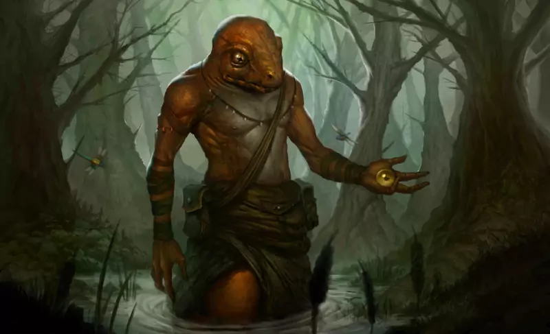

# Monstruos de los Mitos y otros enemigos

Aquí tienes un bestiario con las criaturas de los Mitos de Cthulhu más comunes que puedes encontrarte en tus viajes por el Caribe. Desde los profundos de las simas abisales hasta la serpigente en sus emplazamientos perdidos en lo profundo de la jungla.

Todos estos seres están ocultos a los habitantes del Caribe y solo unos pocos son lo suficientemente valientes y temerarios para encontrarlos, combatirlos y volver para contarlo a gritos delante de una buena jarra de grog.

\sinc

## Combatiendo a los Primigenios

\conc

Hemos excluido de este bestiario a primigenios y seres de igual poder. Principalmente debido a que son más elementos que hacen avanzar la historia que enemigos a combatir. La aventura es evitar que Cthulhu se levante, si se levanta tu misión ha fracasado. No trates de combatirlo, solo conseguirás una horrible muerte entre ventosas, babas y pseudópodos. Además, muchos de ellos están presos o dormidos en alguna extraña dimensión o a miles de años luz en el espacio profundo. Sin embargo, si puedes contactar, hacer tratos o combatir contra sus avatares. Las encarnaciones terrenales de los Primigenios puedes encontrarlos en la sección de «Quién es quién en el Caribe».

Avatares de primigenios:

* Barón Samedí (Nyarlathotep)
* Totep (Nyarlathotep)
* La llorona (Shub-Niggurath)

\sp

\sinc

## Descomposición de los cuerpos

\conc

Una cosa importante que debes tener en cuenta con todos estos seres (y que es muy típico de los relatos de Lovecraft) es que sus cadáveres se degradan rápidamente y desaparecen casi sin dejar rastro más que terribles hedores y líquidos viscosos. Muchas veces no podrás probar todas las cosas extrañas y terroríficas que te han pasado porque no quedará nada que enseñar. Puedes jugar con ello, haciendo que muchas veces la gente y en concreto las autoridades no crean a tu mesa y sin pruebas tomen sus historias de monstruos y dioses antiguos como chaladuras de locos.

Si son ingeniosos, pueden tratar de conservar los cuerpos usando todo tipo de trucos. Desde conservarlos en salazón o ahumarlos hasta introducirlos en barriles llenos de alcohol o formol. De hecho, entre el botín que pueden conseguir en sus aventuras hay varios dispositivos que les ayudarán en esas tareas de conservación de cadáveres.

\sp

\sinc

## Byakhee (secuaz)

\conc

Son seres voladores de apariencia insectoide con grandes alas membranosas y pies palmeados. Viven en el espacio interestelar donde sobreviven sin problemas. Se pueden mover a la velocidad de la luz y suelen bajar a diferentes planetas a alimentarse. Principalmente, se concentran en las Híades cerca de Aldebarán donde está exiliado su señor Hastur. Solo aparecen para acompañar a su señor o si son invocados. Pueden ser usados como monturas voladoras y si se pueden evitar los peligros del vacío especial podría viajarse montado en Byakhee entre galaxias a la velocidad de la luz.

* **Atributos:** Agilidad d8, Astucia d6, Espíritu d6, Fuerza d8, Vigor d8
* **Habilidades:** Notar d6, Pelear d8, Sigilo d6
* **Paso:** 6; **Parada:** 6; **Dureza:** 8
* **Ventajas:** Frenesí Mejorado, Temple.
* **Capacidades especiales:**
    * **Garras:** FUE + d4
    * **Mordisco:** FUE + d4. Si el Byakhee consigue hacer una herida con mordisco es porque ha mordido en una vena y ha chupado sangre. Adicionalmente, al daño hará un nivel de fatiga.
    * **Armadura quitinosa:** +2
    * **Tamaño +1:** Hasta 3 metros de tamaño.
    * **Volar:** Paso volando 12. En Tierra, a pesar de no moverse a la velocidad de la luz, son tremendamente rápidos.
* **TPC:** 1d6 (manada)

\sp

\sinc

## Color que cayó del cielo

\conc

El color es un extraño que no es de la tierra, sino que viene de las estrellas. Las personas que han podido estudiar un color no se ponen de acuerdo sobre que son, pero lo describen como un color que se va extendiendo y que impregna todo, rocas, plantas y hasta animales y personas.

Es una criatura muy básica que vive para sobrevivir y procrear. Cuando cae del cielo en algún tipo de meteorito, se «planta» cerca de donde cae, en algún lugar oscuro y cubierto y empieza a extraer la esencia vital de los seres vivos cercanos que se vuelven grises y quebradizos. Según consigue esencia vital va creciendo en tamaño.

Cuando tiene suficiente tamaño ponen huevos y los protegen hasta que eclosionan y el nuevo color madura. Entonces el primer color suele volver al espacio. El segundo color se dedica a crecer y procrear. Y así el ciclo se repite ampliando el radio de acción de los colores.

Permanecen inactivos por el día y mientras maduran se esconden en pozos, alcantarillas, cuevas, etc. No son agresivos directamente, pero los humanos que caen en su influencia se vuelven irracionales y violentos. Para poder combatir al color hay que enfrentarse a los humanos y animales a los que han corrompido.

En el Caribe sería normal que cayeran en fondos marinos donde pueden sobrevivir si no es a mucha profundidad y tienen donde refugiarse de la luz solar. Infectarán la fauna y flora marina como peces, tortugas o corales y grandes masas de algas. Podría unirse a grandes grupos de sargazos y extraer su esencia vital y moverse con estas algas.

* **Atributos:** Agilidad d10, Astucia d8, Espíritu d8, Fuerza d6, Vigor d6
* **Habilidades:** Pelear d6 (solo esquivar), Sigilo d8
* **Paso:** 6; **Parada:** 5; **Dureza:** 5
* **Capacidades especiales:**
  * **Morfología alien:** No tiene puntos débiles como cabeza, cuello, por lo que los golpes apuntados no consiguen extras.

\sp

* **Capacidades especiales:**  
  * **Crecimiento:** El tamaño del color aumenta según va pasando el tiempo, pasando de una casilla a tener áreas de 20 casillas de cualquier forma. No tienen bonificadores ni penalizadores por tamaño.
  * **Insustancial/solidificarse:** Un color es insustancial, parece gaseoso, pero no lo es. Es inmune a todo ataque físico. Puede solidificar partes de sí mismo para interactuar con su entorno. La parte sólida no es inmune a los ataques físicos.
  * **Volar:** Paso volando 12.
  * **Viaje espacial:** Pueden sobrevivir es el espacio, de hecho se sabe que llegan desde el espacio exterior en meteoritos.
  * **Ataque mental:** Un color puede lanzar un ataque mental a los seres inteligentes cada día que pase cerca de un color. Hay que hacer una Tirada enfrentada de Astucia. Si gana el color, la víctima del ataque mental quita un 1d4 de PP y obliga a pasar un TPC d8 no modificable de ninguna manera. En caso de fallar y llevarse un trastorno serán cosas que le mantengan en encerrado en el lugar donde esté el color como su granja o su casa. Serán trastornos como depresión y agorafobia. Los PP perdidos no se recuperan mientras no abandone el lugar donde habita el color. Cuando se quede sin PP, perderá todas las tiradas enfrentadas y acabará perdiendo su cordura si no es salvado del color.
  * **Drenaje de vida:** el color se alimenta de la esencia vital de los seres vivos (humanos, seres de los Mitos, animales y plantas) Todos los seres vivos en un radio de 1 kilómetro tendrán que hacer una tirada enfrentada de Vigor contra el espíritu del color. Si fallan, reciben una herida que se refleja en que envejecen, su piel se llena de arrugas y se vuelve gris y su pelo se vuelve lacio y canoso. Cada día puede drenar de su entorno esencia suficiente para crecer d6 casillas.
* **TPC:** d8

\sp

\sinc

## Chthonianos (comodín)

\conc

Los chthonianos son una especie de gusanos gigantescos con tentáculos en el extremo que es lo que sería su cabeza. Sus cuerpos de gusano están cubiertos de una especie de limo que les protege de los ataques y de las altas temperaturas. Viven en el interior de la tierra, entre el magma, y los que llegan a la corteza terrestre suelen ser renegados expulsados de sus comunidades o aquellos que van a reproducirse. Ponen huevos que parecen geodas y son extremadamente protectores con ellos. Sus crías no pueden soportar las temperaturas del interior de la tierra y por se desarrollan en la corteza terrestre.

En grupo y coordinados puedes crear terremotos y maremotos, derribar ciudades y hundir islotes. De hecho, su actividad se relaciona con el tsunami que arraso Port Royal en 1692.

* **Atributos:** Agilidad d6, Astucia d8, Espíritu d8, Fuerza d12+6, Vigor d12+2
* **Habilidades:** Notar d6, Pelear d8, Sigilo d8
* **Paso:** 6; **Parada:** 6; **Dureza:** 16 (2)
* **Rasgos:** Vulnerables al agua (-4 resistir ataques de este tipo).
* **Capacidades especiales:**
    * **Armadura +2:** Estos gusanos están cubiertos por una gruesa piel y un limo pegajoso.
    * **Excavar 12:** Los chthonianos pueden excavar en tierra y piedras suelta y reaparecer en el siguiente turno en cualquier sitio a 12 pasos.
    * **Telepatía:** Pueden comunicarse telepáticamente con otros de su especie, incluso a miles de kilómetros. También puede detectar mentes de otros seres pensantes y controlar las mentes de los humanos (Marioneta usando Espíritu como habilidad).
    * **Tamaño enorme (8):** Los chthonianos adultos miden entre 9 y 12 metros y un par de metros de diámetro (+8 dureza, +4 bonificación al atacarla, +2 heridas).
    * **Terremoto:** Levantando la cola o la cabeza y dejándola caer pueden crear un terremoto. El terremoto es un ataque de Chorro que usa su habilidad de Pelear.

\sp

* **Capacidades especiales:**  
    * **Tentáculos:** FUE+d10
    * **Debilidad agua:** Los chthonianos son extremadamente sensibles al agua. Pueden soportar pequeñas cantidades de agua, pero una inmersión completa supondría su destrucción.
* **TPC:** 1d8

\sinc

## Gugos (comodín)

\conc

Los gugos son una especie de simios gigantescos (5-6 metros de altura) que habitan en las Tierras del Sueño. Sus brazos se dividen en dos a la altura del codo, con lo que poseen 4 manos con grandes garras. La boca les cruza la cara de arriba a abajo, de forma que cada ojo queda a un lado de la boca. Es una raza inteligente con una cultura simple y se comunican mediante gestos de la cara. Son altamente agresivos, carnívoros y necrófagos y adoran a diferentes primigenios. No sueles salir de sus cuevas, ya que la luz del sol les hace daño. Si bien es no normal encontrárselos, pueden ser invocados por primigenios a los que adoran o por magos que siguen a esos primigenios para que les hagan diferentes tareas.

* **Atributos:** Agilidad d6, Astucia d6, Espíritu d6, Fuerza d12+5, Vigor d12+2
* **Habilidades:** Disparar d6, Notar d6, Pelea d6
* **Paso:** 8; **Parada:** 5; **Dureza:** 18(2)
* **Ventajas:** Frenesí Mejorado.
* **Capacidades especiales:**
    * **Armadura +2:** Su pelaje y su gruesa piel les confieren una buena armadura.
    * **Tamaño +7** +1 herida. Hasta 8 metros de alto.
    * **Debilidad luz solar:** Sufren un -2 a todas sus tiradas de habilidad a plena luz del día.
    * **Visión nocturna:** No sufren penalización por condiciones de iluminación.
    * **Garras:** FUE+d6
    * **Mordisco:** FUE+d6
* **TPC:** 1d10

\sp

\sinc

## Gules (secuaz)

\conc

Los gules son unos humanoides desgarbados con rasgos de hiena. Salen de noche debido a que son fotosensibles. Son necrófagos y, por tanto, se establecen cerca de zona de enterramiento. Se organizan en pequeños grupos familiares y son muy territoriales. Pueden infectar a los humanos mediante heridas con una enfermedad que convierte a la víctima en un gul.

* **Atributos:** Agilidad d8, Astucia d8, Espíritu d8, Fuerza d12, Vigor d8
* **Habilidades:** Pelear d6, Atletismo d12, Notar d6, Sigilo d12
* **Paso:** 6; **Parada:** 5; **Dureza:** 7 (1)
* **Capacidades especiales:**
    * **Armadura +1:** Piel dura.
    * **Excavar 4:** Los gules pueden excavar en tierra y piedras suelta y reaparecer en el siguiente turno en cualquier sitio a 6 pasos.
    * **Debilidad luz solar:** Sufren un -2 a todas sus tiradas de habilidad a plena luz del día.
    * **Visión nocturna:** No sufren penalización por condiciones de iluminación.
    * **Garras/Mordisco:** FUE+d6
    * **Infección:** Cualquiera que sufra una herida de un Gul debe hacer una tirada de Vigor al de una semana. El éxito indica que está bien. El fracaso le otorga un nivel inmediato de fatiga debido a las fiebres. Un fallo crítico indica que el personaje está infectado. El infectado tiene un d6 meses antes de que la transformación en Gul esté completa y el personaje se vuelva injugable. Quizás puedas encontrar a alguien con los suficientes conocimientos en Mitos que sepa como curarla, pero seguramente le deberás un gran favor. Los propios gules podrían darte esa información. Si se supera la infección o se pasa la tirada de Vigor, la víctima se vuelve inmune a la infección y la próxima vez ni tendrá el nivel de fatiga.
* **TPC:** 1d4 (manada).

\sp

\sinc

## Lengnita (secuaz)

\conc

Los lengnitas son una raza de humanoides parecidos a sátiros (cuernos, con patas de cabra y muy velludos) que habitan la meseta de Leng. Al igual que los sátiros de la mitología griega, son vulgares y viciosos, con gustos, deseos y pulsiones de lo más dudoso. De hecho, tienen fama de antropófagos.

Fueron esclavizados por las bestias lunares y los lengnitas más grandes también sirven como comida para estas. Dentro de los lengnitas, los comerciantes son los más valorados, ya que se dedican a vender los rubís extraídos de las minas lunares y compran nuevos esclavos para trabajar en las minas.

* **Atributos:** Agilidad d6, Astucia d8, Espíritu d6, Fuerza d6, Vigor d6
* **Habilidades:** Atletismo d6, Idioma nativo d8, Mitos de Cthulhu d4, Notar d6, Pelear d6, Persuadir d6 (d10 los comerciantes), Sigilo d6
* **Paso:** 6; **Parada:** 5; **Dureza:** 5
* **Desventajas:** Escoge dos Hábitos, uno menor y otro mayor. Puede ser cosas como alcohol, comida, juego, sexo, … Los lengnitas suelen llevar al extremo las cosas que consideramos como vicios.
* **Capacidades especiales:**
    * **Cuernos:** FUE+d4
* **Equipo:** Machete (FUE+d6) y ropajes amplios y sombreros grandes para ocultar sus rasgos de sátiro.

\sp

\sinc

## Lloigor

\conc

Los lloigors son seres de energía invisibles para los humanos provenientes de Andrómeda. Tienen una mente malvada y pesimista, carecen de sentimientos y jamás olvidan. Su mente es tan poderosa que afecta a los humanos cercanos, llevándoles a la depresión y a tener ideas suicidas.

Llevan miles de años en la Tierra y vinieron con su caudillo Ghatanothoa, el primogénito de Cthulhu, estableciéndose en un continente ya perdido. Cuando su Ghatanothoa fue encerrado en un volcán, entraron en decadencia y ahora solo quedan unos pocos lloigors en la Tierra.

Aun así, son tremendamente poderosos y sus mentes llevan poco a la locura a los humanos. La RCPC ha hecho tratos con los lloigors para provocar la locura y el caos en determinados sitios y hacer que la gente abandone el lugar, el ejemplo más claro es Port Royal.

### Lloigor forma inmaterial (comodín)

Los lloigors son seres de energía invisibles en forma de vórtice. En este estado suelen coger a individuos marginales y de mente débiles y convertirlos en sus siervos que se encargan de hacer las tareas que ellos no pueden.

\sp

* **Atributos:** Agilidad —, Astucia d12+1, Espíritu d12+3, Fuerza —, Vigor —
* **Habilidades:** Mitos d12, Notar d10, Sigilo d8
* **Paso:** 6; **Parada:** —; **Dureza:** —
* **Ventajas:** Puntos de poder, Nuevo poder x2
* **Capacidades especiales:**
    * **Incorpóreo:** En su forma incorpórea son totalmente invulnerables contra armas físicas y mágicas. Solo los ataques mentales podrían hacerles daño. También los hace casi invisibles dándoles un -4 a los que quieran detectarlos.
    * **Telepatía:** Se comunica con cualquier criatura de forma telepática
    * **Depresión:** Un aura depresiva rodea siempre a un lloigor, todos los héroes que pasen una hora en una localización donde hay un lloigor y fallen una tirada de Espíritu enfrentada, tendrán que coger como trastorno mental Depresión (mayor).
* **Hechizos:** 30 PP, Vórtice (Explosión), Telekinesis, Marioneta, Drenar magia (Drenaje de puntos de poder)

\sc

### Lloigor corpóreo (comodín)

El lloigor puede hacerse corpóreo adoptando la forma de un reptil alargado y patilargo de gran tamaño. Se les considera como una de las posibles explicaciones a las historias de los dragones.

* **Atributos:** Agilidad d8, Astucia d12+1, Espíritu d12+1, Fuerza d12+3, Vigor d12
* **Habilidades:** Mitos d12, Notar d10, Pelear d10, Sigilo d8
* **Paso:** 6; **Parada:** 7; **Dureza:** 19(15)
* **Ventajas:** Puntos de poder, Nuevo poder x2
* **Capacidades especiales:**
    * **Depresión:** Un aura depresiva rodea siempre a un lloigor, todo ser que pase una hora en una localización donde haya un lloigor y fallen una tirada de Espíritu enfrentada, tendrán que coger como trastorno mental Depresión (mayor). Si fallan la TPC, también tendrán que coger la Depresión como trastorno mental.
    * **Tamaño enorme (7):** Los lloigor como reptiles adultos miden entre 8 y 10 metros de largo y 3 de alto (+7 dureza, +4 bonificación al atacarla, +2 heridas).

\sp

* **Capacidades especiales:**    
    * **Mordisco/Garras:** FUE+d10
    * **Armadura +4:** Su piel dura y escamosa y es muy resistente.
    * **Telepatía:** Se comunica con cualquier criatura de forma telepática
* **Hechizos:** 30 PP, Vórtice (Explosión), Telekinesis, Marioneta, Drenar magia (Drenaje de puntos de poder)
* **TPC:** 1d12

\sinc

## Lusca (comodín)

\conc

Una lusca es un temible críptido del Caribe, de la zona de las Bahamas. Su nombre viene de Mol-lusca (molusco como pulpos, calamares, caracoles, … ) Las descripciones no son claras, pero parece que el consenso es que es un gigantesco calamar o pulpo.

Hay personas que cuentan que lo han visto y han sobrevivido a su ataque y aseguran que tiene una cabeza de tiburón en vez de octópodo, pero la explicación más sencilla es que se dedique a cazar y devorar sardas (tiburones toro) y eso fue lo que vieran los testigos.

El origen de la lusca es desconocido, pero la teoría más plausible es la que elaboró Hernando Villalba en su juventud. Villalba considera que las luscas son versiones degeneradas e involucionadas de las semillas estelares de su adorado Cthulhu. Durante millones de años, algunas de las semillas que escaparon al hundimiento de R’lyeh han ido degenerando y mutando en los terribles monstruos marinos que conocemos como luscas.

\sp

De hecho, cuando conoció a una tribu de profundos de cerca de Bahamas que cuidaban, alimentaban y hacían ofrendas a una lusca muy anciana que vivía en una cueva submarina, empezó a elaborar la teoría de que R’lyeh estaba sumergida en el Caribe y la lusca era una prueba de ello.

Debido a ser descendientes de las semillas estelares, son bastante inteligentes, aunque siga siendo inteligencia animal. Son capaces de solucionar pequeños problemas, de usar objetos simples o de atacar puntos débiles, incluso puede desarrollar tácticas simples como volcar una barca para atacar a los tripulantes en el agua y que sean presas más fáciles.

* **Atributos:** Agilidad d8, Astucia d8 (A), Espíritu d6, Fuerza d12+9, Vigor d10
* **Habilidades:** Atletismo d6, Notar d6, Pelear d8
* **Paso:** —; **Parada:** 6; **Dureza:** 19(2)
* **Ventajas:** Armas naturales
* **Capacidades especiales:**
    * **Acuático:** Paso nadando 8.
    * **Tamaño 10:** Un espécimen normal ronda 40 metros con los tentáculos incluidos y un peso de 150 tn (+10 dureza, +4 bonificación al atacarla, +2 herida). Especímenes extremadamente grandes podrían llegar a tamaño 13.
    * **Armadura +2:** Sus duras escamas le proporcionan protección.
    * **Mordisco:** Daño FUE+d4
    * **Tentáculos:** Daño FUE+d6. La lusca puede hacer hasta cuatro ataques por ronda sin penalización por múltiples acciones. Con un aumento, atrapa un enemigo con el tentáculo y esta solo puede escapar con una tirada opuesta de Fuerza durante su turno; algo casi imposible para un simple humano. Una vez aferrada una víctima, la lusca le causa FUE+d6 de daño de forma automática por constricción. Si se ataca al tentáculo (+2 a la dificultad de impactar) y se hace una herida, la lusca soltará a su presa y el tentáculo es cercenado y no puede usarlo en combate.
* **TPC:** 1d8 (el botín está en su estómago)

\sp

\sinc

## Madre de aguas (comodín)

\conc

La madre de aguas es un críptido de la cultura popular cubana. Es una gran boa (o majá) con unas protuberancias en la cabeza parecidas a cuernos y con poderes mágicos que habita las zonas húmedas de la isla. Se cuenta de ellas de todo, desde que roban niños para devorarlos hasta que protegen a las comunidades agrícolas de ladrones y enemigos o que han ayudado a viajeros perdidos a salir de pantanos y humedales. Son inteligentes y muy escurridizas y difíciles de ver.

La teoría más probable de su creación es que sean algún tipo de creación genética de la serpigente para crear una raza inferior de siervos. Seguramente algunos ejemplares escaparon o fueron liberados por la serpigente y sus descendientes han llegado hasta nuestros días.

* **Atributos:** Agilidad d6, Astucia d8, Espíritu d8, Fuerza d12+2, Vigor d10
* **Habilidades:** Atletismo d8, Notar d10, Pelear d10, Sigilo d10
* **Paso:** 4; **Parada:** 7; **Dureza:** 12 (5)
* **Ventajas:** Armas naturales
* **Capacidades especiales:**
    * **Acuático:** Paso nadando 4.
    * **Tamaño 4:** 15 metros de largo y 1,2 toneladas de peso (+4 dureza, +2 bonificación al atacarla, +1 herida).
    * **Armadura +1:** Sus duras escamas le proporcionan protección.
    * **Constreñir:** La serpiente gana una bonificación de +2 a las tiradas de Atletismo y Fuerza relacionadas con presas.
    * **Mordisco:** Daño FUE
    * **Cuernos:** Daño FUE+1
    * **Poderes:** Manipulación elemental (Agua), Curación, Ilusión
* **Botín:** 1d4 (normalmente en su madriguera)

\sp

\sinc

## Noctivago demacrado (secuaz)

\conc

Los noctivagos son unos seres con unas grandes alas de murciélago y colas con pinchos afilados. Tiene tentáculos en vez de extremidades y cuerno en lo que sería su cabeza. Su piel es oscura y de una textura entre gomosa y aceitosa. Recuerdan a demonios o gárgolas. Son bastante apacibles y nada agresivos, pero es difícil negociar con ellos, si han recibido una orden la cumplen sin preguntarse por qué. Sirven principalmente al dios Nodens y tienen buenas relaciones con los gules. Proceden de las Tierras de los Sueños y se sabe, aunque no muy bien, que pueden moverse entre la Tierra de los Sueños y nuestro mundo. Aunque tienen poderosos tentáculos y una cola afilada, normalmente reducen a sus enemigos con cosquillas. Puede que parte de los antiguos mitos de demonios alados y de gárgolas sean fruto de estos seres.

* **Atributos:** Agilidad d8, Astucia d4, Espíritu d6, Fuerza d8, Vigor d6
* **Habilidades:** Atletismo d10, Notar d6, Pelear d8, Sigilo d8
* **Paso:** 6; **Parada:** 6; **Dureza:** 7(2)
* **Ventajas:** Rápido
* **Capacidades especiales:**
    * **Armadura +2:** Su piel gomosa y es bastante resistente.
    * **Volar:** Paso volando 12.
    * **Cosquillas:** Los noctivagos pueden intentar hacer una acción de Presa con su cola. En caso de conseguir inmovilizarla, como acción gratuita, puede hacer cosquillas con la cola a su presa. Si la presa falla estará aturdido 1d6 turnos debido a que se ríe descontroladamente. Pasado esos turnos la presa puede tratar de escapar y el noctivago volver a hacerle cosquillas. Normalmente, cuando consigue aturdir a la víctima, toman altura y lo dejan caer.
* **TPC:** 1d6 (manada)

\sp

\sinc

## Pólipos volantes (secuaz)

\conc

Los pólipos volantes son una raza extraterrestre que como bien dice su nombre tienen forma de pólipos, un gran tronco con gran cantidad de pseudópodos en uno de los extremos. No tienen sentidos como los humanos, de hecho, son ciegos, pero usan sus otros sentidos para poder moverse por la oscuridad sin problemas o sentir a través de las paredes.

Son semi materiales, no son del todo materiales, pero tampoco totalmente incorpóreos. Son lo suficientemente materiales para interactuar con los objetos y los suficientemente incorpóreos para que los vientos los sostengan y para que puedan hacerse invisibles.

Como su nombre también indica, pueden volar, generando vientos a debajo de ellos que hacen un ruido característico, pero pueden arrastrarse si fuera necesario. Tiene cierto control de los vientos, de forma puede invocarlos a su voluntad.

Durante milenios dominaron la Tierra antes de la aparición de los humanos, pero con los siglos han ido decayendo hasta casi extinguirse. Los pocos que han sobrevivido viven ahora escondidos en cavernas.

Se cree que son inteligentes, pero su forma de pensar es tan extraña que muchas de las decisiones que toman parecen no tener sentido.

* **Atributos:** Agilidad d8, Astucia d8, Espíritu d12, Fuerza d12+6, Vigor d12+2
* **Habilidades:** Mitos d8, Notar d8, Pelear d12
* **Paso:** 4; **Parada:** 8; **Dureza:** 16 (14)

\sp

* **Capacidades especiales:**
    * **Armadura +2:** Su gruesa piel les confieren una buena armadura.
    * **Tamaño +5** Los pólipos son del tamaño de un hipopótamo (+5 dureza, +2 bonificación al atacarla, +1 heridas)
    * **Sentidos extraterrestres:** No tienen sentidos como los humanos, es por ello que no sufren penalizaciones por iluminación o por cobertura (aunque no puedan atacar, si podrán verte). Todas las tiradas de Sigilo sufren un negativo de -4, ya que los humanos no entendemos realmente como perciben y, por tanto, como podemos ocultarnos a sus sentidos.
    * **Volar:** Paso volando 12. Mediante el control de los vientos pueden volar.
    * **Dominio del aire:** Pueden usar este hechizo a voluntad sin necesidad de gastar PP.
    * **Invisibilidad:** Pueden usar este hechizo a voluntad sin necesidad de gastar PP.
    * **Tentáculos:** FUE+d6. Suelen tener entre 10 y 15 tentáculos. Por ronda pueden usar 3 tentáculos para atacar. Cada tentáculo tiene un alcance de dos casillas y son independientes, es decir, no reciben penalizadores, por ejemplo, por acciones múltiples.
* **TPC:** 1d10

Los pólipos ya son de por sí enemigos temibles, pero pueden ponerles hechizos si quieres aumentar su dificultad. Ten en cuenta que deberían ser hechizos ofensivos como Proyectil o Confusión que tenga un ornamento basado en el aire.

\sp

\sinc

## Profundos

\conc

Los Profundos son unas criaturas humanoides acuáticas mezcla de pez y rana. Tienen cabezas de pez con unos grandes ojos sin párpados y agallas en el cuello. Pies y manos palmeadas que acaban en zarpas. Su piel resbaladiza de sapo, que se llena de escamas en la zona de la espina dorsal, es de color gris verdoso, aunque su vientre es blanquecino.

Solo mueren de forma violenta. Según las leyendas viven eternamente en el fondo del mar en asentamientos submarinos, sirviendo a Dagón e Hydra y esperando el momento adecuado para alzarse de las profundidades y acabar con la raza humana.

Al ser inmortales no paran de crecer y hacerse más poderosos. Esto hace que los individuos más ancianos son los más grandes y poderosos. Cuando esto ocurre es más raro aún que salgan a la superficie. De hecho, se considera que Hydra y Dagón son profundos muy muy antiguos y, por tanto, muy poderosos. Hay teorías que cree que todo profundo es un primigenio en potencia si se le dan eones de tiempo.

### Profundo (secuaz)

* **Atributos:** Agilidad d6, Astucia d8, Espíritu d6, Fuerza d8, Vigor d8
* **Habilidades:** Atletismo d8, Idioma Cthulhunés d8, Pelear d6, Mitos de Cthulhu d4, Notar d8, Sigilo d10, Supervivencia d8
* **Paso:** 6; **Parada:** 6 (5); **Dureza:** 8 (2)

\sp

* **Capacidades especiales:**
    * **Acuático:** Paso nadando 6. Pueden respirar bajo el agua sin problemas y tampoco tienen problemas con la presión a grandes profundidades.
    * **Armadura +2:** Escamas y piel rugosa.
    * **Inmunidad a la edad, el veneno y las enfermedades:** No pueden morir de enfermedad, de viejo o por venenos.
    * **Garras:** FUE+d4
    * **Tridente:** FUE+d6. +1 Parada, a dos manos.
    * **Rituales:** Atraer a los peces
* **TPC:** 1d4 (manada).

### Líder profundo (secuaz)

Dentro de cada comunidad profunda, el más viejo y, por tanto, el más poderoso suele ser el líder. Han vivido tantos años que han aprendido a combatir y algo de magia y no han perdido cualidades físicas. De hecho, suelen ser más fuertes y resistentes que un profundo normal.

* **Atributos:** Agilidad d8, Astucia d8, Espíritu d8, Fuerza d10, Vigor d10
* **Habilidades:** Atletismo d8, Idioma Cthulhunés d8, Pelear d6, Mitos de Cthulhu d8, Notar d8, Sigilo d10, Supervivencia d8
* **Paso:** 6; **Parada:** 6 (5); **Dureza:** 8 (2)
* **Ventajas:** Trasfondo Arcano (Hechicería primigenia), Nuevos poderes x2
* **Capacidades especiales:**
    * **Acuático:** Paso nadando 6. Pueden respirar bajo el agua sin problemas y tampoco tienen problemas con la presión a grandes profundidades.
    * **Armadura +2:** Escamas y piel rugosa.
    * **Inmunidad a la edad, el veneno y las enfermedades:** No pueden morir de enfermedad, de viejo o por venenos.
    * **Garras:** FUE+d4
    * **Tridente:** FUE+d6. +1 Parada, a dos manos.
    * **Hechizos:** PP 8, Hidromancia, Dominar a las bestias.
    * **Rituales:** Atraer a los peces, Consagrar personas
* **TPC:** 1d4 (manada).

\sp

### Cacique profundo (comodín)

Solo hay 3 caciques profundos en todo el Caribe y son seres de bastante poder, tanto personal como político. Son de mucho más tamaño que el resto de profundos, pero sin llegar al tamaño de profundos míticos como Dagón o Hydra.

* **Atributos:** Agilidad d12, Astucia d8, Espíritu d12, Fuerza d12+2, Vigor d12+2
* **Habilidades:** Atletismo d8, Idioma Cthulhunés d8, Intimidar d12,Pelear d12, Mitos de Cthulhu d12, Notar d8, Supervivencia d8
* **Paso:** 6; **Parada:** 7 (6); **Dureza:** 15 (2)
* **Ventajas:** Trasfondo Arcano (Hechicería primigenia), Nuevos poderes x2, Puntos de poder
* **Capacidades especiales:**
    * **Acuático:** Paso nadando 6. Pueden respirar bajo el agua sin problemas y tampoco tienen problemas con la presión a grandes profundidades.
    * **Armadura +2:** Escamas y piel rugosa.
    * **Tamaño grande 4:** Miden unos entre 4 metros de altura (+4 dureza, +2 bonificación al atacarla, +1 herida).
    * **Inmunidad a la edad, el veneno y las enfermedades:** No pueden morir de enfermedad, de viejo o por venenos.
    * **Garras:** FUE+d4
    * **Tridente:** FUE+d6. +1 Parada, a dos manos.
    * **Hechizos:** PP 16, Hidromancia, Dominar a las bestias, Pudrir carne, Invocar los apéndices de Dygra.
    * **Rituales:** Atraer a los peces, Consagrar personas
* **TPC:** 1d8 (manada).

### Híbrido de profundo (secuaz)

Los profundos pueden hibridarse con los humanos. Estos híbridos parecen humanos, pero según van creciendo empiezan a tomar rasgos de pez: piel pálida y escamosa, ojos saltones, agallas, andares patosos y cuando llegan a la madurez suelen sentir la llamada del mar donde se adentran para desaparecer tras transformarse en profundos. Suelen ser seres ariscos y antisociales con tendencias violentas y no suelen destacar por su intelecto, pero son muy útiles por su capacidad de infiltrarse entre humanos.

\sp

Para hacer un híbrido añádele estas características a un PNJ.

* **Habilidades:** Cthulhunés d6
* **Desventajas:** Feo menor si es joven y mayor si es adulto. Suelen tener otras desventajas como Analfabeto, Marginado o Sanguinario.
* **Capacidades especiales:**
    * **Semiacuáticos:** Paso nadando 4. Pueden respirar bajo el agua sin problemas, pero no son tan hábiles nadadores como un profundo completo.
    * **Inmunidad a la edad, el veneno y las enfermedades:** No pueden morir de enfermedad, de viejo o por venenos.

\sp

\sinc

## Retoño oscuro (comodín)

\conc

Los retoños oscuros son unas masas informes de tentáculos con varias bocas. Para desplazarse usan tres patas acabadas en pezuñas. Miden de 4 a 6 metros de altura. Son vástagos de la diosa Shub-Niggurath y normalmente aparecen en las invocaciones en vez de su madre, la diosa de la fertilidad.

* **Atributos:** Agilidad d8, Astucia d6, Espíritu d8, Fuerza d12+2, Vigor d10
* **Habilidades:** Notar d8, Pelea d10, Sigilo 1d12
* **Paso:** 4; **Parada:** 7; **Dureza:** 11-13 (4/6)
* **Capacidades especiales:**
    * **Masa informe:** No tiene puntos débiles como cabeza, cuello, por lo que los golpes apuntados no consiguen ningún extra. Por ejemplo, disparar a una boca no sirve de nada, ya que hay muchas más.
    * **Inmunidad:** A explosivos y armas de fuego
    * **Tentáculos:** FUE+d6, pueden hacer dos ataques independientes por turno sin tener penalizadores por hacer varias acciones o por mano mala.
    * **Tamaño grande (4/6):** Los retoños miden entre 4 y 6 metros y un par de metros de diámetro (+4/6 dureza, +2 bonificación al atacarla, +1 herida).
    * **Apariencia de árbol:** Pueden usar su sigilo solo para parecer ser árboles en la lejanía. En cuando te acercas o se mueven, la ilusión se rompe.
* **TPC:** 1d8

\sp

\sinc

## Sabuesos de Tíndalos (secuaz)

\conc

Los perros o sabuesos de Tíndalos son unos seres inmortales que habitan la época en la que la Tierra cuando la vida solo eran unos pocos seres unicelulares. Se dice que viven entre los ángulos del tiempo, mientras que el resto de seres vivimos en las curvas del tiempo. No se sabe muy bien su forma exacta, ya que nadie ha sobrevivido a su ataque. 

Cuando alguien viaje a través del tiempo y se acerca a su época, ellos lo notan y van avanzando a través de los ángulos tiempo hasta que lo encuentran y lo destruyen. Fueron creados a partir de restos ADN de dioses y es por ello que tienen formidables poderes.

Los perros de Tíndalos representan todo lo que es impuro y odian todo lo que es puro. Desean corromperlo o destruirlo. Esta naturaleza impura vincula a los perros con las formas angulares, pues estas carecen de la pureza que poseen las formas curvas.

Como ya hemos dicho, pueden moverse por los ángulos del tiempo y el espacio y la forma más segura de protegerse sería en una habitación sin ángulos, por ejemplo, una habitación donde las juntas entre paredes, techo y suelo hayan sido rellenadas de cemento, de forma que haya ángulos rectos.

* **Atributos:** Agilidad d6, Astucia d10, Espíritu d10, Fuerza d12, Vigor d12+2
* **Habilidades:** Mitos d8, Notar d12, Pelear d12, Sigilo d12, Supervivencia d10
* **Paso:** 10; **Parada:** 8; **Dureza:** 11(9)

\sp

* **Capacidades especiales:**
    * **Armadura +2:** Su pelaje y su gruesa piel les confieren una buena armadura.
    * **Garras:** FUE+d6
    * **Mordisco:** FUE+d6
    * **En fase:** El sabueso vibra temporalmente con lo que está y no está. Esto le otorga -2 a todos los intentos de impactarle.
    * **Regeneración rápida:** Realiza una tirada de curación natural por ronda, pudiendo sanar de este modo cualquier herida. Si pierde todas sus heridas no podrá regenerarlas y volver a la vida.
    * **Inmunidad:** Ataques físicos como armas de corte, pistolas, fuego, electricidad, …
    * **Debilidad:** Magia y alta tecnología. Las armas encantadas y las pistolas lanzarrayos pueden dañarlos normalmente.
    * **Telepatía:** Se comunica telepáticamente con todo tipo de seres inteligentes.
    * **Teleportación:** Una vez por turno y con un solo punto de coste de movimiento. Puede entrar en zonas angulares como esquinas de la pared y aparecer en otra esquina siempre que este a menos de 8 casillas. No podría teleportarse, si es encerrado dentro de una esfera.
    * **Sentidos temporales:** Puede rastrearte a través del tiempo. Es decir que, si viajas en el tiempo y escapas de vuelta a tu tiempo, podrá olfatearte hasta tu época actual.
    * **Hechizos:** 10 PP, Detección arcana, Drenaje de puntos de poder. Si lo crees necesario, puedes darles más hechizos.
* **TPC:** 1d10 (manada)

\sp

\sinc

## Serpigente (secuaz)

\conc

La serpigente son humanoides escamosos de rostro y cola reptiliano. Dominaron la tierra durante miles de años con su magia y su ciencia y esclavizaron a la raza humana. Pero su imperio cayó y su especie fue degenerando hasta hoy. Quedan ya muy pocos asentamientos de serpigente y normalmente se ocultan de los humanos. Aun así, siguen siendo poderosos magos y sus desarrollos en genética pueden crear terribles mutaciones, desde bestias de guerra mutantes hasta terroríficas enfermedades.

Suelen infiltrarse en las comunidades humanas, haciéndose pasar por humanos para investigarnos y aprender como exterminarnos o para probar sus experimentos genéticos.

Adoran a Yig el dios serpiente como su padre y creador, aunque pequeñísimos grupos le rezan a Tsathoggua, el Durmiente de N’kai.

Como curiosidad diremos que la serpigente no es una creación de Lovecraft, sino de su amigo Robert E. Howard. Antes que tu mesa, Conan ya machacaba serpigente en sus relatos.

\sp

### Serpigente científico (secuaz)

Puedes encontrarlos en sus guaridas subterráneas rodeadas de todo tipo de herramientas científicas, buscando la forma de erradicar o esclavizar a la raza humana con su magia y su ciencia.

* **Atributos:** Agilidad d8, Astucia d12, Espíritu d12, Fuerza d6, Vigor d6
* **Habilidades:** Ciencias 1d12, Idioma Naacal d8, Investigar d8, Mitos de Cthulhu d8, Notar d8, Pelear d6
* **Paso:** 6; **Parada:** 5; **Dureza:** 6 (1)
* **Ventajas:** Trasfondo Arcano (Hechicería primigenia), Nuevos poderes x2
* **Capacidades especiales:**
    * **Mordisco venenoso:** FUE+d4. El mordisco de la serpigente es venenoso, su víctima debe pasar una tirada de Vigor inmediatamente o perderá un 1d6 adicional de daño. Puede usar este ataque 3 veces por escena.
    * **Armadura +1:** Piel escamosa.
    * **Garras:** FUE+d6
    * **Hechizos:** 12 PP, Conoce 3 hechizos al azar y Disfraz para poder moverse dentro de la sociedad humana.
* **TPC:** 1d6

### Serpigente soldado (secuaz)

Son las fuerzas de choque de la serpigente, crueles y brutales con los humanos. No sienten ningún tipo de reparos en segar sus inútiles vidas.

* **Atributos:** Agilidad d8, Astucia d6, Espíritu d8, Fuerza d10, Vigor d8
* **Habilidades:** Ciencias 1d6, Idioma Naacal d6, Investigar d6, Mitos de Cthulhu d4, Notar d8, Pelear d10
* **Paso:** 6; **Parada:** 6; **Dureza:** 7 (1)
* **Ventajas:** Trasfondo Arcano (Hechicería primigenia), Nuevos poderes
* **Capacidades especiales:**
    * **Mordisco venenoso:** FUE+d4. El mordisco de la serpigente es venenoso, su víctima debe pasar una tirada de Vigor inmediatamente o perderá un 1d6 adicional de daño. Puede usar este ataque 3 veces por escena.

\sp

* **Capacidades especiales:**
    * **Armadura +1:** Piel escamosa.
    * **Garras:** FUE+d6
    * **Hechizos:** 8 PP, Conoce 1 hechizos al azar y Disfraz para poder moverse dentro de la sociedad humana.
* **TPC:** 1d6

\sinc

## Shantak (comodín)

\conc

Los shantak son unos enormes reptiles alados (o pájaros escamosos según se vea) cuya cabeza tiene apariencia de equino. Son igual de grandes que un elefante africano. Aunque son criaturas de la Tierra de los Sueños, pueden ser invocados en nuestro mundo para servir a la persona que los llame.

Pueden ser entrenados como monturas y permitirían a sus jinetes viajar por el espacio con ellos, si tienen agua y comida suficiente para el viaje.

Sirven a los Dioses Exteriores, en especial al gran Azathoth y en menor medida a Nyarlathotep. De hecho, si el jinete pierde el control del shantak, este acabará llevándolo al centro del universo donde habita Azathoth.

* **Atributos:** Agilidad d6, Astucia d6 (A), Espíritu d6, Fuerza d12+4, Vigor d8
* **Habilidades:** Atletismo d6, Pelea d8, Notar d8
* **Paso:** 8; **Parada:** 6; **Dureza:** 15(3)
* **Capacidades especiales:**
    * **Armadura +3:** Su piel escamosa le confiere una buena protección.
    * **Garras/Mordisco:** FUE+d8
    * **Volar:** Paso volando 16
    * **Tamaño +6:** Tiene el tamaño de un elefante africano (+6 dureza, +2 bonificación al atacarle, +1 herida).
    * **Viaje estelar:** Es inmune a los rigores del espacio exterior.
* **Equipo:** Si ha sido entrenado como cabalgadura, puede llevar una silla de montar en la que podría ir una persona de tamaño real.
* **TPC:** d8

\sp

\sinc

## Shoggoth (comodín)

\conc

Los shoggoths son masas informes y burbujeantes de protoplasma. Tiene un tamaño de unos 6 metros de diámetro y unos 3 de altura. Pueden generar ojos y tentáculos en cualquier parte de su estructura. Fueron creados por Los Antiguos como mulas de carga en la construcción de sus ciudades acuáticas. No quedan muchos, pero aún se pueden encontrar en oscuras fosas marinas sirviendo a los profundos.

A lo largo de los milenios han ido evolucionando, haciéndose anfibios y aumentando su inteligencia hasta tener una inteligencia humana, aunque tampoco es que sean muy inteligentes. Se conocen casos en los que han desarrollado la capacidad de habla.

* **Atributos:** Agilidad d4, Astucia d4, Espíritu d6, Fuerza d12+6, Vigor d12
* **Habilidades:** Pelear d4, Notar d6
* **Paso:** 4; **Parada:** 4; **Dureza:** 18(14)
* **Ventajas:** Barrido (puede sacar tentáculos de cualquier parte de su cuerpo y atacar a todos los que le rodean).
* **Capacidades especiales:**
    * **Acuático:** Paso nadando 4.
    * **Armadura +4:** Su piel dura y gomosa y es bastante resistente.
    * **Impávido:** Son un engendro creado genéticamente por los antiguos.
    * **Masa informe:** Como muchos otros monstruos, no tiene puntos débiles como cabeza, cuello, por lo que los golpes apuntados no consiguen extras.
    * **Tamaño 6:** 6 metros de diámetro (+6 dureza, +2 bonificación al atacarla, +1 herida).
    * **Tentáculos:** FUE+d6

\sp

* **Capacidades especiales:**
    * **Regeneración rápida:** Realiza una tirada de curación natural por ronda, pudiendo sanar de este modo cualquier herida excepto las creadas por fuego o electricidad.
    * **Inmunidad:** Ataques físicos como armas de corte, pistolas, …
    * **Debilidad:** Fuego y electricidad. Podrían ser dañados por artilugios incendiarios o explosivos como fuego griego o granadas.
* **TPC:** 1d10

### Shoggoth Islote (comodín)

Este shoggoth ha crecido descomunalmente, de forma que se ha convertido en una isla flotante. Con los años ha ido acumulando entre su protoplasma resto de barcos que ha hundido, le han crecido sargazos e incluso un poco de vegetación terrestre y la parte superior que no está sumergida se ha endurecido como si fuera piedra por acción del sol. Desde lejos puede parecer un pequeño islote sin cartografiar, pero una vez encima una tirada Notar les dirá que han caído en una trampa mortal.

* **Atributos:** Agilidad d4, Astucia d4, Espíritu d6, Fuerza d12+6, Vigor d12
* **Habilidades:** Pelear d4, Notar d6
* **Paso:** 4; **Parada:** 4; **Dureza:** 20(16)
* **Ventajas:** Barrido (puede sacar tentáculos de cualquier parte de su cuerpo y atacar a todos los que le rodean).
* **Capacidades especiales:**
    * **Acuático:** Paso nadando 4.
    * **Armadura +4:** Su piel dura y gomosa y es bastante resistente.
    * **Impávido:** Son un engendro creado genéticamente por los antiguos.
    * **Masa informe:** Como muchos otros monstruos, no tiene puntos débiles como cabeza, cuello, por lo que los golpes apuntados no consiguen extras.
    * **Tamaño 8:** 12 metros de diámetro (+8 dureza, +4 bonificación al atacarla, +2 herida).
    * **Tentáculos:** FUE+d6
    * **Regeneración rápida:** Realiza una tirada de curación natural por ronda, pudiendo sanar de este modo cualquier herida, excepto las creadas por fuego o electricidad.

\sp

* **Capacidades especiales:**
    * **Inmunidad:** Ataques físicos como armas de corte, pistolas, …
    * **Debilidad:** Fuego y electricidad. Podrían ser dañados por artilugios incendiarios o explosivos como fuego griego o granadas.
* **TPC:** 1d12

\sp

\sinc

## Vampiro de fuego (secuaz)

\conc

Los vampiros de fuego son unos seres gaseosos e inteligentes que al contacto con atmósferas ricas en oxígeno estallan en llamas. Su forma puede variar desde una especie de enjambre de cientos de chispas de fuego hasta bolas o espirales de fuego.

Sirven a los primigenios Cthugha y Fthaggua (dos primigenios relacionados con el fuego). Ambos los usan como avanzadilla cuando son invocados o cuando van a conquistar un mundo. También pueden ser invocados independientemente.

Como seres de fuego que son se les puede atacar con agua o arena y para protegerse de ellos es buena idea introducirse en masas de agua. Absorben poderes y recuerdos de aquello que queman y es por ello que se usan como avanzadilla, ya que recopilan muy buena información de lo que queman. Un brujo inteligente podría invocarlos para atacar a sus enemigos y a la vez sacarles información.

* **Atributos:** Agilidad d10, Astucia d6, Espíritu d6, Fuerza d6, Vigor d4
* **Habilidades:** Notar d8, Pelear d6, Sigilo d6
* **Paso:** 6; **Parada:** 5; **Dureza:** 4
* **Capacidades especiales:**
    * **Invulnerables:** Son gaseosos y solo pueden ser atacados con agua o con magia (que no tenga ornamentos de fuego).
    * **Lenguas de fuego:** Pueden hacer ataques cuerpo a cuerpo (tirada Pelear) con sus lenguas de fuego de 2d6 de daño.

\sp

* **Capacidades especiales:**
    * **Proyectiles de fuego:** Tratar como un hechizo de Proyectil con ornamento de fuego. Tiene 6 PP.
    * **Toque vampírico:** Si el vampiro consigue hacerte daño por fuego (cuerpo a cuerpo o a distancia), hay que hacer una tirada enfrentada de Espíritu contra Espíritu y obtendrá un ítem de información (más o menos útil) o 2 PP.
    * **Tamaño -2:** Tiene un tamaño pequeño. Todo ataque dirigido a ellos tiene un -2.
    * **Debilidad Agua:** El agua (y otras materiales que extingan el fuego como la arena) les hace daño, por cada 5 litros de agua que se le lance se puede hacerle d4 de daño. Si se le consigue meter debajo, por ejemplo, de una cascada o dentro del agua, muere directamente.
* **TPC:** 1d4 (manada)

\sinc

## El yeho (comodín)

\conc

El yeho es un críptido, una animal a medio camino entre humano y primate que vive en las selvas de las islas del Caribe. Su descripción más acertada sería la de un simio de tamaño gigante, como un gorila de montaña o un orangután, pero más grande y de pelaje marrón. Es un ser solitario y bastante esquivo que vive en el interior de la jungla y que evita a los humanos. Para ser un animal es tremendamente inteligente, pudiendo hacer trampas y emboscadas y usar herramientas sencillas.

* **Atributos:** Agilidad d12, Astucia d8 (A), Espíritu d6, Fuerza d12 + 2, Vigor d10
* **Habilidades:** Atletismo d10, Notar d10, Pelear d12, Sigilo d8, Tácticas d6
* **Paso:** 6; **Parada:** 8; **Dureza:** 11
* **Ventajas:** Bestia, Armas naturales
* **Capacidades especiales:**
    * **Tamaño 4:** Es del tamaño de un hipopótamo (dureza +4, + 1 herida y +2 a impactarle).
    * **Garra/Mordisco:** FUE+d6
* **Botín:** 1d4 en su madriguera

\sp

\sinc

## Yithianos

\conc

Los yithianos es una raza extraterrestre que no tiene forma corpórea. Vinieron a la Tierra para escapar de la destrucción de su mundo y se vieron obligados a tomar los cuerpos actuales, una raza de moluscos cónicos mucho más grandes que un humano con 4 pseudópodos en la parte superior, dos acaban en pinzas, otro en unos ojos y otro en una especie de boca.

Se caracterizan por su control del viaje a través del tiempo. De hecho, se les conoce como Gran raza, ya que han sido capaces de controlar los viajes temporales. Cuando te encuentres con un yithiano debe tener en cuenta que igual estás hablando con alguien de tu pasado o de tu futuro con todas las implicaciones que tiene eso.

Pueden mandar su mente a través del tiempo y ocupar los cuerpos de seres inteligentes de diferentes épocas. Las mentes de los cuerpos ocupados pasan al cuerpo del yithiano y este puede usarlo para interactuar con otros yithianos. Cuando la mente yithiana vuelve a su cuerpo, la mente del huésped vuelve a su cuerpo tras ser borrada su memoria.

### Yithiano científico (secuaz)

Los yithianos son grandes científicos, como demuestra su capacidad de viajar en el tiempo o sus armas de rayos. El más simple de los yithianos está al nivel de grandes nombres de la ciencia como Isaac Newton o Émilie du Châtelet.

* **Atributos:** Agilidad d6, Astucia d10, Espíritu d8, Fuerza d12, Vigor d12

\sp

* **Habilidades:** Ciencias d10, Disparar d6, Investigar d10, Mitos de Cthulhu d8, Notar d8, Pelear d6
* **Paso:** 6; **Parada:** 5; **Dureza:** 17 (4)
* **Capacidades especiales:**
    * **Armadura quitinosa +4:** Como los moluscos, poseen un exoesqueleto quitinoso que les protege de ataques.
    * **Tecnología yithiana:** Puedes asignarle a un yithiano hasta 3 aparatos tecnológicos con diferentes funciones que emulen diferentes poderes/hechizos. A nivel de juego, tienen 8 PP que pueden gastar para hacer funcionar esos 3 aparatos como si fueran hechizos usando Astucia como habilidad de lanzamiento. Recuperan esos 8 puntos en la siguiente escena. Los yithianos pueden usar cualquier poder del manual básico, no tienen las limitaciones de esta ambientación.
    * **Tamaño +5:** Mide entre 3 y 4 metros. Los atacantes añaden +2 a sus tiradas de ataque contra un yithiano. También tiene 1 herida extra.
    * **Pinzas:** FUE+d6
    * **Telepatía:** Los yithianos son capaces de comunicarse con cualquier especie inteligente mentalmente.
* **TPC:** 1d8

### Yithiano soldado (secuaz)

Los yithianos combatieron y derrotaron a un gran enemigo, los pólipos volantes, y es por ello que puede ser formidables combatientes, sobre todo si disponen de sus temibles armas lanzarrayos.

* **Atributos:** Agilidad d8, Astucia d8, Espíritu d8, Fuerza d12+2, Vigor d12+2
* **Habilidades:** Ciencias d6, Disparar d10, Mitos de Cthulhu d6, Notar d8, Pelear d8, Notar
* **Paso:** 6; **Parada:** 5; **Dureza:** 18 (4)
* **Capacidades especiales:**
    * **Armadura quitinosa +4:** Como los moluscos, poseen un exoesqueleto quitinoso que les protege de ataques.
    * **Tamaño +5:** Mide entre 3 y 4 metros. Los atacantes añaden +2 a sus tiradas de ataque contra un yithiano. También tiene 1 herida extra.
    * **Pinzas:** FUE+d6
    * **Telepatía:** Los yithianos son capaces de comunicarse con cualquier especie inteligente mentalmente.

\sp

* **Capacidades especiales:**
    * **Tecnología yithiana:** Puedes asignarle a un yithiano hasta 2 aparatos tecnológicos con diferentes funciones que emulen diferentes poderes/hechizos. A nivel de juego, tienen 8 PP que pueden gastar para hacer funcionar esos 3 aparatos como si fueran hechizos usando Astucia como habilidad de lanzamiento. Recuperan esos 8 puntos en la siguiente escena. Los yithianos pueden usar cualquier poder del manual básico, no tienen las limitaciones de esta ambientación, pero suelen ser de orientados al combate.
* **TPC:** 1d8

> Su capacidad de viajar en el tiempo no tiene reglas, ya que creemos que es más un recurso narrativo que una habilidad para usar en el juego. Puede que a tus jugadores se les ocurra usar a un yithiano para se intercambie con sus yoes del pasado y poder hablar con ellos para advertirles de un peligro. Si quieren hacerlo y se lo curran al convencer al yithiano el viaje en el tiempo funciona sin necesitar ningún tipo de tirada.

\sp

\sinc

## Yuggothianos

\conc

Los yuggothianos, hongos de Yuggoth o Mi-Go tienes aspecto de crustáceos, aunque en realidad son parte animal, parte hongo. Tienen varios pares de extremidades terminadas en pinzas y alas membranosas funcionales. Se comunican mediante patrones de color en sus cabezas.

Los Yuggothianos son una raza que se dedica a moverse por el espacio e ir conquistando planetas de los que explotan sus recursos minerales. Su asentamiento más cercano a la Tierra se encuentra ahora mismo en Plutón (que no será descubierto hasta 1930).

\sp

Suelen buscarse aliados indígenas en los planetas que quieren conquistar para que les ayuden en sus planes. 

Adoran a varios dioses primigenios como difundiendo Nyarlathotep y Shub-Niggurath y en sus planes de colonización siempre está difundir el culto a estos primigenios.

Los yuggothianos son famosos por sus conocimientos en cirugía cerebral que les permite extraer un cerebro de un cuerpo humano y mantenerlo conservados en unos tubos metálicos llenos de líquido llamados cilindros cerebrales. Estos tubos pueden conectarse a diferentes aparatos que le permiten al cerebro, ver, oír, hablar, etc. 

Esta tecnología les permite a los Mi-Go llevarse con ellos en sus viajes especiales a los humanos con los mínimos riesgos para los cerebros. También saben como conservar los cuerpos y si es necesario, pueden devolver al cerebro a su cuerpo sin ningún tipo de problema.

### Yuggothiano colono (secuaz)

Los colonos son la mano de obra y la fuerza de combate de los yuggothianos. Trabajan en las minas extrayendo extraños minerales y defienden sus asentamientos secretos. Son fuertes, ágiles y resistentes.

* **Atributos:** Agilidad d8, Astucia d6, Espíritu d6, Fuerza d8 Vigor d8
* **Habilidades:** Ciencias d6, Disparar d8, Medicina d4, Mitos d6, Notar d8, Pelear d8
* **Paso:** 6; **Parada:** 6; **Dureza:** 8 (2)
* **Ventajas:** Frenesí Mejorado.
* **Capacidades especiales:**
    * **Armadura +2:** Caparazón de crustáceo
    * **Pinzas:** FUE+d4
    * **Volar:** Paso volando 12. Los yuggothianos tienen unas alas con las que vuelan.
    * **Viaje espacial:** Pueden viajar por el espacio sin sufrir ningún tipo de daño.
* **TPC:** 1d6

### Yuggothiano científico (secuaz)

Sobre ellos recae todo el desarrollo tecnológico de su raza. No son tan fuertes y resistentes como los colonos, pero son más inteligentes.

* **Atributos:** Agilidad d6, Astucia d10, Espíritu d8, Fuerza d4, Vigor d6
* **Habilidades:** Ciencias d10, Medicina d10, Mitos d6, Notar d6, Pelear d4
* **Paso:** 6; **Parada:** 4; **Dureza:** 5

\sp

* **Capacidades especiales:**
    * **Armadura +2:** Caparazón de crustáceo
    * **Pinzas:** FUE+d4
    * **Volar:** Paso volando 8. Los yuggothianos tienen unas alas con las que vuelan.
    * **Viaje espacial:** Pueden viajar por el espacio sin sufrir ningún tipo de daño.
    * **Tecnología Yuggoth:** Puedes asignarle a un científico hasta 3 aparatos tecnológicos con diferentes funciones que emulen diferentes poderes/hechizos. A nivel de juego, tienen 8 PP que pueden gastar para hacer funcionar esos 3 aparatos como si fueran hechizos usando Astucia como habilidad de lanzamiento. Recuperan esos 8 puntos en la siguiente escena. Uno de esos aparatos puede ser uno que se injerta en su «garganta» y que les permite comunicarse con los humanos. En ese caso, podrán hablar 1 idioma a d6.
* **TPC:** 1d6

> Con el material adecuado, un Mi-Go científico puede extraer el cerebro de un humano y meterlo en un cilindro cerebral en dos horas pasando una tirada de Medicina. El mismo tiempo para el proceso a la inversa. La extracción de un cerebro supone una tirada de TPC d8 al sujeto que sufra la operación siempre que no la haya permitido.

\sp

\sinc

## Secuaces y criaturas

\conc

Vas a necesitar llenar tus tabernas de turbios personajes de miradas perdidas, tus mercados de extraños vendedores, tus mares de barcos sin bandera con oscuras velas y tus junglas de animales de grandes dientes y afiladas garras acechando entre la vegetación. Aquí tienes todo lo necesario para que rellenes todos esos huecos en tus historias.

En algunos casos te encontrarás algunas opciones de personalización muy simples del PNJ para que tu mesa no termine por aprenderse los PNJ. Por ejemplo, los piratas pueden ser avariciosos, borrachos, cojos, mancos o tuertos y los agricultores puede que lleven cuchillos o machetes.

\sp

### Secuaces

Aquí te presentamos toda una galería de personajes no jugadores genéricos que van a pulular por las cubiertas de tus barcos, los callejones de tus puertos y las sendas de tus junglas. También los puedes usar como base para tus PNJ. Si el jefe de puerto de la ciudad de Matanzas va a ser importante, coge a un burócrata y adórnalo con tus propios detalles.

Recuerda que en esta ambientación muchos PNJ puedes personalizarlos con desventajas como Buscado (Mayor) por piratería o Secreto (Mayor) por ser un cimarrón o un preso huido o con ventajas como Riqueza por tener un tesoro escondido o con un Sexto Sentido para evitar las trampas de los cazapiratas y los intentos de asesinatos de tus enemigos.

#### Marino

Los marinos abarcan a todas las personas que trabajan en un barco sin una ocupación especial. También puedes usarlos para personas relacionadas con los barcos como estibadores del puerto o la mano de obra no cualificada de los astilleros.

* **Atributos:** Agilidad d6, Astucia d4, Espíritu d6, Fuerza d6, Vigor d6
* **Habilidades:** Atletismo d6, Idioma materno d4, Idioma Criollo d4, Pelear d6, Navegar d4, Repara d4, Supervivencia d6
* **Paso:** 6; **Parada:** 5; **Dureza:** 5
* **Equipo:** Cuchillo (FUE+d4) y hacha de abordaje (FUE+d6)

#### Pescador / Agricultor

Usa estas estadísticas para todas esas personas que habitan los puertos y los campos de cultivo de las islas del Caribe. Pueden dedicarse a la agricultura, la ganadería, el pastoreo o la pesca … Puedes gastar un par de puntos de habilidad en especializarlos. Por ejemplo, si recolectan cocos, en vez de atletismo d6, deberían tener d10 para poder trepar a las palmeras.

* **Atributos:** Agilidad d6, Astucia d4, Espíritu d4, Fuerza d6, Vigor d6
* **Habilidades:** Atletismo d6, Idioma materno o criollo d4, Notar d4, Pelear d4, Supervivencia d4
* **Paso:** 6; **Parada:** 4; **Dureza:** 5
* **Equipo:** Cuchillo (FUE+d4) o machete (FUE+d6)

\sp

#### Infante de marina

La Infantería de marina es una tropa a pie cuya misión consiste en defender la nave y abordar embarcaciones enemigas. También puede hacer desembarcos y tomar posiciones en tierra o proteger instalaciones de la marina como puertos o astilleros militares.

* **Atributos:** Agilidad d6, Astucia d6, Espíritu d6, Fuerza d8, Vigor d8
* **Habilidades:** Atletismo d6, Disparar d8, Idioma materno d6, Intimidar d6, Navegar d6, Notar d6, Pelear d8, Sigilo d6
* **Paso:** 6; **Parada:** 6; **Dureza:** 6
* **Ventajas:** Soldado, Manos Firmes
* **Equipo:** Sable de abordaje (FUE+d6) y mosquete (10/20/40, 2d8, Recarga 3)

#### Maestre/Contramaestre

Son los marineros con un cargo superior que se encargan de organizar el día del barco, así como el mantenimiento efectivo de este.

* **Atributos:** Agilidad d6, Astucia d6, Espíritu d6, Fuerza d6, Vigor d6
* **Habilidades:** Atletismo d6, Idioma materno d4, Idioma Criollo d4, Intimidar d6, Pelear d6, Navegar d8, Reparar d6, Supervivencia d6
* **Paso:** 6; **Parada:** 5; **Dureza:** 5
* **Ventajas:** Elige 1 o más: Mr. Arreglalotodo, Intimidador, Manos firmes, Callejear
* **Equipo:** Machete (FUE+d6) y hacha de abordaje (FUE+d6)

#### Oficial

Estamos hablando de todo el rango de oficiales de un navío y de puestos especializados, desde cocinero a oficiales, pasando por perfiles especializados como timonel. Puedes gastar un par de puntos de habilidad en especializarlos. Por ejemplo, el timonel debería tener Navegar d8 en vez de d6 o el suboficial debería saber de cuentas y de leyes, por lo que debería tener Humanidades d8 en vez de d6.

* **Atributos:** Agilidad d6, Astucia d6, Espíritu d6, Fuerza d6, Vigor d6
* **Habilidades:** Atletismo d6, Dispar d6, Humanidades d6, Idioma materno d4, Idioma Criollo d4, Intimidar d6, Pelear d6, Navegar d6, Supervivencia d4
* **Paso:** 6; **Parada:** 5; **Dureza:** 5

\sp

* **Ventajas:** Elige 1 o más: Callejear, Intimidador, Mando, Manos firmes
* **Equipo:** Sable de abordaje (FUE+d6) y pistola de chispa (5/10/20, 2d6+1, Recarga 3)

#### Capitán

Las aguas del Caribe parecen tranquilas y cristalinas, pero en nada de tiempo se pueden convertir en turbias y salvajes. Solo los buenos capitanes sobreviven a los huracanes, los piratas y los monstruos que surgen de los abismos acuáticos.

* **Atributos:** Agilidad d8, Astucia d8, Espíritu d8, Fuerza d6, Vigor d8.
* **Habilidades:** Atletismo d8, Disparar d8, Idioma materno d6, Idioma criollo d6, Intimidar d8, Navegar d8, Notar d8, Pelear d8, Persuadir d8, Reparar d4, Tácticas d8
* **Paso:** 6; **Parada:** 6; **Dureza:** 6
* **Desventajas:** Elige 1 o más: Avaricioso (Mayor), Bocazas (Menor), Cauto (Menor) Habito (Mayor, Alcoholismo)
* **Ventajas:** Manos Firmes, Inspiración, Elige 1 o más: Mando, Alcurnia, Rico, Rápido, Guapo, Famoso
* **Equipo:** Cuchillo (FUE+d4), alfanje (FUE+d8) y pistola de chispa (5/10/20, 2d6+1, Recarga 3)

#### Pirata

Los perros del mar son duros, saben pelear y no tienen escrúpulos en robar, saquear y matar.

* **Atributos:** Agilidad d6, Astucia d4, Espíritu d6, Fuerza d6, Vigor d6.
* **Habilidades:** Atletismo d6, Disparar d6, Idioma materno d6, Idioma criollo d6, Intimidar d6, Latrocinio d6, Navegar d6, Notar d6, Pelear d6, Reparar d4, Sigilo d6
* **Paso:** 6; **Parada:** 5; **Dureza:** 5
* **Desventajas:** Buscado (Mayor, por piratería), Elige 1 o más: Avaricioso (Mayor), Canalla (Menor), Cojo (Mayor), Feo (Menor), Habito (Mayor, Alcoholismo), Manco (Mayor), Mudo (Mayor)
* **Ventajas:** Manos Firmes
* **Equipo:** Cuchillo (FUE+d4), machete (FUE+d6) y pistola de chispa (5/10/20, 2d6+1, Recarga 3)

\sp

\sinc

&nbsp;

\conc

#### Capitán Pirata

La piratería es un mundo duro y solo siendo el más diestro y duro puedes ser capitán pirata. Trata de personalizarle, puede ser carismático, cruel, un bellezón u horrible.

* **Atributos:** Agilidad d8, Astucia d8, Espíritu d8, Fuerza d8, Vigor d8.
* **Habilidades:** Atletismo d8, Disparar d8, Idioma materno d6, Idioma criollo d6, Intimidar d8, Latrocinio d8, Navegar d8, Notar d8, Pelear d8, Persuadir d8, Reparar d4, Sigilo d6, Tácticas d6
* **Paso:** 6; **Parada:** 6; **Dureza:** 6
* **Desventajas:** Buscado (Mayor, por piratería), Elige 1 o más: Avaricioso (Mayor), Canalla (Menor), Cojo (Mayor), Feo (Menor), Habito (Mayor, Alcoholismo), Manco (Mayor), Mudo (Mayor)
* **Ventajas:** Manos Firmes, Inspiración, Elige 1 o más: Carismático, Rico, Guapo, Famoso
* **Equipo:** Cuchillo (FUE+d4), alfanje (FUE+d8) y pistola de chispa (5/10/20, 2d6+1, Recarga 3)

\sp

#### Cazapiratas

Los cazapiratas son mercenarios contratados por las autoridades para limpiar sus aguas de piratas. Es gente que muchas veces ha sido pirata y sabe como actúan y piensa un pirata. Usan tácticas, digamos, poco honorables para acabar con los piratas, desde sobornos hasta a tortura y asesinato.

* **Atributos:** Agilidad d6, Astucia d6, Espíritu d6, Fuerza d8, Vigor d8.
* **Habilidades:** Atletismo d6, Disparar d8, Idioma materno d6, Idioma criollo d6, Intimidar d8, Latrocinio d6, Navegar d6, Notar d6, Pelear d8, Sigilo d8
* **Paso:** 6; **Parada:** 6; **Dureza:** 6
* **Desventajas:** Elige 1 o más: Avaricioso (Mayor), Canalla (Menor), Feo (Menor), Habito (Mayor, Alcoholismo),
* **Ventajas:** Manos Firmes, Elige 1 o más: Reflejos de combate, Mandíbula de hierro, Nervios de acero, Soldado, Bloqueo
* **Equipo:** Sable de abordaje (FUE+d6) y mosquete (10/20/40, 2d8, Recarga 3)

#### Menestral

Estamos hablando desde la herrera del pueblo hasta profesiones muy especializadas como carpintero naval o tejedor de velas. Son gente que sabe mucho de su trabajo, pero poco más. Hacen un buen trabajo, cobran por ello y tratan de sobrevivir. Puedes gastar un par de puntos de habilidad en especializarles.

* **Atributos:** Agilidad d6, Astucia d6, Espíritu d4, Fuerza d6, Vigor d6
* **Habilidades:** Atletismo d4, Ciencias d4, Idioma materno d6, Idioma criollo d4, Latrocinio d6, Notar d4, Pelear d4, Reparar d8
* **Paso:** 6; **Parada:** 4; **Dureza:** 5
* **Ventajas:** Elige 1 o más: Mr. Arreglalotodo, Hombre de recursos
* **Desventajas:** Elige 1 o más: Avaricioso (Mayor), Feo (Menor), Habito (Mayor, Alcoholismo), Pobreza (Menor)
* **Equipo:** Cuchillo (FUE+d4) o machete (FUE+d6)

#### Mercader

Vamos desde dependientes de tienda hasta taberneros y toda la estructura de gente que trabaja en las grandes empresas comerciales, desde almaceneros hasta altos directivos. 

\sp

Puedes gastar un par de puntos de habilidad en especializarles.

* **Atributos:** Agilidad d6, Astucia d8, Espíritu d6, Fuerza d6, Vigor d4
* **Habilidades:** Atletismo d4, Ciencias d4, Idioma materno d6, Idioma extra d6, Idioma criollo d4, Notar d8, Pelear d4, Persuadir d6
* **Paso:** 6; **Parada:** 4; **Dureza:** 4
* **Desventajas:** Elige 1 o más: Avaricioso (Mayor), Bocazas (Menor), Cauto (Menor), Habito (Mayor, Alcoholismo)
* **Ventajas:** Elige 1 o más: Intimidador, Callejear, Alcurnia, Rico
* **Equipo:** Cuchillo (FUE+d4), machete (FUE+d6) y pistola de chispa (Dispar d6, 5/10/20, 2d6+1, Recarga 3, Si es Rico)

#### Burócrata

Estamos hablando desde jefes de puerto a las personas encargadas del registro, pasando por la gente que recauda los impuestos o chupatintas que están detrás de un mostrador.

* **Atributos:** Agilidad d4, Astucia d6, Espíritu d6, Fuerza d4, Vigor d4
* **Habilidades:** Atletismo d4, Humanidades d6, Idioma materno d6, Idioma criollo d4, Notar d6, Pelear d4, Persuadir d6
* **Paso:** 6; **Parada:** 4; **Dureza:** 4
* **Desventajas:** Elige 1 o más: Avaricioso (Mayor), Bocazas (Menor), Habito (Menor)
* **Ventajas:** Elige 1 o más: Alcurnia, Callejear, Responsable, Rico

#### Adepto cultista

Estamos hablando de cultistas de nivel bajo que se dedican a hacer el trabajo sucio de la secta. Serían los guardias, los matones, los ayudantes de laboratorio, etc. No tiene ningún tipo de poder, solo obedecen órdenes a la espera de ascender en la estructura del culto.

* **Atributos:** Agilidad d6, Astucia d6, Espíritu d6, Fuerza d6, Vigor d6
* **Habilidades:** Atletismo d6, Idioma materno d6, Idioma criollo d4, Mitos d4, Notar d6, Pelear d6, Reparar d6
* **Paso:** 6; **Parada:** 5; **Dureza:** 5
* **Desventajas:** Elige 1 o más: Arrogante, Avaricioso (Mayor), Bocazas (Menor), Cauto (Menor), Leal (Menor)

\sp

* **Ventajas:** Elige 1 o más: Alerta, Callejear, Responsable, Ritualista

#### Cultista superior

Serían cultistas de alto nivel que se dedican a planear y tomar decisiones a pie de campo según las órdenes de los círculos superiores del culto. Tienen acceso a los recursos económicos y mágicos.

* **Atributos:** Agilidad d6, Astucia d8, Espíritu d8, Fuerza d6, Vigor d6
* **Habilidades:** Atletismo d4, Humanidades d8, Idioma materno d8, Idioma criollo d6, Idioma extranjero d6, Mitos d8, Notar d6, Pelear d6
* **Paso:** 6; **Parada:** 5; **Dureza:** 5
* **Desventajas:** Elige 1 o más: Arrogante, Avaricioso (Mayor), Bocazas (Menor), Cauto (Menor), Leal (Menor)
* **Ventajas:** Trasfondo Arcano (Hechicería primigenia), Nuevos Poderes x2, Puntos de poder. Elige 1 o más: Alcurnia, Alerta, Callejear, Responsable, Rico, Ritualista
* **Hechizos:** 16 PP. Manipulación elemental adaptada a su entorno, Impacto sónico, Emponzoñar arma, Oscuridad

#### Combatiente taíno 

Vivir en un mundo hostil como es el Caribe y sus selvas con peligros tanto internos, como externos y extraplanares te curte y te convierte en un excepcional combatiente. Puede que los taínos no tengan las mejores armas y armaduras, pero para desgracia de sus enemigos conocen su entorno muy bien y eso les hace muy peligrosos.

* **Atributos:** Agilidad d8, Astucia d6, Espíritu d6, Fuerza d6, Vigor d8
* **Habilidades:** Atletismo d6, Disparar d6, Idioma materno d6, Notar d6, Pelear d8, Sigilo d6, Supervivencia d8
* **Paso:** 6; **Parada:** 6; **Dureza:** 6
* **Desventajas:** XXX
* **Ventajas:** XXX
* **Equipo:** Cuchillo (FUE+d4) o machete (FUE+d6)

\sp

#### Cacique

Este jefe o jefas tribales llevan años liderando a su pueblo. Se las han visto con todo tipo de problemas y horrores, desde seres que habitan lo profundo de las selvas, hasta esclavistas y grandes terratenientes que quieren expulsarlos de sus tierras para cultivar azúcar de caña.

* **Atributos:** Agilidad d4, Astucia d8, Espíritu d8, Fuerza d6, Vigor d6
* **Habilidades:** Atletismo d4, Idioma materno d10, Idioma Criollo d6, Intimidar d6, Humanidades d6, Pelear d6, Tácticas d6, Supervivencia d8
* **Paso:** 6; **Parada:** 5; **Dureza:** 5
* **Desventajas:** XXX
* **Ventajas:** XXX
* **Equipo:** Cuchillo (FUE+d4) o machete (FUE+d6)

#### Behike

Así como el cacique es el jefe político de cada tribu taina, el behike es su líder espiritual y el principal consejero del cacique. En él residen importantes fuerzas mágicas que marcan la vida diaria de los pueblos taínos. Son además los sanadores, los exorcistas y los historiadores que registran los acontecimientos que ocurren.
 
* **Atributos:** Agilidad d6, Astucia d8, Espíritu d10, Fuerza d6, Vigor d6
* **Habilidades:** Atletismo d4, Ciencias d6, Idioma materno d8, Idioma Criollo d6, Intimidar d6, Humanidades d6, Medicina d6, Mitos de Cthulhu d8, Pelear d4, Reparar d6, Supervivencia d6
* **Paso:** 6; **Parada:** 4; **Dureza:** 5
* **Desventajas:** XXX
* **Ventajas:** Trasfondo Arcano (Hechicería primigenia), Nuevos poderes, Puntos de poder
* **Equipo:** Cuchillo (FUE+d4) o machete (FUE+d6), diferentes materiales para hacer rituales y usan alguna de sus máscaras de caracol marino gigante.
* **Hechizos:** 16 PP. Canto de Babalú Ayé, Expulsar ente
* **Rituales:** Ritual de la cohoba, Adivinación con mandiocas, Máscaras de Caracol de Yúcahu, Máscaras de Caracol de Opiyelguobirán, Trigonolito de Atabey, Soltar al gallo

#### Artista

Bailarines y bailarinas, actores y actrices, intérpretes musicales, marionetistas y titiriteras, …

\sp

* **Atributos:** Agilidad d6, Astucia d6, Espíritu d8, Fuerza d6, Vigor d6
* **Habilidades:** Atletismo d6, Conocimientos Generales d6, Humanidades d6, Idioma materno d8, Interpretación d8, Notar d6, Persuadir d6, Sigilo d4
* **Paso:**6; **Parada:** 4; **Dureza:** 5
* **Desventajas:** Elegir 1: Hábito (menor alcohol, marihuana, etc.), Curioso, Cojo, Manco
* **Ventajas:** Elegir 1: Carismático, Famoso, Maquillaje
* **Equipo:** Ropas vistosas, instrumento musical, útiles relacionados con su arte

\sp

### Animales salvajes

Aquí tenéis una lista de animales salvajes del manual de SWEA que puedes usar en tus aventuras «cthulhu-pirateras», desde perros y mulas hasta tiburones toro, también conocidos como sardas:

* **Ave de presa:** cernícalos, gavilanes bobos, caracoleros o batistas, sijí blatanero, …
* **Caimán/cocodrilo:** en el Caribe solo podrás encontrar caimanes.
* **Caballo de monta/guerra**
* **Gato doméstico**
* **Lobo/Perro:** en el Caribe solo podrás encontrar perros.
* **Mula**
* **Serpiente constrictora/venenosa**
* **Tiburón:** escualo o tiburón blanco. Hay mucha variedad de tiburones en las aguas del Caribe, siendo el más peligroso el tiburón toro o sarda. Sin embargo, el gran blanco no está entre ellas. Es por ello que puedes usar sus características para tiburones que por alguna razón son extremadamente grandes. ¿Quién dice que Barbanegra no tenga un tiburón tigre mutado gigante que siga sus órdenes mentales?
* **Toro:** puedes usar sus estadísticas para encuentros con grandes herbívoros que protegen su territorio en la jungla, pero hazte un favor a ti y a tus compañeros de mesa y evita usarlo para que montar una corrida de toros. Nadie quiere eso, en serio.

### Nuevos animales salvajes

#### Jaguar:

El jaguar es el felino más grande del Caribe. Es fundamentalmente solitario y caza haciendo emboscadas.

* **Atributos:** Agilidad d10, Astucia d6 (A), Espíritu d10, Fuerza d10, Vigor d8
* **Habilidades:** Atletismo d10, Notar d8, Pelear d8, Sigilo d10.
* **Paso:** 8; **Parada:** 6; **Dureza:** 6
* **Ventajas:** Armas naturales
* **Capacidades especiales:**
    * **Garras/Mordisco:** FUE+d6
    * **Visión nocturna:** Los jaguares ignoran las penalizaciones por iluminación de penumbra y oscuridad.
* **Botín:** 1d4 (normalmente en su madriguera)

\sp

#### Manta:

Estos increíbles peces emparentados con los tiburones se caracterizan por su extraña forma y su cola con un aguijón venenoso. Como tiburones y delfines pueden saltar fuera del agua para atacar.

* **Atributos:** Agilidad d8, Astucia d4 (A), Espíritu d6, Fuerza d8, Vigor d8
* **Habilidades:** Atletismo d8, Notar d12, Pelear d8, Sigilo d8
* **Paso:** —; **Parada:** 6; **Dureza:** 6
* **Capacidades especiales:**
    * **Acuático:** Paso 10 nadando
    * **Mordisco:** FUE+d6
    * **Aguijón venenoso:** FUE+d4. El aguijón de la cola es venenoso. Su víctima debe pasar una tirada de Vigor inmediatamente o quedará aturdida.
    * **Saltar:** Puede usar su habilidad de Atletismo para saltar fuera del agua y hacer ataques fuera del agua.

#### Mantarraya:

Es la especie más grande de manta y puede llegar a igualar en tamaño a los grandes tiburones. Sin embargo, no tienen aguijón venenoso. Como tiburones y delfines pueden saltar fuera del agua para atacar. 

Se alimentan de plancton y solo atacan si se ven en peligro.

* **Atributos:** Agilidad d8, Astucia d4 (A), Espíritu d6, Fuerza d8, Vigor d8
* **Habilidades:** Atletismo d8, Notar d12, Pelear d8, Sigilo d8
* **Paso:** —; **Parada:** 6; **Dureza:** 9
* **Capacidades especiales:**
    * **Acuático:** Paso 10 nadando
    * **Mordisco:** FUE+d6
    * **Tamaño +3:** +1 herida. Hasta 7 metros de envergadura.
    * **Saltar:** Puede usar su habilidad de Atletismo para saltar fuera del agua y hacer ataques fuera del agua.

#### Delfín:

Estos cetáceos son uno de los seres más inteligentes del reino animal. Se sabe de historias de delfines que han ayudado a náufragos, pero también sabemos que pueden ser vengativos y crueles.

* **Atributos:** Agilidad d10, Astucia d8 (A), Espíritu d5, Fuerza d8, Vigor d6
* **Habilidades:** Atletismo d12, Notar d10, Pelear d8, Provocar d6
* **Paso:** —; **Parada:** 6; **Dureza:** 5

\sp

* **Capacidades especiales:**
    * **Acuático:** Paso 10 nadando
    * **Mordisco:** FUE+d4
    * **Ecolocación:** Su sentido sonar le permite ignorar las penalizaciones por pobre iluminación.
    * **Cazador en manada:** Los delfines cazan en manada y son muy inteligentes. Es por ello que son capaces de ejecutar tácticas para aprovecharse de su número y hacer movimientos inteligentes como atacar a puntos débiles o hacer jugarretas y juego sucio.
    * **Acrobacias:** Puede usar su habilidad de Atletismo para hacer piruetas fuera del agua. También pueden saltar y hacer ataques fuera del agua.

### Dinosaurios

#### Alosaurio

El alosaurio es el mayor de los saurios que sobreviven en R’lyeh y al más terrible de ellos. Es un terópodo, es decir que es bípedo, pero a diferencia de otros terópodos, como el tiranosaurio, sus brazos eran más largos y podían ser usados para atacar y sujetar las presas.

Como depredadores, pueden llegar a cazar estegosaurios, aunque siempre especímenes jóvenes, viejos o enfermos. Su vista les permite calcular bastante precisamente las distancias, con lo que son bastante efectivos en sus ataques por sorpresa.

Un alosaurio adulto de talla media crece hasta 12 metros de longitud de la cabeza a la punta de la cola y pesa entre 1.500 y 2.000 kg. Todo esto convierte a este cazador solitario en el mayor depredador de la selva de R’lyeh. Sus potentes piernas también le convierten en el dinosaurio terrestre más rápido del mundo perdido con una velocidad máxima de 55 km/h.

* **Atributos:** Agilidad d6, Astucia d6 (A), Espíritu d12, Fuerza d12+6, Vigor d10
* **Habilidades:** Atletismo d6, Intimidar d12, Notar d6, Pelear d8, Supervivencia d6
* **Paso:** 8; **Parada:** 6; **Dureza:** 17(3)
* **Ventajas:** Nervios de Acero Mejorados

\sp

* **Capacidades especiales:**
  * **Armadura +3:** Piel escamosa y dura.
  * **Mordisco:** FUE+d8.
  * **Miedo -2:** Quien vea un poderoso alosaurio deberá hacer una tirada contra miedo con una penalización de -2.
  * **Impávido:** Es inmune a las tiradas de miedo e Intimidar.
  * **Grande (4x2 casillas):** +1 herida. Los enemigos de tamaño normal obtienen un +2 en tiradas de ataque contra ellos.
  * **Tamaño +6:** +6 a Dureza 
  * **Pisotón:** Daño FUE. El pisotón del alosaurio cuenta como arma pesada. Un enemigo pisoteado debe realizar una tirada opuesta de FUE contra el alosaurio para liberarse. Mientras el alosaurio no se mueva, continuará causando daño de FUE a la víctima en cada ronda (aunque normalmente la morderá hasta matarla una vez que la tenga atrapada), y obtiene un +2 al golpe y al daño de su mordisco contra su presa.
  * **Tragar entero:** Los alosaurios pueden tragarse enteras presas de Tamaño +1 o inferiores. Mientras está dentro del estómago, el objetivo es agarrado según el libro de reglas básico y sufre 2d6 de daño por asalto debido a los jugos digestivos, hasta que se lo come o le corta el estómago. La armadura no ofrece protección.

#### Estegosaurio

Debido a sus distintivas espinas de la cola y sus placas dorsales, el estegosaurio es uno de los más reconocidos dinosaurios. Es el mayor herbívoro del mundo perdido y gracias a su masa y a su fuerte y elevada cola puede hacerle frente, incluso derrotar a un alosaurio. Sus placas dorsales son una mezcla de sistema de termorregulación y de protección. 

En general son lentos y tranquilos, pero la creencia de que eran poco inteligentes por su pequeño cerebro es falsa. Viven en manadas y son muy protectores con sus crías. No hay que olvidar que debajo de su imagen de tranquilos herbívoros hay unas máquinas letales capaces de hacer frente a cualquier enemigo mucho más si no está solo. 

El estegosaurio pesa 3 y 4 de toneladas y crece hasta 9 metros de largo de la cabeza a la punta de la cola y 4 metros de alto. 

\sp

Como ya hemos comentado, este saurio es famoso por sus placas dorsales y también tiene cuatro espinas en la cola, cada una de 60 a 90 cm de largo, que usa para su defensa.

* **Atributos:** Agilidad d6, Astucia d6 (A), Espíritu d8, Fuerza d12+3, Vigor d12
* **Habilidades:** Atletismo d4, Notar d8, Pelear d8
* **Paso:** 6; **Parada:** 5; **Dureza:** 16(2)
* **Ventajas:** Atletismo d6, Pelea d6, Notar d8
* **Capacidades especiales:**
  * **Armadura +2:** Piel escamosa.
  * **Grande (3x2 casillas):** +1 herida. Los enemigos de tamaño normal obtienen un +2 en tiradas de ataque contra ellos.
  * **Tamaño +6:** +6 a Dureza 
  * **Coletazo:** FUE+d6. Si durante su turno no se mueve, puede hacer un ataque de área en 3 casillas adyacentes entre sí y alrededor suyo. Hace una tirada por cada enemigo en el área. Todo enemigo que pase por esa zona hasta el siguiente turno del estegosaurio recibe un ataque. Varios estegosaurios puede combinar estos barridos con sus colas con pinchos de forma que crean una barrera defensiva que nadie en su sano juicio querría atravesar.
  * **Placas dorsales:** Las placas de su espalda hacen que los ataques cuerpo a cuerpo de enemigos más altos o que solo puedan atacar desde arriba sean más difíciles y tengan un -2. 

#### Ictiosaurio

Los ictiosaurios descienden de reptiles que volvieron al mar, como hicieron delfines y ballenas. Como ellos respiran aire con lo que cada cierto tiempo tienen que subir a la superficie a tomar aire. Están totalmente adaptados al medio acuático y se alimentan de peces y calamares.  

El ictiosaurio mide unos 2 metros de largo y pesa entre unos 150 y 170 kilos. Se caracterizan por tener unos grandes ojos adaptados perfectamente para ver debajo del agua.

\sp

Su forma es una mezcla de pez espada y delfín lo que le convierte en un depredador rápido y ágil que puede llegar a los 40 km/h en condiciones óptimas.

* **Atributos:** Agilidad d10, Astucia d6 (A), Espíritu d6, Fuerza d8, Vigor d8
* **Habilidades:** Atletismo d6, Notar d6, Pelear d8, Sigilo d6
* **Paso:** 6; **Parada:** 6; **Dureza:** 7(1)
* **Capacidades especiales:**
  * **Acuático:** Paso 10 nadando.
  * **Mordisco:** FUE+d6
  * **Piel dura +1:** Su piel dura y lisa no solo le protege del frío del mar, también de ataques de otros animales.
  * **Grandes ojos:** Tiene una vista excelente dentro del agua de forma que no sufre ninguna penalización de visibilidad debajo del agua.

#### Plesiosaurio

Otro reptil que volvió al mar como el ictiosaurio, pero quizás en vez de evolucionar a algo parecido a delfines o peces espadas, lo hizo hacia mamíferos marinos como focas y morsas.

Su largo cuello les permite sacar la cabeza fuera del agua y poder mirar en todas las direcciones y evitar ataques por sorpresa. Su boca tienes unos poderosos dientes capaces de romper los caparazones de los crustáceos de los que se alimenta.

Un plesiosaurio adulto de talla media crece entre 3 a 5 metros de longitud y pesa entre 500 y 700 kg. 

Su cuerpo está totalmente adaptado a la vida acuática. Su piel no es escamosa, sino lisa para una mejor hidrodinámica. Tienen un largo cuello que mide más o menos la mitad de su cuerpo y que usa como timón a la hora de nadar.

Para terminar, sus extremidades de un metro cada una formaban aletas alargadas, en forma de remo. 

* **Atributos:** Agilidad d8, Astucia d6 (A), Espíritu d8, Fuerza d12, Vigor d12
* **Habilidades:** Atletismo d10, Notar d8, Pelear d8, Sigilo d6
* **Paso:** —; **Parada:** 6; **Dureza:** 11
* **Capacidades especiales:**
  * **Acuático:** Paso 10 nadando.
  * **Mordisco:** FUE+d6
  * **Tamaño +3:** Mide de 3 a 5 metros de longitud y pesa entre 500 y 700 kg.

#### Pteranodonte

Que los reptiles aprendieron a volar y que las aves descienden de estos dinosaurios voladores es de sobra conocido. 

\sp

Los pteranodontes son el culmen de los reptiles voladores y aunque torpes en tierra, son los amos de los aires.

Los pteranodontes pasan mucho tiempo pescando en el mar y como las grandes aves marinas, su vuelo se basaba más en el planeo con sus grandes alas que en el aleteo.

Como bien nos ha enseñado el cine (en realidad no) son capaces de lanzarse contra sus presas o enemigos, agarrarlos y elevarse con ellos para llevarlos a su nido para alimentar a sus crías o para dejarlos caer de grandes alturas. 

Los pteranodontes son unos de los saurios voladores de mayor tamaño, llegando a 5 o 6 metros de envergadura de alas y un peso entre 30 y 90 kilos. Se caracterizan frente a otras especies por su cresta de infinidad de formas y tamaños.  

* **Atributos:** Agilidad d10, Astucia d6 (A), Espíritu d6, Fuerza d8, Vigor d8
* **Habilidades:** Notar d10, Pelear d6
* **Paso:** 4; **Parada:** 5; **Dureza:** 9(1)
* **Capacidades especiales:**
  * **Armadura +1:** Piel escamosa.
  * **Picotazo/Garras:** FUE+d6.
  * **Volar:** Los pteranodontes tienen un paso de volando de 12 (solo 4 en la primera ronda, porque sus enormes cuerpos les dificultan volar inicialmente). Tienen una subida de -1.
  * **Ataque volador:** Cuando el pteranodonte vuela a toda velocidad, puede realizar un ataque volador, obteniendo un +2 al daño. Si consigue un avance en su tirada de ataque cuando vuela contra un humano o un oponente de menor tamaño, lo atrapa y se lo lleva, probablemente, a su nido.
  * **Tamaño +2:** Podían llegar a tener una envergadura de alas de 5 o 6 m y un peso de unos 60 kilos.
  * **Lento:** En el suelo solo tiene Paso 4 y no puede correr.
  * **Veneno:** Después de un combate contra pteranodontes, si recibes una herida, debes tirar VIG. En caso de fallar, el día siguiente tendrá un nivel de fatiga, que se recupera tras dormir una noche, debido a la fiebre y malestar general generados por la infección de las bacterias de su pico y sus garras.