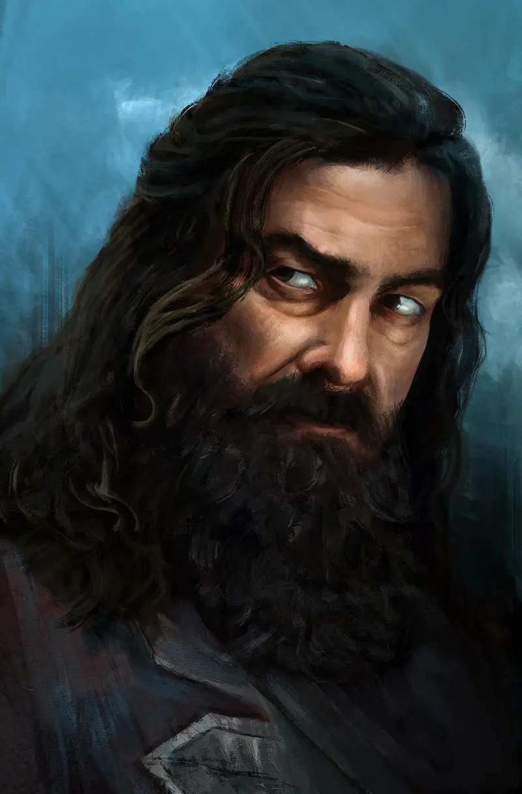
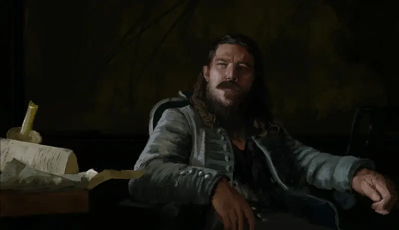
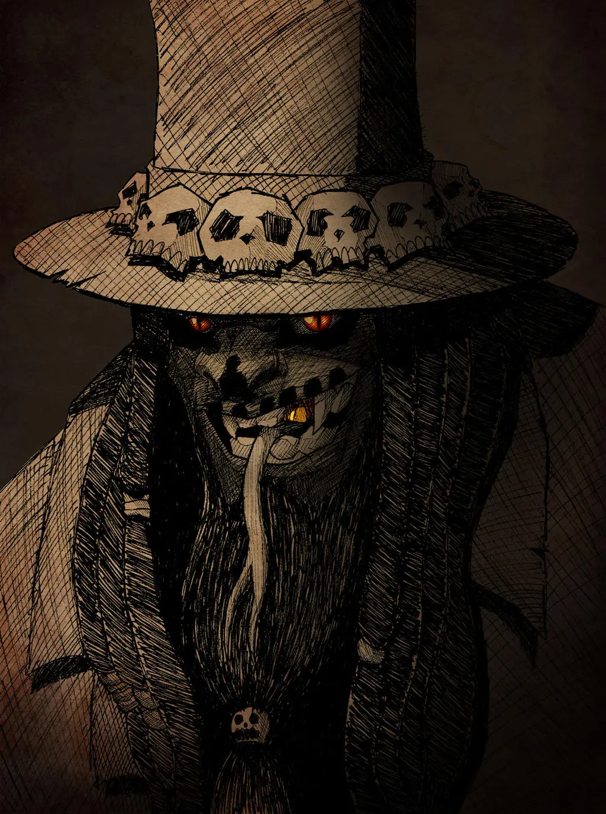
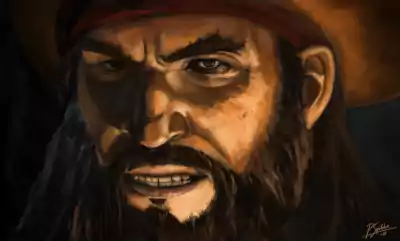
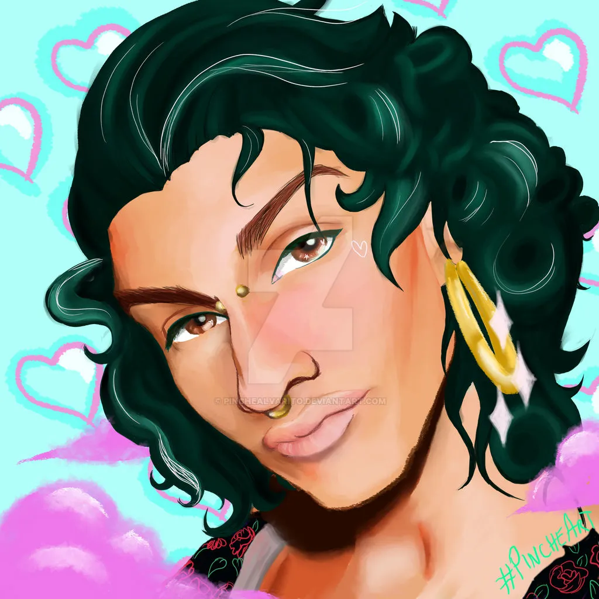

# Quién es quién en el Caribe

En estas páginas encontrarás a la gente más importante de los relatos salvajes de ¡Arrr! Cthulhu. Todos estos PNJ habitan este Caribe de los Mitos y son fuerzas capaces de cambiar la historia. Eres libre de hacer con ellos lo que quieras y cambiar los detalles que no te gusten.

Aquí podrás encontrar heroínas y campeonas del bien como Mary Read o villanos que supuran maldad como Edward Teach o Hernando de Villalba. Pero también encontrarás gente normal como Isadora que solo quiere vivir tranquila en su biblioteca u Onofre que busca volver a casa.

Las sugerencias de interpretación están pensadas para ayudarte a darles carácter, pero recuerda que solo son sugerencias.

\sp

\sinc

## Mary Read (comodín)

\conc

Mary Read es la única que pone en serios problemas a la Orden. Es lo que nos separa del Armagedón primigenio que busca Villalba. Y si ella cae, caemos todos. Sus enemigos son muchos, sus aliados pocos y su tarea es una terrible carga.

Ahora mismo sabe que sola no podrá triunfar y necesita encontrar a adalides del bien que la ayudan. Puede que sus visiones le muestren un grupo de parias en su momento más bajo que pueda ayudarla.

Mary es una diestra luchadora, tienes estudios y cultura, de hecho, escribe para la VLH y tiene conocimientos de los mitos y maneja algo la magia. Y no hemos de olvidarnos de la bendición/maldición familiar de las visiones proféticas. Pero realmente el verdadero fuerte de Mary es que es una líder nata. Sabe motivarlos y saca a la su tripulación lo mejor de ellos mismos. Su gente la seguiría al infierno sin pensárselo y dándolo todo sin excusas y sin dudas.

* **Atributos:** Agilidad d10, Astucia d10, Espíritu d10, Fuerza d8, Vigor d10
* **Habilidades:** Atletismo d8, Disparar d10, Humanidades d6, Idioma criollo d8, Idioma nativo d8, Intimidar d8, Latrocinio d8, Mitos de Cthulhu d8, Notar d12, Pelear d12, Persuadir d10, Navegar d8, Sigilo d8, Supervivencia d10, Tácticas d6
* **Paso:** 6; **Parada:** 10(2); **Dureza:** 8(1)
* **Desventajas:** Enemigo (Mayor, Hernando Villalba y la Orden del Gran Cthulhu), Heroico, Buscado (Mayor, por piratería)
* **Ventajas:** Bloqueo, Bloqueo mejorado, Contrataque, Fervor, Mando, ¡Mantened la formación!, Manos Firmes, Líder Nato, Nuevos Poderes, Trasfondo Arcano (Hechicería primigenia)

\sp

* **Capacidades especiales:**
    * **El don de Casandra:** Las mujeres de la familia de su madre tienen el poder de ver el futuro. No es algo que controle, son flashes que vienen de vez en cuando.
    * **Hechizos:** 10 PP, Canto de Babalú Ayé, Vibración dimensional
    * **Rituales:** Brindar por el mar, Silbar al viento
* **Equipo:** Sable de abordaje (FUE+d6), Protecciones de cuero +1, 2 Pistolas de chispas cargadas

**Sugerencia de interpretación:** Eres una líder nata. Eres tremendamente decidida y carismática y muy muy intensa. Todo lo que dices parece un discurso inspirador. Sabes hacer una entrada y, sobre todo, una salida dramática en el momento justo.

\sp

\sinc

## Edward Teach alias Barbanegra (comodín)

\conc

La leyenda de Edward Teach es de sobra conocida, sanguinario, temible y osado. Pero hoy en día no es más que el perro faldero de la Orden. La libertad de la que tanto se jactaba hace solo unos años ya no existe, solo puede obedecer y agachar la cabeza.

La Orden tiene su corazón y si les desafía o les desobedece morirá de la forma más horrible. Si alguien le ofrece una vía de escape seguro que para de pelear y estará encantado de escuchar.

* **Atributos:** Agilidad d8, Astucia d10, Espíritu d8, Fuerza d12, Vigor d12
* **Habilidades:** Atletismo d10, Disparar d10, Humanidades d4, Idioma criollo d8, Idioma nativo d8, Intimidar d12, Latrocinio d6, Mitos de Cthulhu d8, Notar d10, Pelear d10, Persuadir d6, Reparar d6, Sigilo d6, Supervivencia d8, Tácticas d8
* **Paso:** 6; **Parada:** 8(1); **Dureza:** 9(1)
* **Desventajas:** Buscado (Mayor, por piratería), Juramente (Mayor, servir a la Orden durante 10 años)
* **Ventajas:** Amenazador, Berserker, Bloqueo, Manos Firmes, Nuevos poderes, Rápido, Reflejos de Combate, Trasfondo Arcano (Hechicería primigenia)
* **Capacidades especiales:**
  * **Hechizos:** 8 PP, Canto de Babalú Ayé, Vibración dimensional
  * **Rituales:** Silbar al viento, Cegar el mascarón de proa, Brindar por el mar, El clavo en la calavera, Canción pirata, Astillas en la planta de los pies

\sp

* **Capacidades especiales:**
  * **Sin corazón:** Al son de cantos de «kalima, kalima, …», el propio Villalba extrajo el corazón de Teach y con él su alma. Mientras Villalba tenga su corazón, Teach está obligado a obedecerle o podría matarle simplemente estrujando su corazón con sus manos. Como ventajas, Edward tiene Resistencia Arcana Mejorada y los hechizos de Marioneta y Manipulación de recuerdos fallan siempre. Si se lanza hechizos de detección mágica se verá un gran agujero negro donde debería estar su corazón. Una tirada de Mitos permitirá saber que le han quitado el corazón y los detalles de esta maldición.
* **Equipo:** Cimitarra (FUE+d8), Protecciones de cuero +1, 2 Pistolas de chispas cargadas

**Sugerencia de interpretación:** Eres Edward Teach alias Barbanegra, la leyenda pirata, el terror de los mares del Caribe. Nada ni nadie puede detenerte, ni la muerte, y ahora cuentas con poderosos aliados de otras dimensiones. La arrogancia no es tal si respaldas tus palabras con hechos. Eres el mejor y punto. Si algo se interpone en tu camino, lo eliminas. Que digo lo eliminas, lo destruyes y lo destierras alguna dimensión perdida en el tiempo y el espacio.

\sp

\sinc

## Hernando de Villalba (comodín)

\conc

Hernando de Villalba es la gran némesis de ¡Arrr! Cthulhu. Tremendamente poderoso a nivel personal y mágico y tremendamente poderoso a nivel político y social. Hace y deshace a su gusto en el Caribe controlado por los españoles y su inmensa fortuna y las almas que puede comprar con ella le permiten tener mucha influencia en la política de Jamaica y Saint-Domingue.

Solo hay un sitio a donde su poder no llega, las cubiertas de los barcos piratas. Frustran sus planes, roban sus riquezas y sacan a la luz sus secretos. Y los peores son esos patéticos de la Hermandad del Sargazo que quieren evitar su plan maestro para ser inmortal.

La gran obsesión de Hernando es la inmortalidad y sabe que solo el Cthulhu en su infinito poder puede otorgársela, así que está dispuesto a buscar su ciudad y a despertarlo de su eterno sueño para conseguirla.

Hernando de Villalba tiene más de 100 años y solo aparenta tener unos 60 años. Todo es debido a la sangre de profundo que corre por sus venas. Puede que llegue a los 130 o 140 años. Se le empieza a acabar el tiempo en este mundo y esto es algo que le preocupa. Menos mal que sus predicciones y suposiciones sobre Cthulhu le darán la inmortalidad que tanto busca.

* **Atributos:** Agilidad d6, Astucia d10, Espíritu d12, Fuerza d6, Vigor d6
* **Habilidades:** Ciencias d6, Disparar d6, Humanidades d10, Idioma nativo d10, Idioma cthulhunés d12, Intimidar d8, Mitos de Cthulhu d12+2, Notar d10, Pelear d6, Persuadir d8, Tácticas d8
* **Paso:** 6; **Parada:** 5; **Dureza:** 5
* **Desventajas:** Exceso de confianza, Megalomanía (mayor), Paranoia (mayor), Fobia(mayor, miedo al fuego), La llamada de Cthulhu (menor)
* **Ventajas:** Alcurnia, Asquerosamente rico, Seguidores, Resistencia arcana, Nuevos Poderes x6, Puntos de Poder x3, Fervor, Recuperación Rápida, Canalización, Trasfondo Arcano (Hechicería primigenia)

\sp

* **Capacidades especiales:**
    * **Hechizos:** 48 PP, Augurios del soñador, Sombras lacerantes, Invocar los apéndices de Dygra, Emponzoñar arma, Expulsar ente, Vibración temporal, Perdido en el tiempo, Invocar vampiro estelar, Círculo de invocación, Hidromancia, Incineración de Cthugha, Nubes de Ithaqua
    * **Longevidad:** Gracia a su sangre profunda puede llegar a vivir hasta 130 o 140 años.
    * **Semiacuáticos:** Paso nadando 4. Pueden respirar bajo el agua sin problemas durante media hora y no se ve afectado por la presión.
    * **Rituales:** Bendecir un arma, El clavo en la calavera, Cornucopia, Consagrar persona, astillas en las plantas de los pies, Adivinación con Mandiocas
    * **Biblioteca de los Mitos:** Tiene una buena biblioteca de los Mitos en su mansión que le otorga un +3 a las tiradas de Mitos si puede consultarla.
* **Equipo:** Amuleto con símbolo arcano (+1 tiradas enfrentadas de defensa de hechizos), Llave de plata, Arma lanzarrayos yithiana

**Sugerencia de interpretación:** Eres un ser causidivino que lleva más de un siglo entre los simples mortales y si tus planes se cumplen, te convertirás en un dios viviente, así que es normal que consideres como hormigas a todos los que te rodean. Sus vidas son insignificantes para ti, meras herramientas, y no hay problemas en acabar con las vidas de los que te sirven, si sirve a tu causa. Si alto te irrita es que algo no salga como quieres y, en ese caso, alguien tiene que pagarlo.

\sp

\sinc

## César (comodín)

\conc

Cesar es el lugarteniente de Barbanegra y a la vez el mejor recurso de la Hermandad del Sargazo. César lleva desde que fue reclutado por Barbanegra en los Cayos de Florida, siendo un espía para la Hermandad.

Se cuenta que era el jefe de una tribu de África Occidental que fue engañado, secuestrado y llevado al Caribe en un barco esclavista. Se granjeó la amistad de uno de los marineros y junto a sus compañeros y con la ayuda del marinero escaparon del barco.

Durante una temporada se dedicaron a la piratería en los cayos de Florida. Se hacían pasar por náufragos y cuando les subían al barco lo tomaban y lo robaban. Se llevaba a los prisioneros ricos a una isla desierta donde pedía rescate. Tras amasar una buena suma de dinero se compró un barco con el que se dedicó a atacar barcos en alta mar.

Amaso una gran fortuna que se dice enterró en Cayo Elliot, pero solo él sabe la ubicación exacta. Su gran fama terminó atrayendo a Barbanegra que le ofreció un puesto como su lugarteniente.

Lo que nadie sabe es que el marinero era un hermano del Sargazo infiltrado en el comercio de esclavos. Su misión era avisar de los movimientos de la Orden dentro del tráfico de seres humanos.

Este marinero le ayudo a cambio de que algún día le devolviera el favor. Ese favor se lo devolvió el día que Barbanegra firmo su pacto con la Orden y Cesar prometió informar a la Hermandad. Lleva siendo un confidente desde hace 4 años y aunque se juega la vida, su información ha servido para truncar los planes de la RCPC y la Orden y salvar muchas vidas.

Si bien empezó para devolver la deuda de vida que tenía con la Hermandad, las cosas que ha visto hacer a Barbanegra por orden de la Orden han hecho que se plantee su forma de vida. Si bien no es un hermano oficialmente, ya que no ha jurado, cree totalmente en la causa de la Hermandad.

* **Atributos:** Agilidad d8, Astucia d8, Espíritu d8, Fuerza d10, Vigor d10

\sp

* **Habilidades:** Atletismo d8, Disparar d10, Idioma criollo d8, Idioma inglés d6, Intimidar d8, Latrocinio d8, Mitos de Cthulhu d6, Notar d10, Pelear d10, Navegar d8, Reparar d6, Supervivencia d6
* **Paso:** 6; **Parada:** 8(1); **Dureza:** 8(1)
* **Desventajas:** Buscado (Mayor, por piratería)
* **Ventajas:** Barrido, Bloqueo, Esquiva, Cofrade de la Hermandad del sargazo, Rápido, Riqueza, Trasfondo Arcano (Hechicería primigenia)
* **Capacidades especiales:**
    * **Lucha con machete:** Su habilidad de pelear cuando blande un machete o un estoque es de d12 y su daño es de +1.
    * **Rituales:** Silbar al viento, Cegar el mascarón de proa, Brindar por el mar, Cornucopia
* **Equipo:** Machete (FUE+d6+1), Protecciones de cuero +1, 4 Pistolas de chispas cargadas

**Sugerencia de interpretación:** Eres muy tranquilo, callado y observador. Lo tuyo es quedarte detrás de Barbanegra mientras hace su numerito y ver como reacciona la gente. Luego te acercas y le cuentas lo que has visto. No eres de grandes discursos, sino de charlas privadas tanto para animar como para intimidar a tus camaradas o tus rivales.

\sp

\sinc

## Hermanos García

\conc

La familia García es una rica poderosa familia de armadores de Santo Domingo. Se dedican a flotar barcos comerciales, principalmente para la RCPC. Su padre Eusebio les lego una gran fortuna y un gran poder. Los secretos familiares están saliendo a la luz y parece que tendrán consecuencias para todos los hermanos García.

### Antonio García (comodín)

Antonio García es el primogénito de la familia García. Es el dueño de la compañía desde hace un par de años. No es un gran comerciante, pero la situación en la que su padre dejo la empresa, sus excelentes subordinados y el apoyo de la RCPC hace que la empresa vaya muy bien sin que él tenga que implicarse mucho.

Su principal debilidad es el juego. Es un ludópata de manual con la suerte de que la empresa que dirige genera más dinero del que puede gastarse. Además, es tremendamente creyente y el juego es pecado. Es por ello que se disfraza para acudir sin guardaespaldas a las partidas de naipes que suele haber en las tabernas de baja estofa de Santo Domingo.

### Salvador García (comodín)

Salvador siempre fue un seguidor, no un líder. Su hermano Antonio era el líder. Ahora que es el jefe de la familia se le hace todo cuesta arriba. Todo le agobia, le cuesta tomar decisiones y duerme por las noches pensando en que sus decisiones afectarán al futuro de su familia. Cuando era el segundón era afable y dicharachero, ahora su carácter se ha agriado. A prender a ser el líder o seguramente terminará mal.

* **Atributos:** Agilidad d6, Astucia d8, Espíritu d6, Fuerza d6, Vigor d4
* **Habilidades:** Atletismo d4, Humanidades d8, Idioma nativo d8, Idioma Criollo d6, Intimidar d6, Pelear d4, Persuadir d6

\sp

* **Paso:** 6; **Parada:** 4; **Dureza:** 4
* **Desventajas:** Cauto, Suspicaz (menor)
* **Ventajas:** Alcurnia, Asquerosamente Rico, Trasfondo Arcano (Hechicería primigenia)

**Sugerencia de interpretación:** No pares de resoplar, todo es una difícil decisión. Piénsatelo todo mucho y dale muchas vueltas. Tus reacciones son muchas veces excesivas y para imponerte intentas intimidar a tu objetivo con tus recursos y tus contactos.

### Héctor García (comodín)

El padre Héctor García es el hijo menor de Eusebio García. Cuando se fue haciendo mayor, desarrolló una tremenda «espiritualidad» que le llevo a estudiar teología con los jesuitas para terminar siendo misionero en la misión de San Cristóbal. La verdad es que fue su forma de escapar de la casa familiar y de la larga y abusiva mano de su padre y de la RCPC.

No es un santo ni especialmente religioso, pero tiene más moral y ética que el resto de la familia y según fue enterándose de los secretos familiares y sus tejemanejes con la RCPC prefirió desvincularse. La forma que vio fue hacerse sacerdote y para alejarse todavía más se hizo misionero.

Su única conexión su familia que le queda es el tatuaje y cuando su hermano Antonio le pidió una copia se sintió liberado. Ya no quedaba ningún vínculo importante con su familia, excepto su apellido y ya no lo usaba. Simplemente era el padre Héctor para la gente de la misión.

* **Atributos:** Agilidad d6, Astucia d6, Espíritu d6, Fuerza d4, Vigor d6
* **Habilidades:** Atletismo d4, Ciencias d4, Humanidades d6, Idioma nativo d6, Idioma Criollo d6, Idioma taíno d6, Medicina d6, Pelear d6, Persuadir d6

\sp

* **Paso:** 6; **Parada:** 5; **Dureza:** 5
* **Desventajas:** Código de honor (Jesuitas)
* **Ventajas:** Alcurnia, Trasfondo Arcano (Hechicería primigenia)
* **Capacidades especiales:**
    * **Rituales:** Bendecir un arma, Consagrar persona, Bendecir la cosecha

**Sugerencia de interpretación:** La jungla y su gente te dan paz. No eres especialmente religioso, pero ayudar a la gente en las misiones te tiene entretenido. Muchas veces te inventas los sermones y las oraciones, pero la verdad es que a ninguno de tus feligreses le importa. Nadie quería venir a la misión de San Cristóbal, así que viniste tú para alejarte de tu familia.

### María Isabel García (comodín)

María Isabel es una gran combatiente, diestra, fuerte, rápida y resistente. Con un gran don para la táctica y las emboscadas. Sus puntos débiles son los estudios que casi no tiene, conoce las letras y los números, pero de forma muy básica.

El otro punto débil es que tiene cero capacidades sociales. No sabe moverse entre sus congéneres y muchas de las aptitudes sociales básicas se le escapan debido a que en su niñez no pudo ponerlas en práctica.

* **Atributos:** Agilidad d12, Astucia d6, Espíritu d6, Fuerza d10, Vigor d12
* **Habilidades:** Atletismo d12, Cabalgar d10, Disparar d10, Idioma nativo d6, Idioma Criollo d6, Pelear d12, Sigilo d12, Tácticas d10
* **Paso:** 6; **Parada:** 9 (1); **Dureza:** 9 (1)
* **Desventajas:** Secreto (Es la hija ilegítima de Eusebio García), Secreto (Es la asesina de Antonio García)

\sp

* **Ventajas:** Ambidextro, Ataque repentino, Con un par de, Bloqueo, Frenesí, Parkour, Trasfondo Arcano (Hechicería primigenia)
* **Equipo:** Sable de abordaje (FUE+d6), Hacha de abordaje (FUE+d6), Protecciones de cuero +1, Granadas (3), Petardos (10)

**Sugerencia de interpretación:** No pillas ni las ironías, ni lo dobles sentidos, ni nada por el estilo. Eres bastante literal interpretando los comentarios de la gente de tu alrededor.

\sp

\sinc

## Avatares

\conc

### Avatares de Nyarlathotep

Nyarlathotep es el dios de las mil máscaras y desde luego un par de ellas rondan por el Caribe llevando a cabo sus extraños planes metafísicos. Aquí te mostramos dos de ellas, el barón Samedí que es un avatar clásico y el Abandonado que es una mezcla entre alivio cómico y genio de los deseos.

Siéntete libre de usar otras máscaras. Tiene muchas de origen africano, europeo o maya/azteca que podrían cuadrar en el Caribe. O, si te cuadra, mete avatares de origen egipcio que le den un toque totalmente exótico.

> Cuando aparece un avatar de Nyarlathotep, se puede hacer una tirada de Notar para escuchar un extraño sonido de flautas. Esas flautas son de los dioses menores servidores que tocan para Azathoth y significa que Nyarlathotep viene de visitar a Azathoth. Esos sonidos de flauta no provocan terror, pero generan una sensación desagradable y alerta a los que los escuchan.

\sc

#### Barón Samedí (comodín)

El Barón es un avatar de Nyarlathotep. Es un hombre negro con tatuajes de esqueleto por todo el cuerpo que lleva un taparrabos blanco y un sombrero negro. Para pasar desapercibido suele llevar un gran abrigo negro que le cubre entero.

El Barón solo aparece durante el Fèt Gede, el Día de los Muertos en Haití y se dedica a sembrar el caos en las calles y cementerios entre los creyentes del vudú. 

\sp

Durante esta festividad es el momento en que cualquier persona puede interactuar con el propio Nyarlathotep en su avatar del Barón si es capaz de encontrarlo entre las multitudes que festejan el Fèt Gede. Recuerda es un dios caótico y maligno y seguramente saldrás perdiendo en el acuerdo.

El Barón no tiene poderes mágicos como tal en esta forma, no puede hacer prodigios mágicos. Sus poderes divinos están ligados a los tratos que haga. No puede hacer aparecer agua y comida de la nada a no ser que haya llegado a un acuerdo con un náufrago en una isla desierta.

* **Atributos:** Agilidad d10, Astucia d12, Espíritu d12, Fuerza d12, Vigor d10
* **Habilidades:** Humanidades d12, Pelear d10, Notar d10, Sigilo d10, el resto de d6.
* **Paso:** 7; **Parada:** 8; **Dureza:** 7
* **Capacidades especiales:**
    * **Mitos de Cthulhu:** No necesita hacer tiradas de Mitos, lo sabe literalmente todo de los Mitos y nunca falla las tiradas para saber cosas de los Mitos.
    * **Código de honor:** Está ligado mágicamente a no poder romper las promesas y los pactos que haga o los contratos que firme. Si bien, siempre buscará un agujero legal porque el que romper los pactos o sacarles más partido del que a priori se firmó.
    * **Invulnerable:** Solo las armas de alta tecnología y la magia puede dañarle.
    * **Inmortal:** Si muere volverá a la vida a la mañana siguiente.
    * **Vinculado al Fèt Gede:** Solo puede aparecerse durante las festividades del Fèt Gede, allá donde se celebre. También puede aparecer para llevarse el alma de alguna persona importante y creyente en él o para cumplir o hacer cumplir los tratos que haya hecho.
* **TPC:** 1d8, solo tras mostrar su verdadera presencia.

**Sugerencia de interpretación:** Eres el caos mismo, muchas de tus acciones no tienen por qué tener ningún sentido, pero todo cambia cuando alguien te ofrece un trato. En ese momento te transformas en una especie de genio maligno de los deseos. Tu objetivo es buscar la argucia para saltarte el trato con el mortal y escaparte de hacer tu parte o cumplirla tan retorcidamente que sea un problema más que un beneficio.

\sp

#### Totep

Totep es un avatar de Nyarlathotep. Se presenta como un marinero que naufragó en el mar (o abandonaron a su suerte) y ha estado años perdido en un islote. Está escuálido, con una gran barba, el pelo largo y sucio y ropa andrajosa. Está un poco ido y reacciona raro a cosas y situaciones normales, pero claro, lleva años solo en esa isla.

Totep, como avatar de Nyarlathotep, va a funcionar como un dios engañoso y farsante, al estilo del Coyote de los nativos norteamericanos o de Anansi «la araña» de las leyendas centroafricanas y caribeñas. Será un dios que jugará con tu mesa, metiéndoles a veces en problemas locos e inocentes y otras veces en auténticas bromas asesinas. Pero siempre aprenderán una lección valiosa al salir airosos de ellas.

Al ser casi todopoderoso, puede aparecerse en cualquier parte en cualquier momento. Puede aparecer como un vendedor de frutas del mercado, como un camarero en la fiesta de disfraces del gobernador o como el contramaestre de un barco pirata en mitad del mar.

* **Atributos:** Agilidad d8, Astucia d8, Espíritu d8, Fuerza d8, Vigor d8
* **Habilidades:** Todas a d6, Mitos de Cthulhu d12
* **Paso:** 5; **Parada:** 5; **Dureza:** 6
* **Ventajas:** Muy afortunado
* **Capacidades especiales:**
  * **Debilidad Ron:** Su principal debilidad es el ron. No puede resistirse a él y se le puede emborrachar. Tampoco puede lanzar hechizos estando borracho.
  * **Mitos de Cthulhu:** No necesita hacer tiradas de Mitos, lo sabe literalmente todo de los Mitos y nunca falla las tiradas para saber cosas de los Mitos. Sí debe tirar Mitos para el lanzamiento de hechizos.
  * **Código de honor:** Está ligado mágicamente a no poder romper las promesas y los pactos que haga o los contratos que firme. Si bien, siempre buscará un agujero legal porque el que romper los pactos o sacarles más partido del que a priori se firmó.

\sp

* **Capacidades especiales:**
  * **Hechizos y rituales:** Sabe todos los hechizos y rituales y cada turno tiene 20 PP para gastar como desee. La duración es indefinida y el tiempo de lanzamiento es inmediato. El problema es que debe lanzar sus hechizos a escondidas, si alguien le ve lanzar un hechizo no funcionará.
  * **Debilidad Seducción:** Otra debilidad tiene es que le es imposible resistirse a los avances amorosos y sexuales vengan del ser o entidad de la que vengan. Mediante tiradas de Persuadir de carácter erótico y/o amoroso (para el ser que las realiza) enfrentadas a su Espíritu se puede hacer que haga cosas que no quiera como firmar contratos, hacer promesas, …
  * **Inmortal:** Si muere volverá a la vida a la mañana siguiente.

**Sugerencia de interpretación:** Eres un extraño dios en un cuerpo mortal. Todo es extraño y divertido y ser Totep son unas vacaciones en tus obligaciones como sirviente de Azathoth. Estás aquí para divertirte y por Hastur que te vas a divertir. Sonríe mucho, cuenta chistes y prueba de todo.

\sc

### Avatares de Shub-Niggurath

#### La llorona

La llorona es mito que lleva circulando por el Caribe desde tiempos ancestrales. 

En líneas generales es el fantasma de una mujer que perdió a sus hijos. Eso provoco que perdiera la cordura y ahora los busca entre lloros por los campos y caminos. En algunas versiones es ella misma quien asesino a sus hijos ahogándolos.

La historia más extendida es que era una princesa taína que se enamoró de un conquistador español con el que tuvo un hijo. Aquí la historia se bifurca; él la abandona y mata a su hijo mestizo. En otras versiones, ella asesina a su hijo en venganza.

Sin embargo, la realidad dista mucho de la ficción. La llorona es un avatar de Shub-Niggurath, la perversa deidad de la fertilidad, la madre de monstruos que llora por su prole asesinada por héroes y dioses.

Como avatar de la deidad de la fertilidad buscará acabar con las personas que buscan matar a su camada.

\sp

El objetivo de su apariencia es asustar a los débiles de espíritu con sus lloros y su aspecto fantasmal y atraer a su trampa con sus lloros y suplicas a los valerosos para acabar con sus vidas. 

Normalmente, se aparece como una mujer muy demacrada y pálida, con ropajes blancos y desgastados que solloza mientras se tapa la cara con las manos. Cuando te acercas es cuando se quita las manos de la cara y ves su verdadera cara, una masa informe de tentáculos acabados en ojos y bocas de dientes afiladísimos.

* **Atributos:** Agilidad d10, Astucia d6, Espíritu d8, Fuerza d12, Vigor d12
* **Habilidades:** Pelear d10, Interpretar d12
* **Paso:** 6; **Parada:** 7; **Dureza:** 8
* **Ventajas:** Frenesí Mejorado.
* **Capacidades especiales:**
    * **Mordisco:** FUE+d6. Puede lanzar 2 mordiscos por turno sin penalizaciones.
    * **Fantasmal:** La llorona puede hacerse inmaterial a voluntad y solo los ataques mágicos pueden dañarla.
    * **Flotar:** La llorona puede flotar, de forma que no existe terrenos difíciles para ella.
* **TPC:** 1d8, solo tras mostrar su verdadera cara.

**Sugerencia de interpretación:** Llora por tus hijos muertos.

\sp

\sinc

## Johanna Ribeiro (comodín)

\conc

Johanna Ribeiro es una joven y comprometida dramaturga que hace lo que sea por su arte, el teatro. Si bien es una niña rica que despilfarra el dinero de sus padres, una próspera familia de comerciantes de origen portugués/brasileño, en sus proyectos teatrales es muy buena e innovadora. 

Podría triunfar con sus obras en Londres, París, Madrid o Roma si no fuera porque está en la otra punta del mundo y es una mujer, mestiza y joven. Es una apasionada de su trabajo y cuando se centra en algo no pierde el foco. De hecho, si sus sirvientes no le trajeran comida, se tiraría días sin comer mientras escribe sus obras.

Su última obra la tiene obsesionada y según cuenta se la susurra en sueños una extraña voz. En realidad son las propias ondas mentales del gran Cthulhu que afectan más a los artistas y personas con sensibilidad artística.

* **Atributos:** Agilidad d6, Astucia d8, Espíritu d10, Fuerza d6, Vigor d6
* **Habilidades:** Atletismo d8, Humanidades d12, Idioma portugués d8, Idioma criollo d8, Idioma Inglés d6, Interpretar d12, Pelear d8, Persuadir d10
* **Paso:** 6; **Parada:** 6; **Dureza:** 5
* **Desventajas:** La llamada de Cthulhu
* **Ventajas:** Atractivo, Rico, Trasfondo Arcano (Hechicería primigenia)
* **Capacidades especiales:**
  * **Esgrima escénica:** Un nivel extra a Pelear al hacer filigranas y trucos con armas de filo.

\sp

* **Equipo:** Ropas elegantes y a la última moda, papel, tinta y pluma para escribir o dibujar escenas.

**Sugerencia de interpretación:** Johanna es una apasionada de su arte y lo vive siempre al extremo. Cuando prepara una obra, solo existe esa obra. Buscando inspiración para nuevas obras, no para de hacer preguntas a todo el mundo sobre su vida y aventuras hasta ser muy entrometida e impertinente.

\sinc

## Maestre Arturo Gandía (comodín)

\conc

Arturo Gandía es jefe del puerto en La Habana desde hace muchos años. A base de hacer favores a los altos cargos de La Habana consiguió la jefatura del puerto. Sus conocimientos navales son casi nulos, aunque se mueve como un pez en las aguas de la burocracia.

Arturo es bastante laxo en el cumplimiento de su trabajo, por no decir que es fácilmente sobornable, por no decir corrupto. Pero es lo suficientemente listo para redistribuir los sobornos entre superiores y subordinados, de forma que todos están contentos y todos miran hacia otro lado.

Permite, tras cobrar una buena mordida, introducir en La Habana todo tipo de productos e incluso puede conseguirte un buen comprador al que también le cobrará una «comisión». Todo ese dinero que gana lo gasta sin problemas en buenas ropas, buena comida y buena bebida para él y su familia.

Últimamente, se ha estado pasando bastante con el ron, pero todavía no está afectando a su vida profesional y familiar. Está a un par de jarras de grog de empezar a tener problema de alcoholismo.

\sp

\sinc

\conc

* **Atributos:** Agilidad d4, Astucia d6, Espíritu d6, Fuerza d6, Vigor d6
* **Habilidades:** Idioma(todos) d6, Intimidar d8, Notar d10, Pelea d6, Persuadir d8
* **Paso:** 6; **Parada:** 5; **Dureza:** 5
* **Desventajas:** Habito (Mayor, Alcoholismo)
* **Ventajas:** Trasfondo Arcano (Hechicería primigenia), Contactos (Altas esferas de La Habana).
* **Equipo:** Daga (FUE+d4), ropa de calidad, pero fuera de la moda y muy ostentosa.

**Sugerencia de interpretación:** Seguramente vayas un poco achispado si estás fuera del trabajo. Si estás trabajando no dejarás de lanzar indirectas sobre que por una pequeña propina alguno de los problemas que presenta tu barco y su mercancía podrían obviarse. Si alguien te amenaza de alguna manera, tratas de intimidarle con los contactos que tienes entre los altos cargos.

\sp

\sinc

## Antoine Delapore (comodín)

\conc

Antoine nació en París hace más de 60 años. Su familia tenía una imprenta y aprendió el oficio, pero él quería ser el que escribía las noticias, no solo el que la imprimía, así que empezó a enviar noticias y reportajes a diferentes periódicos franceses con más o menos éxito. Pronto se metió en problemas con los poderes establecidos y tuvo que escapar de París.

Una serie de aventuras de las que fanfarronea cuando va lleva algunas copas de más y que rayan la piratería le acabaron llevando a La Habana. Allí consiguió diferentes trabajos hasta que compro a crédito una imprenta vieja con la que saco el primer número de VLH en 1708. Desde entonces su único trabajo ha sido recabar historias rocambolescas y publicar en su diario.

No es fácil de amedrentar, ha sufrido amenazas, ha sobrevivido a intentos de asesinato y se ha batido en duelo muchas veces por defender su publicación. Y ahora en su senectud está delegando su saber hacer en Ernesto, su sobrino.

* **Atributos:** Agilidad d4, Astucia d10, Espíritu d8, Fuerza d6, Vigor d4
* **Habilidades:** Atletismo d4, Disparar d8, Humanidades d8, Idioma nativo d10, Idioma castellano d10, Idioma criollo d8, Investigar d12, Mitos de Cthulhu d6, Notar d10, Pelear d8, Persuadir d8, Provocar d8
* **Paso:** 5; **Parada:** 6; **Dureza:** 4
* **Desventajas:** Anciano
* **Ventajas:** Cofrade de la Hermandad del sargazo, Hombre de recursos, Trasfondo Arcano (Hechicería primigenia)

**Sugerencia de interpretación:** Eres un viejo periodista y tu olfato para las noticias está superafinado y en cuanto hueles una exclusiva eres como un sabueso que no suelta su presa. Siempre estás preguntando, siempre estás indagando en busca la próxima portada.

\sp

\sinc

## Ernesto Delapore (comodín)

\conc

Ernesto Delapore es el sobrino de Antoine Delapore. La imprenta de sus padres quebró en París y emigro a La Habana con su tío. Lleva entre papel, tinta e imprentas desde pequeño y sabe como llevar una imprenta. Es mucho más práctico y mundano que su tío, no tiene los ideales de su tío. Solo quiere dinero para vivir bien e ir de fiesta.

Su tío quiere que le releve cuando se retire, pero seguramente cuando eso pase venda el periódico. De hecho, ha recibido ofertas de la RCPC y su rama de propaganda a escondidas para vender el periódico. Se lo están tratando de ganar consiguiéndole acceso a los eventos y fiestas más importantes de La Habana.

A la hora de la verdad veremos si ganan los principios de su tío o el dinero de la RCPC.

* **Atributos:** Agilidad d8, Astucia d6, Espíritu d8, Fuerza d6, Vigor d6
* **Habilidades:** Humanidades d6, Idioma nativo d6, Idioma Español d6, Latrocinio d6, Pelear d6, Persuadir d10, Reparar d8
* **Paso:** 6; **Parada:** 5; **Dureza:** 5
* **Desventajas:** Impulsivo
* **Ventajas:** Carismático
* **Equipo:** Daga (FUE+d4), ropas elegantes y a la última moda.

**Sugerencia de interpretación:** Ernesto es un fiestero, pero sobre todo un feriante, un embaucador, un trilero. No deja de adularte con elogios, a veces incluso exagerados, pero muy acertados, hasta que te ve maduro y te lanza el sablazo pidiéndote dinero o que le hagas un favor que nunca te va a devolver.

\sp

\sinc

## Fabio Castelli (comodín)

\conc

Fabio Castelli es un aventurero veneciano con muy escasa moral y ética. Se dedica a cazar críptidos de todo Europa y Norte de África y venderlos al mejor postor a espectáculos circenses, paradas de monstruos o colecciones privadas. Para él, estos seres son solo meros animales que le permiten conseguir buenas sumas de dinero. No le importa ni su seguridad, ni su salud y bienestar, ni su supervivencia como especie.

Fabio puede ser el mejor tirador que vaya a conocer tu mesa. Si apareces en su punto de mira, tus posibilidades de sobrevivir bajan casi a cero. También es un trampero experto y un buen rastreador. Evitará cualquier enfrentamiento cuerpo a cuerpo, lo suyo son los disparos a larga distancia.

Siempre lleva su mosquete personalizado y ocultas entre sus ropajes 2 pistolas de chispa cargadas y preparadas. Está tan convencido de sus capacidades que siempre hace tiros apuntados, sobre todo a la cabeza. Si falla un tiro estrepitosamente, deberías gastar un beni para tratar de solucionarlo. Su frágil ego no puede soportar este tipo de fallos.

* **Atributos:** Agilidad d10, Astucia d8, Espíritu d6, Fuerza d6, Vigor d6
* **Habilidades:** Atletismo d6, Disparar d12, Idioma italiano d10, Idiomas d6 (Inglés, francés, castellano), Notar d10, Sigilo d10, Pelear d4, Persuadir d10, Supervivencia d10
* **Paso:** 6; **Parada:** 4; **Dureza:** 5
* **Desventajas:** Megalomanía (Mayor), Enemigo (Menor, acreedores)
* **Ventajas:** Arma distintiva mejorada (Mosquete), Muy atractivo, Puntería, Temple, Trasfondo Arcano (Hechicería primigenia)
* **Equipo:**Mosquete (10/20/40, 2d8, Recarga 3) y 2 pistolas de chispa (5/10/20, 2d6+1, Recarga 3)

**Sugerencia de interpretación:** Eres una de las personas más egocéntricas que existe, solo hablas de ti mismo e incluso interrumpes las conversaciones de otros para hablar de ti.

\sp

Reconduces las conversaciones para poder meter tus anécdotas de caza que contienen tremendas exageraciones. Piensa en Gastón de la Bella y la Bestia y ese es Fabio. También eres italiano, así que déjate llevar por los estereotipos y gesticula mucho.

\sinc

## Aurora y Flora Esteban (comodín)

\conc

Aurora y Flora son un ejemplo perfecto de jóvenes de la alta sociedad de la época. Recibieron una educación clásica para señoritas, literatura, historia, música, etc. y han ido afilando sus dotes sociales en fiestas y reuniones sociales. Saben moverse en sociedad, saben las reglas no escritas y cómo usarlas en su favor. El fracaso de su padre con la flota de la plata supusieron un grave revés en sus aspiraciones sociales, pero van a luchar por volver al lugar que las correspondes.

Estas hermanas se odian y se quieren, todo a la vez, cosas de hermanos. De hecho, no podrían vivir la una sin la otra. No se separan nunca y toman todas las decisiones conjuntamente.

* **Atributos:** Agilidad d6, Astucia d6, Espíritu d8, Fuerza d6, Vigor d6
* **Habilidades:** Humanidades d6, Idioma materno d6, Interpretar d8, Intimidar d8, Notar d8, Pelear d4, Persuadir d8
* **Paso:** 6; **Parada:** 4; **Dureza:** 5
* **Desventajas:** Cauto (deben tomar las decisiones conjuntamente).
* **Ventajas:** Conexiones (Alta sociedad), Alcurnia, Trasfondo Arcano (Hechicería primigenia)

**Sugerencia de interpretación:** Sois bastante clasistas despreciando a las personas que están socialmente por debajo. Pero si hay que enfangarse para encontrar la plata perdida por papa, pues habrá que hacerlo, pero con toda la clase y dignidad que se pueda.

\sp

\sinc

## Michelle LeCourt (comodín)

\conc

Ayodale fue secuestrada en Nigeria junto a su familia y todo su poblado por esclavistas ingleses cuando tenía 16 años. Tras dos meses de travesía en un barco negrero, llego a Kingston donde fue vendida. La familia y los amigos que sobrevivieron al viaje, los perdió cuando la compro una rica dama inglesa como parte de su séquito.

Aprendió a leer inglés como parte de su aprendizaje como ayuda de cámara y siempre que podía practicaba con los libros que tenía sus dueños. Un día encontró una pequeña biblioteca secreta con varios libros de los Mitos de los que empezó a aprender magia primigenia.

Mediante la manipulación de los recuerdos hizo olvidar a toda la casa de que ella y la biblioteca secreta existieran. Así pudo escapar con sus libros de los Mitos a los barrios bajos del puerto de Kingston sin dejar rastro.

Sobrevivió unos años haciendo pequeños conjuros y rituales y con tiradas de tarot. Aprovechando que Ayodale dejo de existir para los únicos que la conocían, se cambió el nombre por el de Michelle LeCourt que le parecía más elegante.

Además, si nadie sabía su nombre verdadero, estaría más protegida contra maldiciones y hechizos malintencionados.

Poco a poco, durante 20 años, se ha ido asociando con diferentes delincuentes hasta montar una importante banda criminal, que también se ha convertido en su familia, donde todos cuidan de todos y nadie es más importante que el resto.

Con los años se ha ido construyendo la imagen de poderosa bruja del vudú que tiene hoy en día.

\sp

La verdad es que Michelle es una hechicera vudú bastante competente, pero sus habilidades no llegan ni con mucho a la fama que se ha tejido en Kingston como maga.

Nadie quiere enfurecerla y que al día siguiente se te llene la cara de pústulas y llagas. Y donde no llega su magia, llega su inteligencia, haciendo todo tipo de engaños, timos y triquiñuelas para mantener esa fama. 

De hecho, ha llegado a pagar a gente para que difundiera extrañas historias de ella o hace que sus secuaces vayan disfrazados a los bares del puerto y cuenten historias a los incrédulos y supersticiosos marineros para que las difundan. Todo esto hace que sea tremendamente temida en los bajos fondos de toda Jamaica.

Michelle se puede convertir en un importante aliado y la mejor manera es proporcionándole libros de los Mitos que le permitan avanzar en sus estudios mágicos. También es una buena conseguidora, si necesitas algo especial y tienes dinero suficiente, ella y su gente es a los que tienes que acudir.

* **Atributos:** Agilidad d6, Astucia d10, Espíritu d10, Fuerza d6, Vigor d6
* **Habilidades:** Etiqueta d8, Humanidades d4, Interpretar d10, Mitos de Cthulhu d8, Notar d8, Pelear d8, Persuadir d12, Tentar d8
* **Paso:** 6; **Parada:** 6; **Dureza:** 5
* **Desventajas:** Amnesia y flashbacks (Viaje en el barco esclavista que la trajo al Caribe)
* **Ventajas:** Callejear, Nuevos Poderes x4, Puntos de poder x2, Contactos (Bajos fondos de Kingston), Aliados x2 (Banda de delincuentes), Trasfondo Arcano (Hechicería primigenia)
* **Capacidades especiales:**
    * **Biblioteca de los Mitos:** Tiene una buena biblioteca de los Mitos que le otorga un +2 a las tiradas de Mitos si puede consultarla.
    * **Hechizos:** 30 PP, Ritmo macabro, Lectura de aura, Don de Hypnos, Café especiado, Viaje astral, Toque del olvido, Geomancia e Incineración de Cthugha

**Sugerencia de interpretación:** Michelle tiene que aparentar grandes poderes y es por ello que siempre es muy críptica en sus expresiones, invoca a deidades de nombres raros que muchas veces se inventa o murmura «fórmulas mágicas y maldiciones» entre dientes en momentos críticos.  

\sp

El terrible viaje en el barco negrero es una de las experiencias más traumática que ha afrontado y todavía tiene flashbacks horribles recordando detalles de ese viaje. No es difícil ver como de repente Michelle se queda en silencio y se le tuerce el gesto. Algunas veces hasta se le escapa algún grito o le corre alguna lágrima por las mejillas.

\sinc

## George Jansen (comodín)

\conc

El Doctor George Jansen es un joven catedrático de la recientemente creada Universidad de Miskatonic. Es profesor de Historia Natural. Está ahora mismo de expedición científica (pagada por su asquerosamente rica familia) por el Caribe tratando de buscar pruebas de su nueva teoría sobre la transformación de las especies a través de las eras.

* **Atributos:** Agilidad d6, Astucia d8, Espíritu d6, Fuerza d6, Vigor d6
* **Habilidades:** Ciencias d8, Humanidades d8, Idioma inglés d8, Idioma latín d8, Investigar d8, Notar d6, Pelear d4
* **Paso:** 6; **Parada:** 4; **Dureza:** 5
Daga* **Desventajas:** Megalomanía (mayor), Escéptico (menor)
* **Ventajas:** Muy atractivo, Rico, Asquerosamente Rico, Trasfondo Arcano (Hechicería primigenia)

**Sugerencia de interpretación:** Eres tremendamente snob, cualquiera que no tenga una educación superior es inferior a ti y es por ello que lo tratas como tal. No admites consejo ni favores de este tipo de gente, ya que los estarías igualando a ti. Es por ello que lo solucionas todo pagando. Con dinero son tus siervos y no tienes que ponerte a su nivel.

\sp

\sinc

## Isadora de la Guía y Arango (comodín)

\conc

Isadora llegó a Cuba con apenas 5 años desde España y aprendió de su padre, un librero toledano, el amor por los libros. Sus padres montaron la primera librería de La Habana y cuando ellos murieron, ella siguió con el negocio. De hecho, es casi imposible verla sin un libro en la mano.

Es simpática, amable y bastante alegre. Aunque ya no es joven, se desenvuelve ágilmente en su librería. Es ver un libro nuevo y se le alegran los ojos, pero la verdad es que todo eso es pura fachada.

La cordura de Isadora es muy frágil, tantos libros de los Mitos leídos le han pasado factura y su psique está totalmente rota. Ha conseguido un cierto equilibrio y logra mantenerse cuerda mientras está rodeada de libros en su librería, pero en el momento que sale de ella se desatan todas sus fobias, manías y demás trastornos mentales. De hecho, es consciente de ello y buscará cualquier excusa para no abandonar su amada librería.

* **Atributos:** Agilidad d6, Astucia d10, Espíritu d12, Fuerza d6, Vigor d6
* **Habilidades:** Humanidades d10, Ciencias d4, Idioma Castellano d10, Idioma criollo 1d8, Idioma Inglés d8, Idioma Francés 1d8, Idioma Latín 1d8, Investigar d12, Mitos d12, Notar d6, Pelear d4
* **Paso:** 6; **Parada:** 4; **Dureza:** 5
* **Desventajas:** Agorafobia (espacios abiertos), Ataques de pánico, Trastorno de ansiedad generalizada, Enoclofobia (multitudes)
* **Ventajas:** Erudito (Humanidades), Investigador, Trasfondo Arcano (Hechicería primigenia)

\sp

* **Capacidades especiales:**
    * **Biblioteca de los Mitos:** Tiene una buena biblioteca de los Mitos que le otorga un +4 a las tiradas de Mitos si puede consultarla.

**Sugerencia de interpretación:** Isadora es alegre, amable y tremendamente simpática, igual un poco marisabidilla, pero sin ser molesta. Se desvivirá por ayudar a los jugadores en lo que pueda, principalmente, siendo la mayor experta de los Mitos a la que consultar todas sus dudas. Sin embargo, su psique rota aflora a veces con tics, cambios de humor inesperados o extrañas salidas de tono, pero rápidamente volverá a su agradable normalidad.

\sinc

## Onofre de las Torres/Balua’k (comodín)

\conc

Balua’k es un yithiano perdido en el tiempo. Debido a guerra de su pueblo con los pólipos volantes, se ha visto encerrado en el cuerpo de un humano en el 1722 en el Caribe. Está convencido que está solo, así que está buscando una forma de viajar en el tiempo y volver con sus congéneres.

Balua’k ocupa el cuerpo de Onofre, un huérfano que trabaja como ayudante de taller en un laboratorio de la RCPC. Tuvo que seguir con la tapadera de Onofre y poco a poco con sus conocimientos científicos superiores se convirtió en uno de los científicos principales de la rama científica de la RCPC. De hecho, es tan importante que tiene gente vigilándole todo el rato, aunque él no los vea.

Balua’k ha ido con el tiempo creándose un equipo de supervivencia para viajes temporales y tiene de todo en su macuto de viaje, prismáticos, purificadores de agua, antitoxinas, etc.

* **Atributos:** Agilidad d6, Astucia d10, Espíritu d8, Fuerza d6, Vigor d6
* **Habilidades:** Ciencias d12, Disparar d6, Idioma castellano d8, Idioma inglés d6, Investigar d10, Mitos de Cthulhu d8, Notar d8, Pelear d6, Reparar d8
* **Paso:** 6; **Parada:** 5; **Dureza:** 5

\sp

* **Desventajas:** Habito(Menor, registra en sus cuadernos todo lo que hace)
* **Ventajas:** McGyver, Erudito (Ciencias), Trasfondo Arcano (Hechicería primigenia)
* **Equipo:** Una vez por sesión podrá sacarse algún tipo de aparato extraño de su macuto que cumpla una función específica. A nivel de juego, tendrá gracias a sus cacharros un +2 a una sola tirada que no sea de combate ni en situaciones de gran estrés. Por ejemplo, podrá sacar una cuerda con garfio extrarresistente para escalar una muralla, pero no podrá usarla si quiere huir descolgarse de la muralla mientras le disparan o si trata de escapar de un pozo de lava.

**Sugerencia de interpretación:** Eres tremendamente pausado y tranquilo, a veces exasperantemente tranquilo. Pero claro, pertenecer a una raza milenaria que controla el viaje en el tiempo y que ha sobrevivido a una extinción ocupando el cuerpo de crustáceos y Además, estar perdido en el tiempo en el cuerpo de un humano sin posibilidad de volver te da una perspectiva única de la vida. Lo que peor llevas es hablar, te parece una forma muy burda de comunicarse tras haber usado toda la vida la telepatía. Te gusta tener todo anotado, apuntado y registrado, manía adquirida como viajero del tiempo que debe tomar nota de todo lo que suceda a su alrededor.

\sinc

## Ifá (comodín)

\conc

Ifá llego a Kingston en la bodega abarrotada de un barco de esclavos desde Nigeria siendo muy joven. Fue comprada por Stan Muirhead para hacerla trabajar de mozo de almacén en su tienda.

Según Stan ha ido cayendo en su alcoholismo, Ifá ha ido obteniendo más control del negocio. Aunque legalmente sigue siendo una esclava, tiene todo el control sobre el negocio de La Choza del Misterio.

\sp

Ifá tiene una extraña afinidad con la tecnología. Es casi como si pudiera hablar con la tecnología. Simplemente concentrándose en el objeto tecnológico puede «hablar» con él y averiguar qué es, cómo funciona, qué necesita para funcionar o cómo repararla. Para su desgracia no es capaz de inventar nada, ya que le faltan conocimientos para implementar mejoras en los objetos.

Ahora mismo se está dedicando en su tiempo libre a aprender de los artesanos locales, herreros, carpinteros, vidrieros, tintoreros, etc. tratando de mejorar sus conocimientos, pero necesitará una educación superior para explotar todo su potencial como ingeniera e inventora.

* **Atributos:** Agilidad d6, Astucia d10, Espíritu d8, Fuerza d6, Vigor d6
* **Habilidades:** Ciencias d4, Idioma Criollo d8, Idioma inglés d6, Investigar d8, Notar d10, Pelear d6, Reparar d12
* **Paso:** 6; **Parada:** 5; **Dureza:** 5
* **Ventajas:** Mr. Arreglalotodo, Trasfondo Arcano (Hechicería primigenia)
* **Capacidades especiales:**
    * **Tecnomancia:** Oggun, el orisha de la herrería, le ha otorgado dones tecnológicos. Ifá puede hablar con las máquinas y recibir respuestas de ellas. Son preguntas sobre ellas mismas, no si vio al asesino que mato al inventor delante de ella. Estas preguntas le sirven para saber como funciona y para que son los objetos tecnológicos con los que habla. También pueden decirle como repararlos, pero no como mejorarlo.

**Sugerencia de interpretación:** Eres muy retraída, casi no te comunicas y si lo haces es en monosílabos. Solo escuchas, susurras un trato justo sin regatear y si lo aceptan, entras en la trastienda y te pones a trabajar. En la trastienda todo cambia.

\sp

Lo que no hablas con los humanos, lo hablas con las máquinas. Cotilleas, sueltas chistes, bromeas y les cuentas tus penas.

> _**Recompensa extra de cordura (+1):** Si alguien decide becar a Ifá posibilitándole tener unos estudios universitarios, recompénsale con un punto de cordura. Alguien con un valor alto en Ciencias puede llevársela de aprendiza. Si se preocupa por su educación y su seguridad, también puedes otórgale un punto de cordura, además, de obtener una valiosa Aliada. Otras soluciones interesantes pueden ser convencer a Isadora de la Guía para que lo tenga de ayudante en su librería. A Isadora le ayudaría con sus problemas mentales e Ifá tendría una fuente inagotable de conocimientos entre las estanterías de libros. No debéis olvidar que sigue siendo una esclava cosa que complicará todo lo anterior._

\sc

> _**Sugerencia de beni:** Si alguien apoya económicamente a Ifá para que pueda acceder a educación superior puedes darle 1 beni. Si le traen manuales de ciencia y tecnología también podrían ganar 1 beni._

\sp

\sinc

## Adolfé (comodín)

\conc

Adolfé apareció una buena mañana en una de las playas de Nueva Providencia, saco sus bártulos de pintura y su caballete y empezó a pintar a la gente que trabajaba en la playa. Cuando terminó, regaló a cada uno un cuadro, recogió sus cosas y desapareció. 

En unas semanas se había establecido en el pueblo, renovando un antiguo almacén en su estudio de pintura. La gente no sabe muy bien de que vive, ya que casi siempre regala los cuadros y no parece que cobre por encargos. Corre el rumor de que un rico mecenas le mantiene o que es realidad es la oveja descarriada de alguna rica familia que vive de las rentas.

En realidad Adolfé es une serpigente que lleva tomando cuerpos humanos desde hace siglos, de hecho, hace muchos años que renegó de su nombre serpigente para adoptar el nombre de Adolfé. Se considera a sí mismo una persona no binaria que no encaja en la definición de género de la serpigente y ni en la de la humanidad.

La cultura serpigente está muy basada en la fuerza, la guerra y la ciencia y su forma de pensar, sus intereses y su gusto artístico le volvieron un paria entre los suyos. Así que decidió probar suerte entre los humanos en un territorio de frontera como las Indias Occidentales, donde la gente tiende a dejar hacer a cada uno lo que quiere.

* **Atributos:** Agilidad d6, Astucia d12, Espíritu d12, Fuerza d6, Vigor d6
* **Habilidades:** Ciencias d4, Humanidades d12, Idioma Cthulhunés d6, Idioma Naacal d8, Idiomas (Criollo, Castellano, Inglés y Francés) d8, Idioma Naacal d12, Mitos de Cthulhu d6, Notar d8, Pelear d6

\sp

* **Paso:** 6; **Parada:** 5; **Dureza:** 6 (1)
* **Ventajas:** Trasfondo Arcano (Hechicería primigenia), Nuevos poderes x3, Puntos de poder, Sensibilidad celta
* **Capacidades especiales:**
    * **Armadura +1:** Piel escamosa.
    * **Garras:** FUE+d6
    * **Mordisco venenoso:** FUE+d4. El mordisco de la serpigente es venenoso, su víctima debe pasar una tirada de Vigor inmediatamente o perderá un 1d6 adicional de daño. Puede usar este ataque 3 veces por escena.
    * **Hechizos:** 24 PP, Expulsar ente, Lectura de aura, Augurios del soñador, Café especiado, Viaje astral, Robar la piel (para poder moverse dentro de la sociedad humana).
* **TPC:** 1d6 si se le ve sin disfraz

**Sugerencia de interpretación:** El cotilleo es tu vida, es lo que da vida a tus cuadros. No pares de hacer preguntas indiscretas a tus modelos. Si no responden o crees que se están callando algo sigue insistiendo. Esas historias hacen que tus obras sean más que pigmentos sobre telas, les dan vida.

> **Adolfé despertado:** En su versión despertada como avatar de Yig, Adolfé tiene acceso a todos los poderes permitidos en esta ambientación. Cada turno de combate recupera d12 PP. Como contrapartida, todos los hechizos que lance vendrán con la modificación de Horror sin coste extra de PP. Esto se dará incluso si se lanzan hechizos que no pueden tener este modificador. Por ejemplo, si intenta curar a un compañero, la experiencia será terrorífica, con gusanos saliendo de sus heridas y cerrándolas, todo ello entre terribles dolores. Eso supondrá que todos los objetivos y los que vean los efectos del poder tendrán que tirar cordura.

\sp

\sinc

## Cacique Corozo (comodín)

\conc

El cacique Corozo puede parecer un viejo chocho, pero a pesar de sus excéntricos métodos de entrenamiento, no da puntada sin hilo y todo lo que hace está tremendamente pensado. Por la amistad entre Corozo y el padre de Pando, Corozo entreno a Pando en las sutilezas del batú y trato de infundirle los valores morales que cree que un líder debe tener. Lo que no esperaba era la arrogancia del joven que terminó rebelándose y tratando de acabar con su comunidad.

* **Atributos:** Agilidad d4, Astucia d10, Espíritu d12, Fuerza d6, Vigor d4
* **Habilidades:** Atletismo d4, Idioma materno d10, Idioma Criollo d10, Intimidar d10, Humanidades d8, Pelear d6, Provocar d8, Tácticas d10, Supervivencia d8
* **Paso:** 6; **Parada:** 5; **Dureza:** 4
* **Desventajas:** Anciano, Corto ce vista
* **Ventajas:** Trasfondo Arcano (Hechicería primigenia), Nuevos poderes x2
* **Capacidades especiales:**
    * **Entrenamiento batú:** Tiene un nivel más de Provocar cuando participa en partidos de batú.
    * **Hechizos:** PP 12, Lectura de aura, Invocar avatar de Thanaroa, Dominio de la tierra, Signo de Nodens.
    * **Rituales:** Ritual de buena suerte, Adivinación con mandiocas

**Sugerencia de interpretación:** Todo en ti es excéntrico, tus enseñanzas son raras, tus técnicas de juego son sorprendentes y tus entrenamientos son estrafalarios, pero todo junto funcionan muy bien. Puedes convertir a patanes en excelentes jugadores de batú. También te gusta provocar a la gente, desequilibrar a tus adversarios con tus bromas y tus zascas y que pierdan la concentración en el juego.

\sp

\sinc

## Cacique Pando (comodín)

\conc

El cacique Pando es un gran guerrero y un magnífico jugador de batú. Nunca ha perdido ni un partido ni un combate y claramente no sabe perder. Para haber aprendido todos los secretos del batú del cacique Corozo, no aprendió todas las enseñanzas morales que este intento inculcarle.

* **Atributos:** Agilidad d10, Astucia d8, Espíritu d8, Fuerza d10, Vigor d10
* **Habilidades:** Atletismo d10, Disparar d6, Idioma materno d8, Idioma Criollo d6, Intimidar d8, Pelear d10, Provocar d8, Tácticas d10, Supervivencia d8
* **Paso:** 6; **Parada:** 7; **Dureza:** 8 (1)
* **Desventajas:** Arrogante (Mayor)
* **Ventajas:** Calculador, Nervios de acero, Trasfondo Arcano (Hechicería primigenia)
* **Capacidades especiales:**
    * **Entrenamiento batú:** Tiene un nivel más de Tácticas cuando participa en partidos de batú.
* **Equipo:** Cuchillo (FUE+d4) o machete (FUE+d6). Protecciones de cuero (1)

**Sugerencia de interpretación:** Eres el mejor fuera y dentro de la cancha de batú y se lo estás recordando a todos los que están a tu alrededor no solo de palabra, sino de acto también. Te encanta degradar a tus adversarios, que sepan que no son nada ante tu grandeza.

\sp

\sinc

## Dupont (comodín)

\conc

Dupont es un lengnita que regenta la Flor de Lis en Tortuga. En la meseta de Leng se llamaba Xeros, pero se buscó un nombre más normal para mezclarse con los humanos. Era un comerciante entre su gente, hasta que un día cansado de ser esclavo, huyo con una fortuna en rubís lunares. Se perdió en unas cuevas escapando de las bestias lunares que le perseguían y terminó apareciendo en un cenote de la jungla de Santo Domingo.

Pudo mezclarse entre los humanos cortándose los cuernos (los cuales lija todos los días) y escondiendo sus patas de cabra. Juega mucho con que su familia emigro de Francia y que es una especie de mestizo con descendencia europea, taína y africana. Con ello justifica sus extrañas facciones, su extraño tono de piel, sus tatuajes y su exceso de vello. La fortuna en piedras preciosas también ayudo mucho para pasar como humano.

Su comportamiento vicioso le llevó a Tortuga, donde monto la Flor de Lis, el local más libertino de toda la isla. La verdad es que el local es una extensión de sus pulsiones y solo funciona como funciona por la energía que él emana.

Es pansexual y está obsesionado con el sexo. De hecho, suele participar en todas las prácticas sexuales que se practican en su local por extrañas y pervertidas que parezcan. Como gerente y proxeneta podría tener a cualquiera de los trabajadores sexuales de la Flor de Lis, pero tiene preferencia por la gente que viene de fuera. Le gusta novedad y la conquista, pagar o ejercer su poder no le suponen ningún placer.

* **Atributos:** Agilidad d8, Astucia d8, Espíritu d6, Fuerza d6, Vigor d6
* **Habilidades:** Atletismo d6, Idioma nativo d8, Idioma Criollo d6, Idioma Francés d6, Mitos de Cthulhu d4, Notar d6, Pelear d8, Persuadir d12, Sigilo d8
* **Paso:** 6; **Parada:** 6; **Dureza:** 5
* **Desventajas:** Habito (Mayor, sexo), Habito (Menor, alcohol).
* **Ventajas:** Rico, Atractivo (No tiene una belleza normativa, pero su parte animal hace de él muy atractivo), Trasfondo Arcano (Hechicería primigenia)
* **Equipo:** Machete (FUE+d6)

\sp

**Sugerencia de interpretación:** No puedes parar de flirtear, es tu naturaleza. Buscas al más atractivo del grupo y le agobias con tus halagos, insinuaciones y dobles sentidos. Si te sigue el juego pierdes interés. Pero si se ruboriza o escandalizada te atrae mucho más y redoblas tus esfuerzos. Digamos que son tus instintos cazadores los que te dominan en cierta manera.