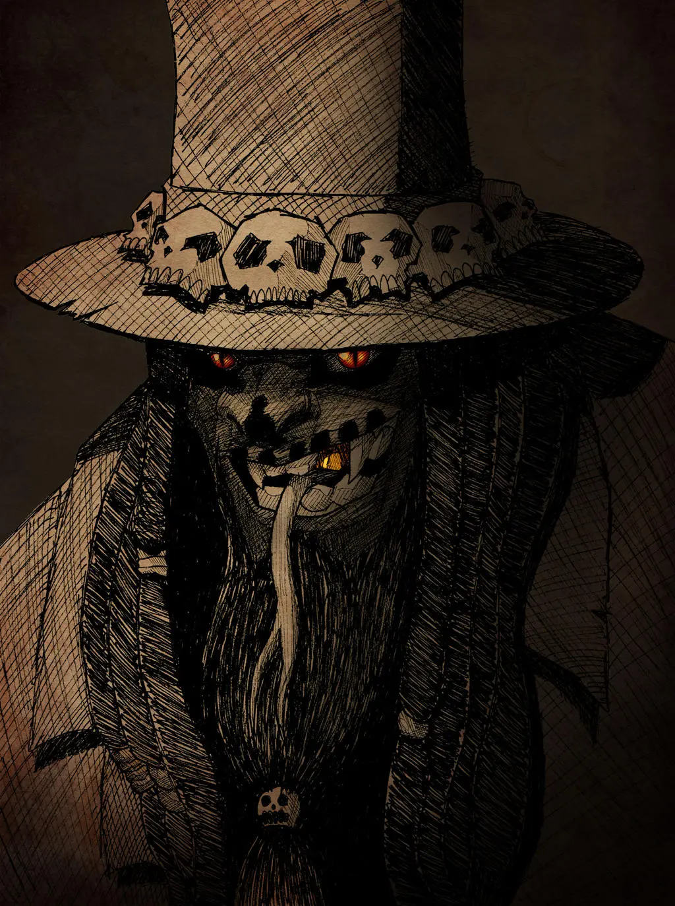

\sinc

## Saint-Domingue

\conc

Saint-Domingue ya es descrito en el libro básico, pero aquí se amplían ciertas partes que son de utilidad en la campaña «Contra la Espiga Púrpura».

### Fèt Gede

El Fèt Gede se celebra principalmente el 1 y 2 de noviembre de cada año, coincidiendo con el Día de Todos los Santos y el Día de los Difuntos. Aunque los días principales son estos dos, las celebraciones se extiende durante todo el mes de noviembre.

Durante el Fèt Gede los practicantes del vudú celebran sus creencias «paganas» prohibidas por las autoridades y la iglesia Católica, escondiéndolas bajo las celebraciones de todos los Santos. 

Las celebraciones del Fèt Gede se hacen en el cementerio principalmente, pero a medida que el alcohol y el desenfreno se apodera de la gente, las celebraciones se extiende a todas partes.

Los practicantes del vudú se visten con sus mejores galas y sombreros de copas y fuman puros, beben ron y bailan desenfrenadamente entre las tumbas de los cementerios.

Cuando el desenfreno se extiende a todos los participantes aparece una figura siniestra, el barón Samedí.

De normal, alguien se disfraza de esqueleto con una chistera y aparece entre los celebrantes, fumando, bebiendo y bailando con ellos y tentando a hacer lo mismo a aquellos que están parados y tranquilos.

\sp

Pero a veces en el cementerio no aparece un creyente disfrazado, sino el propio Barón Samedí. Entonces la fiesta se convierte en una auténtica orgía de alcohol, drogas y sexo grupal.

Este Barón Samedí no es actor que interpreta un papel, alguien poseído o el propio _loa_, es un avatar menor de Nyarlathotep que aparece en algún cementerio durante Fèt Gede atraído por la locura de las celebraciones.

Para atraer al avatar hay ponerle un buen cebo y para ello hay que tratar de concentrar la mayor cantidad gente creyente del vudú y ofrecerles comida y bebidas alcohólicas en abundancia, música estruendosa y que el humo de los puros haga una espesa niebla.

Entonces aparece el Barón Samedí que beberá, comerá, fumará y follará sin ningún tipo de prejuicio moral o ético.

Los no-comodines creyentes del vudú caerán inmediatamente bajo el influjo del Barón Samedí. **Los no-comodines no creyentes y los comodines tendrán que pasar una tirada de Espíritu** o se levantarán al día siguiente encima de una tumba, desnudos abrazados a otra persona y con la peor resaca de su vida.

La orgía bajo la influencia del avatar puedes durar varios días hasta que los cuerpos de creyentes ya no pueden seguir más o las fuerzas religiosas y policiales toman cartas en el asunto y disuelven a la multitud. En ese momento el avatar abandona el lugar y busca un nuevo cementerio donde seguir las celebraciones.

> Mientras haya algún creyente del vudú celebrando el Fèt Gede, el Barón Samedí estará en la tierra. En cuanto terminen las celebraciones, el Barón desaparecerá hasta el año que viene. Así que durante todo el mes de noviembre, el avatar de Nyarlathotep camina entre las gentes de Haití. Intentar estirar artificialmente las celebraciones no funcionará a no ser que se monte unas grandes festividades.

### Cementerios de Hôpital

En Hôpital, la zona central de Saint-Domingue, no hay grandes centros urbanos y por tantos los cementerios son pequeños y están dispersos por todo Hôpital.

Quitando las tumbas y mausoleos del terrateniente local, el resto de enterramientos son pequeñas lápidas o cruces con nombres y fechas que marcan donde está el finado.

\sp

En estos cementerios se cuentan montones de historias de cadáveres desaparecidos o que se levantan y andan y las autoridades religiosas y policiales las achacan a rituales vudú.

> En realidad casi todas las historias extrañas en cementerios son culpa ghules que desentierran los cadáveres para devorarlos.

Incluso en la muerte hay clases sociales y los esclavos a pesar de ser «crustianos» no eran enterrados en los mismos cementerios. Más que cementerios eran fosas comunes ya que las lápidas cuestan dinero y ese honor solo se dejaba a los esclavos más fieles, trabajadores y normalmebte que trabajaban en casa. Los trabajadores del campo iban directamente a las fosas comunes.

En estos cementerios para esclavos es donde se suele celebrar el Fèt Gede. Como son sitios alejados de los núcleos urbanos y mal comunicados la mayoría de ellos claros en la selva eran perfectos para que los practicantes del vudú hicieran sus ritos, especialmente en Todos los Santos.

Es en estos últimos cementerios donde se aparece el Barón Samedí y donde monta sus orgías y es donde aparece los dueños de los esclavos acompañados de guardia y soldados al de unos días cuando desaparecen los esclavos de las plantaciones y nadie sabe dónde están.
