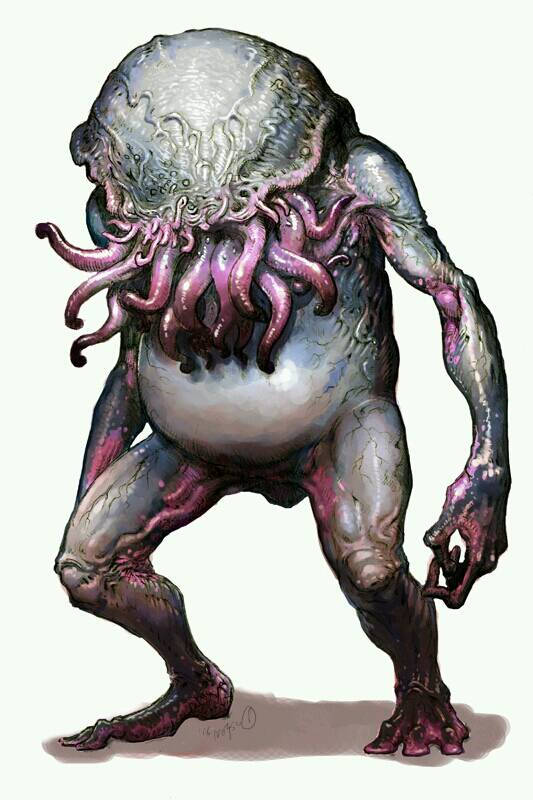
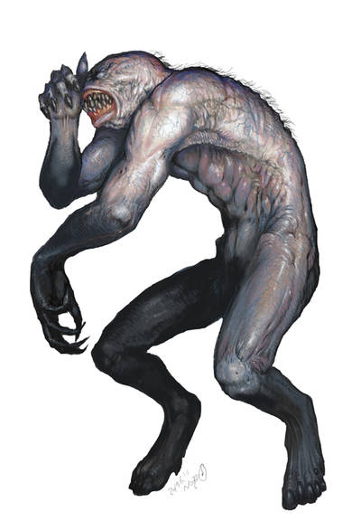

\sinc

## Las Tierras del Sueño

\conc

Seguramente, durante una cuantas sesiones tu mesa va a navegar por los Mares de las Tierras del Sueño. Así que aquí te proponemos algunas localizaciones que puedes usar en tus aventuras mientras buscan la manera de volver a su mundo. 

Tu mesa navegará principalmente por el Océano Medio, la masa de agua que hay entre el Mar Cerenario y el Mar Austral y podrán desembarcar en puertos tan importantes como Celephaïs o ver las maravillas de la ciudad flotante de Serannian. 

### Celephaïs

_Población:_ 12000 habitantes

_Controlada por:_ Rey Kuranes

Celephaïs es la ciudad portuaria más importante del país de Ooth-Nargai. Una barrera mágica que cubre la ciudad evita el paso del tiempo, con lo que sus habitantes no envejecen. De hecho, los niños y jóvenes se crían fuera de la ciudad y de su barrera mágica, ya que de lo contrario se crecerían.

La ciudad está rodeada por una muralla decorada con estatuas de bronce. La mayoría de los edificios están construidos con mármol azul celeste y rematados por minaretes. Sobresalen en la ciudad dos edificios, en el centro el templo de Nath-Horthath y luego el Palacio de las Setenta Delicias, tallado en cristal rosado y en el cual reside el rey Kuranes. Kuranes, el fundador de la ciudad y su actual regente, es un soñador que abandona el mundo de la vigilia para vivir totalmente en las Tierras del Sueño.

Por debajo del rey se encuentran los ochenta sacerdotes de Nath-Horthath. Algunos de ellos han vivido más diez mil años de edad. Por último está el resto de la población que principalmente se dedica al comercio por mar.

Aunque no se habla demasiado sobre este aspecto, es evidente que la religión, estructurada en torno a la veneración del gran dios Nath-Horthath, tiene un gran peso en la vida de Celephaïs, ya que el templo ocupa una posición privilegiada. Asimismo, hay un notable "culto al líder", y es que el rey Kuranes goza de una gran popularidad entre la población, por haber sido también quien fundó la ciudad.

\sp

#### Paso del tiempo

Es importante destacar que lo que pasa en Celephaïs es que no nada envejece, ni personas, ni animales ni edificios, pero el tiempo pasa igual. Es decir, que si entras 1 de abril y te tiras una semana en la ciudad, cuando salgas de la ciudad será 7 de abril, pero tú no habrás envejecido ni un solo día, por ejemplo, no te habrá crecido nada el pelo y/o la barba. Si tu mesa cree que puede pasarse meses estudiando un tomo de los Mitos mientras fuera de la ciudad no pasa el tiempo, cuando salgan de la barrera mágica descubrirán su grave error.

Pero si podrían dejar aquí a compañeros heridos de muerte o con enfermedades mortales, incluso maldiciones, para que mientras esté en la ciudad no puedan morir o su maldición no avance. En este caso si podrían estar el tiempo necesario estudiando su enfermedad o su maldición y tratando de librarse de ellas.

### Serannian

_Población:_ 3000 habitantes

_Controlada por:_ Rey Kuranes

Serannian es una ciudad voladora que flota frente a la costa de Ooth-Nargai, cerca de Celephaïs. Es una ciudad en la que destacan sus construcciones de mármol rosa y azul que recuerdan en cierta medida a una ciudad de las Mil y una noches. 

El origen de la ciudad es desconocido, quizás estaba ya allí desde hace mucho tiempo o la creo el propio Kuranes en sus ensoñaciones. 

Sea como sea esta ciudad flota mágicamente sobre las costas de Ooth-Nargai y es casi invisible desde el mar o desde la costaTal vez por algún tipo de hechizo de camuflaje o por algún efecto óptico.

Hay dos formas de acceso a la ciudad y ambas son bastante complicadas.

A priori, **la única forma de llegar es usando magia**, quizás teletransporte, hechizos de vuelo, deseos mágicos. Se dice, como si fuera el Nuncajamás de Peter Pan, que desde Celephaïs debes partir hacia el horizonte y cuando llegues allí solo has de ascender. Lo cual es del todo imposible. 

Sin embargo, no es tan fácil como ascender, ya que hay que conocer aproximadamente su posición (tirada de Navegación - 4) y hacerlo muy cerca de ella.

\sp

De otra manera, es totalmente invisible a los sentidos humanos. Una vez has hecho el viaje se vuelve más fácil saber qué buscar (necesitando solo una tirada de navegación).

De la ciudad de Serannian **cuelga una cuerda de oro, que llega hasta la superficie del mar**. Si la encuentras colgando en mitad del mar puedes ascender por ella y si consigues llegar hasta el final, entras en la ciudad flotante de Celephaïs. 

Llegar a la ciudad flotante supone una ascensión de 1,5 km. Subir por ella es una tarea titánica (hay que conseguir 10 avances en tiradas de Atletismo, cada tirada fallada supone 1 de fatiga). La caída supone la muerte asegurada en cuanto pasas la primera tirada de Atletismo.

La ciudad flota sobre el mar, con lo que tener referencias visuales de su posición son complicadas. Además, sí que me mueve algo, es desplazada suavemente por los vientos, porque que aunque se tuvieran las coordenadas exactas sigue siendo difícil encontrarla ya que no se puede ser preciso con su localización.

Las gentes naturales de Serannian son de piel pálida, agradable con los extranjeros, pero muy introvertida y no suelen relacioanrse con ellos.

Al igual que Celephaïs, Serannian está gobernada por el rey Kuranes, quien reside allí durante la mitad del año.

### Dylath-Leen

[Dylath-Leen](https://amor-de-otro-mundo.fandom.com/es/wiki/Dylath-Leen) es lo más parecido que va a ver tu mesa a una isla pirata y, seguramente y a pesar de estar en otro mundo, se sentirán un poco como en casa. Es una de las ciudades con peor reputación de las Tierras del Sueño y razón no les falta a los que lo dicen.

Su puerto es conocido como la Bahía de los Muelles y está compuesto de más de cien muelles de todo tipo de tamaño y forma para dar cabida a todo tipo de navíos de los mares del Sueño independientemente de su forma y tamaño. Por lo menos, un 25% de los muelles están siempre en uso.

Pero a diferencia de sitios como Tortuga o Barbados, a los que tu mesa estará acostumbrado, el comercio es tan grande que las grandes fortunas comerciales se mezclan en sus calles con marineros borrachos de todas las Tierras del Sueño.

\sp

La gente viste desde levitas, capas y pantalones, hasta turbantes, túnicas o caftanes y en las calles se pueden escuchar idiomas de todos los países del Sueño y la Vigilia.

Desde el mar se pueden ver las murallas y las torres delgadas y angulosas construidas de basalto negro que caracterizan la silueta de la ciudad.

La ciudad es muy antigua y a diferencia de las ciudades portuarias del Caribe, las casas son altas y de piedra, no bajas y de madera, incluso las más pobres. Lo que si hay son grandes avenidas en las zonas ricas y nuevas y callejones sucios y oscuros en las partes más viejas y pobres.

La ciudad no tiene una figura gobernante clara, sino que es regida por las casas más ricas de la ciudad, tanto nobiliarias como comerciales. 

#### Galeras negras, lengnitas y bestias lunares

Dylath-Leen es también infame por las galeras negras que frecuentan sus puertos. Estas galeras están dirigidas por remeros que nunca son vistos y tripulados por hombres con turbantes que comercian con curiosos rubíes y que los intercambian por esclavos y oro. Estos hombres con turbantes (y los remeros) son esclavos lengnitas que trabajan como intermediarios para sus amos las bestias lunares.

Hace siglos las bestias lunares, que viven en la cara oculta de la luna del Sueño, esclavizaron a los lengnitas de las tundras del norte haciéndose pasar por dioses. Cogieron a estos esclavos y los llevaron a sus ciudades lunares y les hicieron trabajar en sus minas de rubíes. Cada cierto tiempo las bestias lunares vuelven a la tierra usando unas galeras negras que pueden volar y moverse por el espacio y venden en Dylath-Leen sus rubíes a cambio de nuevos esclavos para las minas y oro.

Las bestias lunares por su forma alienígena prefieren no relacionarse con las gentes de Dylath-Leen y usan a lengnitas espacialmente hábiles como intermediarios que vendan sus rubíes y compren esclavos. Estos lengnitas usan turbantes para tapar sus cuernos caprinos y ropajes anchos estilo árabe para ocultar sus piernas de cabra.

La llegada de las galeras negras al puerto siempre crea expectación, pero nadie hace muchas preguntas, ya que dejan muy buenos beneficios entre los mercaderes locales y nadie quiere matar a la gallina de los huevos de oro. 

\sp

Las malas lenguas hablan de que los hombres con turbantes solo son intermediarios y de que los verdaderos dueños y capitanes de las galeras nunca salen del barco. También se habla de figuras cuadrúpedas parecidas a sapos o ranas que se ven a veces fugazmente en las cubiertas de las galeras negras.

Se sabe que cumplen los designios de Nyarlathotep a cambio de favores, así que si consigues encontrar una bestia lunar y comunicarte con ella quizas puedas sacar algo de información sobre las actividades del dios oscuro en la zona.

#### Galeras negras

Las galeras negras de las bestias lunares son simples galeras a remos y velas negras que han sido modificadas con tecnología de las bestias lunares para hacer los viajes entre la Tierra Onírica y la Luna Onírica. Además de la capacidad de autopropulsarse fuera de la atmosfera, están preparadas para soportar el vacío del espacio estando las cubiertas inferiores cerradas y conversando el oxígeno y la presión atmosférica.

Su capacidad de vuelo y de viaje espacial solo se usa para ir de la tierra a la luna. Cuando salen o llegan a la tierra suelen hacerlo muy lejos de la costa y de las rutas comerciales para no descubrir su secreto.

Esto generar muchos rumores entre los marineros, ya que Dylath-Leen es el único puerto donde atracan, cuando lo normal es que hubiera por lo menos oro puerto conocido donde cargarán los rubíes que venden y donde dejasen los esclavos que compran y el oro que consiguen.

Así pues, desde el punto de despegue/aterrizaje hasta el puerto de Dylath-Leen, las galeras usan sus velas y los remos son accionados por esclavos para navegar por el mar.

El punto de despegue/aterrizaje (y correspondiente la ruta hasta Dylath-Leen) no siempre es el mismo, va cambiando según la posición de la Luna y la Tierra y es bastante difícil de predecir, con lo que tratar de emboscarlos en lejos de la costa es muy complicado. Sería pura suerte que tu mesa se encontrará con una galera negra en alta mar, lejos del puerto de Dylath-Leen.  

La tecnología voladora de las galeras negras de las bestias lunares debe ser considerada como **modificación extraña**. 

\sp

\sinc

|Modificación extraña|Semanas|Coste|Parte del barco|
|---|---|---|---|---|
|**Tecnología de vuelo de las bestias lunares**|1|400|Popa o Proa|

\conc

Este sistema se basa en la gravedad entre la tierra y la luna del Sueño.

En las Tierras del Sueño la Luna onírica está más cerca de la tierra onírica y es mucho mayor. El artilugio que permite volar a las galeras se aprovecha de las fuerzas gravitacionales para hacer salir despedido hacia el cielo a los barcos.

Las fuerzas gravitacionales son tan fuertes que al activarlo el barco empieza a levitar hacia la luna. Sin poder casi maniobrar.

En la Vigilia la luna es más pequeña y está más lejos con lo que al activarse el mecanismo de vuelo, solo se eleva unos pocos metros, con lo que muchas veces la quilla no sale del agua.

Aun así, al haber menores fuerzas actuando contra el barco, este puede maniobrar y un capitán hábil puede usar la capacidad de que su barco es más ligero para obtener una de estas ventajas.

* Con viento a favor será mucho más rápido. En trayectos cortos como combates y persecuciones esta ventaja no tiene mucha efectividad, pero durante viajes largos (1 semana mínimo) y con buen tiempo y viento a favor puede reducir el tiempo de viaje a la mitad.
* Puedes pasar por bancos de arena y aguas de sin problema.
* Puedes tratar de sobrecargar tu barco sin perder velocidad. La capacidad de carga no aumenta, no puedes meter más barriles en la bodega de las que puedes llevar normalmente, pero digamos que puedes llevar productos más pesados como sal, metales procesados o mineral en bruto sin ningún tipo de penalización. 
* O todo lo contrario, parecer que no está cargado en absoluto, con lo que los piratas no te seguirán y los jefes de puerto ni querrán revisar tu carga al parecer que vas vacío.

\sp

El único problema de esta modificación es que solo funciona de noche con la luna en el cielo. Las opciones de fases lunares y si se ve de día la luna o no, pueden complicar todo esto mucho con lo que solo funciona de noche, desde la puesta hasta la salida del sol, y no importa la fase lunar.

Al no salir del agua la quilla y ser de noche, solo una persona muy experta en Navegar podría detectar que pasa algo raro y necesitaría una tirada de Mitos para saber qué se está usando tecnología gravitacional de las bestias lunares.

### La Montaña del Imán

En mitad del mar hay una isla llamada la isla de la Montaña del Imán. La isla es una gigantesca montaña salida del mar, sin sitios para fondear o sitios en los que desembarcar. Toda la costa son grandes acantilados con peligrosos arrecifes que imposibilitan bajar a tierra.

En lo alto de la montaña hay una especie de cúpula de cobre soportada por 10 columnas y debajo de ella una estatua ecuestre hecha de un metal desconocido muy parecido al cobre.

La sola presencia de la montaña congela los corazones de los marinos, ya que saben que su fin está cerca. Enseguida su barco se ve atraído hacia la isla y cuando está cerca, los clavos, los anclajes y demás elementos metálicos salen volando hacia la montaña. 

Si todavía sigue a flote después de esto acaba estrellándose contra los arrecifes y acantilados y los marinos mueren ahogados al no poder subir a tierra firme.

La montaña de piedra ferrosa, gracias a la estatua ecuestre, es un gigantesco y superpoderoso imán que atrae a todos los barcos que se le acercan. Las laderas de la montaña están cubiertas de objetos metálicos que el imán ha arrancado de los barcos y sus tripulantes. Algunos llevan siglos allí rotos y oxidados. Además, es casi imposible despegarlos del suelo al que están pegados.

Todo barco con componentes metálicos que entre en el radio de 5 km. de las montañas del imán entra en su zona de atracción y no puede escapar de su zona magnetizada a no ser que se pase una tirada de Pilotar -4. 

\sp

Si se falla, se acerca un kilómetro a la isla y para escapar hay que superar una tirada de pilotar -5 (4 + 1 por cada kilómetro). Si falla de nuevo, se acerca otro km hasta llegar a distancia de recibir daño y si se pasa la tirada, recupera un kilómetro.

La montaña produce 3d6 de daño a todos los barcos que se acerquen a rango de 0.5 km. El daño es producido por todos las piezas de metal arrancadas y los arrecifes contra los que es atraído. El daño se repite cada 5 minutos hasta que lo destruye contra los arrecifes.

Dentro de este rango de 0.5 km, cada PJ puede tratar de evitar que dos de sus objetos metálicos se vayan volando haciendo una tirada de FUE enfrentada contra d10. Si se pasa, durante 5 minutos se puede usar en objeto sin problema. Si falla el objeto sale volando de sus manos. Si los objetos son soltados, salen volando y se pierden.

Toda la montaña se considera terreno difícil debido a la pendiente de la montaña y a la gran cantidad de objetos metálicos oxidados que hay en su suelo. Muchos son, además, punzantes y cortantes y moverse entre ellos sin hacerse daño es bastante complicado.

#### La estatua ecuestre en la cima

La estatua ecuestre de las montañas de Imán está muy erosionada por el viento, lo cual denota su antigüedad. Desgraciadamente, no se pueden identificar los rasgos de la cara del jinete o las posibles inscripciones que hubiera en ella, lo cual deja muchas dudas sobre el origen e imposibilita su estudio y datación.

La estatua es lo que le da su tremendo poder magnético a la montaña de Imán. Sin esa estatua, las montañas solo sería unos grandes bloques de piedra tierra ricos en elementos férricos.

Hay varias teorías sobre el origen de la estatua, siendo todas posibles en mayor o meno medida.

* Pudiera ser que contenga encerrado en su interior la esencia de algún primigenio o dios exterior menor relacionado con el magnetismo. Quien le dio la forma ecuestre es un misterio, quizás sea un chiste del dios arquetípico Nodens que no podemos entender.

\sp

* Otra teoría es que sean algún tipo de ingenio de serpigente, yuggothianos e, incluso, yithianos para extraer materiales magnéticos. Seguramente en origen tendría una forma más eficaz como una esfera para maximizar su poder y con el tiempo alguien tallo la esfera para creaar una estatua ecuestre (aunque sea extremadamente dura para usar martillo y cincel). Sobre porque abandonaron el ingenio magnético es un misterio. Puede que la radiación electromagnética fuera peligrosa u otra raza destruyó el asentamiento y abandonó allí la esfera.
* La tercera y, quizás, más acertada es que sea algún tipo de trampa o arma creada por alguna raza para destruir a sus enemigos. Un objeto tan poderoso podría destruir flotas enteras de naves (incluso especiales) haciéndolas estrellarse contra la montaña. De alguna manera la estatua acabo en esta montaña o quizás se puso en su ubicación actual para proteger algo debajo de la montaña.

#### Destruyendo la estatua ecuestre

La estatua es inmune a todo ataque que no sea mágico y, además, no puede usarse contra ella armas metálicas porque se quedan pegados a la montaña en cuanto te acercas. Porras de madera o hachas de piedra podrían usarse, pero seguramente se romperán antes de hacer daño al metal de la estatua.

Una opción podría ser encender un fuego en su base y cuando el metal esté al rojo vivo, lanzar agua fría para que el brusco cambio de temperatura la haga estallar. Habría que separarla rápidamente porque si no volvería a reconstruirse por acción del propio magnetismo.

La estatua pesa casi 3 toneladas, así que otra opción sería tratar de moverla y lanzarla al mar lejos de las ferrosas montañas. 

> **Recompensa de cordura (+1):** Destruir la estatua salvará muchas vidas en el futuro y ese acto debería recompensarse con un +1 a Cordura, sobre todo si se conoce los devastadores efectos magnéticos de la estatua y los miles de muertes que ha provocado.

\sp

#### Saqueo de la isla

Las rocas y piedras de la montaña no funcionan como imán sin la presencia de la estatua ecuestre. Son altamente ferrosas, pero dejan de ser magnéticas al alejarse de la isla. Pasa lo mismo con los objetos metálicos atraídos a la montaña.

Si se está una hora buscando activamente entre los restos de naufragios y los objetos atraídos por el imán, se podrá hacer una tirada de botín de d8.

> **Semilla de aventura:** Si la teoría del arma anti navíos es cierta, la montaña podría tener unas instalaciones militares de los creadores de la estatua y a las que esta protegía de ataques. Puede haber cualquier cosa en esas instalaciones.

### Navegar por los mares de las Tierras del Sueño

Tu mesa va a navegar por el Oceano Medio, la estrecha masa de agua entre el continente del este y del oeste. Los puntos más alejados que deberían poder visitar son Serannian en el norte, ya en el Mar Cereniano, y Dylath-Leen, al sur en el Mar Austral. Esa distancia podría recorrerse en 3 semanas. Puedes tomar esto como referencia para el tiempo que puede durar la travesía que quiera hacer tus PJ.

Navegar no por estas aguas no es fácil. Para empezar son aguas desconocidas donde tu mesa no sabe como interpretar las señales atmosféricas, no conoce las corrientes, ni la geografía, además, al principio al menos, no tendrán mapas. Las estrellas son las mismas, pero con ciertos cambios, con lo que orientarse se dificulta mucho.

> Todas las tiradas de Pilotar para orientarse, leer el tiempo, buscar rutas, etc. reciben un -2 a la tirada. Si pasan el suficiente tiempo en estas aguas y compran mapas, contratan marinos locales o cosas similares podrás quitarles este negativo.

XXX

\sp

\sinc

### Tabla de Encuentros en el mar del sueño

|1d20|Nombre|Descripción|
|---|---|---|
|1|La montaña del Imán|Una gran isla formada por una gran montaña surge en el horizonte. Las corrientes parece que os llevan directamente hacia ella.|
|2|Ejemplar de La verdad de La Habana|Uno de los marineros saca un ejemplar de la VLH y empieza a comentar alguna noticia extraña. Tu mesa podrá tirar en la Tabla de Noticias de La verdad de La Habana.|
|3|Sirenas|Una noche de luna llena se empiezan a oír unos bellísimos cantos procedentes de la popa del barco. Empieza el relato salvaje «Sirenas».|
|4|Cambia el tiempo|Vuelve a tirar en la Tabla de Tiempo atmosférico durante los viajes si había Tiempo perfecto y quédate con el nuevo resultado.|
|5|Galera negra|Una galera negra bastante destrozada se acerca hacia vuestro barco, parece que tiene problema, pero podría ser también una trampa. Empieza el relato salvaje «Un presente para Xeros».|
|6|El cementerio de barcos|Encuentran el alta mar un islote que tiene gran cantidad de restos de barcos. Empieza el relato salvaje «La isla de Tekeli-li» del libro principal. Si ya lo han jugado, pueden ser unos restos de pecios enredados en sargazos que pueden saquear. Sería un botín de d6 sin objetos fuera del tiempo y del espacio.|
|7|Galera negra|Una galera negra camino a Dylath-Leen. Quizás podéis comerciar o tal vez continuar con vuestra carrera en la piratería en otro mundo.|
|8|Cambia el tiempo|Vuelve a tirar en la Tabla de Tiempo atmosférico durante los viajes si había Tiempo perfecto y quédate con el nuevo resultado.|

\conc

\sp

\sinc

|1d20|Nombre|Descripción|
|---|---|---|
|9|Barco ballenero|Un ballenero que parece del mundo de la vigilia aparece en el horizonte. Empieza el relato salvaje «El sueño de las ballenas».|
|10|Serannian|En mitad de la nada se ve una escala de cuerda de oro, que asciende hasta las nubes. La escala asciende durante 1,5 km. Subir por ella es una tarea titánica (hay que conseguir 10 avances en tiradas de Atletismo, cada tirada fallada supone 1 de fatiga). Si consigues llegar hasta el final, estarás en la ciudad flotante de Serannian.|
|11|Shantak perdido|A lo lejos aparece un shantak que se posa en el castillo de proa, parece herido, deshidratado, hambriento y totalmente desorientado. No son seres que vivan en el mar, todo lo contrario viven en los desiertos helados del norte. Quizás ha sido acosado por noctivagos demacrados y ha acabado aquí perdido.|
|12|Cambia el tiempo|Vuelve a tirar en la Tabla de Tiempo atmosférico durante los viajes si había Tiempo perfecto y quédate con el nuevo resultado.|
|13|Abandonado a su suerte|Empieza el relato salvaje «Abandonado a su suerte».|
|14|¡Noctivagos!|Una bandada de 1d6+2 Noctivagos Demacrados cruza los cielos. Uno de ellos chilla y empiezan a descender hacia vuestro barco.|
|15|¡Zoogs!|Según el contramaestre alguien ha estado comiéndose parte de las provisiones. Un par de zoogs se han colado en el barco en el último puerto y habrá que cazarlos antes de que sean un problema.|
|16|Cambia el tiempo|Vuelve a tirar en la Tabla de Tiempo atmosférico durante los viajes si había Tiempo perfecto y quédate con el nuevo resultado.|

\conc

\sp

\sinc

|1d20|Nombre|Descripción|
|---|---|---|
|17|La tortuga|Empieza el relato salvaje «La tortuga».|
|18|Saboteadores profundos|Un pequeño grupo de profundos provoca daños en la embarcación, como robar el ancla, abrir una vía de agua o atorar el timón. Los tripulantes deberán arreglar los desperfectos antes poder continuar.|
|19|Emboscada de profundos|En la oscuridad de la noche, un grupo de profundos ataca el barco. El grupo es de 3 profundos por cada comodín y 1 profundo por cada tripulante secuaz. Si el vigía pasa una tirada de Notar podrá avisar a campanadas al resto del barco. Si fallan, los profundos cogerán al grupo por sorpresa y tendrán ventaja.|
|20|Perdidos en el tiempo y el espacio|Tu mesa se adentra sin saberlo en una fisura de la realidad que lleva a alguno de los lugares de los Mitos. Puede ser que atraviesen un portal temporal abandonado de los yithianos, una zona de teletransporte de la serpigente o entren en la Tierra de la Vigila. Tira en la Tabla de Perdidos en el tiempo y el espacio. Los resultados de Ulthar y la Jungla de Kled les devolverían a nuestro mundo.|

\conc

### Bestiario de las Tierras del sueño

Las Tierras del sueño comparten monstruos y criaturas con el mundo de la vigilia, pero también tienen sus propios seres monstruosos que puedes enfrentar tu mesa y a sus sables y pistolas de pólvora negra.

Es importante destacar que hay **algunas razas que tienen cambios en las Tierras del Sueño**, aunque normalmente son cambios estéticos.

* Los **profundos** son más parecidos a los típicos personajes submarinos como tritones o kelpies, alejándose del físico entre pez y rana que tienen en nuestro mundo. Aun así su cultura y su psicología siguen siendo la misma.

\sp

* Los **gules** de las Tierras del sueño suelen ser más inteligentes y con rasgos más humanos que sus contrapartidas del mundo de la vigilia. De hecho tienes comunidades socialmente avanzadas. Suelen conocer cavernas secretas y excavar túneles que pueden pasar de un mundo a otro, pero son extremadamente reacios a compartir esa información.
* Los pocos **lengnitas** que hay en nuestro mundo son seres salvajes que dan rienda suelta a sus más bajos instintos, pero en las Tierras del Sueño son esclavos de las bestias lunares y esto hace que su carácter sea totalmente distinto. En este mundo son sumisos, callados y temerosos de todo, sobre todo de sus amos.

#### Bestia lunar

Las bestias lunares son una raza inteligente cuya forma recuerda al de una rana hinchada de tamaño humano sin ojos y con tentáculos en su hocico. Poseen manos y pies palmeados y los tentáculos les sirven como una mezcla de ojos, nariz y oído. La piel de las bestias lunares es viscosa y tiene un color grisáceo, ligeramente azulado.

Sociológica y psicológicamente son parecidos a los humanos. Mientras que en el Caribe de 1720 el tema de la esclavitud es una realidad, pero muy controvertida, entre las bestias lunares es algo totalmente aceptado. De hecho esclavizaron hace siglos los lengnitas haciéndose pasar por dioses.

Tienen ciudades en el lado oscuro de la versión la Luna de las tierras del sueño, desde la cual bajan a la tierra empleando unas galeras negras voladoras. 

\sp

Usan esclavos para extraer rubíes de sus minas lunares y los venden en Dylath-Leen usando agente lengnitas como intermediarios (no les gusta mostrarse ante otros seres). Con el dinero de la venta compran esclavos de todo tipo que traen a la luna para trabajar en las minas.

* **Atributos:** Agilidad d6, Astucia d8, Espíritu d6, Fuerza d8, Vigor d6 
* **Habilidades:** Atléticas d6, Ciencias d4, Intimidar d8, Mitos d8, Notar d8, Pelear d6,
* **Paso:** 6; **Parada:** 5; **Dureza:** 6(1)
* **Capacidades especiales:**
  * **Sentidos alterados:** Las bestias lunares perciben el mundo a través de sus tentáculos de muy variadas formas, olor, sonido/radar, calor, vibraciones y juntan toda esa información de forma que no tienes penalizadores por baja luminosidad, niebla, etc. Pueden detectarte a través de objetos sólidos y, si bien no pueden atacarte a través de las paredes con sus lanzas, sí pueden lanzarte hechizos que necesiten verte.
  * **Armadura +1:** Su viscosa y resbaladiza piel le proporciona cierta protección.
  * **Hechizos:** 6 PP, Conoce Marioneta, Gigantismo, Enanismo y 1 hechizo al azar que no sea de combate.
* **Equipo:** Lanza (FUE+d4. +1 Parada, a dos manos)
* **TPC:** 1d8 

#### Lívidos

Los lívidos son unas criaturas que habitan en las cuevas subterráneas y el submundo de las Tierras del Sueño. Son humanoides de grandes ojos (para aprovechar la poca luz de las cuevas), sin pelo, sin nariz y sin frente. Su piel es muy pálida, casi albina. 

\sp

Tras vivir generaciones bajo tierra prolongadamente son fotosensibles. Son carnívoros y poseen una gran agilidad y potencia de salto, gracias a sus fuertes y musculosas piernas. Su principal arma a la hora de cazar es el veneno que emplean para debilitar a sus víctimas.

Los lívidos se organizan en manadas y son muy territoriales. Esto le lleva a enfrentarse a otros depredadores subterráneos como gugos o gules por disputas territoriales.

* **Atributos:** Agilidad d8, Astucia d6, Espíritu d8, Fuerza d8, Vigor d8
* **Habilidades:** Atletismo d8, Notar d6, Pelear d6, Sigilo d6
* **Paso:** 6; **Parada:** 5; **Dureza:** 7(1)
* **Capacidades especiales:**
  * **Armadura +1:** Su piel rugosa y pálida le proporciona protección.
  * **Debilidad luz solar:** Sufren un -2 a todas sus tiradas de habilidad a plena luz del día.
  * **Visión nocturna:** No sufren penalización por condiciones de iluminación.
  * **Mordisco venenoso:** FUE+d4. El mordisco del lívido es venenoso, su víctima debe pasar una tirada de Vigor inmediatamente u obtendrá 1 nivel de fatiga. Solo puede usarlo una vez por objetivo y si se pasa la tirada de Vigor se vuelve inmune al veneno de lívido.
  * **Grandes saltadores:** Como acción de movimiento puede elegir saltar una distancia en línea recta de hasta 6 pasos. Además, añade +4 al daño cuando se abalanza como parte de un ataque salvaje en lugar del +2 habitual siempre que pueda hacer el salto completo de 6 pasos.
* **TPC:** 1d6 (manada)

#### Zoog

Los zoogs son una raza inteligente que recuerda a un roedor de gran tamaño (casi como un gato) con grandes ojos, bigotes tentaculares y pelaje grisáceo o parduzco.

En sus bosques natales viven en comunidades tribales lideradas por los más ancianos. Son principalmente herbívoros, pero en realidad son omnívoros y tienden a la antropofagia, devorando indistintamente cuerpos reales y proyecciones astrales.

A los zoogs les gustan los objetos caros y raros, el oro y las piedras preciosas, ya que les dan estatus dentro de sus comunidades, lo cual hace que sean sobornables.

\sp

Tienen un terrible miedo a los gatos y no se acercan a los lugares donde haya felinos domésticos.

* **Atributos:** Agilidad d8, Astucia d6, Espíritu d10, Fuerza d4, Vigor d6
* **Habilidades:** Atletismo d6, Idioma materno d6, Notar d8, Pelear d6, Sigilo d6, Supervivencia d8
* **Paso:** 6; **Parada:** 5; **Dureza:** 2
* **Desventaja:** Avaricioso (menor)
* **Capacidades especiales:**
  * **Colmillos:** FUE+d4
  * **Tamaño -3:** Son menudos, miden en torno a los treinta centímetros de largo. Todo ataque dirigido a ellos tiene un -4.
  * **Hechizos:** PP 10, Pueden conocer un par de hechizos no de combate como Xilomancia, Hidromancia, Luz del día o Péndulo de cuarzo 
* **TPC:** 1d4 (manada)

\sc