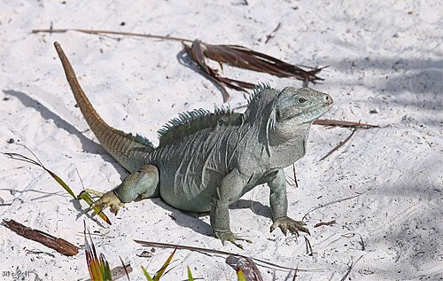

\sinc

## Islas Turcas y Caicos

\conc

Las Islas Turcas y Caicos es un archipiélago de islas situado en el extremo este de las Antillas Mayores. Son unas islas pequeñas y prácticamente deshabitadas. 

En teoría es un territorio dependiente de Bahamas, pero en la realidad se autogestionan y los poderes y las leyes británicas poco efecto tienen en estas islas.

Estas islas son, como muchos de los pequeños archipiélagos controlados por los ingleses, un nido de piratas al mismo nivel que las islas Caimán.

Los pueblos **taínos que habitaban estas islas fueron exterminados** por los colonizadores españoles y durante siglos solo habitaron estas islas los **marineros abandonados** en ellas castigados con el _maroon_. Así que no es extraño encontrar a veces esqueletos que las mareas o los vientos desentierran.

### Cockburn Town

_Población:_ 100 habitantes

_Controlada por:_ Oficialmente Gran Bretaña

Cockburn Town fue fundada por salineros de Bermuda en 1681 en la isla Gran Turca. 

XXX

### Isla Iguana

En el centro de las islas hay un pequeño islote donde vive una importante colonia de iguanas de roca. Este islote arenoso está deshabitado y **las iguanas campan y retozan a sus anchas** entre su baja vegetación.

Es bastante famosa entre los barcos piratas por ser una **manera muy rápida, barata y fácil de conseguir carne fresca**. Así que no es raro ver a grupos de piratas corriendo detrás de las iguanas en las playas del islote. De hecho, muchas veces se terminan montando apuestas y concursos por ver quien consigue atrapar antes a una iguana.

\sp

 - Caudatejake - Own work") 

Las iguanas son buenos animales de compañía, así que tampoco es de extrañar que muchas se salven de la cazuela y acaben sueltas en los barcos como mascotas de la tripulación.

> Si necesitas estadísticas de una iguana, puedes usar las del gato doméstico del manual básico de SWEA.

Ha habido varios intentos de habitar la isla, pero siempre han acabado en la extraña desaparición de sus habitantes. Es por ello que tiene **cierta fama de isla maldita**. 

En realidad, los intentos de habitarla siempre han sido por parte de cazadores que querían montar un negocio de carne ahumada de iguana. Tarde o temprano se han encontrado con piratas que no querían pagar por lo antes tenían gratis y ha acabado matándolos y robándoles su carne ahumada.

### Colinas de Sapodilla

Durante muchas décadas, antes de que se colonizase este archipiélago, las islas Turcas y Caicos eran un sitio perfecto donde abandonar a marinos como castigo. A eso se le unió las terribles tormentas que azotaban la zona. Así qué no es de extrañar que en estas islas acabarán muchos náufragos y marinos abandonados.

En la isla de Providenciales en el extremo sur del archipiélago, hay unas colinas de roca dura llamadas las **colinas de Sopadilla** donde mucha de esa gente grabó sus nombres y cuando llego a ellas (y muy pocas con la de salida).

Si buscas a alguien desaparecido, te puedes ahorrar muchos meses de búsqueda revisando los nombres grabados en las piedras de las colinas y quizás con suerte encuentres su esqueleto en el refugio que construyó allí.

> **Semilla de aventuras:** Alguien de tu mesa ve su nombre escrito en la piedra con una fecha en el futuro.

\sp

En las playas de la isla cercanas a las colinas se pueden encontrar esqueletos desenterrados por la arena, y entre su vegetación selvática se pueden descubrir los refugios medio destruidos de las personas que acabaron en aquella isla perdida.

> Estos antiguos campamentos son sitios perfectos para dejar objetos tanto mundanos como pedidos en el tiempo y el espacio. Pueden ser realmente antiguos y de muchísimo valor. Desde objetos de poder, grimorios o mapas del tesoro.

### Los pozos negros

También llamados sumideros, son pozos de gran tamaño y profundidad llenos de agua fresca. Fueron creados hace miles de años por el efecto del agua de lluvia sobre la piedra caliza que forma las islas.

Si bien hay pozos negros por todo el archipiélago, la mayoría de los más grandes están en la isla de Providenciales. El más grande todos se conoce como The Hole y se encuentra al este de Providenciales.

La mayoría de los pozos se llenan con agua de lluvia, pero The Hole y el resto de pozos de mayor tamaño de Providenciales dan a una red de túneles subacuáticos no-naturales que llevan hasta el mar, por lo que su agua es salobre.

A diferencia de los cenotes y _blue holes_ de otras partes del Caribe, las tribus de profundos locales no se adentran en ellos y no los usan en sus expediciones tierra adentro.

Para ellos son tabú y bajo ninguna circunstancia entran en ellos. Quizás con una caracola de los Profundos se pudiera pedir como favor, pero la verdad es que a priori no hay nada interesante en ellos, que se sepa.

La realidad es que durante miles de años la red de túneles fue el hogar de un shoggoth superviviente de tiempos pretéritos que mataba a todo aquel profundo que se aventuraba en los túneles submarinos.

Si bien el shoggoth hace siglos que murió o desapareció, el miedo atávico que imprimió en los profundos locales durante generaciones sigue presente en la prohibición de adentrarse en la red de túneles.

La red de túneles tiene una estructura laberíntica con túneles donde un hombre podría ponerse de pie sin problemas y otros donde apenas podría gatear.

\sp

> **Semilla de aventuras:** Las leyendas y rumores de tesoros piratas sumergidos en los pozos son constantes y pueden ser utilizados para atraer a tu mesa a las islas y a explorar los pozos negros.

Solo con ingenios submarinos o hechizos de respirar bajo es agua se pueden explorar estás cavernas subacuáticas, aunque pueden encontrarse bolsas de aire en ciertas partes.
