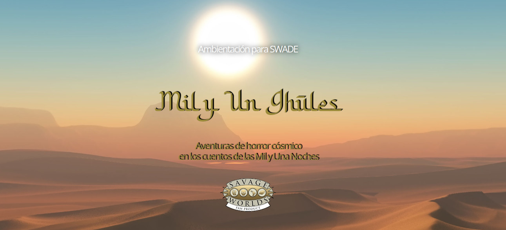

# Epílogo

Notas del autor
---------------

### ¿Por qué Savage Worlds?

Simplemente, porque me encanta Savage Worlds, es uno de los sistemas genéricos de juegos de rol con el que más cómodo me siento. Si voy a meterle muchas horas a esta campaña quiero hacerlo con un RPG que me sea fácil y familiar.

### Veracidad histórica

En esta ambientación, si bien tiene una pequeña base histórica, no es en absoluto realista e históricamente correcta. No busquéis unos datos históricos correctos, aquí no los vas a encontrar. Los hechos y fechas que se narran en este juego han sido modificados (o tergiversados, según otros) para crear una ambientación pirata de tintes lovecraftsianos divertida y llena de acción, más cerca de películas de aventuras y de videojuegos que de documentales del canal Historia.

### Salud mental

Los trastornos mentales y la salud mental representados en esta ambientación no tratan de ser realistas, solo tratan de reflejar con las reglas de SWADE el horror y la locura tan característicos de Lovecraft y cómo estos afectan a las capacidades de los PJs.

### Influencias

Toda esta ambientación está muy influenciada por el juego de rol de “La Llamada de Cthulhu” de Chaosium y hay mecánicas de ese juego que han influenciado consciente o inconscientemente en las reglas de este juego. Toda la parte de piratería está muy basada en la ambientación de "50 brazas".

### Generación de tesoros y tablas de encuentros

Este juego tiene muchas tablas, sobre todo de generación de objetos y tesoros. Esto se debe a mi deformación como DJ llevando a un grupo al que le encanta estar media hora después de la sesión haciendo tiradas de tesoro. Y yo le doy a mi público lo que le gusta.

Puedes obviar estas tablas tranquilamente y crear tú directamente los objetos y los tesoros que mejor se ajusten a tu partida. Si no quieres perder tiempo de partida, también puedes crear en casa el tesoro y llevarlo preparado a la partida. Lo que mejor se adapte a tu estilo de dirección, a tu grupo y a tu tiempo.

### Inclusión, diversidad y ecología

He tratado de hacer esta ambientación lo más inclusiva y abierta que puedo y es por ello que estoy seguro de que habré hecho muchas cosas mal. He tratado de que haya diversidad entre PNJs con todo tipo de opciones de género, raza, etc. y sin definir su orientación sexual (ver más adelante Romancear PNJs). He tratado de evitar clichés y espero haberlo hecho, pero sois muy libres de cambiarlo a vuestro gusto.

Está claro que los malos van a ser racistas, machistas, homófobos, etc. vamos lo que se considera malas personas en general, pero creo que no debéis permitirles estas conductas a vuestras mesas ni aunque digan que "su personaje es así" o "era lo normal en esa época". Esto es un juego de rol y ya hay mucha mierda en la vida real para aguantarla tú o tus jugadores en una mesa de juego.

Muchas "sugerencias de beni" están pensadas para premiar a los jugadores por ser más empáticos y ayudar a grupos discriminados. En ese sentido, bastantes formas extras de recuperar cordura están asociadas a acciones en favor de colectivos desfavorecidos que van más allá de salvarles la vida. Muchas veces se premiará devolverles derechos que les han sido robados o mejorar sus condiciones de vida en general. Como DJ creo que debes tratar de que las decisiones y acciones que tomen tus jugadores para conseguir esos "premios" sean porque creen que es lo bueno y justo en nuestra sociedad y no porque es un beneficio para su PJ en el juego.

Nada puede ser inclusivo y abierto si no tiene en cuenta el medio ambiente y la ecología, así que he tratado de darle una mirada ecologista con varias aventuras en las que la protección de la naturaleza es importante, Además, de recompensas de cordura y sugerencias de benis. Así pues, trata de evitar que tus jugadores utilicen muchas veces el camino rápido y tomen decisiones con grandes repercusiones para el medio ambiente. Puede que quemar la selva para destruir la fortaleza del enemigo sea un plan muy bueno, pero sus consecuencias para la fauna y flora local pueden ser desastrosas, así como para las comunidades que vivan en ella.

Para aportar mi granito de arena os diré que el servidor donde se aloja esta ambientación es un servidor verde certificado por la Green Web Foundation.

Para finalizar, estaré encantado de escuchar cualquier crítica que queráis hacer en este sentido y de hacer las modificaciones oportunas para corregirlas. He aprendido mucho haciendo esta ambientación y quiero seguir aprendiendo de vosotros.

### Colonización del Caribe

Aunque en esta ambientación se da a entender que todos los males y desastres del Caribe son culpa de un culto maligno asociado con seres extradimensionales diabólicos como son la RCPC y la Orden del gran Cthulhu, la realidad es que fueron los colonizadores europeos los culpables de la mayoría de actos deleznables que se dieron en el Caribe desde la llegada de Colón.

Muchos relatos salvajes están inspirados en esos terribles actos, dándoles un origen lovecraftsiano, pero en realidad ocurrieron muchas de cosas muy terribles como la guerra bacteriológica y el diezmado de la población taína por enfermedades traídas por los colonizadores o la desaparición de especie animales y vegetales por sobreexplotación, sin olvidarse de la desaparición de la cultura taína mediante, por ejemplo, evangelizaciones forzosas.

Estoy simplificando mucho todo este tema, pero sin lugar a dudas las potencias europeas sometieron, masacraron y expoliaron el Caribe y a sus pobladores originales.

Como en el punto anterior, estaré encantado de escuchar cualquier crítica que queráis hacer en este sentido y de hacer las modificaciones oportunas para corregirlas. He aprendido mucho haciendo esta ambientación y quiero seguir aprendiendo.

### ¿Puedo hacer con esta ambientación lo quiera?

Sí, puedes. Con referenciarla puedes hacer lo que quieras.

Si te gusta como se tratan los Mitos, olvídate de los piratas y quédate con el sistema de magia y cordura para tus aventuras en los años 20. O puedes quedarte el tema pirata y cambiar a los primigenios por enemigos más normales como vampiros, zombis y licántropos. Te gusta un objeto o una maldición, úsalo en tus partidas.

### Si algo no me gusta

En esta ambientación se tratan temas que pueden herir sensibilidades, así que mi consejo antes de empezar a jugar es poner en prácticas estas herramientas de seguridad.

Si algo no te gusta eres libre de cambiarlo o descartarlo, pero hay partes en esta ambientación que pido encarecidamente en su propio texto que no se cambien. Por ejemplo, Adolfé es un personaje no binario y me gustaría que así se le tratará.

### Romancear PNJs

Las vidas sentimentales y sexuales de la mayoría de los personajes de esta ambientación han sido dejadas a propósito sin definir para que las adaptes como más te interese. Así, cualquier persona de tu mesa podrá romancear con cualquier PNJ que encuentres aquí. Recuerda también que en los pocos casos en se habla de familia, no se especifica a propósito cómo es y quiénes la componen. Móntate las relaciones sexo-afectivas y familiares que mejor se ajusten a tus gustos y los de tu mesa y con la que todos os encontréis cómodos.

### Participar en el proyecto

Si te gusta el proyecto, quieres participar y sabes de Git, puedes hacerlo a través de GitHub en este [proyecto](https://github.com/gwannon/ArrrCthulhu). Si no estás familiarizado con Git, pues me mandas un DM en Twitter a [@Gwannon](https://twitter.com/gwannon) y hablamos.

Agradecimientos
---------------

Damos las gracias y el crédito apropiado a estos increíbles artistas que nos han permitido hacer uso de su arte en este juego al distribuirlo en con licencia Creative Commons:

*   [portada.webp](https://www.deviantart.com/artofragnar/art/A-pirate-night-618741314) por [ArtofRagnar](https://www.deviantart.com/artofragnar)
*   [caribe.webp](https://www.deviantart.com/skavenzverov/art/Into-The-Deep-325731829) por [SkavenZverov](https://www.deviantart.com/skavenzverov)
*   [historias.webp](https://www.deviantart.com/veronika/art/Dagon-306304950) por [veronika](https://www.deviantart.com/veronika)
*   [ambientacion.webp](https://www.deviantart.com/badluckart/art/Pirate-Ship-The-Night-Cutter-420271502) por [BadLuckArt](https://www.deviantart.com/badluckart)
*   [botin.webp](https://www.deviantart.com/samize/art/Cthulhu-Statuette-I-669368333) por [Samize](https://www.deviantart.com/samize)
*   [encuentros.webp](https://www.deviantart.com/samize/art/When-the-Stars-are-Right-643216790) por [Samize](https://www.deviantart.com/samize)
*   [monstruos.webp](https://www.deviantart.com/skullbastard/art/Devious-Desktop-Horror-of-the-Deep-819632322) por [Skullbastard](https://www.deviantart.com/skullbastard)
*   [faro.webp](https://www.deviantart.com/skullbastard/art/The-Call-939586515) por [Skullbastard](https://www.deviantart.com/skullbastard)
*   [aventuras.webp](https://www.deviantart.com/uoa7/art/Captain-s-Cabin-at-Night-358882518) por [uoa7](https://www.deviantart.com/uoa7)
*   [epilogo.webp](https://www.deviantart.com/artofragnar/art/Caves-505169856) por [ArtofRagnar](https://www.deviantart.com/artofragnar)
*   [recursos.webp](https://www.deviantart.com/uoa7/art/Captain-s-Cabin-358478787) por [uoa7](https://www.deviantart.com/uoa7)
*   [shoggot.webp](https://www.deviantart.com/nottsuo/art/Shoggoth-594261203) por [Nottsuo](https://www.deviantart.com/nottsuo)
*   [encuentros-tierra.webp](https://www.deviantart.com/kurocyou/art/Submerged-past-677042058) por [KuroCyou](https://www.deviantart.com/kurocyou)
*   [encuentros-mas.webp](https://www.deviantart.com/themefinland/art/Magical-rupture-commission-950188160) por [ThemeFinland](https://www.deviantart.com/themefinland)
*   [barbanegra.webp](https://www.deviantart.com/artofbeng/art/Captain-Edward-Teach-aka-Blackbeard-674817339) por [ArtOfBenG](https://www.deviantart.com/artofbeng)
*   [verdad-habana.webp](https://www.deviantart.com/artofbeng/art/Long-John-Silver-671899158) por [ArtOfBenG](https://www.deviantart.com/artofbeng)
*   [gandia.webp](https://www.deviantart.com/psiipilehto/art/Blackbeard-AC-Black-Flag-fanart-572602091) por [psiipilehto](https://www.deviantart.com/psiipilehto)
*   [lecourt.webp](https://www.deviantart.com/artofedge/art/Dusk-483897733) por [psiipilehto](https://www.deviantart.com/artofedge)
*   [ifa.webp](https://www.deviantart.com/tsynali/art/indi-girl-530934040) por [tsynali](https://www.deviantart.com/tsynali)
*   [lloigor.webp](https://www.deviantart.com/raphtor/art/Dino-Hybrid-Therospinax-550908413) por [RAPHTOR](https://www.deviantart.com/raphtor)
*   [hector.webp](https://www.deviantart.com/raphtor/art/Steve-778979763) por [RAPHTOR](https://www.deviantart.com/raphtor)
*   [maria-isabel.webp](https://www.deviantart.com/raphtor/art/WIP-01-504867397) por [RAPHTOR](https://www.deviantart.com/raphtor)
*   [pando.webp](https://www.deviantart.com/raphtor/art/Pacquiao-416029704) por [RAPHTOR](https://www.deviantart.com/raphtor)
*   [serpigente.webp](https://www.deviantart.com/willwarburton/art/Swamp-Shepherd-446637202) por [WillWarburton](https://www.deviantart.com/willwarburton)
*   [retono-oscuro.webp](https://www.deviantart.com/lalawulff/art/Dark-Young-Priest-of-Hastur-131474843) por [LalaWulff](https://www.deviantart.com/lalawulff)
*   [mapa.webp](https://es.m.wikipedia.org/wiki/Archivo:1732_Herman_Moll_Map_of_the_West_Indies_and_Caribbean_-_Geographicus_-_WestIndies-moll-1732.jpg) por [Herman Moll](https://es.wikipedia.org/wiki/Herman_Moll)
*   [secuaces.webp](https://www.deviantart.com/ahmetcankahraman/art/Untitled-632242179) por [AhmetCanKahraman](https://www.deviantart.com/ahmetcankahraman)
*   [yith.webp](https://www.deviantart.com/nottsuo/art/Grate-race-of-YITH-retouch2-875186832) por [Nottsuo](https://www.deviantart.com/nottsuo)
*   [profundo.webp](https://www.deviantart.com/raphtor/art/Fishy-Alien-creature-315217052) por [RAPHTOR](https://www.deviantart.com/raphtor)
*   [johanna.webp](https://www.deviantart.com/arthurhenri/art/Shaniqua-762581640) por [ArthurHenri](https://www.deviantart.com/arthurhenri)
*   [tindalos.webp](https://www.deviantart.com/fernand0fc/art/Hound-of-Tindalos-572596215) por [Fernand0FC](https://www.deviantart.com/fernand0fc)
*   [isadora.webp](https://www.deviantart.com/arthurhenri/art/Shining-768612780) por [ArthurHenri](https://www.deviantart.com/arthurhenri)
*   [samedi.webp](https://www.deviantart.com/blondinfrenchtouch/art/Voodoo-653438288) por [BlondinFrenchTouch](https://www.deviantart.com/arthurhenri)
*   [maryread.webp](https://www.deviantart.com/femarot/art/Bonny-from-black-sails-690333501) por [femarot](https://www.deviantart.com/femarot)
*   [embarcaciones.webp](https://www.deviantart.com/ahmetcankahraman/art/Chase-735144464) por [AhmetCanKahram](https://www.deviantart.com/ahmetcankahraman)
*   [guia.webp](https://www.deviantart.com/umbatman/art/Pirates-Ahoy-666863611) por [umbatman](https://www.deviantart.com/umbatman)
*   [contraportada.webp](https://www.deviantart.com/bear1037/art/Jungle-Swamp-482759290) por [Bear1037](https://www.deviantart.com/bear1037)
*   [nochedelestreno.webp](https://angelamaps.com/2021/07/24/opera-house/) por [AngelaMaps](https://angelamaps.com/)
*   [callejon.webp](https://angelamaps.com/2021/09/06/alley/) por [AngelaMaps](https://angelamaps.com/)
*   [parquepublico.webp](https://angelamaps.com/2021/08/25/gardens/) por [AngelaMaps](https://angelamaps.com/)
*   [callesestrechas.webp](https://angelamaps.com/2023/01/10/narrow-street/) por [AngelaMaps](https://angelamaps.com/)
*   [juzgados.jgg](https://angelamaps.com/2022/04/19/courthouse/) por [AngelaMaps](https://angelamaps.com/)
*   [batu.webp](https://angelamaps.com/2023/06/20/burial-mound/) por [AngelaMaps](https://angelamaps.com/)
*   [adolfe.webp](https://www.deviantart.com/pinchealvarito/art/Digital-Self-Portrait-637532445) por [pinchealvarito](https://www.deviantart.com/pinchealvarito)
*   [vampirofuego.webp](https://www.deviantart.com/the-night-bird/art/Light-My-Fire-BG-01-331012312) por [the-night-bird](https://www.deviantart.com/the-night-bird/)
*   [mansion.webp](https://www.deviantart.com/aznkyuubi/art/Plantation-Mansion-560562844) por [AznKyuubi](https://www.deviantart.com/aznkyuubi/)
*   [temploperdido.webp](https://www.deviantart.com/bear1037/art/Monument-723540805) por [Bear1037](https://www.deviantart.com/bear1037/)
*   [comercio.webp](https://www.deviantart.com/quentinvcastel/art/The-Admin-594008953) por [Quentinvcastel](https://www.deviantart.com/quentinvcastel/)
*   [navios.webp](https://www.deviantart.com/quentinvcastel/art/Royal-Dolphin-590122673) por [Quentinvcastel](https://www.deviantart.com/quentinvcastel/)
*   [tortuga.webp](https://www.deviantart.com/toramarusama/art/turtle-study-300206228) por [Toramarusama](https://www.deviantart.com/toramarusama)
*   [maradentro.webp](https://www.deviantart.com/raphtor/art/Shallows-of-the-inland-sea-678520332) por [RAPHTOR](https://www.deviantart.com/raphtor)
*   [pantano.webp](https://www.deviantart.com/umbatman/art/Swamp-783861017) por [umbatman](https://www.deviantart.com/umbatman)
*   [pecio.webp](https://www.deviantart.com/umbatman/art/Shipwrecked-769356505) por [umbatman](https://www.deviantart.com/umbatman)
*   [hechiceria.webp](https://www.deviantart.com/reyed33/art/Unleash-the-Beast-560092369) por [ReyeD33](https://www.deviantart.com/reyed33)
*   [lengnita.webp](https://www.deviantart.com/or003/art/Aries-706530045) por [Or003](https://www.deviantart.com/or003)
*   [encuentros-mar.webp](https://www.deviantart.com/taihab/art/The-yellow-line-543770906) por [Taihab](https://www.deviantart.com/taihab)
*   [agujero-azul.webp](https://en.wikipedia.org/wiki/Dean%27s_Blue_Hole#/media/File:Dean_Blue_Hole_Long_Island_Bahamas_20110210.JPG) por [Ton Engwirda](https://commons.wikimedia.org/w/index.php?title=User:Ton_Engwirda&action=edit&redlink=1)
*   [tres-ojos.webp](https://commons.wikimedia.org/wiki/File:Santo_Domingo_Este_-_Los_Tres_Ojos_0082.JPG) por [Phyrexian](https://commons.wikimedia.org/wiki/User:Phyrexian)
*   [horror-cordura.webp](https://www.deviantart.com/themefinland/art/The-narrator-906224784) por [ThemeFinland](https://www.deviantart.com/themefinland)
*   [polipo-volante.webp](https://www.deviantart.com/jsantiagogutierrez/art/Flying-Polyp-894623183) por [jsantiagogutierrez](https://www.deviantart.com/jsantiagogutierrez)
*   [piratas.webp](https://www.deviantart.com/ahmetcankahraman/art/Gamble-748954514) por [AhmetCanKahram](https://www.deviantart.com/ahmetcankahraman)
*   [batalla-naval.webp](https://www.deviantart.com/quentinvcastel/art/Battle-Ship-594006743) por [Quentinvcastel](https://www.deviantart.com/quentinvcastel)
*   [elinfierno.webp](https://commons.wikimedia.org/wiki/File:Hell_Grand_Cayman_(1).JPG) por [Burtonpe](https://en.wikipedia.org/wiki/User:Burtonpe)
*   [tibes.webp](https://commons.wikimedia.org/wiki/File:Centro_Ceremonial_Ind%C3%ADgena_de_Tibes.jpg) por [Jami Dwyer](https://www.flickr.com/people/jamidwyer/)
*   [flotaplata.webp](https://www.deviantart.com/coolarts223/art/Pirate-on-the-deck-of-a-pirate-ship-during-storm-961806647) por [Coolarts223](https://www.deviantart.com/coolarts223)
*   [monasterio.webp](https://lostatlas.co/m/r-fortress-monastery-21x16-759) por [Slardar117](https://lostatlas.co/c/slardar117)
*   [mi-go.webp](https://www.deviantart.com/gottsnake/art/Komar-509487653) por [Gottsnake](https://www.deviantart.com/gottsnake)
*   [templo-cthulhu.webp](https://www.deviantart.com/angyaltor/art/underwater-silence-174454986) por [angyaltor](https://www.deviantart.com/angyaltor)
*   [el-morrillo.webp](https://www.limithron.com/jungle-temple) por [Limithron](https://www.limithron.com/)
*   [templo-perdido-jungla.webp](https://www.limithron.com/coastal-battery) por [Limithron](https://www.limithron.com/)
*   [nassau.webp](https://www.limithron.com/nassau-town) por [Limithron](https://www.limithron.com/)
*   [piedra-escrita.webp](https://en.wikipedia.org/wiki/La_Piedra_Escrita#/media/File:Piedra_y_Rio.jpg) por [Jailynnettemarie](https://commons.wikimedia.org/w/index.php?title=User:Jailynnettemarie)
*   [plaza-Maguana.webp](https://www.pinterest.es/pin/546554104756011326/) por [Alexandra Montás Reynoso](https://www.pinterest.es/alexandramontsr/)
*   [la-habana.webp](https://www.loc.gov/resource/g4924h.ar181600/) por [Jacques Nicolas](https://www.loc.gov/resource/g4924h.ar181600/)
*   [mapa-el-morro.webp](https://commons.wikimedia.org/wiki/File:Upper_View_of_the_Castillo_del_Morro_Situated_at_the_Mouth_of_the_Bay_of_Havana_WDL10088.png) por Anonimo
*   [lusca.webp](https://www.deviantart.com/yunaxd/art/Kraken-814508024) por [YunaXD](https://www.deviantart.com/yunaxd)
*   [tortuga.webp](https://www.deviantart.com/glazyrin/art/Tortuga-149523283) por [glazyrin](https://www.deviantart.com/glazyrin)

A [Bebe a Mordor](https://twitter.com/bebeamordor) por sus [consejos de lenguaje inclusivo](https://bebeamordor.com/comunicacion-inclusiva-redaccion-manuales-juegos/). También a [Miss Launnister](https://twitter.com/Miss_Launnister) por sus [consejos](https://bastionrolero.blogspot.com/2019/04/el-lenguaje-inclusivo-en-nuestros.html). He tratado de hacer un mix y aplicarlo lo mejor posible a mis textos. Cuando esté todo terminado volveremos a darle una nueva revisión para solucionar todos los fallos que se me hayan podido escapar. No es fácil, pero merece la pena.

A [Juan Carlos Albarracín](https://twitter.com/VengadorT) y sus [audiolibros de relatos de H. P. Lovecraft](https://www.ivoox.com/podcast-cuentos-de-la-casa-de-la-bruja_sq_f1421745_1.html) que tantas ideas me han dado.

A desarrolloweb.com y su [sistema de salto de páginas al imprimir](https://desarrolloweb.com/articulos/saltos-pagina-imprimir-css.html).

A [atlasobscura.com](https://www.atlasobscura.com/) por la gran cantidad de sitios inusuales en el Caribe que me han servido para ambientar las aventuras.

El listado de insultos piratas está sacado en su mayoría de [robertexto.com](http://www.robertexto.com/archivo17/insultos.htm)

Gracias por su documentación a:

*   [hplovecraft.fandom.com](https://hplovecraft.fandom.com/)
*   [lovecraft.fandom.com](https://lovecraft.fandom.com/)
*   [sectarios.org](http://www.sectarios.org/)
*   [Wiki Amor de Otro Mundo](https://amor-de-otro-mundo.fandom.com/es/wiki/Wiki_Amor_de_Otro_Mundo)

Música para las partidas
------------------------

Esta es mi selección de música para jugar a ¡Arrr! Cthulhu. Es casi imposible encontrar música que pegue con piratas y con Cthulhu así que primero vamos a ver música para momentos más "piratescos".

*   Los 3 mosqueteros (1993)
*   La isla de las cabezas cortadas
*   El planeta del tesoro

Y esta es mi recomendación para momentos más "cthulhulianos".

*   Akenaton de Phillip Glass
*   [Cryo Chamber](https://www.youtube.com/@cryochamberlabel)

Reseñas
-------

Si quieres saber la opinión de otras personas, aquí tienes algunas reseñas que nos han hecho. Por ahora son buenas, pero también meteré las malas, aunque espero que no las haya :)

*   [sectarios org Comunidad Cthulhu](https://www.youtube.com/watch?v=mVtpmvxpvMQ)
*   [En 5 Minutos Rol](https://www.youtube.com/watch?v=FjnxBHYn5nE)
*   [El Archivo de George](https://www.youtube.com/watch?v=S7uBh708if8&t=520s)

Otros proyectos que te pueden interesar
---------------------------------------

**[OPERACIÓN: Tras El Mundo Perdido - Una campaña donde lucharás contra nazis a lomos de dinosaurios.](https://mundoperdido.gwannon.com/pdf/)**

**[Aventuras de horror cósmico en los cuentos de las Mil y Una Noches](https://1001ghules.gwannon.com/pdf/)**